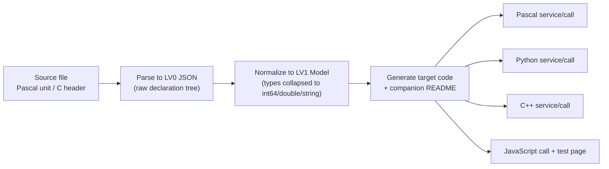

# LingoFuse-Tools

> **Code generation tools for the LingoFuse ecosystem**  
> Automatically convert Pascal / C function declarations into cross-language ABI, HTTP/JSON, and MCP binding code.

[LingoFuse](https://github.com/PassByYou888/LingoFuse) is a language-neutral, multi-threaded distributed RPC framework.  
[LingoFuse-pasAgent-v3](https://github.com/PassByYou888/LingoFuse-pasAgent-v3) provides the Agent and MCP runtime.  
**LingoFuse-Tools** is the companion code generator: start from a Pascal unit or C header, and generate multi-language service/call code plus synchronized README documentation in one step.

---

## Core Tools

This repository contains three independent code generators. They share the same parsing and generation backend but target different communication protocols:

| Tool | Directory | Generation Target | Protocol | Target Languages |
|------|-----------|-------------------|----------|------------------|
| **code_decl_to_abi** | `src/pascal_c_to_abi/` | ABI service / call | LingoFuse binary ABI | Pascal, Python, C++ |
| **code_decl_to_json_abi** | `src/pascal_c_to_json_abi/` | HTTP/JSON service / call | HTTP + JSON (via bridge) | Pascal, Python, C++, JavaScript |
| **code_decl_to_mcp** | `src/pascal_c_to_mcp/` | MCP tool provider | Model Context Protocol | Pascal, Python, C++ |

Each tool exposes **three entry points**:

- **CLI** — for scripts and CI
- **GUI** — for desktop interaction
- **MCP** — exposes the generation capability itself as MCP tools for AI Agents

---

## Workflow

All three tools follow the same pipeline:



- **Input**: A complete Pascal unit (with `interface` / `implementation`) or a C header (with include guard).
- **Output**: Code + Markdown README. Both are generated from the same `TPascal_Func_Model`, so **they never drift out of sync**.
- **Type whitelist**: Only integer, floating-point, and string families are supported. Other types (`Boolean`, `Variant`, arrays, records, classes, interfaces, enums, pointers, etc.) cause the entire declaration to be silently dropped.

---

## Quick Start

### 1. Build

Requires Free Pascal 3.2+ or Delphi 10.4+, and the `zCore` submodule must be initialized.

```bash
# Fetch submodules
git submodule update --init --recursive

# Build the three tools (using Lazarus as an example)
lazbuild -B src/pascal_c_to_abi/code_decl_to_abi.lpi
lazbuild -B src/pascal_c_to_json_abi/code_decl_to_json_abi.lpi
lazbuild -B src/pascal_c_to_mcp/code_decl_to_mcp.lpi
```

Or use `src/build.bat` on Windows.

### 2. Command Line Usage

```bash
# ABI: generate Pascal service from Pascal source
code_decl_to_abi calculator.pas calculator_service.pas
# Output: calculator_service.pas + calculator_service_readme.md

# ABI: generate Python call side
code_decl_to_abi --call calculator.pas calculator_call.py
# Output: calculator_call.py + calculator_call_readme.md

# JSON ABI: generate C++ service
code_decl_to_json_abi ComplexTestUnit.h calculator_service.hpp
# Output: calculator_service.hpp + calculator_service.cpp + calculator_service_readme.md

# MCP: generate Pascal tool provider
code_decl_to_mcp calculator.pas calculator_provider.pas
# Output: calculator_provider.pas + three READMEs (Pascal/Python/C++)
```

### 3. GUI Usage

Run the corresponding executable without arguments to open the graphical interface:

- Paste the source text
- Select the source language (Pascal / C)
- Click "Next" to complete parsing, normalization, and generation
- View all artifacts in the "Final Source" page; files are also written to `<exe_dir>/<UnitName>/`

### 4. MCP Integration

Each tool can act as an MCP tool provider and register with the `agent_main_app` beacon.  
For example, `code_decl_to_mcp` registers 22 tools covering:

- `SetSourceCode` / `SetModelJson` — input
- `GenerateAll` — generate all artifacts
- 17 readers such as `GetLastPascalServiceCode` — read on demand

Once the beacon and provider are running, an AI Agent can drive the entire generation workflow over MCP.

---

## Directory Structure

```
LingoFuse-Tools/
├── src/
│   ├── common/                     # Shared units (lingofuse_import, helper, etc.)
│   ├── pascal_c_to_abi/            # ABI generator (CLI + GUI + MCP)
│   ├── pascal_c_to_json_abi/       # HTTP/JSON generator
│   ├── pascal_c_to_mcp/            # MCP generator
│   └── zCore/                      # Z.Core dependency (submodule)
├── .gitmodules
├── LICENSE
└── README.md
```

---

## Documentation and Knowledge Base

Each tool comes with a detailed knowledge base in its directory:

- [`code_decl_to_abi_OPERATIONS.md`](src/pascal_c_to_abi/code_decl_to_abi_OPERATIONS.md) — Operational manual for the ABI tool
- [`code_decl_to_json_abi_knowledge_base.md`](src/pascal_c_to_json_abi/code_decl_to_json_abi_knowledge_base.md) — Complete reference for the HTTP/JSON tool
- [`code_decl_to_mcp_knowledge_base.md`](src/pascal_c_to_mcp/code_decl_to_mcp_knowledge_base.md) — MCP toolchain and LLM ecosystem guide

These documents cover API contracts, wire protocols, type mappings, common pitfalls, debugging methods, and extension guidelines for each tool.

---

## Related Repositories

| Repository | Description |
|------------|-------------|
| [LingoFuse](https://github.com/PassByYou888/LingoFuse) | Core RPC framework (C library) |
| [LingoFuse-pasAgent-v3](https://github.com/PassByYou888/LingoFuse-pasAgent-v3) | Pascal Agent / MCP gateway / LLM bridge |
| [ZNetV2 / ZCore](https://github.com/PassByYou888/LingoFuse-Tools/tree/main/src/zCore) | Submodule in this repo; provides core containers and concurrency primitives |

---

## License

[LICENSE](LICENSE) — consistent with the LingoFuse ecosystem.

---

**LingoFuse-Tools** — makes cross-language RPC binding generation simple, consistent, and automatable.