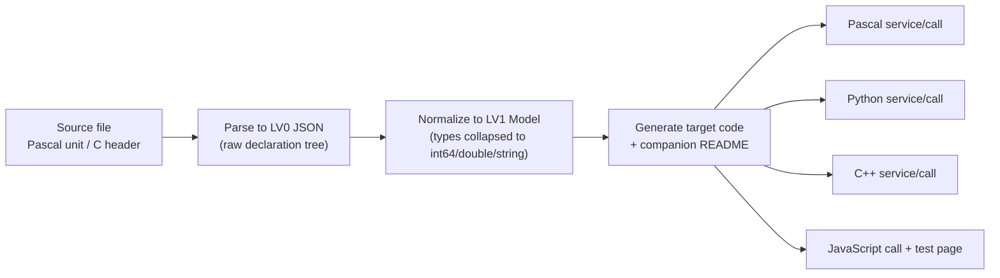

# LingoFuse-Tools

> **Code generation tools for the LingoFuse ecosystem**  
> Automatically convert Pascal / C function declarations into cross-language ABI, HTTP/JSON, and MCP binding code.

[LingoFuse](https://github.com/PassByYou888/LingoFuse) is a language-neutral, multi-threaded distributed RPC framework.  
[LingoFuse-pasAgent-v3](https://github.com/PassByYou888/LingoFuse-pasAgent-v3) provides the Agent and MCP runtime.  
**LingoFuse-Tools** is the companion code generator: start from a Pascal unit or C header, and generate multi-language service/call code plus synchronized README documentation in one step.

---

## What You Can Do With These Tools

Every tool in this repository supports **three equal entry points**, so the same generation capability can be driven by a human at the keyboard, by a script in CI, or by an AI agent over the network:

| Entry point | Who uses it | How it is invoked |
|-------------|-------------|-------------------|
| **GUI** | A human at the desktop | Launch the executable with no arguments; drive the tabs |
| **CLI** | Scripts, CI, batch conversion | Launch with arguments; drive file-to-file |
| **MCP API** | An AI agent | Register with the beacon; drive through MCP tool calls |

**The three entry points share the same backend.** Whichever you choose, you get identical output, identical type handling, and identical README companions.

---

## AI Takes Over the Interface: Feed It the Knowledge Base

Every tool ships with its **own knowledge base** — a self-contained Markdown document that describes the tool's complete contract in a form AI can consume directly:

- All API signatures, wire protocols, and type mappings.
- Every artifact the tool produces, and what each one is for.
- Known pitfalls, anti-patterns, and how to avoid them.
- Debugging trees, extension guides, and modification procedures.

**The design goal is simple**: once you feed the knowledge base of a tool to an AI agent, the agent can **take over the entire interface** — it can call the tool through MCP, drive the GUI on your behalf, or generate code from the CLI, all without ever reading the tool's source.

This means:

- **No manual interface documentation.** The knowledge base **is** the interface documentation.
- **No hand-written MCP wrappers.** Every tool already exposes its capability as MCP tools.
- **No drift between what the AI sees and what the tool does.** The knowledge base is generated from the same source that drives the generators.

If you want an AI to fully own the generation pipeline, **give it the tool's knowledge base and point it at the MCP API. Nothing else is needed.**

---

## Core Tools

This repository contains three independent code generators. They share the same parsing and generation backend but target different communication protocols:

| Tool | Directory | Generation Target | Protocol | Target Languages |
|------|-----------|-------------------|----------|------------------|
| **code_decl_to_abi** | `src/pascal_c_to_abi/` | ABI service / call | LingoFuse binary ABI | Pascal, Python, C++ |
| **code_decl_to_json_abi** | `src/pascal_c_to_json_abi/` | HTTP/JSON service / call | HTTP + JSON (via bridge) | Pascal, Python, C++, JavaScript |
| **code_decl_to_mcp** | `src/pascal_c_to_mcp/` | MCP tool provider | Model Context Protocol | Pascal, Python, C++ |

**Every one of these tools supports all three entry points.** For each tool you can:

- **Run it from the GUI** — paste a declaration, click through five tabs, see every artifact in editors.
- **Run it from the CLI** — pipe a file in, get code + README out, script it in CI.
- **Call it through MCP** — an AI agent registers the tool's own API with the beacon and drives the whole generation workflow remotely.

The tools themselves are also **MCP tool providers**: they register their generation capability as MCP tools, so an agent can invoke them the same way an agent invokes any other tool.

---

## Workflow

All three tools follow the same pipeline:



- **Input**: A complete Pascal unit (with `interface` / `implementation`) or a C header (with include guard).
- **Output**: Code + Markdown README. Both are generated from the same `TPascal_Func_Model`, so **they never drift out of sync**.
- **Type whitelist**: Only integer, floating-point, and string families are supported. Other types (`Boolean`, `Variant`, arrays, records, classes, interfaces, enums, pointers, etc.) cause the entire declaration to be silently dropped.

**The generated README is not optional.** Every artifact is paired with a Markdown companion that contains the test program, the interface reference, the build instructions, and — for C++ — the CMake script. **Read the generated `.md` first** whenever you are about to build, test, or deploy the artifact.

---

## Quick Start

### 1. Build

Requires Free Pascal 3.2+ or Delphi 10.4+, and the `zCore` submodule must be initialized.

```bash
# Fetch submodules
git submodule update --init --recursive

# Build the three tools (using Lazarus as an example)
lazbuild -B src/pascal_c_to_abi/code_decl_to_abi.lpi
lazbuild -B src/pascal_c_to_json_abi/code_decl_to_json_abi.lpi
lazbuild -B src/pascal_c_to_mcp/code_decl_to_mcp.lpi
```

Or use `src/build.bat` on Windows.

### 2. GUI Usage

Run any tool **without arguments** to open its graphical interface:

- Paste the source text.
- Select the source language (Pascal / C).
- Click "Next" through the five tabs to complete parsing, normalization, and generation.
- View every artifact (code + README) in the "Final Source" page.
- Files are also written to `<exe_dir>/<UnitName>/`.

The GUI is the same across all three tools; they differ only in the target languages and the protocol they emit.

### 3. Command Line Usage

Run any tool **with arguments** to enter CLI mode. No GUI is opened, no window is created; the tool goes straight from file to file.

```bash
# ABI: generate Pascal service from Pascal source
code_decl_to_abi calculator.pas calculator_service.pas
# Output: calculator_service.pas + calculator_service_readme.md

# ABI: generate Python call side
code_decl_to_abi --call calculator.pas calculator_call.py
# Output: calculator_call.py + calculator_call_readme.md

# JSON ABI: generate C++ service
code_decl_to_json_abi ComplexTestUnit.h calculator_service.hpp
# Output: calculator_service.hpp + calculator_service.cpp + calculator_service_readme.md

# MCP: generate Pascal tool provider
code_decl_to_mcp calculator.pas calculator_provider.pas
# Output: calculator_provider.pas + three READMEs (Pascal/Python/C++)
```

**Every tool supports CLI mode.** The source language is detected from the input file's extension; the target language is detected from the output file's extension. C++ targets automatically pair `.hpp` and `.cpp`. Every CLI run also writes a `<base>_readme.md` companion next to the generated code.

Run any tool with `--help` for the full CLI reference.

### 4. MCP Integration

Every tool is also **an MCP tool provider**. When the GUI is running, the tool automatically registers its capability with the `agent_main_app` beacon, exposing its generation workflow as MCP tools.

For example, `code_decl_to_mcp` registers 22 tools covering:

- `SetSourceCode` / `SetModelJson` — input
- `GenerateAll` — generate all artifacts
- 17 readers such as `GetLastPascalServiceCode` — read on demand

Once the beacon and provider are running, an AI agent can drive the **entire generation workflow** through MCP:

```
SetSourceCode(Source, Language)
GenerateAll()
GetLastPascalServiceCode()
GetLastPascalServiceReadme()
```

No GUI interaction, no CLI invocation — the agent calls the tool the same way it calls any other MCP tool.

**Combined with the tool's knowledge base, this makes the agent fully autonomous.** The knowledge base tells the agent *what* the tool does and *how* to sequence its calls; the MCP API lets the agent *execute* the workflow. Together they enable complete AI takeover of the generation pipeline.

---

## Directory Structure

```
LingoFuse-Tools/
├── src/
│   ├── common/                     # Shared units (lingofuse_import, helper, etc.)
│   ├── pascal_c_to_abi/            # ABI generator (GUI + CLI + MCP)
│   ├── pascal_c_to_json_abi/       # HTTP/JSON generator (GUI + CLI + MCP)
│   ├── pascal_c_to_mcp/            # MCP generator (GUI + CLI + MCP)
│   └── zCore/                      # Z.Core dependency (submodule)
├── .gitmodules
├── LICENSE
└── README.md
```

---

## Documentation and Knowledge Base

**Each tool ships with its own knowledge base** — a self-contained Markdown document written for both humans and AI agents. Feeding it to an AI is the recommended way to enable full AI takeover of that tool's interface.

| Tool | Knowledge base |
|------|----------------|
| `code_decl_to_abi` | [`code_decl_to_abi_OPERATIONS.md`](src/pascal_c_to_abi/code_decl_to_abi_OPERATIONS.md) |
| `code_decl_to_json_abi` | [`code_decl_to_json_abi_knowledge_base.md`](src/pascal_c_to_json_abi/code_decl_to_json_abi_knowledge_base.md) |
| `code_decl_to_mcp` | [`code_decl_to_mcp_knowledge_base.md`](src/pascal_c_to_mcp/code_decl_to_mcp_knowledge_base.md) |

Each knowledge base covers:

- **API contracts** — every tool function, every MCP tool, every CLI argument.
- **Wire protocols** — byte-level formats, type mappings, encoding rules.
- **Generated artifacts** — what each file is for, where it lives, how to build it.
- **Common pitfalls** — anti-patterns, silent-drop rules, cross-compiler hazards.
- **Debugging trees** — symptom → cause → fix for the most common failures.
- **Extension guides** — how to add a new target language, a new source language, or a new MCP tool.

Companion user guides:

- [`code_decl_to_abi_USER_GUIDE.md`](src/pascal_c_to_abi/code_decl_to_abi_USER_GUIDE.md) — GUI / CLI / MCP / programmatic interfaces for the ABI tool.
- [`code_decl_to_json_abi_USER_GUIDE.md`](src/pascal_c_to_json_abi/code_decl_to_json_abi_USER_GUIDE.md) — GUI / CLI / MCP / programmatic interfaces for the HTTP/JSON tool.
- [`code_generate_mcp.md`](src/pascal_c_to_mcp/code_generate_mcp.md) — full walkthrough of the MCP generation pipeline.

### How to give a tool to an AI

1. **Feed the tool's knowledge base to the agent.** This is the only documentation the agent needs.
2. **Point the agent at the MCP endpoint** (default `ipc:agent`).
3. **Let the agent drive.** It will discover the tools, sequence the calls, and produce the artifacts — no human in the loop.

Because the knowledge base and the MCP API are generated from the same source, **the agent's understanding and the tool's behavior can never diverge**.

---

## Related Repositories

| Repository | Description |
|------------|-------------|
| [LingoFuse](https://github.com/PassByYou888/LingoFuse) | Core RPC framework (C library) |
| [LingoFuse-pasAgent-v3](https://github.com/PassByYou888/LingoFuse-pasAgent-v3) | Pascal Agent / MCP gateway / LLM bridge |
| [ZNetV2 / ZCore](https://github.com/PassByYou888/LingoFuse-Tools/tree/main/src/zCore) | Submodule in this repo; provides core containers and concurrency primitives |

---

## License

[LICENSE](LICENSE) — consistent with the LingoFuse ecosystem.

---

**LingoFuse-Tools** — makes cross-language RPC binding generation simple, consistent, and automatable.  
**GUI, CLI, or MCP — the same tool, the same output, ready for a human or an AI to drive.**