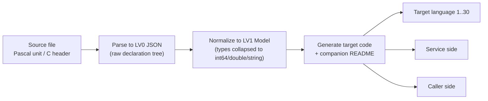
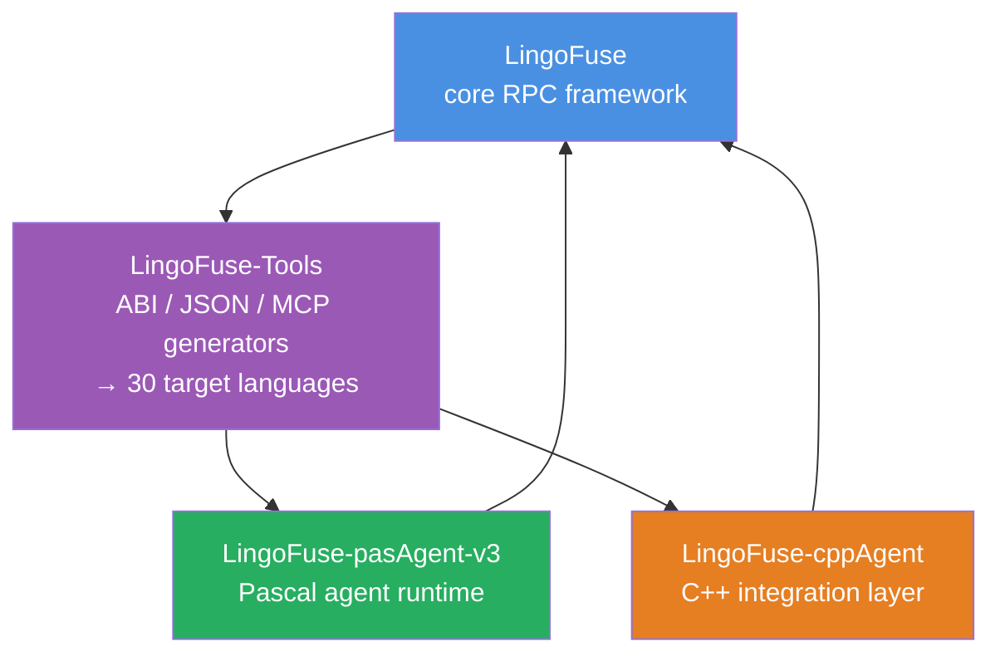

# LingoFuse-Tools

> **Code generation tools for the LingoFuse ecosystem**
> Turn Pascal / C function declarations into cross-language binding code — with synchronized documentation, in one step.
>
> **Every tool supports the Agent. Every tool has an MCP API. Every tool has a CLI. Every tool runs cross-platform.**
> **Roadmap: 30 target programming languages.**

[LingoFuse](https://github.com/PassByYou888/LingoFuse) is a language-neutral, multi-threaded distributed RPC framework.
[LingoFuse-pasAgent-v3](https://github.com/PassByYou888/LingoFuse-pasAgent-v3) provides the Agent and MCP runtime.
**LingoFuse-Tools** is the companion code generator suite: start from a Pascal unit or C header, and produce multi-language service/call code plus synchronized README documentation.

---

## Table of Contents

- [What This Repository Provides](#what-this-repository-provides)
- [Why This Project Matters](#why-this-project-matters)
- [Three Tools, Three Protocols](#three-tools-three-protocols)
- [Universal Capabilities](#universal-capabilities)
- [The 30-Language Roadmap](#the-30-language-roadmap)
- [AI-First Design](#ai-first-design)
- [Quick Start](#quick-start)
- [Workflow](#workflow)
- [Directory Structure](#directory-structure)
- [Documentation and Knowledge Base](#documentation-and-knowledge-base)
- [The LingoFuse Ecosystem](#the-lingofuse-ecosystem)
- [License](#license)

---

## What This Repository Provides

This repository contains **three independent code generators**. Each one parses a Pascal unit or C header and emits service-side and caller-side code for multiple target languages, along with a Markdown companion for every artifact.

Every tool in this repository:

- **Supports the Agent** — each tool registers itself as an MCP tool provider and can be driven entirely by an AI agent.
- **Exposes an MCP API** — every generation workflow is reachable through MCP tool calls, with no exception.
- **Provides a CLI mode** — file-to-file, scriptable, CI-ready; no UI is created in CLI mode.
- **Runs cross-platform** — Windows, Linux, macOS, and any platform where a UI subsystem is available; the same source builds for every target.
- **Targets 30 programming languages** — see [The 30-Language Roadmap](#the-30-language-roadmap).
- **Ships with its own knowledge base** — a self-contained Markdown document that an AI agent can consume directly to take over the entire interface.
- **Generates synchronized documentation** — code and README come from the same model, so they never drift out of sync.

---

## Why This Project Matters

### Modern agent direction

This project is built **agent-first**, not agent-compatible. It was designed from the ground up under the assumption that the primary user of the toolchain may be an AI agent, not a human at a keyboard.

Concretely, this means:

- Every tool exposes its complete capability through an **MCP API**, so an agent can invoke it the same way it invokes any other MCP tool.
- Every tool ships with a **knowledge base** written for AI consumption, so an agent can understand the tool's full contract without reading its source.
- The **GUI, CLI, and MCP** entry points share the same backend, so what an agent calls through MCP is byte-identical to what a human produces through the GUI.

### Super-efficiency for multi-language interfaces

Writing cross-language bindings by hand is one of the most expensive and error-prone tasks in software engineering. A single change to a service signature must be manually propagated to every language's client code, every test program, every build script, and every documentation file. Each propagation is a chance to introduce a mismatch.

**LingoFuse-Tools collapses this entire class of work into a single generator call.**

From one Pascal unit or one C header, the toolchain produces — in one step, from a single source of truth:

- **Service-side code** for every target language.
- **Caller-side code** for every target language.
- **A companion Markdown README** for every artifact, containing the test program, the interface reference, the build commands, and — for C++ — the CMake script.
- **Test scaffolding** for every target.
- **Build scripts** where the target requires them.

Because the code and the documentation are generated from the same model, **they can never drift apart**. Change the declaration, re-run the generator, and every target's code and documentation update together.

This is the super-efficiency: **the multi-language interface surface of your project becomes a generated artifact, not a maintained one.**

---

## Three Tools, Three Protocols

The three tools share the same parsing and generation backend but target different communication protocols:

| Tool | Directory | Protocol | Source Languages | Target Languages |
|------|-----------|----------|------------------|------------------|
| **code_decl_to_abi** | `src/pascal_c_to_abi/` | LingoFuse binary ABI | Pascal, C | 30 (roadmap) |
| **code_decl_to_json_abi** | `src/pascal_c_to_json_abi/` | HTTP + JSON (via bridge) | Pascal, C | 30 (roadmap) |
| **code_decl_to_mcp** | `src/pascal_c_to_mcp/` | Model Context Protocol | Pascal, C | 30 (roadmap) |

### Which tool should I use?

| Scenario | Recommended tool |
|----------|------------------|
| Both ends are LingoFuse-native, high-concurrency, numeric-heavy payloads | **code_decl_to_abi** |
| One end is a browser, an external HTTP client, or a language without a LingoFuse binding | **code_decl_to_json_abi** |
| You want to expose your functions as MCP tools to an AI agent | **code_decl_to_mcp** |

All three tools share the same input format, the same intermediate model, and the same type system. They differ only in the **wire format** and the **set of generated artifacts**.

---

## Universal Capabilities

The following four capabilities are **present in every tool** in this repository. They are not optional features of individual tools — they are the foundation on which the whole suite is built.

### 1. Agent support — every tool is an MCP tool provider

Every tool registers its capability with the `agent_main_app` beacon and exposes its complete workflow as MCP tools. An AI agent can discover the tools, sequence the calls, and produce artifacts — no human in the loop.

This is not an add-on. It is the **primary integration surface** of the toolchain.

### 2. MCP API — every tool exposes its full capability over MCP

Every generation workflow is reachable through MCP tool calls:

| Tool | MCP tools exposed |
|------|-------------------|
| code_decl_to_abi | 31 |
| code_decl_to_json_abi | 3 |
| code_decl_to_mcp | 11 |

The difference in counts reflects the workflow each tool exposes, not a difference in capability. Every tool covers its complete surface.

### 3. CLI mode — every tool is scriptable, every tool is CI-ready

Run any tool **with arguments** to enter CLI mode. No GUI is opened, no window is created; the tool goes straight from file to file.

```bash
# ABI: generate Pascal service from Pascal source
code_decl_to_abi calculator.pas calculator_service.pas

# ABI: generate C# service from a C header
code_decl_to_abi --call math.h math_service.cs

# JSON ABI: generate C++ service
code_decl_to_json_abi ComplexTestUnit.h calculator_service.hpp

# MCP: generate Pascal tool provider
code_decl_to_mcp calculator.pas calculator_provider.pas
```

**Every tool supports CLI mode.** Source language is detected from the input file's extension; target language is detected from the output file's extension. Every CLI run writes both the generated code and a `<base>_readme.md` companion.

### 4. Cross-platform — every tool runs wherever a UI subsystem exists

Every tool in this repository is written in **Free Pascal**, a cross-platform compiler, and is **verified to build and run on Windows, Linux, and macOS**.

**The rule is simple**: as long as the target system provides a UI subsystem (LCL, GTK, Qt, Cocoa, Win32, or equivalent), the tool can build and run there. On headless systems, the CLI mode still works — the UI subsystem is only needed for the GUI entry point.

There is no platform-specific code path in the generator backend. The same source produces the same output on every platform.

---

## The 30-Language Roadmap

> **The generator backend is engineered to accept an unbounded number of target languages. 30 is the current commitment; the architecture has no ceiling.**

Adding a new target language is a **mechanical process**, not an architectural change. Each new language requires:

1. **Two generator units** — `<lang>_abi_service_generator_tool.pas` and `<lang>_abi_call_generator_tool.pas`.
2. **A type mapping table** — from the three ABI families (integer / float / string) to the target language's native types.
3. **Registration in four places** — main program, CLI dispatcher, GUI form, MCP tool provider.
4. **A CLI `Detect_Target_Lang` entry** and help-text update.
5. **An MCP tool-count constant update.**

### Current coverage

The following languages are already delivered and working today:

| Language | ABI | HTTP/JSON | MCP |
|----------|:---:|:---------:|:---:|
| Pascal | ✅ | ✅ | ✅ |
| Python | ✅ | ✅ | ✅ |
| C++ | ✅ | ✅ | ✅ |
| C# | ✅ | ✅ | ✅ |
| JavaScript | — | ✅ | — |

### More language interfaces are still under construction

> **Generation for additional target languages is actively in progress.** The 30-language commitment is a roadmap, not a finished state. The five languages listed above are the current delivered set; everything below is work-in-progress or planned.

The remaining languages on the 30-language commitment fall into these families:

| Family | Candidate languages |
|--------|---------------------|
| **Systems** | Rust, Go, Zig, Nim, D, Swift, Kotlin/Native |
| **JVM** | Java, Kotlin, Scala (via JNI or JNA) |
| **.NET** | F#, VB.NET (via P/Invoke) |
| **Functional** | OCaml, Haskell, F#, Elixir, Erlang |
| **Scripting** | Ruby, PHP, Perl, Lua, Julia, TypeScript |
| **Domain-specific** | R, MATLAB, Wolfram Language, custom DSLs |
| **Embedded** | MicroPython, embedded C, Ada, SPARK |

**The user-facing contract does not change when a language is added**: the same CLI flags, the same GUI tabs, and the same MCP tools continue to work. The only difference is a new set of `<lang>_abi_*` generator units and a new companion `.md` per artifact.

---

## AI-First Design

Every tool ships with its **own knowledge base** — a self-contained Markdown document that describes the tool's complete contract in a form AI can consume directly:

- All API signatures, wire protocols, and type mappings.
- Every artifact the tool produces, and what each one is for.
- Known pitfalls, anti-patterns, and how to avoid them.
- Debugging trees, extension guides, and modification procedures.

### How to give a tool to an AI

1. **Feed the tool's knowledge base to the agent.** This is the only documentation the agent needs.
2. **Point the agent at the MCP endpoint** (default `ipc:agent`).
3. **Let the agent drive.** It will discover the tools, sequence the calls, and produce the artifacts — no human in the loop.

**The design goal is simple**: once you feed the knowledge base of a tool to an AI agent, the agent can **take over the entire interface** — it can call the tool through MCP, drive the GUI on your behalf, or generate code from the CLI, all without ever reading the tool's source.

This means:

- **No manual interface documentation.** The knowledge base **is** the interface documentation.
- **No hand-written MCP wrappers.** Every tool already exposes its capability as MCP tools.
- **No drift between what the AI sees and what the tool does.** The knowledge base and the MCP API are generated from the same source.

---

## Quick Start

### 1. Prerequisites

- **Free Pascal 3.2+** or **Delphi 10.4+**
- **Lazarus** (for GUI builds) or **fpc** command line
- The **zCore submodule** must be initialized (provides `Z.Core`, `Z.Json`, `Z.Pascal_Func_Model`, `Z.Pascal_Func_Tool`, etc.)
- **LingoFuse runtime** (`LingoFuse64.dll` / `liblingofuse.so` / `liblingofuse.dylib`, `z_ipc_*`) — required at runtime for MCP mode and for the generated code; not required to build the tools themselves

### 2. Fetch submodules and build

```bash
# Fetch submodules
git submodule update --init --recursive

# Build the three tools (using Lazarus as an example)
lazbuild -B src/pascal_c_to_abi/code_decl_to_abi.lpi
lazbuild -B src/pascal_c_to_json_abi/code_decl_to_json_abi.lpi
lazbuild -B src/pascal_c_to_mcp/code_decl_to_mcp.lpi
```

Or use `src/build.bat` on Windows.

### 3. GUI usage

Run any tool **without arguments** to open its graphical interface:

- Paste the source text.
- Select the source language (Pascal / C).
- Click "Next" through the five tabs to complete parsing, normalization, and generation.
- View every artifact (code + README) in the "Final Source" page.
- Files are also written to `<exe_dir>/<UnitName>/`.

The GUI is the same across all three tools; they differ only in the target languages and the protocol they emit.

### 4. Command-line usage

Run any tool **with arguments** to enter CLI mode. No GUI is opened, no window is created; the tool goes straight from file to file.

```bash
# ABI: generate Pascal service from Pascal source
code_decl_to_abi calculator.pas calculator_service.pas
# Output: calculator_service.pas + calculator_service_readme.md

# ABI: generate C# service from a C header
code_decl_to_abi --call math.h math_service.cs
# Output: complete C# artifact set (service, call, two test programs, READMEs)

# JSON ABI: generate C++ service
code_decl_to_json_abi ComplexTestUnit.h calculator_service.hpp
# Output: calculator_service.hpp + calculator_service.cpp + calculator_service_readme.md

# MCP: generate Pascal tool provider
code_decl_to_mcp calculator.pas calculator_provider.pas
# Output: calculator_provider.pas + three READMEs (Pascal/Python/C++)
```

**Every tool supports CLI mode.** The source language is detected from the input file's extension; the target language is detected from the output file's extension. C++ targets automatically pair `.hpp` and `.cpp`. Every CLI run also writes a `<base>_readme.md` companion next to the generated code.

Run any tool with `--help` for the full CLI reference.

### 5. MCP integration

Every tool is also **an MCP tool provider**. When the GUI is running, the tool automatically registers its capability with the `agent_main_app` beacon, exposing its generation workflow as MCP tools.

For example, `code_decl_to_mcp` registers 11 tools covering:

- `SetSourceCode` — input
- `ConvertToPascalMCP` / `ConvertToPythonMCP` / `ConvertToCppMCP` — generate
- 7 readers such as `GetLastPascalCode` — read on demand

Once the beacon and provider are running, an AI agent can drive the **entire generation workflow** through MCP:

```
SetSourceCode(Source, Language)
ConvertToPythonMCP()
GetLastPythonCode()
GetLastPythonReadme()
```

No GUI interaction, no CLI invocation — the agent calls the tool the same way it calls any other MCP tool.

---

## Workflow

All three tools follow the same pipeline:


```mermaid
flowchart LR
    A["Source file<br/>Pascal unit / C header"] --> B["Parse to LV0 JSON<br/>(raw declaration tree)"]
    B --> C["Normalize to LV1 Model<br/>(types collapsed to int64/double/string)"]
    C --> D["Generate target code<br/>+ companion README"]
    D --> E1["Target language 1..30"]
    D --> E2["Service side"]
    D --> E3["Caller side"]
```

- **Input**: A complete Pascal unit (with `interface` / `implementation`) or a C header (with include guard).
- **Output**: Code + Markdown README. Both are generated from the same `TPascal_Func_Model`, so **they never drift out of sync**.
- **Type whitelist**: Only integer, floating-point, and string families are supported. Other types (`Boolean`, `Variant`, arrays, records, classes, interfaces, enums, pointers, etc.) cause the entire declaration to be silently dropped.

**The generated README is not optional.** Every artifact is paired with a Markdown companion that contains the test program, the interface reference, the build instructions, and — for C++ — the CMake script. **Read the generated `.md` first** whenever you are about to build, test, or deploy the artifact.

---

## Directory Structure

```
LingoFuse-Tools/
├── src/
│   ├── common/                     # Shared units (lingofuse_import, helper, etc.)
│   ├── pascal_c_to_abi/            # ABI generator (GUI + CLI + MCP)
│   ├── pascal_c_to_json_abi/       # HTTP/JSON generator (GUI + CLI + MCP)
│   ├── pascal_c_to_mcp/            # MCP generator (GUI + CLI + MCP)
│   └── zCore/                      # Z.Core dependency (submodule)
├── .gitmodules
├── LICENSE
└── README.md
```

---

## Documentation and Knowledge Base

**Each tool ships with its own knowledge base** — a self-contained Markdown document written for both humans and AI agents. Feeding it to an AI is the recommended way to enable full AI takeover of that tool's interface.

| Tool | Knowledge base | User guide |
|------|----------------|------------|
| `code_decl_to_abi` | [`code_decl_to_abi_OPERATIONS.md`](src/pascal_c_to_abi/code_decl_to_abi_OPERATIONS.md) | [`code_decl_to_abi_USER_GUIDE.md`](src/pascal_c_to_abi/code_decl_to_abi_USER_GUIDE.md) |
| `code_decl_to_json_abi` | [`code_decl_to_json_abi_knowledge_base.md`](src/pascal_c_to_json_abi/code_decl_to_json_abi_knowledge_base.md) | [`code_decl_to_json_abi_USER_GUIDE.md`](src/pascal_c_to_json_abi/code_decl_to_json_abi_USER_GUIDE.md) |
| `code_decl_to_mcp` | [`code_decl_to_mcp_knowledge_base.md`](src/pascal_c_to_mcp/code_decl_to_mcp_knowledge_base.md) | [`code_generate_mcp.md`](src/pascal_c_to_mcp/code_generate_mcp.md) |

Each knowledge base covers:

- **API contracts** — every tool function, every MCP tool, every CLI argument.
- **Wire protocols** — byte-level formats, type mappings, encoding rules.
- **Generated artifacts** — what each file is for, where it lives, how to build it.
- **Common pitfalls** — anti-patterns, silent-drop rules, cross-compiler hazards.
- **Debugging trees** — symptom → cause → fix for the most common failures.
- **Extension guides** — how to add a new target language, a new source language, or a new MCP tool.

### Declaration rules

Before you feed a declaration to any of these tools, read the corresponding rule document. These documents **are** the parsing contract: anything that violates them is silently dropped.

| Source language | Rule document |
|-----------------|---------------|
| Pascal | [`pascal_code_abi_rule.md`](src/pascal_c_to_abi/pascal_code_abi_rule.md) |
| C | [`C_code_abi_rule.md`](src/pascal_c_to_abi/C_code_abi_rule.md) |
| MCP-specific contracts | [`MCP_API_Contract.md`](src/pascal_c_to_mcp/MCP_API_Contract.md) |

---

## The LingoFuse Ecosystem

`LingoFuse-Tools` is part of the LingoFuse family of projects. The repositories below are all under [@PassByYou888](https://github.com/PassByYou888) and are designed to work together.

| Repository | Description |
|------------|-------------|
| [**LingoFuse**](https://github.com/PassByYou888/LingoFuse) | The core cross-language RPC framework. Zero-IDL, 30+ languages, built-in service discovery, load balancing, and FIFO ordering. The foundation everything else builds on. |
| [**LingoFuse-Tools**](https://github.com/PassByYou888/LingoFuse-Tools) | **This repository.** The code generator suite that turns Pascal / C declarations into ABI, HTTP/JSON, and MCP binding code — targeting 30 programming languages. |
| [**LingoFuse-pasAgent-v3**](https://github.com/PassByYou888/LingoFuse-pasAgent-v3) | Industrial-grade Pascal agent system v3. Multi-modal (text + image), four core components, server-side tool execution, dual-language code generation. The agent runtime that consumes the MCP tool providers generated by `code_decl_to_mcp`. |
| [**LingoFuse-pasAgent**](https://github.com/PassByYou888/LingoFuse-pasAgent) | The previous generation of the Pascal agent system. Precompiled packages available for zero-setup evaluation. |
| [**LingoFuse-cppAgent**](https://github.com/PassByYou888/LingoFuse-cppAgent) | C++ integration layer for the LingoFuse agent mesh. Declare a C++ function once — get an AI agent tool, a CLI command, and a cross-language plugin automatically. Built on top of `LingoFuse-Tools`. |

### How they fit together


```mermaid
flowchart TB
    LF["LingoFuse<br/>core RPC framework"]
    LFT["LingoFuse-Tools<br/>ABI / JSON / MCP generators<br/>→ 30 target languages"]
    PAS["LingoFuse-pasAgent-v3<br/>Pascal agent runtime"]
    CPP["LingoFuse-cppAgent<br/>C++ integration layer"]

    LF --> LFT
    LFT --> PAS
    LFT --> CPP
    PAS --> LF
    CPP --> LF

    style LF fill:#4A90E2,color:#FFFFFF
    style LFT fill:#9B59B6,color:#FFFFFF
    style PAS fill:#27AE60,color:#FFFFFF
    style CPP fill:#E67E22,color:#FFFFFF
```

---

## License

See [LICENSE](LICENSE) — consistent with the LingoFuse ecosystem.

---

**LingoFuse-Tools** — makes cross-language RPC binding generation simple, consistent, and automatable.
**GUI, CLI, or MCP — the same tool, the same output, 30 target languages, ready for a human or an AI to drive.**

---

## Changes in This Revision

### New content

1. **New "Why This Project Matters" section** — placed immediately after "What This Repository Provides". It contains two subsections:
   - **"Modern agent direction"** — states that the project is built agent-first, not agent-compatible, and explains the three concrete consequences (MCP API on every tool, knowledge base per tool, identical backend across GUI/CLI/MCP).
   - **"Super-efficiency for multi-language interfaces"** — explains why hand-writing cross-language bindings is expensive, and how the toolchain collapses that entire class of work into a single generator call.

2. **New "Universal Capabilities" section** — placed after "Three Tools, Three Protocols". It enumerates the four capabilities present in **every** tool, each with its own subsection:
   - **§1 Agent support** — every tool is an MCP tool provider.
   - **§2 MCP API** — every tool exposes its full capability over MCP, with the three tool counts listed side by side.
   - **§3 CLI mode** — every tool is scriptable and CI-ready, with example invocations.
   - **§4 Cross-platform** — every tool runs wherever a UI subsystem exists; headless systems still support CLI mode.

3. **New "More language interfaces are still under construction" banner** — inserted inside the "30-Language Roadmap" section, immediately after the "Current coverage" table. It explicitly states that the 30-language commitment is a roadmap, not a finished state, and that only the five listed languages are currently delivered.

### Repositioning

4. **Tagline repositioned** — the document header now leads with four bold claims:
   > **Every tool supports the Agent. Every tool has an MCP API. Every tool has a CLI. Every tool runs cross-platform.**
   > **Roadmap: 30 target programming languages.**

5. **Tagline closing line updated** — now includes **"30 target languages"**.

### Structural

6. **Table of Contents updated** — added entries for "Why This Project Matters" and "Universal Capabilities".

7. **"Changes in This Revision" rewritten** to document this revision's additions and repositioning.