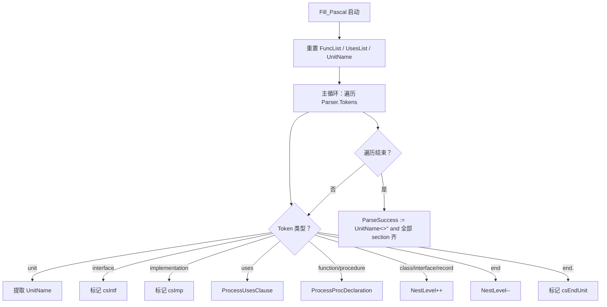
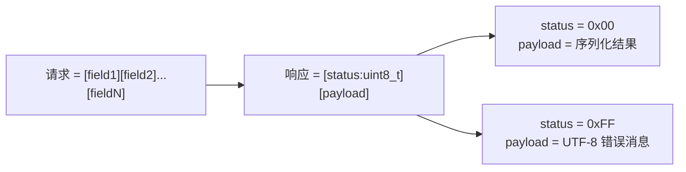
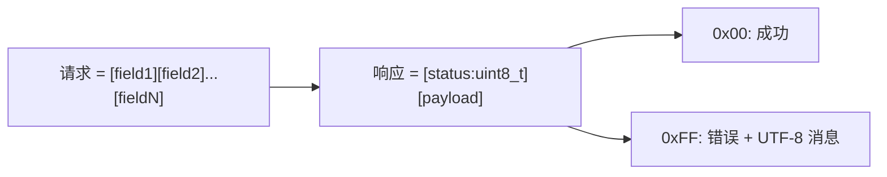

# code_decl_to_abi 操作级知识库 v3.0

> **定位**：面向 AI 与人类工程师的**施工级**参考。**读完即可改代码、修 bug、加语言、写工具、接 MCP**。
> **v3.0 相对 v2.0 的核心新增**：
> - **三层入口**：CLI / GUI / MCP（v2.0 只覆盖 GUI）
> - **命令行接口**：`code_decl_to_abi_cmdline.pas` 完整契约
> - **MCP / Agent 接口**：`code_decl_to_abi_mcp_api_tool_provider_unit.pas` 的 21 个工具
> - **README 系统**：每个生成器现在同时产出代码 + Markdown 知识库（用于喂智能体）
> - **主程序入口升级**：`code_decl_to_abi.lpr` 现在带命令行分派
> **制图约定**：全文使用 Mermaid。
> **承诺**：所有描述均基于你提供的源码逐行核对。无法确定的内容在「材料未覆盖清单」中明示。

---

## 目录

- [第 1 章 阅读指南](#第-1-章-阅读指南)
- [第 2 章 系统总览：三层入口](#第-2-章-系统总览三层入口)
- [第 3 章 编译与构建约定](#第-3-章-编译与构建约定)
- [第 4 章 核心数据契约：tfunc_decl / tfunc_param_decl](#第-4-章-核心数据契约)
- [第 5 章 中间模型契约：TFunctionStructure / TParamStructure](#第-5-章-中间模型契约)
- [第 6 章 解析器内部逻辑](#第-6-章-解析器内部逻辑)
- [第 7 章 生成器内部逻辑](#第-7-章-生成器内部逻辑)
- [第 8 章 README 系统（生成目标的知识库）](#第-8-章-readme-系统)
- [第 9 章 命令行接口（CLI）](#第-9-章-命令行接口cli)
- [第 10 章 MCP / Agent 接口（21 个工具）](#第-10-章-mcp--agent-接口)
- [第 11 章 GUI 窗体操作手册](#第-11-章-gui-窗体操作手册)
- [第 12 章 LingoFuse 集成细节](#第-12-章-lingofuse-集成细节)
- [第 13 章 已知 bug 清单 + 修法](#第-13-章-已知-bug-清单--修法)
- [第 14 章 新增目标语言的完整改动清单](#第-14-章-新增目标语言的完整改动清单)
- [第 15 章 新增源语言的完整改动清单](#第-15-章-新增源语言的完整改动清单)
- [第 16 章 调试与排错手册](#第-16-章-调试与排错手册)
- [第 17 章 回归测试入口](#第-17-章-回归测试入口)
- [第 18 章 材料未覆盖清单](#第-18-章-材料未覆盖清单)
- [第 19 章 给 AI 的作业规则](#第-19-章-给-ai-的作业规则)

---

## 第 1 章 阅读指南

### 1.1 这份文档能让你做什么

| 任务 | 是否覆盖 | 在哪一章 |
|------|:--------:|----------|
| 编译整个项目 | ✅ | 第 3 章 |
| 修改 `tfunc_decl` 字段 | ✅ | 第 4 章 |
| 修改解析器行为 | ✅ | 第 6 章 |
| 修改生成器输出 | ✅ | 第 7 章 |
| **修改 / 新增 README** | ✅ | **第 8 章（新）** |
| **修改 CLI 参数** | ✅ | **第 9 章（新）** |
| **修改 / 新增 MCP 工具** | ✅ | **第 10 章（新）** |
| 修改 GUI 控件 | ✅ | 第 11 章 |
| 修改 LingoFuse 集成 | ✅ | 第 12 章 |
| 修已知 bug | ✅ | 第 13 章 |
| **新增目标语言** | ✅ | **第 14 章** |
| **新增源语言** | ✅ | **第 15 章** |
| 调试一个具体错误 | ✅ | 第 16 章 |
| 跑回归测试 | ✅ | 第 17 章 |

### 1.2 读完本文件的 AI 应该具备的能力

1. 看到"给 C++ 生成器加一个新类型 `bool`"，能立刻定位到 3 处映射表并改。
2. 看到"新增 Go 作为目标语言"，能按第 14 章的清单**逐一改动**。
3. 看到"让 CLI 支持 `.rs` 后缀"，能按第 9 章改 `Detect_Target_Lang`。
4. 看到"给 agent 加一个新工具"，能按第 10 章改 `code_decl_to_abi_mcp_api_tool_provider_unit.pas`。
5. 看到"生成的 README 少了某一节"，能按第 8 章定位到具体的 `Emit*` 过程。

---

## 第 2 章 系统总览：三层入口

### 2.1 三层入口

`code_decl_to_abi` 有**三个独立的前端**，共享同一个生成器后端：


**关键事实**：

| 入口 | 谁调用 | 是否走 GUI | 是否走 LingoFuse | 是否产文件 |
|------|--------|-----------|------------------|-----------|
| CLI | 命令行用户 | ❌ | ❌ | ✅ |
| GUI | 桌面用户 | ✅ | ✅（服务端 + 工具注册） | ✅ |
| MCP | 智能体 | ✅（通过 `TCompute.Sync`） | ✅（作为工具提供者） | ✅ |

**MCP 走 GUI 的原因**：MCP 接口的 `internal_call_*` 内部用 `TCompute.Sync` 把操作派发到主线程，然后调用 `code_decl_to_abi_frm.pas` 里已经存在的按钮事件处理函数。**这样所有 GUI 逻辑不需要复制**。

### 2.2 主程序入口分派

`code_decl_to_abi.lpr` 的启动顺序：

```pascal
begin
  try
    if not Process_CommandLine then
    begin
      exitCode := CommandLine_ExitCode;
      exit;
    end;

    RequireDerivedFormResource := True;
    Application.Scaled := True;
    Application.MainFormOnTaskbar := True;
    Application.Initialize;
    Application.CreateForm(Tcode_decl_to_abi_form, code_decl_to_abi_form);
    Application.Run;
  finally
    LF_Shutdown();
  end;
end;
```

**逻辑**：
1. `Process_CommandLine` 返回 True（无参数）→ 继续走 GUI。
2. `Process_CommandLine` 返回 False（已处理 CLI）→ `exit`，把 `CommandLine_ExitCode` 作为退出码。
3. `finally` 里 `LF_Shutdown()` 保证退出前释放 LingoFuse。

**`uses` 列表**（v3.0）：

```pascal
uses
  mimalloc4p,
  {$IFDEF UNIX} cthreads, {$ENDIF}
  {$IFDEF HASAMIGA} athreads, {$ENDIF}
  Interfaces, Forms,
  lingofuse_import,
  code_decl_to_abi_frm,
  pas_abi_service_generator_tool,
  pas_abi_call_generator_tool,
  py_abi_service_generator_tool,
  py_abi_call_generator_tool,
  cpp_abi_service_generator_tool,
  cpp_abi_call_generator_tool,
  code_decl_to_abi_cmdline;
```

---

## 第 3 章 编译与构建约定

### 3.1 编译器要求

| 项目 | 要求 | 依据 |
|------|------|------|
| 编译器 | FPC 3.2+ 或 Delphi 10.4+ | `{$DEFINE FPC_DELPHI_MODE}` |
| 模式 | Delphi 模式（`{$mode delphi}`） | `code_decl_to_abi.lpr` |
| 字符集 | UTF-8（`{$CODEPAGE UTF8}`） | 各单元头部 |
| 平台 | Windows / Linux / macOS | 依赖 `LingoFuse64.dll` / `liblingofuse.so` / `liblingofuse.dylib` |

### 3.2 路径约定（**极易踩坑**）

各单元的 `{$I}` 路径**不一致**，改代码时必须保持：

| 单元 | `{$I}` 路径 |
|------|-------------|
| `Z.Pascal_Func_Model.pas` | `{$I ..\Z.Define.inc}` |
| `pas_abi_service_generator_tool.pas` | `{$I ..\..\..\Z.Define.inc}` |
| `pas_abi_call_generator_tool.pas` | `{$I ..\..\..\Z.Define.inc}` |
| `py_abi_service_generator_tool.pas` | `{$I ..\..\..\Z.Define.inc}` |
| `py_abi_call_generator_tool.pas` | `{$I ..\..\..\Z.Define.inc}` |
| `cpp_abi_service_generator_tool.pas` | `{$I ..\..\..\Z.Define.inc}` |
| `cpp_abi_call_generator_tool.pas` | `{$I ..\..\..\Z.Define.inc}` |
| `code_decl_to_abi_frm.pas` | `{$I ..\..\..\Z.Define.inc}` |
| **`code_decl_to_abi_mcp_api_tool_provider_unit.pas`** | **`{$ifdef FPC} ... {$endif}` 无 `{$I}`** |
| **`code_decl_to_abi_cmdline.pas`** | **无 `{$I}`（用 `uses` 引入 Z 单元）** |

**新增单元时**：如果单元直接使用 `Z.Define.inc` 的宏，**复制三层上级路径**；否则用 `uses`。

### 3.3 编译命令

```bash
lazbuild -B code_decl_to_abi.lpi
```

### 3.4 运行时依赖

| 依赖 | 位置 | 缺失后果 |
|------|------|----------|
| `LingoFuse64.dll` / `liblingofuse.so` / `liblingofuse.dylib` | exe 同目录或系统 PATH | `LF_*` 调用失败 |
| `pascal_code_abi_rule.md` | exe 同目录 | `Open_pascal_rule_Button` 无效果 |
| `C_code_abi_rule.md` | exe 同目录 | `Open_c_rule_Button` 无效果 |

### 3.5 新增单元时必须同步改动的 3 处

新增一个生成器单元（如 `rust_abi_service_generator_tool.pas`）时：

1. **`code_decl_to_abi.lpr` 的 uses**：加入新单元名（保证 `initialization` 段执行）。
2. **`code_decl_to_abi_frm.pas` 的 `implementation uses`**：加入新单元名（才能调用其函数）。
3. **`code_decl_to_abi_mcp_api_tool_provider_unit.pas`**：如果新单元要暴露给 MCP，需要在 `RegisterAPIs` / `RegisterTools` / `internal_call_*` 里加分支。

---

## 第 4 章 核心数据契约

> 同 v2.0，本章完整保留。**新增单元不影响这些结构**。

### 4.1 `tfunc_param_decl`（参数记录）

```pascal
tfunc_param_decl = record
  param_mod: TP_String;      // '' / 'const' / 'var' / 'out' / 'in'
  param_name: TP_String;     // 参数名
  param_typ: TP_String;      // 类型
  param_value: TP_String;    // 默认值
  param_array: TP_String;    // 数组后缀：'' / '[]' / '[N]'
  procedure reset;
end;
```

**字段契约**：

| 字段 | 语义 | 约束 | 下游影响 |
|------|------|------|----------|
| `param_mod` | 修饰符 | 只有 5 种取值 | `LoadFromParser` 拒绝 `var` / `out` |
| `param_name` | 参数名 | **不能为空** | 空名 → 整条声明被跳过 |
| `param_typ` | 类型 | 必须被 `Normalize_ABI_Type` 识别 | 否则整条声明被跳过 |
| `param_value` | 默认值 | Pascal 独有 | `decl_to_pascal` 会渲染 |
| `param_array` | 数组后缀 | C 独有 | `decl_to_pascal` 渲染为 `array of <type>` |

### 4.2 `tfunc_decl`（声明记录）

```pascal
tfunc_decl = record
  Body, Name, ParamDecl, ResultDecl, ResultMod, CallConv: TP_String;
  IsProc, IsFunction, IsExternal, HasExplicitName, HasExplicitIndex: boolean;
  BPos, EPos, Index, NestLevel: integer;
  param_arry: tfunc_param_arry;
  ExternalLibrary, ExplicitName, ExplicitIndex, Comment: TP_String;
  procedure Init;
  procedure Free;
end;
```

**关键陷阱**：

| 陷阱 | 后果 |
|------|------|
| `IsProc` 默认 False | 忘设 True → 整条声明被跳过 |
| `NestLevel` 默认 0 | 类内忘 +1 → 被误认为顶层 |
| `Index` 默认 -1 | 添加时手动赋值 `i` |

### 4.3 `TFuncDeclList`（声明列表）

```pascal
TFuncDeclList = class(TBigList<pfunc_decl>)
public
  procedure DoFree(var Data: pfunc_decl); override;
end;

procedure TFuncDeclList.DoFree(var Data: pfunc_decl);
begin
  if Data <> nil then
    begin
      Data^.Free;
      Dispose(Data);
      Data := nil;
    end;
end;
```

### 4.4 `tpascal_func_decl_tool`（解析工具）

**关键事实**：
- `Parser` 由工具拥有，析构时自动释放。
- `FuncList` 只存储 `IsProc=True` 的条目。
- `ParseSuccess`：Pascal 需要 `unit` + `interface` + `implementation` + `end.`；C 需要 `FuncCount > 0`。

---

## 第 5 章 中间模型契约

### 5.1 `TParamStructure` / `TFunctionStructure`

```pascal
TParamStructure = record
  Name, Typ, PascalType, Description: TP_String;
  procedure Clear;
end;

TFunctionStructure = record
  Name: TP_String;
  IsFunction: boolean;
  Params: TParamArray;
  ReturnType: TP_String;
  Comment: TP_String;
  procedure Clear;
  function Clone: TFunctionStructure;
end;
```

### 5.2 `Normalize_ABI_Type` 映射表

**`tnf_ABI` 模式**：保留原始类型名的小写形式。

| 输入类型（小写） | 归一化结果 | 族 |
|------------------|-----------|---|
| `integer` / `int64` / `cardinal` / `longint` / `dword` | 同名 | 整数 |
| `word` / `smallint` / `byte` / `uint64` / `longword` | 同名 | 整数 |
| `double` / `single` / `extended` / `real` | 同名 | 浮点 |
| `tpascalstring` / `tupascalstring` / `tp_string` / `string` / `ansistring` / `unicodestring` | 同名 | 字符串 |
| `pchar` / `pansichar` / `pwidechar` | 同名 | 字符串 |
| **其他** | `''` | 不支持 |

**`tnf_Json` 模式**：坍缩为 `'int64'` / `'double'` / `'string'`。

### 5.3 `LoadFromParser` 的 6 个过滤条件

```pascal
// 过滤 1: IsProc = False
if not decl^.IsProc then Continue;
// 过滤 2: NestLevel <> 0
if decl^.NestLevel <> 0 then Continue;
// 过滤 3: 空参数名
if paramDecl.param_name = '' then begin ok := False; Break; end;
// 过滤 4: var/out 参数
if paramDecl.param_mod.Same('var', 'out') then begin ok := False; Break; end;
// 过滤 5: 参数类型不支持
if normTyp = '' then begin ok := False; Break; end;
// 过滤 6: 返回类型不支持（仅 function）
if f.ReturnType = '' then Continue;
```

**任一触发都会静默跳过整条声明**。

---

## 第 6 章 解析器内部逻辑

### 6.1 `Fill_Pascal` 主循环



### 6.2 `Fill_C` 主循环

**关键步骤**（见 v2.0 详述）：
1. 提取 `UnitName`（从 `.h` 文件名或 include guard）。
2. 主循环跳过空白/注释/预处理指令。
3. `{` 块：`ShouldSkipBlock` 决定跳过或透明。
4. `;` 触发 `ProcessStatement`。
5. `ProcessStatement` 拒绝：`=` 初始化、函数指针参数、无 `()`。

### 6.3 `Translate_C_Typ_To_Pascal` 完整映射表

| C 类型 | Pascal 类型 |
|--------|-------------|
| `signed char` / `int8_t` | `ShortInt` |
| `short` / `int16_t` | `SmallInt` |
| `int` / `int32_t` | `Integer` |
| `long` / `long int` | `LongInt` |
| `long long` / `int64_t` | `Int64` |
| `unsigned char` / `uint8_t` | `Byte` |
| `unsigned short` / `uint16_t` | `Word` |
| `unsigned` / `unsigned int` / `uint32_t` | `Cardinal` |
| `unsigned long` / `unsigned long int` | `LongWord` |
| `unsigned long long` / `uint64_t` | `UInt64` |
| `size_t` / `uintptr_t` | `UInt64` |
| `ssize_t` / `ptrdiff_t` / `intptr_t` | `Int64` |
| `float` | `Single` |
| `double` | `Double` |
| `long double` | `Extended` |
| `char *` / `const char *` / `char const *` | `string` |
| **其他含 `*`** | `Pointer` |
| `void`（返回类型） | `''`（空） |
| **其他** | 原样保留 |

---

## 第 7 章 生成器内部逻辑

### 7.1 生成器共同骨架

每个生成器都有：

```pascal
function CollectSupportedFunctions(Model: TPascal_Func_Model): TArryFunctionStructure;
```

**3 个过滤条件**：参数类型不支持、返回类型不支持、空名。

**每个生成器支持的 ABI 类型集合完全一致**（见第 4 章）。

### 7.2 6 对生成器 + C++ 额外的 hpp/cpp

| 生成器 | 导出函数 | 产出 |
|--------|----------|------|
| `pas_abi_service_generator_tool` | `GenerateABIServicePascalCode` | `.pas` |
| | `GenerateABIServicePascalReadme` | `.md` |
| `pas_abi_call_generator_tool` | `GenerateABICallPascalCode` | `.pas` |
| | `GenerateABICallPascalReadme` | `.md` |
| `py_abi_service_generator_tool` | `GenerateABIServicePyCode` | `.py` |
| | `GenerateABIServicePyReadme` | `.md` |
| `py_abi_call_generator_tool` | `GenerateABICallPyCode` | `.py` |
| | `GenerateABICallPyReadme` | `.md` |
| `cpp_abi_service_generator_tool` | `GenerateABIServiceHppCode` | `.hpp` |
| | `GenerateABIServiceCppCode` | `.cpp` |
| | `GenerateABIServiceCppReadme` | `.md` |
| `cpp_abi_call_generator_tool` | `GenerateABICallHppCode` | `.hpp` |
| | `GenerateABICallCppCode` | `.cpp` |
| | `GenerateABICallCppReadme` | `.md` |

**一共 14 个导出函数**（6 代码 + 6 README + C++ 额外的 2 个 hpp/cpp 拆分的代码函数）。

### 7.3 类型映射表（以 C++ 为例）

```pascal
function ABI_Type_To_Cpp_Decl(const T: TP_String): TP_String;
begin
  if T.Same('integer') or T.Same('longint') then Result := 'int32_t'
  else if T.Same('int64') then Result := 'int64_t'
  else if T.Same('cardinal') or T.Same('dword') or T.Same('longword') then Result := 'uint32_t'
  else if T.Same('word') then Result := 'uint16_t'
  else if T.Same('smallint') then Result := 'int16_t'
  else if T.Same('byte') then Result := 'uint8_t'
  else if T.Same('uint64') then Result := 'uint64_t'
  else if T.Same('double') or T.Same('extended') or T.Same('real') then Result := 'double'
  else if T.Same('single') then Result := 'float'
  else if 字符串族 then Result := 'std::string'
  else Result := '';
end;
```

### 7.4 线协议（**所有生成器必须遵守**）



| 类型 | 编码 |
|------|------|
| 整数 | 小端序 |
| 字符串 | UTF-8 + NUL 终止符 |
| 浮点 | IEEE 754 |

---

## 第 8 章 README 系统

### 8.1 为什么要有 README

**v3.0 新增**：每个生成器现在同时产出**代码 + Markdown README**。README 的定位是**给智能体看的"生成目标的知识库"**——当 agent 拿到一份生成的代码（如 `my_unit_abi_service.py`）时，可以直接读取配对的 `my_unit_abi_service_python.md`，快速理解：

- 这份代码怎么用
- 怎么部署
- 怎么测试
- 有哪些坑

**核心理念**：**代码是给编译器读的，README 是给智能体读的**。两者从同一个 `TPascal_Func_Model` 生成，保证**永不脱节**。

### 8.2 README 的 12 节标准结构

**所有 6 个 README 生成函数共享同一结构**：

| 节号 | 标题 | 内容 |
|------|------|------|
| §1 | Overview | 这份代码是什么、设计原则、3 步快速开始 |
| §2 | Application Scope | 什么时候用 / 不用、与其他 RPC 对比 |
| §3 | Compatibility | 编译器版本、平台、运行时依赖、线程模型 |
| §4 | Wire Protocol | 请求 / 响应格式、编码规则、调用序列 |
| §5 | Runtime Architecture | 启动顺序、调用序列、超时、目标 App 名 |
| §6 | Type Mapping | 支持的类型、不支持的类型、字节序、NUL 终止符 |
| §7 | Deployment | 目录结构、构建命令、启动顺序、关闭顺序 |
| §8 | Testing | 完整可复制的测试程序 |
| §9 | API Reference | 汇总表 + 每个 API 的详细说明 |
| §10 | Troubleshooting | 症状 / 原因 / 修法表 |
| §11 | Self-Assessment Checklist | 读完后应该能回答的问题 |
| §12 | Reference Resources | 相关工具链索引 |

### 8.3 README 生成器骨架

每个 README 生成器是一个**大函数**，内部用局部过程组装 12 节：

```pascal
function GenerateABIServicePascalReadme(Model: TPascal_Func_Model): TPascalStringList;
var
  L: TPascalStringList;
  SupportedFuncs: TArryFunctionStructure;
  UnitName, NormalizedUnit, AppName: TP_String;

  procedure EmitHeader; begin ... end;
  procedure EmitOverview; begin ... end;
  procedure EmitApplicationScope; begin ... end;
  procedure EmitCompatibility; begin ... end;
  procedure EmitWireProtocol; begin ... end;
  procedure EmitRuntimeArchitecture; begin ... end;
  procedure EmitTypeMapping; begin ... end;
  procedure EmitDeployment; begin ... end;
  procedure EmitTesting; begin ... end;
  procedure EmitApiReference; begin ... end;
  procedure EmitTroubleshooting; begin ... end;
  procedure EmitSelfAssessment; begin ... end;
  procedure EmitResources; begin ... end;
begin
  Result := TPascalStringList.Create;
  if Model = nil then begin Result.Add('# README generation skipped'); Exit; end;
  UnitName := Model.UnitName;
  if UnitName.Len = 0 then begin ...; Exit; end;
  NormalizedUnit := MakeApiName(UnitName);
  AppName := NormalizedUnit + '_abi';
  SupportedFuncs := CollectSupportedFunctions(Model);
  L := Result;
  try
    EmitHeader;
    EmitOverview;
    EmitApplicationScope;
    EmitCompatibility;
    EmitWireProtocol;
    EmitRuntimeArchitecture;
    EmitTypeMapping;
    EmitDeployment;
    EmitTesting;
    EmitApiReference;
    EmitTroubleshooting;
    EmitSelfAssessment;
    EmitResources;
  finally
  end;
end;
```

### 8.4 `§9 API Reference` 是核心

`EmitApiReference` 会遍历 `SupportedFuncs`，为每个 API 生成：
- 汇总表一行
- `#### Description` 段
- `#### Parameters` 表
- `#### Request layout` 块
- `#### Success response layout` 块
- `#### Error response` 段
- `#### Call example` 代码块

**关键依赖**：`GetFullDescription(Func.Comment)` 提取注释的第一行。注释在源码里必须**紧邻声明**（中间无空行），否则提取不到。

### 8.5 `§10 Troubleshooting` 的固定表

每个 README 的 troubleshooting 表**至少包含**：

| 症状 | 原因 | 修法 |
|------|------|------|
| `LF_PrepareDone` returns 0 | 目标服务未启动 | 先启服务 |
| `EABIRemoteError: nil (timeout)` | App 名不匹配 | 检查目标 App 名 |
| `EABIRemoteError: "input truncated"` | 参数数量不对 | 检查客户端写入 |
| `EABIRemoteError: <garbled>` | 编码不匹配 | 检查类型表 |
| 返回值数字不对 | 字节序不匹配 | 检查字节序 |
| 回调永不触发 | stub 未实现 | 搜索 `TODO` |
| UI 崩溃 | worker 线程碰 UI | 用 sync 变体 |
| MSVC 警告非 ASCII | 缺 `/utf-8` | 加 `/utf-8` |

### 8.6 README 命名约定

| 目标 | 代码文件 | README 文件 |
|------|---------|-------------|
| Pascal Service | `<Unit>_abi_service_unit.pas` | `<Unit>_abi_service_pascal.md` |
| Pascal Call | `<Unit>_abi_call_unit.pas` | `<Unit>_abi_call_pascal.md` |
| Python Service | `<Unit>_abi_service.py` | `<Unit>_abi_service_python.md` |
| Python Call | `<Unit>_abi_call.py` | `<Unit>_abi_call_python.md` |
| C++ Service | `<Unit>_abi_service.hpp` + `.cpp` | `<Unit>_abi_service_cpp.md` |
| C++ Call | `<Unit>_abi_call.hpp` + `.cpp` | `<Unit>_abi_call_cpp.md` |

**CLI 下的 README 命名规则**（见第 9 章）：`<输出文件基名>_readme.md`。

### 8.7 修改 README 的改动清单

**加一节**：
1. 在 `GenerateABI*Readme` 里定义新的 `procedure EmitXxx; begin ... end;`
2. 在 `try...finally` 里按顺序调用。

**改某节的文案**：
1. 找到对应的 `EmitXxx` 过程。
2. 修改 `L.Add(...)` 的字符串。

**让某节显示 API 相关数据**：
- 用 `SupportedFuncs` 数组。
- 用 `MakeApiName(Func.Name)` / `ABI_Type_To_<Lang>_Decl(Func.ReturnType)` 等已有辅助函数。

---

## 第 9 章 命令行接口（CLI）

### 9.1 CLI 是什么

`code_decl_to_abi_cmdline.pas` 是**无 GUI 的命令行入口**，允许脚本 / CI / 自动化流程直接调用生成器。

**CLI 与 GUI 共享同一后端**：CLI 内部调用 `GenerateABIServicePascalCode` 等函数，不经过 GUI 控件。

### 9.2 主程序分派

```pascal
program code_decl_to_abi;
begin
  try
    if not Process_CommandLine then
    begin
      exitCode := CommandLine_ExitCode;
      exit;
    end;
    // ... GUI 启动
  finally
    LF_Shutdown();
  end;
end;
```

**契约**：
- `Process_CommandLine` 返回 **True** → 无参数，继续 GUI。
- 返回 **False** → 已处理命令行，`exit` 并设置退出码。

### 9.3 命令行参数

| 参数形式 | 行为 |
|----------|------|
| `code_decl_to_abi` | 启动 GUI |
| `code_decl_to_abi --help` / `-h` / `-?` / `/?` | 打印帮助 |
| `code_decl_to_abi <input> <output>` | 生成 **Service** 侧 |
| `code_decl_to_abi --call <input> <output>` / `-c <input> <output>` | 生成 **Call** 侧 |

### 9.4 源语言检测（从输入扩展名）

```pascal
function Detect_Source_Lang(const FileName: string): TSourceLang;
begin
  Ext := LowerCase(ExtractFileExt(FileName));
  if (Ext = '.pas') or (Ext = '.pp') or (Ext = '.p') then
    Result := slPascal
  else if (Ext = '.h') or (Ext = '.hpp') or (Ext = '.hh')
       or (Ext = '.c') or (Ext = '.cpp') or (Ext = '.cc') or (Ext = '.cxx') then
    Result := slC
  else
    Result := slUnknown;
end;
```

### 9.5 目标语言检测（从输出扩展名）

```pascal
function Detect_Target_Lang(const FileName: string): TTargetLang;
begin
  Ext := LowerCase(ExtractFileExt(FileName));
  if (Ext = '.pas') or (Ext = '.pp') or (Ext = '.p') then
    Result := tlPascal
  else if Ext = '.py' then
    Result := tlPython
  else if (Ext = '.hpp') or (Ext = '.hh') or (Ext = '.h')
       or (Ext = '.cpp') or (Ext = '.cc') or (Ext = '.cxx') or (Ext = '.c') then
    Result := tlCpp
  else
    Result := tlUnknown;
end;
```

### 9.6 目标语言 × 侧的矩阵

| 目标语言 | Service 输出 | Call 输出 |
|----------|-------------|-----------|
| Pascal | `.pas` | `.pas` |
| Python | `.py` | `.py` |
| C++ | `.hpp` + `.cpp` | `.hpp` + `.cpp` |

**C++ 特殊**：无论输出 `.hpp` 还是 `.cpp`，都会同时写两个文件（同名不同后缀）。

### 9.7 退出码

| 码 | 常量 | 含义 |
|:--:|------|------|
| 0 | `EXIT_OK` | 转换成功 |
| 1 | `EXIT_BAD_ARGS` | 参数缺失或无效 |
| 2 | `EXIT_PARSE_FAILED` | 源码解析失败 |
| 3 | `EXIT_GEN_FAILED` | 代码生成失败 |
| 4 | `EXIT_IO_ERROR` | 文件 I/O 错误 |

### 9.8 输出文件命名

**CLI 由调用者指定输出文件名**（不像 GUI 用固定命名）。同时：

- **C++ 自动补齐两个文件**：给定 `<path>/<base>.hpp`，则同时写 `<path>/<base>.cpp`。
- **README 自动命名**：`<path>/<base>_readme.md`。

**辅助函数**：

```pascal
function Companion_Readme_Path(const OutputFile: string): string;
var
  Dir, Base: string;
begin
  Dir := ExtractFileDir(OutputFile);
  Base := ChangeFileExt(ExtractFileName(OutputFile), '');
  Result := IncludeTrailingPathDelimiter(Dir) + Base + '_readme.md';
end;

procedure Cpp_Paths_From_Output(const OutputFile: string;
  out HppPath, CppPath: string);
var
  Dir, Base: string;
begin
  Dir := ExtractFileDir(OutputFile);
  Base := ChangeFileExt(ExtractFileName(OutputFile), '');
  HppPath := IncludeTrailingPathDelimiter(Dir) + Base + '.hpp';
  CppPath := IncludeTrailingPathDelimiter(Dir) + Base + '.cpp';
end;
```

### 9.9 使用范例

```bash
# 帮助
code_decl_to_abi --help

# Pascal → Pascal Service
code_decl_to_abi calculator.pas calculator_service.pas
# 产出：
#   calculator_service.pas       (service unit)
#   calculator_service_readme.md (README)

# Pascal → Pascal Call
code_decl_to_abi --call calculator.pas calculator_call.pas
# 产出：
#   calculator_call.pas
#   calculator_call_readme.md

# C header → Python Service
code_decl_to_abi ComplexTestUnit.h calculator_service.py
# 产出：
#   calculator_service.py
#   calculator_service_readme.md

# C header → C++ Service（自动产出两个文件）
code_decl_to_abi ComplexTestUnit.h calculator_service.hpp
# 产出：
#   calculator_service.hpp
#   calculator_service.cpp
#   calculator_service_readme.md
```

### 9.10 CLI 内部流程

```mermaid
flowchart TD
    A["Process_CommandLine"] --> B{"ParamCount = 0？"}
    B -- "是" --> Z["返回 True（走 GUI）"]
    B -- "否" --> C["OnDoStatusHook := CmdLine_DoStatus_Hook"]
    C --> D{"第一个参数？"}
    D -- "--help" --> H["Print_Help，返回 False"]
    D -- "--call" --> E["Mode := tmCall，ArgStart++"]
    D -- "其他" --> F["ArgStart 不变"]
    E --> G["取 <input> <output>"]
    F --> G
    G --> I["Execute_Conversion"]
    I --> J{"检测语言"}
    J -- "失败" --> K["返回 EXIT_BAD_ARGS"]
    J -- "成功" --> L["Read_Text_File"]
    L --> M{"读失败？"}
    M -- "是" --> N["返回 EXIT_IO_ERROR"]
    M -- "否" --> O["CreateFrom_Pascal_Code / _C_Code"]
    O --> P{"ParseSuccess？"}
    P -- "否" --> Q["返回 EXIT_PARSE_FAILED"]
    P -- "是" --> R["LoadFromParser + SaveToJson"]
    R --> S{"根据 TgtLang 分派"}
    S -- "tlPascal" --> T["Generate_Pascal"]
    S -- "tlPython" --> U["Generate_Python"]
    S -- "tlCpp" --> V["Generate_Cpp"]
    T --> W["写文件 + README"]
    U --> W
    V --> W
```



### 9.11 CLI 的输出 hook

CLI 使用**自定义的 DoStatus hook** 直接写 stdout，**绕过 Z.Status 的队列机制**（因为 CLI 没有主循环驱动队列）。

```pascal
procedure CmdLine_DoStatus_Hook(Text_: SystemString; const ID: Integer);
begin
  WriteLn(Text_);
end;
```

**在 `Process_CommandLine` 开头**：

```pascal
OnDoStatusHook := @CmdLine_DoStatus_Hook;
```

**关键**：`code_decl_to_abi.lpr` 用 `{$apptype console}` 编译，保证 console 输出可用。

---

## 第 10 章 MCP / Agent 接口

### 10.1 定位

`code_decl_to_abi_mcp_api_tool_provider_unit.pas` 把整个生成器包装为 **21 个 LingoFuse Call API**，注册到 **agent beacon**（`agent_main_app`），供 MCP 客户端发现和调用。

**核心理念**：**模拟操作 GUI**。每个 `internal_call_*` 内部通过 `TCompute.Sync` 把操作派发到主线程，然后调用 `code_decl_to_abi_frm.pas` 里已经存在的按钮事件处理函数。

### 10.2 常量

```pascal
var
  MY_APP_NAME : string = 'code_decl_to_abi_mcp_api';
  MY_APP_DESC : string = 'Tool provider for unit code_decl_to_abi_mcp_api';
  IPC_ENDPOINT : string = 'ipc:agent';
  BEACON_APP : string = 'agent_main_app';
  REGISTER_API : string = 'register_agent';
  AGENT_LOG_API : string = 'agent_log';
  DEBUG_LOG : boolean = True;
```

### 10.3 三层工作流

**所有工具严格遵循三段式**：


**契约**：
- **Step 1 是 SETUP**，不产出任何文件。
- **Step 2 每个分支独立**：一次 SetSourceCode 可以触发任意多个 Convert。
- **Step 3 是纯读取**，从缓存拿结果。

### 10.4 21 个工具的完整清单

#### Step 1（1 个）

| # | 工具名 | 参数 | 返回 |
|:-:|--------|------|------|
| 1 | `CodeDeclToAbi_SetSourceCode` | `Source: string`、`Language: string` | `{"status":"ok"}` |

#### Step 2（6 个）

| # | 工具名 | 返回 |
|:-:|--------|------|
| 2 | `CodeDeclToAbi_ConvertToPascalService` | `{"result":"<service_unit.pas>","readme":"<readme.md>"}` |
| 3 | `CodeDeclToAbi_ConvertToPascalCall` | `{"result":"<call_unit.pas>","readme":"<readme.md>"}` |
| 4 | `CodeDeclToAbi_ConvertToPythonService` | `{"result":"<service.py>","readme":"<readme.md>"}` |
| 5 | `CodeDeclToAbi_ConvertToPythonCall` | `{"result":"<call.py>","readme":"<readme.md>"}` |
| 6 | `CodeDeclToAbi_ConvertToCppService` | `{"result":"<service.hpp>","impl":"<service.cpp>","readme":"<readme.md>"}` |
| 7 | `CodeDeclToAbi_ConvertToCppCall` | `{"result":"<call.hpp>","impl":"<call.cpp>","readme":"<readme.md>"}` |

#### Step 3（14 个）

| # | 工具名 | 返回 |
|:-:|--------|------|
| 8 | `CodeDeclToAbi_GetLastPascalServiceCode` | 完整 service unit 文本 |
| 9 | `CodeDeclToAbi_GetLastPascalServiceReadme` | README 文本 |
| 10 | `CodeDeclToAbi_GetLastPascalCallCode` | 完整 call unit 文本 |
| 11 | `CodeDeclToAbi_GetLastPascalCallReadme` | README 文本 |
| 12 | `CodeDeclToAbi_GetLastPythonServiceCode` | 完整 Python module 文本 |
| 13 | `CodeDeclToAbi_GetLastPythonServiceReadme` | README 文本 |
| 14 | `CodeDeclToAbi_GetLastPythonCallCode` | 完整 Python module 文本 |
| 15 | `CodeDeclToAbi_GetLastPythonCallReadme` | README 文本 |
| 16 | `CodeDeclToAbi_GetLastCppServiceHeader` | `.hpp` 文本 |
| 17 | `CodeDeclToAbi_GetLastCppServiceImpl` | `.cpp` 文本 |
| 18 | `CodeDeclToAbi_GetLastCppServiceReadme` | README 文本 |
| 19 | `CodeDeclToAbi_GetLastCppCallHeader` | `.hpp` 文本 |
| 20 | `CodeDeclToAbi_GetLastCppCallImpl` | `.cpp` 文本 |
| 21 | `CodeDeclToAbi_GetLastCppCallReadme` | README 文本 |

### 10.5 三个公开函数

```pascal
function RegisterAPIs: TAppHnd___;       // 创建 App + 注册 21 个 Call API
function RegisterTools: Boolean;         // 连接 beacon + 注册 21 个 tool schema
function Execute_And_Reg_all: Boolean;   // 一键：RegisterAPIs + Prepare + RegisterTools
```

**`Execute_And_Reg_all` 流程**：

```pascal
App := RegisterAPIs();
if App = nil then Exit;

if LF_CheckMainThreadEx then
  begin
    LF_PrepareClientEx(IPC_ENDPOINT, App);
    Result := RegisterTools();
  end
else
  begin
    LF_PrepareClientEx(IPC_ENDPOINT, App);
    if LF_PrepareDone() > 0 then
      Result := RegisterTools();
  end;
```

**关键**：
- **App 名 = `MY_APP_NAME = 'code_decl_to_abi_mcp_api'`**（不是 `abi_tool_provider_intf`）。
- **21 个 API 全部注册在同一个 App 上**。
- **`LF_PrepareDone` 只在主线程未启动时调用**（避免二次调用返回 0）。

### 10.6 `TCompute.Sync` 模式（**最关键的实现细节**）

所有 `internal_call_*` 都用同样的模式：

```pascal
function internal_call_CodeDeclToAbi_XXX_CodeDeclToAbi_XXX(...): string;
{$IFDEF FPC}
  procedure Do_Sync___();
  begin
    // 所有 UI 操作都在这里
    Result := ...;
  end;
{$ELSE FPC}
var temp_: string;
{$ENDIF FPC}
begin
{$IFDEF FPC}
  TCompute.Sync(Do_Sync___);
{$ELSE FPC}
  TCompute.Sync(procedure()
  begin
    // 所有 UI 操作都在这里
    temp_ := ...;
  end);
  Result := temp_;
{$ENDIF FPC}
end;
```

**契约**：
- **`Do_Sync___` 在主线程执行**（由 `TCompute.Sync` 派发）。
- **`Result` 是闭包捕获的**（FPC 的 `is nested` 特性）。
- **`temp_` 是 Delphi 侧的替代**（`reference to` 不支持 `Result` 捕获）。

### 10.7 `Work_*` 辅助函数

为避免重复，把公共逻辑抽到 `Work_*` 函数里（**这些函数在主线程执行**）：

```pascal
// 应用语言到 ComboBox，触发 OnChange
function Work_Apply_Language(const Language: string): Boolean;

// 共享的"解析 → 模型 → 生成全部"管线
function Work_Parse_And_Generate: string;   // 空串 = 成功

// 六个转换分支
function Work_Convert_To_PascalService: string;
function Work_Convert_To_PascalCall: string;
function Work_Convert_To_PythonService: string;
function Work_Convert_To_PythonCall: string;
function Work_Convert_To_CppService: string;
function Work_Convert_To_CppCall: string;

// 十四个读取器
function Work_Get_PascalServiceCode: string;
// ... 其余同理
```

### 10.8 `Work_Parse_And_Generate` 的缓存策略

```pascal
var
  G_Last_Generated_Source: string = '';

function Work_Parse_And_Generate: string;
var
  SrcText: string;
begin
  Result := '';
  if code_decl_to_abi_form = nil then
    begin Result := 'GUI form is not available.'; Exit; end;

  SrcText := code_decl_to_abi_form.Edit_Source.Text;
  if Trim(SrcText) = '' then
    begin Result := 'No source code has been set...'; Exit; end;

  // 缓存：源未变 + 模型 JSON 非空 → 跳过
  if (SrcText = G_Last_Generated_Source) and
     (code_decl_to_abi_form.Edit_ModelJson.Lines.Count > 0) then
    Exit;

  try
    code_decl_to_abi_form.source_2_json_nex_ButtonClick(nil);
    if code_decl_to_abi_form.Edit_SourceJson.Lines.Count = 0 then
      begin Result := 'Parsing failed...'; Exit; end;

    code_decl_to_abi_form.JsonToModelButtonClick(nil);
    if code_decl_to_abi_form.Edit_ModelJson.Lines.Count = 0 then
      begin Result := 'Model build failed...'; Exit; end;

    code_decl_to_abi_form.GenerateSourceButtonClick(nil);
    G_Last_Generated_Source := SrcText;
  except
    on E: Exception do
      Result := 'Generation failed: ' + E.Message;
  end;
end;
```

**契约**：
- **`SetSourceCode` 会清空 `G_Last_Generated_Source`**，保证下次转换重新解析。
- **不缓存结果**，只缓存"是否已经生成过"。
- **源变了 → 强制重新跑管线**。

### 10.9 每个 Step 2 转换的"切页"行为

**契约**：转换函数返回前会**切换 `Page_FinalSource` 到对应 TabSheet**（模仿用户点击）：

| 转换 | 切到 |
|------|------|
| Pascal Service | `Tab_PasService` |
| Pascal Call | `Tab_PasCall` |
| Python Service | `Tab_PyService` |
| Python Call | `Tab_PyCall` |
| C++ Service | `Tab_CppService` |
| C++ Call | `Tab_CppCall` |

**为什么切页**：`GenerateSourceButtonClick` 生成完毕后把 `Page_Main.ActivePage := Tab_FinalSource`（切到"最终源码"标签），但**不切具体的子 TabSheet**。转换函数负责切子 TabSheet，让用户（或 agent）看到的界面与结果一致。

### 10.10 工具注册时的 JSON Schema

每个 Step 2 工具注册时**没有参数**：

```pascal
ParamsObj := ToolDef.O['parameters'];
ParamsObj.S['type'] := 'object';
PropsObj := ParamsObj.O['properties'];
// 不添加任何 property
```

Step 1 有 2 个参数：

```pascal
PropObj := PropsObj.O['Source'];
PropObj.S['type'] := 'string';
PropObj := PropsObj.O['Language'];
PropObj.S['type'] := 'string';
RequiredArr := ParamsObj.a['required'];
RequiredArr.Add('Source');
RequiredArr.Add('Language');
```

### 10.11 修改 MCP 接口的改动清单

**加一个新工具**：
1. 在 `interface` 段声明 `internal_call_*`。
2. 在 `implementation` 段实现（用 `TCompute.Sync` 模式）。
3. 在 `RegisterAPIs` 里加 `LF_RegisterCallEx`。
4. 在 `RegisterTools` 里加 `ToolDef` 组装 + `RegisterTool(ToolDef)`。
5. 更新 `regCount = 21` 为新的总数。

**改工具描述**：
- 在 `RegisterTools` 里找到对应 `ToolDef.S['description']`。
- **同步**修改 `RegisterAPIs` 里的 `LF_RegisterCallEx` 描述（虽然不必要，但保持一致）。

**改 `MY_APP_NAME`**：
- 会破坏所有客户端的调用（因为客户端通过 App 名路由）。
- **不要随便改**。

---

## 第 11 章 GUI 窗体操作手册

> 同 v2.0。**新增：`GenerateSourceButtonClick` 现在还会写 README 文件，并给每个编辑器设置 `.Hint = 最后写入的文件路径`**。

### 11.1 关键事件处理逻辑

#### `GenerateSourceButtonClick`（v3.0 更新）

```pascal
procedure Tcode_decl_to_abi_form.GenerateSourceButtonClick(Sender: TObject);
var
  func_model: TPascal_Func_Model;
  l: TPascalStringList;
  app_dir, last_fn: TP_String;

  procedure SaveSynEditCode(edit: TSynEdit; fn: string);
  var
    tmp: TPascalStringList;
  begin
    tmp := TPascalStringList.Create;
    tmp.Assign(edit.Lines);
    last_fn := umlCombineFileName(app_dir.Text, fn);
    tmp.SaveToFile(last_fn);
    DoStatus('Save file "%s"', [last_fn.Text]);
    DisposeObject(tmp);
  end;

  procedure SaveCode(fn: string);
  begin
    last_fn := umlCombineFileName(app_dir.Text, fn);
    l.SaveToFile(last_fn);
    DoStatus('Save file "%s"', [last_fn.Text]);
  end;

begin
  func_model := TPascal_Func_Model.Create;
  func_model.LoadFromJson(Edit_ModelJson.Text);

  app_dir.Text := umlCombinePath(umlGetFilePath(ParamStr(0)), func_model.UnitName);
  umlCreateDirectory(app_dir.Text);

  // 保存源文件
  if Edit_Source.Lines.Count > 0 then
    SaveSynEditCode(Edit_Source, 'source.pas' 或 'source.h');  // 根据语言
  if Edit_SourceJson.Lines.Count > 0 then
    SaveSynEditCode(Edit_SourceJson, 'source.json');
  if Edit_ModelJson.Lines.Count > 0 then
    SaveSynEditCode(Edit_ModelJson, 'source_model.json');

  // Pascal service
  l := GenerateABIServicePascalCode(func_model);
  if l <> nil then
    begin
      SaveCode(func_model.UnitName + '_abi_service_unit.pas');
      l.AssignTo(Edit_PasServiceSource.Lines);
      Edit_PasServiceSource.Hint := last_fn.Text;
      disposeObjectAndNil(l);
    end;

  l := GenerateABIServicePascalReadme(func_model);
  if l <> nil then
    begin
      SaveCode(func_model.UnitName + '_abi_service_pascal.md');
      l.AssignTo(Edit_PasServiceReadme.Lines);
      Edit_PasServiceReadme.Hint := last_fn.Text;
      disposeObjectAndNil(l);
    end;

  // ... Pascal call、Python service/call、C++ service (cpp + hpp + readme)、C++ call 同理

  Page_Main.ActivePage := Tab_FinalSource;
  func_model.Free;
end;
```

**关键新增**：
- **每个分支**都会：生成列表 → 写盘 → 赋值给 `TSynEdit` → 记录 `.Hint = 文件路径`。
- **`.Hint` 是转换函数返回文件名的来源**（`internal_call_*` 直接读 `.Hint`）。

### 11.2 `.Hint` 的契约

| 控件 | `.Hint` 内容 |
|------|-------------|
| `Edit_PasServiceSource` | `<app_dir>/<Unit>_abi_service_unit.pas` |
| `Edit_PasServiceReadme` | `<app_dir>/<Unit>_abi_service_pascal.md` |
| `Edit_PasCallSource` | `<app_dir>/<Unit>_abi_call_unit.pas` |
| `Edit_PasCallReadme` | `<app_dir>/<Unit>_abi_call_pascal.md` |
| `Edit_PyServiceSource` | `<app_dir>/<Unit>_abi_service.py` |
| `Edit_PyServiceReadme` | `<app_dir>/<Unit>_abi_service_python.md` |
| `Edit_PyCallSource` | `<app_dir>/<Unit>_abi_call.py` |
| `Edit_PyCallReadme` | `<app_dir>/<Unit>_abi_call_python.md` |
| `Edit_CppServiceHpp` | `<app_dir>/<Unit>_abi_service.hpp` |
| `Edit_CppServiceCpp` | `<app_dir>/<Unit>_abi_service.cpp` |
| `Edit_CppServiceReadme` | `<app_dir>/<Unit>_abi_service_cpp.md` |
| `Edit_CppCallHpp` | `<app_dir>/<Unit>_abi_call.hpp` |
| `Edit_CppCallCpp` | `<app_dir>/<Unit>_abi_call.cpp` |
| `Edit_CppCallReadme` | `<app_dir>/<Unit>_abi_call_cpp.md` |

### 11.3 `app_dir` 的生成

```pascal
app_dir.Text := umlCombinePath(umlGetFilePath(ParamStr(0)), func_model.UnitName);
umlCreateDirectory(app_dir.Text);
```

**含义**：所有生成的文件写到 **exe 同目录下的 `<UnitName>/` 子目录**。

**示例**：如果 `UnitName = 'MyCalc'`，exe 在 `D:\tools\`，则文件写到 `D:\tools\MyCalc\`。

### 11.4 `Tcode_decl_to_abi_form.Create` 的启动

```pascal
constructor Tcode_decl_to_abi_form.Create(AOwner: TComponent);
begin
  inherited Create(AOwner);
  current_language := TSourceLanguage.slUnknown;

  Cmb_LanguageSelector.ItemIndex := 2;   // 默认 C
  Sel_Lang_ComboBoxChange(Cmb_LanguageSelector);
  empty_unit_ButtonClick(Btn_LoadEmptyUnit);

  TCompute.RunM_NP(Do_Init_Th);   // 后台启动 LingoFuse
end;

procedure Tcode_decl_to_abi_form.Do_Init_Th;
begin
  LF_SetOptionEx('WaitConnect', 'True');
  LF_SetOptionEx('Overlap_Connection', 'True');
end;
```

**注意**：`Do_Init_Th` **没有**调用 `pascal_agent_service_unit.init_pascal_agent_service` 和 `abi_tool_provider_intf_tool_provider_unit.Execute_And_Reg_all`（v2.0 有）。这两步现在**由外部主程序或另一个单元负责**。

---

## 第 12 章 LingoFuse 集成细节

> 同 v2.0，**补充**：`code_decl_to_abi_mcp_api_tool_provider_unit` 作为新的工具提供者。

### 12.1 线协议



### 12.2 `lingofuse_import.pas` 提供的 C ABI

**核心数据函数**：`LF_CreateData` / `LF_FreeData` / `LF_GetBuffer` / `LF_WriteBuffer` / `LF_ReadBuffer` / `LF_GetPos` / `LF_SetPos` / `LF_GetSize` / `LF_SetSize`。

**Pascal 封装**：`LF_WriteIntXxx` / `LF_ReadIntXxx` / `LF_WriteString` / `LF_ReadString`。

**应用句柄**：`LF_CreateApp` / `LF_FreeApp` / `LF_Generate_AppName` / `LF_Get_AppName` / `LF_BindApp`。

**API 注册**：`LF_RegisterCall` / `LF_RegisterCallEx` / `LF_RegisterCall_M` / `LF_RegisterSyncCall_M` / `LF_RegisterNotify` / `LF_RegisterNotify_M`。

**调用**：`LF_LocalCall` / `LF_LocalNotify` / `LF_Call` / `LF_Notify` / `LF_Sequenced_Notify`。

**准备**：`LF_ResetPrepare` / `LF_PrepareService` / `LF_PrepareClient` / `LF_PrepareDone` / `LF_ExitMainThread` / `LF_Shutdown`。

**选项**：`LF_SetOption` / `LF_GetStatusCount` / `LF_GetStatus` / `LF_PostStatus` / `LF_CheckMainThread` / `LF_CheckApp` / `LF_CheckApi` / `LF_Sync`。

### 12.3 两个工具提供者的对比

| 维度 | `abi_tool_provider_intf_tool_provider_unit` (v2.0) | `code_decl_to_abi_mcp_api_tool_provider_unit` (v3.0) |
|------|---------------------------------------------------|------------------------------------------------------|
| App 名 | `abi_tool_provider_intf` | `code_decl_to_abi_mcp_api` |
| API 数 | 2（`abi_decl_to_json` + `abi_generate_to_text`） | **21**（1 setup + 6 convert + 14 read） |
| 工作流 | 两步（解析 → 生成） | **三步**（Set → Convert → Read） |
| 粒度 | 粗（一次调用 = 一次完整转换） | **细**（每个语言/侧独立） |
| 是否走 GUI | ❌（直接调用后端） | ✅（通过 `TCompute.Sync` 模拟点按钮） |
| README 支持 | ❌ | ✅（每个 Convert 都伴随 README） |
| 用途 | 旧版，供简单场景 | **推荐**，供完整工作流 |

**v3.0 项目应该同时注册两个提供者**，或只注册 `code_decl_to_abi_mcp_api`。**推荐后者**。

### 12.4 21 个工具与 GUI 的映射

| MCP 工具 | 内部调用 |
|----------|----------|
| `SetSourceCode` | `code_decl_to_abi_form.Edit_Source.Text := ...` + `Sel_Lang_ComboBoxChange` |
| `ConvertToPascalService` | `Work_Parse_And_Generate` + 切到 `Tab_PasService` |
| `ConvertToPascalCall` | 同上 + `Tab_PasCall` |
| `ConvertToPythonService` | 同上 + `Tab_PyService` |
| `ConvertToPythonCall` | 同上 + `Tab_PyCall` |
| `ConvertToCppService` | 同上 + `Tab_CppService` |
| `ConvertToCppCall` | 同上 + `Tab_CppCall` |
| `GetLast*` | 读对应 `TSynEdit.Text` |

**关键**：所有 MCP 调用最终都落到 GUI 上，**没有任何后端"旁路"**。

---

## 第 13 章 已知 bug 清单 + 修法

### Bug 1（v2.0 已存在）：`do_internal_call_abi_generate_to_text` 缺少 `cpp_service` / `cpp_call` 分支

**位置**：`abi_tool_provider_intf_tool_provider_unit.pas`（**注意：这是旧单元，v3.0 已由 `code_decl_to_abi_mcp_api` 替代**）。

**修法**：如果还在用旧单元，参考 v2.0 的修法。**v3.0 用户应直接迁移到新单元**。

### Bug 2（v2.0 已存在）：C++ 两文件输出未实现（旧单元）

同 Bug 1，**v3.0 已在新单元中正确处理**。

### Bug 3（v2.0 已存在）：`JsonToPascalButtonClick` 的 `Report` 生命周期

**位置**：`code_decl_to_abi_frm.pas`。

**修法**（v2.0 已给）：用 `try-finally` 保证释放。

### Bug 4（新增）：`code_decl_to_abi_frm.Create` 未启动 LingoFuse 服务

**位置**：`code_decl_to_abi_frm.pas` 的 `Do_Init_Th`。

**现状**：

```pascal
procedure Tcode_decl_to_abi_form.Do_Init_Th;
begin
  LF_SetOptionEx('WaitConnect', 'True');
  LF_SetOptionEx('Overlap_Connection', 'True');
end;
```

**问题**：v2.0 的 `Do_Init_Th` 会调用 `pascal_agent_service_unit.init_pascal_agent_service` 和 `abi_tool_provider_intf_tool_provider_unit.Execute_And_Reg_all`。v3.0 的 `Do_Init_Th` **没有**这两步，因此**GUI 启动后 LingoFuse 服务不会自动跑**。

**修法**：在 `Do_Init_Th` 里加回：

```pascal
procedure Tcode_decl_to_abi_form.Do_Init_Th;
begin
  LF_SetOptionEx('WaitConnect', 'True');
  LF_SetOptionEx('Overlap_Connection', 'True');
  code_decl_to_abi_mcp_api_tool_provider_unit.Execute_And_Reg_all;
end;
```

**注意**：需要在 `code_decl_to_abi_frm.pas` 的 `implementation uses` 里加入 `code_decl_to_abi_mcp_api_tool_provider_unit`。

### Bug 5（新增）：`RegisterTools` 的 `regCount` 硬编码

**位置**：`code_decl_to_abi_mcp_api_tool_provider_unit.pas`。

**现状**：

```pascal
Result := (regCount = 21);
```

**问题**：新增工具时必须手动改这里，**容易遗漏**。

**修法**：改为常量：

```pascal
const
  C_TOOL_COUNT = 21;
// ...
Result := (regCount = C_TOOL_COUNT);
```

### Bug 6（新增）：`RegisterTools` 的 `ParamsObj` 对无参工具仍创建

**位置**：`code_decl_to_abi_mcp_api_tool_provider_unit.pas`。

**现状**：对每个 Step 2 / Step 3 工具都执行：

```pascal
ParamsObj := ToolDef.O['parameters'];
ParamsObj.S['type'] := 'object';
PropsObj := ParamsObj.O['properties'];
```

**问题**：对无参工具，这会创建空的 `parameters: {"type":"object","properties":{}}`。某些 MCP 客户端不接受空 `properties`。

**修法**：无参工具可以省略 `parameters` 或加一个 `additionalProperties: false`：

```pascal
ParamsObj := ToolDef.O['parameters'];
ParamsObj.S['type'] := 'object';
ParamsObj.S['additionalProperties'] := False;
```

### Bug 7（v2.0 已存在）：`abi_generate_to_text` 工具描述的"分隔符格式"未实现

**位置**：旧单元。**v3.0 已在新单元的 `ConvertToCppService` / `ConvertToCppCall` 里分别返回 `result` / `impl` / `readme` 三个字段**，不需要分隔符。

### Bug 8（v2.0 已存在）：`Sel_Lang_ComboBoxChange` 的 `current_language` 未初始化

见 v2.0 详述。

---

## 第 14 章 新增目标语言的完整改动清单

> **以新增 Rust 为例**。假设目标是生成 `<unit>_abi_service.rs` 和 `<unit>_abi_call.rs`。

### 14.1 改动清单总览（**v3.0 更新**）

| # | 文件 | 操作 | 说明 |
|:-:|------|------|------|
| 1 | `rust_abi_service_generator_tool.pas` | **新建** | Rust 服务端生成器（含 Code + Readme） |
| 2 | `rust_abi_call_generator_tool.pas` | **新建** | Rust 调用端生成器（含 Code + Readme） |
| 3 | `code_decl_to_abi.lpr` | 修改 | uses 增加两个新单元 |
| 4 | **`code_decl_to_abi_cmdline.pas`** | **修改** | `Detect_Target_Lang` 增加 `.rs`；`Execute_Conversion` 增加 Rust 分支；`Generate_Rust` 新函数 |
| 5 | `code_decl_to_abi_frm.pas` | 修改 | uses + `GenerateSourceButtonClick` 增加 Rust 分支 + 窗体字段 |
| 6 | `code_decl_to_abi_frm.lfm` | 修改 | 新增两个 TabSheet + 两个 TSynEdit |
| 7 | **`code_decl_to_abi_mcp_api_tool_provider_unit.pas`** | **修改** | 增加 2 个 Convert + 4 个 Reader；`RegisterAPIs` / `RegisterTools` 更新；`regCount` 更新 |
| 8 | `code_decl_to_abi.lpi` | 修改（可选） | 单元列表 |

### 14.2 步骤 1：新建 `rust_abi_service_generator_tool.pas`

**完整骨架**（直接复制 `pas_abi_service_generator_tool.pas`，改关键部分）：

```pascal
unit rust_abi_service_generator_tool;

{$DEFINE FPC_DELPHI_MODE}
{$I ..\..\..\Z.Define.inc}

interface

uses
  Z.Core, Z.PascalStrings, Z.UPascalStrings,
  Z.Status, Z.Json, Z.UnicodeMixedLib, Z.ListEngine,
  Z.Pascal_Func_Model, Z.Parsing;

function GenerateABIServiceRustCode(Model: TPascal_Func_Model): TPascalStringList;
function GenerateABIServiceRustReadme(Model: TPascal_Func_Model): TPascalStringList;

const
  GenerateCode_LogEnabled: boolean = False;

implementation

// ... (复制 pas 版的 Log 辅助、CollectSupportedFunctions、StripCommentMarkers、GetFullDescription)

// ⚠️ 关键改动 1：类型映射表
function ABI_Type_To_Rust_Decl(const T: TP_String): TP_String;
begin
  if T.Same('integer') or T.Same('longint') then Result := 'i32'
  else if T.Same('int64') then Result := 'i64'
  else if T.Same('cardinal') or T.Same('dword') or T.Same('longword') then Result := 'u32'
  else if T.Same('word') then Result := 'u16'
  else if T.Same('smallint') then Result := 'i16'
  else if T.Same('byte') then Result := 'u8'
  else if T.Same('uint64') then Result := 'u64'
  else if T.Same('double') or T.Same('extended') or T.Same('real') then Result := 'f64'
  else if T.Same('single') then Result := 'f32'
  else if 字符串族 then Result := 'String'
  else Result := '';
end;

// GenerateABIServiceRustCode / GenerateABIServiceRustReadme 主体，模仿 pas 版结构

end.
```

### 14.3 步骤 2：新建 `rust_abi_call_generator_tool.pas`

模仿 `pas_abi_call_generator_tool.pas`。

### 14.4 步骤 3：修改 `code_decl_to_abi.lpr`

```diff
  uses
    mimalloc4p,
    ...
    cpp_abi_service_generator_tool,
    cpp_abi_call_generator_tool,
+   rust_abi_service_generator_tool,
+   rust_abi_call_generator_tool,
    code_decl_to_abi_cmdline;
```

### 14.5 步骤 4：修改 `code_decl_to_abi_cmdline.pas`

#### 4.1 `TTargetLang` 增加 `tlRust`

```pascal
type
  TTargetLang = (tlPascal, tlPython, tlCpp, tlRust, tlUnknown);
```

#### 4.2 `Detect_Target_Lang` 增加 `.rs`

```pascal
function Detect_Target_Lang(const FileName: string): TTargetLang;
var
  Ext: string;
begin
  Ext := LowerCase(ExtractFileExt(FileName));
  if (Ext = '.pas') or (Ext = '.pp') or (Ext = '.p') then
    Result := tlPascal
  else if Ext = '.py' then
    Result := tlPython
  else if (Ext = '.hpp') or (Ext = '.hh') or (Ext = '.h')
       or (Ext = '.cpp') or (Ext = '.cc') or (Ext = '.cxx') or (Ext = '.c') then
    Result := tlCpp
  else if Ext = '.rs' then
    Result := tlRust
  else
    Result := tlUnknown;
end;
```

#### 4.3 `uses` 增加两个 Rust 单元

```diff
  uses
    Classes,
    {$IFDEF MSWINDOWS} Windows, {$ENDIF}
    Z.Core, Z.PascalStrings, Z.UPascalStrings, Z.Status,
    Z.ListEngine, Z.UnicodeMixedLib, Z.Pascal_Func_Model, Z.Pascal_Func_Tool,
    pas_abi_service_generator_tool,
    pas_abi_call_generator_tool,
    py_abi_service_generator_tool,
    py_abi_call_generator_tool,
    cpp_abi_service_generator_tool,
    cpp_abi_call_generator_tool,
+   rust_abi_service_generator_tool,
+   rust_abi_call_generator_tool;
```

#### 4.4 新增 `Generate_Rust`

```pascal
function Generate_Rust(const Model: TPascal_Func_Model;
  const Mode: TTargetMode;
  const OutputFile: string): Integer;
var
  CodeList, ReadmeList: TPascalStringList;
  ReadmePath: string;
begin
  Result := EXIT_OK;

  if Mode = tmService then
    CodeList := GenerateABIServiceRustCode(Model)
  else
    CodeList := GenerateABICallRustCode(Model);

  try
    if (CodeList = nil) or (not Write_Text_List(OutputFile, CodeList)) then
      begin
        DoStatus('Error: cannot write "%s".', [OutputFile]);
        Exit(EXIT_GEN_FAILED);
      end;
    DoStatus('Wrote  : %s', [OutputFile]);
  finally
    CodeList.Free;
  end;

  if Mode = tmService then
    ReadmeList := GenerateABIServiceRustReadme(Model)
  else
    ReadmeList := GenerateABICallRustReadme(Model);

  if ReadmeList <> nil then
    try
      ReadmePath := Companion_Readme_Path(OutputFile);
      if Write_Text_List(ReadmePath, ReadmeList) then
        DoStatus('Wrote  : %s', [ReadmePath]);
    finally
      ReadmeList.Free;
    end;
end;
```

#### 4.5 `Execute_Conversion` 的 `case` 增加 Rust 分支

```diff
    case TgtLang of
      tlPascal: Result := Generate_Pascal(Model, Mode, OutputFile);
      tlPython: Result := Generate_Python(Model, Mode, OutputFile);
      tlCpp:    Result := Generate_Cpp(Model, Mode, OutputFile);
+     tlRust:   Result := Generate_Rust(Model, Mode, OutputFile);
    else
      Result := EXIT_GEN_FAILED;
    end;
```

#### 4.6 `Print_Help` 更新

```diff
  DoStatus('TARGET LANGUAGE (detected from the output file extension)');
  DoStatus('  .pas .pp .p                   Pascal ABI unit');
  DoStatus('  .py                           Python ABI module');
  DoStatus('  .hpp .hh .h                   C++ ABI header');
  DoStatus('  .cpp .cc .cxx .c              C++ ABI implementation');
+ DoStatus('  .rs                           Rust ABI module');
```

### 14.6 步骤 5：修改 `code_decl_to_abi_frm.pas`

#### 5.1 `interface uses` 增加 Rust

```diff
    cpp_abi_call_generator_tool, cpp_abi_service_generator_tool,
+   rust_abi_call_generator_tool, rust_abi_service_generator_tool,
    Z.Pascal_Func_Model, Z.Pascal_Func_Tool;
```

#### 5.2 窗体类新增字段

```diff
  Tcode_decl_to_abi_form = class(TForm)
    ...
+   Tab_RustService: TTabSheet;
+   Tab_RustCall: TTabSheet;
+   Tab_RustServiceReadme: TTabSheet;
+   Tab_RustCallReadme: TTabSheet;
+   Edit_RustServiceSource: TSynEdit;
+   Edit_RustServiceReadme: TSynEdit;
+   Edit_RustCallSource: TSynEdit;
+   Edit_RustCallReadme: TSynEdit;
    ...
```

#### 5.3 `GenerateSourceButtonClick` 增加 Rust

```diff
    l := GenerateABICallCppReadme(func_model);
    if l <> nil then
      begin
        SaveCode(func_model.UnitName + '_abi_call_cpp.md');
        l.AssignTo(Edit_CppCallReadme.Lines);
        Edit_CppCallReadme.Hint := last_fn.Text;
        disposeObjectAndNil(l);
      end;
+
+   { Rust service }
+   l := GenerateABIServiceRustCode(func_model);
+   if l <> nil then
+     begin
+       SaveCode(func_model.UnitName + '_abi_service.rs');
+       l.AssignTo(Edit_RustServiceSource.Lines);
+       Edit_RustServiceSource.Hint := last_fn.Text;
+       disposeObjectAndNil(l);
+     end;
+
+   l := GenerateABIServiceRustReadme(func_model);
+   if l <> nil then
+     begin
+       SaveCode(func_model.UnitName + '_abi_service_rust.md');
+       l.AssignTo(Edit_RustServiceReadme.Lines);
+       Edit_RustServiceReadme.Hint := last_fn.Text;
+       disposeObjectAndNil(l);
+     end;
+
+   { Rust call }
+   l := GenerateABICallRustCode(func_model);
+   if l <> nil then
+     begin
+       SaveCode(func_model.UnitName + '_abi_call.rs');
+       l.AssignTo(Edit_RustCallSource.Lines);
+       Edit_RustCallSource.Hint := last_fn.Text;
+       disposeObjectAndNil(l);
+     end;
+
+   l := GenerateABICallRustReadme(func_model);
+   if l <> nil then
+     begin
+       SaveCode(func_model.UnitName + '_abi_call_rust.md');
+       l.AssignTo(Edit_RustCallReadme.Lines);
+       Edit_RustCallReadme.Hint := last_fn.Text;
+       disposeObjectAndNil(l);
+     end;
```

### 14.7 步骤 6：修改 `code_decl_to_abi_frm.lfm`

新增 4 个 TabSheet 和 4 个 TSynEdit。**控件名必须与 `.pas` 里声明的一致**。

### 14.8 步骤 7：修改 `code_decl_to_abi_mcp_api_tool_provider_unit.pas`

#### 7.1 `interface` 增加 6 个 `internal_call_*` 声明

```pascal
function internal_call_CodeDeclToAbi_ConvertToRustService_CodeDeclToAbi_ConvertToRustService(): string;
function internal_call_CodeDeclToAbi_ConvertToRustCall_CodeDeclToAbi_ConvertToRustCall(): string;
function internal_call_CodeDeclToAbi_GetLastRustServiceCode_CodeDeclToAbi_GetLastRustServiceCode(): string;
function internal_call_CodeDeclToAbi_GetLastRustServiceReadme_CodeDeclToAbi_GetLastRustServiceReadme(): string;
function internal_call_CodeDeclToAbi_GetLastRustCallCode_CodeDeclToAbi_GetLastRustCallCode(): string;
function internal_call_CodeDeclToAbi_GetLastRustCallReadme_CodeDeclToAbi_GetLastRustCallReadme(): string;
```

#### 7.2 `implementation` 增加 `Work_*` 辅助函数

```pascal
function Work_Convert_To_RustService: string;
var
  err: string;
begin
  err := Work_Parse_And_Generate;
  if err <> '' then begin Result := Json_Error(err); Exit; end;
  code_decl_to_abi_form.Page_FinalSource.ActivePage := code_decl_to_abi_form.Tab_RustService;
  Result := Json_Result_2(
    code_decl_to_abi_form.Edit_RustServiceSource.Hint,
    code_decl_to_abi_form.Edit_RustServiceReadme.Hint);
end;

function Work_Convert_To_RustCall: string;
// ... 同理

function Work_Get_RustServiceCode: string;
begin
  if code_decl_to_abi_form = nil then Result := ''
  else Result := code_decl_to_abi_form.Edit_RustServiceSource.Text;
end;
// ... 其余读取器同理
```

#### 7.3 `implementation` 增加 6 个 `internal_call_*` 实现

用 `TCompute.Sync` 模式（模仿已有的）。

#### 7.4 `RegisterAPIs` 增加 6 个 `LF_RegisterCallEx`

```diff
  LF_RegisterCallEx(App, 'CodeDeclToAbi_GetLastCppCallReadme', 'Step 3/3', nil, @Callback_CodeDeclToAbi_GetLastCppCallReadme_CodeDeclToAbi_GetLastCppCallReadme);
+
+ LF_RegisterCallEx(App, 'CodeDeclToAbi_ConvertToRustService', 'Step 2/3', nil, @Callback_CodeDeclToAbi_ConvertToRustService_CodeDeclToAbi_ConvertToRustService);
+ LF_RegisterCallEx(App, 'CodeDeclToAbi_ConvertToRustCall', 'Step 2/3', nil, @Callback_CodeDeclToAbi_ConvertToRustCall_CodeDeclToAbi_ConvertToRustCall);
+ LF_RegisterCallEx(App, 'CodeDeclToAbi_GetLastRustServiceCode', 'Step 3/3', nil, @Callback_CodeDeclToAbi_GetLastRustServiceCode_CodeDeclToAbi_GetLastRustServiceCode);
+ LF_RegisterCallEx(App, 'CodeDeclToAbi_GetLastRustServiceReadme', 'Step 3/3', nil, @Callback_CodeDeclToAbi_GetLastRustServiceReadme_CodeDeclToAbi_GetLastRustServiceReadme);
+ LF_RegisterCallEx(App, 'CodeDeclToAbi_GetLastRustCallCode', 'Step 3/3', nil, @Callback_CodeDeclToAbi_GetLastRustCallCode_CodeDeclToAbi_GetLastRustCallCode);
+ LF_RegisterCallEx(App, 'CodeDeclToAbi_GetLastRustCallReadme', 'Step 3/3', nil, @Callback_CodeDeclToAbi_GetLastRustCallReadme_CodeDeclToAbi_GetLastRustCallReadme);
```

#### 7.5 `RegisterTools` 增加 6 个 `ToolDef` 组装

模仿已有的 Step 2 / Step 3 工具。

#### 7.6 更新 `regCount` 断言

```diff
- Result := (regCount = 21);
+ Result := (regCount = 27);
```

### 14.9 验证清单

- [ ] `lazbuild -B code_decl_to_abi.lpi` 编译通过
- [ ] `code_decl_to_abi --help` 显示 `.rs`
- [ ] `code_decl_to_abi calc.pas calc_service.rs` 产出 `.rs` + `_readme.md`
- [ ] GUI 的"最终源码"标签页出现 rust-service / rust-call
- [ ] MCP 的 `CodeDeclToAbi_ConvertToRustService` 调用成功
- [ ] `CodeDeclToAbi_GetLastRustServiceCode` 返回非空
- [ ] 生成的 Rust 代码能 `cargo check`

---

## 第 15 章 新增源语言的完整改动清单

> **以新增 Go 为例**。假设 Go 源码的函数声明要能解析为 `tfunc_decl`。

### 15.1 改动清单总览

| # | 文件 | 操作 |
|:-:|------|------|
| 1 | `Z.Parsing.pas` | 扩展 `TSourceLanguage` 枚举增加 `slGo` |
| 2 | `Z.Pascal_Func_Tool.pas` | 增加 `CreateFrom_Go_Code` / `Fill_Go` |
| 3 | `Z.Pascal_Func_Tool.Fill_Go.inc` | **新建** Go 解析器 |
| 4 | `code_decl_to_abi_cmdline.pas` | `Detect_Source_Lang` 增加 `.go` |
| 5 | `code_decl_to_abi_frm.pas` | `Sel_Lang_ComboBox` 增加 Go 选项；`source_2_json_nex_ButtonClick` 增加 Go 分支；`empty_unit_Button*` 增加 Go 模板 |
| 6 | `code_decl_to_abi_mcp_api_tool_provider_unit.pas` | 更新 `SetSourceCode` 工具描述的 `Language` 取值 |

### 15.2 步骤 1：扩展 `TSourceLanguage`

```diff
- TSourceLanguage = (slPascal, slC, slUnknown);
+ TSourceLanguage = (slPascal, slC, slGo, slUnknown);
```

### 15.3 步骤 2：新增 `CreateFrom_Go_Code` / `Fill_Go`

```pascal
class function tpascal_func_decl_tool.CreateFrom_Go_Code(
  AText: TP_String): tpascal_func_decl_tool;
begin
  Result := tpascal_func_decl_tool.Create;
  Result.Parser := TTextParsing.Create(AText, tsText);
  Result.Fill_Go;
end;

procedure tpascal_func_decl_tool.Fill_Go;
```

### 15.4 步骤 3：新建 `Z.Pascal_Func_Tool.Fill_Go.inc`

**Go 函数原型识别规则**：

| Go 语法 | 对应 `tfunc_decl` 字段 |
|---------|----------------------|
| `func Name(a int, b string) int` | `IsFunction=True`，`ResultDecl='int'` |
| `func Name(a int)` | `IsFunction=False` |
| `func (r *T) Name(...)` | 方法，`NestLevel=1` 或跳过 |
| 参数 `a int` | `param_name='a'`, `param_typ='int'` |
| 多返回值 | **不支持**，取第一个或跳过 |

**Go → Pascal 类型映射**：

| Go 类型 | Pascal 类型 |
|---------|-------------|
| `int` / `int32` | `Integer` |
| `int64` | `Int64` |
| `uint32` | `Cardinal` |
| `uint64` | `UInt64` |
| `int16` | `SmallInt` |
| `uint16` | `Word` |
| `int8` | `ShortInt` |
| `uint8` / `byte` | `Byte` |
| `float32` | `Single` |
| `float64` | `Double` |
| `string` | `string` |
| 其他 | 空（跳过） |

### 15.5 步骤 4：修改 `Detect_Source_Lang`

```diff
function Detect_Source_Lang(const FileName: string): TSourceLang;
var
  Ext: string;
begin
  Ext := LowerCase(ExtractFileExt(FileName));
  if (Ext = '.pas') or (Ext = '.pp') or (Ext = '.p') then
    Result := slPascal
  else if (Ext = '.h') or (Ext = '.hpp') or (Ext = '.hh')
       or (Ext = '.c') or (Ext = '.cpp') or (Ext = '.cc') or (Ext = '.cxx') then
    Result := slC
+ else if Ext = '.go' then
+   Result := slGo
  else
    Result := slUnknown;
end;
```

### 15.6 步骤 5：修改 `code_decl_to_abi_frm.pas`

#### 5.1 `Sel_Lang_ComboBox` 增加 Go

在 `.lfm` 里：

```diff
  Items.Strings = (
    '自动选择'
    'Pascal/FPC/Delphi'
    '.c/.h/.cpp/.hpp'
+   'Go'
  )
```

#### 5.2 `Sel_Lang_ComboBoxChange` 增加 Go

```diff
  case Sel_Lang_ComboBox.ItemIndex of
    1: current_language := TSourceLanguage.slPascal;
    2: current_language := TSourceLanguage.slC;
+   3: current_language := TSourceLanguage.slGo;
    else current_language := TSourceLanguage.slUnknown;
  end;
```

#### 5.3 `source_2_json_nex_ButtonClick` 增加 Go

```diff
  case current_language of
    TSourceLanguage.slPascal: ...
    TSourceLanguage.slC: ...
+   TSourceLanguage.slGo:
+     with tpascal_func_decl_tool.CreateFrom_Go_Code(Edit_Source.Text) do
+     begin
+       Edit_SourceJson.Text := SaveToJson();
+       Free;
+     end;
  end;
```

#### 5.4 `empty_unit_ButtonClick` 增加 Go 模板

```diff
  case current_language of
    TSourceLanguage.slPascal: ...
    TSourceLanguage.slC: ...
+   TSourceLanguage.slGo:
+     Edit_Source.Text := 'package main'#13#10 + 'func Hello(name string) string { return "Hi " + name }'#13#10;
  end;
```

### 15.7 步骤 6：修改 `code_decl_to_abi_mcp_api_tool_provider_unit.pas`

更新 `SetSourceCode` 的 `Language` 参数描述：

```diff
- PropObj.S['description'] := 'the SOURCE language. Accepted: pascal, c.';
+ PropObj.S['description'] := 'the SOURCE language. Accepted: pascal, c, go.';
```

### 15.8 验证清单

- [ ] `Z.Parsing.pas` 编译通过
- [ ] `Z.Pascal_Func_Tool.pas` 编译通过
- [ ] GUI 语言下拉框出现 `Go`
- [ ] 输入 Go 函数，点击"下一步"生成 L1 JSON 非空
- [ ] 用 `code_decl_to_abi calc.go calc_service.py` 能产出

---

## 第 16 章 调试与排错手册

### 16.1 常见症状（v3.0 更新）

#### 症状 1：CLI 报"cannot detect source language"

**排查**：
1. 检查输入扩展名是否在 `Detect_Source_Lang` 支持列表里。
2. 检查输出扩展名是否在 `Detect_Target_Lang` 支持列表里。
3. 如果都不支持，向第 14 / 15 章添加。

#### 症状 2：MCP `SetSourceCode` 返回 `{"error":"Unsupported source language"}`

**排查**：
1. 检查 `Language` 值是否为 `pascal` / `c`（大小写不敏感）。
2. 如果传了 `python` / `cpp` / `go`，说明客户端搞错了。**目标语言不是源语言**。

#### 症状 3：MCP `ConvertToXxx` 返回空 result

**排查**：
1. **是否先调用了 `SetSourceCode`？** 顺序错了会被跳过。
2. **源文本是否为空？** `Work_Parse_And_Generate` 会检查。
3. **`Edit_ModelJson` 是否为空？** 说明 `JsonToModelButtonClick` 没跑。
4. **查看 GUI 里 `LogMemo`**：`source_2_json_nex_ButtonClick` 会输出 `Source -> JSON completed.` 或错误。

#### 症状 4：CLI 输出的 README 为空

**排查**：
1. `Write_Text_List` 是否成功？（看 `Wrote : <path>` 日志）
2. README 生成函数是否返回 nil？（`Model` 为 nil 或 `UnitName` 为空）
3. 输出目录是否有写权限？

#### 症状 5：MCP `RegisterTools` 返回 False

**排查**：
1. `LF_CheckApiEx(BEACON_APP, REGISTER_API)` 返回 True？
   - 若 False，agent beacon 未启动。
2. `regCount` 是否为 21（或新增后）？
   - 若少，说明某些 `LF_CallEx` 失败。
3. 查看 `LogMemo` 里的 `[RegisterTools] OK/FAIL: <toolname>` 日志。

#### 症状 6：CLI 主程序直接退出，没有 GUI

**根因**：`Process_CommandLine` 返回 False（命令行被处理了）。

**修法**：不带参数启动 `code_decl_to_abi`。

### 16.2 关键日志点（v3.0 更新）

| 位置 | 日志内容 |
|------|----------|
| `tpascal_func_decl_tool.Fill_Pascal` | `ParseSuccess` |
| `TPascal_Func_Model.LoadFromParser` | `Report` |
| `CollectSupportedFunctions` | `Skipped "<name>": ...` |
| `do_internal_call_..._decl_to_json` | `DoStatus(Report.AsText)` |
| `Callback_*` | `DoStatus('[api] ...')` |
| **`CmdLine_DoStatus_Hook`** | **CLI 所有 DoStatus** |
| **`Work_Parse_And_Generate`** | **内部 DoStatus** |
| **`RegisterTool`** | **`[RegisterTool] OK/FAIL: <toolname>`** |

### 16.3 断点建议（v3.0 更新）

| 场景 | 断点 |
|------|------|
| CLI 解析失败 | `code_decl_to_abi_cmdline.Execute_Conversion` 的 `Tool.ParseSuccess` |
| CLI 写文件失败 | `Write_Text_List` |
| MCP SetSourceCode 无效果 | `Work_Apply_Language` |
| MCP Convert 无输出 | `Work_Parse_And_Generate` 的 `G_Last_Generated_Source` |
| MCP Reader 返回空 | 对应 `Work_Get_*` 函数 |
| MCP 工具注册失败 | `RegisterTool` 的 `RespJson` |

### 16.4 开启生成器日志

```pascal
initialization
  pas_abi_service_generator_tool.GenerateCode_LogEnabled := True;
  // ... 其余 5 个
```

输出到 GUI 的 `LogMemo` 或 CLI 的 stdout。

---

## 第 17 章 回归测试入口

### 17.1 三层入口的测试入口

| 入口 | 测试方法 |
|------|----------|
| GUI | 用内置"测试单元"按钮 |
| CLI | `code_decl_to_abi --help` + `code_decl_to_abi test.pas out.pas` |
| MCP | 用 MCP 客户端依次调 21 个工具 |

### 17.2 回归测试清单（v3.0）

- [ ] `lazbuild -B code_decl_to_abi.lpi` 编译通过
- [ ] 启动 GUI 无崩溃
- [ ] `code_decl_to_abi --help` 正常
- [ ] `code_decl_to_abi --call` + 缺参数 → 返回 1
- [ ] `code_decl_to_abi badinput.xyz out.pas` → 返回 1
- [ ] Pascal 测试单元 → 14 个标签页全有内容
- [ ] C 测试单元 → 14 个标签页全有内容
- [ ] CLI 生成的 Pascal 服务端能编译
- [ ] CLI 生成的 Pascal 调用端能编译
- [ ] CLI 生成的 Python 服务端能 `py_compile`
- [ ] CLI 生成的 Python 调用端能 `py_compile`
- [ ] CLI 生成的 C++ 服务端能 `g++ -c`
- [ ] CLI 生成的 C++ 调用端能 `g++ -c`
- [ ] **CLI 的 `_readme.md` 非空**
- [ ] MCP `Execute_And_Reg_all` 返回 True
- [ ] MCP 21 个工具全部注册成功
- [ ] MCP `SetSourceCode('unit X; ...', 'pascal')` 返回 ok
- [ ] MCP 6 个 Convert 全部返回非空 result
- [ ] MCP 14 个 Reader 全部返回非空
- [ ] 关闭 GUI 无泄漏

---

## 第 18 章 材料未覆盖清单

> 以下内容我**无法从提供的材料确定**。遇到这些场景，**必须回查源码或询问人类**。

1. **`code_decl_to_abi.lpi` 的完整内容**
2. **`mimalloc4p` 的来源**
3. **`Z.Define.inc` 的完整内容**
4. **`Z.Parsing.pas` 的 `TSourceLanguage` 完整定义**
5. **`TTextParsing` 是否支持 `tsGo` 风格**
6. **`code_decl_to_abi_frm.lfm` 的完整内容**
7. **`code_decl_to_abi_frm.lpi` 的搜索路径配置**
8. **`pascal_agent_service_unit` 的 `TRegisteredAgent` 完整实现**
9. **`abi_tool_provider_intf_tool_provider_unit` 的 `SendLogAsync` 完整实现**
10. **LingoFuse 库的版本号**
11. **`cpp_abi_service_generator_tool` 的完整 `Safe_Write_*` 实现细节**
12. **`Z.Pascal_Func_Tool.Fill_C.inc` 的完整内容**
13. **`code_decl_to_abi_cmdline.pas` 的 `Print_Help` 与 `code_decl_to_abi.lpr` 的 `exitCode` 交互细节**
14. **MCP 21 个工具与 beacon 的具体契约**
    - 从 `code_decl_to_abi_mcp_api_tool_provider_unit.pas` 看到 `REGISTER_API = 'register_agent'`，但 beacon 端的具体 JSON 契约（`{"status":"ok"}` 的准确格式）未提供。
15. **`code_decl_to_abi_mcp_api_tool_provider_unit` 是否被主程序 uses**
    - 材料中主程序 uses 未列出该单元，但它必须被某个地方 uses 才能生效。
16. **`Work_*` 函数具体放在哪个单元**
    - 可能放在 `code_decl_to_abi_mcp_api_tool_provider_unit.pas` 的 implementation 段，也可能另起单元。
17. **`TCompute.Sync` 在 FPC 与 Delphi 下的确切行为差异**
    - `code_decl_to_abi_mcp_api_tool_provider_unit.pas` 用 `{$IFDEF FPC}...{$ELSE FPC}...{$ENDIF FPC}` 分流，但底层 `TCompute.Sync` 的实现细节未提供。
18. **`Edit_*_Readme` 的存在性**
    - 从 `code_decl_to_abi_frm.pas` 看到 `Edit_PasServiceReadme` 等 6 个 README 编辑器，但 MCP 单元的 `Work_Get_*Readme` 是否读这些编辑器，需要看完整实现。

---

## 第 19 章 给 AI 的作业规则

### 19.1 改代码前必须做的 3 件事

1. **确认改动入口**：是 CLI / GUI / MCP？
2. **查本知识库对应章节**：第 8 / 9 / 10 章是 v3.0 新增。
3. **列出改动文件清单**：用第 14 / 15 章的表格作为模板。

### 19.2 改代码时必须遵守的 7 条铁律（v3.0 更新）

1. **新增单元的 `{$I}` 路径必须是 `..\..\..\Z.Define.inc`**（三层上级），**或用 `uses` 引入 Z 单元**。
2. **新增单元必须在 3 处注册**：`.lpr` uses、`.frm.pas` implementation uses、MCP 单元的 `RegisterAPIs` / `RegisterTools`。
3. **线协议不能变**：`[status:uint8_t][payload]`，`0x00` 成功，`0xFF` 失败。
4. **类型映射必须与已有三种语言一致**：整数 / 浮点 / 字符串三族，其他返回空。
5. **回调必须 `cdecl`**，且不能调用阻塞 LF 函数。
6. **新增目标语言时，CLI / GUI / MCP 三处必须同步改**，否则功能不一致。
7. **README 系统与代码生成必须同步更新**：代码改动 → README 的 §9 API Reference 也要跟着改。

### 19.3 遇到不确定时的处理

1. **查第 18 章"材料未覆盖清单"**。
2. **如果命中**：明确告知用户"这需要回查源码"，**不要猜**。
3. **如果不命中**：按本知识库执行。

### 19.4 输出代码时的元信息

回答时标注：
- **依据章节**（如"第 14.2 节"）
- **改动文件**（如"新建 `rust_abi_service_generator_tool.pas`"）
- **验证方式**（如"用第 17.2 节回归清单验证"）

### 19.5 禁止行为

- ❌ 编造不存在的字段名或函数名
- ❌ 改变 `{$I}` 路径
- ❌ 忘记在 3 处注册新单元
- ❌ 改变线协议
- ❌ 在回调中调用阻塞函数
- ❌ 把第 18 章的"未覆盖"当作"已知"
- ❌ **新增目标语言时只改 GUI，不改 CLI / MCP**
- ❌ **改代码生成器时不改 README 生成器**
- ❌ **MCP 工具改名后不更新 `regCount` 断言**

---

**文档版本**：3.0（三层入口 + README 系统）
**定位**：施工图。读完即可改代码、修 bug、加语言、写工具、接 MCP。
**与 2.0 的区别**：
- 新增第 8 章 README 系统
- 新增第 9 章命令行接口
- 新增第 10 章 MCP / Agent 接口（21 个工具）
- 更新第 2 章系统总览（三层入口）
- 更新第 11 章 GUI（`GenerateSourceButtonClick` 新增 README + `.Hint` 契约）
- 更新第 13 章已知 bug 清单（4 个新 bug）
- 更新第 14 章新增目标语言清单（CLI + MCP 两处新增）
- 更新第 17 章回归测试（三层入口）
- 更新第 18 章材料未覆盖清单（新增 3 条）
- 更新第 19 章给 AI 的作业规则（7 条铁律）
**覆盖范围**：CLI + GUI + MCP + 6 对生成器 + README 系统 + LingoFuse 集成。
**未覆盖**：见第 18 章。遇到"未覆盖"场景，必须回查源码。