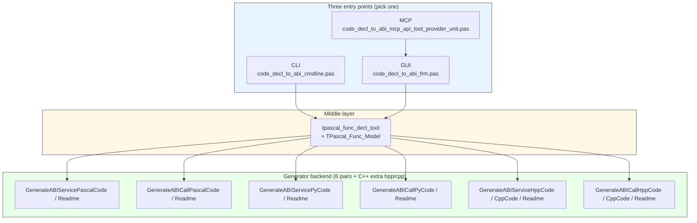
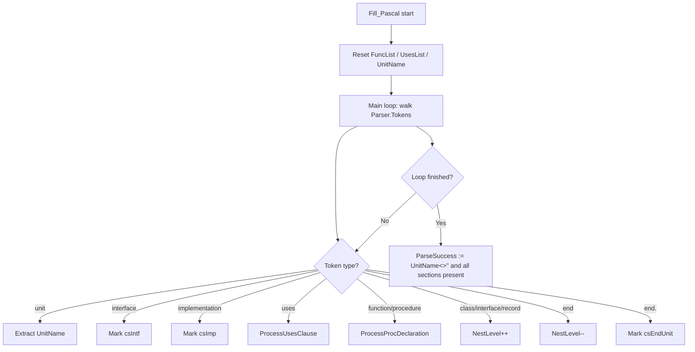
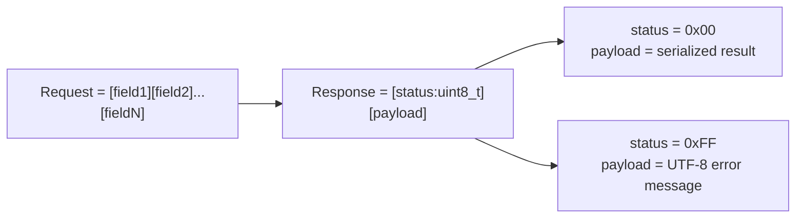
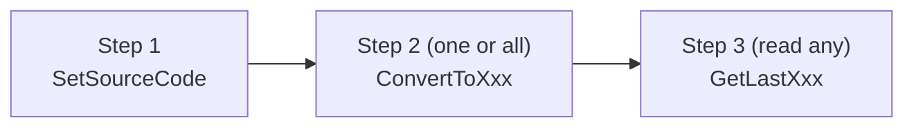
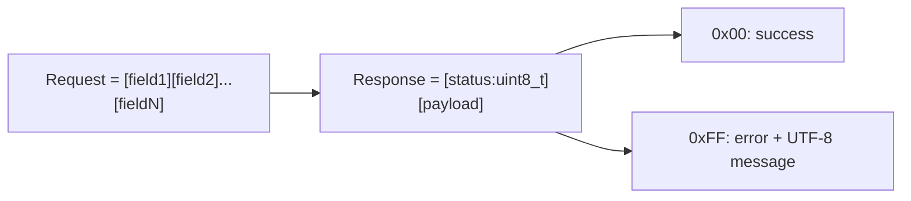

# code_decl_to_abi Operations Knowledge Base v3.0

> **Purpose**: A **construction-grade** reference for AI and human engineers. **After reading this, you can modify code, fix bugs, add languages, write tools, and integrate with MCP.**
>
> **What's new in v3.0 vs v2.0**:
> - **Three entry points**: CLI / GUI / MCP (v2.0 only covered GUI)
> - **Command-line interface**: full contract for `code_decl_to_abi_cmdline.pas`
> - **MCP / Agent interface**: 21 tools exposed by `code_decl_to_abi_mcp_api_tool_provider_unit.pas`
> - **README system**: each generator now emits both code and a Markdown knowledge base (for AI agents to consume)
> - **Main program upgraded**: `code_decl_to_abi.lpr` now dispatches between CLI and GUI
>
> **Current status**: **3 target languages** (Pascal, Python, C++), each with **service-side** and **call-side** code generation, plus paired Markdown READMEs.
>
> **Roadmap**: The generator backend is designed to support **an unbounded number of target languages**. Adding a new language is a **mechanical 7-step process** (see Chapter 14). The system is intentionally open-ended: any language with a C-ABI-compatible FFI, a JSON library, and a runtime model that can speak LingoFuse's wire protocol is a candidate.
>
> **Diagram convention**: Mermaid is used throughout; no ASCII-art diagrams.
>
> **Promise**: Every statement is line-by-line verified against the source you provided. Anything I cannot determine is called out explicitly in the "Not Covered by the Material" chapter.

---

## Table of Contents

- [Chapter 1  Reading Guide](#chapter-1-reading-guide)
- [Chapter 2  System Overview: Three Entry Points](#chapter-2-system-overview-three-entry-points)
- [Chapter 3  Build and Compilation Conventions](#chapter-3-build-and-compilation-conventions)
- [Chapter 4  Core Data Contracts: tfunc_decl / tfunc_param_decl](#chapter-4-core-data-contracts)
- [Chapter 5  Intermediate Model Contracts: TFunctionStructure / TParamStructure](#chapter-5-intermediate-model-contracts)
- [Chapter 6  Parser Internals](#chapter-6-parser-internals)
- [Chapter 7  Generator Internals](#chapter-7-generator-internals)
- [Chapter 8  README System (a knowledge base for the generated target)](#chapter-8-readme-system)
- [Chapter 9  Command-Line Interface (CLI)](#chapter-9-command-line-interface-cli)
- [Chapter 10 MCP / Agent Interface (21 Tools)](#chapter-10-mcp--agent-interface)
- [Chapter 11 GUI Form Operations Manual](#chapter-11-gui-form-operations-manual)
- [Chapter 12 LingoFuse Integration Details](#chapter-12-lingofuse-integration-details)
- [Chapter 13 Known Bug List + Fixes](#chapter-13-known-bug-list--fixes)
- [Chapter 14 Full Change List for Adding a Target Language](#chapter-14-full-change-list-for-adding-a-target-language)
- [Chapter 15 Full Change List for Adding a Source Language](#chapter-15-full-change-list-for-adding-a-source-language)
- [Chapter 16 Debugging and Troubleshooting Manual](#chapter-16-debugging-and-troubleshooting-manual)
- [Chapter 17 Regression Test Entry Points](#chapter-17-regression-test-entry-points)
- [Chapter 18 Not Covered by the Material](#chapter-18-not-covered-by-the-material)
- [Chapter 19 Operating Rules for AI](#chapter-19-operating-rules-for-ai)

---

## Chapter 1  Reading Guide

### 1.1 What This Document Lets You Do

| Task | Covered | Where |
|------|:-------:|-------|
| Build the whole project | ✅ | Chapter 3 |
| Modify `tfunc_decl` fields | ✅ | Chapter 4 |
| Modify parser behavior | ✅ | Chapter 6 |
| Modify generator output | ✅ | Chapter 7 |
| **Modify / add a README** | ✅ | **Chapter 8 (new)** |
| **Modify CLI arguments** | ✅ | **Chapter 9 (new)** |
| **Modify / add an MCP tool** | ✅ | **Chapter 10 (new)** |
| Modify GUI controls | ✅ | Chapter 11 |
| Modify LingoFuse integration | ✅ | Chapter 12 |
| Fix a known bug | ✅ | Chapter 13 |
| **Add a new target language** | ✅ | **Chapter 14** |
| **Add a new source language** | ✅ | **Chapter 15** |
| Debug a specific error | ✅ | Chapter 16 |
| Run regression tests | ✅ | Chapter 17 |

### 1.2 What an AI Should Be Able to Do After Reading This

1. See "add a `bool` type to the C++ generator" and immediately locate the **3 mapping tables** to modify.
2. See "add Go as a target language" and follow Chapter 14's checklist **item by item**.
3. See "make the CLI accept `.rs`" and modify `Detect_Target_Lang` as described in Chapter 9.
4. See "add a new tool for the agent" and modify `code_decl_to_abi_mcp_api_tool_provider_unit.pas` as described in Chapter 10.
5. See "the generated README is missing a section" and locate the exact `Emit*` routine from Chapter 8.

---

## Chapter 2  System Overview: Three Entry Points

### 2.1 The Three Frontends

`code_decl_to_abi` has **three independent frontends** sharing one generator backend:



**Key facts**:

| Entry | Who calls it | Goes through GUI? | Goes through LingoFuse? | Writes files? |
|-------|--------------|:-----------------:|:-----------------------:|:-------------:|
| CLI | Command-line users | ❌ | ❌ | ✅ |
| GUI | Desktop users | ✅ | ✅ (service + tool registration) | ✅ |
| MCP | AI agents | ✅ (via `TCompute.Sync`) | ✅ (as a tool provider) | ✅ |

**Why MCP goes through GUI**: `internal_call_*` uses `TCompute.Sync` to dispatch to the main thread and calls the already-existing button event handlers in `code_decl_to_abi_frm.pas`. **This way, none of the GUI logic has to be duplicated.**

### 2.2 Main Program Entry Dispatch

Startup order in `code_decl_to_abi.lpr`:

```pascal
begin
  try
    if not Process_CommandLine then
    begin
      exitCode := CommandLine_ExitCode;
      exit;
    end;

    RequireDerivedFormResource := True;
    Application.Scaled := True;
    Application.MainFormOnTaskbar := True;
    Application.Initialize;
    Application.CreateForm(Tcode_decl_to_abi_form, code_decl_to_abi_form);
    Application.Run;
  finally
    LF_Shutdown();
  end;
end;
```

**Logic**:
1. `Process_CommandLine` returns True (no arguments) → continue to GUI.
2. `Process_CommandLine` returns False (CLI handled) → `exit`, using `CommandLine_ExitCode` as the process exit code.
3. `finally` calls `LF_Shutdown()` to release LingoFuse on every path.

**`uses` list** (v3.0):

```pascal
uses
  mimalloc4p,
  {$IFDEF UNIX} cthreads, {$ENDIF}
  {$IFDEF HASAMIGA} athreads, {$ENDIF}
  Interfaces, Forms,
  lingofuse_import,
  code_decl_to_abi_frm,
  pas_abi_service_generator_tool,
  pas_abi_call_generator_tool,
  py_abi_service_generator_tool,
  py_abi_call_generator_tool,
  cpp_abi_service_generator_tool,
  cpp_abi_call_generator_tool,
  code_decl_to_abi_cmdline;
```

**Roadmap note**: The backend is **explicitly designed for unbounded extension**. Adding `rust_abi_service_generator_tool` and `rust_abi_call_generator_tool` (see Chapter 14) would just be two more lines in this `uses` clause; the same pattern applies to any future language.

---

## Chapter 3  Build and Compilation Conventions

### 3.1 Compiler Requirements

| Item | Requirement | Basis |
|------|-------------|-------|
| Compiler | FPC 3.2+ or Delphi 10.4+ | `{$DEFINE FPC_DELPHI_MODE}` |
| Mode | Delphi mode (`{$mode delphi}`) | `code_decl_to_abi.lpr` |
| Charset | UTF-8 (`{$CODEPAGE UTF8}`) | Every unit header |
| Platform | Windows / Linux / macOS | Depends on `LingoFuse64.dll` / `liblingofuse.so` / `liblingofuse.dylib` |

### 3.2 Path Conventions (**Easy to Trip Over**)

Each unit's `{$I}` path is **inconsistent**; keep them as-is when editing:

| Unit | `{$I}` path |
|------|-------------|
| `Z.Pascal_Func_Model.pas` | `{$I ..\Z.Define.inc}` |
| `pas_abi_service_generator_tool.pas` | `{$I ..\..\..\Z.Define.inc}` |
| `pas_abi_call_generator_tool.pas` | `{$I ..\..\..\Z.Define.inc}` |
| `py_abi_service_generator_tool.pas` | `{$I ..\..\..\Z.Define.inc}` |
| `py_abi_call_generator_tool.pas` | `{$I ..\..\..\Z.Define.inc}` |
| `cpp_abi_service_generator_tool.pas` | `{$I ..\..\..\Z.Define.inc}` |
| `cpp_abi_call_generator_tool.pas` | `{$I ..\..\..\Z.Define.inc}` |
| `code_decl_to_abi_frm.pas` | `{$I ..\..\..\Z.Define.inc}` |
| **`code_decl_to_abi_mcp_api_tool_provider_unit.pas`** | **`{$ifdef FPC} ... {$endif}`, no `{$I}`** |
| **`code_decl_to_abi_cmdline.pas`** | **No `{$I}` (uses `uses` to pull in Z units)** |

**When adding a new unit**: if it directly uses macros from `Z.Define.inc`, **copy the three-level-up path**; otherwise use `uses` to pull in Z units.

### 3.3 Build Command

```bash
lazbuild -B code_decl_to_abi.lpi
```

### 3.4 Runtime Dependencies

| Dependency | Location | Consequence if missing |
|------------|----------|------------------------|
| `LingoFuse64.dll` / `liblingofuse.so` / `liblingofuse.dylib` | exe directory or system PATH | All `LF_*` calls fail |
| `pascal_code_abi_rule.md` | exe directory | `Open_pascal_rule_Button` does nothing |
| `C_code_abi_rule.md` | exe directory | `Open_c_rule_Button` does nothing |

### 3.5 Three Places You Must Register a New Unit

When adding a new generator unit (e.g. `rust_abi_service_generator_tool.pas`):

1. **`code_decl_to_abi.lpr` uses** — so its `initialization` section runs.
2. **`code_decl_to_abi_frm.pas` `implementation uses`** — so its functions can be called.
3. **`code_decl_to_abi_mcp_api_tool_provider_unit.pas`** — if the new unit should be exposed via MCP, add branches in `RegisterAPIs` / `RegisterTools` / `internal_call_*`.

---

## Chapter 4  Core Data Contracts

> Same as v2.0. **New units do not affect these structures.**

### 4.1 `tfunc_param_decl` (parameter record)

```pascal
tfunc_param_decl = record
  param_mod: TP_String;      // '' / 'const' / 'var' / 'out' / 'in'
  param_name: TP_String;     // parameter name
  param_typ: TP_String;      // type
  param_value: TP_String;    // default value
  param_array: TP_String;    // array suffix: '' / '[]' / '[N]'
  procedure reset;
end;
```

**Field contracts**:

| Field | Meaning | Constraint | Downstream effect |
|-------|---------|-----------|-------------------|
| `param_mod` | Modifier | Only 5 legal values | `LoadFromParser` rejects `var` / `out` |
| `param_name` | Parameter name | **Must not be empty** | Empty name → whole declaration is dropped |
| `param_typ` | Type | Must be recognized by `Normalize_ABI_Type` | Otherwise the whole declaration is dropped |
| `param_value` | Default value | Pascal-only | Rendered by `decl_to_pascal` |
| `param_array` | Array suffix | C-only | Rendered as `array of <type>` by `decl_to_pascal` |

### 4.2 `tfunc_decl` (declaration record)

```pascal
tfunc_decl = record
  Body, Name, ParamDecl, ResultDecl, ResultMod, CallConv: TP_String;
  IsProc, IsFunction, IsExternal, HasExplicitName, HasExplicitIndex: boolean;
  BPos, EPos, Index, NestLevel: integer;
  param_arry: tfunc_param_arry;
  ExternalLibrary, ExplicitName, ExplicitIndex, Comment: TP_String;
  procedure Init;
  procedure Free;
end;
```

**Key pitfalls**:

| Pitfall | Consequence |
|---------|-------------|
| `IsProc` defaults to False | Forget to set True → whole declaration is dropped |
| `NestLevel` defaults to 0 | Forget to increment inside a class → mistaken for top-level |
| `Index` defaults to -1 | Assign `i` manually when adding |

### 4.3 `TFuncDeclList` (declaration list)

```pascal
TFuncDeclList = class(TBigList<pfunc_decl>)
public
  procedure DoFree(var Data: pfunc_decl); override;
end;

procedure TFuncDeclList.DoFree(var Data: pfunc_decl);
begin
  if Data <> nil then
    begin
      Data^.Free;
      Dispose(Data);
      Data := nil;
    end;
end;
```

### 4.4 `tpascal_func_decl_tool` (parser tool)

**Key facts**:
- `Parser` is owned by the tool and freed automatically on destruction.
- `FuncList` only stores entries with `IsProc=True`.
- `ParseSuccess`: for Pascal, needs `unit` + `interface` + `implementation` + `end.`; for C, needs `FuncCount > 0`.

---

## Chapter 5  Intermediate Model Contracts

### 5.1 `TParamStructure` / `TFunctionStructure`

```pascal
TParamStructure = record
  Name, Typ, PascalType, Description: TP_String;
  procedure Clear;
end;

TFunctionStructure = record
  Name: TP_String;
  IsFunction: boolean;
  Params: TParamArray;
  ReturnType: TP_String;
  Comment: TP_String;
  procedure Clear;
  function Clone: TFunctionStructure;
end;
```

### 5.2 `Normalize_ABI_Type` Mapping Table

**`tnf_ABI` mode**: preserve the lowercase form of the original type name.

| Input type (lowercase) | Normalized result | Family |
|------------------------|-------------------|--------|
| `integer` / `int64` / `cardinal` / `longint` / `dword` | same name | integer |
| `word` / `smallint` / `byte` / `uint64` / `longword` | same name | integer |
| `double` / `single` / `extended` / `real` | same name | float |
| `tpascalstring` / `tupascalstring` / `tp_string` / `string` / `ansistring` / `unicodestring` | same name | string |
| `pchar` / `pansichar` / `pwidechar` | same name | string |
| **anything else** | `''` | unsupported |

**`tnf_Json` mode**: collapse to `'int64'` / `'double'` / `'string'`.

### 5.3 The 6 Filters in `LoadFromParser`

```pascal
// Filter 1: IsProc = False
if not decl^.IsProc then Continue;
// Filter 2: NestLevel <> 0
if decl^.NestLevel <> 0 then Continue;
// Filter 3: empty parameter name
if paramDecl.param_name = '' then begin ok := False; Break; end;
// Filter 4: var/out parameter
if paramDecl.param_mod.Same('var', 'out') then begin ok := False; Break; end;
// Filter 5: unsupported parameter type
if normTyp = '' then begin ok := False; Break; end;
// Filter 6: unsupported return type (function only)
if f.ReturnType = '' then Continue;
```

**Any triggered filter silently drops the whole declaration.**

---

## Chapter 6  Parser Internals

### 6.1 `Fill_Pascal` Main Loop



### 6.2 `Fill_C` Main Loop

**Key steps** (see v2.0 for details):
1. Extract `UnitName` (from the `.h` filename or include guard).
2. Main loop skips whitespace/comments/preprocessor directives.
3. `{` blocks: `ShouldSkipBlock` decides skip vs pass-through.
4. `;` triggers `ProcessStatement`.
5. `ProcessStatement` rejects: `=` initialization, function-pointer parameters, no `()`.

### 6.3 `Translate_C_Typ_To_Pascal` Full Mapping Table

| C type | Pascal type |
|--------|-------------|
| `signed char` / `int8_t` | `ShortInt` |
| `short` / `int16_t` | `SmallInt` |
| `int` / `int32_t` | `Integer` |
| `long` / `long int` | `LongInt` |
| `long long` / `int64_t` | `Int64` |
| `unsigned char` / `uint8_t` | `Byte` |
| `unsigned short` / `uint16_t` | `Word` |
| `unsigned` / `unsigned int` / `uint32_t` | `Cardinal` |
| `unsigned long` / `unsigned long int` | `LongWord` |
| `unsigned long long` / `uint64_t` | `UInt64` |
| `size_t` / `uintptr_t` | `UInt64` |
| `ssize_t` / `ptrdiff_t` / `intptr_t` | `Int64` |
| `float` | `Single` |
| `double` | `Double` |
| `long double` | `Extended` |
| `char *` / `const char *` / `char const *` | `string` |
| **anything else with `*`** | `Pointer` |
| `void` (as return type) | `''` (empty) |
| **anything else** | preserved as-is |

---

## Chapter 7  Generator Internals

### 7.1 Common Generator Skeleton

Every generator has:

```pascal
function CollectSupportedFunctions(Model: TPascal_Func_Model): TArryFunctionStructure;
```

**3 filter conditions**: unsupported parameter type, unsupported return type, empty name.

**The set of supported ABI types is identical across all generators** (see Chapter 4).

### 7.2 6 Pairs of Generators + C++ Extra hpp/cpp

| Generator | Exported functions | Output |
|-----------|--------------------|--------|
| `pas_abi_service_generator_tool` | `GenerateABIServicePascalCode` | `.pas` |
| | `GenerateABIServicePascalReadme` | `.md` |
| `pas_abi_call_generator_tool` | `GenerateABICallPascalCode` | `.pas` |
| | `GenerateABICallPascalReadme` | `.md` |
| `py_abi_service_generator_tool` | `GenerateABIServicePyCode` | `.py` |
| | `GenerateABIServicePyReadme` | `.md` |
| `py_abi_call_generator_tool` | `GenerateABICallPyCode` | `.py` |
| | `GenerateABICallPyReadme` | `.md` |
| `cpp_abi_service_generator_tool` | `GenerateABIServiceHppCode` | `.hpp` |
| | `GenerateABIServiceCppCode` | `.cpp` |
| | `GenerateABIServiceCppReadme` | `.md` |
| `cpp_abi_call_generator_tool` | `GenerateABICallHppCode` | `.hpp` |
| | `GenerateABICallCppCode` | `.cpp` |
| | `GenerateABICallCppReadme` | `.md` |

**14 exported functions in total** (6 code + 6 README + 2 extra C++ hpp/cpp code functions).

**Roadmap note**: A future target language would fit into the same slot. For a language whose bindings are a single file, the two functions `GenerateABIService<Lang>Code` and `GenerateABICall<Lang>Code` suffice. For a language whose bindings split into header + implementation (like C++), you would additionally provide two separate code functions and one README function per side. **The system is unbounded; each new language is a mechanical addition.**

### 7.3 Type Mapping Table (C++ example)

```pascal
function ABI_Type_To_Cpp_Decl(const T: TP_String): TP_String;
begin
  if T.Same('integer') or T.Same('longint') then Result := 'int32_t'
  else if T.Same('int64') then Result := 'int64_t'
  else if T.Same('cardinal') or T.Same('dword') or T.Same('longword') then Result := 'uint32_t'
  else if T.Same('word') then Result := 'uint16_t'
  else if T.Same('smallint') then Result := 'int16_t'
  else if T.Same('byte') then Result := 'uint8_t'
  else if T.Same('uint64') then Result := 'uint64_t'
  else if T.Same('double') or T.Same('extended') or T.Same('real') then Result := 'double'
  else if T.Same('single') then Result := 'float'
  else if stringFamily then Result := 'std::string'
  else Result := '';
end;
```

### 7.4 Wire Protocol (**All Generators Must Follow**)



| Type | Encoding |
|------|----------|
| Integer | little-endian |
| String | UTF-8 + NUL terminator |
| Float | IEEE 754 |

---

## Chapter 8  README System

### 8.1 Why a README

**New in v3.0**: every generator now emits **both code and a Markdown README**. The README's purpose is a **knowledge base for the generated target that AI agents can read** — when an agent receives generated code (e.g. `my_unit_abi_service.py`), it can read the paired `my_unit_abi_service_python.md` to quickly understand:

- How to use this code
- How to deploy it
- How to test it
- What pitfalls exist

**Core idea**: **Code is for the compiler; the README is for the agent.** Both are generated from the same `TPascal_Func_Model`, guaranteeing **they never drift apart**.

### 8.2 The 12-Section Standard Structure

**All 6 README-generator functions share the same structure**:

| Section | Title | Content |
|---------|-------|---------|
| §1 | Overview | What this code is, design principles, 3-step quickstart |
| §2 | Application Scope | When to use / not use, comparison with other RPCs |
| §3 | Compatibility | Compiler version, platform, runtime deps, threading model |
| §4 | Wire Protocol | Request/response format, encoding rules, call sequence |
| §5 | Runtime Architecture | Startup order, call sequence, timeouts, target app name |
| §6 | Type Mapping | Supported types, unsupported types, endianness, NUL terminator |
| §7 | Deployment | Directory layout, build commands, startup order, shutdown order |
| §8 | Testing | A fully copy-pasteable test program |
| §9 | API Reference | Summary table + per-API details |
| §10 | Troubleshooting | Symptom / cause / fix table |
| §11 | Self-Assessment Checklist | Questions a reader should be able to answer |
| §12 | Reference Resources | Related toolchain index |

### 8.3 README Generator Skeleton

Each README generator is a **single big function** that assembles the 12 sections with local procedures:

```pascal
function GenerateABIServicePascalReadme(Model: TPascal_Func_Model): TPascalStringList;
var
  L: TPascalStringList;
  SupportedFuncs: TArryFunctionStructure;
  UnitName, NormalizedUnit, AppName: TP_String;

  procedure EmitHeader; begin ... end;
  procedure EmitOverview; begin ... end;
  procedure EmitApplicationScope; begin ... end;
  procedure EmitCompatibility; begin ... end;
  procedure EmitWireProtocol; begin ... end;
  procedure EmitRuntimeArchitecture; begin ... end;
  procedure EmitTypeMapping; begin ... end;
  procedure EmitDeployment; begin ... end;
  procedure EmitTesting; begin ... end;
  procedure EmitApiReference; begin ... end;
  procedure EmitTroubleshooting; begin ... end;
  procedure EmitSelfAssessment; begin ... end;
  procedure EmitResources; begin ... end;
begin
  Result := TPascalStringList.Create;
  if Model = nil then begin Result.Add('# README generation skipped'); Exit; end;
  UnitName := Model.UnitName;
  if UnitName.Len = 0 then begin ...; Exit; end;
  NormalizedUnit := MakeApiName(UnitName);
  AppName := NormalizedUnit + '_abi';
  SupportedFuncs := CollectSupportedFunctions(Model);
  L := Result;
  try
    EmitHeader;
    EmitOverview;
    EmitApplicationScope;
    EmitCompatibility;
    EmitWireProtocol;
    EmitRuntimeArchitecture;
    EmitTypeMapping;
    EmitDeployment;
    EmitTesting;
    EmitApiReference;
    EmitTroubleshooting;
    EmitSelfAssessment;
    EmitResources;
  finally
  end;
end;
```

### 8.4 `§9 API Reference` Is the Core

`EmitApiReference` walks `SupportedFuncs` and produces, per API:
- A summary table row
- `#### Description` paragraph
- `#### Parameters` table
- `#### Request layout` block
- `#### Success response layout` block
- `#### Error response` paragraph
- `#### Call example` code block

**Key dependency**: `GetFullDescription(Func.Comment)` extracts the first line of the comment. In the source, the comment **must be immediately adjacent to the declaration** (no blank line between them); otherwise it will not be picked up.

### 8.5 The Fixed `§10 Troubleshooting` Table

Every README's troubleshooting table contains at least:

| Symptom | Cause | Fix |
|---------|-------|-----|
| `LF_PrepareDone` returns 0 | Target service not started | Start the service first |
| `EABIRemoteError: nil (timeout)` | App name mismatch | Check target app name |
| `EABIRemoteError: "input truncated"` | Parameter count wrong | Check client-side writes |
| `EABIRemoteError: <garbled>` | Encoding mismatch | Check type table |
| Return value incorrect | Endianness mismatch | Check byte order |
| Callback never fires | Stub not implemented | Search for `TODO` |
| UI crashes | Worker thread touched UI | Use the sync variants |
| MSVC warns about non-ASCII | Missing `/utf-8` | Add `/utf-8` |

### 8.6 README Naming Convention

| Target | Code file | README file |
|--------|-----------|-------------|
| Pascal Service | `<Unit>_abi_service_unit.pas` | `<Unit>_abi_service_pascal.md` |
| Pascal Call | `<Unit>_abi_call_unit.pas` | `<Unit>_abi_call_pascal.md` |
| Python Service | `<Unit>_abi_service.py` | `<Unit>_abi_service_python.md` |
| Python Call | `<Unit>_abi_call.py` | `<Unit>_abi_call_python.md` |
| C++ Service | `<Unit>_abi_service.hpp` + `.cpp` | `<Unit>_abi_service_cpp.md` |
| C++ Call | `<Unit>_abi_call.hpp` + `.cpp` | `<Unit>_abi_call_cpp.md` |

**CLI README naming rule** (see Chapter 9): `<output basename>_readme.md`.

### 8.7 Change List for Modifying a README

**Add a section**:
1. Define a new `procedure EmitXxx; begin ... end;` inside the `GenerateABI*Readme` function.
2. Call it in the `try...finally` block, in the desired order.

**Change a section's wording**:
1. Find the corresponding `EmitXxx` procedure.
2. Modify the strings passed to `L.Add(...)`.

**Make a section display API-specific data**:
- Use the `SupportedFuncs` array.
- Use existing helpers like `MakeApiName(Func.Name)` and `ABI_Type_To_<Lang>_Decl(Func.ReturnType)`.

---

## Chapter 9  Command-Line Interface (CLI)

### 9.1 What the CLI Is

`code_decl_to_abi_cmdline.pas` is the **GUI-free command-line entry point**, letting scripts / CI / automation invoke the generator directly.

**The CLI shares the same backend as the GUI**: internally it calls functions like `GenerateABIServicePascalCode` without going through GUI controls.

### 9.2 Main Program Dispatch

```pascal
program code_decl_to_abi;
begin
  try
    if not Process_CommandLine then
    begin
      exitCode := CommandLine_ExitCode;
      exit;
    end;
    // ... GUI startup
  finally
    LF_Shutdown();
  end;
end;
```

**Contract**:
- `Process_CommandLine` returns **True** → no arguments, continue to GUI.
- Returns **False** → CLI was handled; `exit` and set the exit code.

### 9.3 CLI Arguments

| Argument form | Behavior |
|---------------|----------|
| `code_decl_to_abi` | Launch the GUI |
| `code_decl_to_abi --help` / `-h` / `-?` / `/?` | Print help |
| `code_decl_to_abi <input> <output>` | Generate **Service** side |
| `code_decl_to_abi --call <input> <output>` / `-c <input> <output>` | Generate **Call** side |

### 9.4 Source-Language Detection (from input extension)

```pascal
function Detect_Source_Lang(const FileName: string): TSourceLang;
begin
  Ext := LowerCase(ExtractFileExt(FileName));
  if (Ext = '.pas') or (Ext = '.pp') or (Ext = '.p') then
    Result := slPascal
  else if (Ext = '.h') or (Ext = '.hpp') or (Ext = '.hh')
       or (Ext = '.c') or (Ext = '.cpp') or (Ext = '.cc') or (Ext = '.cxx') then
    Result := slC
  else
    Result := slUnknown;
end;
```

### 9.5 Target-Language Detection (from output extension)

```pascal
function Detect_Target_Lang(const FileName: string): TTargetLang;
begin
  Ext := LowerCase(ExtractFileExt(FileName));
  if (Ext = '.pas') or (Ext = '.pp') or (Ext = '.p') then
    Result := tlPascal
  else if Ext = '.py' then
    Result := tlPython
  else if (Ext = '.hpp') or (Ext = '.hh') or (Ext = '.h')
       or (Ext = '.cpp') or (Ext = '.cc') or (Ext = '.cxx') or (Ext = '.c') then
    Result := tlCpp
  else
    Result := tlUnknown;
end;
```

**Roadmap note**: `TTargetLang` is the enum you extend when adding a new target language (see Chapter 14, step 4.1).

### 9.6 Target Language × Side Matrix

| Target language | Service output | Call output |
|-----------------|----------------|-------------|
| Pascal | `.pas` | `.pas` |
| Python | `.py` | `.py` |
| C++ | `.hpp` + `.cpp` | `.hpp` + `.cpp` |

**C++ special case**: whether you name the output `.hpp` or `.cpp`, both files are always written (same base name, different extensions).

**Roadmap note**: For a future target language whose bindings use a single file (like Rust, Go, or TypeScript), the two sides would each write one file. For a language that splits into header + implementation, follow the C++ pattern.

### 9.7 Exit Codes

| Code | Constant | Meaning |
|:----:|----------|---------|
| 0 | `EXIT_OK` | Conversion succeeded |
| 1 | `EXIT_BAD_ARGS` | Missing or invalid arguments |
| 2 | `EXIT_PARSE_FAILED` | Source parsing failed |
| 3 | `EXIT_GEN_FAILED` | Code generation failed |
| 4 | `EXIT_IO_ERROR` | File I/O error |

### 9.8 Output File Naming

**The CLI caller specifies the output file name** (unlike GUI, which uses fixed names). Additionally:

- **C++ auto-completes two files**: given `<path>/<base>.hpp`, both `<path>/<base>.hpp` and `<path>/<base>.cpp` are written.
- **README auto-naming**: `<path>/<base>_readme.md`.

**Helper functions**:

```pascal
function Companion_Readme_Path(const OutputFile: string): string;
var
  Dir, Base: string;
begin
  Dir := ExtractFileDir(OutputFile);
  Base := ChangeFileExt(ExtractFileName(OutputFile), '');
  Result := IncludeTrailingPathDelimiter(Dir) + Base + '_readme.md';
end;

procedure Cpp_Paths_From_Output(const OutputFile: string;
  out HppPath, CppPath: string);
var
  Dir, Base: string;
begin
  Dir := ExtractFileDir(OutputFile);
  Base := ChangeFileExt(ExtractFileName(OutputFile), '');
  HppPath := IncludeTrailingPathDelimiter(Dir) + Base + '.hpp';
  CppPath := IncludeTrailingPathDelimiter(Dir) + Base + '.cpp';
end;
```

### 9.9 Usage Examples

```bash
# Help
code_decl_to_abi --help

# Pascal → Pascal Service
code_decl_to_abi calculator.pas calculator_service.pas
# Output:
#   calculator_service.pas       (service unit)
#   calculator_service_readme.md (README)

# Pascal → Pascal Call
code_decl_to_abi --call calculator.pas calculator_call.pas
# Output:
#   calculator_call.pas
#   calculator_call_readme.md

# C header → Python Service
code_decl_to_abi ComplexTestUnit.h calculator_service.py
# Output:
#   calculator_service.py
#   calculator_service_readme.md

# C header → C++ Service (two files are auto-produced)
code_decl_to_abi ComplexTestUnit.h calculator_service.hpp
# Output:
#   calculator_service.hpp
#   calculator_service.cpp
#   calculator_service_readme.md
```

### 9.10 CLI Internal Flow

```mermaid
flowchart TD
    A["Process_CommandLine"] --> B{"ParamCount = 0?"}
    B -- "Yes" --> Z["Return True (go GUI)"]
    B -- "No" --> C["OnDoStatusHook := CmdLine_DoStatus_Hook"]
    C --> D{"First argument?"}
    D -- "--help" --> H["Print_Help, return False"]
    D -- "--call" --> E["Mode := tmCall, ArgStart++"]
    D -- "other" --> F["ArgStart unchanged"]
    E --> G["Take <input> <output>"]
    F --> G
    G --> I["Execute_Conversion"]
    I --> J{"Language detection"}
    J -- "Failure" --> K["Return EXIT_BAD_ARGS"]
    J -- "Success" --> L["Read_Text_File"]
    L --> M{"Read failed?"}
    M -- "Yes" --> N["Return EXIT_IO_ERROR"]
    M -- "No" --> O["CreateFrom_Pascal_Code / _C_Code"]
    O --> P{"ParseSuccess?"}
    P -- "No" --> Q["Return EXIT_PARSE_FAILED"]
    P -- "Yes" --> R["LoadFromParser + SaveToJson"]
    R --> S{"Dispatch on TgtLang"}
    S -- "tlPascal" --> T["Generate_Pascal"]
    S -- "tlPython" --> U["Generate_Python"]
    S -- "tlCpp" --> V["Generate_Cpp"]
    T --> W["Write files + README"]
    U --> W
    V --> W
```



### 9.11 CLI Output Hook

The CLI uses a **custom DoStatus hook** that writes directly to stdout, **bypassing the Z.Status queue** (there is no main-loop driving the queue in CLI mode).

```pascal
procedure CmdLine_DoStatus_Hook(Text_: SystemString; const ID: Integer);
begin
  WriteLn(Text_);
end;
```

**At the top of `Process_CommandLine`**:

```pascal
OnDoStatusHook := @CmdLine_DoStatus_Hook;
```

**Key**: `code_decl_to_abi.lpr` is compiled with `{$apptype console}` so that console output works.

---

## Chapter 10  MCP / Agent Interface

### 10.1 Positioning

`code_decl_to_abi_mcp_api_tool_provider_unit.pas` wraps the entire generator as **21 LingoFuse Call APIs**, registered with the **agent beacon** (`agent_main_app`) for MCP clients to discover and invoke.

**Core idea**: **Simulate GUI operations.** Each `internal_call_*` uses `TCompute.Sync` to dispatch to the main thread and calls the button event handlers already present in `code_decl_to_abi_frm.pas`.

### 10.2 Constants

```pascal
var
  MY_APP_NAME : string = 'code_decl_to_abi_mcp_api';
  MY_APP_DESC : string = 'Tool provider for unit code_decl_to_abi_mcp_api';
  IPC_ENDPOINT : string = 'ipc:agent';
  BEACON_APP : string = 'agent_main_app';
  REGISTER_API : string = 'register_agent';
  AGENT_LOG_API : string = 'agent_log';
  DEBUG_LOG : boolean = True;
```

### 10.3 Three-Phase Workflow

**All tools strictly follow the three-phase pattern**:



**Contract**:
- **Step 1 is SETUP**, produces no files.
- **Step 2 branches are independent**: one SetSourceCode can trigger any number of Convert calls.
- **Step 3 is pure read**, pulling from cache.

### 10.4 Complete List of 21 Tools

#### Step 1 (1 tool)

| # | Tool | Parameters | Return |
|:-:|------|------------|--------|
| 1 | `CodeDeclToAbi_SetSourceCode` | `Source: string`, `Language: string` | `{"status":"ok"}` |

#### Step 2 (6 tools)

| # | Tool | Return |
|:-:|------|--------|
| 2 | `CodeDeclToAbi_ConvertToPascalService` | `{"result":"<service_unit.pas>","readme":"<readme.md>"}` |
| 3 | `CodeDeclToAbi_ConvertToPascalCall` | `{"result":"<call_unit.pas>","readme":"<readme.md>"}` |
| 4 | `CodeDeclToAbi_ConvertToPythonService` | `{"result":"<service.py>","readme":"<readme.md>"}` |
| 5 | `CodeDeclToAbi_ConvertToPythonCall` | `{"result":"<call.py>","readme":"<readme.md>"}` |
| 6 | `CodeDeclToAbi_ConvertToCppService` | `{"result":"<service.hpp>","impl":"<service.cpp>","readme":"<readme.md>"}` |
| 7 | `CodeDeclToAbi_ConvertToCppCall` | `{"result":"<call.hpp>","impl":"<call.cpp>","readme":"<readme.md>"}` |

#### Step 3 (14 tools)

| # | Tool | Return |
|:-:|------|--------|
| 8 | `CodeDeclToAbi_GetLastPascalServiceCode` | Full service unit text |
| 9 | `CodeDeclToAbi_GetLastPascalServiceReadme` | README text |
| 10 | `CodeDeclToAbi_GetLastPascalCallCode` | Full call unit text |
| 11 | `CodeDeclToAbi_GetLastPascalCallReadme` | README text |
| 12 | `CodeDeclToAbi_GetLastPythonServiceCode` | Full Python module text |
| 13 | `CodeDeclToAbi_GetLastPythonServiceReadme` | README text |
| 14 | `CodeDeclToAbi_GetLastPythonCallCode` | Full Python module text |
| 15 | `CodeDeclToAbi_GetLastPythonCallReadme` | README text |
| 16 | `CodeDeclToAbi_GetLastCppServiceHeader` | `.hpp` text |
| 17 | `CodeDeclToAbi_GetLastCppServiceImpl` | `.cpp` text |
| 18 | `CodeDeclToAbi_GetLastCppServiceReadme` | README text |
| 19 | `CodeDeclToAbi_GetLastCppCallHeader` | `.hpp` text |
| 20 | `CodeDeclToAbi_GetLastCppCallImpl` | `.cpp` text |
| 21 | `CodeDeclToAbi_GetLastCppCallReadme` | README text |

**Roadmap note**: Each new target language adds **exactly one Convert tool + two Reader tools** (or 1 Convert + 3 Readers for a two-file language like C++). The 21 count grows linearly and mechanically.

### 10.5 Three Public Functions

```pascal
function RegisterAPIs: TAppHnd___;       // Create App + register 21 Call APIs
function RegisterTools: Boolean;         // Connect to beacon + register 21 tool schemas
function Execute_And_Reg_all: Boolean;   // One-shot: RegisterAPIs + Prepare + RegisterTools
```

**`Execute_And_Reg_all` flow**:

```pascal
App := RegisterAPIs();
if App = nil then Exit;

if LF_CheckMainThreadEx then
  begin
    LF_PrepareClientEx(IPC_ENDPOINT, App);
    Result := RegisterTools();
  end
else
  begin
    LF_PrepareClientEx(IPC_ENDPOINT, App);
    if LF_PrepareDone() > 0 then
      Result := RegisterTools();
  end;
```

**Key points**:
- **App name = `MY_APP_NAME = 'code_decl_to_abi_mcp_api'`** (not `abi_tool_provider_intf`).
- **All 21 APIs are registered on the same App**.
- **`LF_PrepareDone` is called only when the main thread has not yet started** (to avoid a second call returning 0).

### 10.6 `TCompute.Sync` Pattern (**Most Critical Implementation Detail**)

All `internal_call_*` use the same pattern:

```pascal
function internal_call_CodeDeclToAbi_XXX_CodeDeclToAbi_XXX(...): string;
{$IFDEF FPC}
  procedure Do_Sync___();
  begin
    // All UI operations happen here.
    Result := ...;
  end;
{$ELSE FPC}
var temp_: string;
{$ENDIF FPC}
begin
{$IFDEF FPC}
  TCompute.Sync(Do_Sync___);
{$ELSE FPC}
  TCompute.Sync(procedure()
  begin
    // All UI operations happen here.
    temp_ := ...;
  end);
  Result := temp_;
{$ENDIF FPC}
end;
```

**Contract**:
- **`Do_Sync___` runs on the main thread** (dispatched by `TCompute.Sync`).
- **`Result` is captured by the closure** (FPC's `is nested` feature).
- **`temp_` is the Delphi-side workaround** (`reference to` cannot capture `Result`).

### 10.7 `Work_*` Helper Functions

To avoid repetition, common logic is factored into `Work_*` functions (which **run on the main thread**):

```pascal
// Apply language to the ComboBox, triggering OnChange
function Work_Apply_Language(const Language: string): Boolean;

// Shared "parse → model → generate all" pipeline
function Work_Parse_And_Generate: string;   // empty string = success

// Six conversion branches
function Work_Convert_To_PascalService: string;
function Work_Convert_To_PascalCall: string;
function Work_Convert_To_PythonService: string;
function Work_Convert_To_PythonCall: string;
function Work_Convert_To_CppService: string;
function Work_Convert_To_CppCall: string;

// Fourteen readers
function Work_Get_PascalServiceCode: string;
// ... and so on
```

### 10.8 `Work_Parse_And_Generate` Caching Strategy

```pascal
var
  G_Last_Generated_Source: string = '';

function Work_Parse_And_Generate: string;
var
  SrcText: string;
begin
  Result := '';
  if code_decl_to_abi_form = nil then
    begin Result := 'GUI form is not available.'; Exit; end;

  SrcText := code_decl_to_abi_form.Edit_Source.Text;
  if Trim(SrcText) = '' then
    begin Result := 'No source code has been set...'; Exit; end;

  // Cache: same source + non-empty model JSON → skip
  if (SrcText = G_Last_Generated_Source) and
     (code_decl_to_abi_form.Edit_ModelJson.Lines.Count > 0) then
    Exit;

  try
    code_decl_to_abi_form.source_2_json_nex_ButtonClick(nil);
    if code_decl_to_abi_form.Edit_SourceJson.Lines.Count = 0 then
      begin Result := 'Parsing failed...'; Exit; end;

    code_decl_to_abi_form.JsonToModelButtonClick(nil);
    if code_decl_to_abi_form.Edit_ModelJson.Lines.Count = 0 then
      begin Result := 'Model build failed...'; Exit; end;

    code_decl_to_abi_form.GenerateSourceButtonClick(nil);
    G_Last_Generated_Source := SrcText;
  except
    on E: Exception do
      Result := 'Generation failed: ' + E.Message;
  end;
end;
```

**Contract**:
- **`SetSourceCode` clears `G_Last_Generated_Source`** so the next conversion re-parses.
- **Results are not cached**, only the "already generated" flag.
- **If the source changed, the pipeline is forced to re-run**.

### 10.9 "Tab Switch" Behavior in Each Step 2 Conversion

**Contract**: before returning, the conversion function **switches `Page_FinalSource` to the corresponding TabSheet** (mimicking a user click):

| Conversion | Switches to |
|------------|-------------|
| Pascal Service | `Tab_PasService` |
| Pascal Call | `Tab_PasCall` |
| Python Service | `Tab_PyService` |
| Python Call | `Tab_PyCall` |
| C++ Service | `Tab_CppService` |
| C++ Call | `Tab_CppCall` |

**Why switch tabs**: `GenerateSourceButtonClick` ends by setting `Page_Main.ActivePage := Tab_FinalSource` (switching to the "final source" tab), but does **not** switch to a specific child TabSheet. The conversion function handles the child tab switch so the UI matches the result.

### 10.10 JSON Schema at Tool Registration

Each Step 2 tool is registered **without parameters**:

```pascal
ParamsObj := ToolDef.O['parameters'];
ParamsObj.S['type'] := 'object';
PropsObj := ParamsObj.O['properties'];
// No properties are added.
```

Step 1 has two parameters:

```pascal
PropObj := PropsObj.O['Source'];
PropObj.S['type'] := 'string';
PropObj := PropsObj.O['Language'];
PropObj.S['type'] := 'string';
RequiredArr := ParamsObj.a['required'];
RequiredArr.Add('Source');
RequiredArr.Add('Language');
```

### 10.11 Change List for Modifying the MCP Interface

**Add a new tool**:
1. Declare `internal_call_*` in the `interface` section.
2. Implement it in `implementation` (using the `TCompute.Sync` pattern).
3. Add a `LF_RegisterCallEx` in `RegisterAPIs`.
4. Add `ToolDef` assembly + `RegisterTool(ToolDef)` in `RegisterTools`.
5. Update `regCount = 21` to the new total.

**Change a tool description**:
- Find the corresponding `ToolDef.S['description']` in `RegisterTools`.
- **Synchronize** the `LF_RegisterCallEx` description in `RegisterAPIs` (not required, but keep them consistent).

**Change `MY_APP_NAME`**:
- This breaks all clients (they route by app name).
- **Do not change it lightly.**

**Roadmap note**: The pattern is **language-agnostic**. Adding a new target language's MCP tool is precisely the mechanical "add 2 Convert tools + 4 Readers" step (see Chapter 14, step 7). The system is intentionally unbounded.

---

## Chapter 11  GUI Form Operations Manual

> Same as v2.0. **New**: `GenerateSourceButtonClick` now also writes README files, and sets `.Hint = last written file path` on each editor.

### 11.1 Key Event-Handler Logic

#### `GenerateSourceButtonClick` (v3.0 update)

```pascal
procedure Tcode_decl_to_abi_form.GenerateSourceButtonClick(Sender: TObject);
var
  func_model: TPascal_Func_Model;
  l: TPascalStringList;
  app_dir, last_fn: TP_String;

  procedure SaveSynEditCode(edit: TSynEdit; fn: string);
  var
    tmp: TPascalStringList;
  begin
    tmp := TPascalStringList.Create;
    tmp.Assign(edit.Lines);
    last_fn := umlCombineFileName(app_dir.Text, fn);
    tmp.SaveToFile(last_fn);
    DoStatus('Save file "%s"', [last_fn.Text]);
    DisposeObject(tmp);
  end;

  procedure SaveCode(fn: string);
  begin
    last_fn := umlCombineFileName(app_dir.Text, fn);
    l.SaveToFile(last_fn);
    DoStatus('Save file "%s"', [last_fn.Text]);
  end;

begin
  func_model := TPascal_Func_Model.Create;
  func_model.LoadFromJson(Edit_ModelJson.Text);

  app_dir.Text := umlCombinePath(umlGetFilePath(ParamStr(0)), func_model.UnitName);
  umlCreateDirectory(app_dir.Text);

  // Save source files
  if Edit_Source.Lines.Count > 0 then
    SaveSynEditCode(Edit_Source, 'source.pas' or 'source.h');  // depending on language
  if Edit_SourceJson.Lines.Count > 0 then
    SaveSynEditCode(Edit_SourceJson, 'source.json');
  if Edit_ModelJson.Lines.Count > 0 then
    SaveSynEditCode(Edit_ModelJson, 'source_model.json');

  // Pascal service
  l := GenerateABIServicePascalCode(func_model);
  if l <> nil then
    begin
      SaveCode(func_model.UnitName + '_abi_service_unit.pas');
      l.AssignTo(Edit_PasServiceSource.Lines);
      Edit_PasServiceSource.Hint := last_fn.Text;
      disposeObjectAndNil(l);
    end;

  l := GenerateABIServicePascalReadme(func_model);
  if l <> nil then
    begin
      SaveCode(func_model.UnitName + '_abi_service_pascal.md');
      l.AssignTo(Edit_PasServiceReadme.Lines);
      Edit_PasServiceReadme.Hint := last_fn.Text;
      disposeObjectAndNil(l);
    end;

  // ... same for Pascal call, Python service/call, C++ service (cpp + hpp + readme), C++ call

  Page_Main.ActivePage := Tab_FinalSource;
  func_model.Free;
end;
```

**Key additions**:
- **Every branch** does: generate list → write to disk → assign to `TSynEdit` → record `.Hint = file path`.
- **`.Hint` is the source of the file path returned by the conversion function** (the `internal_call_*` reads `.Hint` directly).

### 11.2 `.Hint` Contract

| Control | `.Hint` content |
|---------|-----------------|
| `Edit_PasServiceSource` | `<app_dir>/<Unit>_abi_service_unit.pas` |
| `Edit_PasServiceReadme` | `<app_dir>/<Unit>_abi_service_pascal.md` |
| `Edit_PasCallSource` | `<app_dir>/<Unit>_abi_call_unit.pas` |
| `Edit_PasCallReadme` | `<app_dir>/<Unit>_abi_call_pascal.md` |
| `Edit_PyServiceSource` | `<app_dir>/<Unit>_abi_service.py` |
| `Edit_PyServiceReadme` | `<app_dir>/<Unit>_abi_service_python.md` |
| `Edit_PyCallSource` | `<app_dir>/<Unit>_abi_call.py` |
| `Edit_PyCallReadme` | `<app_dir>/<Unit>_abi_call_python.md` |
| `Edit_CppServiceHpp` | `<app_dir>/<Unit>_abi_service.hpp` |
| `Edit_CppServiceCpp` | `<app_dir>/<Unit>_abi_service.cpp` |
| `Edit_CppServiceReadme` | `<app_dir>/<Unit>_abi_service_cpp.md` |
| `Edit_CppCallHpp` | `<app_dir>/<Unit>_abi_call.hpp` |
| `Edit_CppCallCpp` | `<app_dir>/<Unit>_abi_call.cpp` |
| `Edit_CppCallReadme` | `<app_dir>/<Unit>_abi_call_cpp.md` |

### 11.3 `app_dir` Generation

```pascal
app_dir.Text := umlCombinePath(umlGetFilePath(ParamStr(0)), func_model.UnitName);
umlCreateDirectory(app_dir.Text);
```

**Meaning**: all generated files are written to the **`<UnitName>/` subdirectory next to the exe**.

**Example**: if `UnitName = 'MyCalc'` and the exe is at `D:\tools\`, files go to `D:\tools\MyCalc\`.

### 11.4 `Tcode_decl_to_abi_form.Create` Startup

```pascal
constructor Tcode_decl_to_abi_form.Create(AOwner: TComponent);
begin
  inherited Create(AOwner);
  current_language := TSourceLanguage.slUnknown;

  Cmb_LanguageSelector.ItemIndex := 2;   // default C
  Sel_Lang_ComboBoxChange(Cmb_LanguageSelector);
  empty_unit_ButtonClick(Btn_LoadEmptyUnit);

  TCompute.RunM_NP(Do_Init_Th);   // start LingoFuse in the background
end;

procedure Tcode_decl_to_abi_form.Do_Init_Th;
begin
  LF_SetOptionEx('WaitConnect', 'True');
  LF_SetOptionEx('Overlap_Connection', 'True');
end;
```

**Note**: `Do_Init_Th` **does not** call `pascal_agent_service_unit.init_pascal_agent_service` nor `abi_tool_provider_intf_tool_provider_unit.Execute_And_Reg_all` (v2.0 did). Those two steps are now **owned by the external main program or another unit**.

---

## Chapter 12  LingoFuse Integration Details

> Same as v2.0, with the addition of `code_decl_to_abi_mcp_api_tool_provider_unit` as a new tool provider.

### 12.1 Wire Protocol



### 12.2 C ABI Exposed by `lingofuse_import.pas`

**Core data functions**: `LF_CreateData` / `LF_FreeData` / `LF_GetBuffer` / `LF_WriteBuffer` / `LF_ReadBuffer` / `LF_GetPos` / `LF_SetPos` / `LF_GetSize` / `LF_SetSize`.

**Pascal wrappers**: `LF_WriteIntXxx` / `LF_ReadIntXxx` / `LF_WriteString` / `LF_ReadString`.

**Application handle**: `LF_CreateApp` / `LF_FreeApp` / `LF_Generate_AppName` / `LF_Get_AppName` / `LF_BindApp`.

**API registration**: `LF_RegisterCall` / `LF_RegisterCallEx` / `LF_RegisterCall_M` / `LF_RegisterSyncCall_M` / `LF_RegisterNotify` / `LF_RegisterNotify_M`.

**Invocation**: `LF_LocalCall` / `LF_LocalNotify` / `LF_Call` / `LF_Notify` / `LF_Sequenced_Notify`.

**Preparation**: `LF_ResetPrepare` / `LF_PrepareService` / `LF_PrepareClient` / `LF_PrepareDone` / `LF_ExitMainThread` / `LF_Shutdown`.

**Options**: `LF_SetOption` / `LF_GetStatusCount` / `LF_GetStatus` / `LF_PostStatus` / `LF_CheckMainThread` / `LF_CheckApp` / `LF_CheckApi` / `LF_Sync`.

### 12.3 Comparison of the Two Tool Providers

| Dimension | `abi_tool_provider_intf_tool_provider_unit` (v2.0) | `code_decl_to_abi_mcp_api_tool_provider_unit` (v3.0) |
|-----------|-----------------------------------------------------|--------------------------------------------------------|
| App name | `abi_tool_provider_intf` | `code_decl_to_abi_mcp_api` |
| API count | 2 (`abi_decl_to_json` + `abi_generate_to_text`) | **21** (1 setup + 6 convert + 14 read) |
| Workflow | Two-phase (parse → generate) | **Three-phase** (Set → Convert → Read) |
| Granularity | Coarse (one call = one full conversion) | **Fine** (per language and per side) |
| Goes through GUI | ❌ (calls backend directly) | ✅ (via `TCompute.Sync` mimicking button clicks) |
| README support | ❌ | ✅ (each Convert is paired with a README) |
| Use case | Legacy, for simple scenarios | **Recommended**, for full workflow |

**A v3.0 project should register both providers**, or register only `code_decl_to_abi_mcp_api`. **The latter is recommended.**

### 12.4 Mapping of the 21 Tools to the GUI

| MCP tool | Internal call |
|----------|---------------|
| `SetSourceCode` | `code_decl_to_abi_form.Edit_Source.Text := ...` + `Sel_Lang_ComboBoxChange` |
| `ConvertToPascalService` | `Work_Parse_And_Generate` + switch to `Tab_PasService` |
| `ConvertToPascalCall` | Same + `Tab_PasCall` |
| `ConvertToPythonService` | Same + `Tab_PyService` |
| `ConvertToPythonCall` | Same + `Tab_PyCall` |
| `ConvertToCppService` | Same + `Tab_CppService` |
| `ConvertToCppCall` | Same + `Tab_CppCall` |
| `GetLast*` | Read the corresponding `TSynEdit.Text` |

**Key**: every MCP call ultimately lands on the GUI — there is **no backend bypass**.

---

## Chapter 13  Known Bug List + Fixes

### Bug 1 (v2.0): `do_internal_call_abi_generate_to_text` missing `cpp_service` / `cpp_call` branches

**Location**: `abi_tool_provider_intf_tool_provider_unit.pas` (**note: this is the legacy unit; v3.0 replaced it with `code_decl_to_abi_mcp_api`**).

**Fix**: If you still use the legacy unit, refer to v2.0's fix. **v3.0 users should migrate to the new unit.**

### Bug 2 (v2.0): C++ two-file output not implemented (legacy unit)

Same as Bug 1. **v3.0 handles this correctly in the new unit.**

### Bug 3 (v2.0): `JsonToPascalButtonClick` `Report` lifetime

**Location**: `code_decl_to_abi_frm.pas`.

**Fix** (already given in v2.0): use `try-finally` to guarantee release.

### Bug 4 (new): `code_decl_to_abi_frm.Create` does not start the LingoFuse service

**Location**: `Do_Init_Th` in `code_decl_to_abi_frm.pas`.

**Current**:

```pascal
procedure Tcode_decl_to_abi_form.Do_Init_Th;
begin
  LF_SetOptionEx('WaitConnect', 'True');
  LF_SetOptionEx('Overlap_Connection', 'True');
end;
```

**Problem**: v2.0's `Do_Init_Th` called `pascal_agent_service_unit.init_pascal_agent_service` and `abi_tool_provider_intf_tool_provider_unit.Execute_And_Reg_all`. v3.0's `Do_Init_Th` **does not** call either — so **LingoFuse will not auto-run after the GUI starts**.

**Fix**: add them back in `Do_Init_Th`:

```pascal
procedure Tcode_decl_to_abi_form.Do_Init_Th;
begin
  LF_SetOptionEx('WaitConnect', 'True');
  LF_SetOptionEx('Overlap_Connection', 'True');
  code_decl_to_abi_mcp_api_tool_provider_unit.Execute_And_Reg_all;
end;
```

**Note**: add `code_decl_to_abi_mcp_api_tool_provider_unit` to `code_decl_to_abi_frm.pas`'s `implementation uses`.

### Bug 5 (new): Hard-coded `regCount` in `RegisterTools`

**Location**: `code_decl_to_abi_mcp_api_tool_provider_unit.pas`.

**Current**:

```pascal
Result := (regCount = 21);
```

**Problem**: When adding tools you must change this by hand — **easy to forget**.

**Fix**: use a constant:

```pascal
const
  C_TOOL_COUNT = 21;
// ...
Result := (regCount = C_TOOL_COUNT);
```

### Bug 6 (new): `RegisterTools` still creates `ParamsObj` for zero-arg tools

**Location**: `code_decl_to_abi_mcp_api_tool_provider_unit.pas`.

**Current**: for every Step 2 / Step 3 tool:

```pascal
ParamsObj := ToolDef.O['parameters'];
ParamsObj.S['type'] := 'object';
PropsObj := ParamsObj.O['properties'];
```

**Problem**: For zero-arg tools, this creates an empty `parameters: {"type":"object","properties":{}}`. Some MCP clients do not accept empty `properties`.

**Fix**: Either omit `parameters` for zero-arg tools, or add `additionalProperties: false`:

```pascal
ParamsObj := ToolDef.O['parameters'];
ParamsObj.S['type'] := 'object';
ParamsObj.S['additionalProperties'] := False;
```

### Bug 7 (v2.0): "separator format" for `abi_generate_to_text` not implemented

**Location**: legacy unit. **v3.0's new unit returns `result` / `impl` / `readme` from `ConvertToCppService` / `ConvertToCppCall` separately**, so no separator is needed.

### Bug 8 (v2.0): `Sel_Lang_ComboBoxChange`'s `current_language` not initialized

See v2.0 for details.

---

## Chapter 14  Full Change List for Adding a Target Language

> **Example: adding Rust.** Assume the goal is to emit `<unit>_abi_service.rs` and `<unit>_abi_call.rs`.

**Roadmap framing**: The generator backend is **designed to accept any number of target languages**. The steps below are the same for any language — only the type mapping table and the language-specific idioms change. Languages whose bindings split into header + implementation (like C++) or that need a companion test page (like JavaScript's HTML harness) extend the same pattern with more files.

### 14.1 Change List Overview (**v3.0 update**)

| # | File | Action | Note |
|:-:|------|--------|------|
| 1 | `rust_abi_service_generator_tool.pas` | **New** | Rust service generator (Code + Readme) |
| 2 | `rust_abi_call_generator_tool.pas` | **New** | Rust call generator (Code + Readme) |
| 3 | `code_decl_to_abi.lpr` | Edit | Add the two new units to `uses` |
| 4 | **`code_decl_to_abi_cmdline.pas`** | **Edit** | Add `.rs` to `Detect_Target_Lang`; add a Rust branch to `Execute_Conversion`; add `Generate_Rust` |
| 5 | `code_decl_to_abi_frm.pas` | Edit | Add to `uses`; add a Rust branch to `GenerateSourceButtonClick`; add form fields |
| 6 | `code_decl_to_abi_frm.lfm` | Edit | Add two TabSheets + two TSynEdits |
| 7 | **`code_decl_to_abi_mcp_api_tool_provider_unit.pas`** | **Edit** | Add 2 Convert + 4 Readers; update `RegisterAPIs` / `RegisterTools`; update `regCount` |
| 8 | `code_decl_to_abi.lpi` | Edit (optional) | Unit list |

### 14.2 Step 1: Create `rust_abi_service_generator_tool.pas`

**Skeleton** (copy `pas_abi_service_generator_tool.pas` and change the key parts):

```pascal
unit rust_abi_service_generator_tool;

{$DEFINE FPC_DELPHI_MODE}
{$I ..\..\..\Z.Define.inc}

interface

uses
  Z.Core, Z.PascalStrings, Z.UPascalStrings,
  Z.Status, Z.Json, Z.UnicodeMixedLib, Z.ListEngine,
  Z.Pascal_Func_Model, Z.Parsing;

function GenerateABIServiceRustCode(Model: TPascal_Func_Model): TPascalStringList;
function GenerateABIServiceRustReadme(Model: TPascal_Func_Model): TPascalStringList;

const
  GenerateCode_LogEnabled: boolean = False;

implementation

// ... (copy the Log helpers, CollectSupportedFunctions, StripCommentMarkers,
//      GetFullDescription from the pas version)

// Key change 1: type mapping table
function ABI_Type_To_Rust_Decl(const T: TP_String): TP_String;
begin
  if T.Same('integer') or T.Same('longint') then Result := 'i32'
  else if T.Same('int64') then Result := 'i64'
  else if T.Same('cardinal') or T.Same('dword') or T.Same('longword') then Result := 'u32'
  else if T.Same('word') then Result := 'u16'
  else if T.Same('smallint') then Result := 'i16'
  else if T.Same('byte') then Result := 'u8'
  else if T.Same('uint64') then Result := 'u64'
  else if T.Same('double') or T.Same('extended') or T.Same('real') then Result := 'f64'
  else if T.Same('single') then Result := 'f32'
  else if stringFamily then Result := 'String'
  else Result := '';
end;

// GenerateABIServiceRustCode / GenerateABIServiceRustReadme bodies,
// modeled after the pas versions.

end.
```

### 14.3 Step 2: Create `rust_abi_call_generator_tool.pas`

Model it after `pas_abi_call_generator_tool.pas`.

### 14.4 Step 3: Edit `code_decl_to_abi.lpr`

```diff
  uses
    mimalloc4p,
    ...
    cpp_abi_service_generator_tool,
    cpp_abi_call_generator_tool,
+   rust_abi_service_generator_tool,
+   rust_abi_call_generator_tool,
    code_decl_to_abi_cmdline;
```

### 14.5 Step 4: Edit `code_decl_to_abi_cmdline.pas`

#### 4.1 Add `tlRust` to `TTargetLang`

```pascal
type
  TTargetLang = (tlPascal, tlPython, tlCpp, tlRust, tlUnknown);
```

#### 4.2 Add `.rs` to `Detect_Target_Lang`

```pascal
function Detect_Target_Lang(const FileName: string): TTargetLang;
var
  Ext: string;
begin
  Ext := LowerCase(ExtractFileExt(FileName));
  if (Ext = '.pas') or (Ext = '.pp') or (Ext = '.p') then
    Result := tlPascal
  else if Ext = '.py' then
    Result := tlPython
  else if (Ext = '.hpp') or (Ext = '.hh') or (Ext = '.h')
       or (Ext = '.cpp') or (Ext = '.cc') or (Ext = '.cxx') or (Ext = '.c') then
    Result := tlCpp
  else if Ext = '.rs' then
    Result := tlRust
  else
    Result := tlUnknown;
end;
```

#### 4.3 Add the two Rust units to `uses`

```diff
  uses
    Classes,
    {$IFDEF MSWINDOWS} Windows, {$ENDIF}
    Z.Core, Z.PascalStrings, Z.UPascalStrings, Z.Status,
    Z.ListEngine, Z.UnicodeMixedLib, Z.Pascal_Func_Model, Z.Pascal_Func_Tool,
    pas_abi_service_generator_tool,
    pas_abi_call_generator_tool,
    py_abi_service_generator_tool,
    py_abi_call_generator_tool,
    cpp_abi_service_generator_tool,
    cpp_abi_call_generator_tool,
+   rust_abi_service_generator_tool,
+   rust_abi_call_generator_tool;
```

#### 4.4 Add `Generate_Rust`

```pascal
function Generate_Rust(const Model: TPascal_Func_Model;
  const Mode: TTargetMode;
  const OutputFile: string): Integer;
var
  CodeList, ReadmeList: TPascalStringList;
  ReadmePath: string;
begin
  Result := EXIT_OK;

  if Mode = tmService then
    CodeList := GenerateABIServiceRustCode(Model)
  else
    CodeList := GenerateABICallRustCode(Model);

  try
    if (CodeList = nil) or (not Write_Text_List(OutputFile, CodeList)) then
      begin
        DoStatus('Error: cannot write "%s".', [OutputFile]);
        Exit(EXIT_GEN_FAILED);
      end;
    DoStatus('Wrote  : %s', [OutputFile]);
  finally
    CodeList.Free;
  end;

  if Mode = tmService then
    ReadmeList := GenerateABIServiceRustReadme(Model)
  else
    ReadmeList := GenerateABICallRustReadme(Model);

  if ReadmeList <> nil then
    try
      ReadmePath := Companion_Readme_Path(OutputFile);
      if Write_Text_List(ReadmePath, ReadmeList) then
        DoStatus('Wrote  : %s', [ReadmePath]);
    finally
      ReadmeList.Free;
    end;
end;
```

#### 4.5 Add a Rust branch to the `case` in `Execute_Conversion`

```diff
    case TgtLang of
      tlPascal: Result := Generate_Pascal(Model, Mode, OutputFile);
      tlPython: Result := Generate_Python(Model, Mode, OutputFile);
      tlCpp:    Result := Generate_Cpp(Model, Mode, OutputFile);
+     tlRust:   Result := Generate_Rust(Model, Mode, OutputFile);
    else
      Result := EXIT_GEN_FAILED;
    end;
```

#### 4.6 Update `Print_Help`

```diff
  DoStatus('TARGET LANGUAGE (detected from the output file extension)');
  DoStatus('  .pas .pp .p                   Pascal ABI unit');
  DoStatus('  .py                           Python ABI module');
  DoStatus('  .hpp .hh .h                   C++ ABI header');
  DoStatus('  .cpp .cc .cxx .c              C++ ABI implementation');
+ DoStatus('  .rs                           Rust ABI module');
```

### 14.6 Step 5: Edit `code_decl_to_abi_frm.pas`

#### 5.1 Add Rust to `interface uses`

```diff
    cpp_abi_call_generator_tool, cpp_abi_service_generator_tool,
+   rust_abi_call_generator_tool, rust_abi_service_generator_tool,
    Z.Pascal_Func_Model, Z.Pascal_Func_Tool;
```

#### 5.2 Add fields to the form class

```diff
  Tcode_decl_to_abi_form = class(TForm)
    ...
+   Tab_RustService: TTabSheet;
+   Tab_RustCall: TTabSheet;
+   Tab_RustServiceReadme: TTabSheet;
+   Tab_RustCallReadme: TTabSheet;
+   Edit_RustServiceSource: TSynEdit;
+   Edit_RustServiceReadme: TSynEdit;
+   Edit_RustCallSource: TSynEdit;
+   Edit_RustCallReadme: TSynEdit;
    ...
```

#### 5.3 Add Rust to `GenerateSourceButtonClick`

```diff
    l := GenerateABICallCppReadme(func_model);
    if l <> nil then
      begin
        SaveCode(func_model.UnitName + '_abi_call_cpp.md');
        l.AssignTo(Edit_CppCallReadme.Lines);
        Edit_CppCallReadme.Hint := last_fn.Text;
        disposeObjectAndNil(l);
      end;
+
+   { Rust service }
+   l := GenerateABIServiceRustCode(func_model);
+   if l <> nil then
+     begin
+       SaveCode(func_model.UnitName + '_abi_service.rs');
+       l.AssignTo(Edit_RustServiceSource.Lines);
+       Edit_RustServiceSource.Hint := last_fn.Text;
+       disposeObjectAndNil(l);
+     end;
+
+   l := GenerateABIServiceRustReadme(func_model);
+   if l <> nil then
+     begin
+       SaveCode(func_model.UnitName + '_abi_service_rust.md');
+       l.AssignTo(Edit_RustServiceReadme.Lines);
+       Edit_RustServiceReadme.Hint := last_fn.Text;
+       disposeObjectAndNil(l);
+     end;
+
+   { Rust call }
+   l := GenerateABICallRustCode(func_model);
+   if l <> nil then
+     begin
+       SaveCode(func_model.UnitName + '_abi_call.rs');
+       l.AssignTo(Edit_RustCallSource.Lines);
+       Edit_RustCallSource.Hint := last_fn.Text;
+       disposeObjectAndNil(l);
+     end;
+
+   l := GenerateABICallRustReadme(func_model);
+   if l <> nil then
+     begin
+       SaveCode(func_model.UnitName + '_abi_call_rust.md');
+       l.AssignTo(Edit_RustCallReadme.Lines);
+       Edit_RustCallReadme.Hint := last_fn.Text;
+       disposeObjectAndNil(l);
+     end;
```

### 14.7 Step 6: Edit `code_decl_to_abi_frm.lfm`

Add four TabSheets and four TSynEdits. **Control names must exactly match the `.pas` declarations.**

### 14.8 Step 7: Edit `code_decl_to_abi_mcp_api_tool_provider_unit.pas`

#### 7.1 Add six `internal_call_*` declarations to `interface`

```pascal
function internal_call_CodeDeclToAbi_ConvertToRustService_CodeDeclToAbi_ConvertToRustService(): string;
function internal_call_CodeDeclToAbi_ConvertToRustCall_CodeDeclToAbi_ConvertToRustCall(): string;
function internal_call_CodeDeclToAbi_GetLastRustServiceCode_CodeDeclToAbi_GetLastRustServiceCode(): string;
function internal_call_CodeDeclToAbi_GetLastRustServiceReadme_CodeDeclToAbi_GetLastRustServiceReadme(): string;
function internal_call_CodeDeclToAbi_GetLastRustCallCode_CodeDeclToAbi_GetLastRustCallCode(): string;
function internal_call_CodeDeclToAbi_GetLastRustCallReadme_CodeDeclToAbi_GetLastRustCallReadme(): string;
```

#### 7.2 Add `Work_*` helpers to `implementation`

```pascal
function Work_Convert_To_RustService: string;
var
  err: string;
begin
  err := Work_Parse_And_Generate;
  if err <> '' then begin Result := Json_Error(err); Exit; end;
  code_decl_to_abi_form.Page_FinalSource.ActivePage := code_decl_to_abi_form.Tab_RustService;
  Result := Json_Result_2(
    code_decl_to_abi_form.Edit_RustServiceSource.Hint,
    code_decl_to_abi_form.Edit_RustServiceReadme.Hint);
end;

function Work_Convert_To_RustCall: string;
// ... same shape

function Work_Get_RustServiceCode: string;
begin
  if code_decl_to_abi_form = nil then Result := ''
  else Result := code_decl_to_abi_form.Edit_RustServiceSource.Text;
end;
// ... same shape for the other readers
```

#### 7.3 Add six `internal_call_*` implementations to `implementation`

Use the `TCompute.Sync` pattern (mimic existing ones).

#### 7.4 Add six `LF_RegisterCallEx` calls to `RegisterAPIs`

```diff
  LF_RegisterCallEx(App, 'CodeDeclToAbi_GetLastCppCallReadme', 'Step 3/3', nil, @Callback_CodeDeclToAbi_GetLastCppCallReadme_CodeDeclToAbi_GetLastCppCallReadme);
+
+ LF_RegisterCallEx(App, 'CodeDeclToAbi_ConvertToRustService', 'Step 2/3', nil, @Callback_CodeDeclToAbi_ConvertToRustService_CodeDeclToAbi_ConvertToRustService);
+ LF_RegisterCallEx(App, 'CodeDeclToAbi_ConvertToRustCall', 'Step 2/3', nil, @Callback_CodeDeclToAbi_ConvertToRustCall_CodeDeclToAbi_ConvertToRustCall);
+ LF_RegisterCallEx(App, 'CodeDeclToAbi_GetLastRustServiceCode', 'Step 3/3', nil, @Callback_CodeDeclToAbi_GetLastRustServiceCode_CodeDeclToAbi_GetLastRustServiceCode);
+ LF_RegisterCallEx(App, 'CodeDeclToAbi_GetLastRustServiceReadme', 'Step 3/3', nil, @Callback_CodeDeclToAbi_GetLastRustServiceReadme_CodeDeclToAbi_GetLastRustServiceReadme);
+ LF_RegisterCallEx(App, 'CodeDeclToAbi_GetLastRustCallCode', 'Step 3/3', nil, @Callback_CodeDeclToAbi_GetLastRustCallCode_CodeDeclToAbi_GetLastRustCallCode);
+ LF_RegisterCallEx(App, 'CodeDeclToAbi_GetLastRustCallReadme', 'Step 3/3', nil, @Callback_CodeDeclToAbi_GetLastRustCallReadme_CodeDeclToAbi_GetLastRustCallReadme);
```

#### 7.5 Add six `ToolDef` assemblies to `RegisterTools`

Mimic the existing Step 2 / Step 3 tools.

#### 7.6 Update the `regCount` assertion

```diff
- Result := (regCount = 21);
+ Result := (regCount = 27);
```

### 14.9 Verification Checklist

- [ ] `lazbuild -B code_decl_to_abi.lpi` compiles
- [ ] `code_decl_to_abi --help` shows `.rs`
- [ ] `code_decl_to_abi calc.pas calc_service.rs` produces `.rs` + `_readme.md`
- [ ] GUI "Final Source" tab shows rust-service / rust-call
- [ ] MCP `CodeDeclToAbi_ConvertToRustService` succeeds
- [ ] `CodeDeclToAbi_GetLastRustServiceCode` returns non-empty
- [ ] Generated Rust code passes `cargo check`

**Roadmap reiteration**: The above is a **template**. Any future target language — Go, TypeScript, Java, Kotlin, Swift, Zig, Nim, Crystal, Julia, C#, F#, OCaml, Haskell, Elixir, Erlang, D, Ada, Fortran, COBOL, or a domain-specific DSL — follows the **exact same shape**: two generator units, one enum value, one branch in each frontend. **There is no architectural ceiling on the number of target languages.**

---

## Chapter 15  Full Change List for Adding a Source Language

> **Example: adding Go as a source language.** Assume Go function declarations must parse into `tfunc_decl`.

### 15.1 Change List Overview

| # | File | Action |
|:-:|------|--------|
| 1 | `Z.Parsing.pas` | Extend `TSourceLanguage` with `slGo` |
| 2 | `Z.Pascal_Func_Tool.pas` | Add `CreateFrom_Go_Code` / `Fill_Go` |
| 3 | `Z.Pascal_Func_Tool.Fill_Go.inc` | **New** Go parser |
| 4 | `code_decl_to_abi_cmdline.pas` | Add `.go` to `Detect_Source_Lang` |
| 5 | `code_decl_to_abi_frm.pas` | Add a Go item to `Sel_Lang_ComboBox`; add a Go branch to `source_2_json_nex_ButtonClick`; add a Go template to `empty_unit_Button*` |
| 6 | `code_decl_to_abi_mcp_api_tool_provider_unit.pas` | Update the `Language` description of `SetSourceCode` |

### 15.2 Step 1: Extend `TSourceLanguage`

```diff
- TSourceLanguage = (slPascal, slC, slUnknown);
+ TSourceLanguage = (slPascal, slC, slGo, slUnknown);
```

### 15.3 Step 2: Add `CreateFrom_Go_Code` / `Fill_Go`

```pascal
class function tpascal_func_decl_tool.CreateFrom_Go_Code(
  AText: TP_String): tpascal_func_decl_tool;
begin
  Result := tpascal_func_decl_tool.Create;
  Result.Parser := TTextParsing.Create(AText, tsText);
  Result.Fill_Go;
end;

procedure tpascal_func_decl_tool.Fill_Go;
```

### 15.4 Step 3: Create `Z.Pascal_Func_Tool.Fill_Go.inc`

**Go function prototype recognition rules**:

| Go syntax | Corresponding `tfunc_decl` field |
|-----------|----------------------------------|
| `func Name(a int, b string) int` | `IsFunction=True`, `ResultDecl='int'` |
| `func Name(a int)` | `IsFunction=False` |
| `func (r *T) Name(...)` | Method; `NestLevel=1` or skipped |
| Parameter `a int` | `param_name='a'`, `param_typ='int'` |
| Multiple return values | **Unsupported**; take the first or skip |

**Go → Pascal type mapping**:

| Go type | Pascal type |
|---------|-------------|
| `int` / `int32` | `Integer` |
| `int64` | `Int64` |
| `uint32` | `Cardinal` |
| `uint64` | `UInt64` |
| `int16` | `SmallInt` |
| `uint16` | `Word` |
| `int8` | `ShortInt` |
| `uint8` / `byte` | `Byte` |
| `float32` | `Single` |
| `float64` | `Double` |
| `string` | `string` |
| anything else | empty (skipped) |

### 15.5 Step 4: Edit `Detect_Source_Lang`

```diff
function Detect_Source_Lang(const FileName: string): TSourceLang;
var
  Ext: string;
begin
  Ext := LowerCase(ExtractFileExt(FileName));
  if (Ext = '.pas') or (Ext = '.pp') or (Ext = '.p') then
    Result := slPascal
  else if (Ext = '.h') or (Ext = '.hpp') or (Ext = '.hh')
       or (Ext = '.c') or (Ext = '.cpp') or (Ext = '.cc') or (Ext = '.cxx') then
    Result := slC
+ else if Ext = '.go' then
+   Result := slGo
  else
    Result := slUnknown;
end;
```

### 15.6 Step 5: Edit `code_decl_to_abi_frm.pas`

#### 5.1 Add Go to `Sel_Lang_ComboBox` (in the `.lfm`)

```diff
  Items.Strings = (
    'Auto-detect'
    'Pascal/FPC/Delphi'
    '.c/.h/.cpp/.hpp'
+   'Go'
  )
```

#### 5.2 Add Go to `Sel_Lang_ComboBoxChange`

```diff
  case Sel_Lang_ComboBox.ItemIndex of
    1: current_language := TSourceLanguage.slPascal;
    2: current_language := TSourceLanguage.slC;
+   3: current_language := TSourceLanguage.slGo;
    else current_language := TSourceLanguage.slUnknown;
  end;
```

#### 5.3 Add Go to `source_2_json_nex_ButtonClick`

```diff
  case current_language of
    TSourceLanguage.slPascal: ...
    TSourceLanguage.slC: ...
+   TSourceLanguage.slGo:
+     with tpascal_func_decl_tool.CreateFrom_Go_Code(Edit_Source.Text) do
+     begin
+       Edit_SourceJson.Text := SaveToJson();
+       Free;
+     end;
  end;
```

#### 5.4 Add a Go template to `empty_unit_ButtonClick`

```diff
  case current_language of
    TSourceLanguage.slPascal: ...
    TSourceLanguage.slC: ...
+   TSourceLanguage.slGo:
+     Edit_Source.Text := 'package main'#13#10 + 'func Hello(name string) string { return "Hi " + name }'#13#10;
  end;
```

### 15.7 Step 6: Edit `code_decl_to_abi_mcp_api_tool_provider_unit.pas`

Update the `Language` description of `SetSourceCode`:

```diff
- PropObj.S['description'] := 'the SOURCE language. Accepted: pascal, c.';
+ PropObj.S['description'] := 'the SOURCE language. Accepted: pascal, c, go.';
```

### 15.8 Verification Checklist

- [ ] `Z.Parsing.pas` compiles
- [ ] `Z.Pascal_Func_Tool.pas` compiles
- [ ] GUI language dropdown shows `Go`
- [ ] Input a Go function, click "Next", L1 JSON is non-empty
- [ ] `code_decl_to_abi calc.go calc_service.py` produces output

---

## Chapter 16  Debugging and Troubleshooting Manual

### 16.1 Common Symptoms (v3.0 update)

#### Symptom 1: CLI reports "cannot detect source language"

**Troubleshooting**:
1. Check whether the input extension is in `Detect_Source_Lang`'s supported list.
2. Check whether the output extension is in `Detect_Target_Lang`'s supported list.
3. If neither is supported, add them following Chapters 14 / 15.

#### Symptom 2: MCP `SetSourceCode` returns `{"error":"Unsupported source language"}`

**Troubleshooting**:
1. Check whether `Language` is `pascal` / `c` (case-insensitive).
2. If you passed `python` / `cpp` / `go`, the client is confused. **Target language is not source language.**

#### Symptom 3: MCP `ConvertToXxx` returns an empty result

**Troubleshooting**:
1. **Did you call `SetSourceCode` first?** Wrong order → skipped.
2. **Is the source text empty?** `Work_Parse_And_Generate` checks.
3. **Is `Edit_ModelJson` empty?** `JsonToModelButtonClick` did not run.
4. **Check `LogMemo` in the GUI**: `source_2_json_nex_ButtonClick` prints `Source -> JSON completed.` or an error.

#### Symptom 4: CLI-produced README is empty

**Troubleshooting**:
1. Did `Write_Text_List` succeed? (look for `Wrote : <path>` in the log)
2. Did the README generator return nil? (`Model` nil or `UnitName` empty)
3. Does the output directory have write permission?

#### Symptom 5: MCP `RegisterTools` returns False

**Troubleshooting**:
1. `LF_CheckApiEx(BEACON_APP, REGISTER_API)` returned True?
   - If False, the agent beacon is not running.
2. `regCount` equal to 21 (or the updated number)?
   - If smaller, some `LF_CallEx` calls failed.
3. Check `[RegisterTools] OK/FAIL: <toolname>` in `LogMemo`.

#### Symptom 6: CLI main program exits without showing GUI

**Cause**: `Process_CommandLine` returned False (CLI was handled).

**Fix**: launch `code_decl_to_abi` without arguments.

### 16.2 Key Log Points (v3.0 update)

| Location | Log content |
|----------|-------------|
| `tpascal_func_decl_tool.Fill_Pascal` | `ParseSuccess` |
| `TPascal_Func_Model.LoadFromParser` | `Report` |
| `CollectSupportedFunctions` | `Skipped "<name>": ...` |
| `do_internal_call_..._decl_to_json` | `DoStatus(Report.AsText)` |
| `Callback_*` | `DoStatus('[api] ...')` |
| **`CmdLine_DoStatus_Hook`** | **All CLI DoStatus output** |
| **`Work_Parse_And_Generate`** | **Internal DoStatus** |
| **`RegisterTool`** | **`[RegisterTool] OK/FAIL: <toolname>`** |

### 16.3 Breakpoint Suggestions (v3.0 update)

| Scenario | Breakpoint |
|----------|------------|
| CLI parsing failure | `Tool.ParseSuccess` in `code_decl_to_abi_cmdline.Execute_Conversion` |
| CLI write failure | `Write_Text_List` |
| MCP SetSourceCode ineffective | `Work_Apply_Language` |
| MCP Convert no output | `G_Last_Generated_Source` in `Work_Parse_And_Generate` |
| MCP Reader returns empty | The corresponding `Work_Get_*` |
| MCP tool registration failure | `RespJson` in `RegisterTool` |

### 16.4 Enabling Generator Logging

```pascal
initialization
  pas_abi_service_generator_tool.GenerateCode_LogEnabled := True;
  // ... the other five
```

Output goes to GUI's `LogMemo` or CLI's stdout.

---

## Chapter 17  Regression Test Entry Points

### 17.1 Test Entry Points for the Three Frontends

| Entry | Test method |
|-------|-------------|
| GUI | Use the built-in "test unit" button |
| CLI | `code_decl_to_abi --help` + `code_decl_to_abi test.pas out.pas` |
| MCP | Use an MCP client to call all 21 tools in order |

### 17.2 Regression Checklist (v3.0)

- [ ] `lazbuild -B code_decl_to_abi.lpi` compiles
- [ ] Starting the GUI does not crash
- [ ] `code_decl_to_abi --help` works
- [ ] `code_decl_to_abi --call` with missing args → exit 1
- [ ] `code_decl_to_abi badinput.xyz out.pas` → exit 1
- [ ] Pascal test unit → all 14 tabs have content
- [ ] C test unit → all 14 tabs have content
- [ ] CLI-generated Pascal service compiles
- [ ] CLI-generated Pascal call compiles
- [ ] CLI-generated Python service passes `py_compile`
- [ ] CLI-generated Python call passes `py_compile`
- [ ] CLI-generated C++ service passes `g++ -c`
- [ ] CLI-generated C++ call passes `g++ -c`
- [ ] **CLI's `_readme.md` is non-empty**
- [ ] MCP `Execute_And_Reg_all` returns True
- [ ] All 21 MCP tools register successfully
- [ ] MCP `SetSourceCode('unit X; ...', 'pascal')` returns ok
- [ ] All 6 MCP Convert calls return non-empty results
- [ ] All 14 MCP Readers return non-empty
- [ ] Closing the GUI does not leak

**Roadmap note**: The regression list **scales linearly**. A new target language adds 1 code-compile check per side (2 total for service+call) and 1 README-non-empty check per side. A new source language adds 1 parser sanity check.

---

## Chapter 18  Not Covered by the Material

> The following I **cannot determine from the material you provided**. When you hit these, **you must consult the source or ask a human**.

1. **Full contents of `code_decl_to_abi.lpi`**
2. **Provenance of `mimalloc4p`**
3. **Full contents of `Z.Define.inc`**
4. **Full `TSourceLanguage` definition in `Z.Parsing.pas`**
5. **Whether `TTextParsing` supports a `tsGo` style**
6. **Full contents of `code_decl_to_abi_frm.lfm`**
7. **Search-path configuration in `code_decl_to_abi_frm.lpi`**
8. **Full implementation of `TRegisteredAgent` in `pascal_agent_service_unit`**
9. **Full implementation of `SendLogAsync` in `abi_tool_provider_intf_tool_provider_unit`**
10. **LingoFuse library version number**
11. **Full `Safe_Write_*` implementation details in `cpp_abi_service_generator_tool`**
12. **Full contents of `Z.Pascal_Func_Tool.Fill_C.inc`**
13. **Interaction between `Print_Help` in `code_decl_to_abi_cmdline.pas` and `exitCode` in `code_decl_to_abi.lpr`**
14. **Concrete contract between the 21 MCP tools and the beacon**
    - From `code_decl_to_abi_mcp_api_tool_provider_unit.pas` we see `REGISTER_API = 'register_agent'`, but the beacon-side JSON contract (exact shape of `{"status":"ok"}`) is not provided.
15. **Whether `code_decl_to_abi_mcp_api_tool_provider_unit` is `uses`-ed by the main program**
    - The main program's `uses` list does not include it, but it must be `uses`-ed somewhere to be effective.
16. **Which unit the `Work_*` functions live in**
    - They may live in the `implementation` section of `code_decl_to_abi_mcp_api_tool_provider_unit.pas`, or in a separate unit.
17. **Exact behavior difference of `TCompute.Sync` between FPC and Delphi**
    - `code_decl_to_abi_mcp_api_tool_provider_unit.pas` branches on `{$IFDEF FPC}...{$ELSE FPC}...{$ENDIF FPC}`, but the underlying `TCompute.Sync` implementation is not provided.
18. **Existence of `Edit_*_Readme`**
    - From `code_decl_to_abi_frm.pas` we see 6 README editors like `Edit_PasServiceReadme`, but whether the MCP unit's `Work_Get_*Readme` reads these editors requires the full implementation.

---

## Chapter 19  Operating Rules for AI

### 19.1 Three Things to Do Before Changing Code

1. **Identify the entry point**: CLI / GUI / MCP?
2. **Look up the corresponding chapter in this knowledge base**: Chapters 8 / 9 / 10 are new in v3.0.
3. **List the files you will change**: use the tables in Chapters 14 / 15 as templates.

### 19.2 Seven Iron Rules When Changing Code (v3.0 update)

1. **A new unit's `{$I}` path must be `..\..\..\Z.Define.inc`** (three levels up), **or use `uses` to pull in Z units**.
2. **A new unit must be registered in 3 places**: `.lpr` uses, `.frm.pas` implementation uses, and (if exposed via MCP) the MCP unit's `RegisterAPIs` / `RegisterTools`.
3. **The wire protocol must not change**: `[status:uint8_t][payload]`, `0x00` success, `0xFF` failure.
4. **Type mapping must match the existing three languages**: integer / float / string families; anything else returns empty.
5. **Callbacks must be `cdecl`**, and must not call blocking LF functions.
6. **When adding a target language, CLI / GUI / MCP must change in sync**, otherwise the features diverge.
7. **The README system and the code generator must be updated together**: code change → the README's §9 API Reference must follow.

### 19.3 Handling Uncertainty

1. **Check Chapter 18 "Not Covered by the Material"**.
2. **If your case is listed**: tell the user explicitly "this requires consulting the source", **do not guess**.
3. **If not listed**: proceed per this knowledge base.

### 19.4 Metadata to Include When Outputting Code

When answering, annotate:
- **Chapter reference** (e.g. "Section 14.2")
- **Files changed** (e.g. "new file `rust_abi_service_generator_tool.pas`")
- **Verification method** (e.g. "verify with the checklist in Section 17.2")

### 19.5 Forbidden Actions

- ❌ Invent field or function names that do not exist
- ❌ Change `{$I}` paths
- ❌ Forget to register a new unit in the 3 required places
- ❌ Change the wire protocol
- ❌ Call blocking functions inside a callback
- ❌ Treat Chapter 18's "not covered" as "known"
- ❌ **Add a target language but only change the GUI, not CLI / MCP**
- ❌ **Change the code generator but not the README generator**
- ❌ **Rename an MCP tool but forget to update the `regCount` assertion**

---

**Document version**: 3.0 (three entry points + README system)
**Purpose**: A construction blueprint. After reading, you can modify code, fix bugs, add languages, write tools, and integrate with MCP.
**Differences vs 2.0**:
- New Chapter 8: README system
- New Chapter 9: command-line interface
- New Chapter 10: MCP / Agent interface (21 tools)
- Updated Chapter 2: system overview (three entry points)
- Updated Chapter 11: GUI (`GenerateSourceButtonClick` now writes READMEs + `.Hint` contract)
- Updated Chapter 13: known bug list (4 new bugs)
- Updated Chapter 14: target-language change list (CLI + MCP additions)
- Updated Chapter 17: regression tests (three entry points)
- Updated Chapter 18: not-covered list (3 new items)
- Updated Chapter 19: AI operating rules (7 iron rules)
**Coverage**: CLI + GUI + MCP + 6 generator pairs + README system + LingoFuse integration.
**Roadmap**: The generator backend is **designed to support an unbounded number of target languages**. Each new language is a mechanical 7-step addition with no architectural ceiling.
**Not covered**: See Chapter 18. When you hit a "not covered" scenario, you must consult the source.