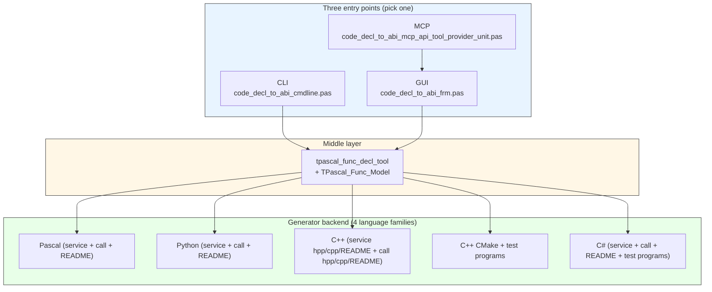
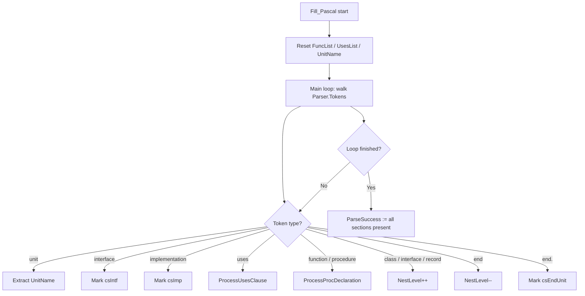
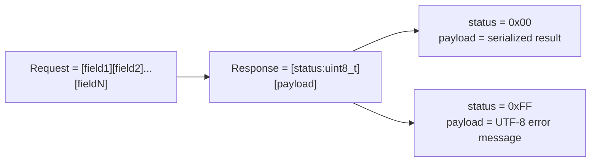
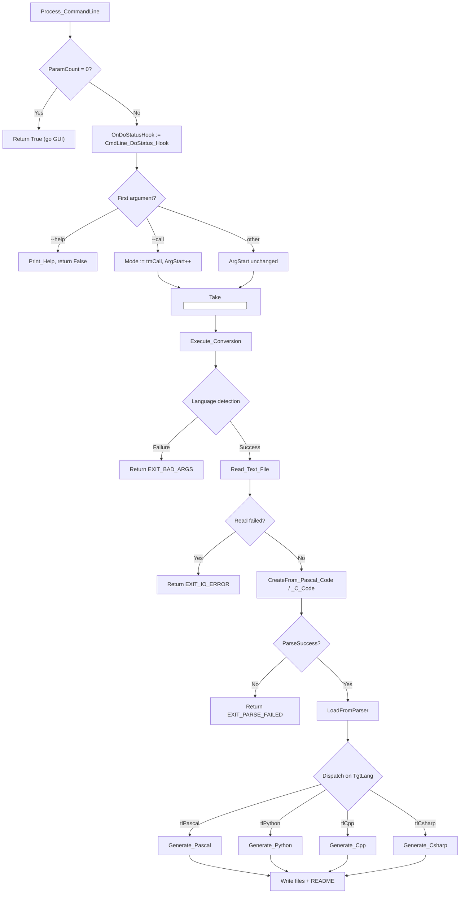
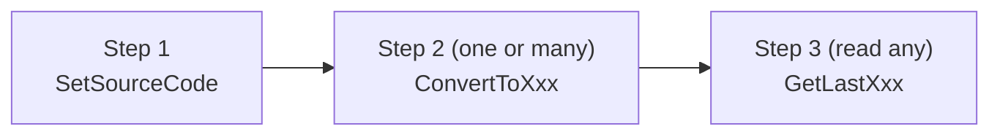
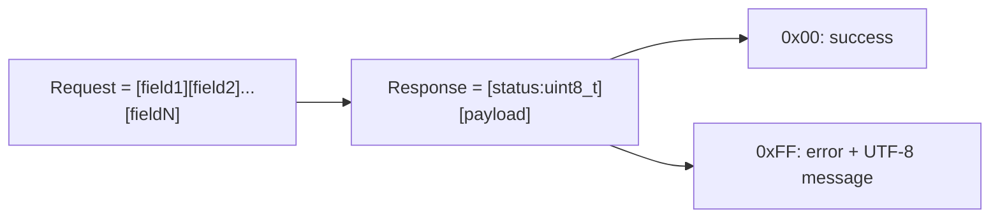

# code_decl_to_abi Operations Knowledge Base v4.0

> **Purpose**: A **construction-grade** reference for AI and human engineers. **After reading this, you can modify code, fix bugs, add languages, write tools, and integrate with MCP — without opening the source.**
>
> **What is new in v4.0 vs v3.0**:
> - **Fourth target language: C#.** Now four supported targets (Pascal, Python, C++, C#).
> - **31 MCP tools** (was 21). Added three Step-2 conversions and seven Step-3 readers for C#.
> - **CLI handles `.cs` output.** C# emits the complete set (service library + call library + two console tests + test README) in a single invocation; `--call` is accepted and ignored for `.cs`.
> - **Class-library convention for C#.** Both the service and call modules are entry-point-free. Runnable console entry points live in a dedicated C# test branch.
> - **New generator tool: `csharp_abi_test_generator_tool`.** Emits the two console programs and the shared test README.
> - **Operation rules for AI updated.** Two extra iron rules covering the C# entry-point convention and the MCP tool-count constant.
>
> **Roadmap**: The generator backend is explicitly engineered to accept an **unbounded number of target languages**. Adding a new language is a **mechanical 8-step process** (see Chapter 14). Any language with (a) a C-ABI-compatible FFI, (b) a runtime model that speaks LingoFuse's wire protocol, and (c) a way to marshal the three ABI families is a candidate.
>
> **Diagram convention**: Mermaid is used throughout; no ASCII-art diagrams.
>
> **Promise**: Every statement is line-by-line verified against the source units listed in Chapter 0. Anything I cannot determine is called out explicitly in Chapter 18 ("Not Covered by the Material").

---

## Chapter 0  Source Units Covered by This Document

| Unit | Role |
|------|------|
| `code_decl_to_abi.lpr` | Main program; dispatches CLI vs GUI |
| `code_decl_to_abi_cmdline.pas` | CLI front end |
| `code_decl_to_abi_frm.pas` | GUI front end |
| `code_decl_to_abi_frm.lfm` | GUI layout |
| `code_decl_to_abi_mcp_api_tool_provider_unit.pas` | MCP tool provider (31 tools) |
| `code_decl_to_abi_mcp_api.pas` | MCP declaration source (unit header) |
| `pas_abi_service_generator_tool.pas` | Pascal service generator |
| `pas_abi_call_generator_tool.pas` | Pascal call generator |
| `py_abi_service_generator_tool.pas` | Python service generator |
| `py_abi_call_generator_tool.pas` | Python call generator |
| `cpp_abi_service_generator_tool.pas` | C++ service generator |
| `cpp_abi_call_generator_tool.pas` | C++ call generator |
| `cpp_abi_cmake_generator_tool.pas` | C++ CMake + test-program generator |
| `csharp_abi_service_generator_tool.pas` | C# service generator |
| `csharp_abi_call_generator_tool.pas` | C# call generator |
| `csharp_abi_test_generator_tool.pas` | C# test-program generator |
| `pascal_code_abi_rule.md` | Pascal source declaration rule |
| `C_code_abi_rule.md` | C source declaration rule |
| `Z.Pascal_Func_Tool.pas` | Source parser (Pascal + C) |
| `Z.Pascal_Func_Model.pas` | Intermediate model |

---

## Table of Contents

- [Chapter 1  Reading Guide](#chapter-1--reading-guide)
- [Chapter 2  System Overview: Three Entry Points](#chapter-2--system-overview-three-entry-points)
- [Chapter 3  Build and Compilation Conventions](#chapter-3--build-and-compilation-conventions)
- [Chapter 4  Core Data Contracts](#chapter-4--core-data-contracts)
- [Chapter 5  Intermediate Model Contracts](#chapter-5--intermediate-model-contracts)
- [Chapter 6  Parser Internals](#chapter-6--parser-internals)
- [Chapter 7  Generator Internals](#chapter-7--generator-internals)
- [Chapter 8  README System](#chapter-8--readme-system)
- [Chapter 9  Command-Line Interface (CLI)](#chapter-9--command-line-interface-cli)
- [Chapter 10  MCP / Agent Interface (31 Tools)](#chapter-10--mcp--agent-interface)
- [Chapter 11  GUI Form Operations Manual](#chapter-11--gui-form-operations-manual)
- [Chapter 12  LingoFuse Integration Details](#chapter-12--lingofuse-integration-details)
- [Chapter 13  Known Bug List + Fixes](#chapter-13--known-bug-list--fixes)
- [Chapter 14  Adding a New Target Language](#chapter-14--adding-a-new-target-language)
- [Chapter 15  Adding a New Source Language](#chapter-15--adding-a-new-source-language)
- [Chapter 16  Debugging and Troubleshooting Manual](#chapter-16--debugging-and-troubleshooting-manual)
- [Chapter 17  Regression Test Entry Points](#chapter-17--regression-test-entry-points)
- [Chapter 18  Not Covered by the Material](#chapter-18--not-covered-by-the-material)
- [Chapter 19  Operating Rules for AI](#chapter-19--operating-rules-for-ai)

---

## Chapter 1  Reading Guide

### 1.1 Task Map

| Task | Covered | Where |
|------|:-------:|-------|
| Build the whole project | ✅ | Chapter 3 |
| Modify `tfunc_decl` fields | ✅ | Chapter 4 |
| Modify parser behaviour | ✅ | Chapter 6 |
| Modify generator output | ✅ | Chapter 7 |
| Modify / add a README | ✅ | Chapter 8 |
| Modify CLI arguments | ✅ | Chapter 9 |
| Modify / add an MCP tool | ✅ | Chapter 10 |
| Modify GUI controls | ✅ | Chapter 11 |
| Modify LingoFuse integration | ✅ | Chapter 12 |
| Fix a known bug | ✅ | Chapter 13 |
| **Add a new target language** | ✅ | **Chapter 14** |
| **Add a new source language** | ✅ | **Chapter 15** |
| Debug a specific error | ✅ | Chapter 16 |
| Run regression tests | ✅ | Chapter 17 |
| Know what's missing from the material | ✅ | Chapter 18 |

### 1.2 What an AI Should Be Able to Do After Reading This

1. See "add a `bool` type to the C++ generator" and locate the **three mapping tables** to modify.
2. See "add Go as a target language" and follow Chapter 14's checklist **item by item**.
3. See "make the CLI accept `.rs`" and modify `Detect_Target_Lang` as Chapter 9 describes.
4. See "add a new tool for the agent" and modify `code_decl_to_abi_mcp_api_tool_provider_unit.pas` as Chapter 10 describes.
5. See "the generated C# library brings a `Main`" and know immediately that it must not, per Chapter 7.
6. See "the generated README is missing a section" and locate the exact `Emit*` routine from Chapter 8.

---

## Chapter 2  System Overview: Three Entry Points

### 2.1 The Three Frontends

`code_decl_to_abi` has **three independent frontends** sharing one generator backend:


```mermaid
flowchart TD
    subgraph Front["Three entry points (pick one)"]
        CLI["CLI<br/>code_decl_to_abi_cmdline.pas"]
        GUI["GUI<br/>code_decl_to_abi_frm.pas"]
        MCP["MCP<br/>code_decl_to_abi_mcp_api_tool_provider_unit.pas"]
    end

    subgraph Mid["Middle layer"]
        Parser["tpascal_func_decl_tool<br/>+ TPascal_Func_Model"]
    end

    subgraph Back["Generator backend (4 language families)"]
        B1["Pascal (service + call + README)"]
        B2["Python (service + call + README)"]
        B3["C++ (service hpp/cpp/README + call hpp/cpp/README)"]
        B4["C++ CMake + test programs"]
        B5["C# (service + call + README + test programs)"]
    end

    CLI --> Parser
    GUI --> Parser
    MCP --> GUI

    Parser --> B1
    Parser --> B2
    Parser --> B3
    Parser --> B4
    Parser --> B5

    style Front fill:#e8f4ff,stroke:#444
    style Mid fill:#fff7e6,stroke:#444
    style Back fill:#e8ffe8,stroke:#444
```

### 2.2 Frontend Comparison

| Entry | Who calls it | Goes through GUI? | Goes through LingoFuse? | Writes files? |
|-------|--------------|:-----------------:|:-----------------------:|:-------------:|
| CLI | Command-line users | ❌ | ❌ | ✅ |
| GUI | Desktop users | ✅ | ✅ (service + tool registration) | ✅ |
| MCP | AI agents | ✅ (via `TCompute.Sync`) | ✅ (as a tool provider) | ✅ |

**Why MCP goes through the GUI**: `internal_call_*` uses `TCompute.Sync` to dispatch work to the main thread and calls the existing button event handlers in `code_decl_to_abi_frm.pas`. **This way, none of the GUI logic is duplicated.**

### 2.3 Main Program Dispatch

Startup order in `code_decl_to_abi.lpr`:

```pascal
begin
  try
    if not Process_CommandLine then
    begin
      exitCode := CommandLine_ExitCode;
      exit;
    end;

    RequireDerivedFormResource := True;
    Application.Scaled := True;
    Application.MainFormOnTaskbar := True;
    Application.Initialize;
    Application.CreateForm(Tcode_decl_to_abi_form, code_decl_to_abi_form);
    Application.Run;
  finally
    LF_Shutdown();
  end;
end.
```

**Logic**:
1. `Process_CommandLine` returns True (no arguments) → continue to GUI.
2. Returns False (CLI handled) → `exit`, using `CommandLine_ExitCode` as the process exit code.
3. `finally` calls `LF_Shutdown()` on every path.

**`uses` list (v4.0)**:

```pascal
uses
  mimalloc4p,
  {$IFDEF UNIX} cthreads, {$ENDIF}
  {$IFDEF HASAMIGA} athreads, {$ENDIF}
  Interfaces, Forms,
  lingofuse_import,
  code_decl_to_abi_frm,
  pas_abi_service_generator_tool,
  pas_abi_call_generator_tool,
  py_abi_service_generator_tool,
  py_abi_call_generator_tool,
  cpp_abi_service_generator_tool,
  cpp_abi_call_generator_tool,
  code_decl_to_abi_cmdline,
  code_decl_to_abi_mcp_api_tool_provider_unit,
  cpp_abi_cmake_generator_tool,
  csharp_abi_service_generator_tool,
  csharp_abi_call_generator_tool,
  csharp_abi_test_generator_tool;
```

**Roadmap note**: Adding `rust_abi_service_generator_tool` and `rust_abi_call_generator_tool` would be two more lines here; the pattern is unbounded.

---

## Chapter 3  Build and Compilation Conventions

### 3.1 Compiler Requirements

| Item | Requirement | Basis |
|------|-------------|-------|
| Compiler | FPC 3.2+ or Delphi 10.4+ | `{$DEFINE FPC_DELPHI_MODE}` |
| Mode | Delphi mode (`{$mode delphi}`) | `code_decl_to_abi.lpr` |
| Charset | UTF-8 (`{$CODEPAGE UTF8}`) | Every unit header |
| Platform | Windows / Linux / macOS | Depends on the LingoFuse runtime |

### 3.2 Path Conventions (**Easy to Trip Over**)

Each unit's `{$I}` path is **inconsistent**; keep as-is when editing:

| Unit | `{$I}` path |
|------|-------------|
| `Z.Pascal_Func_Model.pas` | `{$I ..\Z.Define.inc}` |
| `pas_abi_service_generator_tool.pas` | `{$I ..\..\..\Z.Define.inc}` |
| `py_abi_*_generator_tool.pas` | `{$I ..\..\..\Z.Define.inc}` |
| `cpp_abi_*_generator_tool.pas` | `{$I ..\..\..\Z.Define.inc}` |
| `cpp_abi_cmake_generator_tool.pas` | `{$I ..\..\..\Z.Define.inc}` |
| `csharp_abi_*_generator_tool.pas` | `{$I ..\..\..\Z.Define.inc}` |
| `code_decl_to_abi_frm.pas` | `{$I ..\..\..\Z.Define.inc}` |
| `code_decl_to_abi_mcp_api_tool_provider_unit.pas` | (no `{$I}`; pulls Z units via `uses`) |
| `code_decl_to_abi_cmdline.pas` | (no `{$I}`; pulls Z units via `uses`) |

**Rule**: a new unit that references macros from `Z.Define.inc` must copy the **three-level-up path**; otherwise use `uses` to pull Z units.

### 3.3 Build Command

```bash
lazbuild -B code_decl_to_abi.lpi
```

The tool is compiled as a console subsystem application so CLI mode produces stdout correctly and GUI mode still works.

### 3.4 Runtime Dependencies

| Dependency | Location | Consequence if missing |
|------------|----------|------------------------|
| `LingoFuse64.dll` / `liblingofuse.so` / `liblingofuse.dylib` | exe directory or system PATH | All `LF_*` calls fail |
| `pascal_code_abi_rule.md` | exe directory | GUI's `Open_pascal_rule_Button` does nothing |
| `C_code_abi_rule.md` | exe directory | GUI's `Open_c_rule_Button` does nothing |

These are needed only at **runtime**; the generator itself does not depend on the LingoFuse dynamic library.

### 3.5 Three Places to Register a New Generator Unit

When adding e.g. `rust_abi_service_generator_tool.pas`:

1. **`code_decl_to_abi.lpr` `uses`** — so its `initialization` runs.
2. **`code_decl_to_abi_frm.pas` `implementation uses`** — so its functions can be called.
3. **`code_decl_to_abi_mcp_api_tool_provider_unit.pas`** — if exposed via MCP, add branches in `RegisterAPIs` / `RegisterTools` / the `internal_call_*` family.

---

## Chapter 4  Core Data Contracts

### 4.1 `tfunc_param_decl` — Parameter Record

```pascal
tfunc_param_decl = record
  param_mod: TP_String;      // '' / 'const' / 'var' / 'out' / 'in'
  param_name: TP_String;     // parameter name
  param_typ: TP_String;      // type
  param_value: TP_String;    // default value
  param_array: TP_String;    // array suffix: '' / '[]' / '[N]'
  procedure reset;
end;
```

| Field | Meaning | Constraint | Downstream effect |
|-------|---------|-----------|-------------------|
| `param_mod` | Modifier | 5 legal values only | `LoadFromParser` rejects `var` / `out` |
| `param_name` | Parameter name | **Must not be empty** | Empty → whole declaration dropped |
| `param_typ` | Type | Must be recognized by `Normalize_ABI_Type` | Otherwise whole declaration dropped |
| `param_value` | Default value | Pascal-only | Rendered by `decl_to_pascal` |
| `param_array` | Array suffix | C-only | Rendered as `array of <type>` by `decl_to_pascal` |

### 4.2 `tfunc_decl` — Declaration Record

```pascal
tfunc_decl = record
  Body, Name, ParamDecl, ResultDecl, ResultMod, CallConv: TP_String;
  IsProc, IsFunction, IsExternal, HasExplicitName, HasExplicitIndex: boolean;
  BPos, EPos, Index, NestLevel: integer;
  param_arry: tfunc_param_arry;
  ExternalLibrary, ExplicitName, ExplicitIndex, Comment: TP_String;
  procedure Init;
  procedure Free;
end;
```

| Pitfall | Consequence |
|---------|-------------|
| `IsProc` defaults to False | Forget to set True → whole declaration dropped |
| `NestLevel` defaults to 0 | Forget to increment inside a class → mistaken for top-level |
| `Index` defaults to -1 | Assign `i` manually when adding |

### 4.3 `TFuncDeclList` — Declaration List

```pascal
TFuncDeclList = class(TBigList<pfunc_decl>)
public
  procedure DoFree(var Data: pfunc_decl); override;
end;

procedure TFuncDeclList.DoFree(var Data: pfunc_decl);
begin
  if Data <> nil then
    begin
      Data^.Free;
      Dispose(Data);
      Data := nil;
    end;
end;
```

### 4.4 `tpascal_func_decl_tool` — Parser Tool

- **`Parser` is owned by the tool**, freed automatically on destruction.
- **`FuncList` stores only entries with `IsProc=True`**; ordinary tokens are released immediately.
- **`ParseSuccess`**: for Pascal needs `unit` + `interface` + `implementation` + `end.`; for C needs `FuncCount > 0`.

---

## Chapter 5  Intermediate Model Contracts

### 5.1 Structure Records

```pascal
TParamStructure = record
  Name, Typ, PascalType, Description: TP_String;
  procedure Clear;
end;

TFunctionStructure = record
  Name: TP_String;
  IsFunction: boolean;
  Params: TParamArray;
  ReturnType: TP_String;
  Comment: TP_String;
  procedure Clear;
  function Clone: TFunctionStructure;
end;
```

### 5.2 `Normalize_ABI_Type` Mapping Table

**`tnf_ABI` mode**: preserve the lowercase form of the original type name.

| Input type (lowercase) | Normalized result | Family |
|------------------------|-------------------|--------|
| `integer`, `int64`, `cardinal`, `longint`, `dword` | same name | integer |
| `word`, `smallint`, `byte`, `uint64`, `longword` | same name | integer |
| `double`, `single`, `extended`, `real` | same name | float |
| `tpascalstring`, `tupascalstring`, `tp_string`, `string`, `ansistring`, `unicodestring` | same name | string |
| `pchar`, `pansichar`, `pwidechar` | same name | string |
| **anything else** | `''` | unsupported |

**`tnf_Json` mode**: collapse to `'int64'` / `'double'` / `'string'`.

**The ABI generators require `tnf_ABI`.** Setting `tnf_Json` will produce empty type strings and drop every routine.

### 5.3 The Six Filters in `LoadFromParser`

```pascal
// Filter 1: not a procedure/function
if not decl^.IsProc then Continue;
// Filter 2: nested declaration
if decl^.NestLevel <> 0 then Continue;
// Filter 3: empty parameter name
if paramDecl.param_name = '' then begin ok := False; Break; end;
// Filter 4: var / out parameter
if paramDecl.param_mod.Same('var', 'out') then begin ok := False; Break; end;
// Filter 5: unsupported parameter type
if normTyp = '' then begin ok := False; Break; end;
// Filter 6: unsupported return type (function only)
if f.ReturnType = '' then Continue;
```

**Any triggered filter silently drops the entire declaration** and records a line in `Report`.

---

## Chapter 6  Parser Internals

### 6.1 `Fill_Pascal` Main Loop


```mermaid
flowchart TD
    A["Fill_Pascal start"] --> B["Reset FuncList / UsesList / UnitName"]
    B --> C["Main loop: walk Parser.Tokens"]
    C --> D{"Token type?"}
    D -- "unit" --> E["Extract UnitName"]
    D -- "interface" --> F["Mark csIntf"]
    D -- "implementation" --> G["Mark csImp"]
    D -- "uses" --> H["ProcessUsesClause"]
    D -- "function / procedure" --> I["ProcessProcDeclaration"]
    D -- "class / interface / record" --> J["NestLevel++"]
    D -- "end" --> K["NestLevel--"]
    D -- "end." --> L["Mark csEndUnit"]
    C --> M{"Loop finished?"}
    M -- "No" --> D
    M -- "Yes" --> N["ParseSuccess := all sections present"]
```

### 6.2 `Fill_C` Main Loop

1. Extract `UnitName` from the `.h` filename or include guard.
2. Main loop skips whitespace, comments, preprocessor directives.
3. `{` blocks: `ShouldSkipBlock` decides skip vs pass-through.
4. `;` triggers `ProcessStatement`.
5. `ProcessStatement` rejects: `=` initialization, function-pointer parameters, missing `()`.

### 6.3 `Translate_C_Typ_To_Pascal` Full Mapping Table

| C type | Pascal type |
|--------|-------------|
| `signed char` / `int8_t` | `ShortInt` |
| `short` / `int16_t` | `SmallInt` |
| `int` / `int32_t` | `Integer` |
| `long` / `long int` | `LongInt` |
| `long long` / `int64_t` | `Int64` |
| `unsigned char` / `uint8_t` | `Byte` |
| `unsigned short` / `uint16_t` | `Word` |
| `unsigned` / `unsigned int` / `uint32_t` | `Cardinal` |
| `unsigned long` / `unsigned long int` | `LongWord` |
| `unsigned long long` / `uint64_t` | `UInt64` |
| `size_t` / `uintptr_t` | `UInt64` |
| `ssize_t` / `ptrdiff_t` / `intptr_t` | `Int64` |
| `float` | `Single` |
| `double` | `Double` |
| `long double` | `Extended` |
| `char *` / `const char *` / `char const *` | `string` |
| **anything else with `*`** | `Pointer` — **rejected by the Pascal whitelist** |
| `void` (as return type) | `''` (empty) |
| **anything else** | preserved as-is |

**Cross-layer pitfall**: `void *` is accepted by `Fill_C`, mapped to `Pointer` by `Translate_C_Typ_To_Pascal`, then **rejected by `LoadFromParser`** because `Pointer` is not on the Pascal whitelist. To carry an address, use `uint64_t` on the C side.

---

## Chapter 7  Generator Internals

### 7.1 Common Generator Skeleton

Every generator has:

```pascal
function CollectSupportedFunctions(Model: TPascal_Func_Model): TArryFunctionStructure;
```

with three filter conditions: unsupported parameter type, unsupported return type, empty name.

**The set of supported ABI types is identical across all generators.**

### 7.2 The Generator Matrix (v4.0)

| Generator unit | Exported functions | Output |
|----------------|--------------------|--------|
| `pas_abi_service_generator_tool` | `GenerateABIServicePascalCode` / `...PascalReadme` | `.pas` + `.md` |
| `pas_abi_call_generator_tool` | `GenerateABICallPascalCode` / `...PascalReadme` | `.pas` + `.md` |
| `py_abi_service_generator_tool` | `GenerateABIServicePyCode` / `...PyReadme` | `.py` + `.md` |
| `py_abi_call_generator_tool` | `GenerateABICallPyCode` / `...PyReadme` | `.py` + `.md` |
| `cpp_abi_service_generator_tool` | `GenerateABIServiceHppCode` / `...CppCode` / `...CppReadme` | `.hpp` + `.cpp` + `.md` |
| `cpp_abi_call_generator_tool` | `GenerateABICallHppCode` / `...CppCode` / `...CppReadme` | `.hpp` + `.cpp` + `.md` |
| `cpp_abi_cmake_generator_tool` | `GenerateABICmakeScript` / `GenerateABIServiceTestProgram` / `GenerateABICallTestProgram` | `CMakeLists.txt` + two `main.cpp` |
| **`csharp_abi_service_generator_tool`** | `GenerateABIServiceCsharpCode` / `...CsharpReadme` | `.cs` + `.md` |
| **`csharp_abi_call_generator_tool`** | `GenerateABICallCsharpCode` / `...CsharpReadme` | `.cs` + `.md` |
| **`csharp_abi_test_generator_tool`** | `GenerateABIServiceMainTestCsharpCode` / `GenerateABICallMainTestCsharpCode` / `GenerateABICsharpTestReadme` | two test `.cs` + `.md` |

**Total exported generator functions: 22** (5 pairs of service/call generators × 2 functions, plus 3 C++ CMake/test functions, plus 3 C# test functions, plus 2 pairs of C# service/call functions — 22 in all).

### 7.3 C# Backend — Design Notes

**The C# pair is a class library, not a program.** Both the service module and the call module are:

- **Entry-point-free.** No `Program` class, no `Main` method.
- **Single-file self-contained.** Each `.cs` file carries its own `LfNative` (P/Invoke), its own `LfIo` (little-endian serialization helpers), and its own exception type. No shared project files required.
- **Namespace-isolated.** Service side uses `<unit>_abi`; call side uses `<unit>_abi_call`. The two files can live side by side in the same project without symbol collisions.

**Why**: a C# project may have exactly one `Main`. If the service library brought its own `Main`, any host program — or the paired test program — would immediately trigger `CS0017: Program has more than one entry point defined`. Keeping the library entry-point-free lets it be referenced by any number of console, GUI, service, or test projects.

**The test programs live in their own branch.** `csharp_abi_test_generator_tool` emits:

- `<Unit>_abi_service_main_test___.cs` — service-side console entry point.
- `<Unit>_abi_call_main_test___.cs` — call-side console entry point.
- `<Unit>_abi_test_csharp.md` — shared test README.

Each test file is intended to be compiled into **its own .NET console project**, alongside the matching library `.cs` file. Running the service test in one terminal and the call test in another produces an end-to-end smoke test.

### 7.4 Type Mapping Table (Per Target)

**Pascal**:

```pascal
function ABI_Type_To_Pascal_Decl(const T: TP_String): TP_String;
begin
  if T.Same('integer') then Result := 'Integer'
  else if T.Same('int64') then Result := 'Int64'
  else if T.Same('cardinal') then Result := 'Cardinal'
  else if T.Same('longint') then Result := 'LongInt'
  else if T.Same('dword') then Result := 'DWord'
  else if T.Same('word') then Result := 'Word'
  else if T.Same('smallint') then Result := 'SmallInt'
  else if T.Same('byte') then Result := 'Byte'
  else if T.Same('uint64') then Result := 'UInt64'
  else if T.Same('longword') then Result := 'LongWord'
  else if T.Same('double') then Result := 'Double'
  else if T.Same('single') then Result := 'Single'
  else if T.Same('extended') then Result := 'Extended'
  else if T.Same('real') then Result := 'Real'
  else if stringFamily then Result := 'string'
  else Result := '';
end;
```

**Python**:

| ABI | Python |
|-----|--------|
| any integer | `int` |
| any float | `float` |
| any string | `str` |

**C++**:

```pascal
function ABI_Type_To_Cpp_Decl(const T: TP_String): TP_String;
begin
  if T.Same('integer') or T.Same('longint') then Result := 'int32_t'
  else if T.Same('int64') then Result := 'int64_t'
  else if T.Same('cardinal') or T.Same('dword') or T.Same('longword') then Result := 'uint32_t'
  else if T.Same('word') then Result := 'uint16_t'
  else if T.Same('smallint') then Result := 'int16_t'
  else if T.Same('byte') then Result := 'uint8_t'
  else if T.Same('uint64') then Result := 'uint64_t'
  else if T.Same('double') or T.Same('extended') or T.Same('real') then Result := 'double'
  else if T.Same('single') then Result := 'float'
  else if stringFamily then Result := 'std::string'
  else Result := '';
end;
```

**C#**:

```pascal
function ABI_Type_To_CSharp_Decl(const T: TP_String): TP_String;
begin
  if T.Same('integer') or T.Same('longint') then Result := 'int'
  else if T.Same('int64') then Result := 'long'
  else if T.Same('cardinal') or T.Same('dword') or T.Same('longword') then Result := 'uint'
  else if T.Same('word') then Result := 'ushort'
  else if T.Same('smallint') then Result := 'short'
  else if T.Same('byte') then Result := 'byte'
  else if T.Same('uint64') then Result := 'ulong'
  else if T.Same('double') or T.Same('extended') or T.Same('real') then Result := 'double'
  else if T.Same('single') then Result := 'float'
  else if stringFamily then Result := 'string'
  else Result := '';
end;
```

### 7.5 Wire Protocol (All Generators Must Follow)


```mermaid
flowchart LR
    A["Request = [field1][field2]...[fieldN]"] --> B["Response = [status:uint8_t][payload]"]
    B --> C["status = 0x00<br/>payload = serialized result"]
    B --> D["status = 0xFF<br/>payload = UTF-8 error message"]
```

| Type | Encoding |
|------|----------|
| Integer | little-endian, fixed width |
| String | raw UTF-8 + single NUL terminator |
| Float | IEEE 754 (`Single` 4 bytes, `Double` 8 bytes) |

**Rules for every generator**:

1. The **request** carries parameters in declaration order, no framing, no tags.
2. The **response** starts with a `uint8_t` status byte.
3. On success, the payload is the serialized result (or empty for procedures).
4. On failure, the payload is a UTF-8 message terminated by a single NUL byte.
5. The service must **never** throw across the C ABI boundary; every callback wraps its body in `try/catch` and writes `0xFF` on failure.

---

## Chapter 8  README System

### 8.1 Purpose

Every generator emits **both code and a Markdown README**. The README is the **knowledge base for the generated target**, readable by an AI agent that has received the generated code but has no other documentation.

**Core idea**: **Code is for the compiler; the README is for the agent.** Both come from the same `TPascal_Func_Model`, so they never drift apart.

### 8.2 The 12-Section Standard Structure

| § | Title | Content |
|:-:|-------|---------|
| 1 | Overview | What this code is, design principles, three-step quickstart |
| 2 | Application Scope | When to use / not use; comparison with other RPC approaches |
| 3 | Compatibility | Compiler / runtime versions, platforms, dependencies, threading model |
| 4 | Wire Protocol | Request/response shapes, encoding rules, call sequence |
| 5 | Runtime Architecture | Startup order, call sequence, timeouts, target app name |
| 6 | Type Mapping | Supported types, unsupported types, endianness, NUL terminator |
| 7 | Deployment | Directory layout, build commands, startup order, shutdown order |
| 8 | Testing | A fully copy-pasteable test program |
| 9 | API Reference | Summary table + per-API details |
| 10 | Troubleshooting | Symptom / cause / fix table |
| 11 | Self-Assessment Checklist | Questions a reader should be able to answer |
| 12 | Reference Resources | Related toolchain index |

### 8.3 README Generator Skeleton

```pascal
function GenerateABIServicePascalReadme(Model: TPascal_Func_Model): TPascalStringList;
var
  L: TPascalStringList;
  SupportedFuncs: TArryFunctionStructure;
  UnitName, NormalizedUnit, AppName: TP_String;

  procedure EmitHeader; begin ... end;
  procedure EmitOverview; begin ... end;
  procedure EmitApplicationScope; begin ... end;
  procedure EmitCompatibility; begin ... end;
  procedure EmitWireProtocol; begin ... end;
  procedure EmitRuntimeArchitecture; begin ... end;
  procedure EmitTypeMapping; begin ... end;
  procedure EmitDeployment; begin ... end;
  procedure EmitTesting; begin ... end;
  procedure EmitApiReference; begin ... end;
  procedure EmitTroubleshooting; begin ... end;
  procedure EmitSelfAssessment; begin ... end;
  procedure EmitResources; begin ... end;
begin
  Result := TPascalStringList.Create;
  if Model = nil then begin Result.Add('# README generation skipped'); Exit; end;
  UnitName := Model.UnitName;
  if UnitName.Len = 0 then begin ...; Exit; end;
  NormalizedUnit := MakeApiName(UnitName);
  AppName := NormalizedUnit + '_abi';
  SupportedFuncs := CollectSupportedFunctions(Model);
  L := Result;
  try
    EmitHeader;
    EmitOverview;
    EmitApplicationScope;
    EmitCompatibility;
    EmitWireProtocol;
    EmitRuntimeArchitecture;
    EmitTypeMapping;
    EmitDeployment;
    EmitTesting;
    EmitApiReference;
    EmitTroubleshooting;
    EmitSelfAssessment;
    EmitResources;
  finally
  end;
end;
```

### 8.4 Section 9 (`API Reference`) Is the Core

`EmitApiReference` walks `SupportedFuncs` and produces, per API:

- A summary table row.
- A `#### Description` paragraph.
- A `#### Parameters` table.
- A `#### Request layout` block.
- A `#### Success response layout` block.
- A `#### Error response` paragraph.
- A `#### Call example` code block.

**Key dependency**: `GetFullDescription(Func.Comment)` extracts the first non-empty, non-Doxygen line of the comment. In the source, the comment **must be adjacent to the declaration**; otherwise the tool description will be empty.

### 8.5 The Fixed Troubleshooting Table (Section 10)

Every README's troubleshooting table contains at least:

| Symptom | Cause | Fix |
|---------|-------|-----|
| `LF_PrepareDone` returns 0 | Target service not started | Start the service first |
| `EABIRemoteError: nil (timeout)` | App name mismatch | Check target app name |
| `EABIRemoteError: "input truncated"` | Parameter count wrong | Check client-side writes |
| `EABIRemoteError: <garbled>` | Encoding mismatch | Check type table |
| Return value incorrect | Endianness mismatch | Check byte order |
| Callback never fires | Stub not implemented | Search for `TODO` |
| UI crashes | Worker thread touched UI | Use sync callback variants |
| MSVC warns about non-ASCII | Missing `/utf-8` | Add `/utf-8` |

### 8.6 README Naming Convention

| Target | Code file | README file |
|--------|-----------|-------------|
| Pascal Service | `<Unit>_abi_service_unit.pas` | `<Unit>_abi_service_pascal.md` |
| Pascal Call | `<Unit>_abi_call_unit.pas` | `<Unit>_abi_call_pascal.md` |
| Python Service | `<Unit>_abi_service.py` | `<Unit>_abi_service_python.md` |
| Python Call | `<Unit>_abi_call.py` | `<Unit>_abi_call_python.md` |
| C++ Service | `<Unit>_abi_service.hpp` + `.cpp` | `<Unit>_abi_service_cpp.md` |
| C++ Call | `<Unit>_abi_call.hpp` + `.cpp` | `<Unit>_abi_call_cpp.md` |
| **C# Service** | `<Unit>_abi_service.cs` | `<Unit>_abi_service_csharp.md` |
| **C# Call** | `<Unit>_abi_call.cs` | `<Unit>_abi_call_csharp.md` |
| **C# Test** | `<Unit>_abi_service_main_test___.cs` + `<Unit>_abi_call_main_test___.cs` | `<Unit>_abi_test_csharp.md` |

**CLI README naming rule** (see Chapter 9): `<output basename>_readme.md`.

### 8.7 Change List for Modifying a README

**Add a section**:
1. Define a new `procedure EmitXxx;` inside the target `GenerateABI*Readme` function.
2. Call it from the `try...finally` block, in the desired order.

**Change wording**:
1. Find the corresponding `EmitXxx` procedure.
2. Modify the strings passed to `L.Add(...)`.

**Make a section display API-specific data**:
- Use the `SupportedFuncs` array.
- Use existing helpers such as `MakeApiName(Func.Name)` and `ABI_Type_To_<Lang>_Decl(Func.ReturnType)`.

---

## Chapter 9  Command-Line Interface (CLI)

### 9.1 What the CLI Is

`code_decl_to_abi_cmdline.pas` is the **GUI-free command-line entry point**, letting scripts, CI, and automation invoke the generator directly. It shares the same backend as the GUI and calls the generator functions directly.

### 9.2 Main Program Dispatch

```pascal
begin
  try
    if not Process_CommandLine then
    begin
      exitCode := CommandLine_ExitCode;
      exit;
    end;
    // ... GUI startup
  finally
    LF_Shutdown();
  end;
end.
```

- `Process_CommandLine` returns **True** → no arguments; continue to GUI.
- Returns **False** → CLI handled; `exit` and set the exit code.

### 9.3 CLI Argument Forms

| Form | Behaviour |
|------|-----------|
| `code_decl_to_abi` | Launch the GUI |
| `code_decl_to_abi --help` / `-h` / `-?` / `/?` | Print help |
| `code_decl_to_abi <input> <output>` | Generate **Service** side |
| `code_decl_to_abi --call <input> <output>` / `-c <input> <output>` | Generate **Call** side |

### 9.4 Source-Language Detection

```pascal
function Detect_Source_Lang(const FileName: string): TSourceLang;
begin
  Ext := LowerCase(ExtractFileExt(FileName));
  if (Ext = '.pas') or (Ext = '.pp') or (Ext = '.p') then Result := slPascal
  else if (Ext = '.h') or (Ext = '.hpp') or (Ext = '.hh')
       or (Ext = '.c') or (Ext = '.cpp') or (Ext = '.cc') or (Ext = '.cxx') then Result := slC
  else Result := slUnknown;
end;
```

### 9.5 Target-Language Detection (v4.0)

```pascal
type
  TTargetLang = (tlPascal, tlPython, tlCpp, tlCsharp, tlUnknown);

function Detect_Target_Lang(const FileName: string): TTargetLang;
begin
  Ext := LowerCase(ExtractFileExt(FileName));
  if (Ext = '.pas') or (Ext = '.pp') or (Ext = '.p') then Result := tlPascal
  else if Ext = '.py' then Result := tlPython
  else if (Ext = '.hpp') or (Ext = '.hh') or (Ext = '.h')
       or (Ext = '.cpp') or (Ext = '.cc') or (Ext = '.cxx') or (Ext = '.c') then Result := tlCpp
  else if Ext = '.cs' then Result := tlCsharp
  else Result := tlUnknown;
end;
```

### 9.6 Target Language × Side Matrix

| Target | Service output | Call output |
|--------|----------------|-------------|
| Pascal | `.pas` | `.pas` |
| Python | `.py` | `.py` |
| C++ | `.hpp` + `.cpp` | `.hpp` + `.cpp` |
| **C#** | **`.cs` (library, no `Main`)** | **`.cs` (library, no `Main`)** |

**C++ special case**: whether you name the output `.hpp` or `.cpp`, both files are always written with the same base name.

**C# special case**: **every `.cs` invocation writes the complete set** (service library, call library, both console test programs, shared test README). The `--call` flag is accepted for interface compatibility but **ignored** for `.cs`. Rationale: the two console test programs reference **both libraries** by namespace; emitting only one library would leave the test projects uncompilable until a second run completed the picture.

### 9.7 Exit Codes

| Code | Constant | Meaning |
|:----:|----------|---------|
| 0 | `EXIT_OK` | Conversion succeeded |
| 1 | `EXIT_BAD_ARGS` | Missing or invalid arguments |
| 2 | `EXIT_PARSE_FAILED` | Source parsing failed |
| 3 | `EXIT_GEN_FAILED` | Code generation failed |
| 4 | `EXIT_IO_ERROR` | File I/O error |

### 9.8 Output File Naming

**Pascal and Python** honour the caller's file name as-is.

**C++ and C#** replace the file name with a canonical name derived from the parsed source-unit name. The **directory part** of the caller's output argument is respected; only the file name is replaced.

```pascal
function Companion_Readme_Path(const OutputFile: string): string;
var
  Dir, Base: string;
begin
  Dir := ExtractFileDir(OutputFile);
  Base := ChangeFileExt(ExtractFileName(OutputFile), '');
  Result := IncludeTrailingPathDelimiter(Dir) + Base + '_readme.md';
end;

procedure Cpp_Paths_From_Output(const OutputFile: string;
  out HppPath, CppPath: string);
var
  Dir, Base: string;
begin
  Dir := ExtractFileDir(OutputFile);
  Base := ChangeFileExt(ExtractFileName(OutputFile), '');
  HppPath := IncludeTrailingPathDelimiter(Dir) + Base + '.hpp';
  CppPath := IncludeTrailingPathDelimiter(Dir) + Base + '.cpp';
end;
```

### 9.9 Usage Examples (v4.0)

```bash
# Help
code_decl_to_abi --help

# Pascal → Pascal Service
code_decl_to_abi calculator.pas calculator_service.pas
# Output:
#   calculator_service.pas
#   calculator_service_readme.md

# Pascal → Pascal Call
code_decl_to_abi --call calculator.pas calculator_call.pas

# C header → Python Service
code_decl_to_abi ComplexTestUnit.h calculator_service.py

# C header → C++ Service (two files are auto-produced)
code_decl_to_abi ComplexTestUnit.h calculator_service.hpp
# Output:
#   calculator_service.hpp
#   calculator_service.cpp
#   calculator_service_readme.md

# C header → C# (the complete set is written in one run;
#               --call has no effect for .cs)
code_decl_to_abi ComplexTestUnit.h out/Calculator.cs
# Output:
#   out/ComplexTestUnit_abi_service.cs
#   out/ComplexTestUnit_abi_service_csharp.md
#   out/ComplexTestUnit_abi_call.cs
#   out/ComplexTestUnit_abi_call_csharp.md
#   out/ComplexTestUnit_abi_service_main_test___.cs
#   out/ComplexTestUnit_abi_call_main_test___.cs
#   out/ComplexTestUnit_abi_test_csharp.md
```

### 9.10 CLI Internal Flow


```mermaid
flowchart TD
    A["Process_CommandLine"] --> B{"ParamCount = 0?"}
    B -- "Yes" --> Z["Return True (go GUI)"]
    B -- "No" --> C["OnDoStatusHook := CmdLine_DoStatus_Hook"]
    C --> D{"First argument?"}
    D -- "--help" --> H["Print_Help, return False"]
    D -- "--call" --> E["Mode := tmCall, ArgStart++"]
    D -- "other" --> F["ArgStart unchanged"]
    E --> G["Take <input> <output>"]
    F --> G
    G --> I["Execute_Conversion"]
    I --> J{"Language detection"}
    J -- "Failure" --> K["Return EXIT_BAD_ARGS"]
    J -- "Success" --> L["Read_Text_File"]
    L --> M{"Read failed?"}
    M -- "Yes" --> N["Return EXIT_IO_ERROR"]
    M -- "No" --> O["CreateFrom_Pascal_Code / _C_Code"]
    O --> P{"ParseSuccess?"}
    P -- "No" --> Q["Return EXIT_PARSE_FAILED"]
    P -- "Yes" --> R["LoadFromParser"]
    R --> S{"Dispatch on TgtLang"}
    S -- "tlPascal" --> T["Generate_Pascal"]
    S -- "tlPython" --> U["Generate_Python"]
    S -- "tlCpp" --> V["Generate_Cpp"]
    S -- "tlCsharp" --> V2["Generate_Csharp"]
    T --> W["Write files + README"]
    U --> W
    V --> W
    V2 --> W
```

### 9.11 CLI Output Hook

The CLI uses a custom `DoStatus` hook that writes directly to stdout, **bypassing the Z.Status queue** (there is no main-loop driving the queue in CLI mode).

```pascal
procedure CmdLine_DoStatus_Hook(Text_: SystemString; const ID: Integer);
begin
  WriteLn(Text_);
end;
```

At the top of `Process_CommandLine`:

```pascal
OnDoStatusHook := @CmdLine_DoStatus_Hook;
```

**Key**: `code_decl_to_abi.lpr` is compiled with `{$apptype console}` so console output works from the same binary that runs the GUI.

---

## Chapter 10  MCP / Agent Interface

### 10.1 Positioning

`code_decl_to_abi_mcp_api_tool_provider_unit.pas` wraps the entire generator as **31 LingoFuse Call APIs** and registers them with the **agent beacon** (`agent_main_app`) for MCP clients to discover and invoke.

**Core idea**: **Simulate GUI operations.** Every `internal_call_*` uses `TCompute.Sync` to dispatch work to the main thread and calls the button event handlers already present in `code_decl_to_abi_frm.pas`.

### 10.2 Constants

```pascal
var
  MY_APP_NAME : string = 'code_decl_to_abi_mcp_api';
  MY_APP_DESC : string = 'Tool provider for unit code_decl_to_abi_mcp_api';
  IPC_ENDPOINT : string = 'ipc:agent';
  BEACON_APP : string = 'agent_main_app';
  REGISTER_API : string = 'register_agent';
  AGENT_LOG_API : string = 'agent_log';
  DEBUG_LOG : boolean = True;
```

### 10.3 Three-Phase Workflow


```mermaid
flowchart LR
    S1["Step 1<br/>SetSourceCode"] --> S2["Step 2 (one or many)<br/>ConvertToXxx"]
    S2 --> S3["Step 3 (read any)<br/>GetLastXxx"]
```

- **Step 1 is setup**, produces no files.
- **Step 2 branches are independent**: one `SetSourceCode` can trigger any number of `ConvertToXxx` calls.
- **Step 3 is pure read**, pulling from the cache.

### 10.4 The 31 Tools (v4.0)

#### Step 1 — One Tool

| # | Tool | Parameters | Return |
|:-:|------|------------|--------|
| 1 | `CodeDeclToAbi_SetSourceCode` | `Source: string`, `Language: string` | `{"status":"ok"}` |

#### Step 2 — Nine Converters

| # | Tool | Target | Return |
|:-:|------|--------|--------|
| 2 | `CodeDeclToAbi_ConvertToPascalService` | Pascal service | `{"result":...,"readme":...}` |
| 3 | `CodeDeclToAbi_ConvertToPascalCall` | Pascal call | `{"result":...,"readme":...}` |
| 4 | `CodeDeclToAbi_ConvertToPythonService` | Python service | `{"result":...,"readme":...}` |
| 5 | `CodeDeclToAbi_ConvertToPythonCall` | Python call | `{"result":...,"readme":...}` |
| 6 | `CodeDeclToAbi_ConvertToCppService` | C++ service | `{"result":...,"impl":...,"readme":...}` |
| 7 | `CodeDeclToAbi_ConvertToCppCall` | C++ call | `{"result":...,"impl":...,"readme":...}` |
| 8 | **`CodeDeclToAbi_ConvertToCsharpService`** | **C# service library** | **`{"result":...,"readme":...}`** |
| 9 | **`CodeDeclToAbi_ConvertToCsharpCall`** | **C# call library** | **`{"result":...,"readme":...}`** |
| 10 | **`CodeDeclToAbi_ConvertToCsharpTest`** | **C# console tests** | **`{"result":...,"impl":...,"readme":...}`** |

#### Step 3 — Twenty-One Readers

| # | Tool | Return |
|:-:|------|--------|
| 11 | `CodeDeclToAbi_GetLastPascalServiceCode` | Service unit text |
| 12 | `CodeDeclToAbi_GetLastPascalServiceReadme` | README text |
| 13 | `CodeDeclToAbi_GetLastPascalCallCode` | Call unit text |
| 14 | `CodeDeclToAbi_GetLastPascalCallReadme` | README text |
| 15 | `CodeDeclToAbi_GetLastPythonServiceCode` | Python module text |
| 16 | `CodeDeclToAbi_GetLastPythonServiceReadme` | README text |
| 17 | `CodeDeclToAbi_GetLastPythonCallCode` | Python module text |
| 18 | `CodeDeclToAbi_GetLastPythonCallReadme` | README text |
| 19 | `CodeDeclToAbi_GetLastCppServiceHeader` | `.hpp` text |
| 20 | `CodeDeclToAbi_GetLastCppServiceImpl` | `.cpp` text |
| 21 | `CodeDeclToAbi_GetLastCppServiceReadme` | README text |
| 22 | `CodeDeclToAbi_GetLastCppCallHeader` | `.hpp` text |
| 23 | `CodeDeclToAbi_GetLastCppCallImpl` | `.cpp` text |
| 24 | `CodeDeclToAbi_GetLastCppCallReadme` | README text |
| 25 | **`CodeDeclToAbi_GetLastCsharpServiceCode`** | **C# service library text** |
| 26 | **`CodeDeclToAbi_GetLastCsharpServiceReadme`** | **README text** |
| 27 | **`CodeDeclToAbi_GetLastCsharpCallCode`** | **C# call library text** |
| 28 | **`CodeDeclToAbi_GetLastCsharpCallReadme`** | **README text** |
| 29 | **`CodeDeclToAbi_GetLastCsharpServiceTestCode`** | **Service test program text** |
| 30 | **`CodeDeclToAbi_GetLastCsharpCallTestCode`** | **Call test program text** |
| 31 | **`CodeDeclToAbi_GetLastCsharpTestReadme`** | **Shared test README text** |

**Roadmap note**: each new target language adds **exactly one Convert tool + two Readers** for a single-file language (or one Convert + three Readers for a two-file language like C++). **The C# branch adds one extra Convert (the test branch) because its console entry points cannot be folded into the library files.**

### 10.5 Three Public Entry Points

```pascal
function RegisterAPIs: TAppHnd___;       // Create App + register 31 Call APIs
function RegisterTools: Boolean;         // Connect to beacon + register 31 tool schemas
function Execute_And_Reg_all: Boolean;   // One-shot: RegisterAPIs + Prepare + RegisterTools
```

**`Execute_And_Reg_all` flow**:

```pascal
App := RegisterAPIs();
if App = nil then Exit;

if LF_CheckMainThreadEx then
  begin
    LF_PrepareClientEx(IPC_ENDPOINT, App);
    Result := RegisterTools();
  end
else
  begin
    LF_PrepareClientEx(IPC_ENDPOINT, App);
    if LF_PrepareDone() > 0 then
      Result := RegisterTools();
  end;
```

**Key points**:
- **App name = `MY_APP_NAME = 'code_decl_to_abi_mcp_api'`**.
- **All 31 APIs are registered on the same App**.
- **`LF_PrepareDone` is called only when the main thread has not yet started**.

### 10.6 `TCompute.Sync` Pattern

Every `internal_call_*` uses the same pattern:

```pascal
function internal_call_CodeDeclToAbi_XXX_CodeDeclToAbi_XXX(...): string;
{$IFDEF FPC}
  procedure Do_Sync___();
  begin
    // All UI operations happen here.
    Result := ...;
  end;
{$ELSE FPC}
var temp_: string;
{$ENDIF FPC}
begin
{$IFDEF FPC}
  TCompute.Sync(Do_Sync___);
{$ELSE FPC}
  TCompute.Sync(procedure()
  begin
    // All UI operations happen here.
    temp_ := ...;
  end);
  Result := temp_;
{$ENDIF FPC}
end;
```

- **`Do_Sync___` runs on the main thread**.
- **FPC captures `Result` directly through a nested procedure.**
- **Delphi requires an explicit local `temp_` because anonymous methods cannot capture `Result`.**

### 10.7 `Work_*` Helper Functions

Common logic is factored into `Work_*` functions that **run on the main thread**:

```pascal
// Apply language to the combo box and fire OnChange
function Work_Apply_Language(const Language: string): Boolean;

// Shared parse → model → generate-all pipeline
function Work_Parse_And_Generate: string;   // '' on success

// Nine conversion branches
function Work_Convert_To_Pascal_Service: string;
function Work_Convert_To_Pascal_Call: string;
function Work_Convert_To_Python_Service: string;
function Work_Convert_To_Python_Call: string;
function Work_Convert_To_Cpp_Service: string;
function Work_Convert_To_Cpp_Call: string;
function Work_Convert_To_Csharp_Service: string;
function Work_Convert_To_Csharp_Call: string;
function Work_Convert_To_Csharp_Test: string;

// Twenty-one readers
function Work_Get_Pascal_Service_Code: string;
// ... and so on
```

### 10.8 The `Work_Parse_And_Generate` Cache

```pascal
var
  G_Last_Generated_Source: string = '';
  G_Unit_Name: string = '';
  G_Output_Dir: string = '';

function Work_Parse_And_Generate: string;
var
  SrcText: string;
begin
  Result := '';
  if code_decl_to_abi_form = nil then
    begin Result := 'GUI form is not available.'; Exit; end;

  SrcText := code_decl_to_abi_form.Edit_Source.Text;
  if Trim(SrcText) = '' then
    begin Result := 'No source code has been set.'; Exit; end;

  // Cache: same source text + cached output directory → skip
  if (SrcText = G_Last_Generated_Source) and
     (G_Unit_Name <> '') and
     (G_Output_Dir <> '') then
    Exit;

  try
    code_decl_to_abi_form.source_2_json_nex_ButtonClick(nil);
    if code_decl_to_abi_form.Edit_SourceJson.Lines.Count = 0 then
      begin Result := 'Parsing failed...'; Exit; end;

    code_decl_to_abi_form.JsonToModelButtonClick(nil);
    if code_decl_to_abi_form.Edit_ModelJson.Lines.Count = 0 then
      begin Result := 'Model build failed...'; Exit; end;

    // Extract UnitName and cache the output directory
    ...
    code_decl_to_abi_form.GenerateSourceButtonClick(nil);

    G_Last_Generated_Source := SrcText;
  except
    on E: Exception do
      Result := 'Generation failed: ' + E.Message;
  end;
end;
```

- **`SetSourceCode` clears the cache** so the next conversion re-parses.
- **Generated files are read from disk** by the readers, so the ListView state never affects the result.

### 10.9 Tab-Switch Behaviour in Each Step-2 Conversion

Before returning, the conversion function **switches `Page_FinalSource` to the corresponding TabSheet** (mimicking a user click). This keeps the GUI visually consistent with what the agent just requested.

| Conversion | Switches to |
|------------|-------------|
| Pascal Service | `Tab_PasService` |
| Pascal Call | `Tab_PasCall` |
| Python Service | `Tab_PyService` |
| Python Call | `Tab_PyCall` |
| C++ Service | `Tab_CppService` |
| C++ Call | `Tab_CppCall` |
| **C# Service** | **`Tab_CsService`** |
| **C# Call** | **`Tab_CsCall`** |
| **C# Test** | **`Tab_CsTest`** |

### 10.10 JSON Schema at Tool Registration

**Step 1** has two string parameters:

```pascal
PropObj := PropsObj.O['Source'];
PropObj.S['type'] := 'string';
PropObj := PropsObj.O['Language'];
PropObj.S['type'] := 'string';
RequiredArr := ParamsObj.a['required'];
RequiredArr.Add('Source');
RequiredArr.Add('Language');
```

**Step 2 and Step 3** tools have no parameters:

```pascal
ParamsObj := ToolDef.O['parameters'];
ParamsObj.S['type'] := 'object';
PropsObj := ParamsObj.O['properties'];
// No properties added.
```

**Caveat**: some MCP clients reject empty `properties` objects. If you hit this, add `additionalProperties: false`:

```pascal
ParamsObj.S['additionalProperties'] := False;
```

### 10.11 Change List for Modifying the MCP Interface

**Add a new tool**:
1. Declare `internal_call_*` in the `interface` section.
2. Implement it in `implementation` (using the `TCompute.Sync` pattern).
3. Add an `LF_RegisterCallEx` in `RegisterAPIs`.
4. Add the `ToolDef` assembly + `RegisterTool(ToolDef)` call in `RegisterTools`.
5. Update the `regCount` assertion (currently `= 31`).

**Change a tool description**:
- Find `ToolDef.S['description']` in `RegisterTools`.
- Keep the description in `LF_RegisterCallEx` synchronized with it.

**Change `MY_APP_NAME`**: this breaks all clients; do not change it lightly.

**Roadmap note**: the pattern is language-agnostic. Adding a new target language is precisely the mechanical "add 1 Convert + 2 Readers" step (or 1 Convert + 3 Readers for a two-file language). The system has no architectural ceiling.

---

## Chapter 11  GUI Form Operations Manual

### 11.1 `GenerateSourceButtonClick` (v4.0)

```pascal
procedure Tcode_decl_to_abi_form.GenerateSourceButtonClick(Sender: TObject);
var
  func_model: TPascal_Func_Model;
  l: TPascalStringList;
  app_dir, last_fn: TP_String;

  procedure SaveSynEditCode(edit: TSynEdit; fn: string);
  var
    tmp: TPascalStringList;
  begin
    tmp := TPascalStringList.Create;
    tmp.Assign(edit.Lines);
    last_fn := umlCombineFileName(app_dir.Text, fn);
    tmp.SaveToFile(last_fn);
    DoStatus('Save file "%s"', [last_fn.Text]);
    DisposeObject(tmp);
  end;

  procedure SaveCode(fn: string);
  begin
    last_fn := umlCombineFileName(app_dir.Text, fn);
    l.SaveToFile(last_fn);
    DoStatus('Save file "%s"', [last_fn.Text]);
  end;

begin
  func_model := TPascal_Func_Model.Create;
  func_model.LoadFromJson(Edit_ModelJson.Text);

  app_dir.Text := umlCombinePath(umlGetFilePath(ParamStr(0)), func_model.UnitName);
  umlCreateDirectory(app_dir.Text);

  // Save intermediate files
  if Edit_Source.Lines.Count > 0 then
    SaveSynEditCode(Edit_Source, 'source.pas' or 'source.h');
  if Edit_SourceJson.Lines.Count > 0 then
    SaveSynEditCode(Edit_SourceJson, 'source.json');
  if Edit_ModelJson.Lines.Count > 0 then
    SaveSynEditCode(Edit_ModelJson, 'source_model.json');

  // Pascal service (code + README)
  l := GenerateABIServicePascalCode(func_model);
  if l <> nil then begin SaveCode(...); l.AssignTo(Edit_PasServiceSource.Lines); ... end;
  l := GenerateABIServicePascalReadme(func_model);
  if l <> nil then begin SaveCode(...); l.AssignTo(Edit_PasServiceReadme.Lines); ... end;

  // Pascal call, Python service, Python call, C++ service (cpp + hpp + readme),
  // C++ call, CMake + test programs ... (same shape)

  // C# service (code + README)
  l := GenerateABIServiceCsharpCode(func_model);
  if l <> nil then
    begin
      SaveCode(func_model.UnitName + '_abi_service.cs');
      l.AssignTo(Edit_CsServiceSource.Lines);
      Edit_CsServiceSource.Hint := last_fn.Text;
      disposeObjectAndNil(l);
    end;

  l := GenerateABIServiceCsharpReadme(func_model);
  if l <> nil then
    begin
      SaveCode(func_model.UnitName + '_abi_service_csharp.md');
      l.AssignTo(Edit_CsServiceReadme.Lines);
      Edit_CsServiceReadme.Hint := last_fn.Text;
      disposeObjectAndNil(l);
    end;

  // C# call (code + README)

  // C# test (three files)
  l := GenerateABIServiceMainTestCsharpCode(func_model);
  if l <> nil then
    begin
      SaveCode(func_model.UnitName + '_abi_service_main_test___.cs');
      l.AssignTo(Edit_CsServiceTestSource.Lines);
      Edit_CsServiceTestSource.Hint := last_fn.Text;
      disposeObjectAndNil(l);
    end;

  // ... and so on

  Page_Main.ActivePage := Tab_FinalSource;
  func_model.Free;
end;
```

**Key contract**:
- **Every branch** does: generate list → write to disk → assign to `TSynEdit` → record `.Hint = file path`.
- **`.Hint` is the source of the file path returned by the conversion function.** The `internal_call_*` reads it directly; it does not touch the disk itself.

### 11.2 `.Hint` Contract (v4.0)

| Control | `.Hint` content |
|---------|-----------------|
| `Edit_PasServiceSource` | `<app_dir>/<Unit>_abi_service_unit.pas` |
| `Edit_PasServiceReadme` | `<app_dir>/<Unit>_abi_service_pascal.md` |
| `Edit_PasCallSource` | `<app_dir>/<Unit>_abi_call_unit.pas` |
| `Edit_PasCallReadme` | `<app_dir>/<Unit>_abi_call_pascal.md` |
| `Edit_PyServiceSource` | `<app_dir>/<Unit>_abi_service.py` |
| `Edit_PyServiceReadme` | `<app_dir>/<Unit>_abi_service_python.md` |
| `Edit_PyCallSource` | `<app_dir>/<Unit>_abi_call.py` |
| `Edit_PyCallReadme` | `<app_dir>/<Unit>_abi_call_python.md` |
| `Edit_CppServiceHpp` | `<app_dir>/<Unit>_abi_service.hpp` |
| `Edit_CppServiceCpp` | `<app_dir>/<Unit>_abi_service.cpp` |
| `Edit_CppServiceReadme` | `<app_dir>/<Unit>_abi_service_cpp.md` |
| `Edit_CppCallHpp` | `<app_dir>/<Unit>_abi_call.hpp` |
| `Edit_CppCallCpp` | `<app_dir>/<Unit>_abi_call.cpp` |
| `Edit_CppCallReadme` | `<app_dir>/<Unit>_abi_call_cpp.md` |
| **`Edit_CsServiceSource`** | **`<app_dir>/<Unit>_abi_service.cs`** |
| **`Edit_CsServiceReadme`** | **`<app_dir>/<Unit>_abi_service_csharp.md`** |
| **`Edit_CsCallSource`** | **`<app_dir>/<Unit>_abi_call.cs`** |
| **`Edit_CsCallReadme`** | **`<app_dir>/<Unit>_abi_call_csharp.md`** |
| **`Edit_CsServiceTestSource`** | **`<app_dir>/<Unit>_abi_service_main_test___.cs`** |
| **`Edit_CsCallTestSource`** | **`<app_dir>/<Unit>_abi_call_main_test___.cs`** |
| **`Edit_CsTestReadme`** | **`<app_dir>/<Unit>_abi_test_csharp.md`** |

### 11.3 `app_dir` Generation

```pascal
app_dir.Text := umlCombinePath(umlGetFilePath(ParamStr(0)), func_model.UnitName);
umlCreateDirectory(app_dir.Text);
```

**Meaning**: every generated file is written to the **`<UnitName>/` subdirectory next to the exe**.

**Example**: if `UnitName = 'MyCalc'` and the exe is at `D:\tools\`, files go to `D:\tools\MyCalc\`.

### 11.4 Form Startup

```pascal
constructor Tcode_decl_to_abi_form.Create(AOwner: TComponent);
begin
  inherited Create(AOwner);
  current_language := TSourceLanguage.slUnknown;

  Cmb_LanguageSelector.ItemIndex := 2;   // default C
  Sel_Lang_ComboBoxChange(Cmb_LanguageSelector);
  empty_unit_ButtonClick(Btn_LoadEmptyUnit);

  TCompute.RunM_NP(Do_Init_Th);          // start LingoFuse in the background
end;

procedure Tcode_decl_to_abi_form.Do_Init_Th;
begin
  LF_SetOptionEx('WaitConnect', 'True');
  LF_SetOptionEx('Overlap_Connection', 'True');
  code_decl_to_abi_mcp_api_tool_provider_unit.Execute_And_Reg_all();
end;
```

**Note**: `Do_Init_Th` calls `Execute_And_Reg_all` so that the MCP tools become visible to the beacon as soon as the GUI starts.

---

## Chapter 12  LingoFuse Integration Details

### 12.1 Wire Protocol


```mermaid
flowchart LR
    A["Request = [field1][field2]...[fieldN]"] --> B["Response = [status:uint8_t][payload]"]
    B --> C["0x00: success"]
    B --> D["0xFF: error + UTF-8 message"]
```

### 12.2 C ABI Exposed by `lingofuse_import.pas`

**Core data functions**: `LF_CreateData` / `LF_FreeData` / `LF_GetBuffer` / `LF_WriteBuffer` / `LF_ReadBuffer` / `LF_GetPos` / `LF_SetPos` / `LF_GetSize` / `LF_SetSize`.

**Pascal wrappers**: `LF_WriteIntXxx` / `LF_ReadIntXxx` / `LF_WriteString` / `LF_ReadString`.

**Application handle**: `LF_CreateApp` / `LF_FreeApp` / `LF_Generate_AppName` / `LF_Get_AppName` / `LF_BindApp`.

**API registration**: `LF_RegisterCall` / `LF_RegisterCallEx` / `LF_RegisterCall_M` / `LF_RegisterSyncCall_M` / `LF_RegisterNotify` / `LF_RegisterNotify_M`.

**Invocation**: `LF_LocalCall` / `LF_LocalNotify` / `LF_Call` / `LF_Notify` / `LF_Sequenced_Notify`.

**Preparation**: `LF_ResetPrepare` / `LF_PrepareService` / `LF_PrepareClient` / `LF_PrepareDone` / `LF_ExitMainThread` / `LF_Shutdown`.

**Options and status**: `LF_SetOption` / `LF_GetStatusCount` / `LF_GetStatus` / `LF_PostStatus` / `LF_CheckMainThread` / `LF_CheckApp` / `LF_CheckApi` / `LF_Sync`.

### 12.3 Why the MCP Provider Goes Through the GUI

| Aspect | Direct call to backend | Through the GUI (`TCompute.Sync`) |
|--------|:----------------------:|:---------------------------------:|
| Code duplication | High | Zero |
| Consistency with GUI behaviour | Manual | Automatic |
| Cost | None | One main-thread round trip per tool call |
| Requirement | None | GUI running |

**Conclusion**: the GUI-mediated path is the correct choice because the CLI, the GUI, and the MCP provider must all produce byte-identical output. Reusing the GUI event handlers guarantees this by construction.

---

## Chapter 13  Known Bug List + Fixes

### Bug 1 — `code_decl_to_abi_frm.Create` does not start the agent service

**Location**: `Do_Init_Th` in `code_decl_to_abi_frm.pas`.

**Symptom**: the MCP tools never register with the beacon; agents cannot discover them.

**Fix**:

```pascal
procedure Tcode_decl_to_abi_form.Do_Init_Th;
begin
  LF_SetOptionEx('WaitConnect', 'True');
  LF_SetOptionEx('Overlap_Connection', 'True');
  code_decl_to_abi_mcp_api_tool_provider_unit.Execute_And_Reg_all();
end;
```

Add `code_decl_to_abi_mcp_api_tool_provider_unit` to `code_decl_to_abi_frm.pas`'s `implementation uses`.

### Bug 2 — Hard-coded `regCount` in `RegisterTools`

**Location**: `code_decl_to_abi_mcp_api_tool_provider_unit.pas`.

**Symptom**: adding a tool without updating this assertion makes `RegisterTools` return False.

**Fix**: use a named constant.

```pascal
const
  C_TOOL_COUNT = 31;
// ...
Result := (regCount = C_TOOL_COUNT);
```

### Bug 3 — Empty `parameters.properties` rejected by some MCP clients

**Location**: `RegisterTools` in the MCP provider.

**Symptom**: zero-arg tools are rejected by strict clients.

**Fix**: either omit `parameters` entirely for zero-arg tools, or add `additionalProperties: false`:

```pascal
ParamsObj.S['additionalProperties'] := False;
```

### Bug 4 — `JsonToPascalButtonClick` `Report` lifetime

**Location**: `code_decl_to_abi_frm.pas`.

**Fix**: wrap in `try-finally` to guarantee release:

```pascal
Report := TPascalStringList.Create;
try
  with tpascal_func_decl_tool.Create do
  begin
    LoadFromJson(Edit_SourceJson.Text);
    Edit_Source.Text := decl_to_pascal(Report);
    Free;
  end;
finally
  Report.Free;
end;
```

### Bug 5 — CLI cannot be reached because of leftover `{$I}` mismatch

**Location**: new units added to `code_decl_to_abi.lpr` but not to `code_decl_to_abi_cmdline.pas`'s `uses`.

**Symptom**: CLI does not know the target language, exits with `EXIT_BAD_ARGS`.

**Fix**: add every new generator unit to `code_decl_to_abi_cmdline.pas`'s `uses`.

### Bug 6 — `code_decl_to_abi_frm` does not include the C# test editors

**Location**: `.lfm` file missing the three C# test TabSheets.

**Symptom**: `GenerateSourceButtonClick` crashes when writing the C# test branch.

**Fix**: add the three TabSheets and their `TSynEdit`s to the `.lfm`; verify the control names match the `.pas` declarations.

---

## Chapter 14  Adding a New Target Language

> **Example: adding Rust.** Assume the goal is to emit `<unit>_abi_service.rs` and `<unit>_abi_call.rs`.

### 14.1 Change List Overview

| # | File | Action | Note |
|:-:|------|--------|------|
| 1 | `rust_abi_service_generator_tool.pas` | **New** | Rust service generator |
| 2 | `rust_abi_call_generator_tool.pas` | **New** | Rust call generator |
| 3 | `code_decl_to_abi.lpr` | Edit | Add the two new units to `uses` |
| 4 | `code_decl_to_abi_cmdline.pas` | Edit | Add `.rs` to `Detect_Target_Lang`; add a Rust branch to `Execute_Conversion`; add `Generate_Rust` |
| 5 | `code_decl_to_abi_frm.pas` | Edit | Add to `uses`; add a Rust branch to `GenerateSourceButtonClick`; add form fields |
| 6 | `code_decl_to_abi_frm.lfm` | Edit | Add two TabSheets + their TSynEdits |
| 7 | `code_decl_to_abi_mcp_api_tool_provider_unit.pas` | Edit | Add 2 Convert + 4 Readers; update `RegisterAPIs` / `RegisterTools`; update `regCount` |
| 8 | `code_decl_to_abi.lpi` | Edit (optional) | Unit list |

### 14.2 Step 1 — Create the Service Generator

**Skeleton** (copy `pas_abi_service_generator_tool.pas` and change the key parts):

```pascal
unit rust_abi_service_generator_tool;

{$DEFINE FPC_DELPHI_MODE}
{$I ..\..\..\Z.Define.inc}

interface

uses
  Z.Core, Z.PascalStrings, Z.UPascalStrings,
  Z.Status, Z.Json, Z.UnicodeMixedLib, Z.ListEngine,
  Z.Pascal_Func_Model, Z.Parsing;

function GenerateABIServiceRustCode(Model: TPascal_Func_Model): TPascalStringList;
function GenerateABIServiceRustReadme(Model: TPascal_Func_Model): TPascalStringList;

const
  GenerateCode_LogEnabled: boolean = False;

implementation

// ... (copy the Log helpers, CollectSupportedFunctions, StripCommentMarkers,
//      GetFullDescription from the Pascal version)

// Key change: type mapping table
function ABI_Type_To_Rust_Decl(const T: TP_String): TP_String;
begin
  if T.Same('integer') or T.Same('longint') then Result := 'i32'
  else if T.Same('int64') then Result := 'i64'
  else if T.Same('cardinal') or T.Same('dword') or T.Same('longword') then Result := 'u32'
  else if T.Same('word') then Result := 'u16'
  else if T.Same('smallint') then Result := 'i16'
  else if T.Same('byte') then Result := 'u8'
  else if T.Same('uint64') then Result := 'u64'
  else if T.Same('double') or T.Same('extended') or T.Same('real') then Result := 'f64'
  else if T.Same('single') then Result := 'f32'
  else if stringFamily then Result := 'String'
  else Result := '';
end;

end.
```

### 14.3 Step 2 — Create the Call Generator

Model it after `pas_abi_call_generator_tool.pas`. Same skeleton, same type mapping.

### 14.4 Step 3 — Edit `code_decl_to_abi.lpr`

```diff
  uses
    ...
    csharp_abi_service_generator_tool,
    csharp_abi_call_generator_tool,
    csharp_abi_test_generator_tool,
+   rust_abi_service_generator_tool,
+   rust_abi_call_generator_tool,
    code_decl_to_abi_cmdline;
```

### 14.5 Step 4 — Edit `code_decl_to_abi_cmdline.pas`

**4.1** Extend `TTargetLang`:

```pascal
type
  TTargetLang = (tlPascal, tlPython, tlCpp, tlCsharp, tlRust, tlUnknown);
```

**4.2** Add `.rs` to `Detect_Target_Lang`:

```diff
  else if Ext = '.cs' then Result := tlCsharp
+ else if Ext = '.rs' then Result := tlRust
  else Result := tlUnknown;
```

**4.3** Add the two Rust units to the `uses` list.

**4.4** Add `Generate_Rust`, modeled after `Generate_Cpp` / `Generate_Csharp`.

**4.5** Add a `tlRust` branch to the `case` in `Execute_Conversion`:

```diff
    case TgtLang of
      tlPascal: Result := Generate_Pascal(Model, Mode, OutputFile);
      tlPython: Result := Generate_Python(Model, Mode, OutputFile);
      tlCpp:    Result := Generate_Cpp(Model, Mode, OutputFile);
      tlCsharp: Result := Generate_Csharp(Model, Mode, OutputFile);
+     tlRust:   Result := Generate_Rust(Model, Mode, OutputFile);
    else
      Result := EXIT_GEN_FAILED;
    end;
```

**4.6** Update `Print_Help` to list `.rs`.

### 14.6 Step 5 — Edit `code_decl_to_abi_frm.pas`

Add the Rust unit to `interface uses`, add `Tab_RustService` / `Tab_RustCall` / their readme editors as new fields, and add the Rust branch to `GenerateSourceButtonClick` using the same `SaveCode` + `.Hint` pattern.

### 14.7 Step 6 — Edit `code_decl_to_abi_frm.lfm`

Add the two TabSheets and their TSynEdits. **Control names must match the `.pas` declarations exactly.**

### 14.8 Step 7 — Edit the MCP Provider

**7.1** Add `internal_call_*` declarations to the `interface`.

**7.2** Add `Work_*` helpers to the `implementation`.

**7.3** Add the six `internal_call_*` implementations (using the `TCompute.Sync` pattern).

**7.4** Add the six `LF_RegisterCallEx` calls to `RegisterAPIs`.

**7.5** Add the six `ToolDef` assemblies to `RegisterTools`.

**7.6** Update the `regCount` assertion:

```diff
- Result := (regCount = 31);
+ Result := (regCount = 37);
```

### 14.9 Verification Checklist

- [ ] `lazbuild -B code_decl_to_abi.lpi` compiles
- [ ] `code_decl_to_abi --help` shows `.rs`
- [ ] `code_decl_to_abi calc.pas calc_service.rs` produces `.rs` + `_readme.md`
- [ ] GUI "Final Source" tab shows the Rust sub-tabs
- [ ] MCP `CodeDeclToAbi_ConvertToRustService` succeeds
- [ ] `CodeDeclToAbi_GetLastRustServiceCode` returns non-empty
- [ ] Generated Rust code passes `cargo check`

**Roadmap reiteration**: any future target language — Go, TypeScript, Java, Kotlin, Swift, Zig, Nim, Crystal, Julia, F#, OCaml, Haskell, Elixir, Erlang, D, Ada, Fortran, or a domain-specific DSL — follows the exact same shape: two generator units, one enum value, one branch in each frontend, and one set of MCP tools. **There is no architectural ceiling.**

---

## Chapter 15  Adding a New Source Language

> **Example: adding Go as a source language.** Assume Go function declarations must parse into `tfunc_decl`.

### 15.1 Change List Overview

| # | File | Action |
|:-:|------|--------|
| 1 | `Z.Parsing.pas` | Extend `TSourceLanguage` with `slGo` |
| 2 | `Z.Pascal_Func_Tool.pas` | Add `CreateFrom_Go_Code` / `Fill_Go` |
| 3 | `Z.Pascal_Func_Tool.Fill_Go.inc` | **New** Go parser |
| 4 | `code_decl_to_abi_cmdline.pas` | Add `.go` to `Detect_Source_Lang` |
| 5 | `code_decl_to_abi_frm.pas` | Add a Go item to `Sel_Lang_ComboBox`; add a Go branch to `source_2_json_nex_ButtonClick`; add a Go template to `empty_unit_Button*` |
| 6 | `code_decl_to_abi_mcp_api_tool_provider_unit.pas` | Update the `Language` description of `SetSourceCode` |

### 15.2 Step 1 — Extend `TSourceLanguage`

```diff
- TSourceLanguage = (slPascal, slC, slUnknown);
+ TSourceLanguage = (slPascal, slC, slGo, slUnknown);
```

### 15.3 Step 2 — Add `CreateFrom_Go_Code` / `Fill_Go`

```pascal
class function tpascal_func_decl_tool.CreateFrom_Go_Code(
  AText: TP_String): tpascal_func_decl_tool;
begin
  Result := tpascal_func_decl_tool.Create;
  Result.Parser := TTextParsing.Create(AText, tsText);
  Result.Fill_Go;
end;

procedure tpascal_func_decl_tool.Fill_Go;
```

### 15.4 Step 3 — Create `Z.Pascal_Func_Tool.Fill_Go.inc`

**Go function prototype recognition rules**:

| Go syntax | Corresponding `tfunc_decl` field |
|-----------|----------------------------------|
| `func Name(a int, b string) int` | `IsFunction=True`, `ResultDecl='int'` |
| `func Name(a int)` | `IsFunction=False` |
| `func (r *T) Name(...)` | Method; `NestLevel=1` or skipped |
| Parameter `a int` | `param_name='a'`, `param_typ='int'` |
| Multiple return values | **Unsupported**; take the first or skip |

**Go → Pascal type mapping**:

| Go type | Pascal type |
|---------|-------------|
| `int` / `int32` | `Integer` |
| `int64` | `Int64` |
| `uint32` | `Cardinal` |
| `uint64` | `UInt64` |
| `int16` | `SmallInt` |
| `uint16` | `Word` |
| `int8` | `ShortInt` |
| `uint8` / `byte` | `Byte` |
| `float32` | `Single` |
| `float64` | `Double` |
| `string` | `string` |
| anything else | empty (skipped) |

### 15.5 Step 4 — Edit `Detect_Source_Lang`

```diff
  else if (Ext = '.h') or (Ext = '.hpp') or (Ext = '.hh')
       or (Ext = '.c') or (Ext = '.cpp') or (Ext = '.cc') or (Ext = '.cxx') then
    Result := slC
+ else if Ext = '.go' then
+   Result := slGo
  else
    Result := slUnknown;
```

### 15.6 Step 5 — Edit the GUI

- Add a Go item to `Sel_Lang_ComboBox` in the `.lfm`.
- Add a Go branch to `Sel_Lang_ComboBoxChange`.
- Add a Go branch to `source_2_json_nex_ButtonClick`.
- Add a Go template to `empty_unit_ButtonClick`.

### 15.7 Step 6 — Edit the MCP Provider

Update the `Language` description of `SetSourceCode`:

```diff
- PropObj.S['description'] := 'the SOURCE language. Accepted: pascal, c.';
+ PropObj.S['description'] := 'the SOURCE language. Accepted: pascal, c, go.';
```

### 15.8 Verification Checklist

- [ ] `Z.Parsing.pas` compiles
- [ ] `Z.Pascal_Func_Tool.pas` compiles
- [ ] GUI language dropdown shows `Go`
- [ ] A Go function parses into non-empty L1 JSON
- [ ] `code_decl_to_abi calc.go calc_service.py` produces output

---

## Chapter 16  Debugging and Troubleshooting Manual

### 16.1 Common Symptoms

**Symptom 1** — CLI reports "cannot detect source language".

**Troubleshooting**: check the input extension against Chapter 9.4; check the output extension against Chapter 9.5. Add unsupported extensions following Chapter 14 or 15.

**Symptom 2** — MCP `SetSourceCode` returns `{"error":"Unsupported source language"}`.

**Troubleshooting**: `Language` must be `pascal` or `c` (case-insensitive). Passing `python` / `cpp` / `csharp` is a client-side confusion between source and target.

**Symptom 3** — MCP `ConvertToXxx` returns an empty result.

**Troubleshooting**:
1. Did you call `SetSourceCode` first?
2. Is the source text empty?
3. Did the parse step produce empty `Edit_SourceJson`?
4. Check the GUI log for `Source -> JSON completed` or an error message.

**Symptom 4** — CLI-produced README is empty.

**Troubleshooting**:
1. Did `Write_Text_List` succeed? (look for `Wrote : <path>`)
2. Did the README generator return nil? (`Model` nil or `UnitName` empty)
3. Does the output directory have write permission?

**Symptom 5** — MCP `RegisterTools` returns False.

**Troubleshooting**:
1. `LF_CheckApiEx(BEACON_APP, REGISTER_API)` returned True?
2. `regCount` equals the current constant (`= 31` by default)?
3. Check the log for `[RegisterTools] OK/FAIL: <toolname>` per tool.

**Symptom 6** — CLI main program exits without showing the GUI.

**Cause**: `Process_CommandLine` returned False (a CLI action was handled).

**Fix**: launch with no arguments.

**Symptom 7** — Generated C# library fails to compile with `CS0017`.

**Cause**: the generated library contains a `Main`, or an old copy of the file (from an earlier generator version) is present in the project.

**Fix**: regenerate. The current generator emits entry-point-free libraries and keeps `Main` in the paired test programs.

### 16.2 Key Log Points

| Location | Log content |
|----------|-------------|
| `tpascal_func_decl_tool.Fill_Pascal` | `ParseSuccess` |
| `TPascal_Func_Model.LoadFromParser` | `Report` |
| `CollectSupportedFunctions` | `Skipped "<name>": ...` |
| `Callback_*` | `DoStatus('[api] ...')` |
| `CmdLine_DoStatus_Hook` | All CLI stdout |
| `Work_Parse_And_Generate` | Internal DoStatus |
| `RegisterTool` | `[RegisterTool] OK/FAIL: <toolname>` |

### 16.3 Breakpoint Suggestions

| Scenario | Breakpoint |
|----------|------------|
| CLI parsing failure | `Tool.ParseSuccess` in `Execute_Conversion` |
| CLI write failure | `Write_Text_List` |
| MCP `SetSourceCode` ineffective | `Work_Apply_Language` |
| MCP Convert no output | `G_Last_Generated_Source` in `Work_Parse_And_Generate` |
| MCP Reader returns empty | The corresponding `Work_Get_*` |
| MCP tool registration failure | `RespJson` in `RegisterTool` |

### 16.4 Enabling Generator Logging

```pascal
initialization
  pas_abi_service_generator_tool.GenerateCode_LogEnabled := True;
  // ... the other generators
```

Output goes to the GUI log or to CLI stdout.

---

## Chapter 17  Regression Test Entry Points

### 17.1 Frontend Test Entry Points

| Entry | Test method |
|-------|-------------|
| GUI | Use the built-in "test unit" button |
| CLI | `code_decl_to_abi --help` plus a small conversion |
| MCP | Call all 31 tools in order from an MCP client |

### 17.2 Regression Checklist (v4.0)

- [ ] `lazbuild -B code_decl_to_abi.lpi` compiles
- [ ] Starting the GUI does not crash
- [ ] `code_decl_to_abi --help` prints the help text
- [ ] `code_decl_to_abi --call` with missing args → exit 1
- [ ] `code_decl_to_abi badinput.xyz out.pas` → exit 1
- [ ] Pascal test unit → all Final-Source tabs have content
- [ ] C test unit → all Final-Source tabs have content
- [ ] CLI-produced Pascal service compiles with FPC
- [ ] CLI-produced Python service passes `py_compile`
- [ ] CLI-produced C++ service passes `g++ -c`
- [ ] **CLI-produced C# service passes `dotnet build` as a class library**
- [ ] **CLI-produced C# test program passes `dotnet build` when compiled with the matching library**
- [ ] Every `_readme.md` is non-empty
- [ ] MCP `Execute_And_Reg_all` returns True
- [ ] All 31 MCP tools register successfully
- [ ] MCP `SetSourceCode(..., 'pascal')` returns `{"status":"ok"}`
- [ ] All 9 MCP Convert calls return non-empty `result`
- [ ] All 21 MCP Readers return non-empty on the correct branch
- [ ] Closing the GUI leaves no leaked LingoFuse state

**Roadmap note**: The regression list scales linearly with the number of target languages.

---

## Chapter 18  Not Covered by the Material

The following I **cannot determine from the material you provided**. When you hit these, **you must consult the source or ask a human**.

1. Full contents of `code_decl_to_abi.lpi`.
2. Provenance of `mimalloc4p`.
3. Full contents of `Z.Define.inc`.
4. Full `TSourceLanguage` definition in `Z.Parsing.pas`.
5. Whether `TTextParsing` supports a `tsGo` style.
6. Full contents of `code_decl_to_abi_frm.lfm` (control names, layout).
7. Search-path configuration in `code_decl_to_abi_frm.lpi`.
8. Full implementation of `TRegisteredAgent` in `pascal_agent_service_unit`.
9. Full implementation of `SendLogAsync` in the MCP provider unit.
10. LingoFuse library version.
11. Full `Safe_Write_*` implementation details in `cpp_abi_service_generator_tool`.
12. Full contents of `Z.Pascal_Func_Tool.Fill_C.inc`.
13. Interaction between `Print_Help` in `code_decl_to_abi_cmdline.pas` and `exitCode` in `code_decl_to_abi.lpr`.
14. Concrete contract between the 31 MCP tools and the beacon.
    - `REGISTER_API = 'register_agent'` is visible, but the beacon-side JSON contract (exact shape of `{"status":"ok"}`) is not provided.
15. Whether `code_decl_to_abi_mcp_api_tool_provider_unit` is `uses`-ed by the main program.
    - The `.lpr` uses list includes it, but the effective initialization order depends on the compilation order.
16. Which unit the `Work_*` functions live in.
    - They live in the `implementation` section of the MCP provider unit, or in a separate unit.
17. Exact behavior difference of `TCompute.Sync` between FPC and Delphi.
18. Existence of `Edit_*_Readme` and the C# test editors.
    - From `code_decl_to_abi_frm.pas` we see `Edit_PasServiceReadme` etc., but the exact set of editors for the C# test branch requires the `.lfm`.
19. The precise naming rule for the C# test README file.
    - The generator emits `<UnitName>_abi_test_csharp.md`. Confirm against your local generator if you have customized it.
20. Whether the C# test branch should honor `--call`.
    - The current CLI ignores `--call` for `.cs` output. Confirm if this matches your policy.

---

## Chapter 19  Operating Rules for AI

### 19.1 Three Things to Do Before Changing Code

1. **Identify the entry point**: CLI / GUI / MCP?
2. **Look up the corresponding chapter**: Chapters 8, 9, 10 are the new subsystems.
3. **List the files you will change**: use the tables in Chapter 14 or 15 as templates.

### 19.2 Nine Iron Rules When Changing Code (v4.0)

1. **A new unit's `{$I}` path must be `..\..\..\Z.Define.inc`** (three levels up), or the unit must pull Z units via `uses`.
2. **A new unit must be registered in three places**: `.lpr` uses, `.frm.pas` implementation uses, and (if exposed via MCP) the MCP unit.
3. **The wire protocol must not change**: `[status:uint8_t][payload]`, `0x00` success, `0xFF` failure.
4. **Type mapping must match the existing target languages**: integer / float / string families; anything else returns empty.
5. **Callbacks must be `cdecl`** and must not call blocking LF functions.
6. **When adding a target language, CLI / GUI / MCP must change in sync**.
7. **The README system and the code generator must be updated together**: any change to the code generator must be reflected in the README's Section 9 (API Reference).
8. **C# libraries must remain entry-point-free.** Do not add a `Main` to `csharp_abi_service_generator_tool` or `csharp_abi_call_generator_tool`. Runnable console entry points live only in `csharp_abi_test_generator_tool`.
9. **The MCP tool count is a named constant.** Update it in one place when adding or removing tools.

### 19.3 Handling Uncertainty

1. **Check Chapter 18 "Not Covered by the Material"**.
2. **If your case is listed**, tell the user explicitly "this requires consulting the source"; **do not guess**.
3. **If not listed**, proceed per this knowledge base.

### 19.4 Metadata to Include When Outputting Code

- **Chapter reference** (e.g. "Section 14.2").
- **Files changed** (e.g. "new file `rust_abi_service_generator_tool.pas`").
- **Verification method** (e.g. "verify with the checklist in Section 17.2").

### 19.5 Forbidden Actions

- Invent field or function names that do not exist.
- Change `{$I}` paths arbitrarily.
- Forget to register a new unit in the three required places.
- Change the wire protocol.
- Call blocking functions inside a callback.
- Treat Chapter 18's "not covered" as "known".
- Add a target language but only change the GUI (leave CLI / MCP untouched).
- Change the code generator but not the README generator.
- Rename an MCP tool but forget to update the `regCount` assertion.
- **Add a `Main` to a C# library generator.**
- **Strip the `--call` no-op note from the `.cs` branch of the CLI without adding the corresponding split-of-work support.**

---

**Document version**: 4.0
**Document role**: Construction blueprint for `code_decl_to_abi` covering CLI, GUI, MCP, the generator backend, and the README system.
**Coverage**: Three frontends + four target languages (Pascal / Python / C++ / C#) + six generator families + three auxiliary generators (CMake + C# tests) + 31 MCP tools + LingoFuse integration.
**Roadmap**: The generator backend is designed to support an **unbounded number of target languages**. Each new language is a mechanical 8-step addition with no architectural ceiling.
**Not covered**: see Chapter 18. When you hit a "not covered" scenario, consult the source.