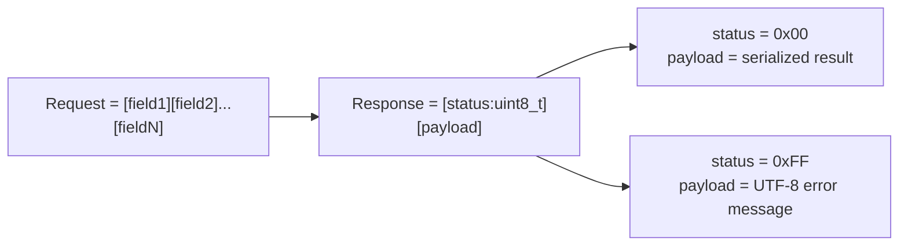

# code_decl_to_abi User Guide

> **Purpose**: The user-facing guide for `code_decl_to_abi`, the LingoFuse binary-ABI code generator. It explains how to use the tool through its **three frontends (CLI, GUI, MCP)**, describes the artifacts it produces, and tells you how to consume the generated **Markdown documents**, which carry the real interface code, test programs, and build scripts (CMake, Makefile, compile lines, etc.).
>
> **Audience**: Application developers, integration engineers, and AI agents who want to expose Pascal/C declarations as cross-language binary-ABI services — without reading the tool's source.
>
> **Companion documents**:
> - `code_decl_to_abi_OPERATIONS.md` — implementation, internal contracts, modification procedures.
> - `code_decl_to_json_abi_USER_GUIDE.md` — the HTTP/JSON sibling tool.
>
> **Language**: English. **File name**: English.

---

## Table of Contents

- [Chapter 1  What This Tool Is](#chapter-1-what-this-tool-is)
- [Chapter 2  Why Binary ABI? The Serialization Efficiency Story](#chapter-2-why-binary-abi-the-serialization-efficiency-story)
- [Chapter 3  Language Support: Today and Tomorrow](#chapter-3-language-support-today-and-tomorrow)
- [Chapter 4  ⚠️ Read This First: The Generated Markdown Is The Real Deliverable](#chapter-4-️-read-this-first-the-generated-markdown-is-the-real-deliverable)
- [Chapter 5  Prerequisites and Build](#chapter-5-prerequisites-and-build)
- [Chapter 6  GUI Operation Guide](#chapter-6-gui-operation-guide)
- [Chapter 7  Command-Line Guide](#chapter-7-command-line-guide)
- [Chapter 8  Agent / MCP-API Guide](#chapter-8-agent--mcp-api-guide)
- [Chapter 9  Programmatic Interface](#chapter-9-programmatic-interface)
- [Chapter 10  The 14 Generators and Their Artifacts](#chapter-10-the-14-generators-and-their-artifacts)
- [Chapter 11  Type System: What Is Supported, What Is Dropped](#chapter-11-type-system-what-is-supported-what-is-dropped)
- [Chapter 12  The Wire Protocol](#chapter-12-the-wire-protocol)
- [Chapter 13  End-to-End Example](#chapter-13-end-to-end-example)
- [Chapter 14  Troubleshooting Quick Reference](#chapter-14-troubleshooting-quick-reference)
- [Chapter 15  Known Limitations and Roadmap](#chapter-15-known-limitations-and-roadmap)

---

## Chapter 1  What This Tool Is

`code_decl_to_abi` is the **binary-ABI sibling** of `code_decl_to_json_abi`. Where the JSON-ABI tool targets HTTP/JSON gateways and bridges, this tool targets LingoFuse's **native binary ABI** — a compact, low-overhead wire format that ships parameters and return values as raw typed fields rather than JSON text.

**Input**: a complete Pascal unit or a C header file.

**Output**: a matching pair of **service-side** and **call-side** code for each target language, plus a companion Markdown README per artifact.

**One-sentence summary**: give it a declaration file, and it lays out a binary-ABI RPC surface that any supported language can call, with the wire format doing the heavy lifting.

The tool has **three frontends that share one generator backend**:

| Frontend | File | Audience |
|----------|------|----------|
| **CLI** | `code_decl_to_abi_cmdline.pas` | Scripts, CI, automation |
| **GUI** | `code_decl_to_abi_frm.pas` | Interactive desktop use |
| **MCP** | `code_decl_to_abi_mcp_api_tool_provider_unit.pas` | AI agents via the LingoFuse beacon |

The GUI and MCP paths both end up calling the same generator functions; the MCP path **reuses the GUI event handlers** through `TCompute.Sync`, so there is no duplicated logic between the two.

---

## Chapter 2  Why Binary ABI? The Serialization Efficiency Story

This is the reason `code_decl_to_abi` exists alongside its JSON sibling. The binary ABI path is **substantially more efficient** than the HTTP/JSON path for high-concurrency workloads, and the reasons are worth spelling out explicitly.

### 2.1 Compact, typed payloads — no text encoding overhead

In the ABI wire format, every parameter is written as its **native machine representation**:

| Type family | Encoding on the wire |
|-------------|----------------------|
| Integers | Little-endian fixed-width binary (1, 2, 4, or 8 bytes) |
| Floats | IEEE 754 (`Single` = 4 bytes, `Double` = 8 bytes, `Extended` = 10 bytes) |
| Strings | Raw UTF-8 bytes followed by a single `NUL` terminator |

Compare this with JSON, which must **stringify every number** (a 64-bit integer becomes ~8–20 ASCII bytes plus a separator), **escape every quote and backslash**, and **add structural punctuation** — braces, brackets, colons, commas.

For a payload like `{a: int64, b: int64, c: string}`:

- **Binary ABI**: `8 + 8 + (len(c) + 1)` bytes, plus negligible framing.
- **JSON**: `{"a":...,"b":...,"c":"..."}` — typically 4–10× larger for numeric-heavy payloads, and worse for arrays of numbers.

The practical consequence: **for the same network bandwidth, the ABI path carries several times more logical requests per second than the JSON path.** This is the first and largest contributor to its concurrency advantage.

### 2.2 No parse/format cost on the hot path

JSON requires:

- **On send**: `IntToStr`, `FloatToStr`, string escaping, and structural concatenation.
- **On receive**: tokenization, number parsing, string unescaping, and structural validation.

Every one of these operations allocates and touches memory. Under high concurrency, these allocations become the dominant cost — they fragment the heap, pressure the GC (in managed languages), and serialize on allocator locks.

Binary ABI writes and reads **directly into pre-allocated buffers**:

- Sending an `int64` is a single 8-byte `Move`.
- Sending a string is a `Move` plus a `NUL` byte.
- Receiving is the mirror operation.

There is **no per-field allocation** for scalars, and the only allocation for strings is the final destination string itself. This makes the ABI path **O(payload size)** in the number of memory operations, with a tiny constant — rather than the O(payload size × parse factor) of JSON.

### 2.3 Zero-copy in the fast path

The generated ABI service and call code uses LingoFuse's **direct buffer access**:

- `LF_WriteBuffer` / `LF_ReadBuffer` operate on the handle's internal buffer.
- The generated Pascal service uses `LF_ReadStringBytes` and `LF_WriteStringBytes` for strings, which read/write **UTF-8 bytes directly** without an intermediate `string`-shaped allocation.
- For fixed-size fields (`Int64`, `Double`, etc.), the generated code reads/writes a single stack local and copies it in one `Move`.

The result is that **the hot path never materializes a JSON AST**. There is no tree to build, no intermediate `Variant` to box, and no text to scan. Compare this to the JSON-ABI path, where each call necessarily builds a `TZ_JsonObject` (or equivalent), populates it, serializes it to text, sends the text, then reverses the whole process on the other side.

### 2.4 Deterministic, allocation-light under load

Under high concurrency, the difference between ABI and JSON is not just about bandwidth — it is about **allocation behavior**:

| Concern | Binary ABI | HTTP/JSON |
|---------|-----------|-----------|
| Per-scalar allocation | 0 | 1+ (boxed number or string fragment) |
| Per-string allocation | 1 (final) | 2–4 (escape buffer, fragment, final) |
| Temporary AST | none | yes (JSON object tree) |
| UTF-8 re-encoding | none (raw bytes) | yes (escape → unescape round-trip) |
| Text parsing | none | yes (lexer + number parser) |
| Framing | fixed binary header | variable-length text envelope |

Because of this, the ABI path **scales more gracefully as concurrency rises**. JSON payloads become progressively more expensive per byte as structure grows; binary payloads scale linearly. This is exactly the profile you want for **service meshes, microservice backplanes, and agent tool registries** — all workloads where the same API is called thousands of times per second and where latency tails matter more than peak throughput on a single request.

### 2.5 When to choose ABI over JSON

Choose `code_decl_to_abi` (binary ABI) when:

- You control both ends and they speak LingoFuse natively.
- Payloads are numeric-heavy or binary-heavy.
- You are running a high-concurrency service with tight latency budgets.
- You want to avoid the fixed cost of JSON parsing per call.

Choose `code_decl_to_json_abi` (HTTP/JSON) when:

- One end is a browser, an external HTTP client, or a language without a LingoFuse binding.
- You need the payloads to be human-readable or debuggable with `curl`.
- You are bridging to third-party HTTP APIs.

The two tools share the same model, the same type system, and the same set of target-language backends; they differ only in the **wire format**.

---

## Chapter 3  Language Support: Today and Tomorrow

### 3.1 Current status — starting phase

Today, `code_decl_to_abi` ships with **three target languages**, each with a service side and a call side:

| Target language | Service side | Call side | Companion README |
|-----------------|:------------:|:---------:|:----------------:|
| **Pascal** | ✅ | ✅ | ✅ |
| **Python** | ✅ | ✅ | ✅ |
| **C++** | ✅ (`.hpp` + `.cpp`) | ✅ (`.hpp` + `.cpp`) | ✅ |

These three are **production-ready**. Each generator emits idiomatic code for its target, fills in the entire serialization pipeline, and provides a README covering deployment, testing, and troubleshooting.

### 3.2 The backend is designed for unbounded extension

The generator backend is **explicitly engineered to accept an unbounded number of target languages**. Adding a new language is a **mechanical process**, not an architectural change. The steps are documented in `code_decl_to_abi_OPERATIONS.md` Chapter 14, and they are the same for every language:

1. Create two generator units: `<lang>_abi_service_generator_tool.pas` and `<lang>_abi_call_generator_tool.pas`.
2. Provide a type mapping table from the three ABI families (integer / float / string) to the target language's native types.
3. Register the new units in the main program, the CLI dispatcher, the GUI form, and the MCP tool provider.
4. Update the CLI's `Detect_Target_Lang` and help text.
5. Update the MCP `regCount` assertion.

**There is no ceiling on how many languages the tool can target.** Every language with (a) a C-ABI-compatible FFI, (b) a runtime that can speak LingoFuse's wire protocol, and (c) a way to marshal the three ABI families is a candidate.

### 3.3 Planned expansion

The roadmap is intentionally open-ended. Any of the following language families is a candidate for the same mechanical addition:

- **Systems languages**: Rust, Go, Zig, Nim, D, Swift, Kotlin/Native.
- **JVM languages**: Java, Kotlin, Scala (via JNI or JNA).
- **.NET languages**: C#, F#, VB.NET (via P/Invoke).
- **Functional languages**: OCaml, Haskell, F#, Elixir, Erlang (via NIFs or ports).
- **Scripting languages**: Ruby, PHP, Perl, Lua, Julia.
- **Domain-specific ecosystems**: R, MATLAB, Wolfram Language, custom DSLs.
- **Hardware and embedded**: MicroPython, embedded C, Ada, SPARK.

**The user-facing contract does not change when a language is added**: the same CLI flags, the same GUI workflow, and the same MCP tools continue to work; the only difference is that a new set of `<lang>_abi_*` generator units exists in the backend.

### 3.4 What "support" means for each language

When a language is listed as supported, it means all of the following hold:

- The generated **service** side registers cdecl-compatible callbacks with LingoFuse.
- The generated **call** side exposes a typed function per API, hiding all wire-format details.
- The generated code passes the wire protocol rules (little-endian integers, UTF-8 + NUL strings, IEEE 754 floats).
- A companion **README** is generated alongside the code, describing deployment, testing, and troubleshooting for that language.
- The code is registered in the **CLI**, **GUI**, and **MCP** frontends, so it can be produced through any of them.

---

## Chapter 4  ⚠️ Read This First: The Generated Markdown Is The Real Deliverable

Before walking through the three frontends, there is one convention that must be internalized, because it changes how you use everything that follows.

> **Every generated code artifact is paired with a companion Markdown document. That Markdown is not a “nice-to-have”. It is where the real, runnable interface material lives.**

Concretely, when `code_decl_to_abi` produces, say, a C++ service, it writes **two** files:

- `<Unit>_abi_service.hpp` + `<Unit>_abi_service.cpp` — the generated C++ skeleton.
- `<Unit>_abi_service_cpp.md` — the companion document.

**The `.md` file contains, and often supersedes, the code file for the purpose of getting started.** Inside you will find:

1. **A complete, copy-pasteable test program.**
   - For Pascal: a full `.lpr` program you can compile as-is.
   - For Python: the generated module already includes `if __name__ == "__main__":`, so the “test program” is the module itself.
   - For C++: a full `main.cpp`, plus a **minimal fallback header** so you can compile even before the official LingoFuse C++ binding is available.

2. **Build instructions for every common toolchain.**
   - Pascal: `lazbuild` project steps and `fpc -Fu<...>` command lines with the exact search-path flags.
   - Python: `pip install` / `PYTHONPATH` setup for cmd, PowerShell, and bash.
   - **C++: a CMake script and a raw compiler invocation (g++, clang++, MSVC).** The CMake target name, include directories, source files, link libraries, and required C++ standard are all spelled out.

3. **The full tool reference for that artifact.**
   - Every API the artifact exposes.
   - Its typed signature in the target language.
   - The **request layout** and **success response layout** on the wire.
   - A call example per API.

4. **The deployment section.**
   - Which directories the runtime expects (`LingoFuse64.dll` / `liblingofuse.so` / `liblingofuse.dylib`, `z_ipc_*`).
   - Startup order: service before caller.
   - Shutdown order.
   - Environment variables that must be set on each OS.

5. **The troubleshooting table for that artifact.**
   - Symptom → cause → fix, tuned to the specific target language.

> **Rule of thumb**: whenever you finish generating code, **open the `.md` first**. It is written for exactly the situation you are in — “I have the code, what do I do with it?”.

### 4.1 Why the Markdown is generated alongside the code

The `.md` and the code are generated from **the same `TPascal_Func_Model`** in the same pass. This guarantees:

- **They never drift apart.** If you re-generate after editing the source unit, both the code and the `.md` are updated together.
- **The `.md` always describes the current code.** The tool reference is driven by the same function list the generators consumed.
- **You can hand the `.md` to another engineer (or to an agent) and they can reproduce your build.** Nothing is left implicit.

### 4.2 What you will typically not find in the `.md`

- **Business logic.** The `internal_call_<Api>` stubs are deliberately left empty; you fill them in. The `.md` tells you what signature to match and what the wire layout is, but not what to compute.
- **A ready-made CMake project for your entire application.** The `.md` gives you the CMake snippet for the generated artifact; wiring it into a larger project is your choice.
- **Credentials or deployment secrets.** The `.md` assumes a local, trusted runtime.

### 4.3 Practical consequence for this guide

Because the `.md` files carry the language-specific details, this user guide does **not** try to reproduce every build command for every language. Instead:

- Chapters 6–8 cover the **three frontends** and how to drive them.
- Chapter 9 covers the **programmatic interface**.
- Chapters 10–12 cover the **wire format and type system** — the cross-language invariants.
- **For any language-specific build/run question, the answer is in the generated `.md`, not here.**

---

## Chapter 5  Prerequisites and Build

### 5.1 Compiler and platform

| Item | Requirement |
|------|-------------|
| Compiler | Free Pascal 3.2+ or Delphi 10.4+ |
| Language mode | Delphi mode (`{$mode delphi}`) |
| Source encoding | UTF-8 (`{$CODEPAGE UTF8}`) |
| Platform | Windows / Linux / macOS |

### 5.2 Runtime dependencies

| Dependency | Location | Consequence if missing |
|------------|----------|------------------------|
| `LingoFuse64.dll` / `liblingofuse.so` / `liblingofuse.dylib` | exe directory or system PATH | All `LF_*` calls fail |
| `pascal_code_abi_rule.md` | exe directory | GUI's `Open_pascal_rule_Button` does nothing |
| `C_code_abi_rule.md` | exe directory | GUI's `Open_c_rule_Button` does nothing |

These are needed only at **runtime** — the generator itself does not depend on the LingoFuse dynamic library.

### 5.3 Build

```bash
lazbuild -B code_decl_to_abi.lpi
```

The tool is compiled as a console subsystem application, so CLI mode produces stdout output correctly and GUI mode still works.

---

## Chapter 6  GUI Operation Guide

Launch the executable with **no arguments** to enter the GUI.

### 6.1 The five tabs

```
[Welcome] → [Source Code] → [Source <-> JSON] → [JSON <-> Model] → [Final Source]
```

Each tab has a row of “previous / next” buttons at the top, and a bottom panel showing the `DoStatus` log.

### 6.2 Tab 1 — Welcome

- Shows the tool's purpose and the workflow diagram.
- **Pascal rule doc** opens `pascal_code_abi_rule.md`.
- **C rule doc** opens `C_code_abi_rule.md`.
- **Next: Enter source code** moves to Tab 2.

### 6.3 Tab 2 — Source Code

This is where you paste the input.

**Toolbar controls**:

| Control | Effect |
|---------|--------|
| **Select Language label** | Click to auto-detect the source language. |
| **Language Selector dropdown** | `Auto-detect` / `Pascal` / `C`, manual override. |
| **Format** | Keep only top-level declarations; discard everything else. |
| **Empty unit** | Insert a minimal skeleton for the selected language. |
| **Test unit** | Insert a rich syntax sample (great for a first run). |
| **Next: Pascal/C → JSON** | Parse the current source, produce LV0 JSON, jump to Tab 3. |

**Procedure**:

1. Paste your Pascal unit or C header.
2. If you are unsure of the language, click the **Select Language** label to auto-detect.
3. If the syntax highlighting looks off, pick the language manually.
4. Click **Next: Pascal/C → JSON**.

### 6.4 Tab 3 — Source ↔ JSON

Shows the **LV0 JSON** (raw parser output).

| Button | Effect |
|--------|--------|
| **Back: rebuild code from JSON** | Reverse-rebuild source text from the current JSON, write it back to Tab 2. |
| **Next: JSON ↔ Model** | Normalize LV0 into LV1 Model, jump to Tab 4. |

You may **edit the JSON by hand**. If the parser mis-classified a type, fix it here and click **Next**. Use **Back** to verify the edit still rebuilds a legal source.

### 6.5 Tab 4 — JSON ↔ Model

Shows the **LV1 Model JSON** — the sole input to all generators.

| Button | Effect |
|--------|--------|
| **Back: JSON ↔ Model** | Reverse-restore LV1 to LV0, write back to Tab 3. |
| **Next: generate source** | Run all 14 generators, jump to Tab 5. |

**At this stage, any routine with an unsupported type will already have been dropped.** If a function you expected is missing, this tab is where you notice it. See Chapter 11 for the exact list of unsupported types.

### 6.6 Tab 5 — Final Source

The Final Source tab holds one sub-tab per target language and side:

| Sub-tab | Content |
|---------|---------|
| Pascal Service | Pascal service unit + README |
| Pascal Call | Pascal call unit + README |
| Python Service | Python service module + README |
| Python Call | Python call module + README |
| C++ Service | C++ `.hpp` + `.cpp` + README |
| C++ Call | C++ `.hpp` + `.cpp` + README |

Each sub-tab typically shows **two editors**: the code, and the companion `.md`. Both are also written to disk under `<exe directory>/<UnitName>/` using the naming rules in Chapter 10.

> **Remember Chapter 4**: for language-specific build commands, test programs, and CMake scripts, read the `.md` sub-tab — not this guide.

### 6.7 Log panel

The bottom panel is the live `DoStatus` log. It shows:

- Which file was just saved.
- Any routines skipped during normalization.
- Any errors thrown by the generators.
- The registration status of the MCP tool provider.

Cleared automatically when it exceeds 5000 lines.

---

## Chapter 7  Command-Line Guide

### 7.1 Trigger condition

Command-line mode **only fires when at least one argument is passed**. With no arguments, the tool launches the GUI.

Because the executable is built as a console application, the CLI's stdout is available regardless of how you launched it.

### 7.2 Syntax

```
code_decl_to_abi --help
code_decl_to_abi <input_file> <output_file>
code_decl_to_abi --call <input_file> <output_file>
```

| Argument | Meaning |
|----------|---------|
| `--help` / `-h` / `-?` / `/?` | Print help and exit. Recognized only as the first argument. |
| `--call` / `-c` | Generate the call side. Recognized only as the first argument; defaults to the service side. |
| `<input_file>` | Source file. Language is detected from its extension. |
| `<output_file>` | Output file. Target language is detected from its extension. |

### 7.3 Extension → language mapping

**Source languages**:

| Extension | Source language |
|-----------|-----------------|
| `.pas` / `.pp` / `.p` | Pascal |
| `.h` / `.hpp` / `.hh` / `.c` / `.cpp` / `.cc` / `.cxx` | C |

**Target languages**:

| Extension | Target language | Output files |
|-----------|-----------------|--------------|
| `.pas` / `.pp` / `.p` | Pascal | one file |
| `.py` | Python | one file |
| `.hpp` / `.hh` / `.h` | C++ | `.hpp` + `.cpp` (both written) |
| `.cpp` / `.cc` / `.cxx` / `.c` | C++ | `.hpp` + `.cpp` (both written) |

For C++, **both files are always written**, regardless of which extension you name on the command line.

### 7.4 Exit codes

| Code | Meaning |
|:----:|---------|
| `0` | Conversion succeeded |
| `1` | Missing or invalid arguments |
| `2` | Source parsing failed |
| `3` | Code generation failed |
| `4` | File I/O error |

### 7.5 Output layout

Given `<output>`, the CLI writes:

- `<output>` itself (or, for C++, `<base>.hpp` and `<base>.cpp`).
- `<base>_readme.md` — the companion Markdown.
- Plus the language-specific auxiliary files the README describes (for instance, a C++ project will reference a small `LingoFuse.h` fallback header whose source is embedded in the `.md`).

### 7.6 Examples

```bash
# Pascal → Pascal service
code_decl_to_abi calculator.pas calculator_service.pas
# Output:
#   calculator_service.pas
#   calculator_service_readme.md

# Pascal → Pascal call
code_decl_to_abi --call calculator.pas calculator_call.pas
# Output:
#   calculator_call.pas
#   calculator_call_readme.md

# C → Python service
code_decl_to_abi ComplexTestUnit.h calculator_service.py
# Output:
#   calculator_service.py
#   calculator_service_readme.md

# C → C++ call (both files are produced)
code_decl_to_abi --call ComplexTestUnit.h calculator_call.hpp
# Output:
#   calculator_call.hpp
#   calculator_call.cpp
#   calculator_call_readme.md
```

### 7.7 Stdout shape

On success:

```
Reading: ComplexTestUnit.h (1234 chars)
Output : calculator_service.py
Mode   : service
Unit   : ComplexTestUnit
Funcs  : 28
Saved  : calculator_service.py
Saved  : calculator_service_readme.md
Done.
```

On failure, the tool prints a diagnostic line and returns a non-zero exit code. **Do not depend on the exact wording**; depend on the exit code.

### 7.8 What the CLI does not do

- **It does not start the service.** You compile and launch the generated service yourself.
- **It does not start the LingoFuse runtime.** Make sure `LingoFuse64.dll` (or its equivalent) is reachable.
- **It does not start the MCP tool provider.** The MCP provider is tied to the GUI's lifetime.
- **It does not open any network connection.**

### 7.9 The `.md` is still the source of truth for builds

CLI generation produces the same `.md` files the GUI produces. Whatever language you generated, **read `<base>_readme.md` for:**

- The exact compile command (with `-Fu<...>` for FPC, `-I`/`-L` for C++, etc.).
- The CMake snippet (for C++).
- The test program.
- The deployment and environment-variable setup.
- The troubleshooting table.

This user guide deliberately does not duplicate those instructions — they belong with the artifact, not with the tool.

---

## Chapter 8  Agent / MCP-API Guide

### 8.1 Positioning

`code_decl_to_abi_mcp_api_tool_provider_unit.pas` wraps the entire generator as **21 LingoFuse Call APIs** and registers them with the **agent beacon** (default App `agent_main_app`, default register API `register_agent`). An MCP client can then drive the generator entirely through tool calls.

The provider **simulates GUI operations**: each `internal_call_*` posts work to the main thread via `TCompute.Sync` and invokes the same button event handlers the GUI uses. This keeps the GUI and MCP paths **provably in sync** — there is no backend bypass.

### 8.2 Requirements for agent mode

- The `code_decl_to_abi` **GUI is running**. The MCP provider lives inside the GUI process; closing the GUI takes the tools offline.
- A **beacon service is online** (`agent_main_app` by default).
- Both sides use the **same LingoFuse endpoint** (`ipc:agent` by default).
- The LingoFuse runtime (`LingoFuse64.dll` / `liblingofuse.so` / `liblingofuse.dylib`) is reachable.

> **Note**: the MCP service and the bridge concept from the JSON-ABI tool are unrelated. The binary ABI path does not go through the HTTP bridge.

### 8.3 The three-phase tool workflow

Every tool follows the same three-phase pattern:

```
Step 1  SetSourceCode(Source, Language)
Step 2  ConvertToXxx    (one or many)
Step 3  GetLastXxx      (read one or many)
```

- **Step 1 is SETUP.** It does not produce any files.
- **Step 2 branches are independent.** After one `SetSourceCode`, you may trigger any number of `ConvertToXxx` calls.
- **Step 3 is pure read.** It pulls cached results from the 14 artifact editors.

### 8.4 The 21 tools

**Step 1 (1 tool)**

| Tool | Parameters | Return |
|------|------------|--------|
| `CodeDeclToAbi_SetSourceCode` | `Source: string`, `Language: string` | `{"status":"ok"}` |

`Language` accepts `"pascal"` or `"c"`, case-insensitive.

**Step 2 (6 tools)**

| Tool | Return |
|------|--------|
| `CodeDeclToAbi_ConvertToPascalService` | `{"result":"<service_unit.pas>","readme":"<readme.md>"}` |
| `CodeDeclToAbi_ConvertToPascalCall` | `{"result":"<call_unit.pas>","readme":"<readme.md>"}` |
| `CodeDeclToAbi_ConvertToPythonService` | `{"result":"<service.py>","readme":"<readme.md>"}` |
| `CodeDeclToAbi_ConvertToPythonCall` | `{"result":"<call.py>","readme":"<readme.md>"}` |
| `CodeDeclToAbi_ConvertToCppService` | `{"result":"<service.hpp>","impl":"<service.cpp>","readme":"<readme.md>"}` |
| `CodeDeclToAbi_ConvertToCppCall` | `{"result":"<call.hpp>","impl":"<call.cpp>","readme":"<readme.md>"}` |

**Step 3 (14 readers)**

| Tool | Return |
|------|--------|
| `CodeDeclToAbi_GetLastPascalServiceCode` | full service unit text |
| `CodeDeclToAbi_GetLastPascalServiceReadme` | README text |
| `CodeDeclToAbi_GetLastPascalCallCode` | full call unit text |
| `CodeDeclToAbi_GetLastPascalCallReadme` | README text |
| `CodeDeclToAbi_GetLastPythonServiceCode` | full Python module text |
| `CodeDeclToAbi_GetLastPythonServiceReadme` | README text |
| `CodeDeclToAbi_GetLastPythonCallCode` | full Python module text |
| `CodeDeclToAbi_GetLastPythonCallReadme` | README text |
| `CodeDeclToAbi_GetLastCppServiceHeader` | `.hpp` text |
| `CodeDeclToAbi_GetLastCppServiceImpl` | `.cpp` text |
| `CodeDeclToAbi_GetLastCppServiceReadme` | README text |
| `CodeDeclToAbi_GetLastCppCallHeader` | `.hpp` text |
| `CodeDeclToAbi_GetLastCppCallImpl` | `.cpp` text |
| `CodeDeclToAbi_GetLastCppCallReadme` | README text |

### 8.5 Registration entry point

`Execute_And_Reg_all` performs the entire registration sequence in one call:

1. `RegisterAPIs` — creates the app and issues 21 `LF_RegisterCallEx` calls.
2. `LF_PrepareClientEx("ipc:agent", App)`.
3. `LF_PrepareDone` (only if the main thread is not already running).
4. `RegisterTools` — registers the 21 tool schemas with the beacon.

The App name defaults to `code_decl_to_abi_mcp_api`. **Do not change it lightly** — clients route by app name.

### 8.6 Recommended sequences

```
# Minimum complete flow
SetSourceCode(MyUnitText, "pascal")
ConvertToPascalService()
GetLastPascalServiceCode()
GetLastPascalServiceReadme()
```

```
# One source, multiple targets
SetSourceCode(MyUnitText, "pascal")
ConvertToPascalService()
ConvertToPythonService()
ConvertToCppService()
GetLastPascalServiceCode()
GetLastPythonServiceCode()
GetLastCppServiceHeader()
GetLastCppServiceImpl()
```

```
# Read only the intermediate JSON (no generation)
SetSourceCode(MyUnitText, "c")
GetLastPascalServiceCode()   # empty until a Convert has run
```

### 8.7 Agent-mode notes

1. **The source language must be `pascal` or `c`**; anything else is rejected.
2. **The order is mandatory**: Step 1 before Step 2 before Step 3.
3. **`ConvertToXxx` is cached per source.** Re-running it after a `SetSourceCode` change re-parses; re-running it without a source change is a no-op.
4. **`GenerateAll` equivalents do not exist here.** Each target is produced by its own `ConvertToXxx` call.
5. **The GUI must be alive.** There is no headless MCP mode.
6. **Generating code with an agent ≠ running the code.** Running the generated artifacts still requires the standard LingoFuse runtime setup.
7. **Point agents at the `.md` files.** After a successful `ConvertToXxx`, the `readme` field in the response points at the companion `.md`. **Tell agents to read that `.md` for build commands, test programs, and CMake scripts.** The tool call itself only produces the artifacts; the how-to-build lives in the `.md`.

### 8.8 Example agent interaction

```
# 1. Feed the source
CodeDeclToAbi_SetSourceCode(
    Source   = "<contents of calculator.pas>",
    Language = "pascal")

# 2. Produce both sides for both target languages
CodeDeclToAbi_ConvertToPascalService()
CodeDeclToAbi_ConvertToPascalCall()

# 3. Read the artifacts (and the companions)
CodeDeclToAbi_GetLastPascalServiceCode()
CodeDeclToAbi_GetLastPascalServiceReadme()   # ← the build/run guide
CodeDeclToAbi_GetLastPascalCallCode()
CodeDeclToAbi_GetLastPascalCallReadme()      # ← the build/run guide
```

The agent can then either forward the artifacts to a user or, if the environment permits, execute the build/run instructions directly from the `.md`.

---

## Chapter 9  Programmatic Interface

For tools and services that want to embed the generator rather than launch it, `code_decl_to_abi` exposes a small set of public functions. These are the same functions the CLI, GUI, and MCP provider call internally.

### 9.1 Generator entry points

Every generator unit exports one function per artifact:

```pascal
function GenerateABIServicePascalCode(Model: TPascal_Func_Model): TPascalStringList;
function GenerateABIServicePascalReadme(Model: TPascal_Func_Model): TPascalStringList;
function GenerateABICallPascalCode(Model: TPascal_Func_Model): TPascalStringList;
function GenerateABICallPascalReadme(Model: TPascal_Func_Model): TPascalStringList;

function GenerateABIServicePyCode(Model: TPascal_Func_Model): TPascalStringList;
function GenerateABIServicePyReadme(Model: TPascal_Func_Model): TPascalStringList;
function GenerateABICallPyCode(Model: TPascal_Func_Model): TPascalStringList;
function GenerateABICallPyReadme(Model: TPascal_Func_Model): TPascalStringList;

function GenerateABIServiceHppCode(Model: TPascal_Func_Model): TPascalStringList;
function GenerateABIServiceCppCode(Model: TPascal_Func_Model): TPascalStringList;
function GenerateABIServiceCppReadme(Model: TPascal_Func_Model): TPascalStringList;
function GenerateABICallHppCode(Model: TPascal_Func_Model): TPascalStringList;
function GenerateABICallCppCode(Model: TPascal_Func_Model): TPascalStringList;
function GenerateABICallCppReadme(Model: TPascal_Func_Model): TPascalStringList;
```

Each returns a `TPascalStringList` that the caller must dispose.

### 9.2 Model building

The generators consume a `TPascal_Func_Model`. To build one from source text:

```pascal
var
  Parser: tpascal_func_decl_tool;
  Model: TPascal_Func_Model;
  Report: TPascalStringList;
begin
  Parser := tpascal_func_decl_tool.CreateFrom_Pascal_Code(SourceText);
  try
    Report := TPascalStringList.Create;
    try
      Model := TPascal_Func_Model.Create;
      try
        Model.Typ_Normalize_Func := tnf_ABI;   // required by the ABI generators
        Model.LoadFromParser(Parser, Report);
        // Now Model is ready for the generator functions above.
      finally
        Model.Free;
      end;
    finally
      Report.Free;
    end;
  finally
    Parser.Free;
  end;
end;
```

For a C header, substitute `CreateFrom_C_Code`. `LoadFromParser` applies the same six filters described in Chapter 11, so the model is guaranteed to contain only routines whose types are supported.

### 9.3 Minimum viable embedding

```pascal
var
  Parser: tpascal_func_decl_tool;
  Model: TPascal_Func_Model;
  Code: TPascalStringList;
begin
  Parser := tpascal_func_decl_tool.CreateFrom_Pascal_Code(SourceText);
  try
    Model := TPascal_Func_Model.Create;
    try
      Model.Typ_Normalize_Func := tnf_ABI;
      Model.LoadFromParser(Parser, nil);      // nil report = silent
      Code := GenerateABIServicePascalCode(Model);
      try
        if Code <> nil then
          Code.SaveToFile('MyUnit_abi_service_unit.pas');
      finally
        Code.Free;
      end;
    finally
      Model.Free;
    end;
  finally
    Parser.Free;
  end;
end;
```

### 9.4 Contract summary

| Function family | Input | Output | Notes |
|-----------------|-------|--------|-------|
| `GenerateABI*Code` / `GenerateABI*Readme` | `TPascal_Func_Model` (must be `tnf_ABI`) | `TPascalStringList` or `nil` | Caller disposes; `nil` on empty model |
| `tpascal_func_decl_tool.CreateFrom_*` | source text | parser instance | Caller disposes |
| `TPascal_Func_Model.LoadFromParser` | parser + optional report | — | Applies the six filters |

### 9.5 Registering the generators with the tool itself

If you are extending the tool and want your generator to appear in the CLI, GUI, or MCP frontends, you must register it in three places (see `code_decl_to_abi_OPERATIONS.md` Chapter 3):

1. `code_decl_to_abi.lpr` — `uses` clause, so the unit's `initialization` runs.
2. `code_decl_to_abi_frm.pas` — `implementation uses`, so the GUI can call it.
3. `code_decl_to_abi_mcp_api_tool_provider_unit.pas` — `RegisterAPIs`, `RegisterTools`, and the appropriate `Work_*` helper, so agents can reach it.

---

## Chapter 10  The 14 Generators and Their Artifacts

The backend contains **6 generator pairs** (service + call) plus C++'s extra header/implementation split, for **14 exported functions** in total.

### 10.1 Generator map

| Generator unit | Exported functions | Artifact |
|----------------|--------------------|----------|
| `pas_abi_service_generator_tool` | `GenerateABIServicePascalCode` | `.pas` |
| | `GenerateABIServicePascalReadme` | `.md` |
| `pas_abi_call_generator_tool` | `GenerateABICallPascalCode` | `.pas` |
| | `GenerateABICallPascalReadme` | `.md` |
| `py_abi_service_generator_tool` | `GenerateABIServicePyCode` | `.py` |
| | `GenerateABIServicePyReadme` | `.md` |
| `py_abi_call_generator_tool` | `GenerateABICallPyCode` | `.py` |
| | `GenerateABICallPyReadme` | `.md` |
| `cpp_abi_service_generator_tool` | `GenerateABIServiceHppCode` | `.hpp` |
| | `GenerateABIServiceCppCode` | `.cpp` |
| | `GenerateABIServiceCppReadme` | `.md` |
| `cpp_abi_call_generator_tool` | `GenerateABICallHppCode` | `.hpp` |
| | `GenerateABICallCppCode` | `.cpp` |
| | `GenerateABICallCppReadme` | `.md` |

### 10.2 File naming under the GUI

Files land under `<exe directory>/<UnitName>/`:

| Target | Code file | README file |
|--------|-----------|-------------|
| Pascal Service | `<Unit>_abi_service_unit.pas` | `<Unit>_abi_service_pascal.md` |
| Pascal Call | `<Unit>_abi_call_unit.pas` | `<Unit>_abi_call_pascal.md` |
| Python Service | `<Unit>_abi_service.py` | `<Unit>_abi_service_python.md` |
| Python Call | `<Unit>_abi_call.py` | `<Unit>_abi_call_python.md` |
| C++ Service | `<Unit>_abi_service.hpp` + `.cpp` | `<Unit>_abi_service_cpp.md` |
| C++ Call | `<Unit>_abi_call.hpp` + `.cpp` | `<Unit>_abi_call_cpp.md` |

### 10.3 File naming under the CLI

The CLI caller chooses the output file name. The README is written next to it as `<output basename>_readme.md`. For C++, both `.hpp` and `.cpp` are always written with the same base name.

### 10.4 What each artifact is for

- **Service code**: registers the API with LingoFuse, decodes binary requests, calls the user's `internal_call_<Api>` stub, encodes binary responses.
- **Call code**: exposes a typed function per API, serializes arguments, issues the LingoFuse call, deserializes the result, raises a language-appropriate exception on error.
- **README (`.md`)**: **the runnable guide for the artifact.** See Chapter 4. In particular, the C++ READMEs carry the CMake script and compiler invocations; the Pascal READMEs carry the `fpc -Fu<...>` command lines and an `.lpr` test program; the Python READMEs carry the `PYTHONPATH`/`pip` setup and rely on the generated module's own `__main__` block as the test program.

### 10.5 What you will find inside every README

Each generated README follows the same twelve-section structure:

1. Overview
2. Application Scope
3. Compatibility
4. Wire Protocol
5. Runtime Architecture
6. Type Mapping
7. Deployment
8. Testing
9. API Reference
10. Troubleshooting
11. Self-Assessment Checklist
12. Reference Resources

The **Testing** section always contains a complete, copy-pasteable test program; the **Deployment** section always contains the build commands for that language; the **API Reference** always contains per-API request/response layouts.

---

## Chapter 11  Type System: What Is Supported, What Is Dropped

### 11.1 The three supported families

Only three families are supported by the generators:

**Integer family**: `integer`, `longint`, `int64`, `cardinal`, `dword`, `longword`, `uint64`, `word`, `smallint`, `byte`.

**Float family**: `double`, `single`, `extended`, `real`.

**String family**: `string`, `ansistring`, `unicodestring`, `tpascalstring`, `tupascalstring`, `tp_string`, `pchar`, `pansichar`, `pwidechar`.

### 11.2 Target language mapping

| ABI family | Pascal | Python | C++ |
|------------|--------|--------|-----|
| String | `string` | `str` | `std::string` |
| Float | preserved (`Double` / `Single` / `Extended` / `Real`) | `float` | `double` |
| Integer | preserved (`Integer` / `Int64` / ...) | `int` | `int64_t` or narrower per declaration |

### 11.3 Unsupported types — silent drop

The following **cause the entire routine to be silently dropped**:

- `Boolean`, `WordBool`, `LongBool`
- `Variant`, `OleVariant`
- Arrays, records, classes, interfaces
- Enums, sets, generics
- Pointers, function pointers
- `Currency`, `Comp`, `TDateTime`

The `LoadFromParser` stage enforces six filters; any of them tripping causes the routine to disappear from the model:

1. `IsProc = False`
2. `NestLevel <> 0` (declared inside a class, record, or interface)
3. Empty parameter name
4. `var` / `out` parameter modifier
5. Unsupported parameter type
6. Unsupported return type

**Workaround**: serialize complex values into `string` before passing them.

### 11.4 Type family decision

The decision uses the **normalized** type name (the `PascalType` field in LV1 Model JSON), which is derived from the original declaration in the source. Both the code generator and the README generator make the same decision from the same field, so they never disagree.

---

## Chapter 12  The Wire Protocol

### 12.1 Request and response shape



### 12.2 Field encodings

| Type | Encoding |
|------|----------|
| Integer | Little-endian, fixed width, native to the declared size |
| Float | IEEE 754 (`Single` 4 bytes, `Double` 8 bytes, `Extended` 10 bytes) |
| String | Raw UTF-8 bytes followed by a single `NUL` terminator |

### 12.3 Concurrency profile

The wire format is deliberately allocation-light:

- **No JSON AST is ever built.** Scalars are written and read as raw bytes.
- **Strings are moved as raw UTF-8 bytes.** No escape/unescape round trip.
- **No text parse.** No number parser, no lexer, no structural validation.
- **Per-call allocations**: one for the handle (recycled from a pool), plus one for each string destination.

This is exactly the profile you want for **high-concurrency service meshes**, **microservice backplanes**, and **agent tool registries**.

### 12.4 Status byte semantics

| Status | Meaning | Payload |
|:------:|---------|---------|
| `0x00` | Success | Serialized result (or empty for a procedure) |
| `0xFF` | Failure | UTF-8 error message |

The generated service always writes one of these two statuses before writing any payload. The generated call side reads the status first and raises its language-appropriate exception when the status is not `0x00`.

---

## Chapter 13  End-to-End Example

### 13.1 Source

```pascal
unit Calculator;

interface

{* Adds two integers: a + b *}
function Add(a: Integer; b: Integer): Integer;

{* Multiplies two integers: a * b *}
function Mul(a: Integer; b: Integer): Integer;

implementation

function Add(a: Integer; b: Integer): Integer;
begin
  Result := a + b;
end;

function Mul(a: Integer; b: Integer): Integer;
begin
  Result := a * b;
end;

end.
```

### 13.2 Generate through the CLI

```bash
code_decl_to_abi calculator.pas calculator_service.pas
code_decl_to_abi --call calculator.pas calculator_call.pas
```

Produces:

```
calculator_service.pas
calculator_service_readme.md
calculator_call.pas
calculator_call_readme.md
```

### 13.3 Read the generated READMEs first

Before you write a single line of build script, open `calculator_service_readme.md`. It contains:

- The exact `fpc -Fu<...>` command line, including the search paths for `lingofuse_import.pas` and `Z.Core`.
- A complete `.lpr` test program you can compile as-is.
- The wire layout for `Add` and `Mul`.
- The deployment notes (`LingoFuse64.dll` placement, endpoint selection).
- The troubleshooting table.

The same applies to `calculator_call_readme.md`.

### 13.4 Fill in the service stub

Open `calculator_service.pas`, find the generated `internal_call_Add_Add` stub:

```pascal
function internal_call_Add_Add(a: Int64; b: Int64): Int64;
begin
  // TODO: call the real function
  Result := 0;
end;
```

Replace the body with the real implementation:

```pascal
function internal_call_Add_Add(a: Int64; b: Int64): Int64;
begin
  Result := a + b;
end;
```

### 13.5 Start the service

Compile `calculator_service.pas` together with the LingoFuse runtime and the startup code from the README's test program, then launch the resulting executable. It will register the `add` and `mul` APIs and start listening.

### 13.6 Call from another process

Compile the generated call unit into your caller:

```pascal
uses calculator_call_unit;

var
  sum: Int64;
begin
  sum := Add(20, 22);
  WriteLn('20 + 22 = ', sum);
end;
```

The call side hides every detail of the wire format behind a single typed function.

### 13.7 Same flow through the GUI

1. Launch the GUI.
2. Paste the source into **Source Code**.
3. Click **Next: Pascal/C → JSON**.
4. Click **Next: JSON ↔ Model**.
5. Click **Next: generate source**.
6. Open the **Final Source** tab; all six sub-tabs are populated.
7. The files are already on disk under `<exe directory>/Calculator/`.

### 13.8 Same flow through MCP

```
CodeDeclToAbi_SetSourceCode(<source text>, "pascal")
CodeDeclToAbi_ConvertToPascalService()
CodeDeclToAbi_ConvertToPascalCall()
CodeDeclToAbi_GetLastPascalServiceCode()
CodeDeclToAbi_GetLastPascalServiceReadme()   # ← read this for build/test
CodeDeclToAbi_GetLastPascalCallCode()
CodeDeclToAbi_GetLastPascalCallReadme()      # ← read this for build/test
```

The 21 tools cover both sides of the pipeline, so an agent can drive the whole flow without touching the GUI.

---

## Chapter 14  Troubleshooting Quick Reference

### 14.1 CLI reports “cannot detect source language”

Check the input extension against Chapter 7.3. If it is missing, rename the file or add the extension in `Detect_Source_Lang`.

### 14.2 CLI reports “cannot detect target language”

Check the output extension against Chapter 7.3. C++ outputs must end in a recognized C++ header or implementation extension.

### 14.3 A function is missing from the generated output

One of the six filters in Chapter 11 was tripped. Most commonly:

- The function is nested inside a class, record, or interface (`NestLevel <> 0`).
- A parameter or return type is not in the three supported families.
- A parameter uses `var` or `out`.

### 14.4 Generated service crashes on the first call

Check that:

- The LingoFuse runtime is loaded (`LingoFuse64.dll` or equivalent reachable).
- The generated callbacks are declared `cdecl` (the generated code always does this; do not edit it away).
- The `internal_call_<Api>` stubs have been filled in.

### 14.5 MCP tool returns `{"error":"Form not available"}`

The GUI is not running. The MCP provider runs inside the GUI's process.

### 14.6 MCP `RegisterTools` returns False

Check:

- `LF_CheckApiEx(BEACON_APP, REGISTER_API)` returned True.
- `regCount` matches the current tool count (21 for the current build).
- The GUI's log panel shows `[RegisterTool] OK/FAIL: <toolname>` for each tool.

### 14.7 `LF_PrepareDone` returns 0

`LF_PrepareDone` returns 1 only on the first call in a process. If it returns 0:

- Another component already started the main thread.
- Reorder your startup.
- Or `LF_Shutdown` and reinitialize.

### 14.8 Callback never fires

The generated callbacks must be `cdecl`; do not remove `cdecl` if you edit the generated code. Also verify the target App name matches the caller's expectation.

### 14.9 UI crashes when a callback touches the GUI

Callbacks run on a background thread. Use the sync variants of the registration functions and drive them with `LF_Sync` from the main loop.

### 14.10 Adding a new target language breaks the build

Verify the three registration points (see `code_decl_to_abi_OPERATIONS.md` Chapter 3):

1. `.lpr` uses clause.
2. `.frm.pas` implementation `uses`.
3. MCP provider unit.

Also verify the `{$I ..\..\..\Z.Define.inc}` path (three levels up).

### 14.11 The generated code does not compile

**Read the companion `.md`.** It contains the exact build command for the language, including the search paths and library link flags. Common causes:

- Missing include path to the LingoFuse binding header (C++).
- Missing `-Fu` search path to `lingofuse_import.pas` / `Z.Core` (FPC).
- Missing `PYTHONPATH` / `pip install` (Python).

### 14.12 Where do I find the CMake script?

In the generated `<Unit>_abi_service_cpp.md` / `<Unit>_abi_call_cpp.md`. The `.md` is the artifact's build manual.

---

## Chapter 15  Known Limitations and Roadmap

### 15.1 Current limitations

- **Three target languages** (Pascal, Python, C++). The JavaScript path is provided by `code_decl_to_json_abi`.
- **Three type families** (integer, float, string). Complex types must be serialized to `string` by the caller.
- **No explicit reset tool** in the MCP frontend; re-calling `SetSourceCode` replaces the state.
- **MCP provider is tied to the GUI's lifetime.** There is no headless MCP mode.
- **CLI does not start the service or the runtime.**

### 15.2 Roadmap

The generator backend is engineered to support **an unbounded number of target languages**. The mechanical procedure for adding a new language is documented in `code_decl_to_abi_OPERATIONS.md` Chapter 14, and is identical for every language. Future releases will extend coverage to additional language families, including but not limited to:

- Systems languages: Rust, Go, Zig, Nim, D, Swift.
- JVM languages: Java, Kotlin, Scala.
- .NET languages: C#, F#, VB.NET.
- Functional languages: OCaml, Haskell, F#, Elixir, Erlang.
- Scripting languages: Ruby, PHP, Perl, Lua, Julia.
- Domain-specific ecosystems: R, MATLAB, Wolfram Language.

When a language is added, **the user-facing contract does not change**: the same CLI flags, the same GUI tabs, and the same MCP tools continue to work. The only difference is a new set of `<lang>_abi_*` generator units in the backend, and a new companion `.md` per artifact.

### 15.3 When to use this tool versus `code_decl_to_json_abi`

| Scenario | Recommended tool |
|----------|------------------|
| Both ends are LingoFuse-native, high-concurrency service | **`code_decl_to_abi`** |
| Numeric-heavy or binary-heavy payloads | **`code_decl_to_abi`** |
| One end is a browser, an external HTTP client, or a language without a LingoFuse binding | `code_decl_to_json_abi` |
| Payloads must be human-readable or debuggable with `curl` | `code_decl_to_json_abi` |
| You need to bridge to third-party HTTP APIs | `code_decl_to_json_abi` |

The two tools share the same input format, the same intermediate model, and the same type system; they differ only in the **wire format**.

---

**Document version**: 1.1
**Document role**: User guide for `code_decl_to_abi`, covering GUI, CLI, MCP, and programmatic interfaces. For implementation details, see `code_decl_to_abi_OPERATIONS.md`. For language-specific build and test instructions, always read the generated `.md` companions.