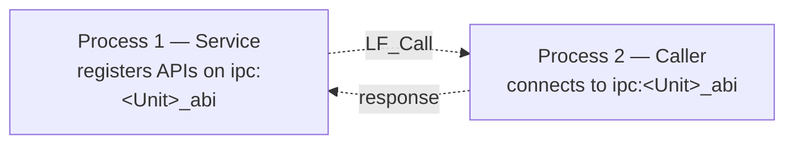
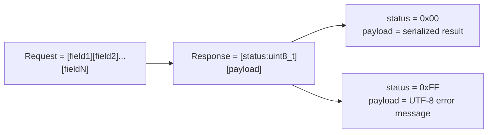

# code_decl_to_abi — User Guide

> **Purpose**: This is the **end-to-end user guide** for `code_decl_to_abi`. It covers the full workflow, in the order you actually perform it:
>
> 1. **Use the tool** — install it, feed it a Pascal unit or a C header, and produce cross-language ABI source code.
> 2. **Use the generated code** — compile it, wire it into your application, set up the runtime environment, and run a service/caller pair.
>
> **Audience**: Application developers, integration engineers, and AI agents who want to expose a set of Pascal/C declarations as cross-language binary-ABI services — without reading the tool's source.
>
> **Companion documents**:
> - `code_decl_to_abi_OPERATIONS.md` — internals, contracts, and how to extend the tool.
> - `pascal_code_abi_rule.md` — how to write Pascal declarations that the tool can parse.
> - `C_code_abi_rule.md` — how to write C headers that the tool can parse.
> - `code_decl_to_json_abi_USER_GUIDE.md` — the HTTP/JSON sibling tool.
>
> **Language**: English throughout, both in this document and in every artifact produced by the tool.

---

## Table of Contents

**Part I — Using the Tool**

- [Chapter 1  What This Tool Does](#chapter-1--what-this-tool-does)
- [Chapter 2  Why Binary ABI? The Serialization Efficiency Story](#chapter-2--why-binary-abi-the-serialization-efficiency-story)
- [Chapter 3  Language Support: Today and Tomorrow](#chapter-3--language-support-today-and-tomorrow)
- [Chapter 4  Install and Build the Tool](#chapter-4--install-and-build-the-tool)
- [Chapter 5  Prepare the Input Source](#chapter-5--prepare-the-input-source)
- [Chapter 6  Generate Code Through the GUI](#chapter-6--generate-code-through-the-gui)
- [Chapter 7  Generate Code Through the CLI](#chapter-7--generate-code-through-the-cli)
- [Chapter 8  Generate Code Through an AI Agent (MCP)](#chapter-8--generate-code-through-an-ai-agent-mcp)
- [Chapter 9  Embed the Generator Programmatically](#chapter-9--embed-the-generator-programmatically)

**Part II — Using the Generated Code**

- [Chapter 10  What the Tool Produces, and What Each File Is For](#chapter-10--what-the-tool-produces-and-what-each-file-is-for)
- [Chapter 11  Read the Companion Markdown First](#chapter-11--read-the-companion-markdown-first)
- [Chapter 12  Consuming the Pascal Output](#chapter-12--consuming-the-pascal-output)
- [Chapter 13  Consuming the Python Output](#chapter-13--consuming-the-python-output)
- [Chapter 14  Consuming the C++ Output](#chapter-14--consuming-the-c-output)
- [Chapter 15  Consuming the C# Output](#chapter-15--consuming-the-c-output)
- [Chapter 16  Setting Up the Runtime Environment](#chapter-16--setting-up-the-runtime-environment)
- [Chapter 17  Running an End-to-End Service/Caller Pair](#chapter-17--running-an-end-to-end-servicecaller-pair)

**Part III — Reference**

- [Chapter 18  Type System: What Is Supported and What Is Dropped](#chapter-18--type-system-what-is-supported-and-what-is-dropped)
- [Chapter 19  The Wire Protocol](#chapter-19--the-wire-protocol)
- [Chapter 20  Troubleshooting](#chapter-20--troubleshooting)
- [Chapter 21  Known Limitations and Roadmap](#chapter-21--known-limitations-and-roadmap)

---

# Part I — Using the Tool

---

## Chapter 1  What This Tool Does

`code_decl_to_abi` is the **binary-ABI code generator** of the LingoFuse toolchain. It reads a **declaration file** and writes **matching service-side and caller-side source code** in one or more target languages.

**Input**: a complete Pascal unit or a complete C header.

**Output**: for each requested target language:
- a **service library** that registers the declared routines as remote-callable APIs;
- a **caller library** that exposes one typed function per routine;
- a **companion Markdown README** per artifact — this is the artifact's own build and deployment manual (see Chapter 11);
- for C++ and C#, a small amount of build scaffolding (a CMake script, or two console test programs).

**One-line summary**: give it a declaration file; it lays out a binary-ABI RPC surface that any supported language can call.

The tool has **three frontends sharing one generator backend**:

| Frontend | File | Audience |
|----------|------|----------|
| **GUI** | `code_decl_to_abi_frm.pas` | Interactive desktop use |
| **CLI** | `code_decl_to_abi_cmdline.pas` | Scripts, CI, automation |
| **MCP** | `code_decl_to_abi_mcp_api_tool_provider_unit.pas` | AI agents via the LingoFuse beacon |

All three drive the **same generator functions**; the GUI and MCP paths actually share the same button handlers, so they can never drift apart.

This guide covers all three, then explains — in Part II — how to take the produced artifacts and turn them into a running service/caller pair.

---

## Chapter 2  Why Binary ABI? The Serialization Efficiency Story

This is why the tool exists alongside its JSON sibling. The binary ABI path is **substantially more efficient** than the HTTP/JSON path for high-concurrency workloads.

### 2.1 Compact, typed payloads — no text encoding overhead

In the ABI wire format every parameter is written as its **native machine representation**:

| Type family | Encoding on the wire |
|-------------|----------------------|
| Integers | Little-endian fixed-width binary (1, 2, 4, or 8 bytes) |
| Floats | IEEE 754 (`Single` = 4 bytes, `Double` = 8 bytes, `Extended` = 10 bytes) |
| Strings | Raw UTF-8 bytes followed by a single `NUL` terminator |

Compare with JSON, which must **stringify every number** (a 64-bit integer becomes ~8–20 ASCII bytes plus a separator), **escape every quote and backslash**, and **add structural punctuation** (braces, brackets, colons, commas).

For a payload like `{a: int64, b: int64, c: string}`:

- **Binary ABI**: `8 + 8 + (len(c) + 1)` bytes, plus negligible framing.
- **JSON**: `{"a":...,"b":...,"c":"..."}` — typically 4–10× larger for numeric-heavy payloads, and worse for arrays of numbers.

**Practical consequence**: for the same network bandwidth, the ABI path carries several times more logical requests per second.

### 2.2 No parse/format cost on the hot path

JSON requires:

- **On send**: `IntToStr`, `FloatToStr`, string escaping, structural concatenation.
- **On receive**: tokenization, number parsing, string unescaping, structural validation.

Each of these allocates and touches memory. Under high concurrency these allocations become the dominant cost — they fragment the heap, pressure the GC (in managed languages), and serialize on allocator locks.

Binary ABI writes and reads **directly into pre-allocated buffers**:

- Sending an `int64` is a single 8-byte `Move`.
- Sending a string is a `Move` plus a `NUL` byte.
- Receiving is the mirror operation.

There is **no per-field allocation** for scalars, and the only allocation for strings is the final destination string itself.

### 2.3 Zero-copy in the fast path

The generated ABI code uses LingoFuse's **direct buffer access**:

- `LF_WriteBuffer` / `LF_ReadBuffer` operate on the handle's internal buffer.
- The generated Pascal service uses `LF_ReadStringBytes` and `LF_WriteStringBytes` for strings, reading and writing **UTF-8 bytes directly** without an intermediate `string`-shaped allocation.
- For fixed-size fields (`Int64`, `Double`, …), the generated code reads/writes a single stack local and copies it in one `Move`.

The hot path never materializes a JSON AST: no tree to build, no `Variant` to box, no text to scan.

### 2.4 Deterministic, allocation-light under load

| Concern | Binary ABI | HTTP/JSON |
|---------|-----------|-----------|
| Per-scalar allocation | 0 | 1+ (boxed number or string fragment) |
| Per-string allocation | 1 (final) | 2–4 (escape buffer, fragment, final) |
| Temporary AST | none | yes (JSON object tree) |
| UTF-8 re-encoding | none (raw bytes) | yes (escape → unescape round-trip) |
| Text parsing | none | yes (lexer + number parser) |
| Framing | fixed binary header | variable-length text envelope |

The ABI path scales more gracefully as concurrency rises. This is exactly the profile you want for **service meshes, microservice backplanes, and agent tool registries**.

### 2.5 When to choose ABI over JSON

Choose `code_decl_to_abi` (binary ABI) when:

- You control both ends and they speak LingoFuse natively.
- Payloads are numeric-heavy or binary-heavy.
- You are running a high-concurrency service with tight latency budgets.
- You want to avoid the fixed cost of JSON parsing per call.

Choose `code_decl_to_json_abi` (HTTP/JSON) when:

- One end is a browser, an external HTTP client, or a language without a LingoFuse binding.
- You need the payloads to be human-readable or debuggable with `curl`.
- You are bridging to third-party HTTP APIs.

The two tools share the same input format, the same intermediate model, and the same type system; they differ only in the **wire format**.

---

## Chapter 3  Language Support: Today and Tomorrow

### 3.1 Current status

The tool ships with **four target languages**, each with a service side and a caller side:

| Target language | Service side | Caller side | Companion README | Test scaffolding |
|-----------------|:------------:|:-----------:|:----------------:|:----------------:|
| **Pascal** | ✅ | ✅ | ✅ | In README |
| **Python** | ✅ | ✅ | ✅ | `__main__` block inside the module |
| **C++** | ✅ (`.hpp` + `.cpp`) | ✅ (`.hpp` + `.cpp`) | ✅ | CMake + two `main.cpp` |
| **C#** | ✅ (`.cs`) | ✅ (`.cs`) | ✅ | Two console programs + test README |

Source languages today: **Pascal** and **C**.

### 3.2 The backend is designed for unbounded extension

Adding a new target language is a **mechanical process**, not an architectural change. The steps are documented in `code_decl_to_abi_OPERATIONS.md` Chapter 14 and are identical for every language:

1. Create two generator units: `<lang>_abi_service_generator_tool.pas` and `<lang>_abi_call_generator_tool.pas`.
2. Provide a type mapping table from the three ABI families (integer / float / string) to the target language's native types.
3. Register the new units in the main program, the CLI dispatcher, the GUI form, and the MCP tool provider.
4. Update the CLI's `Detect_Target_Lang` and help text.
5. Update the MCP `regCount` assertion.

**There is no ceiling.** Any language with (a) a C-ABI-compatible FFI, (b) a runtime that speaks LingoFuse's wire protocol, and (c) a way to marshal the three ABI families is a candidate.

### 3.3 Planned expansion

The roadmap is intentionally open-ended. Candidate language families:

- **Systems**: Rust, Go, Zig, Nim, D, Swift, Kotlin/Native.
- **JVM**: Java, Kotlin, Scala (via JNI or JNA).
- **.NET**: F#, VB.NET (via P/Invoke).
- **Functional**: OCaml, Haskell, F#, Elixir, Erlang.
- **Scripting**: Ruby, PHP, Perl, Lua, Julia.
- **Domain-specific**: R, MATLAB, Wolfram Language, custom DSLs.
- **Embedded**: MicroPython, embedded C, Ada, SPARK.

**The user-facing contract does not change** when a language is added: the same CLI flags, the same GUI workflow, and the same MCP tools continue to work.

---

## Chapter 4  Install and Build the Tool

### 4.1 Compiler and platform

| Item | Requirement |
|------|-------------|
| Compiler | Free Pascal 3.2+ or Delphi 10.4+ |
| Language mode | Delphi mode (`{$mode delphi}`) |
| Source encoding | UTF-8 (`{$CODEPAGE UTF8}`) |
| Platform | Windows / Linux / macOS |

### 4.2 Runtime dependencies of the **tool**

These are needed only at **tool runtime**, not at generation time:

| Dependency | Where to place it | Consequence if missing |
|------------|-------------------|------------------------|
| `LingoFuse64.dll` / `liblingofuse.so` / `liblingofuse.dylib` | Same directory as the tool's executable, or system PATH | All `LF_*` calls fail; MCP tool registration is disabled |
| `pascal_code_abi_rule.md` | Tool executable directory | GUI's "Pascal rule" button does nothing |
| `C_code_abi_rule.md` | Tool executable directory | GUI's "C rule" button does nothing |

The **generator itself** does not require the LingoFuse runtime; only the MCP provider (which lives inside the GUI process) needs it.

### 4.3 Build

```bash
lazbuild -B code_decl_to_abi.lpi
```

The tool is compiled as a **console-subsystem** application. This is deliberate:

- CLI mode produces stdout output correctly.
- GUI mode still works; the console window is hidden automatically when no CLI argument is present.

### 4.4 Verify the build

```bash
code_decl_to_abi --help
```

Expected: a help page describing the argument forms (see Chapter 7). If the help page prints correctly, the tool is ready.

---

## Chapter 5  Prepare the Input Source

Before you run the tool, the input must be written so that the parser can extract the declarations. The rules are different for Pascal and C, and both are strict: **anything that violates the rule is silently dropped**, with a note in the report only.

### 5.1 Pascal input

**Read `pascal_code_abi_rule.md` in full.** It is the parsing contract.

Quick summary of the hard rules:

- The declaration must be **top-level** and in the **`interface`** section. Nested (class/record/interface) routines are dropped.
- Only these parameter modifiers are accepted: blank, `const`, `in`. **`var` and `out` cause the whole declaration to be dropped.**
- Only these types are accepted:
  - Integers: `Integer`, `Int64`, `Cardinal`, `LongInt`, `DWord`, `Word`, `SmallInt`, `Byte`, `UInt64`, `LongWord`
  - Floats: `Double`, `Single`, `Extended`, `Real`
  - Strings: `string`, `AnsiString`, `UnicodeString`, `PChar`, `PAnsiChar`, `PWideChar`, `TP_String`, `TPascalString`, `TUPascalString`, `U_String`
- **Comments** must be **directly above** the declaration. `{ … }` comments must not contain `}` inside — use `(* … *)` if the body contains a closing brace.
- The return type must be declared **in the signature** (`: T`), not only in the comment.

Minimal example:

```pascal
unit MyUnit;

interface

(*
  Computes the sum of two integers.

  a: first addend
  b: second addend

  Return value: the sum of a and b.
*)
function Add(a: Integer; b: Integer): Integer;

implementation

function Add(a: Integer; b: Integer): Integer;
begin
  Result := a + b;
end;

end.
```

### 5.2 C input

**Read `C_code_abi_rule.md` in full.** It is the parsing contract.

Quick summary of the hard rules:

- Only **top-level function prototypes ending with `;`** are extracted. Function definitions with bodies are dropped.
- `struct`, `enum`, `union`, `typedef`, global variables, `#include` lines and other preprocessor directives are dropped.
- Function-pointer parameters cause the whole declaration to be dropped.
- Variadic parameters (`...`) cause the whole declaration to be dropped.
- The following types are accepted:
  - Integers: `signed char` / `int8_t`, `short` / `int16_t`, `int` / `int32_t`, `long`, `long long` / `int64_t` and their `unsigned` counterparts.
  - Pointer-width integers: `size_t`, `uintptr_t`, `ssize_t`, `ptrdiff_t`, `intptr_t`.
  - Floats: `float`, `double`, `long double`.
  - Strings: `char *`, `const char *`, `char const *`.
  - `void` (as return type only).
- **Any other pointer type** — including `void *` — maps to `Pointer`, which the **Pascal-side whitelist rejects**, so the whole declaration is dropped. Use `uint64_t` to carry an address instead.
- Multi-dimensional arrays are rejected. Single-level `[]` or `[N]` suffixes survive parsing but are then rejected by the Pascal-side whitelist.
- Comments must be **directly above** the declaration, in `/** … */`, `/* … */`, or `// …` form.

Minimal example:

```c
/* my_unit.h */
#ifndef MY_UNIT_H
#define MY_UNIT_H

/**
 * Computes the sum of two integers.
 *
 * @param a first addend
 * @param b second addend
 * @return the sum of a and b
 */
int add(int a, int b);

#endif /* MY_UNIT_H */
```

### 5.3 What happens to declarations the tool drops

Anything that violates the rules above is **silently dropped** from the model. The tool writes a line to the `Report` describing the reason. The GUI log shows the report; the CLI prints it to stdout; the MCP `ConvertToXxx` calls also return the failure reason.

The tool never raises an exception for a dropped declaration — it just won't appear in the output.

---

## Chapter 6  Generate Code Through the GUI

Launch the executable with **no arguments** to enter the GUI.

### 6.1 The five tabs

```
[Welcome] → [Source Code] → [Source <-> JSON] → [JSON <-> Model] → [Final Source]
```

Each tab has a "previous / next" button row at the top and a log panel at the bottom.

### 6.2 Tab 1 — Welcome

- Explains the tool and the workflow.
- **Pascal rule doc** opens `pascal_code_abi_rule.md`.
- **C rule doc** opens `C_code_abi_rule.md`.
- **Next: Enter source code** moves to Tab 2.

### 6.3 Tab 2 — Source Code

This is where you paste the input.

| Control | Effect |
|---------|--------|
| **Select Language** label | Click to auto-detect the source language from the pasted text. |
| **Language Selector** dropdown | `Auto-detect` / `Pascal` / `C` — manual override. |
| **Format** | Keep only top-level declarations; discard everything else. |
| **Empty unit** | Insert a minimal skeleton for the selected language. |
| **Test unit** | Insert a rich syntax sample — good for a first run. |
| **Next: Pascal/C → JSON** | Parse the current source, produce LV0 JSON, jump to Tab 3. |

**Procedure**:

1. Paste your Pascal unit or C header.
2. If you are unsure of the language, click the **Select Language** label to auto-detect.
3. If the syntax highlighting looks off, pick the language manually.
4. Click **Next: Pascal/C → JSON**.

### 6.4 Tab 3 — Source ↔ JSON

Shows the **LV0 JSON** (raw parser output).

| Button | Effect |
|--------|--------|
| **Back: rebuild code from JSON** | Reverse-rebuild source text from the current JSON, write it back to Tab 2. |
| **Next: JSON ↔ Model** | Normalize LV0 into LV1 Model, jump to Tab 4. |

You may edit the JSON by hand. If the parser mis-classified a type, fix it here and click **Next**.

### 6.5 Tab 4 — JSON ↔ Model

Shows the **LV1 Model JSON** — the sole input to all generators.

| Button | Effect |
|--------|--------|
| **Back: JSON ↔ Model** | Reverse-restore LV1 to LV0, write back to Tab 3. |
| **Next: generate source** | Run every generator, jump to Tab 5. |

**At this stage, any routine with an unsupported type has already been dropped.** If a function you expected is missing, this is where you notice it. See Chapter 18.

### 6.6 Tab 5 — Final Source

The Final Source tab has one sub-tab per target language and side. When generation completes, all sub-tabs are populated, and **all files are also written to disk** under:

```
<exe directory>/<UnitName>/
```

The naming follows the convention in Chapter 10.

### 6.7 Log panel

The bottom panel is the live `DoStatus` log. It shows:

- Which file was just saved.
- Any routines skipped during normalization.
- Any errors thrown by the generators.
- The registration status of the MCP tool provider.

It is cleared automatically when it exceeds 5000 lines.

---

## Chapter 7  Generate Code Through the CLI

### 7.1 Trigger condition

Command-line mode fires when **at least one argument** is passed. With no arguments, the tool launches the GUI.

### 7.2 Syntax

```
code_decl_to_abi --help
code_decl_to_abi <input_file> <output_file>
code_decl_to_abi --call <input_file> <output_file>
```

| Argument | Meaning |
|----------|---------|
| `--help` / `-h` / `-?` / `/?` | Print help and exit. Recognized only as the first argument. |
| `--call` / `-c` | Generate the caller side. Recognized only as the first argument; defaults to service side. |
| `<input_file>` | Source file. Language is detected from its extension. |
| `<output_file>` | Output file. Target language is detected from its extension. |

### 7.3 Extension → language mapping

**Source languages**:

| Extension | Source language |
|-----------|-----------------|
| `.pas` / `.pp` / `.p` | Pascal |
| `.h` / `.hpp` / `.hh` / `.c` / `.cpp` / `.cc` / `.cxx` | C |

**Target languages**:

| Extension | Target language | Output files |
|-----------|-----------------|--------------|
| `.pas` / `.pp` / `.p` | Pascal | one file |
| `.py` | Python | one file |
| `.hpp` / `.hh` / `.h` | C++ | `.hpp` + `.cpp` (both written) |
| `.cpp` / `.cc` / `.cxx` / `.c` | C++ | `.hpp` + `.cpp` (both written) |
| `.cs` | C# | **the complete set** (see below) |

### 7.4 Output naming rules

**Pascal and Python** honor your file name as-is.

**C++ and C# replace the file name** with a canonical name derived from the parsed source unit name. The **directory part** of your output argument is respected; only the file name is replaced. Rationale: the generated CMake script (C++) and the two console test programs (C#) reference the files by that name.

### 7.5 C++ special case

Naming either a `.hpp` or a `.cpp` produces both files with the same base name. Every C++ run also writes a `CMakeLists.txt` and two test programs, so a two-pass CLI invocation (service + caller) leaves a consistent, buildable directory.

### 7.6 C# special case

Every `.cs` invocation writes the **complete set**:

- `<UnitName>_abi_service.cs` + `_abi_service_csharp.md`
- `<UnitName>_abi_call.cs` + `_abi_call_csharp.md`
- `<UnitName>_abi_service_main_test___.cs`
- `<UnitName>_abi_call_main_test___.cs`
- `<UnitName>_abi_test_csharp.md`

The `--call` flag is accepted but **ignored** for `.cs`, because the two console test programs reference **both** libraries by namespace; emitting only one of the two would leave the test projects uncompilable.

### 7.7 Exit codes

| Code | Meaning |
|:----:|---------|
| `0` | Conversion succeeded |
| `1` | Missing or invalid arguments |
| `2` | Source parsing failed |
| `3` | Code generation failed |
| `4` | File I/O error |

### 7.8 Examples

```bash
# Pascal → Pascal service
code_decl_to_abi calculator.pas calculator_service.pas
# Output:
#   calculator_service.pas
#   calculator_service_readme.md

# Pascal → Pascal caller
code_decl_to_abi --call calculator.pas calculator_call.pas
# Output:
#   calculator_call.pas
#   calculator_call_readme.md

# C → Python service
code_decl_to_abi ComplexTestUnit.h calculator_service.py
# Output:
#   calculator_service.py
#   calculator_service_readme.md

# C → C++ service (two files + CMake + two test mains)
code_decl_to_abi ComplexTestUnit.h out/ComplexTestUnit_abi_service.hpp
# Output:
#   out/ComplexTestUnit_abi_service.hpp
#   out/ComplexTestUnit_abi_service.cpp
#   out/ComplexTestUnit_abi_service_cpp.md
#   out/CMakeLists.txt
#   out/ComplexTestUnit_abi_service_main.cpp
#   out/ComplexTestUnit_abi_call_main.cpp

# C → C# (the complete set is written in a single run)
code_decl_to_abi ComplexTestUnit.h out/Calculator.cs
# Output:
#   out/ComplexTestUnit_abi_service.cs
#   out/ComplexTestUnit_abi_service_csharp.md
#   out/ComplexTestUnit_abi_call.cs
#   out/ComplexTestUnit_abi_call_csharp.md
#   out/ComplexTestUnit_abi_service_main_test___.cs
#   out/ComplexTestUnit_abi_call_main_test___.cs
#   out/ComplexTestUnit_abi_test_csharp.md
```

### 7.9 Stdout shape

On success:

```
Reading: ComplexTestUnit.h (1234 chars)
Output : calculator_service.py
Mode   : service
Unit   : ComplexTestUnit
Funcs  : 28
Wrote  : calculator_service.py
Wrote  : calculator_service_readme.md
Done.
```

On failure, the tool prints a diagnostic line and returns a non-zero exit code. **Do not depend on the exact wording**; depend on the exit code.

### 7.10 What the CLI does **not** do

- It does not start the service or the caller. You compile and launch the generated code yourself.
- It does not start the LingoFuse runtime.
- It does not start the MCP tool provider.
- It does not open any network connection.

**All of that belongs to Part II of this guide.**

---

## Chapter 8  Generate Code Through an AI Agent (MCP)

### 8.1 Positioning

`code_decl_to_abi_mcp_api_tool_provider_unit.pas` wraps the entire generator as **31 LingoFuse Call APIs** and registers them with the **agent beacon** (default App `agent_main_app`, default register API `register_agent`). An MCP client can drive the generator entirely through tool calls.

The provider **simulates GUI operations**: each `internal_call_*` posts work to the main thread via `TCompute.Sync` and invokes the same button event handlers the GUI uses. The GUI and the MCP path are therefore provably in sync.

### 8.2 Requirements for agent mode

- The `code_decl_to_abi` **GUI is running**. The MCP provider lives inside the GUI process; closing the GUI takes the tools offline.
- A **beacon service is online** (`agent_main_app` by default).
- Both sides use the same LingoFuse endpoint (`ipc:agent` by default).
- The LingoFuse runtime is reachable.

### 8.3 The three-phase tool workflow

Every tool follows the same three-phase pattern:

```
Step 1  SetSourceCode(Source, Language)
Step 2  ConvertToXxx    (one or many)
Step 3  GetLastXxx      (read one or many)
```

- **Step 1 is SETUP.** It does not produce any files.
- **Step 2 branches are independent.** After one `SetSourceCode`, you may trigger any number of `ConvertToXxx` calls.
- **Step 3 is pure read.** It pulls cached results from the artifact editors.

### 8.4 The 31 tools

**Step 1 (1 tool)**

| Tool | Parameters | Return |
|------|------------|--------|
| `CodeDeclToAbi_SetSourceCode` | `Source: string`, `Language: string` | `{"status":"ok"}` |

`Language` accepts `"pascal"` or `"c"`, case-insensitive. It names the **source** language; passing `"python"` / `"cpp"` / `"csharp"` is a client-side confusion between source and target and is rejected.

**Step 2 (9 tools)**

| Tool | Return |
|------|--------|
| `CodeDeclToAbi_ConvertToPascalService` | `{"result":…,"readme":…}` |
| `CodeDeclToAbi_ConvertToPascalCall` | `{"result":…,"readme":…}` |
| `CodeDeclToAbi_ConvertToPythonService` | `{"result":…,"readme":…}` |
| `CodeDeclToAbi_ConvertToPythonCall` | `{"result":…,"readme":…}` |
| `CodeDeclToAbi_ConvertToCppService` | `{"result":…,"impl":…,"readme":…}` |
| `CodeDeclToAbi_ConvertToCppCall` | `{"result":…,"impl":…,"readme":…}` |
| `CodeDeclToAbi_ConvertToCsharpService` | `{"result":…,"readme":…}` |
| `CodeDeclToAbi_ConvertToCsharpCall` | `{"result":…,"readme":…}` |
| `CodeDeclToAbi_ConvertToCsharpTest` | `{"result":…,"impl":…,"readme":…}` |

**Step 3 (21 readers)**

Each `ConvertToXxx` has one reader per artifact it produces — for example:

- `CodeDeclToAbi_GetLastPascalServiceCode` / `...Readme`
- `CodeDeclToAbi_GetLastPascalCallCode` / `...Readme`
- `CodeDeclToAbi_GetLastPythonServiceCode` / `...Readme`
- `CodeDeclToAbi_GetLastPythonCallCode` / `...Readme`
- `CodeDeclToAbi_GetLastCppServiceHeader` / `...Impl` / `...Readme`
- `CodeDeclToAbi_GetLastCppCallHeader` / `...Impl` / `...Readme`
- `CodeDeclToAbi_GetLastCsharpServiceCode` / `...Readme`
- `CodeDeclToAbi_GetLastCsharpCallCode` / `...Readme`
- `CodeDeclToAbi_GetLastCsharpServiceTestCode`
- `CodeDeclToAbi_GetLastCsharpCallTestCode`
- `CodeDeclToAbi_GetLastCsharpTestReadme`

### 8.5 Recommended sequences

```
# Minimum complete flow (one language, service + caller)
SetSourceCode(MyUnitText, "pascal")
ConvertToPascalService()
ConvertToPascalCall()
GetLastPascalServiceCode()
GetLastPascalServiceReadme()      # ← read this for build/test
GetLastPascalCallCode()
GetLastPascalCallReadme()         # ← read this for build/test
```

```
# One source, multiple targets
SetSourceCode(MyUnitText, "pascal")
ConvertToPascalService()
ConvertToPythonService()
ConvertToCppService()
ConvertToCsharpService()
ConvertToCsharpTest()
...
```

### 8.6 Agent-mode notes

1. **The source language must be `pascal` or `c`**; anything else is rejected.
2. **The order is mandatory**: Step 1 → Step 2 → Step 3.
3. **`ConvertToXxx` is cached per source.** Re-running it after a `SetSourceCode` change re-parses; re-running without a source change is a no-op.
4. **The GUI must be alive.** There is no headless MCP mode.
5. **Generating code with an agent ≠ running the code.** Part II of this guide still applies.
6. **Point agents at the `.md` files.** After a successful `ConvertToXxx`, the `readme` field in the response points at the companion `.md`. Tell agents to read that `.md` for build commands, test programs, and CMake scripts.

### 8.7 Example agent interaction

```
# 1. Feed the source
CodeDeclToAbi_SetSourceCode(
    Source   = "<contents of calculator.pas>",
    Language = "pascal")

# 2. Produce both sides
CodeDeclToAbi_ConvertToPascalService()
CodeDeclToAbi_ConvertToPascalCall()

# 3. Read the artifacts (and the companions)
CodeDeclToAbi_GetLastPascalServiceCode()
CodeDeclToAbi_GetLastPascalServiceReadme()   # ← the build/run guide
CodeDeclToAbi_GetLastPascalCallCode()
CodeDeclToAbi_GetLastPascalCallReadme()      # ← the build/run guide
```

The agent can then either forward the artifacts to a user or, if the environment permits, execute the build/run instructions directly from the `.md`.

---

## Chapter 9  Embed the Generator Programmatically

For tools and services that want to embed the generator rather than launch it, `code_decl_to_abi` exposes a small set of public functions. These are the same functions the CLI, GUI, and MCP provider call internally.

### 9.1 Generator entry points

Every generator unit exports one function per artifact:

```pascal
function GenerateABIServicePascalCode(Model: TPascal_Func_Model): TPascalStringList;
function GenerateABIServicePascalReadme(Model: TPascal_Func_Model): TPascalStringList;
function GenerateABICallPascalCode(Model: TPascal_Func_Model): TPascalStringList;
function GenerateABICallPascalReadme(Model: TPascal_Func_Model): TPascalStringList;

function GenerateABIServicePyCode(Model: TPascal_Func_Model): TPascalStringList;
function GenerateABIServicePyReadme(Model: TPascal_Func_Model): TPascalStringList;
function GenerateABICallPyCode(Model: TPascal_Func_Model): TPascalStringList;
function GenerateABICallPyReadme(Model: TPascal_Func_Model): TPascalStringList;

function GenerateABIServiceHppCode(Model: TPascal_Func_Model): TPascalStringList;
function GenerateABIServiceCppCode(Model: TPascal_Func_Model): TPascalStringList;
function GenerateABIServiceCppReadme(Model: TPascal_Func_Model): TPascalStringList;
function GenerateABICallHppCode(Model: TPascal_Func_Model): TPascalStringList;
function GenerateABICallCppCode(Model: TPascal_Func_Model): TPascalStringList;
function GenerateABICallCppReadme(Model: TPascal_Func_Model): TPascalStringList;

function GenerateABIServiceCsharpCode(Model: TPascal_Func_Model): TPascalStringList;
function GenerateABIServiceCsharpReadme(Model: TPascal_Func_Model): TPascalStringList;
function GenerateABICallCsharpCode(Model: TPascal_Func_Model): TPascalStringList;
function GenerateABICallCsharpReadme(Model: TPascal_Func_Model): TPascalStringList;
function GenerateABIServiceMainTestCsharpCode(Model: TPascal_Func_Model): TPascalStringList;
function GenerateABICallMainTestCsharpCode(Model: TPascal_Func_Model): TPascalStringList;
function GenerateABICsharpTestReadme(Model: TPascal_Func_Model): TPascalStringList;

function GenerateABICmakeScript(Model: TPascal_Func_Model): TPascalStringList;
function GenerateABIServiceTestProgram(Model: TPascal_Func_Model): TPascalStringList;
function GenerateABICallTestProgram(Model: TPascal_Func_Model): TPascalStringList;
```

Each returns a `TPascalStringList` that the caller must dispose.

### 9.2 Model building

```pascal
var
  Parser: tpascal_func_decl_tool;
  Model: TPascal_Func_Model;
  Report: TPascalStringList;
begin
  Parser := tpascal_func_decl_tool.CreateFrom_Pascal_Code(SourceText);
  try
    Report := TPascalStringList.Create;
    try
      Model := TPascal_Func_Model.Create;
      try
        Model.Typ_Normalize_Func := tnf_ABI;   // required by the ABI generators
        Model.LoadFromParser(Parser, Report);
        // Now Model is ready for the generator functions above.
      finally
        Model.Free;
      end;
    finally
      Report.Free;
    end;
  finally
    Parser.Free;
  end;
end;
```

For a C header, substitute `CreateFrom_C_Code`. `LoadFromParser` applies the same six filters described in Chapter 18, so the model is guaranteed to contain only routines whose types are supported.

### 9.3 Minimum viable embedding

```pascal
var
  Parser: tpascal_func_decl_tool;
  Model: TPascal_Func_Model;
  Code: TPascalStringList;
begin
  Parser := tpascal_func_decl_tool.CreateFrom_Pascal_Code(SourceText);
  try
    Model := TPascal_Func_Model.Create;
    try
      Model.Typ_Normalize_Func := tnf_ABI;
      Model.LoadFromParser(Parser, nil);      // nil report = silent
      Code := GenerateABIServicePascalCode(Model);
      try
        if Code <> nil then
          Code.SaveToFile('MyUnit_abi_service_unit.pas');
      finally
        Code.Free;
      end;
    finally
      Model.Free;
    end;
  finally
    Parser.Free;
  end;
end;
```

---

# Part II — Using the Generated Code

The tool's job ends when the files are written to disk. Part II explains what to do with them.

---

## Chapter 10  What the Tool Produces, and What Each File Is For

### 10.1 The directory layout

Under the GUI, all generated files land in:

```
<exe directory>/<UnitName>/
```

Under the CLI, the caller chooses the directory (via the output argument), and the file names are:

- **Pascal and Python**: exactly what you named them.
- **C++ and C#**: canonical names derived from the source unit name.

### 10.2 The file inventory

| Target | Code files | Companion Markdown | Test scaffolding |
|--------|-----------|--------------------|------------------|
| **Pascal service** | `<Unit>_abi_service_unit.pas` | `<Unit>_abi_service_pascal.md` | Inside the README |
| **Pascal caller** | `<Unit>_abi_call_unit.pas` | `<Unit>_abi_call_pascal.md` | Inside the README |
| **Python service** | `<Unit>_abi_service.py` | `<Unit>_abi_service_python.md` | `__main__` block inside the module |
| **Python caller** | `<Unit>_abi_call.py` | `<Unit>_abi_call_python.md` | Inside the README |
| **C++ service** | `<Unit>_abi_service.hpp` + `.cpp` | `<Unit>_abi_service_cpp.md` | CMake + `<Unit>_abi_service_main.cpp` |
| **C++ caller** | `<Unit>_abi_call.hpp` + `.cpp` | `<Unit>_abi_call_cpp.md` | CMake + `<Unit>_abi_call_main.cpp` |
| **C# service** | `<Unit>_abi_service.cs` | `<Unit>_abi_service_csharp.md` | none (class library only) |
| **C# caller** | `<Unit>_abi_call.cs` | `<Unit>_abi_call_csharp.md` | none (class library only) |
| **C# tests** | two `*_main_test___.cs` | `<Unit>_abi_test_csharp.md` | two console entry points |

### 10.3 Responsibilities of each file

- **Service code**: registers the API with LingoFuse, decodes binary requests, calls the user's `internal_call_<Api>` stub, encodes binary responses.
- **Caller code**: exposes a typed function per API, serializes arguments, issues the LingoFuse call, deserializes the result, raises a language-appropriate exception on error.
- **README (`.md`)**: **the runnable build/deploy guide for the artifact.** See Chapter 11.
- **Test scaffolding**: a minimal runnable program that exercises the artifact end to end. Every language has one; the form differs.

### 10.4 What you must edit before using the generated code

For **every** target language, you must:

1. **Fill in the `internal_call_<Api>` stub bodies.** The tool emits `TODO` placeholders; you replace them with calls to your real implementation.
2. **Place the runtime library** (`LingoFuse64.dll` / `liblingofuse.so` / `liblingofuse.dylib`) where the process can find it. See Chapter 16.
3. **Start the service process** before any caller process. See Chapter 17.

Everything else — the wire format, the serialization helpers, the callbacks, the registration functions — is already correct.

---

## Chapter 11  Read the Companion Markdown First

Before you write a single line of build script:

> **Open the companion `.md` file for the artifact you want to build.**

The `.md` and the code were produced from the **same `TPascal_Func_Model`** in the same pass. This means:

- They never drift apart. Regenerating updates both.
- The README always describes the current code.
- You can hand the `.md` to another engineer (or to an agent) and they can reproduce your build.

### 11.1 What the README contains

Every companion README follows the same twelve-section structure:

| § | Title | Content |
|:-:|-------|---------|
| 1 | Overview | What the code is, design principles, quick start |
| 2 | Application Scope | When to use / not use it |
| 3 | Compatibility | Compilers, runtime versions, platforms, dependencies, threading |
| 4 | Wire Protocol | Request/response shapes, encoding rules, call sequence |
| 5 | Runtime Architecture | Startup order, call sequence, timeouts, target App name |
| 6 | Type Mapping | Supported types, unsupported types, endianness, NUL framing |
| 7 | Deployment | Directory layout, build commands, startup order, shutdown order |
| 8 | Testing | A fully copy-pasteable test program |
| 9 | API Reference | Summary table + per-API details |
| 10 | Troubleshooting | Symptom / cause / fix table |
| 11 | Self-Assessment Checklist | Questions a reader should be able to answer |
| 12 | Reference Resources | Related toolchain index |

### 11.2 Language-specific build detail that lives in the README

| Target | Build detail that only the README carries |
|--------|-------------------------------------------|
| **Pascal** | The exact `fpc -Fu<…>` command line, including search paths for `lingofuse_import.pas` and `Z.Core` |
| **Python** | `PYTHONPATH` and `pip install` instructions; the module's own `__main__` block is the test program |
| **C++** | A complete CMake script plus raw `g++` / `clang++` / MSVC / MinGW invocations |
| **C#** | `dotnet new console` + copy + `dotnet run` walkthrough; the `DllImportResolver` behavior |

### 11.3 Practical consequence for this guide

Because the `.md` files carry the language-specific build details, **this user guide does not try to reproduce every build command for every language**. Chapters 12–15 give the high-level workflow and point you at the exact README section you need.

---

## Chapter 12  Consuming the Pascal Output

The Pascal target produces two files: a service unit and a caller unit. Both are self-contained `.pas` files that you compile into your own program.

### 12.1 What you receive

- `<Unit>_abi_service_unit.pas` — service library.
- `<Unit>_abi_call_unit.pas` — caller library.
- `<Unit>_abi_service_pascal.md` and `<Unit>_abi_call_pascal.md` — the two READMEs.

### 12.2 Filling in the service stubs

Open `<Unit>_abi_service_unit.pas`. Each routine appears as a generated stub:

```pascal
function internal_call_Add_Add(a: Int64; b: Int64): Int64;
begin
  Result := 0;
  // Result := MyUnit.Add(a, b);   // ← replace with your real function
end;
```

Replace the placeholder body with a call to your real function. The signature already matches.

**If the body must run on the main thread** (for example, to touch UI controls), the generated stub contains a synchronised variant in a block comment. Uncomment the two block comments and the `//` lines inside them; the synchronised form uses `TCompute.Sync` from `Z.Core`, which is already imported.

### 12.3 Compiling

The exact `fpc -Fu<…>` command line — including every search path — is in the README's **§7 Deployment**.

In general, you need:

- `-Fu<dir-with-lingofuse_import.pas>`
- `-Fu<dir-with-Z.Core.pas>`
- `-Fu<dir-with-lingofuse_helper.pas>` (optional, but used by the test programs)

### 12.4 Running the test harness

The README's **§8 Testing** contains a complete, copy-paste-ready service program and a caller program. Compile both, start the service first, then start the caller. Expected output is spelled out in the README.

### 12.5 Filling in the caller side

The caller unit exports one free function per API:

```pascal
function Add(a: Int64; b: Int64): Int64;
```

The implementation is fully generated: it serializes `a` and `b`, calls the service over LingoFuse, reads the response, and raises `EABI_RemoteError` on failure. **You do not edit the caller unit.** You just compile it and call the functions.

### 12.6 Deployment

The README's **§7.5 Runtime files** table tells you exactly which binaries must sit next to the executable. In practice:

- `LingoFuse64.dll` / `liblingofuse.so` / `liblingofuse.dylib`
- `z_ipc_*.dll` / `libz_ipc_*.so`

### 12.7 Shutdown order

Always:

1. `LF_ExitMainThread`
2. `LF_FreeApp(App)` (service only)
3. `LF_Shutdown`

Skipping a step leaks resources or crashes on exit.

---

## Chapter 13  Consuming the Python Output

The Python target produces two modules: a service module and a caller module. Both are self-contained `.py` files.

### 13.1 What you receive

- `<Unit>_abi_service.py` — service module, **runnable as a program**.
- `<Unit>_abi_call.py` — caller module.
- `<Unit>_abi_service_python.md` and `<Unit>_abi_call_python.md` — the two READMEs.

### 13.2 Installing the `lingofuse` package

Both modules import from `lingofuse._lf_native` and `lingofuse.lf_io`. Two sources are supported:

| # | Source | How |
|---|--------|-----|
| 1 | Standalone `py-lingofuse` repository or PyPI package | `pip install py-lingofuse` |
| 2 | `lingofuse/` directory shipped with the v3 toolchain | Point `PYTHONPATH` at `<v3>/src` |

The README's **§3.3** spells out both, including Windows PowerShell syntax.

### 13.3 Filling in the service stubs

Open `<Unit>_abi_service.py`. Each routine appears as a generated stub:

```python
def internal_call_Add(a: int, b: int) -> int:
    # TODO: call the real function, for example:
    #     return my_engine.add(a, b)
    return 0
```

Replace the body with a call to your real function. The signature is already correct.

### 13.4 Running the service

**The module is its own test program.** It contains a full `if __name__ == "__main__":` block:

```bash
python <Unit>_abi_service.py
```

Expected output:

```
=== <Unit>_abi service ===
[OK] Service ready. Type 'exit' and press Enter to quit.
```

While this is running, you can start the caller module in another terminal.

### 13.5 Calling from Python

```python
from lingofuse._lf_native import (
    LF_ResetPrepare, LF_PrepareClient, LF_PrepareDone,
    LF_ExitMainThread, LF_Shutdown,
)
from lingofuse.lf_io import cstr
import <Unit>_abi_call as abi

LF_ResetPrepare()
LF_PrepareClient(cstr("ipc:<Unit>_abi"), None)
if LF_PrepareDone() != 1:
    raise SystemExit(1)
try:
    print(abi.Add(3, 4))
finally:
    LF_ExitMainThread()
    LF_Shutdown()
```

### 13.6 Adjusting the timeout

```python
import <Unit>_abi_call as abi
abi.ABI_TIMEOUT = 30000  # 30 seconds
```

A value of `0` disables the timeout.

### 13.7 Deployment

The README's **§7.5 Runtime files** table applies. In practice, place next to your Python script (or on the loader search path):

- `LingoFuse64.dll` / `liblingofuse.so` / `liblingofuse.dylib`
- `z_ipc_*.dll` / `libz_ipc_*.so`

---

## Chapter 14  Consuming the C++ Output

The C++ target produces **four files per side**: `.hpp` + `.cpp` for the library, a README, and shared CMake plus test programs.

### 14.1 What you receive

For a service build:

- `<Unit>_abi_service.hpp` — declaration header.
- `<Unit>_abi_service.cpp` — implementation.
- `<Unit>_abi_service_cpp.md` — the README.
- `CMakeLists.txt` — build script covering both service and caller.
- `<Unit>_abi_service_main.cpp` — service test entry point.
- `<Unit>_abi_call_main.cpp` — caller test entry point (produced even in service mode).

### 14.2 Filling in the service stubs

Open `<Unit>_abi_service.cpp`. Each routine appears as a generated stub:

```cpp
int64_t internal_call_Add(int64_t a, int64_t b) {
    // TODO: replace the body with a call to the real function.
    //     return MyEngine::Add(a, b);
    (void)a;
    (void)b;
    return 0;
}
```

Two ways to fill it in:

- **Option A (in place)**: replace the `TODO` and `return 0;` lines with your call. Leave the `(void)` lines; they silence unused-parameter warnings when the body is short.
- **Option B (separate TU)**: the stubs are declared in the `.hpp`, so you can delete the placeholder bodies from the `.cpp` and provide your own definitions in a separate translation unit. The `Safe_Write_*` helpers are declared `inline` in the header, so they remain available to your file.

### 14.3 Building

The README's **§7.3 Build commands** section gives the exact invocations. If you use CMake, you only need to set one variable:

```bash
cmake -S . -B build -DLINGOFUSE_CPP_DIR=<dir-with-LingoFuse.h>
cmake --build build --config Release
```

This produces:

- `lingofuse_c_wrapper` (static library from `LingoFuse.c`)
- `<Unit>_abi_service` (static library, if the service `.cpp` exists)
- `<Unit>_abi_service_test` (executable, if the service main exists)
- `<Unit>_abi_call` and `<Unit>_abi_call_test` (same for the caller side)

### 14.4 Running the tests

In one terminal:

```bash
./<Unit>_abi_service_test
```

Wait for `[OK] Service ready`, then in another terminal:

```bash
./<Unit>_abi_call_test
```

Expected output is spelled out in the README's **§8 Testing** and in the shared test README.

### 14.5 The runtime loading contract

**C++ test programs call `LF_LoadLibrary()` first.** This function takes no arguments; the wrapper searches:

1. the directory containing the current executable, then
2. the OS default loader search path.

There is no environment-variable override at the C ABI level. Either place the runtime next to the executable, or put it on `PATH` / `LD_LIBRARY_PATH` / `DYLD_LIBRARY_PATH`. See Chapter 16.

### 14.6 MSVC users

Add `/utf-8` to the compiler command line. Otherwise the non-ASCII characters in the API description strings are encoded with the system codepage and will not match the UTF-8 encoding LingoFuse expects.

### 14.7 Adjusting the timeout and the target App name

Both live in the `<Unit>_abi` namespace:

```cpp
<Unit>_abi::ABI_Timeout  = 30000;                      // 30 seconds
<Unit>_abi::ABI_TargetApp = "my_other_service_abi";    // change target
```

---

## Chapter 15  Consuming the C# Output

The C# target produces **three files**: a service library, a caller library, and two console test programs plus a shared test README.

### 15.1 What you receive

In a single run:

- `<Unit>_abi_service.cs` — service library, class library, **no `Main`**.
- `<Unit>_abi_service_csharp.md` — service README.
- `<Unit>_abi_call.cs` — caller library, class library, **no `Main`**.
- `<Unit>_abi_call_csharp.md` — caller README.
- `<Unit>_abi_service_main_test___.cs` — service test program.
- `<Unit>_abi_call_main_test___.cs` — caller test program.
- `<Unit>_abi_test_csharp.md` — shared test README.

### 15.2 The **entry-point-free** convention

**The service and caller libraries deliberately contain no `Main`.** A C# project may have exactly one entry point; if the service library brought its own `Main`, any host program — or the paired test program — would immediately trigger `CS0017: Program has more than one entry point defined`.

The two console test programs live in their own files, and each is meant to be compiled into **its own .NET console project** alongside the matching library.

### 15.3 Filling in the service stubs

Open `<Unit>_abi_service.cs`. Each routine appears as a generated stub inside the `InternalCalls` class:

```csharp
public static int InternalCall_Add(int a, int b)
{
    // TODO: replace the body with a call to the real function.
    //     return MyEngine.Add(a, b);
    return 0;
}
```

Replace the placeholder body with a call to your real function.

The callbacks in the `Callbacks` class hold a `static readonly` field per delegate, so the CLR cannot garbage-collect the callback delegate while the native layer still holds its pointer. **Do not remove those fields.**

### 15.4 Building and running the service test

The shared test README (`<Unit>_abi_test_csharp.md`) gives the exact `dotnet` commands. In short:

```bash
dotnet new console -o <Unit>_service_test
cd <Unit>_service_test
cp ../<Unit>_abi_service.cs .
cp ../<Unit>_abi_service_main_test___.cs Program.cs
cp ../runtime/LingoFuse64.dll .        # or .so / .dylib
dotnet run
```

Expected output:

```
=== <Unit> ABI service test ===
[OK] Service ready on ipc:<Unit>_abi.
[OK] Registered N API(s).
[OK] Press Enter to shut down.
```

### 15.5 Building and running the caller test

In another terminal:

```bash
dotnet new console -o <Unit>_call_test
cd <Unit>_call_test
cp ../<Unit>_abi_call.cs .
cp ../<Unit>_abi_call_main_test___.cs Program.cs
cp ../runtime/LingoFuse64.dll .
dotnet run
```

Expected: a per-API pass/fail line and a final summary; a non-zero exit code if any API failed.

### 15.6 Coexistence with the service module

Both `.cs` files can live side by side in the same project without symbol collisions because:

- the service module uses the namespace `<Unit>_abi`;
- the caller module uses the namespace `<Unit>_abi_call`;
- each module owns its own `LfNative`, `LfIo`, and `EABI_RemoteError`, scoped to its own namespace.

### 15.7 The runtime library path

The runtime is resolved lazily on the first `LF_*` call through a `DllImportResolver` that maps the logical name `"LingoFuse"` to:

| Platform | File |
|----------|------|
| Windows x64 | `LingoFuse64.dll` |
| Windows x86 | `LingoFuse32.dll` |
| Linux / BSD | `liblingofuse.so` |
| macOS | `liblingofuse.dylib` |

Place the file in the application directory, or on the OS loader search path.

### 15.8 Adjusting the timeout and the target App name

Both are static fields on the `ABI` class:

```csharp
ABI.Timeout   = 30000;                      // 30 seconds
ABI.TargetApp = "my_other_service_abi";
```

---

## Chapter 16  Setting Up the Runtime Environment

This chapter applies to **every target language**. It covers the binary files and the endpoint that every generated program needs at runtime.

### 16.1 The runtime binaries

| File | Role |
|------|------|
| `LingoFuse64.dll` (Windows) / `liblingofuse.so` (Linux) / `liblingofuse.dylib` (macOS) | The LingoFuse core runtime. Every `LF_*` call goes through it. |
| `z_ipc_*.dll` / `libz_ipc_*.so` | The IPC transport plugin. Required for loopback endpoints. |
| `LingoFuse.hpp` / `lf_io.hpp` (C++ only) | C++ wrapper headers. |
| `LingoFuse.h` / `LingoFuse.c` (C++ only) | C ABI declarations and the dynamic-loading wrapper source. |

### 16.2 Where to place the binaries

| Environment | Where to place them |
|-------------|---------------------|
| Pascal / Python / C++ / C# | Next to the executable, or on the OS loader search path |
| Linux / BSD | `LD_LIBRARY_PATH` |
| macOS | `DYLD_LIBRARY_PATH` |
| Windows | `PATH`, or the executable's own directory |

The C++ test programs call `LF_LoadLibrary()` explicitly; all other languages rely on the OS loader.

### 16.3 The default IPC endpoint

By convention, every ABI service listens on:

```
ipc:<UnitName>_abi
```

for example, for a source unit named `Calculator`, the endpoint is `ipc:Calculator_abi`. The `<UnitName>` is the name the parser extracted from the source file. The generated code uses this endpoint consistently across languages, so a Python caller can reach a Pascal service, or a C# caller can reach a C++ service, without any manual coordination.

### 16.4 Threading the runtime correctly

The runtime is **fully thread-safe** at the C ABI level. However:

- **Callbacks execute on worker threads**, not the main thread. Every generated callback is wrapped in a language-appropriate guard so that no exception escapes into the C stack.
- **Do not call `LF_Call` / `LF_Notify` from inside a callback.** Doing so deadlocks the calling worker thread. If you need to reach another service from inside a callback, offload the work to a separate thread (`TThread.CreateAnonymousThread`, `threading.Thread`, `std::thread`, `Task.Run`).
- **Do not block inside a callback.** Long-running callbacks tie up worker threads from the pool.

### 16.5 Environment variables for the runtime

| Variable | Purpose |
|----------|---------|
| `LD_LIBRARY_PATH` (Linux) / `DYLD_LIBRARY_PATH` (macOS) | Add extra directories to the loader search path. |
| `PATH` (Windows) | Same, on Windows. |

There is **no environment-variable override** for the LingoFuse runtime name itself, and no way to point at a runtime in an arbitrary directory at the C ABI level. Either place the runtime next to the executable, or put it on the loader search path.

---

## Chapter 17  Running an End-to-End Service/Caller Pair

This chapter is the **shortest possible end-to-end recipe**: two processes, one service, one caller, running on the same machine over loopback IPC.

### 17.1 Overview


```mermaid
flowchart LR
    A["Process 1 — Service<br/>registers APIs on ipc:&lt;Unit&gt;_abi"]
    B["Process 2 — Caller<br/>connects to ipc:&lt;Unit&gt;_abi"]
    A -. "LF_Call" .-> B
    B -. "response" .-> A
```

### 17.2 Step 1 — Build the service and the caller

For each language, follow the corresponding chapter of Part II:

- **Pascal** — Chapter 12
- **Python** — Chapter 13
- **C++** — Chapter 14
- **C#** — Chapter 15

In every case, you end up with two executables (or, for Python, two runnable modules) that both reference the same endpoint.

### 17.3 Step 2 — Place the runtime binaries

Make sure both processes can find:

- `LingoFuse64.dll` / `liblingofuse.so` / `liblingofuse.dylib`
- `z_ipc_*.dll` / `libz_ipc_*.so`

See Chapter 16.

### 17.4 Step 3 — Start the service

In **terminal 1**:

- Pascal: run your compiled service executable.
- Python: `python <Unit>_abi_service.py`.
- C++: `./<Unit>_abi_service_test`.
- C#: `dotnet run` inside the service test project.

Wait for the service to print something equivalent to:

```
[OK] Service ready on ipc:<Unit>_abi.
```

### 17.5 Step 4 — Start the caller

In **terminal 2**:

- Pascal: run your compiled caller executable.
- Python: `python <Unit>_abi_client.py`.
- C++: `./<Unit>_abi_call_test`.
- C#: `dotnet run` inside the caller test project.

The caller will connect, invoke every API once (for the test programs) or invoke the APIs you actually call (for your own application), and print the results.

### 17.6 Step 5 — Shut down cleanly

In the service terminal:

1. Press Enter (or type `exit`) to trigger shutdown.
2. Observe `[OK] Shutdown complete.`
3. The service releases its App handle and shuts down the runtime.

The caller side shuts down on its own when its program exits.

### 17.7 A worked example

Suppose the source is:

```pascal
unit Calculator;

interface

(* Adds two integers. *)
function Add(a: Integer; b: Integer): Integer;

(* Multiplies two integers. *)
function Mul(a: Integer; b: Integer): Integer;

implementation
end.
```

After generation and compilation:

1. The service process registers the APIs `Add` and `Mul` on `ipc:Calculator_abi`.
2. The caller process connects to `ipc:Calculator_abi` and calls `Add(20, 22)`.
3. The caller prints `42`.

### 17.8 Mixed-language deployments

The ABI wire protocol is language-agnostic. You can mix:

- a Python service with a C++ caller,
- a Pascal service with a C# caller,
- a C++ service with a Python caller,
- any other combination.

The only requirements are that both ends were generated from **the same source unit** and that they both speak LingoFuse's ABI wire format.

---

# Part III — Reference

---

## Chapter 18  Type System: What Is Supported and What Is Dropped

### 18.1 The three supported families

Only three families are supported by the generators.

**Integer family**: `integer`, `longint`, `int64`, `cardinal`, `dword`, `longword`, `uint64`, `word`, `smallint`, `byte`.

**Float family**: `double`, `single`, `extended`, `real`.

**String family**: `string`, `ansistring`, `unicodestring`, `tpascalstring`, `tupascalstring`, `tp_string`, `pchar`, `pansichar`, `pwidechar`.

### 18.2 Target-language mapping

| ABI family | Pascal | Python | C++ | C# |
|-----------|--------|--------|-----|-----|
| String | `string` | `str` | `std::string` | `string` |
| Float | preserved (`Double` / `Single` / `Extended` / `Real`) | `float` | `double` / `float` | `double` / `float` |
| Integer | preserved (`Integer` / `Int64` / …) | `int` | `int32_t` / `int64_t` / … | `int` / `long` / … |

### 18.3 Unsupported types — silent drop

The following cause the **entire routine to be silently dropped**:

- `Boolean`, `WordBool`, `LongBool`
- `Variant`, `OleVariant`
- Arrays, records, classes, interfaces
- Enums, sets, generics
- Pointers, function pointers
- `Currency`, `Comp`, `TDateTime`
- Any C `struct` / `enum` / `union`
- Any C pointer other than `char *` / `const char *` / `char const *`

### 18.4 The six filters in `LoadFromParser`

The model-building stage enforces six filters. Any of them tripping causes the routine to disappear from the model:

1. `IsProc = False`
2. `NestLevel <> 0` (declared inside a class, record, or interface)
3. Empty parameter name
4. `var` / `out` parameter modifier
5. Unsupported parameter type
6. Unsupported return type

**Workaround**: serialize complex values into a `string` before passing them; deserialize on the receiving side.

---

## Chapter 19  The Wire Protocol

### 19.1 Request and response shape


```mermaid
flowchart LR
    A["Request = [field1][field2]...[fieldN]"] --> B["Response = [status:uint8_t][payload]"]
    B --> C["status = 0x00<br/>payload = serialized result"]
    B --> D["status = 0xFF<br/>payload = UTF-8 error message"]
```

### 19.2 Field encodings

| Type | Encoding |
|------|----------|
| Integer | Little-endian, fixed width |
| Float | IEEE 754 (`Single` 4 bytes, `Double` 8 bytes, `Extended` 10 bytes) |
| String | Raw UTF-8 bytes followed by a single `NUL` terminator |

### 19.3 Status byte semantics

| Status | Meaning | Payload |
|:------:|---------|---------|
| `0x00` | Success | Serialized result, or empty for a procedure |
| `0xFF` | Failure | UTF-8 error message |

The generated service always writes one of these two statuses before writing any payload. The generated caller reads the status first and raises its language-appropriate exception when the status is not `0x00`.

### 19.4 Concurrency profile

The wire format is deliberately allocation-light:

- No JSON AST is ever built.
- Strings are moved as raw UTF-8 bytes; no escape/unescape round trip.
- No text parse: no number parser, no lexer, no structural validation.
- Per-call allocations: one for the handle (recycled from a pool), plus one per string destination.

This is exactly the profile you want for high-concurrency service meshes and microservice backplanes.

### 19.5 Cross-language mixing

The wire format is language-agnostic. Any language with a correct implementation of the encoder and decoder can talk to any other. The four current backends all emit byte-identical wire formats for the same signature.

---

## Chapter 20  Troubleshooting

### 20.1 Generation-time issues

| Symptom | Root cause | Fix |
|---------|-----------|-----|
| CLI reports "cannot detect source language" | The input file's extension is not in the source language table | Rename the file, or update `Detect_Source_Lang` (see OPERATIONS Chapter 15) |
| CLI reports "cannot detect target language" | The output file's extension is not in the target language table | Rename the output, or update `Detect_Target_Lang` (see OPERATIONS Chapter 9) |
| A routine you expected is missing from the model | One of the six filters tripped | See Chapter 18 |
| All routines are missing | The source has no top-level routines, or every routine failed the type check | Check the report |
| MCP `SetSourceCode` returns `{"error":"Unsupported source language"}` | You passed a target language (`python` / `cpp` / `csharp`) instead of a source language | Pass `pascal` or `c` |
| MCP `ConvertToXxx` returns empty | `SetSourceCode` was not called first, or the source text is empty | Call `SetSourceCode` first |
| MCP `RegisterTools` returns False | Beacon is not reachable, or `regCount` mismatch | Check `LF_CheckApiEx(BEACON_APP, REGISTER_API)` |

### 20.2 Build-time issues

| Symptom | Language | Fix |
|---------|----------|-----|
| `Can't find unit Z.Core` | Pascal | Add `-Fu<dir-with-Z.Core.pas>` |
| `Can't find unit lingofuse_import` | Pascal | Add `-Fu<dir-with-lingofuse_import.pas>` |
| `ModuleNotFoundError: lingofuse` | Python | `pip install py-lingofuse`, or set `PYTHONPATH` |
| `fatal error: LingoFuse.hpp: No such file` | C++ | Add `-I<dir-with-LingoFuse.hpp>` |
| `undefined reference to LF_*` | C++ | Add `-lLingoFuse` and `-L<dir>` |
| `error CS0017: Program has more than one entry point` | C# | You added a `Main` to a generated library, or an old copy of the library is still present. Delete it and regenerate. |
| `error CS0246: type or namespace not found` | C# | The matching library `.cs` file is not in the project |

### 20.3 Runtime issues

| Symptom | Root cause | Fix |
|---------|-----------|-----|
| `DllNotFoundException: LingoFuse64.dll` | Runtime library not on the search path | Copy it next to the executable; see Chapter 16 |
| `BadImageFormatException` | Architecture mismatch (32-bit vs 64-bit) | Use the matching runtime for your platform |
| `LF_PrepareDone` returns 0 | Another component already started the main thread, or the service is not running | Reorder startup, or check that the service is up |
| `EABI_RemoteError: nil (timeout)` | App name mismatch, or timeout too short | Check `TargetApp` / `DEFAULT_APP_NAME`; increase the timeout |
| `EABI_RemoteError: "input truncated"` | Fewer fields than expected | Verify both sides were generated from the same model |
| `EABI_RemoteError: <garbled bytes>` | Encoding mismatch | Verify both sides use the same type table |
| Callback never fires | The `internal_call_*` stub is still the placeholder | Replace the stub body |
| Deadlock inside a callback | A blocking LingoFuse call was made inside a callback | Offload the call to a separate thread |
| UI crashes in the service | A worker-thread callback touched the UI | Marshal to the main thread, or enable the synchronised stub variant (Pascal) |

### 20.4 Where to look next

- **Pascal / Python / C++ / C#** — the corresponding README's §10 Troubleshooting table is tuned to that target and is the fastest place to look.
- **Wire-level problems** — the README's §4 Wire Protocol shows the exact byte layout for every API in your service.

---

## Chapter 21  Known Limitations and Roadmap

### 21.1 Current limitations

- **Four target languages** (Pascal, Python, C++, C#). The JavaScript path is provided by `code_decl_to_json_abi`.
- **Three type families** (integer, float, string). Complex types must be serialized to `string` by the caller.
- **Two source languages** (Pascal, C). Adding a new source language is a documented process.
- **MCP provider is tied to the GUI's lifetime.** There is no headless MCP mode.
- **The CLI does not start the service or the runtime.** Part II of this guide covers that.

### 21.2 Roadmap

The generator backend is engineered to support **an unbounded number of target languages**. The mechanical procedure for adding a new language is documented in `code_decl_to_abi_OPERATIONS.md` Chapter 14, and is identical for every language.

Future releases will extend coverage to additional language families, including but not limited to:

- Systems languages: Rust, Go, Zig, Nim, D, Swift.
- JVM languages: Java, Kotlin, Scala.
- .NET languages: F#, VB.NET.
- Functional languages: OCaml, Haskell, F#, Elixir, Erlang.
- Scripting languages: Ruby, PHP, Perl, Lua, Julia.
- Domain-specific ecosystems: R, MATLAB, Wolfram Language.

When a language is added, **the user-facing contract does not change**: the same CLI flags, the same GUI tabs, and the same MCP tools continue to work. The only difference is a new set of `<lang>_abi_*` generator units in the backend and a new companion `.md` per artifact.

### 21.3 When to use this tool versus `code_decl_to_json_abi`

| Scenario | Recommended tool |
|----------|------------------|
| Both ends are LingoFuse-native, high-concurrency service | **`code_decl_to_abi`** |
| Numeric-heavy or binary-heavy payloads | **`code_decl_to_abi`** |
| One end is a browser, an external HTTP client, or a language without a LingoFuse binding | `code_decl_to_json_abi` |
| Payloads must be human-readable or debuggable with `curl` | `code_decl_to_json_abi` |
| You need to bridge to third-party HTTP APIs | `code_decl_to_json_abi` |

The two tools share the same input format, the same intermediate model, and the same type system; they differ only in the **wire format**.

---

**Document version**: 2.0
**Document role**: End-to-end user guide for `code_decl_to_abi` — covering both **using the tool** (Chapters 1–9) and **using the generated code** (Chapters 10–17), with reference material for the type system, wire protocol, and troubleshooting.
**Companion documents**: `code_decl_to_abi_OPERATIONS.md` (internals), `pascal_code_abi_rule.md` and `C_code_abi_rule.md` (input contracts), and the four per-language README files produced by the tool itself.
**Language of the tool and of every generated artifact**: English.