# C 声明规范（Z.Pascal_Func_Tool 工具链兼容）

**版本**：3.0
**最后更新**：2026-09-24
**约束对象**：`Fill_C` → `Translate_C_Typ_To_Pascal` → `Z.Pascal_Func_Model` → `pas_mcp_generator_tool` 完整工具链
**文档定位**：本规范即 **C 解析契约**。任何偏离都会导致声明被**静默跳过**或**信息被静默丢失**。请严格按本规范书写。

---

## 0. 三十秒速览

**核心逻辑**：写对了就提取，写错了一整条声明被**静默跳过**——不报错，不提示，只有 Report 里一行记录。

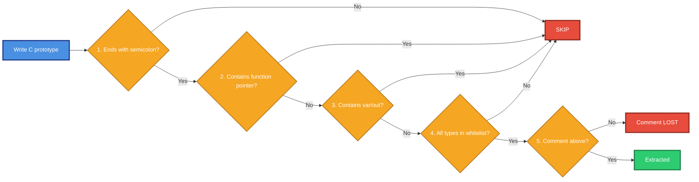

### 五条铁律

| # | 铁律 | 违反后果 |
|:-:|------|----------|
| 1 | **形式**：顶层函数原型，以 `;` 结尾 | 整条跳过 |
| 2 | **位置**：不在 `{ ... }` 函数体内、不在类型定义中 | 整条跳过 |
| 3 | **参数**：不含函数指针（`(*name)(...)`） | 整条跳过 |
| 4 | **类型**：必须命中 C 白名单 **且映射后的 Pascal 类型也必须命中 Pascal 白名单** | 整条跳过 |
| 5 | **注释**：紧邻上方（允许空行） | 注释丢失，函数保留 |

> **一条铁律违反 = 整条声明跳过**，不做局部忽略。

### 一句话概括"最容易踩的坑"

```
✅ int add(int a, int b);                    PASS
❌ void * p = malloc(...);                   SKIP (指针)
❌ void fill(int buf[], int len);            SKIP (数组，Model 层拒绝)
❌ _Bool is_even(int x);                     SKIP (布尔)
❌ void set_cb(void (*cb)(int));             SKIP (函数指针)
❌ int printf_like(const char *f, ...);      SKIP (变参)
❌ double dist(struct Point a, struct Point b); SKIP (结构体)
❌ int f() { return 1; }                     SKIP (函数定义)
```

---

## 1. 声明位置规则

### 1.1 C 头文件的解剖图

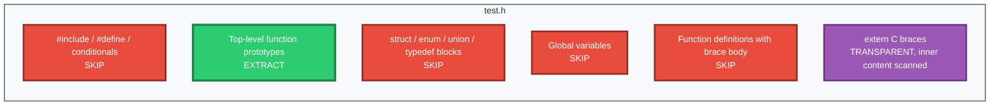

### 1.2 会提取 vs 不会提取

| 位置 | 结果 | 示例 |
|------|:----:|------|
| 顶层函数原型 | ✅ 提取 | `int add(int a, int b);` |
| `extern "C" { ... }` 内部原型 | ✅ 提取（透明块） | `extern "C" { int foo(void); }` |
| 预处理指令 | ❌ 跳过 | `#include <stdio.h>` |
| `struct` / `enum` / `union` / `typedef` 块 | ❌ 跳过 | `struct Point { int x; };` |
| 全局变量声明 | ❌ 跳过 | `int global_var;` |
| 带初始化的变量 | ❌ 跳过 | `int x = 42;` |
| 函数定义（带 `{ ... }`） | ❌ 跳过 | `int f() { return 1; }` |
| 含函数指针参数的原型 | ❌ 跳过 | `void set_cb(void (*cb)(int));` |

### 1.3 位置示例（一图看清）

```c
/* test.h - position example */
#ifndef TEST_H
#define TEST_H

#include <stdio.h>              /* SKIP: preprocessor */
#define MAX_SIZE 1024           /* SKIP: preprocessor */

/* ✅ EXTRACT: top-level function prototype */
int add(int a, int b);

/* ❌ SKIP: function definition with body */
int sub(int a, int b) {
    return a - b;
}

/* ❌ SKIP: struct definition */
struct Point {
    int x;
    int y;
};

/* ❌ SKIP: global variable */
int global_counter;

/* ❌ SKIP: initialized variable */
int initialized = 42;

/* ✅ EXTRACT: prototype inside extern "C" block */
extern "C" {
    int mul(int a, int b);
}

#endif /* TEST_H */
```

### 1.4 关键点总结

| 要点 | 说明 |
|------|------|
| **只提取顶层原型** | 其他一切（定义、类型、变量、宏）都跳过 |
| **`extern "C"` 是透明块** | 内部内容按顶层处理，无需特殊写法 |
| **函数定义 ≠ 函数声明** | 只要带 `{ ... }` 函数体，就跳过 |
| **预处理指令整行跳过** | 即使 `#define SQUARE(x) ...` 像函数，也跳过 |

---

## 2. 参数修饰符规则

### 2.1 修饰符判定图

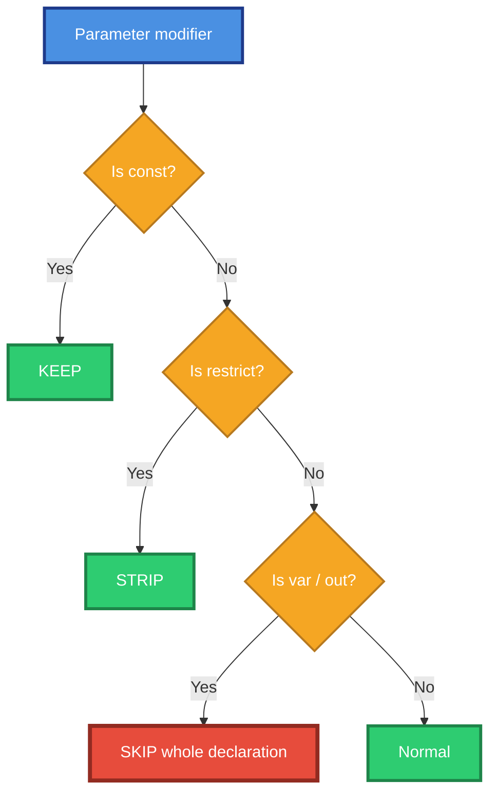

### 2.2 修饰符白名单

| 修饰符 | 是否允许 | 处理方式 |
|--------|:--------:|----------|
| 无修饰符 | ✅ 允许 | 默认值传递 |
| `const` | ✅ 允许 | **保留**，前置到类型前 |
| `restrict` / `__restrict` / `__restrict__` | ✅ 允许 | **静默剥离**，仅保留基类型 |
| `volatile` | ✅ 允许 | 参数中保留在类型文本里；返回类型中被过滤 |
| `var`（Pascal 专属） | ❌ 禁止 | **整条声明跳过** |
| `out`（Pascal 专属） | ❌ 禁止 | **整条声明跳过** |

### 2.3 `const` 三种位置都可识别

C 允许 `const` 出现在类型的**前缀或后缀**——三种形式都会被识别为 `const` 修饰符。

```c
/* ✅ Prefix form */
int foo(const char * s);

/* ✅ Suffix form (equivalent) */
int foo(char const * s);

/* ✅ Pointer-post form */
int bar(int * const p);
```

三种形式在 `param_mod` 中都标记为 `const`。

### 2.4 `restrict` 会被静默剥离

```c
/* Input */
int memcpy_opt(void * restrict dst, const void * restrict src, size_t n);

/* After stripping */
/* dst: void *   src: const void *   n: UInt64 */
```

**为什么剥离**：`restrict` 是优化提示，不改变原型语义；直接透传会污染类型字符串，导致下游映射失败。

> ⚠️ **注意**：`void *` → `Pointer` 后在 Pascal 侧**仍会被拒绝**（见 §3.3）。

### 2.5 为什么禁止 `var` / `out`

`var` / `out` 是 Pascal 的引用传递语法，**C 中不存在**。工具链在 C 模式下会防御性检查声明中是否含这类修饰符，若存在则跳过整条声明。

```c
/* ❌ 防御性跳过：即使 C 语法上不合法 */
int foo(var int x);
int bar(out int y);
```

### 2.6 修饰符示例速查

| 写法 | 结果 |
|------|:----:|
| `int f(int x)` | ✅ PASS |
| `int f(const int x)` | ✅ PASS（`const` 保留） |
| `int f(int * restrict p)` | ✅ PASS（`restrict` 剥离，但指针仍会被 Model 层拒绝） |
| `int f(const char * s)` | ✅ PASS（字符串指针 + const） |
| `int f(char const * s)` | ✅ PASS |
| `int f(int * const p)` | ✅ PASS（指针后置 const） |
| `int f(volatile int x)` | ✅ PASS |

---

## 3. 类型白名单

### 3.1 类型分类图

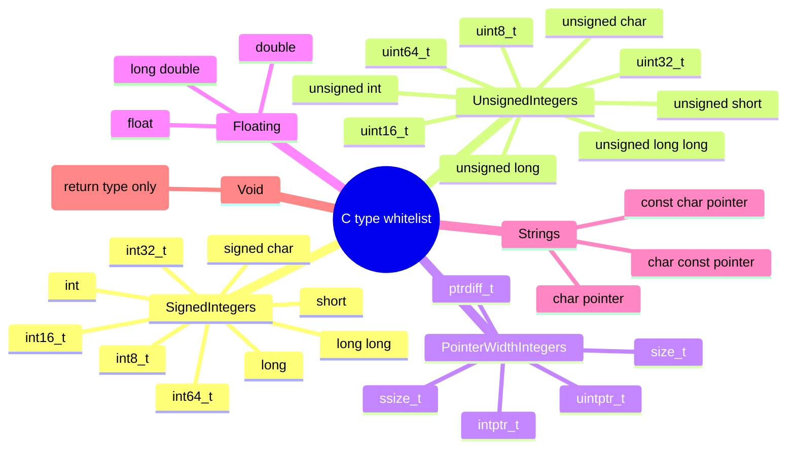

### 3.2 C 到 Pascal 精确映射表

| C 类型 | Pascal 归一化（tnf_Json） | Pascal 归一化（tnf_ABI） | JSON Schema | 跨层状态 |
|--------|:-------------------------:|:------------------------:|:-----------:|:--------:|
| `signed char` / `int8_t` | `int64` | `shortint` | `integer` | ✅ OK |
| `short` / `int16_t` | `int64` | `smallint` | `integer` | ✅ OK |
| `int` / `int32_t` | `int64` | `integer` | `integer` | ✅ OK |
| `long` | `int64` | `longint` | `integer` | ✅ OK |
| `long long` / `int64_t` | `int64` | `int64` | `integer` | ✅ OK |
| `unsigned char` / `uint8_t` | `int64` | `byte` | `integer` | ✅ OK |
| `unsigned short` / `uint16_t` | `int64` | `word` | `integer` | ✅ OK |
| `unsigned int` / `uint32_t` | `int64` | `cardinal` | `integer` | ✅ OK |
| `unsigned long` | `int64` | `longword` | `integer` | ✅ OK |
| `unsigned long long` / `uint64_t` | `int64` | `uint64` | `integer` | ✅ OK |
| `size_t` / `uintptr_t` | `int64` | `uint64` | `integer` | ✅ OK |
| `ssize_t` / `ptrdiff_t` / `intptr_t` | `int64` | `int64` | `integer` | ✅ OK |
| `float` | `double` | `single` | `number` | ✅ OK |
| `double` | `double` | `double` | `number` | ✅ OK |
| `long double` | `double` | `extended` | `number` | ✅ OK |
| `char *` / `const char *` / `char const *` | `string` | `string` | `string` | ✅ OK |
| **任意其他 `T *`（含 `void *`）** | **映射为 `Pointer`** | **映射为 `Pointer`** | — | ❌ **REJECTED** |
| `void`（返回值） | 降级为 procedure | 降级为 procedure | — | ✅ OK |

> 🔴 **v3.0 关键补充**：任意指针（`void *`、`int *`、`const void *` 等）在 C→Pascal 转换阶段映射为 `Pointer`，**但 `Pointer` 不在 Pascal 白名单**。因此**含指针参数的声明最终会被 `Z.Pascal_Func_Model` 静默跳过**。

### 3.3 明确禁止的类型（红黑名单）

```mermaid
flowchart TB
    BAN["Banned types"]
    BAN --> T1["Custom structs<br/>struct Point, Point"]
    BAN --> T2["Unions<br/>union Value"]
    BAN --> T3["Enums<br/>enum Color, Color"]
    BAN --> T4["Booleans<br/>bool, _Bool"]
    BAN --> T5["Wide chars<br/>wchar_t, char16_t, char32_t"]
    BAN --> T6["Custom typedefs<br/>any unmapped alias"]
    BAN --> T7["Variadic<br/>..."]
    BAN --> T8["Function pointer params<br/>void (*cb)(int)"]
    BAN --> T9["Any pointer<br/>void * / int * / const void *"]

    style BAN fill:#E74C3C,stroke:#922B21,stroke-width:5px,color:#FFFFFF
    style T1 fill:#922B21,stroke:#641E16,stroke-width:2px,color:#FFFFFF
    style T2 fill:#922B21,stroke:#641E16,stroke-width:2px,color:#FFFFFF
    style T3 fill:#922B21,stroke:#641E16,stroke-width:2px,color:#FFFFFF
    style T4 fill:#922B21,stroke:#641E16,stroke-width:2px,color:#FFFFFF
    style T5 fill:#922B21,stroke:#641E16,stroke-width:2px,color:#FFFFFF
    style T6 fill:#922B21,stroke:#641E16,stroke-width:2px,color:#FFFFFF
    style T7 fill:#922B21,stroke:#641E16,stroke-width:2px,color:#FFFFFF
    style T8 fill:#922B21,stroke:#641E16,stroke-width:2px,color:#FFFFFF
    style T9 fill:#922B21,stroke:#641E16,stroke-width:4px,color:#FFFFFF
```

### 3.4 🔴 `void *` 为什么会被跳过？

**"C 侧接受 ≠ Pascal 侧接受"**。`void *` 参数会走三阶段处理：

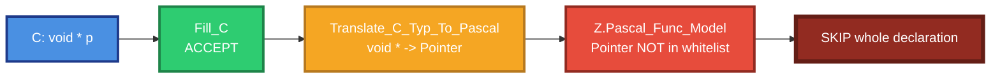

**具体表现**：

```c
/* 这样写：C 侧能接受，但最终被 Model 层拒绝 */
void * allocate(int size);
void int_ptr_param(int * p);
void restrict_param(void * restrict p);
```

**Report 里显示**：

```
Skipped: "allocate" - Reason: Parameter "p" has unsupported type "Pointer"
```

**正确做法**：用 `uint64_t` 承载指针地址值。

```c
/* ✅ 正确：用 uint64_t 承载地址 */
uint64_t allocate(int size);
void int_ptr_param(uint64_t p);
```

### 3.5 边界示例：PASS vs SKIP

**✅ PASS 示例**：

```c
int add(int a, int b);
unsigned int get_unsigned(void);
long long get_longlong(void);
float get_float(void);
double get_double(void);
const char * get_error_message(int code);
size_t get_size(void);
uint64_t get_address(void);
```

**❌ SKIP 示例**：

```c
_Bool is_even(int x);                       /* 布尔 */
double distance(struct Point p1, struct Point p2);  /* 结构体 */
int set_color(enum Color c);                /* 枚举 */
int print_wide(wchar_t *s);                 /* 宽字符 */
void set_callback(void (*cb)(int));         /* 函数指针 */
int printf_like(const char *fmt, ...);      /* 变参 */
void set_value(union Value v);              /* union */
void * void_ptr_return(int size);           /* 指针 */
void restrict_param(void * p);              /* 指针 */
void int_ptr_param(int * p);                /* 指针 */
```

### 3.6 返回类型的两阶段归一化

**C 返回类型也会被进一步归一化**，用户看到的是归一化后的结果。

| 阶段 | 位置 | 输入 | 输出 |
|:----:|------|------|------|
| 阶段 1 | `Translate_C_Typ_To_Pascal` | C 类型（如 `unsigned int`） | Pascal 类型（如 `Cardinal`） |
| 阶段 2 | `Z.Pascal_Func_Model.Do_Normalize_Type` | Pascal 类型 | 归一化类型（`int64` / `double` / `string`） |

**示例**：

```c
unsigned int get_unsigned(void);
```

| 阶段 | 结果 |
|:----:|------|
| Fill_C | `ResultDecl = "unsigned int"` |
| Translate_C_Typ_To_Pascal | `ResultDecl = "Cardinal"` |
| LoadFromParser（tnf_Json） | `ReturnType = "int64"` |
| LoadFromParser（tnf_ABI） | `ReturnType = "cardinal"` |

**对使用者的影响**：

- **JSON 里看不到原始 C 类型**——只能看到归一化后的 `int64` / `double` / `string`。
- **若需原始类型**，只能从 `Comment` 纯文本或原始 C 源码读取。
- **工具链的设计前提**：调用方不需要区分 `unsigned int` 和 `int`，都用 64 位整数传。

---

## 4. 数组后缀规则

### 4.1 数组后缀识别

```c
/* Input */
void fill_buffer(int buf[], int len);

/* Split result */
/* param_name  = buf          */
/* param_typ   = int          */
/* param_array = []           */
```

### 4.2 支持的数组后缀形式

| 输入 | `param_array` | 说明 |
|------|:-------------:|------|
| `int buf[]` | `[]` | 不定长数组 |
| `int buf[10]` | `[10]` | 定长数组 |
| `int buf[N]` | `[N]` | 符号常量长度 |
| `int buf` | `''` | 无后缀（普通参数） |

### 4.3 🔴 数组参数只适合 `decl_to_c`，不适合 JSON

数组参数**只在 `Fill_C` 和 `decl_to_c` 阶段有效**。到了 `Z.Pascal_Func_Model` 阶段，`array of Integer` **不在白名单**，整条声明被跳过。

```c
void fill_buffer(int buf[], int len);
```

| 阶段 | 结果 |
|:----:|:----:|
| C 侧（Fill_C） | ✅ 提取 |
| Pascal 侧（Translate） | ✅ 提取（`array of Integer`） |
| JSON 侧（Model） | ❌ **跳过** |

**正确做法**：
- 若只需要 C 输出（`decl_to_c`），数组可以保留。
- 若需要 JSON 输出（MCP 工具），把数组拆成多个值参数，或用 JSON 字符串承载。

### 4.4 多维数组：不支持

**`int arr[][]` 会被跳过。**

**根本原因**：`ExtractArraySuffix` 只处理**单层** `[...]` 后缀。遇到 `int arr[][]` 时：

1. 段尾向前扫描，遇到第一个 `]`。
2. 向前找到匹配的 `[`。
3. **继续向前扫描，又遇到一个 `]`**。
4. `ParseParamSegment` 的「从后向前找参数名」逻辑遇到**两个数组后缀**，无法确定参数名位置。
5. 最终判定为非法段，整条声明跳过。

**替代方案**：用 `int * arr`（但指针最终也会被拒）或 `int arr[N]` 单层数组。

### 4.5 数组示例

```c
/* ✅ PASS（只在 C 侧） */
void fill_buffer(int buf[], int len);

/* ✅ PASS（只在 C 侧） */
void copy_10(int dst[10], int src[10]);

/* ❌ SKIP：多维数组 */
void matrix(int m[10][20]);

/* ❌ SKIP：二维不定长数组 */
void matrix2(int m[][]);
```

---

## 5. 注释绑定规则

### 5.1 绑定规则图

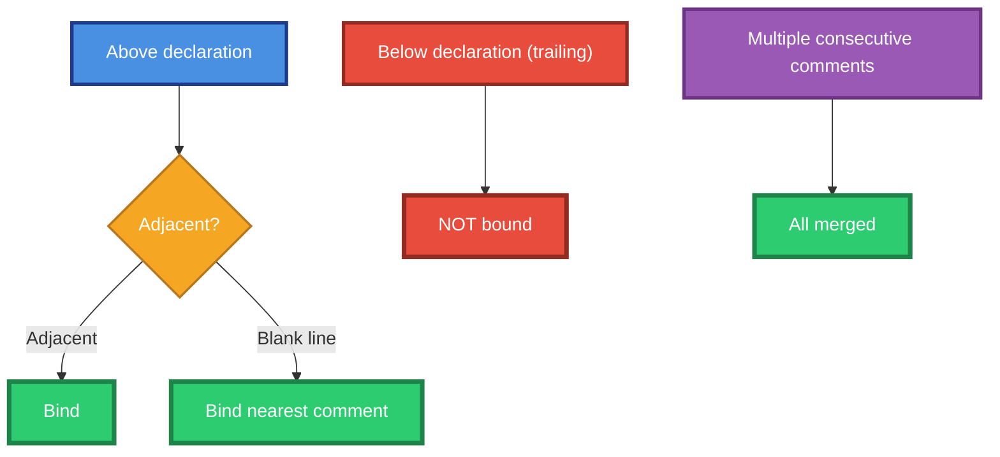

### 5.2 绑定规则表

| 情形 | 是否绑定 | 说明 |
|------|:--------:|------|
| `/* ... */` 紧邻声明上方 | ✅ | 标准写法 |
| `//` 单行注释紧邻上方 | ✅ | 单行风格 |
| Doxygen `/** ... */` 上方 | ✅ | 剥离 `*` 前缀 |
| 多行注释到声明 | ✅ | 自动规范化 |
| 注释 1 到注释 2 到声明 | ✅ | 全部绑定，按顺序拼接 |
| 声明到尾随注释 | ❌ | 尾随注释被忽略 |
| 无注释 | ✅ | `Comment` 为空，函数保留 |

### 5.3 三种注释风格示例

**示例 A：单行 `//` 注释**

```c
// Computes the sum of two integers.
int add(int a, int b);
```

**示例 B：块 `/* */` 注释**

```c
/* Computes the sum of two integers. */
int add(int a, int b);
```

**示例 C：Doxygen `/** */` 注释（推荐）**

```c
/**
 * Computes the sum of two integers.
 * @param a first addend
 * @param b second addend
 * @return the sum
 */
int add(int a, int b);
```

三种风格都会绑定，效果相同。

### 5.4 🔴 空行允许，但会"截断"多段注释

**空行本身不会断开注释绑定**，工具链会跳过空行找最近的一段注释。

```c
/* This is the comment. */

int add(int a, int b);
```

`Comment = "This is the comment."`（空行被跳过）。

**但若两段注释之间有空行，只有最近的被绑定**：

```c
/* First comment. */

/* Second comment. */

int add(int a, int b);
```

`Comment = "Second comment."`（`First comment.` 被忽略）。

### 5.5 尾随注释被忽略

```c
/* ❌ 尾随注释不会被绑定 */
int add(int a, int b);  // This comment is IGNORED
```

`Comment` 为空。**必须把注释放在声明上方。**

### 5.6 多行注释自动规范化

```c
/* Input */
/* This is a comment
   that spans multiple
   lines */
int foo(void);
```

**元数据中的 Comment**（Pascal 风格，每行第二行起带 ` * ` 前缀）：

```
{ This is a comment
 * that spans multiple
 * lines }
```

**用户视角**：无需关心 ` * ` 前缀——`Z.Pascal_Func_Model` 会在下游**自动剥离**。

### 5.7 Doxygen `@param` / `@return` 的行为

**`@param` / `@return` 行在 tool description 中被跳过**，只用于参数描述提取。

```c
/**
 * Computes the sum of two integers.
 * @param a first addend
 * @param b second addend
 * @return the sum
 * Return value: an Integer representing the sum.
 */
int add(int a, int b);
```

| 内容 | 去向 |
|------|------|
| `Computes the sum of two integers.` | tool description |
| `@param a first addend` | `Params[0].Description = "first addend"` |
| `@param b second addend` | `Params[1].Description = "second addend"` |
| `@return the sum` | **被跳过**（不进 tool description） |
| `Return value: ...` | tool description |

**生成的 tool description**：

```
Computes the sum of two integers. Return value: an Integer representing the sum.
```

### 5.8 只写 `@param` 无自由文本 = 空 description

```c
/**
 * @param code error code
 * @return error description
 */
const char * get_error_message(int code);
```

| 字段 | 值 |
|------|-----|
| `Params[0].Description` | `"error code"` |
| tool description | **空字符串**（只有 `@` 行，全被跳过） |

**正确做法**：加一句自由文本。

```c
/**
 * Gets an error message.
 * @param code error code
 * @return error description
 */
const char * get_error_message(int code);
```

tool description = `"Gets an error message."`

### 5.9 注释跨层传递完整生命周期

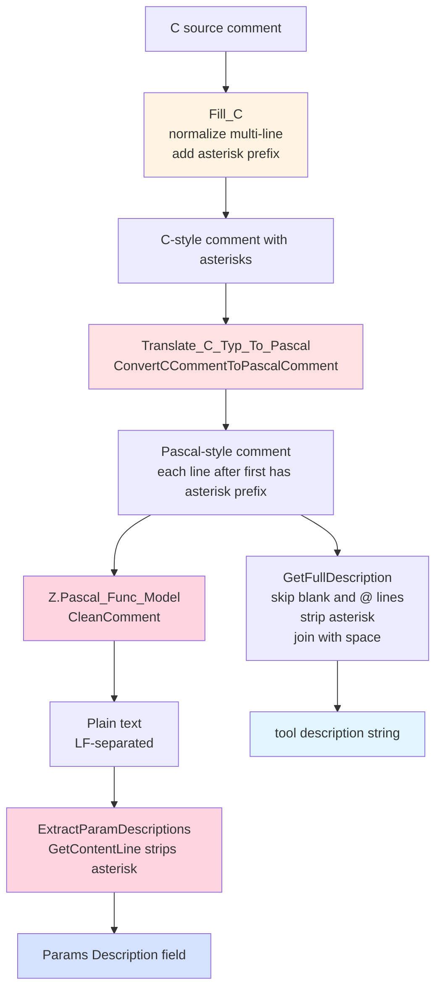

**关键阶段**：

| 阶段 | 处理 | 输出形态 |
|:----:|------|---------|
| `Fill_C` | 提取 C 注释 + 多行规范化 | C 风格，每行第二行起带 ` * ` |
| `Translate_C_Typ_To_Pascal` | C 风格转 Pascal 风格 | Pascal 风格 `{ ... }`，每行第二行起带 ` * ` |
| `CleanComment` | 剥离注释标记 + 统一 LF | 纯文本，**保留 ` * ` 前缀**（属于内容的一部分） |
| `ExtractParamDescriptions.GetContentLine` | **剥离行首 ` * ` 前缀** | 用于识别的行 |
| `GetFullDescription` | 跳过空行和 `@` 开头行，去 `*` 前缀，空格拼接 | tool description 单行字符串 |

### 5.10 tool description 拼接行为

**`GetFullDescription(Comment)` 的处理步骤**：

| 步骤 | 行为 |
|------|------|
| 1 | 按 `#10` / `#13` 拆分为行 |
| 2 | 跳过**空行** |
| 3 | 跳过**以 `@` 开头的行**（Doxygen 标签行） |
| 4 | 去掉行首的 `*` 和 `**`（块注释延续标记） |
| 5 | 剩下的行**用空格连接为一行** |
| 6 | 最多保留 200 字符 |

---

## 6. Unit Name 智能提取

### 6.1 提取策略（优先级）

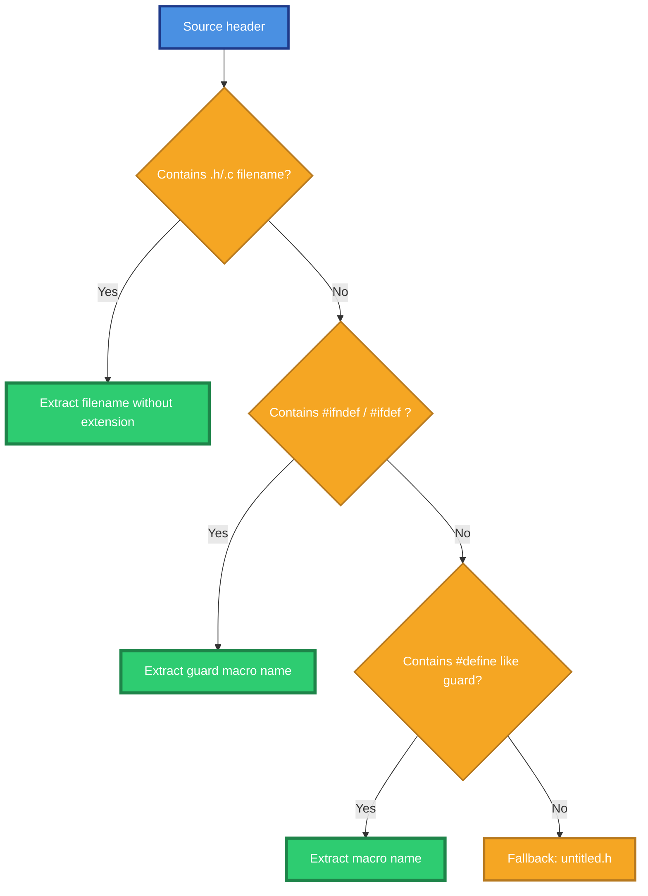

### 6.2 提取效果对照

| 输入头部 | 输出 unit name | 结果 |
|----------|----------------|:----:|
| `/* foo.h ... */` | `foo` | ✅ |
| `// bar.c` | `bar` | ✅ |
| `#ifndef FOO_H` | `FOO` | ✅ |
| `#ifndef __FOO_H__` | `FOO` | ✅ |
| `#ifndef FOO_HPP` | `FOO` | ✅ |
| `#ifndef FOO_INCLUDED` | `FOO` | ✅ |
| `#define MAX_SIZE 1024` | `untitled.h`（不是 guard） | Fallback |
| `/* 1.0.3.h */` | `untitled.h`（非法标识符） | Fallback |
| 空文本 | `untitled.h` | Fallback |

### 6.3 Guard 后缀剥离

支持的 guard 后缀（最长优先）：

- `_INCLUDED`
- `_HXX` / `_HPP`
- `_H__` / `_H_` / `_H`

同时剥离前后下划线。

| 输入 | 输出 |
|------|------|
| `FOO_INCLUDED` | `FOO` |
| `__FOO_H__` | `FOO` |
| `FOO_HPP` | `FOO` |
| `MY_MODULE_H` | `MY_MODULE` |

### 6.4 关键点

- **头文件名优先**：只要在头部出现 `.h` 或 `.c` 文件名，就优先用它。
- **`1.0.3.h` 是反例**：数字开头的名字会被判定为非法标识符，回退到 guard。
- **规范命名很重要**：用 `foo.h` 而不是 `1.0.3.h`。

---

## 7. 完整示例

### 7.1 正面示例（全部通过）

```c
/* sample.h - positive example */
#ifndef SAMPLE_H
#define SAMPLE_H

#include <stddef.h>

/* Computes the sum of two integers. */
int add(int a, int b);

/*
 * Unsigned integer example.
 */
unsigned int get_unsigned(void);

/* 64-bit signed integer. */
long long get_longlong(void);

/* Single precision float. */
float get_float(void);

/* Double precision float. */
double get_double(void);

/**
 * Gets an error message.
 * @param code error code
 * @return error description string
 */
const char * get_error_message(int code);

/* Array parameter example. */
void fill_buffer(int buf[], int len);

#endif /* SAMPLE_H */
```

**解析结果**：

| 声明 | C 侧 | Pascal 侧 | JSON 侧 |
|------|:----:|:---------:|:-------:|
| `int add(int a, int b)` | ✅ | ✅ | ✅（`ReturnType="int64"`） |
| `unsigned int get_unsigned(void)` | ✅ | ✅ | ✅（`ReturnType="int64"`） |
| `long long get_longlong(void)` | ✅ | ✅ | ✅（`ReturnType="int64"`） |
| `float get_float(void)` | ✅ | ✅ | ✅（`ReturnType="double"`） |
| `double get_double(void)` | ✅ | ✅ | ✅（`ReturnType="double"`） |
| `const char * get_error_message(int code)` | ✅ | ✅ | ✅（`ReturnType="string"`，`ResultMod="const"`） |
| `void fill_buffer(int buf[], int len)` | ✅ | ✅ | ❌ **跳过**（`buf` 类型 `array of Integer` 不在 Pascal 白名单） |

> 🔴 **关键提醒**：**C 侧提取 ≠ Pascal 侧提取 ≠ JSON 侧提取**。数组参数在 C 侧被接受，但在 JSON 侧被拒绝。

### 7.2 反面示例（全部跳过）

```c
/* bad.h - negative example */

/* ❌ SKIP: function definition with body */
int internal_helper(void) {
    return 42;
}

/* ❌ SKIP: boolean return */
_Bool is_even(int x);

/* ❌ SKIP: struct parameter */
double distance(struct Point p1, struct Point p2);

/* ❌ SKIP: enum parameter */
int set_color(enum Color c);

/* ❌ SKIP: wide char */
int print_wide(wchar_t *s);

/* ❌ SKIP: function pointer parameter */
void set_callback(void (*cb)(int));

/* ❌ SKIP: variadic */
int printf_like(const char *fmt, ...);

/* ❌ SKIP: union parameter */
void set_value(union Value v);

/* ❌ SKIP: pointer parameter */
void * void_ptr_return(int size);
void restrict_param(void * p);

/* ❌ SKIP: global variable */
int global_counter;

/* ❌ SKIP: initialized variable */
int initialized = 42;

/* ❌ SKIP: struct definition */
struct Foo {
    int x;
    int y;
};
```

**解析结果**：全部跳过，Report 中显示每条跳过原因。

---

## 8. 常见错误对照表

| 错误写法 | 后果 | 正确写法 |
|----------|:----:|----------|
| `int f() { ... }` | ❌ 整条跳过（函数定义） | `int f(void);` 声明 |
| `int f(int a, ...)` | ❌ 整条跳过（变参） | 使用固定参数 |
| `void set_cb(void (*cb)(int))` | ❌ 整条跳过（函数指针） | 改用整型句柄 |
| `int f(struct Point p)` | ❌ 整条跳过（结构体） | 拆成 `int x, int y` |
| `int f(enum Color c)` | ❌ 整条跳过（枚举） | 用 `int` 传枚举值 |
| `_Bool f(int x)` | ❌ 整条跳过（布尔） | 用 `int` 返回 0/1 |
| `int f(wchar_t *s)` | ❌ 整条跳过（宽字符） | 用 `char *` |
| **`void * f(int x)`** | ❌ **整条跳过（指针）** | **用 `uint64_t` 承载地址值** |
| **`int f(int * p)`** | ❌ **整条跳过（指针）** | **用 `int` 数组或拆成值参数** |
| `int global_var;` | ❌ 整条跳过（变量） | 移到函数内 |
| `int x = 42;` | ❌ 整条跳过（初始化） | 移到函数内 |
| 声明在 `{ ... }` 内 | ❌ 整条跳过 | 移到顶层 |
| **`int arr[][]`** | ❌ **整条跳过（多维数组）** | **改为 `int arr[N]` 单层数组** |
| 注释与声明之间夹了另一条声明 | ❌ 注释不绑定 | 注释紧邻声明 |
| 尾随注释 `int f(); // 说明` | ❌ 注释被忽略 | 改为前置注释 |
| 头文件里的 `1.0.3.h` | ⚠️ unit name 落到 `untitled.h` | 用规范的 `foo.h` 或 guard |
| **依赖 `@return` 描述作为返回值信息** | ⚠️ **不进 JSON** | **描述只留在 `Comment` 里** |
| **`void` 函数写 `@return`** | ⚠️ **被完全忽略** | **`void` 函数不写 `@return`** |

---

## 9. 自检清单（写完原型后逐项核对）

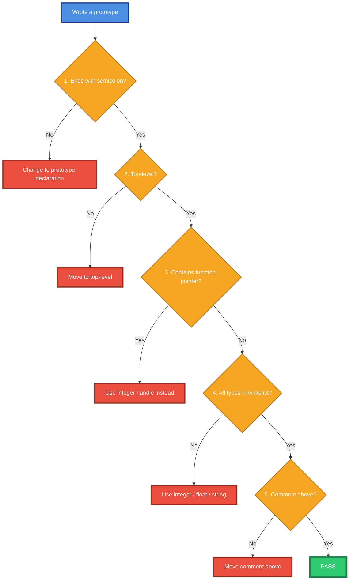

**五项检查**：

| 序号 | 检查项 | 不通过的动作 |
|:----:|--------|--------------|
| 1 | 以 `;` 结尾（原型不是定义）？ | 去掉 `{ ... }` 函数体 |
| 2 | 在顶层（不在函数体/类型定义中）？ | 移到顶层 |
| 3 | 参数不含函数指针？ | 改用整型句柄 |
| 4 | 所有类型在白名单？ | 改用整数/浮点/字符串（**不含指针**） |
| 5 | 注释紧邻上方？ | 移动注释（可留空行） |

---

## 10. 最小可解析模板

### 10.1 复制以下模板，替换占位符即可

```c
/* <filename>.h */
#ifndef <GUARD>
#define <GUARD>

/**
 * <natural language description of the function>.
 * @param <param1> <description of param1>
 * @param <param2> <description of param2>
 * @return <description of return value>
 */
<return type> <function name>(<param1 type> <param1 name>, <param2 type> <param2 name>);

#endif /* <GUARD> */
```

### 10.2 填空规则

| 占位符 | 可选值 |
|--------|--------|
| `<GUARD>` | 形如 `FOO_H` / `FOO_HPP` / `FOO_INCLUDED` |
| `<function name>` | 合法 C 标识符（非保留字） |
| `<paramN name>` | 合法 C 标识符（非保留字） |
| `<paramN type>` | 见 §3 白名单（**不含指针**） |
| `<return type>` | 见 §3 白名单（`void` 允许） |

### 10.3 为什么固定用 Doxygen `/** */`

1. **与 Pascal 规范 v8.0 推荐一致**——两者都使用「每行第二行起带 ` * ` 前缀」的形式。
2. **Model 层已自动剥离** ` * ` 前缀——无需担心。
3. **Doxygen 是 C 生态标准**——与其他工具兼容。

### 10.4 三条注意事项

- **返回类型必须写在签名里**（`<return type> <function name>`），注释里的 `@return` 只是给人 / LLM 看的。
- **参数名不能缺失**（C 允许无名参数，但 Pascal 侧会跳过无名参数）。
- **不要用指针**——即使 `char *` 也只对字符串有效，其他指针一律被拒。

---

## 11. 模拟人类阅读失误场景

本节列出**读者容易误读**的场景，逐一解释实际行为。

### 11.1 误读场景 A：以为 `void *` 会被 C 侧接受就一定能通过

**误读**：看到 §3.2 的映射表里有 `void *` → `Pointer`，以为含 `void *` 参数的声明能被完整处理。

**实际**：**三阶段处理**——C 侧接受、Pascal 侧映射为 `Pointer`、Model 层检查 `Pointer` 不在白名单后**跳过整条声明**。

**如果你这样写**：

```c
void * allocate(int size);
```

**实际结果**：

```
Skipped: "allocate" - Reason: Parameter "p" has unsupported type "Pointer"
```

**正确做法**：用 `uint64_t` 承载指针地址：

```c
uint64_t allocate(int size);
```

### 11.2 误读场景 B：以为数组参数能通过整个工具链

**误读**：看到 §4 专门讲数组后缀，以为数组参数是**一等公民**。

**实际**：数组参数**只在 `Fill_C` 和 `decl_to_c` 阶段有效**。到了 `Z.Pascal_Func_Model` 阶段，`array of Integer` **不在白名单**，整条声明被跳过。

**如果你这样写**：

```c
void fill_buffer(int buf[], int len);
```

**实际结果**：

- C 侧：提取成功。
- Pascal 侧：提取成功。
- **JSON 侧**：跳过。

**正确做法**：
- 若只需要 C 输出，数组可以保留。
- 若需要 JSON 输出，把数组拆成多个值参数，或用 JSON 字符串承载。

### 11.3 误读场景 C：以为 `@param` 会进 tool description

**误读**：看到 §5.7 的 Doxygen 示例，以为 `@param` 行会被提取到 tool description。

**实际**：**`@param` / `@return` 行在 `GetFullDescription` 中被跳过**。它们只用于**参数描述提取**（`Params[i].Description`），**不进 tool description**。

**如果你这样写**：

```c
/**
 * @param code error code
 * @return error description
 */
const char * get_error_message(int code);
```

**实际结果**：

- `Params[0].Description = "error code"`。
- tool description = `""`（空）。

**正确做法**：加一句自由文本描述：

```c
/**
 * Gets an error message.
 * @param code error code
 * @return error description
 */
const char * get_error_message(int code);
```

tool description = `"Gets an error message."`

### 11.4 误读场景 D：以为 `* ` 前缀会污染参数描述

**误读**：看到 §5.6 的多行注释规范化，每行第二行起带 ` * ` 前缀，以为**参数描述会被污染**。

**实际**：`Z.Pascal_Func_Model` 会自动剥离 ` * ` 前缀。**参数描述干净**。

**如果你这样写**：

```c
/**
 * Function purpose.
 * @param a first addend
 * @param b second addend
 */
int add(int a, int b);
```

**实际结果**：

- `a` 的描述 = `"first addend"`（无 ` * ` 前缀）。
- `b` 的描述 = `"second addend"`（无 ` * ` 前缀）。

### 11.5 误读场景 E：以为返回类型可以省略

**误读**：看到「`ReturnType` 归一化为 `int64`」，以为**可以省略返回类型**让工具链推断。

**实际**：**C 原型必须显式声明返回类型**。C 语法中返回类型可省略（隐含 `int`），但 `Fill_C` 会把无返回类型的原型判定为**非函数**，跳过整条声明。

**如果你这样写**：

```c
add(int a, int b);
```

**实际结果**：`Fill_C` 无法识别为函数原型（缺少返回类型），跳过。

**正确做法**：显式写返回类型：

```c
int add(int a, int b);
```

### 11.6 误读场景 F：以为 `const` 修饰符会阻止提取

**误读**：看到 §2.2 的「`const` 保留」，但不确定是否是强约束。

**实际**：`const` **完全允许**，且**三种位置**（前缀、后缀、指针后置）都被识别为 `const` 修饰符。

**如果你这样写**：

```c
int f(const char * s);
int f(char const * s);
int f(int * const p);
```

**实际结果**：三种写法都会在 `param_mod` 中标记为 `const`，参数名和类型正常提取。

### 11.7 误读场景 G：以为 `extern "C"` 需要特别处理

**误读**：看到 §1.2 的「`extern "C" { ... }` 内部原型提取」，以为需要特别的语法。

**实际**：`extern "C" { ... }` 是**透明块**——内部的函数原型**按普通顶层函数处理**。用户无需做任何特殊处理。

**如果你这样写**：

```c
extern "C" {
    int add(int a, int b);
    int sub(int a, int b);
}
```

**实际结果**：`add` 和 `sub` 都被正常提取。

### 11.8 误读场景 H：以为前置空行会断开注释

**误读**：看到 §5.1 的「空行 → 绑定最近的注释」，以为**注释和声明之间不能有空行**。

**实际**：空行**允许存在**。工具链从声明向前扫描，**跳过空行**，找到第一段非空注释作为 `Comment`。

**如果你这样写**：

```c
/* This is the comment. */

int add(int a, int b);
```

**实际结果**：`Comment = "This is the comment."`（空行被跳过）。

**但要注意**：如果空行上方有**另一段**注释，两段注释**不会合并**（只有离声明最近的会被绑定）：

```c
/* First comment. */

/* Second comment. */

int add(int a, int b);
```

**实际结果**：`Comment = "Second comment."`。

### 11.9 误读场景 I：以为 `#define` 会被当作函数

**误读**：看到 §3.3 禁止预处理指令，但不确定 `#define` 具体行为。

**实际**：`#define` **完全被跳过**——不会被视为函数，也不会被视为参数。

**如果你这样写**：

```c
#define MAX_SIZE 1024
#define SQUARE(x) ((x) * (x))
```

**实际结果**：全部跳过。**即使 `SQUARE(x)` 看起来像函数调用**，因为 `#define` 整行被识别为预处理指令。

### 11.10 误读场景 J：以为头文件名字不影响解析

**误读**：以为头文件名字**对解析结果无影响**。

**实际**：头文件名**影响 unit name 提取**（见 §6）。若头文件名不符合规范（如 `1.0.3.h`），unit name 会落到 `untitled.h`。

**如果你这样写**：

```c
/* 1.0.3.h */
#ifndef VERSION_H
#define VERSION_H
int get_version(void);
#endif
```

**实际结果**：

- unit name 从 `1.0.3.h` 提取失败（数字开头）。
- 从 guard `VERSION_H` 提取 → `VERSION`。

**推荐命名**：用规范的 `foo.h` 形式。

---

## 12. 与 Pascal 规范（v8.0）的联动

C 声明规范与 Pascal 声明规范在工具链中**共享同一份元数据结构**（`tfunc_decl`）和**同一个下游 Model 层**（`Z.Pascal_Func_Model`）。两份规范是**互补**的：

| 维度 | C 规范（本文档） | Pascal 规范 v8.0 |
|------|:----------------:|:----------------:|
| 输入 | `.h` 头文件 | `.pas` 源码 |
| 提取对象 | 顶层函数原型 | `interface` 段顶层函数/过程 |
| 注释风格 | `/* */` / `//` / `/** */` | `(* ... *)` / `//` / `{ ... }` |
| 注释前缀 | 每行第二行起 ` * ` | 同上（工具链产物） |
| 类型白名单 | C 类型 | Pascal 类型 |
| 跨层拒绝 | `void *` → `Pointer` → 被拒 | `Pointer` 直接被拒 |
| 数组参数 | 单层 `[]` 支持 | 不支持（Model 层） |
| 返回值描述 | `@return` 进 Comment | `返回值说明：` 进 Comment |

**互操作建议**：

- **只输出 C 代码**：用 C 规范；数组和指针参数**可用**（`decl_to_c` 支持）。
- **只输出 Pascal 代码**：用 Pascal 规范；数组和指针参数**不可用**。
- **输出 JSON（MCP 工具）**：C 和 Pascal 规范**同时适用**；避开指针和数组参数。

---

## 13. 设计原则

### 13.1 工具链的硬性假设

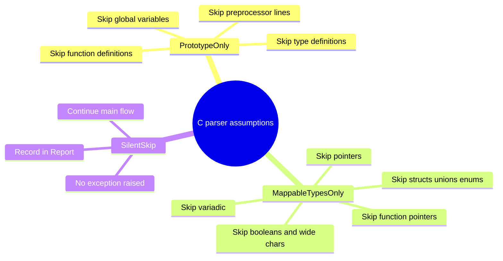

### 13.2 使用者的三条铁律


### 13.3 与 Pascal 侧的对称性

| 维度 | Pascal 侧 | C 侧 |
|------|-----------|------|
| 输入 | `.pas` 源码 | `.h` 头文件 |
| 提取对象 | `interface` 段顶层函数/过程 | 顶层函数原型 |
| 注释风格 | `(* ... *)` / `//` / `{ ... }` | `/* ... */` / `//` / `/** ... */` |
| 字符串 | 单引号 | 双引号 |
| 关键字检查 | `Pascal_Keyword` | `IsCReservedWord` |
| 返回值 const | 无 | `ResultMod` 字段 |
| 数组参数 | `array of X` | `param_array` 后缀 |
| 唯一化约束 | 无 | `restrict` 剥离 |
| **指针参数** | **禁止** | **禁止**（经映射后仍禁止） |

### 13.4 关键设计决策

| 决策 | 原因 |
|------|------|
| 元数据采用 Pascal 风格为规范态 | `decl_to_pascal` verbatim 输出，`decl_to_c` 反转换 |
| 注释统一归化为 Pascal `{ ... }` | 单一风格简化下游实现 |
| 类型按宽度+符号精确映射 | 实现 C 到 Pascal 到 C 的往返保真 |
| `restrict` 主动剥离 | 不损失语义，避免下游映射失败 |
| 数组后缀独立存储 | 基类型保持简单标识符，便于双向生成 |
| 函数指针参数整条跳过 | 无法表达为 JSON Schema 值类型 |
| 静默跳过而非抛异常 | 与 Pascal 侧保持一致的工具链行为 |
| **指针最终在 Model 层拒绝** | **安全序列化的前提是值类型** |

---

## 14. 修订历史

- **v3.0（2026-09-24）**：
  - **全文重写**：以示例驱动，突出重点。
  - **§0**：新增"一句话概括最容易踩的坑"清单（10 条 PASS/SKIP 示例）。
  - **§1**：位置示例更完整；新增"关键点总结"表。
  - **§2**：新增"修饰符示例速查"表（7 条）。
  - **§3**：将 `void *` 三阶段拒绝流程用独立 Mermaid 图表达；新增"边界示例 PASS vs SKIP"并排对照。
  - **§4**：新增"数组参数只适合 decl_to_c"红警告；新增数组示例集合。
  - **§5**：新增三种注释风格并列示例；新增空行截断多段注释示例；新增 `@param` 无自由文本的反例。
  - **§6**：新增 Guard 后缀剥离对照表。
  - **§7**：正面/反面示例标注 ✅/❌ 更醒目。
  - **§8**：常见错误对照表用 emoji 标注严重程度。
  - **§11**：保留 10 个误读场景，逐一给出 PASS/SKIP 代码。
  - **Mermaid**：所有 subgraph ID 英文、节点标签带引号、去 emoji 干扰。
  - **全角标点**替换为 ASCII 或英文。

- **v2.0（2026-09-20）**：初版。对齐 `Fill_C.inc` + `Translate_C_Typ_To_Pascal.inc` 的现行实现。

---

**本规范为解析契约。任何偏离本规范的声明将被工具链静默跳过，或注释被静默丢失，或参数描述被静默忽略。**

**遇到「Declaration 被跳过」，先查指针、数组、函数指针；遇到「Comment 为空」，先查注释与声明之间是否有其他声明；遇到「参数描述奇怪」，先查参数名是否在行首。**
