# Pascal 声明规范（Z.Pascal_Func_Tool 工具链兼容）

**版本**：9.0（示例增强重写版）
**最后更新**：2026-09-24
**约束对象**：`Z.Pascal_Func_Tool` → `Z.Pascal_Func_Model` → `pas_mcp_generator_tool` 完整工具链
**文档定位**：本规范即**解析契约**。任何偏离都会导致声明被**静默跳过**或**信息被静默丢失**。请严格按本规范书写。

---

## 0. 三十秒速览

**核心逻辑**：写对了就提取，写错了一整条声明被**静默跳过**——不报错，不提示，只有 Report 里一行记录。

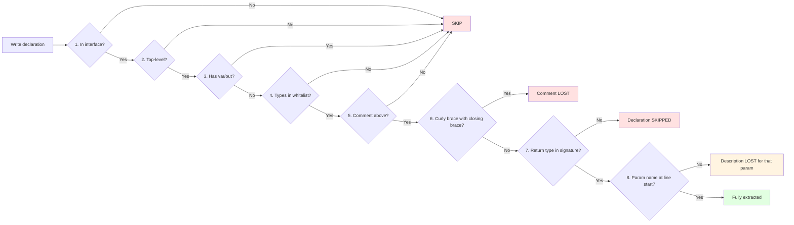

### 一句话概括"最容易踩的坑"

```pascal
// ✅ 正确：顶层 + interface + 白名单类型 + 前置注释
(* Adds two integers. *)
function Add(a, b: Integer): Integer;

// ❌ SKIP: var 参数
procedure Modify(var x: Integer);

// ❌ SKIP: out 参数
procedure GetValue(out x: Integer);

// ❌ SKIP: Boolean 返回
function IsEven(x: Integer): Boolean;

// ❌ SKIP: 数组参数
function Sum(const arr: array of Integer): Integer;

// ❌ SKIP: Pointer 参数
function GetBuffer(const p: Pointer): Integer;

// ❌ SKIP: 类方法（不在顶层）
type TMyClass = class
    function Multiply(x, y: Integer): Integer;
end;

// ❌ SKIP: implementation 段
implementation
function InternalHelper: Integer;
begin
end;

// ❌ 注释丢失: { } 内含 }，整段 Comment 变空
{
  Returns config JSON. Example: {"host": "x"}.
}
function GetConfig: string;

// ❌ 返回类型缺失: 无 : T
function Add(a, b: Integer);
```

### 八条铁律

| # | 铁律 | 违反后果 |
|:-:|------|----------|
| 1 | **位置**：必须在 `interface` 段 | 整条跳过 |
| 2 | **层级**：必须是顶层（不在 `class` / `record` / 嵌套函数内） | 整条跳过 |
| 3 | **修饰符**：只允许 `const` / `in` / 空白（禁 `var` / `out`） | 整条跳过 |
| 4 | **类型**：参数与返回类型必须命中白名单 | 整条跳过 |
| 5 | **注释**：紧邻上方（允许空行） | 注释丢失，函数保留 |
| 6 | **注释体**：`{ }` 内不得含 `}`；推荐改用 `(* ... *)` | 整条 `Comment` 变空 |
| 7 | **返回值**：必须在签名里 `: T` 声明；注释里的 `@return` 不进 JSON | 整条跳过（语法错误） |
| 8 | **参数块**：参数名必须在行首（或 Doxygen 标记后）；缩进行自动累积 | 该参数描述丢失或污染 |

---

## 1. 声明位置规则

### 1.1 unit 的解剖图

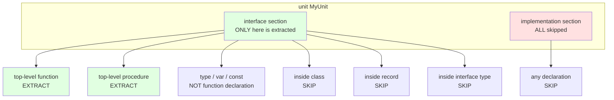

### 1.2 会提取 vs 不会提取

| 位置 | 结果 |
|------|:----:|
| `interface` 段顶层 | ✅ 提取 |
| `interface` 段的 `class` / `record` / `interface` 类型内部 | ❌ 跳过 |
| `implementation` 段任何位置 | ❌ 跳过 |
| 嵌套在其他函数内部 | ❌ 跳过 |
| 嵌套在 `type` 段的类型定义内部 | ❌ 跳过 |

### 1.3 位置示例：把所有情况放一起

```pascal
unit PositionDemo;

interface

// ✅ 提取：顶层 function
function Add(a, b: Integer): Integer;

// ✅ 提取：顶层 procedure
procedure Log(const msg: string);

// ❌ 跳过：嵌套在其他函数内部
procedure Outer;
  // 这个 Inner 是 Outer 的内嵌子过程，不会被提取
  procedure Inner;
  begin
  end;
begin
end;

// ❌ 跳过：class 方法
type
  TMyClass = class
    function Multiply(x, y: Integer): Integer;
    procedure DoSomething;
  end;

// ❌ 跳过：record 方法
  TMyRecord = record
    procedure Init;
  end;

// ❌ 跳过：interface 类型方法
  IMyInterface = interface
    procedure DoIt;
  end;

implementation

// ❌ 跳过：implementation 段
function InternalHelper: Integer;
begin
  Result := 0;
end;

end.
```

### 1.4 关键点

| 要点 | 说明 |
|------|------|
| **只在 `interface` 段** | `implementation` 段的一切都被跳过 |
| **必须顶层** | `class` / `record` / 嵌套函数内部都不算 |
| **只有 function / procedure** | `type` / `var` / `const` 声明不提取 |
| **方法不算** | 类、记录、接口的方法都跳过，必须移到顶层 |

---

## 2. 参数修饰符规则

### 2.1 修饰符判定图

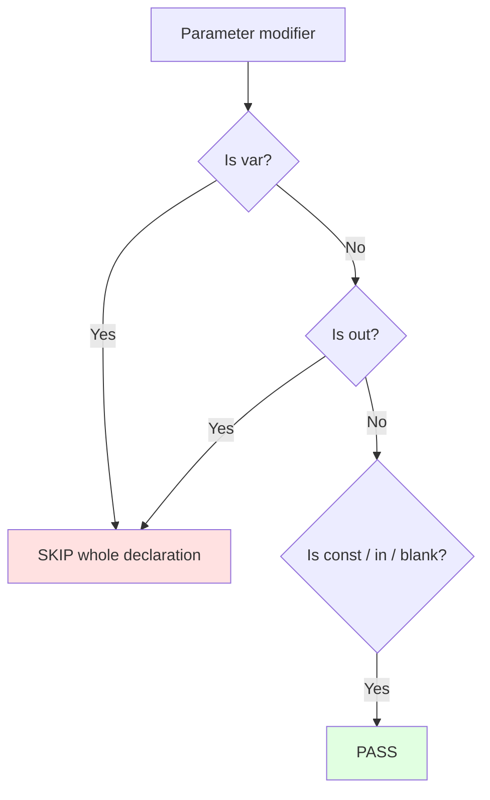

### 2.2 修饰符白名单

| 修饰符 | 是否允许 | 说明 |
|--------|:--------:|------|
| 空白（无修饰符） | ✅ 允许 | 默认值传递 |
| `const` | ✅ 允许 | 只读值传递 |
| `in` | ✅ 允许 | 只读值传递（Delphi 2009+，FPC 也支持） |
| `var` | ❌ 禁止 | **整条声明跳过** |
| `out` | ❌ 禁止 | **整条声明跳过** |

### 2.3 修饰符示例速查

```pascal
// ✅ PASS：无修饰符
function F1(x: Integer): Integer;

// ✅ PASS：const
function F2(const x: Integer): Integer;

// ✅ PASS：in（与 const 等价）
function F3(in x: Integer): Integer;

// ✅ PASS：混合 const 与其他
function F4(const a: Integer; b: Integer; const c: string): string;

// ❌ SKIP：var
procedure F5(var x: Integer);

// ❌ SKIP：out
procedure F6(out x: Integer);

// ❌ SKIP：var 与 const 混合（只要含一个 var / out 就跳过）
procedure F7(const a: Integer; var b: Integer);
```

### 2.4 为什么禁止 `var` / `out`

`var` / `out` 是**引用传递**，无法映射到 JSON Schema 的**值类型**。工具链的设计前提是「参数可序列化」。

**改造前后对比**：

```pascal
// ❌ 改造前：引用传递
procedure Modify(var x: Integer);
// 调用方语义：x 会被函数内部修改

// ✅ 改造后：值传递 + 返回值
function Modify(const x: Integer): Integer;
// 调用方语义：传入 x，得到新的值

// ❌ 改造前：out 参数
procedure GetValue(out x: Integer);

// ✅ 改造后：返回值
function GetValue: Integer;

// ❌ 改造前：多返回值用 out
procedure GetPair(out a, b: Integer);

// ✅ 改造后：用字符串或多次调用
function GetPairA: Integer;
function GetPairB: Integer;
// 或用 JSON 字符串承载
function GetPair: string;
```

### 2.5 修饰符组内广播

`const` / `in` 会**广播到同一组的全部参数名**。

```pascal
// const 应用于 a, b, c 三个参数
function F1(const a, b, c: Integer): Integer;

// const 只应用于 a；b 是独立声明（无修饰符）
function F2(const a: Integer; b: Integer): Integer;

// ❌ SKIP：同一组内不能混用修饰符
function F3(const a, var b: Integer): Integer;
```

---

## 3. 类型白名单

### 3.1 类型分类

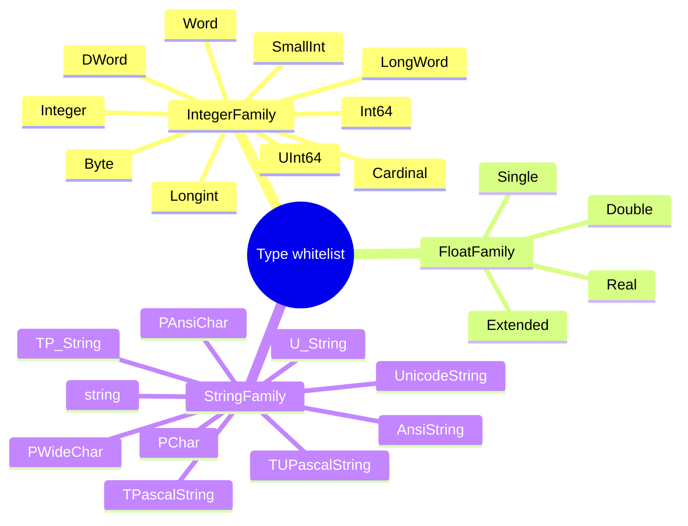

### 3.2 类型归一化表

| 原始类型 | `tnf_Json` 模式 | `tnf_ABI` 模式 | JSON Schema |
|----------|:---------------:|:--------------:|:-----------:|
| 整数族全部 | `int64` | 原始类型小写（如 `integer`） | `integer` |
| 浮点族全部 | `double` | 原始类型小写（如 `double`） | `number` |
| 字符串族全部 | `string` | 原始类型小写（如 `string`） | `string` |

> **模式说明**：`TPascal_Func_Model.Typ_Normalize_Func` 决定使用哪种归一化。默认是 `tnf_Json`，用于生成 MCP tool 的 JSON schema；`tnf_ABI` 用于保留原始类型名，便于生成 ABI 层代码。

### 3.3 明确禁止的类型

**以下类型一律导致整条声明跳过**：

```mermaid
flowchart TB
    BAN["Banned types"]
    BAN --> T1["Boolean"]
    BAN --> T2["Variant"]
    BAN --> T3["array of X"]
    BAN --> T4["record / struct"]
    BAN --> T5["class"]
    BAN --> T6["interface"]
    BAN --> T7["enum"]
    BAN --> T8["set of X"]
    BAN --> T9["generic T"]
    BAN --> T10["Pointer"]
    BAN --> T11["TDateTime"]
    BAN --> T12["reference to ..."]

    style BAN fill:#ffe1e1,stroke:#a00,stroke-width:5px
    style T1 fill:#ffe1e1,stroke:#a00
    style T2 fill:#ffe1e1,stroke:#a00
    style T3 fill:#ffe1e1,stroke:#a00
    style T4 fill:#ffe1e1,stroke:#a00
    style T5 fill:#ffe1e1,stroke:#a00
    style T6 fill:#ffe1e1,stroke:#a00
    style T7 fill:#ffe1e1,stroke:#a00
    style T8 fill:#ffe1e1,stroke:#a00
    style T9 fill:#ffe1e1,stroke:#a00
    style T10 fill:#ffe1e1,stroke:#a00,stroke-width:4px
    style T11 fill:#ffe1e1,stroke:#a00
    style T12 fill:#ffe1e1,stroke:#a00
```

> **补充说明**：`Pointer` 虽然在 C 侧映射表中有对应（`void *`），但在 **Pascal 侧**不被接受。原因是 `Pointer` 无法确定语义大小，无法安全序列化。若必须传递指针语义，请改用 `Int64` 承载地址值。

### 3.4 类型示例速查

**✅ 通过的类型**：

```pascal
// 整数族
function A1(x: Integer): Integer;
function A2(x: Int64): Int64;
function A3(x: Cardinal): Cardinal;
function A4(x: Longint): Longint;
function A5(x: DWord): DWord;
function A6(x: Word): Word;
function A7(x: SmallInt): SmallInt;
function A8(x: Byte): Byte;
function A9(x: UInt64): UInt64;
function A10(x: LongWord): LongWord;

// 浮点族
function B1(x: Double): Double;
function B2(x: Single): Single;
function B3(x: Extended): Extended;
function B4(x: Real): Real;

// 字符串族
function C1(x: string): string;
function C2(x: AnsiString): AnsiString;
function C3(x: UnicodeString): UnicodeString;
function C4(x: PChar): PChar;
function C5(x: PAnsiChar): PAnsiChar;
function C6(x: PWideChar): PWideChar;
function C7(x: TP_String): TP_String;
function C8(x: TPascalString): TPascalString;
function C9(x: TUPascalString): TUPascalString;
function C10(x: U_String): U_String;
```

**❌ 跳过的类型**：

```pascal
// Boolean
function D1(x: Integer): Boolean;

// Variant
function D2(x: Variant): Variant;

// 数组
function D3(const arr: array of Integer): Integer;
function D4(const arr: array[0..9] of Integer): Integer;

// record
function D5(const p: TPoint): Integer;

// class
function D6(const obj: TObject): Integer;

// interface
function D7(const itf: IInterface): Integer;

// enum
function D8(c: TColor): TColor;

// set
function D9(s: TOptions): TOptions;

// generic
function D10<T>(const list: TList<T>): Integer;

// Pointer
function D11(const p: Pointer): Integer;
function D12(const p: PInteger): Integer;
function D13(const p: PByte): Integer;

// TDateTime
function D14(t: TDateTime): TDateTime;

// 匿名方法
function D15(const f: reference to procedure): Integer;
```

### 3.5 边界示例

```pascal
// ✅ PASS：整数参数 + 整数返回
function Add(a, b: Integer): Integer;

// ✅ PASS：浮点参数 + 浮点返回
function Sqrt(x: Double): Double;

// ✅ PASS：字符串参数 + 字符串返回
function Echo(const s: string): string;

// ✅ PASS：混合类型
function Format(const fmt: string; value: Integer): string;

// ❌ SKIP：Boolean 返回
function IsEven(x: Integer): Boolean;

// ❌ SKIP：数组参数
function Total(const arr: array of Integer): Integer;

// ❌ SKIP：泛型方法
function GetItem<T>(const list: TList<T>): Integer;

// ❌ SKIP：Pointer 参数
function GetBuffer(const p: Pointer): Integer;
```

---

## 4. 注释绑定规则

### 4.1 绑定规则图

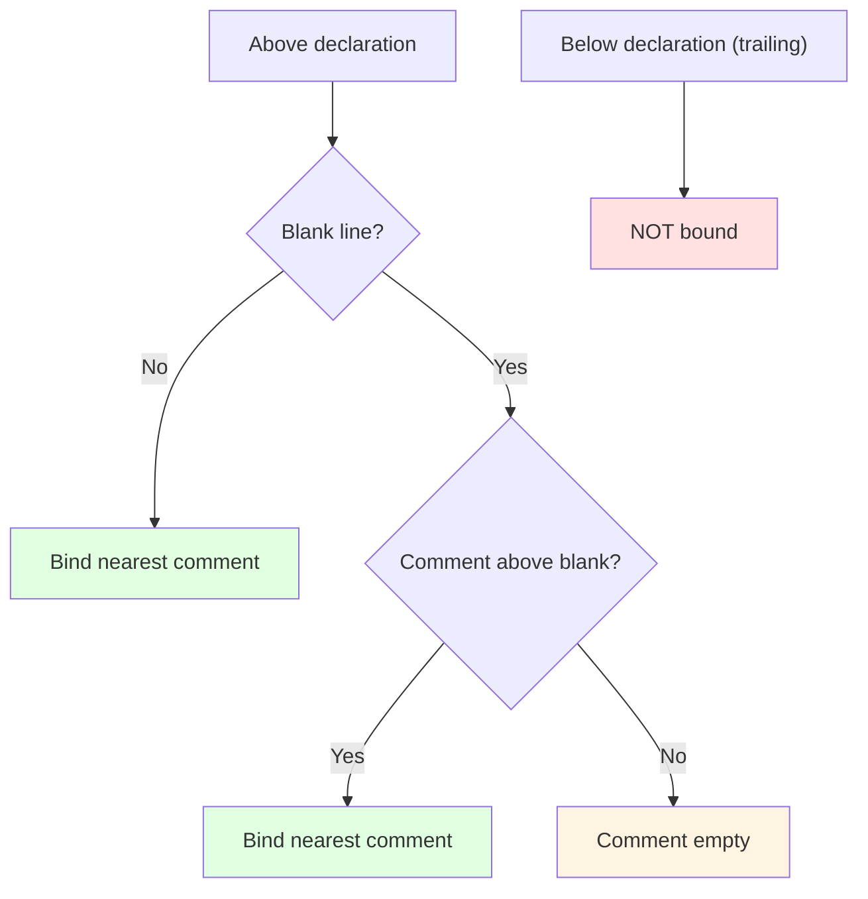

### 4.2 绑定规则表

| 情形 | 是否绑定 | 示例 |
|------|:--------:|------|
| 注释 → 声明（紧邻） | ✅ 绑定 | 见下方示例 A |
| 注释 → 空行 → 声明 | ✅ 绑定 | 见下方示例 B |
| 注释1 → 注释2 → 声明 | ✅ 全部绑定 | 见下方示例 C |
| 注释1 → 空行 → 注释2 → 声明 | ✅ 绑定注释2 | 见下方示例 D |
| 声明 → 尾随注释 | ❌ 不绑定 | 见下方示例 E |

### 4.3 绑定示例集合

**示例 A：紧邻**

```pascal
(* Adds two integers. *)
function Add(a, b: Integer): Integer;
// Comment = "Adds two integers."
```

**示例 B：注释 → 空行 → 声明**

```pascal
(* Adds two integers. *)

function Add(a, b: Integer): Integer;
// Comment = "Adds two integers."（空行被跳过）
```

**示例 C：两段注释全部绑定**

```pascal
(* Adds two integers. *)
(* Second comment. *)
function Add(a, b: Integer): Integer;
// Comment = "Adds two integers.\nSecond comment."
```

**示例 D：空行隔开，只绑定最近的**

```pascal
(* First comment. *)

(* Second comment. *)

function Add(a, b: Integer): Integer;
// Comment = "Second comment."（First comment 被忽略）
```

**示例 E：尾随注释不绑定**

```pascal
function Add(a, b: Integer): Integer;  // This is trailing, ignored
// Comment = ""（尾随注释被忽略）
```

### 4.4 注释风格的推荐顺序

**推荐顺序（从高到低）**：

| 优先级 | 风格 | 原因 |
|:------:|------|------|
| **1** | `(* ... *)` | 结束符 `*)` 在自然语言和 JSON 中罕见，最安全 |
| **2** | `// ...` | 到行末结束，完全不受花括号影响 |
| **3** | `{ ... }` | **仅当注释体内绝对不含 `}` 时使用** |

**规则**：

- **默认用 `(* ... *)`**。
- 若注释体是单行且不含 `}`，`//` 也可。
- `{ ... }` 只用于最简短的注释（如 `{ TODO: ... }`）。

**三种风格并列示例**：

```pascal
// 风格 1：(* ... *)——推荐
(*
  Computes the sum of two integers.
  source: first addend
  lang:   second addend
*)
function Add(source, lang: Integer): Integer;

// 风格 2：// ——可接受
// Computes the sum of two integers.
// source: first addend
// lang:   second addend
function Add(source, lang: Integer): Integer;

// 风格 3：{ ... }——仅当不含 } 时使用
{
  Computes the sum of two integers.
  source: first addend
  lang:   second addend
}
function Add(source, lang: Integer): Integer;
```

**C→Pascal 转换产物的说明**：

当输入是 C 头文件时，`Translate_C_Typ_To_Pascal` 会把 C 注释转换为 Pascal 风格的 `{ ... }`，其中**从第二行起每行携带 ` * ` 前缀**：

```
{ first line
 * second line
 * third line }
```

这种由**工具链自动生成**的 `{ ... }` 形式**无法避免**，但 **v3.0 的 `Z.Pascal_Func_Model` 会自动剥离 ` * ` 前缀**，因此不影响参数描述提取。**人工书写 Pascal 声明时**，仍然推荐使用 `(* ... *)`。

### 4.5 致命坑：`{ }` 注释体内出现 `}` 会导致注释整段丢失

**触发条件**：`{ ... }` 风格的注释体内**出现任何 `}` 字符**。
**后果**：该声明的 `Comment` 字段变为空字符串（JSON 序列化后 `"Comment": ""`）。

#### 4.5.1 根因机制

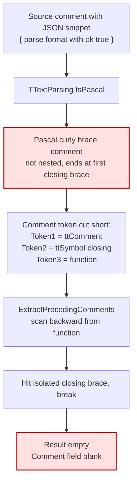

#### 4.5.2 触发条件速查

| 注释体内的情况 | 是否触发 | 示例 |
|----------------|:--------:|------|
| 无 `}` | ✅ 不触发 | `{ Adds two integers. }` |
| 单个 `}` | ❌ **触发** | `{ Example: {"host": "x"} }` |
| 全角 `｝`（U+FF5D） | ✅ 不触发 | `{ Example: ｛"host": "x"｝ }` |
| `(* ... *)` 内的 `}` | ✅ 不触发 | `(* Example: {"host": "x"} *)` |
| `(* ... *)` 内的 `*)` | ❌ **触发** | `(* Example: comment*)text *)` |
| `// ... }` | ✅ 不触发 | `// Example: {"host": "x"}` |
| C→Pascal 转换产物 `{ * ... }` 内的 `}` | ❌ **触发** | 转换前 C 侧的 `}` 会导致此问题 |

#### 4.5.3 修复前后对比

**❌ 触发坑的写法**：

```pascal
{
  Returns the configuration JSON.
  Example: {"host": "localhost", "port": 8080}.
}
function GetConfig: string;
// Comment = "" —— 整段丢失！
```

**✅ 修复方案 1：改用 `(* ... *)`**

```pascal
(*
  Returns the configuration JSON.
  Example: {"host": "localhost", "port": 8080}.
*)
function GetConfig: string;
// Comment = "Returns the configuration JSON.\nExample: {...}."
```

**✅ 修复方案 2：改用 `//`**

```pascal
// Returns the configuration JSON.
// Example: {"host": "localhost", "port": 8080}.
function GetConfig: string;
```

**✅ 修复方案 3：全角 `｝` 代替半角 `}`**

```pascal
{
  Returns the configuration JSON.
  Example: ｛"host": "localhost", "port": 8080｝.
}
function GetConfig: string;
```

#### 4.5.4 诊断口诀

> **Comment 为空 = 结构问题，先查 `}`；Comment 乱码 = 编码问题，查代码页。**

### 4.6 tool description 的拼接规则

**`pas_mcp_generator_tool` 使用 `GetFullDescription(Comment)` 生成 tool description。它的行为如下**：

| 步骤 | 行为 |
|------|------|
| 1 | 按 `#10` / `#13` 把 `Comment` 拆分为行 |
| 2 | 跳过**空行** |
| 3 | 跳过**以 `@` 开头的行**（Doxygen 标签行） |
| 4 | 去掉行首的 `*` 和 `**`（块注释的延续标记） |
| 5 | 剩下的行**用空格连接为一行** |
| 6 | 最多保留 200 字符 |

**含义**：

- **多行注释被压成一行**——tool description 是单行字符串。
- **`@param` / `@return` 等 Doxygen 标签行会被跳过**——它们不进 description。
- **`{ }` / `(* *)` / `//` 的注释符号已被剥掉**——不会出现在 description 里。

**示例**：

```pascal
(*
  Computes the sum of two integers.
  source: first addend
  lang:   second addend

  @return the sum

  Return value: this function returns an Integer.
*)
function Add(source, lang: Integer): Integer;
```

生成的 tool description = `Computes the sum of two integers. source: first addend lang:   second addend Return value: this function returns an Integer.`

（`@return the sum` 整行被跳过。）

### 4.7 块注释前缀处理

**背景**：当输入是 C 头文件时，经过 `Fill_C` + `Translate_C_Typ_To_Pascal` 转换后，元数据中的 `Comment` 字段形如：

```
{ @param source source text
 * @param lang   language name }
```

**从第二行起，每行携带 ` * ` 前缀**。这个前缀是 C 风格块注释的延续标记。

**v3.0 的 `Z.Pascal_Func_Model` 会自动剥离这个前缀**：

| 原始行 | 剥离后（用于解析） |
|--------|--------------------|
| `' @param source source text'` | `' @param source source text'`（无 `*`，不动） |
| `' * @param lang language name'` | `' @param lang language name'`（剥 `*`） |
| `' *         continuation'` | `'         continuation'`（剥 `*`，保留缩进） |

**关键契约**：

- 剥离**只在行首空白之后**遇 `*` 时触发。
- 剥离后**保留剩余所有字符**（包括内容自身的缩进）。
- 缩进层级基于剥离后的内容行计算。

**对用户的影响**：

- **人工书写 Pascal 声明**：`Comment` 字段不带 ` * ` 前缀，按本规范书写即可。
- **输入 C 头文件**：`Comment` 字段带 ` * ` 前缀，v3.0 自动剥离，无需用户处理。

---

## 5. 参数描述与返回值注释

### 5.1 数据流总览

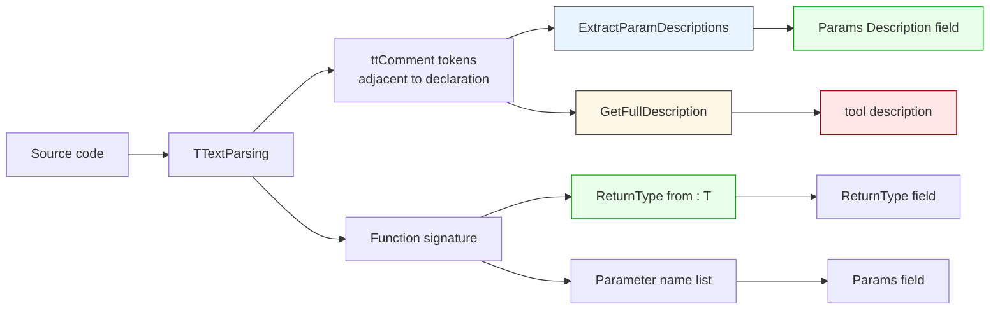

### 5.2 参数描述提取规则

`ExtractParamDescriptions` 的实际行为（v3.0）：

| 步骤 | 行为 |
|------|------|
| 1 | 调用 `CleanComment` 剥离注释标记并统一 LF 行分隔符 |
| 2 | 按 `#10` 把 `Comment` 拆分为行 |
| 3 | 对每行调用 `GetContentLine` 剥离块注释 `*` 前缀（C→Pascal 路径） |
| 4 | 维护状态：`CurrentParam` / `CurrentDesc` / `ParamIndent` |
| 5 | **空白行** → 终止当前块 |
| 6 | **识别为参数声明**（行首参数名或 Doxygen 形式） → 终止当前块，开始新块 |
| 7 | **缩进 > ParamIndent** → 追加到当前描述（含原始缩进） |
| 8 | **其他** → 终止当前块 |

**参数声明识别规则**：

参数名必须是**行首第一个标识符**（或 Doxygen 标记之后的第一个标识符）：

| 形式 | 语法 | 例 |
|:----:|------|-----|
| A | `name ...` | `source: 源码文本` |
| B | `@name ...` / `\name ...` | `@source 源码文本` |
| C | `@param name ...` / `\arg name ...` / `@parameter name ...` | `@param source 源码文本` |

**关键约束**：参数名必须位于**行首**（或 Doxygen 标记后）。出现在自然语言句子中间的同名标识符**不会**被误识别为参数声明。

**分隔符剥离规则**：

参数名之后的分隔符会被循环剥离，支持 ASCII 和全角：

| 字符 | Unicode |
|:----:|:-------:|
| `:` | U+003A |
| `=` | U+003D |
| `：` | U+FF1A |
| `＝` | U+FF1D |

### 5.3 参数描述格式示例集合

**格式 A：冒号分隔（最常用）**

```pascal
(*
  Computes the sum of two integers.
  source: first addend
  lang:   second addend
*)
function Add(source, lang: Integer): Integer;
```

**格式 B：等号分隔**

```pascal
(*
  source = first addend
  lang   = second addend
*)
function Add(source, lang: Integer): Integer;
```

**格式 C：Doxygen**

```pascal
(*
  @param source first addend
  @param lang   second addend
*)
function Add(source, lang: Integer): Integer;
```

**格式 D：空格分隔**

```pascal
(*
  source  first addend
  lang    second addend
*)
function Add(source, lang: Integer): Integer;
```

**格式 E：多行缩进延续**

```pascal
(*
  target: target language, pick one:
            pascal_service   generate Pascal service
            pascal_call      generate Pascal call
          <unit> is the normalized UnitName.
*)
function Generate(target: string): string;
```

**提取结果**：`target` 的描述 = `"target language, pick one:\n            pascal_service   generate Pascal service\n            pascal_call      generate Pascal call\n          <unit> is the normalized UnitName."`

**格式 F：全角冒号**

```pascal
(*
  source：源码文本
  lang：语言名
*)
function Add(source, lang: string): string;
```

### 5.4 参数描述的堆叠规则

**v3.0 的实际行为**：

- **每个参数声明块独立处理**：识别一个参数名后，**后续缩进更深的行**被吸收到该参数描述。
- **不要求所有参数说明集中在一起**：不同参数的说明块**可以分散**在注释的不同位置。
- **块内不夹杂无关内容**：一个参数块的延续行必须是该参数的说明，不能夹杂其他内容的歧义。

**推荐写法**：

1. **函数用途**（1–2 行）放**最前**。
2. **参数说明块**放**中段**，每行一个参数。
3. **返回值说明块**放**末段**，以 `返回值说明：` 开头。
4. **多行参数说明**：用缩进延续（后续行缩进更深）。

**示例 A：参数集中**

```pascal
(*
  Computes the product of two integers.

  source: first multiplicand
  lang:   second multiplicand

  Return value: this function returns an Integer.
*)
function Mul(source, lang: Integer): Integer;
```

**示例 B：参数分散（也合法）**

```pascal
(*
  Function purpose.

  source: source text.

  Some free-form description in between.

  lang: language name.

  Return value: ...
*)
function F(source, lang: string): string;
```

**示例 C：多行参数**

```pascal
(*
  Generates code for the given target.

  model_json: the model JSON produced by abi_decl_to_json.
  target: target language, pick one:
            pascal_service   generate Pascal service unit
            pascal_call      generate Pascal call unit
            python_service   generate Python service module
          <unit> is the normalized UnitName.

  Return value: this function returns a string.
*)
function abi_generate_to_text(model_json: string; target: string): string;
```

### 5.5 参数名匹配规则

| 规则 | 说明 | 示例 |
|------|------|------|
| 大小写 | **不敏感** | `Source` 匹配 `source` |
| 位置 | 参数名必须位于**行首**（或 Doxygen 标记之后） | 见下方示例 |
| 多行 | 缩进更深的后续行自动累积 | 见下方示例 |
| 每块一个参数 | 一个参数声明块只对应一个参数 | 见下方示例 |

**大小写不敏感示例**：

```pascal
(*
  SOURCE: source text
  LANG: language name
*)
function F(Source: string; Lang: string): string;
// Source 的描述 = "source text"
// Lang 的描述 = "language name"
```

**行首约束示例（安全）**：

```pascal
(*
  host: host name

  This config controls the host and port used by the service.
*)
function Connect(host: string; port: Integer): string;
// host 的描述 = "host name"
// 第二行中的 "host" 和 "port" 不会污染
```

### 5.6 返回值的注释写法

> **本节解决一个长期误解：很多人以为注释里的 `@return` 会被提取到 JSON。实际上不会。**

#### 5.6.1 数据流：什么进 JSON，什么不进 JSON

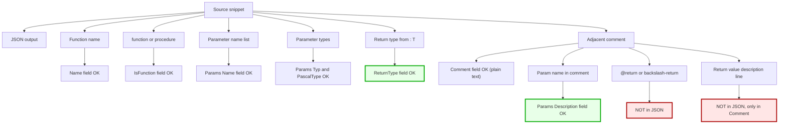

**表格式总结**：

| JSON 字段 | 来源 | 是否包含返回值信息 |
|-----------|------|:------------------:|
| `Name` | 函数名 | 否 |
| `IsFunction` | `function` / `procedure` | 否 |
| `Params[i].Name` | 参数列表 | 否 |
| `Params[i].Typ` | 参数类型（原始） | 否 |
| `Params[i].PascalType` | 参数类型（归一化） | 否 |
| `Params[i].Description` | 注释中 `参数名: 描述` | 否 |
| **`ReturnType`** | **签名里的 `: T`** | **是（唯一来源）** |
| `Comment` | 注释全文（纯文本） | 若含文字描述，只在此 |

**结论**：

1. **`ReturnType` 是唯一结构化的返回值信息**——它来自**函数签名的类型部分**。
2. **注释里的任何返回值描述都不会进结构化字段**——它们只能留在 `Comment` 纯文本里。
3. **LLM 要理解返回值语义，必须同时看**：`ReturnType`（结构化）+ `Comment`（纯文本）。

#### 5.6.2 `ReturnType` 的归一化

`ReturnType` 字段在 `TPascal_Func_Model` 里会被**归一化**，具体取决于 `Typ_Normalize_Func`：

| 签名里的类型 | `tnf_Json` 模式 | `tnf_ABI` 模式 |
|--------------|:---------------:|:--------------:|
| 任意整数族 | `int64` | 原始类型小写（如 `integer`） |
| 任意浮点族 | `double` | 原始类型小写（如 `double`） |
| 任意字符串族 | `string` | 原始类型小写（如 `string`） |

**示例**：

```pascal
function Add(a, b: Integer): Integer;
// tnf_Json 下 ReturnType = "int64"
// tnf_ABI 下 ReturnType = "integer"
```

#### 5.6.3 为什么工具链不提取返回值描述

设计取舍：

| 方案 | 优点 | 缺点 |
|------|------|------|
| 新增 `ReturnDescription` 字段 | 信息完整 | 需改 `TFunctionStructure` / `LoadFromParser` / `SaveToJson`，影响面大 |
| 不提取（现状） | 简单，不动既有代码 | 返回值描述只能靠 LLM 从 `Comment` 里读 |
| 把返回值描述塞进 `Comment` | 简单 | LLM 需要从纯文本里提取 |

**当前选择第三种**：返回值描述**留在 `Comment` 里**，LLM 从纯文本里读取。**这也是为什么注释要写清楚**——它是 LLM 理解返回值语义的**唯一补充来源**。

#### 5.6.4 正确的返回值注释写法

**必须通过函数签名的 `: T` 声明返回类型**。注释里的返回值描述是**可选补充**。

**推荐写法**：

```pascal
(*
  Computes the sum of two integers.

  source: first addend
  lang:   second addend

  Return value: this function returns an Integer representing the sum.
*)
function Add(source, lang: Integer): Integer;
```

**要点**：

| 元素 | 作用 |
|------|------|
| `: Integer` | **唯一**被提取的返回值信息 → 归一化为 `int64` |
| `Return value: ...` | 给**人类 / LLM** 看的补充说明，**不进结构化字段** |
| `Integer` 出现在说明里 | **不会**被误认为参数名（因为它是类型名，且在句子中间） |

#### 5.6.5 正反例对照

**✅ 正确：签名 + 注释都写**

```pascal
(*
  Computes the sum of two integers.

  source: first addend
  lang:   second addend

  Return value: this function returns an Integer representing the sum.
*)
function Add(source, lang: Integer): Integer;
// JSON: ReturnType = "int64"，Comment = 全文
```

**❌ 错误：依赖注释里的返回值描述**

```pascal
(*
  @return the sum
*)
function Add(source, lang: Integer): Integer;
// JSON: ReturnType = "int64"，但 "@return the sum" 不进任何结构化字段
```

**❌ 错误：`procedure` 里写 `@return`**

```pascal
(*
  @return nothing
*)
procedure Log(const msg: string);
// procedure 没有 ReturnType 字段，@return 完全被忽略
```

**❌ 错误：返回类型不在白名单**

```pascal
(*
  Return value: a boolean.
*)
function IsEven(x: Integer): Boolean;
// Boolean 不在白名单，整条声明被跳过
```

**❌ 错误：省略签名里的返回类型**

```pascal
(*
  @return the sum
*)
function Add(source, lang: Integer);
// 语法错误：Fill_Pascal 会报 "missing ':' or return type"
// 整条声明被跳过
```

#### 5.6.6 推荐模板

```pascal
(*
  <function purpose in one or two lines>.

  <param1>: <description of param1>
  <param2>: <description of param2>

  Return value: this function returns <type>, <semantic description>.
*)
function <name>(<param1>: <type1>; <param2>: <type2>): <return type>;
```

**规则**：

- 参数说明块**集中在注释中段**。
- 返回值说明块**独立**放在注释末段，以 `Return value:` 开头。
- 返回值说明里**不要再出现 `<参数名>:` 格式**——避免阅读者困惑。

#### 5.6.7 注释里出现参数名同名标识符的风险

**v3.0 的解决方案**：**行首约束**。参数名必须位于**行首**（或 Doxygen 标记后）才被识别为参数声明。

**示例（安全）**：

```pascal
(*
  Reads configuration.
  host: host name
  port: port number

  JSON format is a key-value object with host and port fields.
  Note that host is the host name and port is the port number.
*)
function GetConfig(host: string; port: Integer): string;
```

分析：

- `host: host name` → 行首 `host` → ✅ 正常提取。
- `port: port number` → 行首 `port` → ✅ 正常提取。
- `JSON format is ...` → 行首 `JSON` 非参数名 → ✅ 跳过。
- `Note that host is ...` → 行首 `Note` 非参数名 → ✅ **整行跳过**，句中的 `host` 和 `port` **不会被误识别**。

**结果**：`host="host name"`、`port="port number"`。**无污染**。

**仍存在的边缘情况**：

如果某行以参数名**开头**但不是参数声明行，仍可能被误识别。

```pascal
(*
  host: host name

  host can also be an IP address.
*)
function Connect(host: string);
```

分析：

- `host: host name` → ✅ 正常提取 `host="host name"`。
- `host can also be an IP address.` → ❌ **行首 `host` 匹配** → 描述被污染为 `"host name host can also be an IP address."`。

**规避方案（四种）**：

**方案 1：改写句式，合并到参数描述行**

```pascal
(*
  host: host name (can also be an IP address)
*)
function Connect(host: string);
```

**方案 2：用反引号包裹行首参数名**

```pascal
(*
  host: host name

  `host` can also be an IP address.
*)
function Connect(host: string);
```

**方案 3：用中文描述代替（避开 ASCII 标识符）**

```pascal
(*
  host: host name

  主机名也可以是 IP 地址。
*)
function Connect(host: string);
```

**方案 4：调整缩进，让该行成为上一个参数块的延续**

```pascal
(*
  host: host name
        can also be an IP address.
*)
function Connect(host: string);
```

#### 5.6.8 与 Doxygen `@return` 的关系

| 写法 | 提取结果 |
|------|----------|
| `@return the sum` | ❌ 不进任何结构化字段（`@` 使得该行被跳过） |
| `\return the sum` | ❌ 同上 |
| `Return value: ...` | ⚠️ 不进结构化字段，**但留在 `Comment` 里** |

**结论**：

- **`@return` / `\return` 是安全的**（不会被误认为参数），但也不会被提取。
- **`Return value:` 是推荐写法**——它留在 `Comment` 里，LLM 可以读到。
- **不要用 `返回值: xxx`**——虽然同样安全，但格式与参数描述接近，可能造成阅读者困惑。

---

## 6. 完整示例

### 6.1 正面示例（全部通过）

```pascal
unit SampleUnit;

interface

(*
  Computes the sum of two integers.

  source: first addend
  lang:   second addend

  Return value: this function returns an Integer representing the sum.
*)
function Add(source, lang: Integer): Integer;

(*
  Computes the product of two integers.

  @param source first multiplicand
  @param lang   second multiplicand

  Return value: this function returns an Integer representing the product.
*)
function Mul(source, lang: Integer): Integer;

(*
  String echo.

  s: string to echo

  Return value: this function returns a string identical to the input.
*)
function Echo(const s: string): string;

(*
  Logs a message. No return value.

  msg: log content
*)
procedure Log(const msg: string);

(*
  Returns the configuration JSON.

  Return value: this function returns a string containing JSON text.
*)
function GetConfig: string;

implementation

end.
```

### 6.2 多行参数描述示例

```pascal
unit MultiLineDemo;

interface

(*
  Generates code for the given target.

  model_json: the model JSON produced by abi_decl_to_json.
  target: target language, pick one:
            pascal_service   generate Pascal service unit
            pascal_call      generate Pascal call unit
            python_service   generate Python service module
            python_call      generate Python call module
          <unit> is the normalized UnitName.

  Return value: this function returns a string containing the generated code.
*)
function abi_generate_to_text(model_json: string; target: string): string;

implementation

end.
```

**提取结果**：

| 参数 | 描述 |
|------|------|
| `model_json` | `the model JSON produced by abi_decl_to_json.` |
| `target` | `target language, pick one:\n            pascal_service   generate Pascal service unit\n            pascal_call      generate Pascal call unit\n            python_service   generate Python service module\n            python_call      generate Python call module\n          <unit> is the normalized UnitName.` |

### 6.3 反面示例（跳过或丢失）

```pascal
unit BadUnit;

interface

// ❌ SKIP: var 参数
procedure Modify(var x: Integer);

// ❌ SKIP: out 参数
procedure GetValue(out x: Integer);

// ❌ SKIP: Boolean 返回
function IsEven(x: Integer): Boolean;

// ❌ SKIP: array 参数
function Sum(const arr: array of Integer): Integer;

// ❌ SKIP: 泛型方法
function GetItem<T>(const list: TList<T>): Integer;

// ❌ SKIP: Pointer 参数
function GetBuffer(const p: Pointer): Integer;

// ❌ COMMENT LOST: 花括号内含 }
{
  Returns the configuration JSON.
  Example: a JSON object with host and port fields, closed by a brace.
}
function GetConfig: string;

// ❌ PARAM DESCRIPTION POLLUTED: 参数名开头的非声明行
(*
  host: host name

  host can also be an IP address.
*)
function Connect(host: string): Boolean;

implementation

end.
```

---

## 7. 常见错误对照表

| 错误写法 | 后果 | 正确写法 |
|----------|:----:|----------|
| `procedure P(var x: Integer)` | ❌ 整条跳过 | `function P(const x: Integer): Integer` |
| `procedure P(out x: Integer)` | ❌ 整条跳过 | `function P: Integer` |
| `function F: Boolean` | ❌ 整条跳过 | `function F: Integer`（用 0/1 表示） |
| `function F(a: TPoint)` | ❌ 整条跳过 | 拆成 `Double` / `Integer` 参数 |
| `function F(a: array of Integer)` | ❌ 整条跳过 | 用 JSON 字符串或多次调用 |
| `function F(a: Pointer)` | ❌ 整条跳过 | 用 `Int64` 承载地址值 |
| 类方法 `TClass.F` | ❌ 跳过 | 移到顶层 |
| `implementation` 段函数 | ❌ 跳过 | 移到 `interface` 段 |
| 尾随注释 `function F; // comment` | ⚠️ 注释被忽略 | 改为前置注释 |
| `{ ... }` 内含 `}` | ⚠️ Comment 整段为空 | 改用 `(* ... *)` |
| `(* ... *)` 内含 `*)` | ⚠️ Comment 从 `*)` 处切断 | `*` 与 `)` 间加空格 |
| 依赖 `@return` 描述作为返回值信息 | ⚠️ 不进 JSON | 必须在签名里声明返回类型 |
| `procedure` 里写 `@return` | ⚠️ 被完全忽略 | `procedure` 不写返回值描述 |
| 返回值描述用 `返回值: xxx` 格式 | ⚠️ 阅读者困惑 | 用 `Return value:` |
| **参数名出现在句子中间** | ✅ **不会污染**（v3.0 行首约束） | 无需修正 |
| **参数名作为某行行首但不是声明** | ❌ **可能污染该参数** | 改写句式或调整缩进 |
| **参数说明分散在多处** | ✅ **v3.0 可正确处理**（每块独立） | 无需修正 |
| **多行参数说明** | ✅ **v3.0 自动累积**（缩进延续） | 无需修正 |

---

## 8. 自检清单（写完声明后逐项核对）

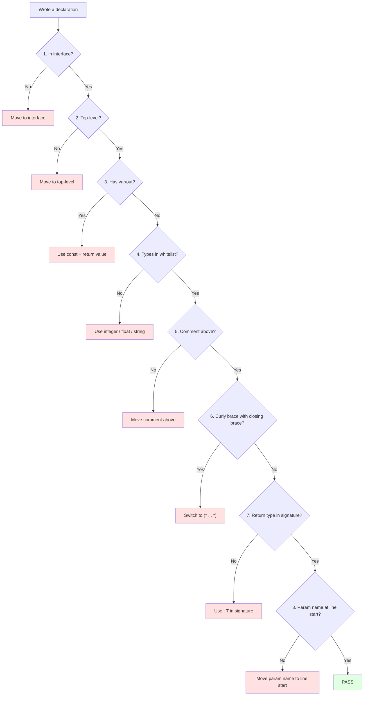

**八项检查**：

| 序号 | 检查项 | 不通过的动作 |
|:----:|--------|--------------|
| 1 | 在 `interface` 段？ | 移到 `interface` 段 |
| 2 | 在顶层？ | 移到顶层 |
| 3 | 参数不含 `var` / `out`？ | 改用 `const` + 返回值 |
| 4 | 所有类型在白名单？ | 改用整数 / 浮点 / 字符串 |
| 5 | 注释紧邻上方？ | 移动注释 |
| 6 | 注释体内不含 `}`？ | 改用 `(* ... *)` |
| 7 | 返回类型在签名里声明？ | 用 `: T` 声明，不要依赖注释 |
| 8 | 参数名在行首（或 Doxygen 标记后）？ | 移动参数名到行首 |

---

## 9. 最小可解析模板

### 9.1 模板

```pascal
unit <UnitName>;

interface

(*
  <function purpose in one or two lines>.

  <param1>: <description of param1>
  <param2>: <description of param2>

  Return value: this function returns <type>, <semantic description>.
*)
function <name>(<param1>: <type1>; <param2>: <type2>): <return type>;

implementation

function <name>(<param1>: <type1>; <param2>: <type2>): <return type>;
begin
  // implementation
end;

end.
```

### 9.2 填空规则

| 占位符 | 可选值 |
|--------|--------|
| `<UnitName>` | 合法 Pascal 标识符 |
| `<name>` | 合法 Pascal 标识符 |
| `<paramN>` | 合法 Pascal 标识符 |
| `<typeN>` | 见 §3 白名单 |
| `<return type>` | 见 §3 白名单 |

### 9.3 注意事项

- 模板固定使用 `(* ... *)` 注释，即使注释体内出现 `}` 也安全。
- 返回类型必须写在签名里（`function F: T`），注释里的返回值说明只是给人 / LLM 看的。
- 参数名必须位于**行首**，后续缩进行自动作为参数描述延续。

---

## 10. 设计原则

### 10.1 工具链的硬性假设

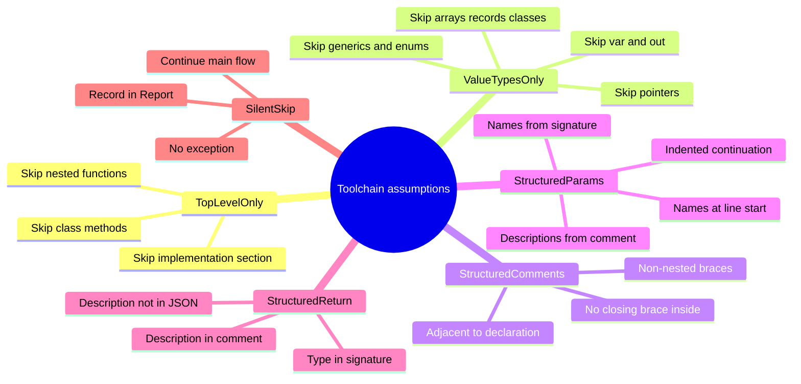

### 10.2 使用者的六条铁律

1. **写声明前先查白名单**——参数、返回类型必须在 §3 列表中。
2. **写完声明的自检**——是否在 `interface` 段？是否在顶层？是否含 `var` / `out`？
3. **注释体内有 `}` 时改用 `(* ... *)`**——见 §4.5。
4. **返回类型必须写在签名里**——`function F: T`，不要依赖注释——见 §5.6。
5. **参数名必须位于行首**——见 §5.2。
6. **多行参数说明用缩进延续**——见 §5.4。

### 10.3 本规范与旧版的关键差异

| 项目 | v4.0 | v5.0 | v6.0 | v7.0 | v8.0 | **v9.0** |
|------|:----:|:----:|:----:|:----:|:----:|:--------:|
| 注释空行允许 | ✅ | ✅ | ✅ | ✅ | ✅ | ✅ |
| 类型白名单 | ✅ | ✅ | ✅ | ✅ | ✅ | ✅ |
| `{ }` 内含 `}` 坑 | ❌ | ✅ | ✅ | ✅ | ✅ | ✅ |
| 返回值注释写法 | ❌ | ❌ | ✅ | ✅ | ✅ | ✅ |
| 数据流表 | ❌ | ❌ | ❌ | ✅ | ✅ | ✅ |
| `ReturnType` 归一化 | ❌ | ❌ | ❌ | ✅ | ✅ | ✅ |
| 参数堆叠规则 | ❌ | ❌ | ✅ | ✅ | ✅ | ✅ |
| tool description 拼接规则 | ❌ | ❌ | ❌ | ✅ | ✅ | ✅ |
| 注释风格推荐顺序 | ❌ | ❌ | ❌ | ✅ | ✅ | ✅ |
| 参数名同名标识符风险 | ❌ | ❌ | ❌ | ✅ | ✅ | ✅ |
| 参数描述状态机 | ❌ | ❌ | ❌ | ❌ | ✅ | ✅ |
| 多行参数描述累积 | ❌ | ❌ | ❌ | ❌ | ✅ | ✅ |
| 行首约束 | ❌ | ❌ | ❌ | ❌ | ✅ | ✅ |
| 块注释前缀处理 | ❌ | ❌ | ❌ | ❌ | ✅ | ✅ |
| 模拟阅读失误场景 | ❌ | ❌ | ❌ | ❌ | ✅ | ✅ |
| **示例数量增强** | ❌ | ❌ | ❌ | ❌ | ❌ | **✅** |
| **速查对照表** | ❌ | ❌ | ❌ | ❌ | ❌ | **✅** |
| 铁律数 | 3 | 4 | 5 | 6 | 8 | 8 |
| 自检清单 | 5 | 6 | 7 | 8 | 8 | 8 |

---

## 11. 模拟人类阅读失误场景

本节列出**读者容易误读**的场景，逐一解释实际行为。

### 11.1 误读场景 A：以为参数说明必须集中

**误读**：看到 §5.4 的「参数说明块放在中段」，以为**所有参数说明必须连续写在一起**。

**实际**：v3.0 中，**每个参数声明块独立处理**。不同参数的说明块**可以分散**在注释的不同位置。

**示例（合法）**：

```pascal
(*
  Function purpose.

  source: source text.

  Some free-form description in between.

  lang: language name.
*)
function F(source, lang: string): string;
```

**结果**：`source` 和 `lang` 的描述都会被正确提取。中间的自由描述被忽略。

**建议**：虽然合法，但为了**可读性**和 **tool description 拼接**的稳定性，推荐把参数说明集中在中段。

### 11.2 误读场景 B：以为必须避免在正文中提及参数名

**误读**：看到 §5.6.7 的「注释里出现参数名同名标识符的风险」，以为**注释正文里不能提及参数名**。

**实际**：v3.0 采用**行首约束**。**行首不是参数名**的行，即使中间含有参数名，也**不会被误识别**。

**示例（安全）**：

```pascal
(*
  host: host name

  This config controls the host and port used by the service.
*)
```

**结果**：`host` 的描述 = `"host name"`。第二行中出现的 `host` 和 `port` **不会污染**。

**仍存在的边缘情况**：如果某行**以参数名开头**但**不是**参数声明行，可能被误识别。见 §5.6.7 的详细说明。

### 11.3 误读场景 C：以为多行参数说明会被丢弃

**误读**：看到「每行只取一个参数描述」的旧版描述，以为**多行参数说明会被截断**。

**实际**：v3.0 采用**缩进感知状态机**。参数名后的**缩进更深的行**会自动累积。

**示例（合法）**：

```pascal
(*
  target: target language, pick one:
            pascal_service
            pascal_call
          <unit> is the normalized UnitName.
*)
```

**结果**：`target` 的描述会包含全部三行延续内容。

### 11.4 误读场景 D：以为 `{ ... }` 完全不能用

**误读**：看到 §4.4 的「推荐顺序」（`{ ... }` 排第三），以为 `{ ... }` **不能用**。

**实际**：`{ ... }` **可以用**，只要**注释体内不含 `}`**。同时，**C→Pascal 转换产物**的 `{ ... }` 形式（带 ` * ` 前缀）由工具链自动生成，**无法避免**，但 v3.0 会自动处理。

**结果**：

- **手写 `{ 简短说明 }`**（不含 `}`）：完全正常。
- **手写 `{ { ... } }`**（含 `}`）：注释丢失。

### 11.5 误读场景 E：以为返回值描述会被提取

**误读**：看到 §5.6 的「返回值的注释写法」，以为 `@return` 或 `Return value:` 会被**提取到 JSON 的某个字段**。

**实际**：**只有签名里的 `: T` 进 JSON**。注释里的返回值描述**只留在 `Comment` 纯文本**里。

**结果**：

- `function F: Integer;` 加注释 `@return the result` → JSON 里只有 `ReturnType="int64"`，注释里的描述**不进 JSON**。
- LLM 要从 `Comment` 里读返回值语义。

**建议**：仍然写返回值说明，因为 LLM 会读 `Comment`。

### 11.6 误读场景 F：以为可以省略返回类型

**误读**：看到「`ReturnType` 归一化为 `int64`」，以为**可以省略签名里的 `: T`**，让工具链从注释推断。

**实际**：**必须显式声明 `: T`**。若省略，`Z.Pascal_Func_Tool` 的 `Fill_Pascal` 会报语法错误，整条声明被跳过。

**示例**：

```pascal
(*
  @return the sum
*)
function Add(source, lang: Integer);
```

**结果**：`Fill_Pascal` 会报错 `function "Add" missing ":" or return type`，声明被跳过。

### 11.7 误读场景 G：以为 `in` 修饰符会被跳过

**误读**：看到 §2.2 的「`var` / `out` 被禁止」，以为 `in` 也被禁止。

**实际**：`in` **被允许**（Delphi 2009+，FPC 也支持）。它和 `const` 语义相近。

**示例**：

```pascal
function F(in x: Integer): Integer;
```

**结果**：正常提取，与 `const x: Integer` 等价处理。

### 11.8 误读场景 H：以为参数名大小写敏感

**误读**：以为 `source: xxx` 和 `Source: xxx` 会被视为不同参数。

**实际**：参数名匹配**大小写不敏感**。`Source` 匹配 `source`。

**示例**：

```pascal
(*
  SOURCE: source text
*)
function F(Source: string);
```

**结果**：`Source` 参数的描述 = `"source text"`。

### 11.9 误读场景 I：以为注释必须紧邻声明

**误读**：看到 §4.2 的「注释 → 空行 → 声明 → 绑定」，以为**必须**紧邻。

**实际**：注释与声明之间**可以有空行**，也**可以有多个连续注释**。工具链会从声明向前扫描，收集**所有连续的注释**作为 `Comment`。

**示例**：

```pascal
// comment part 1

// comment part 2

function F: Integer;
```

**结果**：`Comment` = `"comment part 1\ncomment part 2"`（两段注释全部保留）。

### 11.10 误读场景 J：以为 C→Pascal 转换会丢失参数描述

**误读**：看到 C 头文件里的 Doxygen `/** */`，以为转换成 Pascal 后参数描述会**全部丢失**。

**实际**：v3.0 会自动处理 ` * ` 前缀。C 头文件的 Doxygen 注释**能正确提取参数描述**。

**示例**：

```c
/**
 * @param a first addend
 * @param b second addend
 */
int add(int a, int b);
```

**结果**：`a="first addend"`, `b="second addend"`。**完全保留**。

### 11.11 误读场景 K：以为只有冒号能做参数名分隔符

**误读**：看到 §5.3 的「格式 A：冒号分隔」，以为**只有冒号**能分隔。

**实际**：**四种分隔符**都支持：`:`、`=`、全角 `：`、全角 `＝`。

**示例**：

```pascal
(*
  source=first addend
  lang：second addend
*)
function Add(source, lang: Integer): Integer;
```

**结果**：`source="first addend"`, `lang="second addend"`。

### 11.12 误读场景 L：以为 `@return` 会污染参数

**误读**：看到 §5.6 讲 `@return`，担心它会像参数名一样污染描述。

**实际**：**`@` 开头的行会被 `GetFullDescription` 跳过**，**不会污染任何参数描述**。

**示例**：

```pascal
(*
  Computes the sum.
  source: first
  @return the sum
  lang: second
*)
function Add(source, lang: Integer): Integer;
```

**结果**：`source="first"`、`lang="second"`。`@return the sum` 被跳过，**不影响参数提取**。

---

## 12. 修订历史

- **v9.0（2026-09-24）**：
  - **全文重写**：以示例驱动，每个规则都给出 ✅/❌ 对照示例。
  - **§0**：新增"一句话概括最容易踩的坑"清单（13 条 PASS/SKIP 示例）。
  - **§1.3**：把所有位置情况（顶层 / 嵌套 / 类 / 记录 / 接口 / implementation）放在一个单元里对照。
  - **§2.3**：新增"修饰符示例速查"（7 条）。
  - **§2.4**：新增"改造前后对比"（3 组 var/out → const 改造）。
  - **§3.4**：新增"类型示例速查"（10 条 PASS + 15 条 SKIP）。
  - **§3.5**：新增边界示例。
  - **§4.3**：新增"绑定示例集合"（5 个场景）。
  - **§4.4**：三种注释风格并列展示。
  - **§4.5.3**：新增"修复前后对比"（1 个反例 + 3 种修复方案）。
  - **§5.3**：新增"参数描述格式示例集合"（6 种格式）。
  - **§5.4**：新增"参数分散"和"多行参数"示例。
  - **§5.5**：新增"大小写不敏感"和"行首约束"示例。
  - **§5.6.5**：新增"正反例对照"（5 个场景）。
  - **§5.6.7**：新增"规避方案（四种）"。
  - **§6.2**：多行参数描述完整示例。
  - **§11**：新增 2 个误读场景（K、L），共 12 个。
  - **§10.3**：更新版本差异表，新增"示例数量增强"和"速查对照表"两行。
  - **Mermaid**：所有 subgraph ID 英文、节点标签带引号、去 emoji 干扰。

- **v8.0（2026-09-20）**：初版。对齐 `Fill_Pascal.inc` + `Translate_C_Typ_To_Pascal.inc` 的现行实现。

---

**本规范为解析契约。任何偏离本规范的声明将被工具链静默跳过，或注释被静默丢失，或返回值描述被静默忽略，或参数描述被静默丢失。**

**遇到「Comment 为空」，先查 `}`；遇到「参数描述不见」，先查参数名是否在行首；遇到「参数描述奇怪」，先查是否有以参数名开头的非声明行。**
