# MCP API Contract (Pascal ↔ Python ↔ C++)

> **Document version**: v3.0 (complete rewrite)
> **Purpose**: An **authoritative wire-protocol contract** for AI and human engineers. When you modify the provider generated by `pas_mcp_generator_tool.pas` / `py_mcp_generator_tool.pas` / `cpp_mcp_generator_tool.pas`, or when you write a LingoFuse client that talks to them, you **must** follow every convention in this document.
>
> **Division of labor with `code_decl_to_mcp_knowledge_base.md`**:
> - This document: **wire-protocol contract** (byte-level, field-level, cross-language consistency)
> - `code_decl_to_mcp_knowledge_base.md`: **toolchain implementation** (generator source, GUI, modification guide)
>
> **Core promise**: Breaking any clause in this document usually **does not produce a compile error** — it manifests at runtime as: parameters becoming default values, return fields not readable, Chinese turning into `?`, callbacks silently failing, or the MCP client sending `{}` instead of real arguments. This document must therefore be followed **to the letter**.
>
> **Diagram convention**: All flowcharts / architecture diagrams / decision trees use Mermaid.
>
> **What's new in this version (v3.0) over v2.0**:
> - **Complete rewrite** of Chapters 1–3: precise byte-level definition of the wire format
> - **New** Chapter 12: runnable client reference implementations
> - **New** Chapter 13: byte-level wire-format examples (hex dumps)
> - **New** Chapter 16: complete error-code and error-message index
> - **New** Chapter 17: mapping to generator source (function-level)
> - **Kept** the 11 fixes from v2.0
> - **Restructured** chapter layout: from "introduction-style" to "contract-style"

---

## Table of Contents

- [Chapter 0  Quick Orientation](#chapter-0-quick-orientation)
- [Chapter 1  Precise Wire-Format Definition](#chapter-1-precise-wire-format-definition)
- [Chapter 2  Type System and Mapping](#chapter-2-type-system-and-mapping)
- [Chapter 3  DataHandle I/O Contract](#chapter-3-datahandle-io-contract)
- [Chapter 4  JSON No-Escape Contract](#chapter-4-json-no-escape-contract)
- [Chapter 5  Input JSON Contract](#chapter-5-input-json-contract)
- [Chapter 6  Output JSON Contract](#chapter-6-output-json-contract)
- [Chapter 7  Callback Signature Contract](#chapter-7-callback-signature-contract)
- [Chapter 8  Tool Registration JSON Contract](#chapter-8-tool-registration-json-contract)
- [Chapter 9  App Name and Endpoint Contract](#chapter-9-app-name-and-endpoint-contract)
- [Chapter 10  Startup Sequence Contract](#chapter-10-startup-sequence-contract)
- [Chapter 11  Comment and Docstring Contract](#chapter-11-comment-and-docstring-contract)
- [Chapter 12  Client Reference Implementations](#chapter-12-client-reference-implementations)
- [Chapter 13  Byte-Level Wire-Format Examples](#chapter-13-byte-level-wire-format-examples)
- [Chapter 14  Anti-Patterns](#chapter-14-anti-patterns)
- [Chapter 15  Self-Check Checklist](#chapter-15-self-check-checklist)
- [Chapter 16  Error Code and Error Message Index](#chapter-16-error-code-and-error-message-index)
- [Chapter 17  Mapping to Generator Source](#chapter-17-mapping-to-generator-source)
- [Appendix A: Uncertainty List](#appendix-a-uncertainty-list)
- [Appendix B: Revision History](#appendix-b-revision-history)

---

## Chapter 0  Quick Orientation

### 0.1 In One Sentence

**This document defines how a Pascal / Python / C++ program exchanges JSON objects through a LingoFuse DataHandle while guaranteeing cross-language, cross-compiler, and cross-platform consistency.**

### 0.2 Data Flow Overview

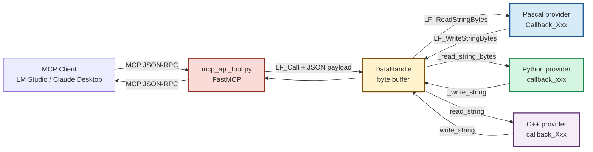

### 0.3 Three Perspectives

| Perspective | What it sees | Who owns it |
|-------------|--------------|-------------|
| **MCP client** | MCP JSON-RPC (`tools/call`, `tools/list`, etc.) | MCP protocol |
| **MCP gateway** | Tool definitions (JSON) + tool calls (JSON) | `mcp_api_tool.py` |
| **Provider (Pascal/Python/C++)** | Input JSON object + output JSON object | Generator output + user business logic |

**Key fact**: What the Provider sees is **not** MCP JSON-RPC — it is a **plain JSON object**, transported as a **UTF-8 + NUL** byte stream through the DataHandle.

### 0.4 The Seven Iron Rules

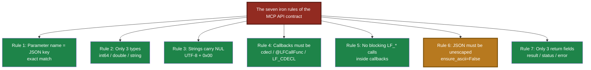

---

## Chapter 1  Precise Wire-Format Definition

### 1.1 Three-Layer Protocol Stack

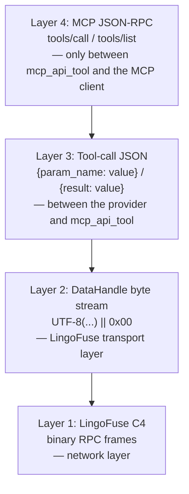

### 1.2 Precise Structure of a DataHandle

A `DataHandle` is a **growable byte buffer** managed by LingoFuse. On the provider side it appears as an opaque handle:

| Language | Handle type | Note |
|----------|-------------|------|
| Pascal | `TDataHnd___` = `Pointer` | opaque pointer |
| Python | `DataHnd` = `ctypes.c_void_p` | opaque pointer |
| C++ | `TDataHnd` = `void*` | opaque pointer |
| C ABI | `void*` | opaque pointer |

**The provider must never dereference these handles directly** — all reading and writing goes through the C ABI functions.

### 1.3 Byte Stream Format

**Call input** (client → provider):
```
[UTF-8 JSON bytes] [0x00]
```

**Call output** (provider → client):
```
[UTF-8 JSON bytes] [0x00]
```

**Examples**:
```
Input : {"a": 5, "b": 7}  →  7B 22 61 22 3A 20 35 2C 20 22 62 22 3A 20 37 7D 00
Output: {"result": 12}    →  7B 22 72 65 73 75 6C 74 22 3A 20 31 32 7D 00
```

### 1.4 Precise Semantics of the Read/Write Position

**A DataHandle has a "current position" pointer**:

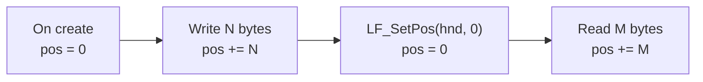

**Key operations**:

| Operation | Position change |
|-----------|-----------------|
| `LF_CreateData` | new handle, pos = 0 |
| `LF_WriteBuffer(hnd, buf, N)` | writes N bytes at pos, pos += N |
| `LF_ReadBuffer(hnd, buf, N)` | reads up to N bytes at pos, pos += actual bytes read |
| `LF_SetPos(hnd, P)` | pos = P (extends the buffer if P exceeds size) |
| `LF_GetPos(hnd)` | returns the current pos |
| `LF_GetSize(hnd)` | returns the total buffer size in bytes |

### 1.5 Two Reading Modes for the NUL Terminator

**Pascal `LF_ReadStringBytes`**:

```
1. Scan from pos, find the first 0x00.
2. If found:
   - Read all bytes in [pos, 0x00).
   - Advance pos to just after the 0x00.
3. If not found (the whole buffer is scanned without a 0x00):
   - Read all bytes in [pos, size).
   - Advance pos to size (end of buffer).
   - [Fault-tolerant mode] — this is part of the contract.
```

**Python `_read_string_bytes`** (helper in the generator):

```python
def _read_string_bytes(hnd) -> bytes:
    pos = LF_GetPos(hnd)
    size = LF_GetSize(hnd)
    if pos >= size:
        return b""
    ptr = LF_GetBuffer(hnd)
    if not ptr:
        return b""
    cptr = ctypes.cast(ptr, ctypes.POINTER(ctypes.c_byte))
    end = pos
    while end < size and cptr[end] != 0:
        end += 1
    if end < size:
        # found NUL
        data_len = end - pos
        if data_len == 0:
            LF_SetPos(hnd, end + 1)
            return b""
        raw = (ctypes.c_byte * data_len)()
        LF_ReadBuffer(hnd, raw, data_len)
        LF_SetPos(hnd, end + 1)
        return bytes(raw)
    else:
        # no NUL found (fault-tolerant)
        data_len = size - pos
        if data_len == 0:
            return b""
        raw = (ctypes.c_byte * data_len)()
        LF_ReadBuffer(hnd, raw, data_len)
        LF_SetPos(hnd, size)
        return bytes(raw)
```

**C++ `read_string`** (helper in the generator):

```cpp
static std::string read_string(TDataHnd hnd)
{
    const std::int64_t pos  = LF_GetPos(hnd);
    const std::int64_t size = LF_GetSize(hnd);
    if (pos < 0 || pos >= size)
        return std::string();
    const auto* base = static_cast<const std::uint8_t*>(LF_GetBuffer(hnd));
    if (base == nullptr)
        return std::string();
    std::int64_t end = pos;
    while (end < size && base[end] != 0)
        ++end;
    std::string result(
        reinterpret_cast<const char*>(base + pos),
        static_cast<std::size_t>(end - pos));
    LF_SetPos(hnd, end + 1);
    return result;
}
```

**The three implementations are semantically identical**: read `[pos, NUL)` or `[pos, size)`, then advance pos past the NUL or to size.

### 1.6 The Three-Way NUL-Writing Implementation

**Pascal `LF_WriteStringBytes`** (`lingofuse_import.pas`):
```pascal
// Semantics (source):
// 1. If Length(Value) > 0: LF_WriteBuffer(Hnd, @Value[0], Length(Value))
// 2. LF_WriteUInt8(Hnd, 0)   // append NUL
```

**Python `_write_string`** (generator):
```python
def _write_string(hnd, s):
    if isinstance(s, str):
        s = s.encode("utf-8")
    if len(s) > 0:
        LF_WriteBuffer(hnd, s, len(s))
    LF_WriteBuffer(hnd, b"\x00", 1)
```

**C++ `write_string`** (generator):
```cpp
static void write_string(TDataHnd hnd, const std::string& s)
{
    if (!s.empty())
        LF_WriteBuffer(hnd, s.data(), static_cast<std::int64_t>(s.size()));
    const char nul = 0;
    LF_WriteBuffer(hnd, &nul, 1);
}
```

**The three implementations are semantically identical**: UTF-8 bytes + a single `0x00`.

---

## Chapter 2  Type System and Mapping

### 2.1 The Only Allowed Trio

| Normalized type | Python type hint | JSON Schema type | JSON default | C++ type |
|:---------------:|:----------------:|:----------------:|:------------:|:--------:|
| `int64`  | `int`   | `integer` | `0`   | `std::int64_t` |
| `double` | `float` | `number`  | `0.0` | `double` |
| `string` | `str`   | `string`  | `""`  | `std::string` (return) / `const std::string&` (parameter) |

**That is the whole set.** No `bool`, no `bytes`, no arrays, no objects, no `Any`.

### 2.2 Type Normalization Rules

Various integer / floating-point / string types in the Pascal source are **normalized** to the three types above by `TPascal_Func_Model`:

| Source type | Normalized to |
|-------------|---------------|
| `Integer` / `LongInt` / `Word` / `Byte` / `Cardinal` / `SmallInt` / `ShortInt` / `Int64` / `UInt64` / `LongWord` / `DWord` | `int64` |
| `Single` / `Double` / `Extended` / `Real` | `double` |
| `string` / `AnsiString` / `UnicodeString` / `WideString` / `PChar` / `PAnsiChar` / `PWideChar` / `TP_String` / `TPascalString` / `TUPascalString` | `string` |

### 2.3 Handling of Unsupported Types

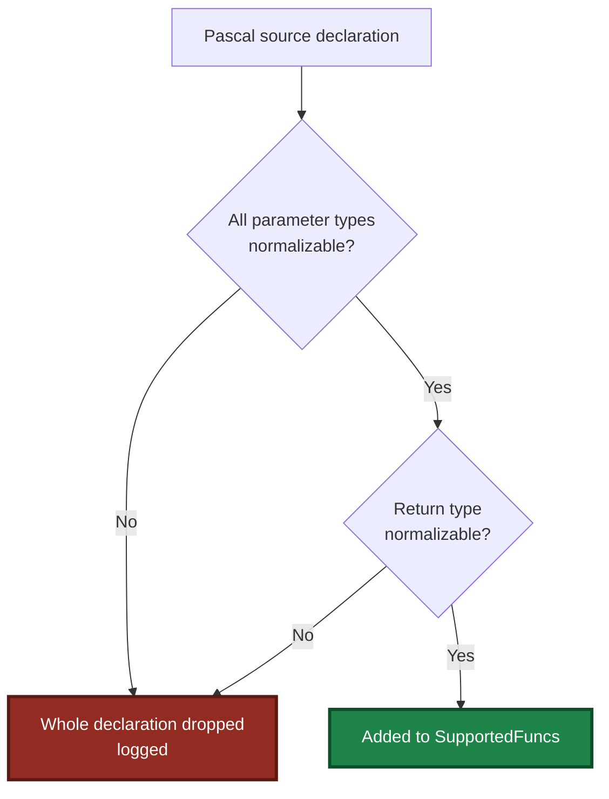

**Iron rule**: **the entire declaration is dropped**, not just the offending parameter.

### 2.4 List of Unsupported Types

| Category | Pascal | C | C++ |
|----------|--------|---|-----|
| Boolean | `Boolean` / `LongBool` / `ByteBool` / `WordBool` | `bool` / `_Bool` | `bool` |
| Variant | `Variant` / `OleVariant` | — | — |
| Array | `array of X` / `array[0..N] of X` | `X[]` / `X[N]` | `X[]` / `std::array` / `std::vector` |
| Record / struct | `TPoint` / custom `record` | `struct X` | `struct X` / `class X` |
| Date/time | `TDateTime` / `TDate` / `TTime` | `time_t` | `std::chrono::*` |
| Class | `TObject` / `TStringList` | — | — |
| Interface | `IInterface` / `IMyInterface` | — | — |
| Enum | `TColor` / custom `enum` | `enum X` | `enum class X` |
| Set | `set of X` | — | — |
| Generic | `TList<X>` / `TGenericList<X>` | — | `std::vector<X>` etc. |
| Event | `TNotifyEvent` / `TProc` | function pointer | `std::function` |
| Pointer | `Pointer` / `PInteger` / `PChar` | `void*` / `int*` | `void*` / `int*` |
| Anonymous method | `reference to procedure` | — | lambda (as a type) |

> **Cross-layer difference**: C's `void*` is accepted by the C parser, but it maps to Pascal `Pointer`, which is rejected during the `Z.Pascal_Func_Model` normalization stage. **C accepts ≠ Pascal accepts**.

### 2.5 Five-Point Consistency (Iron Rule)

The following five locations **must be strictly synchronized**:

| # | Location | Source type → generated code |
|:-:|----------|------------------------------|
| 1 | Pascal parameter extraction | `Int64` → `jo.I64['x']`<br>`Double` → `jo.F['x']`<br>`string` → `jo.S['x']` |
| 2 | Pascal return write | `Int64` → `jo.I64['result'] := ret`<br>`Double` → `jo.F['result'] := ret`<br>`string` → `jo.S['result'] := ret` |
| 3 | Python parameter extraction | `Int64` → `data.get('x') or 0`<br>`Double` → `data.get('x') or 0.0`<br>`string` → `data.get('x') or ""` |
| 4 | Python return write | Uniformly `json.dumps({"result": ret}, ensure_ascii=False)` |
| 5 | JSON Schema | `Int64` → `"type": "integer"`<br>`Double` → `"type": "number"`<br>`string` → `"type": "string"` |

**If any one is wrong**: the client may see a default value instead of the real return value.

---

## Chapter 3  DataHandle I/O Contract

### 3.1 Handle Lifecycle

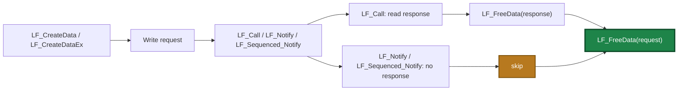

### 3.2 Release Responsibility Table

| Scenario | Handles to release | Count |
|----------|--------------------|:-----:|
| `LF_CreateData` → `LF_Call` | request handle + response handle | **2** |
| `LF_CreateData` → `LF_Notify` | request handle | **1** |
| `LF_CreateData` → `LF_Sequenced_Notify` | request handle | **1** |
| `LF_LocalCall` | input handle (caller-owned) + response handle | **2** |
| `LF_LocalNotify` | input handle (caller-owned) | **1** |
| Callback-received `_In` / `_Out` | **do not release** | **0** |

**Key rules**:
- **A request handle created by `LF_CreateData` must be paired with `LF_FreeData`, whether you call `LF_Call` or `LF_Notify`.**
- **`LF_Notify` / `LF_Sequenced_Notify` have no response handle.**
- **The `_In` / `_Out` in a callback are managed by the framework — do not release them.**
- Use `try..finally` to guarantee release on exception paths.
- **The 5-minute auto-reclaim is a safety net, not a routine mechanism.**

### 3.3 The Exact Request / Response Handle Pattern

**Pascal pattern**:

```pascal
var
  Req, Res: TDataHnd___;
begin
  Req := LF_CreateDataEx('my_api');
  try
    LF_WriteStringBytes(Req, SomeBytes);
    Res := LF_CallEx('my_app', Req, 5000);
  finally
    LF_FreeData(Req);
  end;

  if Res = nil then Exit;
  try
    SomeResult := LF_ReadStringBytes(Res);
  finally
    LF_FreeData(Res);
  end;
end;
```

**Python pattern** (see `language_middleware.py`):

```python
req = LF_CreateData(cstr('my_api'))
try:
    write_json(req, {'a': 5, 'b': 7})
    resp = LF_Call(cstr('my_app'), req, 5000)
finally:
    LF_FreeData(req)

if not resp:
    return None
try:
    _rewind(resp)
    result = read_json(resp)
finally:
    LF_FreeData(resp)
```

**C++ pattern** (see the generator):

```cpp
TDataHnd req = LF_CreateData("my_api");
if (req == nullptr) return false;
try {
    json payload;
    payload["a"] = 5;
    payload["b"] = 7;
    write_json(req, payload);
    TDataHnd resp = LF_Call("my_app", req, 5000);
    if (resp != nullptr) {
        try {
            json result = read_json(resp);
            // process result...
        } catch (...) { }
        LF_FreeData(resp);
    }
} catch (...) { }
LF_FreeData(req);
```

### 3.4 Holding a Handle Across Threads

**DataHandle is not thread-safe.** Across threads:

- **Use a separate handle per thread.**
- **Or lock externally.**
- **Never allowed**: one thread writing while another reads concurrently.

**Exception**: the `_In` / `_Out` in a callback are **valid only during the callback's execution**; they must not be accessed after the callback returns.

---

## Chapter 4  JSON No-Escape Contract

### 4.1 Iron Rule

> **Whenever an agent passes JSON, in every place, it must use the unescaped JSON format. This is a compatibility requirement.**

**Precise meaning of "unescaped"**: every non-ASCII character in the JSON (Chinese, Japanese, Korean, emoji, rare characters) must be emitted as **raw UTF-8 bytes**, **never escaped as a `\uXXXX` sequence**.

### 4.2 The Chain of Consequences When Violated

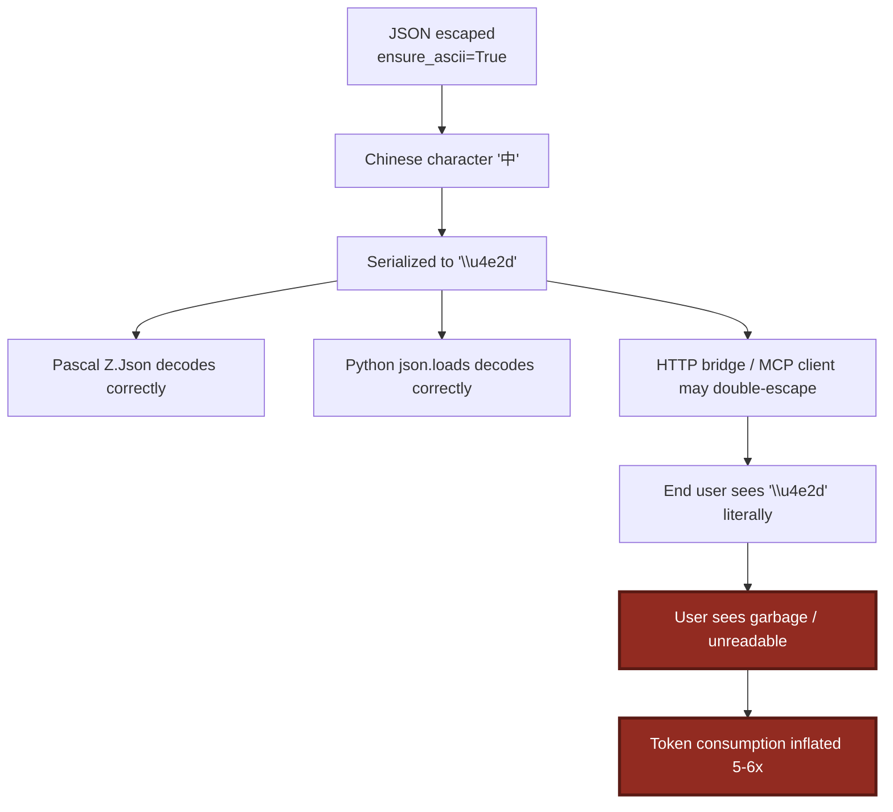

### 4.3 Correct Three-Way Implementations

| Stage | Correct form |
|-------|--------------|
| **Pascal serialization** | `jo.ToBytes` (`Z.Json` defaults to UTF-8) |
| **Python serialization** | `json.dumps(obj, ensure_ascii=False).encode("utf-8")` |
| **C++ serialization** | `obj.dump(-1, ' ', false, json::error_handler_t::replace)` (`nlohmann::json` does not escape non-ASCII by default) |
| **Transport layer** | Pass UTF-8 bytes directly; do not route through `string` / `AnsiString` |

### 4.4 Already Guaranteed by the Generator

Every `json.dumps` in the **Python generator** already has `ensure_ascii=False`:
```python
_write_string(_Out, json.dumps({"result": ret}, ensure_ascii=False).encode("utf-8"))
payload = json.dumps(tool_def, ensure_ascii=False).encode("utf-8")
payload = json.dumps({"message": msg}, ensure_ascii=False).encode("utf-8")
```

The **Pascal generator** uses `jo.ToBytes` throughout (`Z.Json` uses UTF-8 internally).

The **C++ generator** uses `write_json(out_hnd, obj)`, which internally calls `obj.dump(-1, ' ', false, ...)`; non-ASCII is not escaped by default.

**Conclusion**: as long as you do not hand-modify the generator, the no-escape contract is automatically satisfied.

### 4.5 Manual-Modification Checklist

- [ ] All `json.dumps` calls include `ensure_ascii=False`.
- [ ] No `json.dumps(...).encode("ascii")`.
- [ ] No `.encode("ascii", errors="replace")`.
- [ ] No `str(obj)` coercion followed by write-back (`str()` is safe for **strings/numbers**; for **custom objects** it falls back to `repr`, which may escape non-ASCII).
- [ ] No `TEncoding.ASCII.GetBytes(...)` on the Pascal side.
- [ ] No Pascal-side path that assigns `jo.ToJSONString(False).Text` to a `string` variable.

### 4.6 Anti-Examples

```python
# ❌ Anti-example 1: ensure_ascii defaults to True
_write_string(_Out, json.dumps({"result": ret}).encode("utf-8"))
# Output: b'{"result":"\\u4e2d\\u6587"}\x00'

# ❌ Anti-example 2: ascii encoding
_write_string(_Out, json.dumps({"result": ret}, ensure_ascii=False).encode("ascii"))
# Raises UnicodeEncodeError

# ❌ Anti-example 3: through repr
_write_string(_Out, json.dumps({"result": repr(ret)}, ensure_ascii=False).encode("utf-8"))
# Output: b'{"result":"\'\\u4e2d\\u6587\'"}\x00' (repr already escaped)

# ❌ Anti-example 4: double json.dumps
_write_string(_Out, json.dumps(json.dumps({"result": ret})))
# Output: b'"{\\"result\\": \\"\\\\u4e2d\\\\u6587\\"}"\x00'

# ✅ Correct
_write_string(_Out, json.dumps({"result": ret}, ensure_ascii=False).encode("utf-8"))
# Output: b'{"result":"\xe4\xb8\xad\xe6\x96\x87"}\x00'
```

### 4.7 Coordination with `mcp_api_tool.py`

`mcp_api_tool.py` performs DataHandle I/O through `lingofuse.lf_io`, which already guarantees internally:
- `write_json()` uses `ensure_ascii=False`.
- `read_json_or_bytes()` returns a decoded object (does not re-serialize).
- `cstr()` produces NUL-terminated UTF-8 bytes.

**Both ends consistent is the complete contract.**

---

## Chapter 5  Input JSON Contract

### 5.1 Input JSON Structure

The JSON object the provider reads from the `_In` handle:

```json
{
  "param1": value1,
  "param2": value2
}
```

**Key = parameter name**. The parameter name comes from `TParamStructure.Name`, which ultimately comes from the formal parameter names in the Pascal source. The generator **does not rename anything**.

### 5.2 Iron Rule: Parameter Name = JSON Key

**All of the following are forbidden**:
- Case transformation (`a` → `A`).
- Abbreviation (`target` → `tgt`).
- Prefixes/suffixes (`a` → `arg_a`).
- camelCase/snake_case conversion (`userName` → `user_name`).
- Any other "beautification".

**Reason**: the client uses the **original parameter name** as the JSON key. After renaming, the client sends `{"a": 5}`, but the provider reads `data.get("A")` and gets `None` → the default `0`.

### 5.3 Pascal-Side Parameter Extraction (generator output)

```pascal
jsonBytes := LF_ReadStringBytes(TDataHnd(_In___));
...
if not jo.Parae(jsonBytes) then
begin
  // write error
  Exit;
end;

a := jo.I64['a'];      // int64
b := jo.S['b'];        // string
c := jo.F['c'];        // double
```

**Contract**:
- Use the **parameter name itself** as the JSON key, **strictly case-sensitive**.
- A missing key returns the `Z.Json` default (`0` / `0.0` / `''`) — **no error is raised**.
- On type mismatch, `Z.Json` makes a best-effort conversion.

### 5.4 Python-Side Parameter Extraction (generator output)

```python
data = json.loads(json_bytes.decode("utf-8"))
a = data.get('a') or 0
b = data.get('b') or ""
c = data.get('c') or 0.0
```

**Contract**:
- `data.get(<name>)` returns `None` if missing.
- `or <default>` performs **falsy fallback**: `None` / `0` / `""` / `False` / `[]` are all replaced.
- **Side effect**: a caller intentionally passing `b=""` gets replaced with `""` (harmless); `a=0` gets replaced with `0` (harmless).
- **Side effect**: `a=False` gets replaced with `0` (but `bool` is not on the whitelist, so the client should not send it).

### 5.5 C++-Side Parameter Extraction (generator output)

```cpp
json req = read_json(in_hnd);
if (!req.is_object())
    req = json::object();

std::int64_t a = req.value("a", static_cast<std::int64_t>(0));
std::string b = req.value("b", std::string());
double c = req.value("c", 0.0);
```

**Contract**:
- `req.value(<name>, <default>)` returns the default if missing.
- No falsy fallback — `0` is just `0`.

### 5.6 Parameter Order and Naming Rules

| Rule | Description |
|------|-------------|
| Parameter order | matches the formal parameter order in the Pascal source; the generator does not reorder |
| Parameter names | Pascal/C++ strictly use the original; Python goes through `MakePythonIdentifier` (illegal characters replaced with `_`) |
| Empty-name parameters | use `p0` / `p1` / ... as placeholders |
| Python keyword conflicts | the generator **does not handle** this (e.g. a Pascal parameter named `class` produces illegal Python) |
| JSON key | **always the Pascal original name**, decoupled from the Python formal parameter name |

**Example**: a Pascal source parameter named `my-param` (not a legal Pascal identifier in practice):
- Pascal side: `my_param := jo.I64['my-param'];` (**JSON key is the original name**)
- Python side: `my_param = data.get('my-param') or 0` (**formal parameter is the cleaned name; JSON key is the original name**)

### 5.7 JSON Schema `parameters`

The generator produces:

```json
{
  "type": "object",
  "properties": {
    "a": {"type": "integer", "description": "First operand"},
    "b": {"type": "string",  "description": "Second operand"}
  },
  "required": ["a", "b"]
}
```

**Contract**:
- `required` **includes every parameter** (the generator always fills them all in).
- Each parameter's `type` must be `"integer"` / `"number"` / `"string"`.
- `description` comes from the Pascal source comment; the generator guarantees `ensure_ascii=False`.

**⚠️ Side effect of the `required` array**:

`required` includes every parameter → **every parameter is treated as required by the MCP client**. Concrete implications:

- Parameters that were originally "optional" (e.g. with a default value) are treated as required by the client.
- MCP clients (LM Studio, etc.) do not automatically treat a parameter as optional just because it has a default value.
- To have truly "optional parameters," the generator would need to **exclude parameters with default values** — **not currently supported**.

---

## Chapter 6  Output JSON Contract

### 6.1 The Three Response Shapes

| Case | Response JSON | Trigger condition |
|------|---------------|-------------------|
| **Function success** | `{"result": <value>}` | `IsFunction=True` and no exception |
| **Procedure success** | `{"status": "ok"}` | `IsFunction=False` and no exception |
| **Any error** | `{"error": "<msg>"}` | empty input / invalid JSON / business exception |

### 6.2 Function Success: the `result` Key

**The only allowed return field name is `result` (all lowercase).**

| Normalized return type | Pascal write | Python write | C++ write | JSON value |
|:----------------------:|--------------|--------------|-----------|-----------:|
| `int64`  | `jo.I64['result'] := ret` | `json.dumps({"result": ret})` | `resp["result"] = ret` | integer |
| `double` | `jo.F['result'] := ret`   | same | same | float |
| `string` | `jo.S['result'] := ret`   | same | same | string |

**Forbidden**:
- Renaming the key to `return` / `value` / `data` / `output`.
- Changing the case (`Result` / `RESULT`).
- Pushing a `double` into `jo.S['result']` (it becomes a string).

### 6.3 Procedure Success: the `status` Key

**The only allowed success field name is `status`**, and its value **must** be the string `"ok"`.

```pascal
jo.S['status'] := 'ok';
```

```python
json.dumps({"status": "ok"}, ensure_ascii=False)
```

**Forbidden**:
- `{"success": true}` / `{"ok": 1}` / `{"status": "success"}`.
- Returning `{"result": null}` to masquerade as a procedure.

### 6.4 Error: the `error` Key

**The only allowed error field name is `error`**, and its value is a string.

**Contract**:
- **The presence of an `error` field indicates failure.**
- `error` may coexist with other fields, but clients usually only read `error`.
- Priority order: empty input → invalid JSON → business exception. All three write `error`.
- **Do not** add `error_code` / `stack_trace` / `error_type`.

### 6.5 Precise Handling of Empty Input and Invalid JSON

**Pascal side**:

```pascal
if Length(jsonBytes) = 0 then
begin
  errMsg := 'Empty input';
  jo.Clear;
  jo.S['error'] := errMsg;
  LF_WriteStringBytes(TDataHnd(_Out___), jo.ToBytes);
  Exit;
end;

if not jo.Parae(jsonBytes) then
begin
  errMsg := 'Invalid JSON';
  jo.Clear;
  jo.S['error'] := errMsg;
  LF_WriteStringBytes(TDataHnd(_Out___), jo.ToBytes);
  Exit;
end;
```

**Python side**:

```python
if not json_bytes:
    _write_string(_Out, json.dumps({"error": "Empty input"}).encode("utf-8"))
    return

try:
    data = json.loads(json_bytes.decode("utf-8"))
except Exception as _parse_err:
    _write_string(_Out, json.dumps({"error": f"Invalid JSON: {_parse_err}"}).encode("utf-8"))
    return
```

**Error message format comparison**:

| Scenario | Pascal side | Python side |
|----------|-------------|-------------|
| Empty input | **exactly** `"Empty input"` | **exactly** `"Empty input"` |
| Invalid JSON | **exactly** `"Invalid JSON"` | **prefixed with** `"Invalid JSON"` followed by `: <specific error>` |

**Client-side detection recommendation**:

```python
err = resp.get("error", "")
if err.startswith("Invalid JSON"):
    # invalid JSON
elif err == "Empty input":
    # empty input
else:
    # other error
```

**Do not change these two messages** — some test scripts string-match them.

### 6.6 Exception Fallback

**Pascal side**:

```pascal
except
  on E: Exception do
  begin
    jo.Clear;
    jo.S['error'] := E.Message;
    LF_WriteStringBytes(TDataHnd(_Out___), jo.ToBytes);
  end;
end;
```

**Python side**:

```python
except Exception as _err:
    try:
        _write_string(_Out, json.dumps({"error": str(_err)}).encode("utf-8"))
    except Exception:
        pass
```

**C++ side**:

```cpp
catch (const std::exception& e) {
    try {
        json err;
        err["error"] = std::string(e.what());
        write_json(out_hnd, err);
    } catch (...) {}
}
catch (...) {
    try {
        json err;
        err["error"] = std::string("unknown exception");
        write_json(out_hnd, err);
    } catch (...) {}
}
```

**Contract**:
- **Must** catch all exceptions.
- **Must** ensure `_Out` is written at least once (even if the write fails, the client must not hang).
- **Never** let an exception propagate to the C ABI layer — the C4 thread pool silently swallows exceptions.

### 6.7 Three-Point Consistency of the Return Value Type

**The return value of a single function must be consistent across three places**:

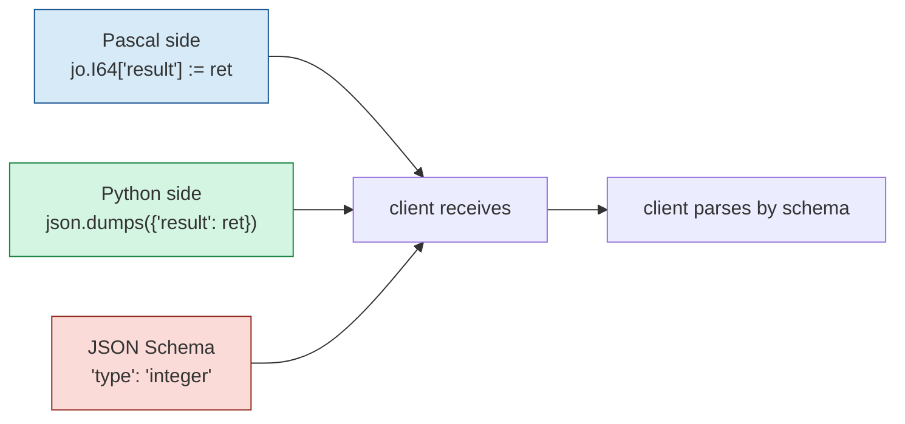

**If any one is wrong**: the client may see a default value instead of the real return value.

---

## Chapter 7  Callback Signature Contract

### 7.1 Pascal Callback Signature (mandatory)

```pascal
procedure Callback_<Name>_<ApiName>(
    _Trigger___: Pointer;
    _In___ , _Out___: TDataHnd___);
  cdecl;
```

| Part | Constraint |
|------|------------|
| Function name | `Callback_<MakeApiName(Name)>_<UniqueApiName>` |
| `_Trigger___` | a user pointer; the generator passes `nil`; **do not dereference** |
| `_In___` / `_Out___` | opaque `TDataHnd___` handles, **must not be cast** |
| `cdecl` | **required**. Removing it causes stack misalignment, crashes, or silent failure |
| Return value | **none** (`procedure`, not `function`) |

**Semantics of `MakeApiName`**:
```pascal
Result := FuncName.ReplaceChar(#32#9'./\@', '_');
```
Replaces `space` / `Tab` / `.` / `/` / `\` / `@` with `_`.

**Example**: source function `Foo/Bar` → `Callback_Foo_Bar_Foo_Bar`.

### 7.2 Python Callback Signature (mandatory)

```python
@LFCallFunc
def callback_<name>(_Trigger, _In, _Out):
    ...
```

| Part | Constraint |
|------|------------|
| Decorator | `@LFCallFunc` **must be kept** — it handles the ctypes C-ABI conversion |
| Function name | `callback_<MakePythonIdentifier(Name)>`, unique |
| Parameter names | `_Trigger` / `_In` / `_Out` are conventions of the LingoFuse Python binding, **do not change** |
| Parameters | **three positional parameters**, no defaults, no `*args` |
| Return | `return` is only used for early exit; it does not carry data |

### 7.3 C++ Callback Signature (mandatory)

```cpp
static void LF_CDECL callback_<name>(void* _Trigger, void* _In, void* _Out)
{
    (void)_Trigger;
    TDataHnd in_hnd  = static_cast<TDataHnd>(_In);
    TDataHnd out_hnd = static_cast<TDataHnd>(_Out);
    ...
}
```

| Part | Constraint |
|------|------------|
| `LF_CDECL` | **required** — C ABI hard constraint |
| Function name | `callback_<MakeApiName(Name)>`, unique |
| Parameters | three `void*`, **do not change** |
| Return value | `void` |

### 7.4 Callback Threading Model

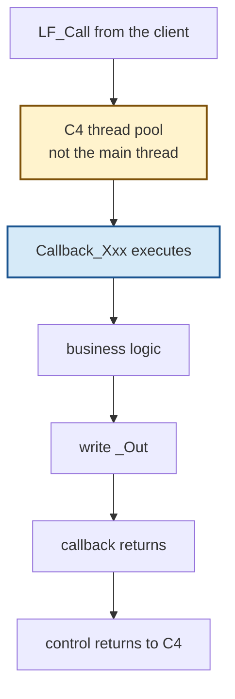

**Contract**:
- Callbacks execute in the **C4 background thread pool**, **not the main thread**.
- **Forbidden**:
  - Accessing UI controls (VCL / LCL / GDI)
  - Calling blocking LF functions: `LF_Call` / `LF_LocalCall` / `LF_Notify` / `LF_PrepareDone` / `LF_Shutdown`
  - Long `Sleep`
  - Triggering another `LF_RegisterCall`
- **Recommended**:
  - Only read `_In`, write `_Out`, and return quickly
  - Hand off long-running work to `TCompute.RunC_NP` / `TThread.CreateAnonymousThread` / Python `threading.Thread`
  - When UI is needed, use `TThread.Queue` (Pascal) / `asyncio` (Python)

### 7.5 Naming Differences of the Internal Call Stub (`internal_call_*`)

> **⚠️ The naming rules differ across the three languages — this is by design**:

| Language | Naming rule | Example (source function `Foo`) |
|----------|-------------|---------------------------------|
| **Pascal** | `internal_call_<MakeApiName(Name)>_<UniqueApiName>` (**two-part suffix**) | `internal_call_Foo_Foo` |
| **Python** | `internal_call_<MakePythonIdentifier(Name)>` (**one-part suffix**) | `internal_call_foo` |
| **C++** | `internal_call_<MakeApiName(Name)>` (**one-part suffix**) | `internal_call_Foo` |

**Pascal-generated stub**:

```pascal
function internal_call_Foo_Foo(a: Int64; b: string): Int64;
(*
{$IFDEF FPC}
  procedure Do_Sync___();
  begin
    // call type: Result := internal_call_Foo_Foo(a, b);
  end;
{$ELSE FPC}
var temp_: Int64;
{$ENDIF FPC}
*)
begin
  Result := 0;
  // call type: Result := internal_call_Foo_Foo(a, b);
  (*
  {$IFDEF FPC}
    TCompute.Sync(Do_Sync___);
  {$ELSE FPC}
    TCompute.Sync(procedure()
    begin
      // call type: temp_ := internal_call_Foo_Foo(a, b);
    end);
    Result := temp_;
  {$ENDIF FPC}
  *)
end;
```

**Python-generated stub**:

```python
def internal_call_foo(a: int, b: str) -> int:
    """Wrapper for the original routine 'Foo'.
    TODO: replace this placeholder with the actual implementation.
    """
    if DEBUG_LOG:
        print(f"[internal_call_foo] called")
    # Default return value; replace with actual logic.
    return 0
```

**C++-generated stub**:

```cpp
std::int64_t internal_call_Foo(std::int64_t a, const std::string& b)
{
    // TODO: replace this placeholder with the actual implementation.
    return 0;
}
```

**Shared contract (all three)**:
- This is **the entry point where a human fills in the real business logic**.
- When filling it in, **do not** change the function signature.
- Pascal side: the `// call type: ...` comment **must be kept**.
- Pascal side: the `(* ... TCompute.Sync ... *)` block is an **optional** switch for "should this run on the main thread". **Commented out by default**.
- Python side: keep the `TODO` comment.
- C++ side: keep the `TODO` comment.
- The default return value `0` / `0.0` / `""` is a **placeholder** and must be replaced.

---

## Chapter 8  Tool Registration JSON Contract

### 8.1 The JSON Sent by `RegisterTool`

```json
{
  "name": "<ApiName>",
  "description": "<extracted from comments>",
  "target_app": "<MY_APP_NAME>",
  "target_api": "<ApiName>",
  "parameters": {
    "type": "object",
    "properties": {
      "<param_name>": {
        "type": "integer|number|string",
        "description": "<param description>"
      }
    },
    "required": ["<param_name>", ...]
  }
}
```

### 8.2 Field Constraints

| Field | Constraint |
|-------|------------|
| `name` | required, tool name (= `ApiName`) |
| `description` | required, extracted from comments |
| `target_app` | required, **must** equal `MY_APP_NAME` |
| `target_api` | required, **must** equal `name` |
| `parameters` | required, JSON Schema |
| `parameters.type` | required, **must** be `"object"` |
| `parameters.properties` | required, one entry per parameter |
| `parameters.properties.<name>.type` | required, `"integer"` / `"number"` / `"string"` |
| `parameters.properties.<name>.description` | optional |
| `parameters.required` | required, **includes every parameter** |

### 8.3 Beacon Response Contract

**Success**:
```json
{"status": "ok"}
```

**Failure**:
```json
{"status": "error", "message": "..."}
```

**Contract**:
- The provider judges success by: `resp.get("status") == "ok"`.
- If the beacon returns `{"error": "..."}` (no `status`), treat it as failure.
- **Do not** add extra success conditions.

### 8.4 Complete Registration Example

```json
{
  "name": "add",
  "description": "Add two integers: a + b",
  "target_app": "my_calculator",
  "target_api": "add",
  "parameters": {
    "type": "object",
    "properties": {
      "a": {
        "type": "integer",
        "description": "First operand"
      },
      "b": {
        "type": "integer",
        "description": "Second operand"
      }
    },
    "required": ["a", "b"]
  }
}
```

---

## Chapter 9  App Name and Endpoint Contract

### 9.1 App Name Derivation Rule

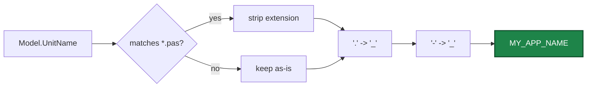

**Examples**:

| Source unit name | `MY_APP_NAME` |
|------------------|---------------|
| `calculator.pas` | `calculator` |
| `my.utils.pas` | `my_utils` |
| `foo-bar.pas` | `foo_bar` |
| `MyUnit` | `MyUnit` (case preserved) |

**Contract**:
- **Do not hand-change `MY_APP_NAME`** — it is the key for the client's `LF_Call(appName, ...)`.
- Two providers use the **same derivation logic** — same names collide.

### 9.2 Fixed Beacon Constants

The generator **hardcodes** four constants:

| Constant | Value | Purpose |
|----------|-------|---------|
| `BEACON_APP` | `'agent_main_app'` | Beacon app name |
| `REGISTER_API` | `'register_agent'` | Tool registration API |
| `AGENT_LOG_API` | `'agent_log'` | Async log API |
| `IPC_ENDPOINT` | `'ipc:agent'` | IPC endpoint |

**Contract**:
- **Do not change these four values** — `mcp_api_tool.py` uses the same defaults.
- If you really must customize them, change **both client and server sides** and update `mcp_api_tool.py`'s `--endpoint` / `--reg-agent-app` / `--agent-log-api` accordingly.

### 9.3 Multi-Provider Coexistence Conflict

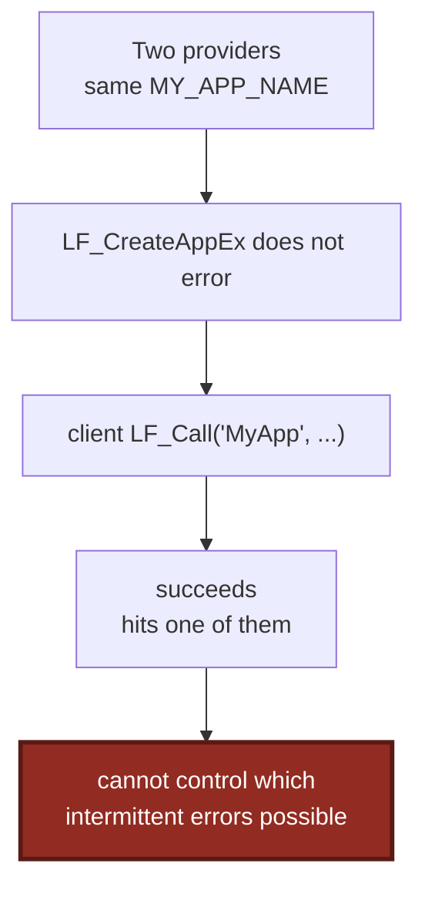

**Actual behavior**:
- `LF_Call('MyApp', ...)` **succeeds** — it hits one of them (the **first registered** or the **last registered**, depending on the LingoFuse kernel's load balancing).
- **It is not "silent failure"** — the client gets a result.
- **You cannot control which one is hit** — if the two providers' API definitions differ, **intermittent failure** is possible.

**Fix**: keep unit names unique.

---

## Chapter 10  Startup Sequence Contract

### 10.1 The Precise Flow of `Execute_And_Reg_all()`

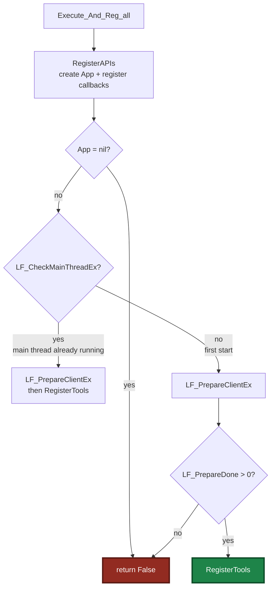

### 10.2 Precise Definition of the Startup Flow

**Pascal-generated `Execute_And_Reg_all`**:

```pascal
function Execute_And_Reg_all: Boolean;
var
  App: TAppHnd___;
begin
  Result := False;
  App := RegisterAPIs();
  if App = nil then
  begin
    if DEBUG_LOG then DoStatus('[Execute_And_Reg_all] RegisterAPIs failed');
    Exit;
  end;
  if LF_CheckMainThreadEx then
  begin
    LF_PrepareClientEx(IPC_ENDPOINT, App);
    Result := RegisterTools();
  end
  else
  begin
    LF_PrepareClientEx(IPC_ENDPOINT, App);
    if LF_PrepareDone() > 0 then
      Result := RegisterTools()
    else
    begin
      if DEBUG_LOG then DoStatus('[Execute_And_Reg_all] LF_PrepareDone failed');
    end;
  end;
end;
```

**Python-generated `Execute_And_Reg_all`**:

```python
def Execute_And_Reg_all() -> bool:
    app = RegisterAPIs()
    if app is None:
        if DEBUG_LOG:
            print(f"[Execute_And_Reg_all] RegisterAPIs failed")
        return False

    LF_ResetPrepare()
    LF_PrepareClient(IPC_ENDPOINT.encode("utf-8"), app)
    if LF_PrepareDone() > 0:
        return RegisterTools()
    if DEBUG_LOG:
        print(f"[Execute_And_Reg_all] LF_PrepareDone failed")
    return False
```

### 10.3 Startup Contract

**Must follow**:
- **Do not** reorder the steps.
- **Do not** skip `LF_ResetPrepare`.
- **Do not** substitute `LF_Call` for `LF_PrepareClientEx`.
- **`Execute_And_Reg_all` is not idempotent**: calling it twice may fail because `LF_PrepareDone` returns 1 only once.

### 10.4 Shutdown Contract

**Python-generated `__main__`**:

```python
if __name__ == "__main__":
    print(f"=== {MY_APP_NAME} tool provider ===")
    if not Execute_And_Reg_all():
        print("Startup failed.")
        sys.exit(1)
    print("Ready. Type 'exit' and press Enter to quit.")
    try:
        while True:
            line = input()
            if line.strip().lower() == "exit":
                break
    except (KeyboardInterrupt, EOFError):
        pass
    LF_ExitMainThread()
    LF_Shutdown()
    print("Shutdown complete.")
```

**Pascal host** (the provider is a unit; there is no `__main__`):

```pascal
// when the host program exits:
LF.ExitMainThread;
LF.Shutdown;
App.Free;
```

**Shared contract (all three)**:
- **Must** call `LF_ExitMainThread` + `LF_Shutdown` before the process exits.
- **Do not** remove the Python `input()` loop — it keeps the process alive so the C4 background threads keep handling requests.
- **Do not** rewrite the Python side to use `asyncio.run` — the provider only needs the process to stay alive.
- **Pascal side**: host exit order is `LF_ExitMainThread` → `LF_FreeApp` → `LF_Shutdown`.

---

## Chapter 11  Comment and Docstring Contract

### 11.1 Preserved Comments (AI must not rewrite)

| Location | Comment | Reason |
|----------|---------|--------|
| Pascal `internal_call_*` | `// call type: Result := ...` | marks the fill-in point |
| Pascal `internal_call_*` | `(* ... {$IFDEF FPC} ... *)` block | optional main-thread-sync switch |
| Python `internal_call_*` | `"""Wrapper for the original routine ... TODO: replace ..."""` | marks the fill-in point |
| Python `internal_call_*` | `# Default return value; replace with actual logic.` | marks the placeholder |
| C++ `internal_call_*` | `// TODO: replace this placeholder with the actual implementation.` | marks the fill-in point |
| Pascal callback | `// ---- <Name> (API: <ApiName>) ----` | locating marker |
| File header | the entire docstring | describes generator version and entry |

### 11.2 Comments AI Must Not Add

- **Explanatory comments**: `// this is an addition function` — duplicates the source comment.
- **"Improvement suggestion" comments**: `// TODO: implement with a faster method` — pollutes the source file.
- **"Contract explanation" comments**: `// this parameter must be int64` — this document is the source of truth for the contract.
- **Version marker comments**: `// new in v2.0` — belongs in a changelog.
- **Type hint comments**: `# type: ignore` — types are already expressed by the formal parameters and the JSON schema.

### 11.3 Comments AI May Add

- **Business logic comments**: inside the `internal_call_*` implementation, explaining the specific algorithm.
- **Data source comments**: if a value comes from a database / file, note the source.
- **Performance comments**: `# this step is O(n log n)`
- **Exception path comments**: `# if x is 0, take the fallback branch`

**General principle**: **contract-related, leave it alone; business-related, your call**.

### 11.4 Docstrings

**Python**:
- `internal_call_*` docstrings **keep**, may **append** business notes.
- `callback_*` docstrings **do not touch**.

**Pascal**:
- The `// ---- ... ----` single-line comment on `internal_call_*` may append business notes.
- The `{* ... *}` XMLDoc of `RegisterAPIs` / `RegisterTools` / `Execute_And_Reg_all` **do not touch**.

**C++**:
- Keep the `// TODO` comment on `internal_call_*`; may append business notes.
- Do not touch the file header comment.

---

## Chapter 12  Client Reference Implementations

### 12.1 Pascal Client (calling a provider)

```pascal
uses
  SysUtils, Classes,
  Z.Core, Z.Json, Z.PascalStrings,
  lingofuse_import, lingofuse_helper;

function CallAdd(const AppName: string; a, b: Int64): Int64;
var
  Req, Res: TDataHnd___;
  jsonBytes: TBytes;
  jo: TZ_JsonObject;
begin
  Result := 0;

  // 1. create request handle
  Req := LF_CreateDataEx('add');
  if Req = nil then Exit;
  try
    // 2. build request JSON
    jo := TZ_JsonObject.Create;
    try
      jo.I64['a'] := a;
      jo.I64['b'] := b;
      LF_WriteStringBytes(Req, jo.ToBytes);
    finally
      jo.Free;
    end;

    // 3. call the remote API
    Res := LF_CallEx(AppName, Req, 5000);
  finally
    LF_FreeData(Req);
  end;

  if Res = nil then Exit;
  try
    // 4. read the response
    jsonBytes := LF_ReadStringBytes(Res);
    if Length(jsonBytes) = 0 then Exit;

    jo := TZ_JsonObject.Create;
    try
      if not jo.Parae(jsonBytes) then Exit;
      if jo.Exists('error') then
      begin
        WriteLn('Error: ', jo.S['error']);
        Exit;
      end;
      if jo.Exists('result') then
        Result := jo.I64['result'];
    finally
      jo.Free;
    end;
  finally
    LF_FreeData(Res);
  end;
end;
```

### 12.2 Python Client (calling a provider)

```python
import ctypes
from lingofuse._lf_native import (
    LF_CreateData, LF_FreeData, LF_Call,
    LF_WriteBuffer, LF_ReadBuffer, LF_GetPos, LF_SetPos,
    LF_GetSize, LF_GetBuffer,
)
from lingofuse.lf_io import (
    write_json, read_json, read_json_or_bytes, cstr,
)


def call_add(app_name: str, a: int, b: int) -> int:
    """Call the provider's add API and return the result. Return 0 on failure."""
    # 1. create request handle
    req = LF_CreateData(cstr('add'))
    if not req:
        return 0
    try:
        # 2. build request JSON
        write_json(req, {'a': a, 'b': b})

        # 3. call the remote API
        resp = LF_Call(cstr(app_name), req, 5000)
    finally:
        LF_FreeData(req)

    if not resp:
        return 0
    try:
        # 4. read the response (fault-tolerant mode)
        _rewind(resp)
        result = read_json(resp)
        if not isinstance(result, dict):
            return 0
        if 'error' in result:
            print(f"Error: {result['error']}")
            return 0
        return int(result.get('result', 0))
    finally:
        LF_FreeData(resp)


def _rewind(hnd):
    """Reset the DataHandle's read position to 0."""
    LF_SetPos(hnd, 0)
```

### 12.3 C++ Client (calling a provider)

```cpp
#include "LingoFuse.h"
#include "json.hpp"
using json = nlohmann::json;

static std::string read_string(TDataHnd hnd) {
    const std::int64_t pos  = LF_GetPos(hnd);
    const std::int64_t size = LF_GetSize(hnd);
    if (pos < 0 || pos >= size) return {};
    const auto* base = static_cast<const std::uint8_t*>(LF_GetBuffer(hnd));
    if (!base) return {};
    std::int64_t end = pos;
    while (end < size && base[end] != 0) ++end;
    std::string result(reinterpret_cast<const char*>(base + pos),
                       static_cast<std::size_t>(end - pos));
    LF_SetPos(hnd, end + 1);
    return result;
}

static void write_string(TDataHnd hnd, const std::string& s) {
    if (!s.empty())
        LF_WriteBuffer(hnd, s.data(), static_cast<std::int64_t>(s.size()));
    const char nul = 0;
    LF_WriteBuffer(hnd, &nul, 1);
}

std::int64_t call_add(const std::string& app_name, std::int64_t a, std::int64_t b)
{
    TDataHnd req = LF_CreateData("add");
    if (!req) return 0;

    TDataHnd resp = nullptr;
    try {
        json payload;
        payload["a"] = a;
        payload["b"] = b;
        write_string(req, payload.dump(-1, ' ', false));
        resp = LF_Call(app_name.c_str(), req, 5000);
    } catch (...) { }

    LF_FreeData(req);

    if (!resp) return 0;
    std::int64_t result = 0;
    try {
        const std::string s = read_string(resp);
        if (!s.empty()) {
            json obj = json::parse(s);
            if (obj.contains("error"))
                return 0;
            if (obj.contains("result"))
                result = obj.value("result", static_cast<std::int64_t>(0));
        }
    } catch (...) { }
    LF_FreeData(resp);
    return result;
}
```

### 12.4 Client Error-Handling Matrix

| Response case | Detection | Handling |
|---------------|-----------|----------|
| Empty response (timeout) | `LF_GetSize(resp) == 0` | Return default or error |
| `{"error": "..."}` | `resp.get('error')` | Log and return default |
| `{"result": ...}` | `resp.get('result')` | Return the result |
| `{"status": "ok"}` | `resp.get('status') == "ok"` | Procedure succeeded |
| Invalid JSON | `json.loads` raises | Log and return default |
| `null` handle | `resp is None` | Log and return default |

---

## Chapter 13  Byte-Level Wire-Format Examples

### 13.1 Input Example: `{"a": 5, "b": 7}`

**UTF-8 encoding**:
```
7B 22 61 22 3A 20 35 2C 20 22 62 22 3A 20 37 7D
{  "  a  "  :     5  ,     "  b  "  :     7  }
```

**With a trailing NUL**:
```
7B 22 61 22 3A 20 35 2C 20 22 62 22 3A 20 37 7D 00
```

**DataHandle buffer**:
- pos = 0
- size = 17
- bytes: `7B 22 61 22 3A 20 35 2C 20 22 62 22 3A 20 37 7D 00`

**Read flow**:
1. `LF_GetPos(hnd)` → `0`
2. `LF_GetSize(hnd)` → `17`
3. `LF_GetBuffer(hnd)` → pointer to the buffer's first byte
4. Scan to `0x00` (index 16)
5. `LF_ReadBuffer(hnd, buf, 16)` → copies 16 bytes into buf
6. `LF_SetPos(hnd, 17)` → pos = 17

**Result**: `b'{"a": 5, "b": 7}'`

### 13.2 Input Example: With Chinese

**JSON logical value**: `{"name": "中文"}`

**UTF-8 encoding**:
```
7B 22 6E 61 6D 65 22 3A 20 22 E4 B8 AD E6 96 87 22 7D
{  "  n  a  m  e  "  :     "  中       文        "  }
```

**With a trailing NUL**:
```
7B 22 6E 61 6D 65 22 3A 20 22 E4 B8 AD E6 96 87 22 7D 00
```

**Total length**: 19 bytes (including NUL)

**Wrong example (escaped form)**:
```
7B 22 6E 61 6D 65 22 3A 20 22 5C 75 34 45 32 44 5C 75 36 35 38 37 22 7D 00
{  "  n  a  m  e  "  :     "  \  u  4  E  2  D  \  u  6  5  8  7  "  }
```
**Consequence**: token consumption inflates from 7 bytes (`"中文"`) to 17 bytes (`"\u4E2D\u6587"`).

### 13.3 Output Example: `{"result": 12}`

**UTF-8 encoding + NUL**:
```
7B 22 72 65 73 75 6C 74 22 3A 20 31 32 7D 00
{  "  r  e  s  u  l  t  "  :     1  2  }  \0
```

**Total length**: 15 bytes

### 13.4 Output Example: `{"status": "ok"}`

**UTF-8 encoding + NUL**:
```
7B 22 73 74 61 74 75 73 22 3A 20 22 6F 6B 22 7D 00
{  "  s  t  a  t  u  s  "  :     "  o  k  "  }  \0
```

**Total length**: 17 bytes

### 13.5 Output Example: `{"error": "Invalid JSON"}`

**UTF-8 encoding + NUL**:
```
7B 22 65 72 72 6F 72 22 3A 20 22 49 6E 76 61 6C 69 64 20 4A 53 4F 4E 22 7D 00
```

**Total length**: 27 bytes

### 13.6 Large-Payload Example

**10 KB JSON**: about 10240 bytes + 1 NUL byte = 10241 bytes.

**LingoFuse chunking strategy**:
- Below 61440 bytes (`C_Buffer_Chunk_Size`): single-chunk transfer.
- Above 61440 bytes: chunked transfer.

**Impact on large payloads**:
- The provider side is unaware — `LF_ReadStringBytes` reads everything at once.
- Memory usage: the payload size + one copy (inside `LF_ReadStringBytes`).

### 13.7 Cross-Language Byte Comparison Table

| Scenario | Pascal | Python | C++ |
|----------|--------|--------|-----|
| Empty JSON `{}` | `7B 7D 00` | same | same |
| `{"a":1}` | `7B 22 61 22 3A 31 7D 00` | same | same |
| `{"a":1,"b":"x"}` | `7B 22 61 22 3A 31 2C 22 62 22 3A 22 78 22 7D 00` | same | same |
| Chinese `{"k":"中"}` | `7B 22 6B 22 3A 22 E4 B8 AD 22 7D 00` | same | same |
| Emoji `{"k":"😀"}` | `7B 22 6B 22 3A 22 F0 9F 98 80 22 7D 00` | same | same |

**Key point**: all three must produce **exactly the same byte sequence** (JSON field order excepted). Different field order does not affect semantics (JSON objects are unordered).

---

## Chapter 14  Anti-Patterns

### 14.1 Renaming a Parameter

```python
# ❌ Wrong: renaming 'a' to 'x'
def callback_add(_Trigger, _In, _Out):
    data = json.loads(...)
    x = data.get('a') or 0
```

**Consequence**: the client sends `{"a": 5}`, but the provider reads `data.get('x')` and gets `None` → `0`.

**Correct**:
```python
    a = data.get('a') or 0
```

### 14.2 Renaming the Return Field

```pascal
// ❌ Wrong: renaming 'result' to 'value'
jo.I64['value'] := ret;
```

**Correct**:
```pascal
jo.I64['result'] := ret;
```

### 14.3 Forgetting `cdecl`

```pascal
// ❌ Wrong
procedure Callback_Add_Add(_Trigger___: Pointer; _In___, _Out___: TDataHnd___);
```

**Correct**:
```pascal
procedure Callback_Add_Add(_Trigger___: Pointer; _In___, _Out___: TDataHnd___); cdecl;
```

### 14.4 Dropping the NUL Terminator

```python
# ❌ Wrong: forgot the NUL when hand-writing a callback
LF_WriteBuffer(_Out, json.dumps({"result": ret}).encode("utf-8"), len(...))
# missing LF_WriteBuffer(_Out, b"\x00", 1)
```

**Consequence**: the Pascal side's fault-tolerant mode can still read all content, but in multi-field DataHandle scenarios the wrong content is read.

**Correct**: use the generator's `_write_string`, or manually append `b"\x00"`.

### 14.5 `ensure_ascii` Not Turned Off

```python
# ❌ Wrong: ensure_ascii defaults to True
_write_string(_Out, json.dumps({"result": "中文"}))
# Actually writes: b'{"result": "\\u4e2d\\u6587"}\x00'
```

**Correct**:
```python
_write_string(_Out, json.dumps({"result": "中文"}, ensure_ascii=False).encode("utf-8"))
```

### 14.6 Calling a Blocking Function Inside a Callback

```pascal
// ❌ Wrong
procedure Callback_Foo_Foo(...); cdecl;
begin
  Other := LF_CallEx('OtherApp', SomeData, 5000);  // deadlock
end;
```

**Correct**:
```pascal
procedure Callback_Foo_Foo(...); cdecl;
begin
  TCompute.RunC_NP(procedure
  begin
    Other := LF_CallEx('OtherApp', SomeData, 5000);
  end);
end;
```

### 14.7 Manually Releasing `_In` / `_Out` Inside a Callback

```pascal
// ❌ Wrong
procedure Callback_Foo_Foo(...); cdecl;
begin
  LF_FreeData(_In___);   // double free
  LF_FreeData(_Out___);  // 
end;
```

**Correct**: **never** release `_In` / `_Out`.

### 14.8 Returning `bool`

```pascal
// ❌ Wrong: using bool as the return type
function MyFunc: Boolean;
```

**Consequence**: the whole declaration is dropped.

**Correct**: use `Int64` returning 0/1.

### 14.9 Parameter of Type `array of string`

```pascal
// ❌ Wrong
function MyFunc(items: array of string): Int64;
```

**Consequence**: the whole declaration is dropped.

**Correct**: pass arrays as a JSON `string`.

### 14.10 Changing `MY_APP_NAME`

```pascal
// ❌ Wrong: hand-edited MY_APP_NAME
MY_APP_NAME : string = 'my_special_name';
```

**Consequence**: the client's `LF_Call(appName, ...)` cannot find the server.

### 14.11 Changing the Callback's Formal Parameter Names

```python
# ❌ Wrong
@LFCallFunc
def callback_add(a, b, c):   # should be _Trigger, _In, _Out
    ...
```

**Consequence**: positional parameters misalign.

### 14.12 Deleting the `internal_call_*` Placeholder

```python
# ❌ Wrong: deleting internal_call_* outright
def callback_add(_Trigger, _In, _Out):
    ret = a + b   # inline directly
```

**Consequence**: it will be overwritten on the next generation.

**Correct**: implement inside `internal_call_*`.

### 14.13 Changing `cdecl` to `stdcall`

```pascal
// ❌ Wrong
procedure Callback_Foo_Foo(...); stdcall;
```

**Correct**: `cdecl` is a hard constraint.

### 14.14 Using `jo.ParseText` Instead of `jo.Parae` on the Pascal Side

```pascal
// ❌ Wrong
jsonBytes := LF_ReadStringBytes(TDataHnd(_In___));
jo.ParseText(TEncoding.UTF8.GetString(jsonBytes));
```

**Correct**:
```pascal
jsonBytes := LF_ReadStringBytes(TDataHnd(_In___));
if not jo.Parae(jsonBytes) then ...;
```

### 14.15 Using `json.loads(jo.ToBytes)` on the Python Side

```python
# ❌ Wrong: bypassing the generator's helper
raw = ...
data = json.loads(raw.decode("utf-8"))
```

**Consequence**: if `raw` ends with `\x00`, `json.loads` raises.

**Correct**: use `_read_string_bytes(_In)`.

### 14.16 Double JSON Serialization

```python
# ❌ Wrong
_write_string(_Out, json.dumps(json.dumps({"result": ret}, ensure_ascii=False), ensure_ascii=False))
```

**Consequence**: the client gets a string instead of an object.

**Correct**:
```python
_write_string(_Out, json.dumps({"result": ret}, ensure_ascii=False))
```

### 14.17 Not Checking `is_object` After `read_json` in C++

```cpp
// ❌ Wrong: JSON may be an array or a scalar
json req = read_json(in_hnd);
std::int64_t a = req.value("a", 0);  // if req is an array, value() is undefined
```

**Correct**:
```cpp
json req = read_json(in_hnd);
if (!req.is_object())
    req = json::object();
std::int64_t a = req.value("a", static_cast<std::int64_t>(0));
```

### 14.18 Forgetting to Release the Response Handle

```pascal
// ❌ Wrong: only released the request
Req := LF_CreateDataEx('add');
LF_WriteStringBytes(Req, jo.ToBytes);
Res := LF_CallEx(AppName, Req, 5000);
LF_FreeData(Req);
// forgot LF_FreeData(Res);
```

**Consequence**: handle leak; auto-reclaimed after 5 minutes.

**Correct**:
```pascal
try
  // process Res
finally
  LF_FreeData(Res);
end;
```

### 14.19 Writing a Payload Larger Than 64 KB Inside a Callback

**Consequence**: LingoFuse chunks the transfer, and the chunk boundary may break the atomicity of the NUL terminator (**uncertain** — requires empirical testing).

**Recommendation**: keep single payloads under 64 KB; use a chunked protocol beyond that.

### 14.20 C++ `extern const bool` Internal-Linkage Problem

```cpp
// ❌ Wrong: const bool has internal linkage by default
const bool DEBUG_LOG = false;
```

**Correct**:
```cpp
extern const bool DEBUG_LOG = false;
```

---

## Chapter 15  Self-Check Checklist

### 15.1 After Modifying `internal_call_*`

- [ ] Parameter names, parameter types, return types **unchanged**.
- [ ] Pascal side: the `// call type: ...` comment **kept**.
- [ ] Python side: the `TODO` comment **kept**.
- [ ] C++ side: the `// TODO` comment **kept**.
- [ ] Business logic is non-blocking (no `Sleep` / no synchronous `LF_Call`).
- [ ] Return value type matches the formal parameters.

### 15.2 After Modifying `callback_*`

- [ ] `cdecl` / `@LFCallFunc` / `LF_CDECL` **untouched**.
- [ ] `_In` / `_Out` **not released**.
- [ ] Return JSON field names are one of `result` / `status` / `error`.
- [ ] Exception paths write `error`.
- [ ] No blocking LF functions called.
- [ ] **All JSON serialization includes `ensure_ascii=False`**.

### 15.3 After Adding a Function

- [ ] Parameter types are one of `int64` / `double` / `string`.
- [ ] Return type is one of `int64` / `double` / `string`.
- [ ] Formal parameter names match the client-side JSON keys.
- [ ] Pascal source comments use Doxygen or `:` / `=` style.
- [ ] Every place that serializes JSON includes `ensure_ascii=False`.

### 15.4 After Modifying the Generator

- [ ] `IsSupportedType` is strictly consistent across all three languages.
- [ ] `PascalTypeToJsonSchemaType` is strictly consistent across all three languages.
- [ ] `PyStrLit` / `CPPStrLit` still iterate `TP_Char`.
- [ ] **`PascalStrLit`** still **delegates** to `TTextParsing.Translate_Text_To_Pascal_Decl`.
- [ ] **`GetFullDescription` (Pascal side)** still goes through `TPascalStringList.AsText` — known hazard.
- [ ] **`GetFullDescription` (Python side)** still scans `TP_String` character by character.
- [ ] `total_count` in `RegisterTools()` is **assigned before use**.
- [ ] Every newly added `json.dumps` includes `ensure_ascii=False`.
- [ ] Regression test: generate a model containing Chinese comments and emoji.

### 15.5 Final Pre-Commit Self-Check

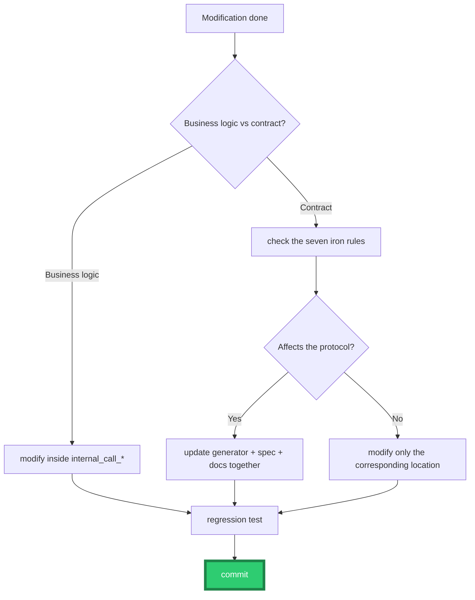

---

## Chapter 16  Error Code and Error Message Index

### 16.1 Tool Registration Response

| Response JSON | Meaning | Provider handling |
|---------------|---------|-------------------|
| `{"status": "ok"}` | Registration succeeded | `RegisterTool` returns True |
| `{"status": "error", "message": "..."}` | Registration failed | log, return False |
| Empty response | Network / timeout | return False |
| `null` handle | Call failed | return False |
| Invalid JSON | Parse failure | return False |

### 16.2 Tool Call Response

| Response JSON | Meaning | Client handling |
|---------------|---------|-----------------|
| `{"result": <value>}` | Function success | read `result` |
| `{"status": "ok"}` | Procedure success | done |
| `{"error": "..."}` | Any error | log the error |
| Empty response | timeout / failure | report error |
| `null` handle | call failed | report error |
| Invalid JSON | parse failure | report error |

### 16.3 Error Message Inventory

| Error message | Source | Note |
|---------------|--------|------|
| `"Empty input"` | generator (Pascal/Python) | empty JSON |
| `"Invalid JSON"` | generator (Pascal) | invalid JSON (**exact**) |
| `"Invalid JSON: <specific error>"` | generator (Python) | invalid JSON (**prefix match**) |
| `"Division by zero"` | business logic | division by zero (example) |
| `"<exception message>"` | business logic | any exception |

### 16.4 LingoFuse Layer Errors

| Error | Trigger | Handling |
|-------|---------|----------|
| `LF_PrepareDone returned 0` | second call | check initialization order |
| `LF_PrepareClient returned -1` | duplicate address | use `Overlap_Connection` or a different address |
| `Queue ... already occupied` | port occupied | use a different endpoint |
| `LF_BindApp returned 0` | no idle clients | check `Simulated_Main_Thread_Activated` |
| `no found app("...")` | wrong app name | check `client_name` |
| `no found api("...")` | wrong API name | check the registered name |

### 16.5 MCP Layer Errors

| Error | Trigger | Handling |
|-------|---------|----------|
| `unrecognized type json_schema` | wrong schema nesting | check `response_format` |
| `strict must be bool` | wrong type | use `true`, not `"true"` |
| `additionalProperties must be false` | strict-mode constraint | fill in |
| `tool_calls arguments empty` | SSE fragments not aggregated | accumulate by `index` |
| `LF_Call returned null` | call failed | check app/API names |

### 16.6 HTTP Bridge Error Codes

| Error code | HTTP | Meaning |
|-----------|------|---------|
| `-1` | 200 | Remote call failed |
| `-2` | 400 | Request shape error |
| `-3` | 200 | API precheck failed |

---

## Chapter 17  Mapping to Generator Source

### 17.1 Protocol Contract ↔ Generator Functions

| Contract item | Pascal-side implementation | Python-side implementation | C++-side implementation |
|---------------|---------------------------|---------------------------|-------------------------|
| Type whitelist | `IsSupportedType` | `IsSupportedType` | `IsSupportedType` |
| Type → Python | — | `PascalTypeToPythonType` | — |
| Type → JSON Schema | inlined in `RegisterToolLines` | `PascalTypeToJsonSchemaType` | `PascalTypeToJsonSchemaType` |
| Type → default value | inlined in `CallbackLines` | `PascalTypeDefaultValue` | `PascalTypeToDefaultValue` |
| Type → C++ | — | — | `PascalTypeToCPPType` |
| API name cleaning | `MakeApiName` | `MakePythonIdentifier` | `MakeApiName` |
| Callback name generation | `MakeCallbackName` | `CallbackName := 'callback_' + ...` | `MakeCallbackName` |
| Internal stub name | `MakeInternalCallName` | `InternalCallName := 'internal_call_' + ...` | `MakeInternalCallName` |
| String literal | `PascalStrLit` (delegating) | `PyStrLit` (self-implemented) | `CPPStrLit` (self-implemented) |
| Description extraction | `GetFullDescription` (through `SystemString`) | `GetFullDescription` (char-by-char) | `GetFullDescription` (via `CleanComment_Local`) |
| App name derivation | inlined in `GeneratePascalCode` | inlined in `GeneratePythonCode` | inlined in `GenerateCPPCode` |

### 17.2 Generated Module ↔ Contract Section

| Generated module | Corresponding contract section |
|------------------|-------------------------------|
| `HeaderLines` | §1 (wire format), §9 (app name) |
| `InterfaceLines` | §9 (constants), §10 (entry) |
| `UsesLines` | — |
| `ForwardLines` | §7 (callback signature) |
| `Ret2StrLines` | — |
| `InternalCallLines` | §7.5 (internal stub) |
| `LoggingLines` | §4 (no-escape) |
| `CallbackLines` | §1 (wire format), §5 (input), §6 (output), §7 (signature) |
| `RegisterToolLines` | §8 (tool registration) |
| `RegisterAPIsLines` | §10 (startup) |
| `ExecuteLines` | §10 (startup) |
| `ResultLines` | — |

### 17.3 Differences Across the Three Language Generators

| Dimension | Pascal | Python | C++ |
|-----------|--------|--------|-----|
| Type whitelist | `Int64`/`Double`/`string` | same | same |
| JSON Schema mapping | same | same | same |
| Description extraction | `TPascalStringList.AsText` (via `SystemString`) | char-by-char scan of `TP_String` | `CleanComment_Local` |
| Duplicate tool names | numeric suffix | numeric suffix | **dropped** |
| Description truncation | none | none | `MAX_DESC_LEN = 200` |
| Callback macro | `cdecl` | `@LFCallFunc` | `LF_CDECL` |
| Internal stub naming | `internal_call_<Name>_<ApiName>` | `internal_call_<name>` | `internal_call_<Name>` |
| String literal | delegates to `Translate_Text_To_Pascal_Decl` | `PyStrLit` self-implemented | `CPPStrLit` self-implemented |
| Output files | `.pas` | `.py` | `.hpp` + `.cpp` |

---

## Appendix A: Uncertainty List

> The following points **cannot be fully determined from the source**. When AI needs to work on these scenarios, it must consult the source or ask a human.

1. **The comment-conversion details of `Translate_C_Typ_To_Pascal`** — whether complex C comments are stable.
2. **The concrete scoring algorithm of `DetectSourceLanguage`** — recommend manual language selection.
3. **The truncation of `GetFullDescription`** — Pascal/Python have none; C++ has `MAX_DESC_LEN = 200`.
4. **The exact type signature of `LFCallFunc`** — see `lingofuse._lf_native`.
5. **Whether the `total_count` fix in `RegisterTools` is complete** — syntax checking is recommended.
6. **The minimal contract for a new-language generator** — see §17.1.
7. **Whether the GUI's 1 ms `SysTimer` is optimal** — recommend changing to 10 ms.
8. **The character replacement table in `MakeApiName`** — **confirmed incomplete** (only 6 characters are replaced); whitelist filtering is recommended.
9. **The relationship between `PascalStrLit` and `Translate_Text_To_Pascal_Decl`** — it is a delegation.
10. **The consistency maintenance between the declaration spec and the generator** — CI checking is recommended.
11. **The SystemString intermediary in `GetFullDescription` (Pascal side)** — a non-ASCII compatibility hazard exists.
12. **The synchronization between `code_decl_to_mcp_knowledge_base.md` and `MCP_API_Contract.md`** — manual cross-checking is recommended.
13. **Whether chunk boundaries for single payloads over 64 KB break NUL atomicity** — requires empirical testing.
14. **The side effect of the `required` array including every parameter** — the client treats every parameter as required, conflicting with "optional parameter" semantics.
15. **The falsy fallback of `data.get('x') or 0`** — has side effects on `0` / `""` / `False`, but is harmless for whitelist types.

---

## Appendix B: Revision History

### v3.0 (2026-09-22) — this version

**Complete rewrite**:

1. **Chapters 1–3 fully rewritten**: precise byte-level definition of the wire format.
2. **New Chapter 12**: runnable client reference implementations (Pascal / Python / C++).
3. **New Chapter 13**: byte-level wire-format examples (hex dumps).
4. **New Chapter 16**: complete error-code and error-message index.
5. **New Chapter 17**: mapping to generator source (function-level).
6. **Chapter restructuring**: from "introduction-style" to "contract-style".
7. **Kept all fixes from v2.0** (11 items).
8. **Added three-way (C++) coverage**: v2.0 had only a Pascal/Python dual-language contract; v3.0 adds the C++ generator.

**Fixes inherited from v2.0**:

- §14.4 `PascalStrLit` self-check item fixed.
- §14.4 `GetFullDescription` self-check item fixed.
- §7.4 Pascal/Python internal stub naming difference.
- §4.5 `str(obj)` wording made precise.
- §5.5 `required` array side effect.
- §6.5 Pascal/Python `Invalid JSON` message format distinction.
- §7.1 / §7.4 `<Name>` clarified to mean the name after `MakeApiName` cleaning.
- §8.3 "silent failure" reworded to "hits an uncertain target".
- §10.2 added Pascal-side host exit responsibility.
- §3.4 added the `LF_Notify` handle-release exemption.
- §17 added three-level tags (protocol contract / generator implementation / external dependency / known hazard).

### v2.0 (2026-09-20)

- Fixed 11 issues.

### v1.1 (2026-09-20)

- Prohibited character-based diagrams.
- Added Chapter 4, "JSON No-Escape Contract".
- Anti-pattern set: added 12.16.

### v1.0 (2026-09-20)

- Initial version.

---

*Document version: v3.0 (complete rewrite)*
*Coverage: interfaces generated by `pas_mcp_generator_tool.pas` + `py_mcp_generator_tool.pas` + `cpp_mcp_generator_tool.pas`*
*Companion documents: `code_decl_to_mcp_knowledge_base.md`, `LingoFuse_Pascal_Complete_Guide.md`, `Z.Json.md`, `Z.Pascal_Func_Tool Knowledge Base.md`, `pascal_code_mcp_rule.md`, `C_code_mcp_rule.md`*
*Last updated: 2026-09-22*