# MCP 接口契约（Pascal ↔ Python ↔ C++）

> **文档版本**：v3.0（完整重构版）
> **定位**：面向 AI 与人类工程师的**权威线协议契约**。当你要修改 `pas_mcp_generator_tool.pas` / `py_mcp_generator_tool.pas` / `cpp_mcp_generator_tool.pas` 生成的 provider、或编写与它们对话的 LingoFuse 客户端时，**必须**遵守本文所有约定。
>
> **与 `code_decl_to_mcp_knowledge_base.md` 的分工**：
> - 本文档：**线协议契约**（byte-level、字段级、跨语言一致性）
> - `code_decl_to_mcp_knowledge_base.md`：**工具链实现**（生成器源码、GUI、修改指引）
>
> **核心承诺**：破坏本文档的任意一条契约通常**不会编译报错**，只会在运行时表现为：参数变成默认值、返回字段读不到、中文变 `?`、回调静默失败、MCP 客户端发 `{}` 而非真实参数。因此本文档必须被**逐字遵守**。
>
> **制图约定**：全文流程图/架构图/决策树一律使用 Mermaid。
>
> **本版（v3.0）相对 v2.0 的改进**：
> - **完整重写**第 1-3 章：精确定义 wire format 的字节级结构
> - **新增**第 12 章：可运行的客户端参考实现
> - **新增**第 13 章：字节级 wire format 示例（hex dump）
> - **新增**第 16 章：完整的错误码与错误消息索引
> - **新增**第 17 章：与生成器源码的对应关系（函数级映射）
> - **修正**v2.0 的 11 处问题（沿用）
> - **重组**章节结构：从"介绍式"转为"契约式"

---

## 目录

- [第 0 章 快速定位](#第-0-章-快速定位)
- [第 1 章 线格式精确定义](#第-1-章-线格式精确定义)
- [第 2 章 类型系统与映射](#第-2-章-类型系统与映射)
- [第 3 章 DataHandle I/O 契约](#第-3-章-datahandle-io-契约)
- [第 4 章 JSON 无转义契约](#第-4-章-json-无转义契约)
- [第 5 章 输入 JSON 契约](#第-5-章-输入-json-契约)
- [第 6 章 输出 JSON 契约](#第-6-章-输出-json-契约)
- [第 7 章 回调签名契约](#第-7-章-回调签名契约)
- [第 8 章 工具注册 JSON 契约](#第-8-章-工具注册-json-契约)
- [第 9 章 应用名与端点契约](#第-9-章-应用名与端点契约)
- [第 10 章 启动序列契约](#第-10-章-启动序列契约)
- [第 11 章 注释与文档字符串契约](#第-11-章-注释与文档字符串契约)
- [第 12 章 客户端参考实现](#第-12-章-客户端参考实现)
- [第 13 章 字节级 wire format 示例](#第-13-章-字节级-wire-format-示例)
- [第 14 章 反例集](#第-14-章-反例集)
- [第 15 章 自查清单](#第-15-章-自查清单)
- [第 16 章 错误码与错误消息索引](#第-16-章-错误码与错误消息索引)
- [第 17 章 与生成器源码的对应关系](#第-17-章-与生成器源码的对应关系)
- [附录 A：不确定清单](#附录-a不确定清单)
- [附录 B：修订历史](#附录-b修订历史)

---

## 第 0 章 快速定位

### 0.1 一句话

**这份文档定义了：一段 Pascal / Python / C++ 代码，如何通过 LingoFuse 的 DataHandle 交换 JSON 对象，同时保证跨语言、跨编译器、跨平台的一致性。**

### 0.2 数据流全景

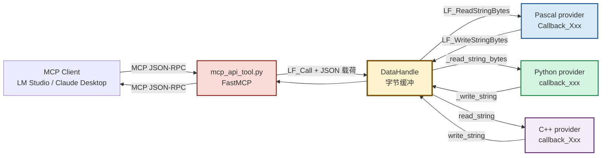

### 0.3 三方视角对照

| 视角 | 看到的 | 谁负责 |
|------|--------|--------|
| **MCP 客户端** | MCP JSON-RPC（`tools/call`、`tools/list` 等） | MCP 协议 |
| **MCP 网关** | 工具定义（JSON）+ 工具调用（JSON） | `mcp_api_tool.py` |
| **Provider（Pascal/Python/C++）** | 输入 JSON 对象 + 输出 JSON 对象 | 生成器代码 + 用户业务 |

**关键事实**：Provider 看到的**不是** MCP JSON-RPC，而是**普通 JSON 对象**，通过 DataHandle 以 **UTF-8 + NUL** 字节流传输。

### 0.4 七条铁律

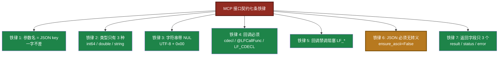

---

## 第 1 章 线格式精确定义

### 1.1 三层协议栈

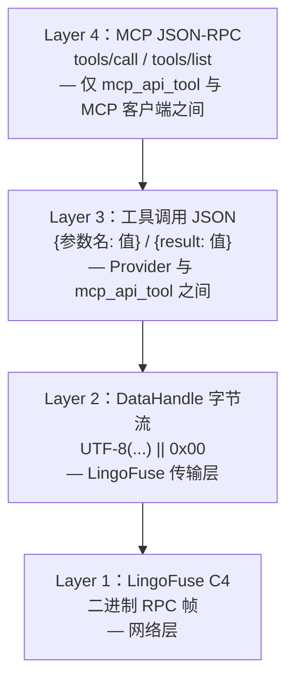

### 1.2 DataHandle 的精确结构

`DataHandle` 是一个**可增长的字节缓冲区**，由 LingoFuse 管理。它在 Provider 侧表现为一个不透明句柄：

| 语言 | 句柄类型 | 说明 |
|------|---------|------|
| Pascal | `TDataHnd___` = `Pointer` | 不透明指针 |
| Python | `DataHnd` = `ctypes.c_void_p` | 不透明指针 |
| C++ | `TDataHnd` = `void*` | 不透明指针 |
| C ABI | `void*` | 不透明指针 |

**Provider 侧不得解引用这些句柄**——所有读写通过 C ABI 函数完成。

### 1.3 字节流格式

**调用输入**（客户端 → Provider）：
```
[UTF-8 JSON 字节] [0x00]
```

**调用输出**（Provider → 客户端）：
```
[UTF-8 JSON 字节] [0x00]
```

**示例**：
```
输入: {"a": 5, "b": 7}  →  7B 22 61 22 3A 20 35 2C 20 22 62 22 3A 20 37 7D 00
输出: {"result": 12}    →  7B 22 72 65 73 75 6C 74 22 3A 20 31 32 7D 00
```

### 1.4 读写位置的精确语义

**DataHandle 有一个"当前位置"指针**：

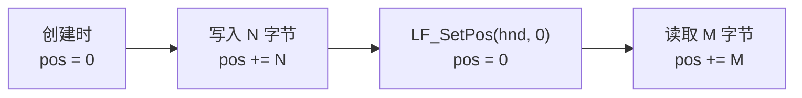

**关键操作**：

| 操作 | 位置变化 |
|------|---------|
| `LF_CreateData` | 新句柄，pos = 0 |
| `LF_WriteBuffer(hnd, buf, N)` | 从 pos 写入 N 字节，pos += N |
| `LF_ReadBuffer(hnd, buf, N)` | 从 pos 读取最多 N 字节，pos += 实际读取字节数 |
| `LF_SetPos(hnd, P)` | pos = P（超出 size 会隐式扩容） |
| `LF_GetPos(hnd)` | 返回当前 pos |
| `LF_GetSize(hnd)` | 返回缓冲区总字节数 |

### 1.5 阅读 NUL 终止符的两种模式

**Pascal `LF_ReadStringBytes`**：

```
1. 从 pos 开始扫描，找到第一个 0x00。
2. 若找到：
   - 读出 [pos, 0x00) 之间的所有字节。
   - pos 跳到 0x00 之后（即 0x00 之后的下一个字节）。
3. 若未找到（扫到 size 末尾都没有 0x00）：
   - 读出 [pos, size) 之间的所有字节。
   - pos 跳到 size（末尾）。
   - 【容错模式】——这是契约的一部分。
```

**Python `_read_string_bytes`**（生成器中的 helper）：

```python
def _read_string_bytes(hnd) -> bytes:
    pos = LF_GetPos(hnd)
    size = LF_GetSize(hnd)
    if pos >= size:
        return b""
    ptr = LF_GetBuffer(hnd)
    if not ptr:
        return b""
    cptr = ctypes.cast(ptr, ctypes.POINTER(ctypes.c_byte))
    end = pos
    while end < size and cptr[end] != 0:
        end += 1
    if end < size:
        # 找到 NUL
        data_len = end - pos
        if data_len == 0:
            LF_SetPos(hnd, end + 1)
            return b""
        raw = (ctypes.c_byte * data_len)()
        LF_ReadBuffer(hnd, raw, data_len)
        LF_SetPos(hnd, end + 1)
        return bytes(raw)
    else:
        # 未找到 NUL（容错）
        data_len = size - pos
        if data_len == 0:
            return b""
        raw = (ctypes.c_byte * data_len)()
        LF_ReadBuffer(hnd, raw, data_len)
        LF_SetPos(hnd, size)
        return bytes(raw)
```

**C++ `read_string`**（生成器中的 helper）：

```cpp
static std::string read_string(TDataHnd hnd)
{
    const std::int64_t pos  = LF_GetPos(hnd);
    const std::int64_t size = LF_GetSize(hnd);
    if (pos < 0 || pos >= size)
        return std::string();
    const auto* base = static_cast<const std::uint8_t*>(LF_GetBuffer(hnd));
    if (base == nullptr)
        return std::string();
    std::int64_t end = pos;
    while (end < size && base[end] != 0)
        ++end;
    std::string result(
        reinterpret_cast<const char*>(base + pos),
        static_cast<std::size_t>(end - pos));
    LF_SetPos(hnd, end + 1);
    return result;
}
```

**三方语义完全一致**：读出 [pos, NUL) 或 [pos, size)，pos 跳到 NUL 之后或 size。

### 1.6 写入 NUL 的三方实现

**Pascal `LF_WriteStringBytes`**（`lingofuse_import.pas`）：
```pascal
// 语义（源码）：
// 1. 若 Length(Value) > 0：LF_WriteBuffer(Hnd, @Value[0], Length(Value))
// 2. LF_WriteUInt8(Hnd, 0)   // 追加 NUL
```

**Python `_write_string`**（生成器）：
```python
def _write_string(hnd, s):
    if isinstance(s, str):
        s = s.encode("utf-8")
    if len(s) > 0:
        LF_WriteBuffer(hnd, s, len(s))
    LF_WriteBuffer(hnd, b"\x00", 1)
```

**C++ `write_string`**（生成器）：
```cpp
static void write_string(TDataHnd hnd, const std::string& s)
{
    if (!s.empty())
        LF_WriteBuffer(hnd, s.data(), static_cast<std::int64_t>(s.size()));
    const char nul = 0;
    LF_WriteBuffer(hnd, &nul, 1);
}
```

**三方语义完全一致**：UTF-8 字节 + 单个 `0x00`。

---

## 第 2 章 类型系统与映射

### 2.1 唯一被允许的三元组

| 归一化类型 | Python 类型标注 | JSON Schema 类型 | JSON 默认值 | C++ 类型 |
|:----------:|:---------------:|:----------------:|:-----------:|:--------:|
| `int64`  | `int`   | `integer` | `0`   | `std::int64_t` |
| `double` | `float` | `number`  | `0.0` | `double` |
| `string` | `str`   | `string`  | `""`  | `std::string`（返回）/ `const std::string&`（参数） |

**这就是全部**。没有 `bool`、`bytes`、数组、对象、`Any`。

### 2.2 类型归一化规则

Pascal 源中的各种整数/浮点/字符串类型会被 `TPascal_Func_Model` **归一化**为上述三种：

| 源类型 | 归一化为 |
|--------|---------|
| `Integer` / `LongInt` / `Word` / `Byte` / `Cardinal` / `SmallInt` / `ShortInt` / `Int64` / `UInt64` / `LongWord` / `DWord` | `int64` |
| `Single` / `Double` / `Extended` / `Real` | `double` |
| `string` / `AnsiString` / `UnicodeString` / `WideString` / `PChar` / `PAnsiChar` / `PWideChar` / `TP_String` / `TPascalString` / `TUPascalString` | `string` |

### 2.3 未支持类型的处理

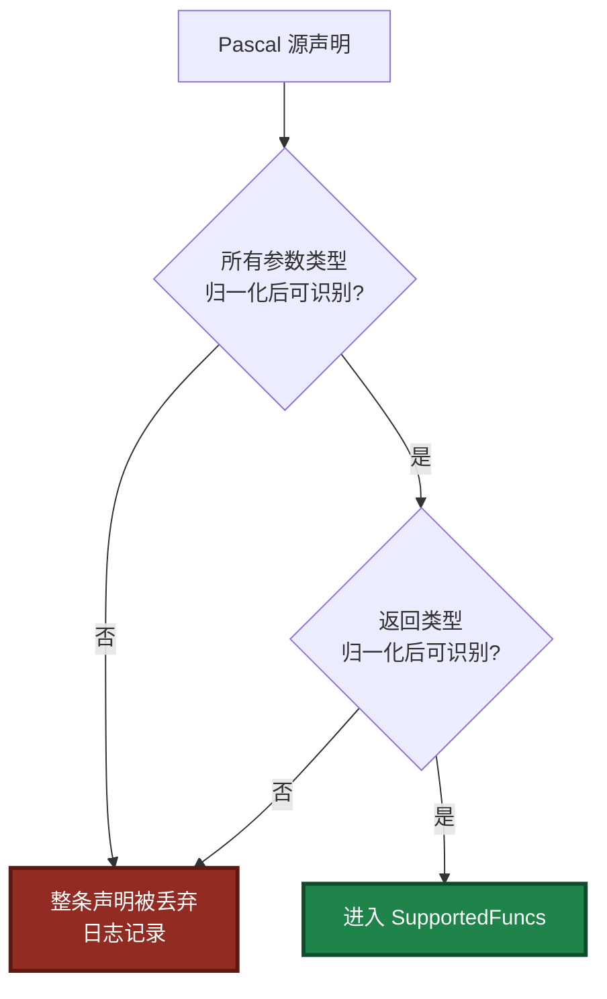

**铁律**：**整条声明被丢弃**，不是只丢那个参数。

### 2.4 不支持的类型清单

| 类别 | Pascal | C | C++ |
|------|--------|---|-----|
| 布尔 | `Boolean` / `LongBool` / `ByteBool` / `WordBool` | `bool` / `_Bool` | `bool` |
| 变体 | `Variant` / `OleVariant` | — | — |
| 数组 | `array of X` / `array[0..N] of X` | `X[]` / `X[N]` | `X[]` / `std::array` / `std::vector` |
| 记录/结构体 | `TPoint` / 自定义 `record` | `struct X` | `struct X` / `class X` |
| 日期时间 | `TDateTime` / `TDate` / `TTime` | `time_t` | `std::chrono::*` |
| 类 | `TObject` / `TStringList` | — | — |
| 接口 | `IInterface` / `IMyInterface` | — | — |
| 枚举 | `TColor` / 自定义 `enum` | `enum X` | `enum class X` |
| 集合 | `set of X` | — | — |
| 泛型 | `TList<X>` / `TGenericList<X>` | — | `std::vector<X>` 等 |
| 事件 | `TNotifyEvent` / `TProc` | 函数指针 | `std::function` |
| 指针 | `Pointer` / `PInteger` / `PChar` | `void*` / `int*` | `void*` / `int*` |
| 匿名方法 | `reference to procedure` | — | lambda（作为类型） |

> **跨层差异**：C 侧的 `void*` 被 C 解析器接受，但映射为 Pascal `Pointer` 后，在 `Z.Pascal_Func_Model` 归一化阶段被拒绝。**C 侧接受 ≠ Pascal 侧接受**。

### 2.5 五处一致性（铁律）

以下五处**必须严格同步**：

| # | 位置 | 源类型 → 生成代码 |
|:-:|------|------------------|
| 1 | Pascal 参数提取 | `Int64` → `jo.I64['x']`<br>`Double` → `jo.F['x']`<br>`string` → `jo.S['x']` |
| 2 | Pascal 返回写入 | `Int64` → `jo.I64['result'] := ret`<br>`Double` → `jo.F['result'] := ret`<br>`string` → `jo.S['result'] := ret` |
| 3 | Python 参数提取 | `Int64` → `data.get('x') or 0`<br>`Double` → `data.get('x') or 0.0`<br>`string` → `data.get('x') or ""` |
| 4 | Python 返回写入 | 统一 `json.dumps({"result": ret}, ensure_ascii=False)` |
| 5 | JSON Schema | `Int64` → `"type": "integer"`<br>`Double` → `"type": "number"`<br>`string` → `"type": "string"` |

**任意一处写错**：客户端拿到的值可能是默认值而非真实返回值。

---

## 第 3 章 DataHandle I/O 契约

### 3.1 句柄生命周期

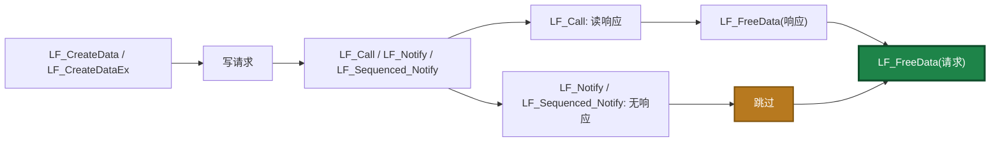

### 3.2 释放责任表

| 场景 | 需要释放的句柄 | 数量 |
|------|----------------|:----:|
| `LF_CreateData` → `LF_Call` | 请求句柄 + 响应句柄 | **2** |
| `LF_CreateData` → `LF_Notify` | 请求句柄 | **1** |
| `LF_CreateData` → `LF_Sequenced_Notify` | 请求句柄 | **1** |
| `LF_LocalCall` | 输入句柄（调用者拥有）+ 响应句柄 | **2** |
| `LF_LocalNotify` | 输入句柄（调用者拥有） | **1** |
| 回调收到的 `_In` / `_Out` | **不释放** | **0** |

**关键规则**：
- **`LF_CreateData` 创建的请求句柄，无论用它调用 `LF_Call` 还是 `LF_Notify`，都要配对 `LF_FreeData`**。
- **`LF_Notify` / `LF_Sequenced_Notify` 无响应句柄**。
- **回调中的 `_In` / `_Out` 由框架管理，不释放**。
- 用 `try..finally` 保证异常路径也释放。
- **5 分钟自动回收是兜底，不能当常规手段**。

### 3.3 请求/响应句柄的确切模式

**Pascal 模式**：

```pascal
var
  Req, Res: TDataHnd___;
begin
  Req := LF_CreateDataEx('my_api');
  try
    LF_WriteStringBytes(Req, SomeBytes);
    Res := LF_CallEx('my_app', Req, 5000);
  finally
    LF_FreeData(Req);
  end;

  if Res = nil then Exit;
  try
    SomeResult := LF_ReadStringBytes(Res);
  finally
    LF_FreeData(Res);
  end;
end;
```

**Python 模式**（参考 `language_middleware.py`）：

```python
req = LF_CreateData(cstr('my_api'))
try:
    write_json(req, {'a': 5, 'b': 7})
    resp = LF_Call(cstr('my_app'), req, 5000)
finally:
    LF_FreeData(req)

if not resp:
    return None
try:
    _rewind(resp)
    result = read_json(resp)
finally:
    LF_FreeData(resp)
```

**C++ 模式**（参考生成器）：

```cpp
TDataHnd req = LF_CreateData("my_api");
if (req == nullptr) return false;
try {
    json payload;
    payload["a"] = 5;
    payload["b"] = 7;
    write_json(req, payload);
    TDataHnd resp = LF_Call("my_app", req, 5000);
    if (resp != nullptr) {
        try {
            json result = read_json(resp);
            // 处理 result...
        } catch (...) { }
        LF_FreeData(resp);
    }
} catch (...) { }
LF_FreeData(req);
```

### 3.4 跨线程持有句柄

**DataHandle 不是线程安全的**。跨线程时：

- **每个线程使用独立句柄**。
- **或外部加锁**。
- **绝不允许**：一个线程写、另一个线程同时读。

**例外**：回调中的 `_In` / `_Out` **只在回调执行期间有效**，回调返回后不可再访问。

---

## 第 4 章 JSON 无转义契约

### 4.1 铁律

> **智能体在传递 JSON 的时候，无论是什么地方的 JSON，必须使用无转义的 JSON 格式。这是兼容性必须。**

**"无转义"的精确含义**：JSON 中的所有非 ASCII 字符（中文、日文、韩文、emoji、生僻字）必须以 **UTF-8 字节直接输出**，**不得转义为 `\uXXXX` 序列**。

### 4.2 违反后果链

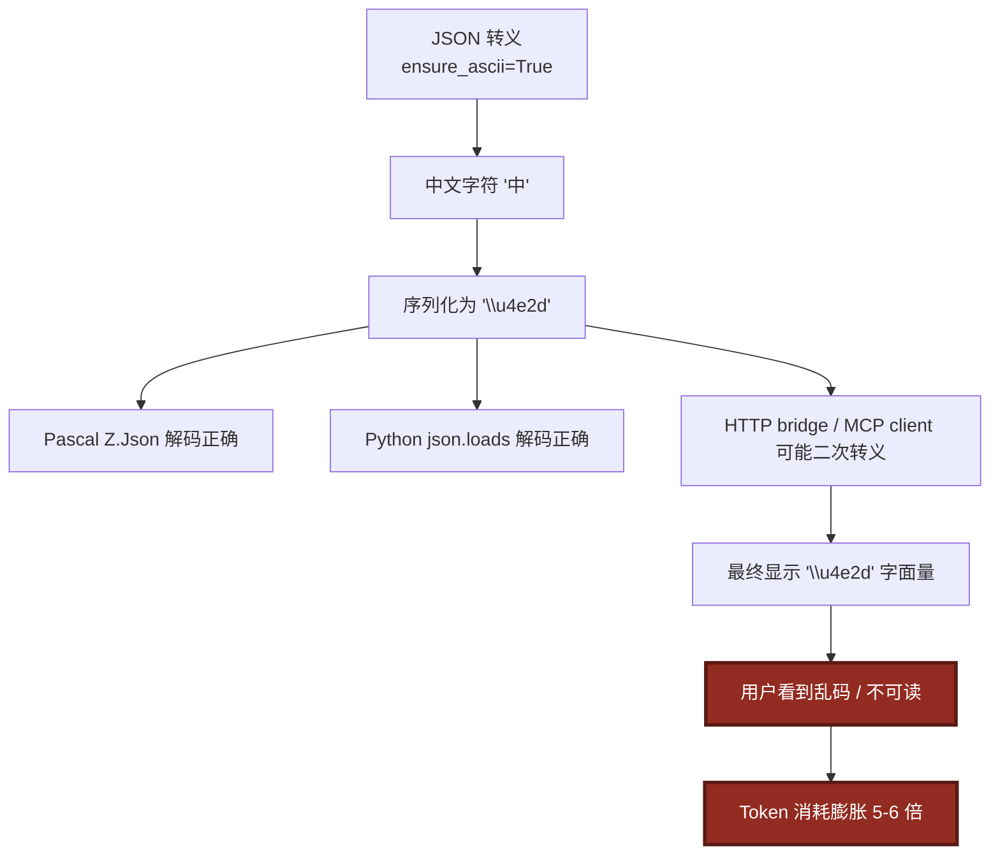

### 4.3 三方正确实现

| 环节 | 正确写法 |
|------|----------|
| **Pascal 序列化** | `jo.ToBytes`（`Z.Json` 默认 UTF-8） |
| **Python 序列化** | `json.dumps(obj, ensure_ascii=False).encode("utf-8")` |
| **C++ 序列化** | `obj.dump(-1, ' ', false, json::error_handler_t::replace)`（`nlohmann::json` 默认不转义非 ASCII） |
| **传输层** | 直接传 UTF-8 字节，不经 `string` / `AnsiString` 中转 |

### 4.4 生成器已保证

**Python 生成器**的所有 `json.dumps` 都带 `ensure_ascii=False`：
```python
_write_string(_Out, json.dumps({"result": ret}, ensure_ascii=False).encode("utf-8"))
payload = json.dumps(tool_def, ensure_ascii=False).encode("utf-8")
payload = json.dumps({"message": msg}, ensure_ascii=False).encode("utf-8")
```

**Pascal 生成器**全程用 `jo.ToBytes`（`Z.Json` 内部走 UTF-8）。

**C++ 生成器**用 `write_json(out_hnd, obj)`，内部走 `obj.dump(-1, ' ', false, ...)`，默认不转义非 ASCII。

**结论**：只要不手工修改生成器，就自动满足无转义契约。

### 4.5 人工修改检查清单

- [ ] 所有 `json.dumps` 都带 `ensure_ascii=False`。
- [ ] 没有 `json.dumps(...).encode("ascii")`。
- [ ] 没有 `.encode("ascii", errors="replace")`。
- [ ] 没有经过 `str(obj)` 强转再回写（`str()` 对**字符串/数字**安全，对**自定义对象**会回退到 `repr`，可能转义非 ASCII）。
- [ ] Pascal 侧没有 `TEncoding.ASCII.GetBytes(...)`。
- [ ] Pascal 侧没有 `jo.ToJSONString(False).Text` 后赋给 `string` 变量的路径。

### 4.6 反例

```python
# ❌ 反例 1：默认 ensure_ascii=True
_write_string(_Out, json.dumps({"result": ret}).encode("utf-8"))
# 输出：b'{"result":"\\u4e2d\\u6587"}\x00'

# ❌ 反例 2：ascii 编码
_write_string(_Out, json.dumps({"result": ret}, ensure_ascii=False).encode("ascii"))
# 抛 UnicodeEncodeError

# ❌ 反例 3：经过 repr
_write_string(_Out, json.dumps({"result": repr(ret)}, ensure_ascii=False).encode("utf-8"))
# 输出：b'{"result":"\'\\u4e2d\\u6587\'"}\x00'（repr 已转义）

# ❌ 反例 4：双重 json.dumps
_write_string(_Out, json.dumps(json.dumps({"result": ret})))
# 输出：b'"{\\"result\\": \\"\\\\u4e2d\\\\u6587\\"}"\x00'

# ✅ 正确
_write_string(_Out, json.dumps({"result": ret}, ensure_ascii=False).encode("utf-8"))
# 输出：b'{"result":"\xe4\xb8\xad\xe6\x96\x87"}\x00'
```

### 4.7 与 `mcp_api_tool.py` 的协同

`mcp_api_tool.py` 通过 `lingofuse.lf_io` 完成 DataHandle I/O，该模块内部已保证：
- `write_json()` 使用 `ensure_ascii=False`。
- `read_json_or_bytes()` 返回解码后的对象（不重新序列化）。
- `cstr()` 提供 NUL 结尾的 UTF-8 字节。

**两端一致，才是完整契约**。

---

## 第 5 章 输入 JSON 契约

### 5.1 输入 JSON 结构

Provider 从 `_In` 句柄读到的 JSON 对象：

```json
{
  "参数1": 值1,
  "参数2": 值2
}
```

**键 = 参数名**。参数名来自 `TParamStructure.Name`，最终来自 Pascal 源码中的形参名。生成器**不做任何改名**。

### 5.2 参数名 = JSON key 的铁律

**以下所有操作都禁止**：
- 大小写变换（`a` → `A`）。
- 缩写（`target` → `tgt`）。
- 加前缀/后缀（`a` → `arg_a`）。
- 驼峰/蛇形转换（`userName` → `user_name`）。
- 任何其他"美化"操作。

**原因**：客户端用**原始参数名**作为 JSON key。改名后客户端发 `{"a": 5}`，Provider 读 `data.get("A")` 得到 `None` → 默认值 `0`。

### 5.3 Pascal 侧参数提取（生成器输出）

```pascal
jsonBytes := LF_ReadStringBytes(TDataHnd(_In___));
...
if not jo.Parae(jsonBytes) then
begin
  // 写错误
  Exit;
end;

a := jo.I64['a'];      // int64
b := jo.S['b'];        // string
c := jo.F['c'];        // double
```

**契约**：
- 使用**参数名本身**作为 JSON key，**严格区分大小写**。
- 缺失 key 返回 `Z.Json` 的默认值（`0` / `0.0` / `''`）——**不报错**。
- 类型不匹配时，`Z.Json` 尽力转换。

### 5.4 Python 侧参数提取（生成器输出）

```python
data = json.loads(json_bytes.decode("utf-8"))
a = data.get('a') or 0
b = data.get('b') or ""
c = data.get('c') or 0.0
```

**契约**：
- `data.get(<name>)` 缺失返回 `None`。
- `or <default>` 进行 **falsy 兜底**：`None` / `0` / `""` / `False` / `[]` 都会被替换。
- **副作用**：调用方故意传 `b=""` 会被替换为 `""`（无害）；`a=0` 会被替换为 `0`（无害）。
- **副作用**：`a=False` 会被替换为 `0`（但 `bool` 不在白名单，客户端不应传）。

### 5.5 C++ 侧参数提取（生成器输出）

```cpp
json req = read_json(in_hnd);
if (!req.is_object())
    req = json::object();

std::int64_t a = req.value("a", static_cast<std::int64_t>(0));
std::string b = req.value("b", std::string());
double c = req.value("c", 0.0);
```

**契约**：
- `req.value(<name>, <default>)` 缺失返回默认值。
- 无 falsy 兜底——`0` 就是 `0`。

### 5.6 参数顺序与命名规则

| 规则 | 说明 |
|------|------|
| 参数顺序 | 与 Pascal 源中的形参顺序一致，生成器不重排 |
| 参数名 | Pascal/C++ 严格使用原名；Python 侧经 `MakePythonIdentifier` 过滤（非法字符替换为 `_`） |
| 空名参数 | 用 `p0` / `p1` / ... 作为占位名 |
| Python 关键字冲突 | 生成器**不处理**（如 Pascal 参数名叫 `class` 会生成非法 Python 代码） |
| JSON key | **始终用 Pascal 原名**，与 Python 形参名解耦 |

**示例**：Pascal 源参数名 `my-param`（非法 Pascal 标识符，实际不会出现）：
- Pascal 侧：`my_param := jo.I64['my-param'];`（**JSON key 是原名**）
- Python 侧：`my_param = data.get('my-param') or 0`（**形参名是清洗后的，JSON key 是原名**）

### 5.7 JSON Schema 的 `parameters`

生成器产出：

```json
{
  "type": "object",
  "properties": {
    "a": {"type": "integer", "description": "First operand"},
    "b": {"type": "string",  "description": "Second operand"}
  },
  "required": ["a", "b"]
}
```

**契约**：
- `required` **包含所有参数**（生成器一律填全）。
- 每个参数的 `type` 必须是 `"integer"` / `"number"` / `"string"`。
- `description` 来自 Pascal 源注释，生成器保证 `ensure_ascii=False`。

**⚠️ `required` 数组的副作用**：

`required` 包含所有参数 → **所有参数被 MCP 客户端视为必填**。具体影响：

- 工具原本的"可选参数"（如带默认值）会被客户端视为必填。
- MCP 客户端（LM Studio 等）不会因为参数有默认值就自动视为可选。
- 若需要真正的"可选参数"，需修改生成器让它**排除有默认值的参数**——**当前不支持**。

---

## 第 6 章 输出 JSON 契约

### 6.1 三种响应形态

| 情形 | 响应 JSON | 触发条件 |
|------|----------|---------|
| **函数成功** | `{"result": <值>}` | `IsFunction=True` 且无异常 |
| **过程成功** | `{"status": "ok"}` | `IsFunction=False` 且无异常 |
| **任何错误** | `{"error": "<msg>"}` | 空输入 / 无效 JSON / 业务异常 |

### 6.2 函数成功：`result` key

**唯一允许的返回字段名是 `result`（全小写）**。

| 归一化返回类型 | Pascal 写入 | Python 写入 | C++ 写入 | JSON 值 |
|:-------------:|-------------|-------------|----------|--------:|
| `int64`  | `jo.I64['result'] := ret` | `json.dumps({"result": ret})` | `resp["result"] = ret` | 整数 |
| `double` | `jo.F['result'] := ret`   | 同上 | 同上 | 浮点数 |
| `string` | `jo.S['result'] := ret`   | 同上 | 同上 | 字符串 |

**禁止**：
- 改 key 为 `return` / `value` / `data` / `output`。
- 改大小写（`Result` / `RESULT`）。
- 把 `double` 塞进 `jo.S['result']`（会变成字符串）。

### 6.3 过程成功：`status` key

**唯一允许的成功字段名是 `status`**，值**唯一允许**是字符串 `"ok"`。

```pascal
jo.S['status'] := 'ok';
```

```python
json.dumps({"status": "ok"}, ensure_ascii=False)
```

**禁止**：
- `{"success": true}` / `{"ok": 1}` / `{"status": "success"}`。
- 返回 `{"result": null}` 冒充过程。

### 6.4 错误：`error` key

**唯一允许的错误字段名是 `error`**，值是字符串。

**契约**：
- **只要有 `error` 字段就代表失败**。
- `error` 与其他字段可以共存，但客户端通常只看 `error`。
- 优先级顺序：空输入 → 无效 JSON → 业务异常。三者都写 `error`。
- **不要**新增 `error_code` / `stack_trace` / `error_type`。

### 6.5 空输入与无效 JSON 的精确处理

**Pascal 侧**：

```pascal
if Length(jsonBytes) = 0 then
begin
  errMsg := 'Empty input';
  jo.Clear;
  jo.S['error'] := errMsg;
  LF_WriteStringBytes(TDataHnd(_Out___), jo.ToBytes);
  Exit;
end;

if not jo.Parae(jsonBytes) then
begin
  errMsg := 'Invalid JSON';
  jo.Clear;
  jo.S['error'] := errMsg;
  LF_WriteStringBytes(TDataHnd(_Out___), jo.ToBytes);
  Exit;
end;
```

**Python 侧**：

```python
if not json_bytes:
    _write_string(_Out, json.dumps({"error": "Empty input"}).encode("utf-8"))
    return

try:
    data = json.loads(json_bytes.decode("utf-8"))
except Exception as _parse_err:
    _write_string(_Out, json.dumps({"error": f"Invalid JSON: {_parse_err}"}).encode("utf-8"))
    return
```

**错误消息格式对照**：

| 场景 | Pascal 侧 | Python 侧 |
|------|----------|----------|
| 空输入 | **完全等于** `"Empty input"` | **完全等于** `"Empty input"` |
| 无效 JSON | **完全等于** `"Invalid JSON"` | **前缀为** `"Invalid JSON"`，后跟 `: <具体错误>` |

**客户端判定建议**：

```python
err = resp.get("error", "")
if err.startswith("Invalid JSON"):
    # 无效 JSON
elif err == "Empty input":
    # 空输入
else:
    # 其他错误
```

**不要改这两条消息**——某些测试脚本会做字符串匹配。

### 6.6 异常兜底

**Pascal 侧**：

```pascal
except
  on E: Exception do
  begin
    jo.Clear;
    jo.S['error'] := E.Message;
    LF_WriteStringBytes(TDataHnd(_Out___), jo.ToBytes);
  end;
end;
```

**Python 侧**：

```python
except Exception as _err:
    try:
        _write_string(_Out, json.dumps({"error": str(_err)}).encode("utf-8"))
    except Exception:
        pass
```

**C++ 侧**：

```cpp
catch (const std::exception& e) {
    try {
        json err;
        err["error"] = std::string(e.what());
        write_json(out_hnd, err);
    } catch (...) {}
}
catch (...) {
    try {
        json err;
        err["error"] = std::string("unknown exception");
        write_json(out_hnd, err);
    } catch (...) {}
}
```

**契约**：
- **必须**捕获所有异常。
- **必须**保证 `_Out` 至少被写一次（即使写失败也不能让客户端挂起）。
- **绝不**让异常穿透到 C ABI 层——会导致 C4 线程池静默吞异常。

### 6.7 返回值类型的三处一致

**同一个函数返回值，必须在三处保持一致**：

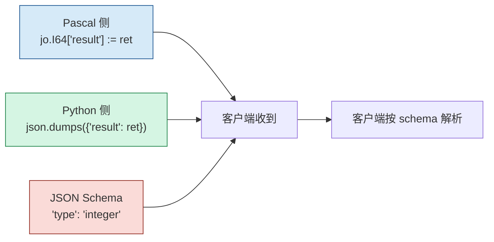

**任意一处写错**：客户端拿到的值可能是默认值。

---

## 第 7 章 回调签名契约

### 7.1 Pascal 回调签名（强制）

```pascal
procedure Callback_<Name>_<ApiName>(
    _Trigger___: Pointer;
    _In___ , _Out___: TDataHnd___);
  cdecl;
```

| 部件 | 约束 |
|------|------|
| 函数名 | `Callback_<MakeApiName(Name)>_<UniqueApiName>` |
| `_Trigger___` | 用户指针，生成器传 `nil`；**不要解引用** |
| `_In___` / `_Out___` | `TDataHnd___` 不透明句柄，**不得转型** |
| `cdecl` | **必须有**。删除会导致栈错位、崩溃或静默失败 |
| 返回值 | **无**（`procedure`，不是 `function`） |

**`MakeApiName` 的语义**：
```pascal
Result := FuncName.ReplaceChar(#32#9'./\@', '_');
```
把 `空格` / `Tab` / `.` / `/` / `\` / `@` 替换为 `_`。

**举例**：源函数 `Foo/Bar` → `Callback_Foo_Bar_Foo_Bar`。

### 7.2 Python 回调签名（强制）

```python
@LFCallFunc
def callback_<name>(_Trigger, _In, _Out):
    ...
```

| 部件 | 约束 |
|------|------|
| 装饰器 | `@LFCallFunc` **必须保留**——它处理 ctypes 的 C ABI 转换 |
| 函数名 | `callback_<MakePythonIdentifier(Name)>`，唯一 |
| 参数名 | `_Trigger` / `_In` / `_Out` 是 LingoFuse Python binding 的约定，**不要改** |
| 参数 | **三个位置参数**，不能有默认值，不能用 `*args` |
| 返回 | `return` 只用于提前退出，不携带数据 |

### 7.3 C++ 回调签名（强制）

```cpp
static void LF_CDECL callback_<name>(void* _Trigger, void* _In, void* _Out)
{
    (void)_Trigger;
    TDataHnd in_hnd  = static_cast<TDataHnd>(_In);
    TDataHnd out_hnd = static_cast<TDataHnd>(_Out);
    ...
}
```

| 部件 | 约束 |
|------|------|
| `LF_CDECL` | **必须有**——C ABI 硬约束 |
| 函数名 | `callback_<MakeApiName(Name)>`，唯一 |
| 参数 | 三个 `void*`，**不要改** |
| 返回值 | `void` |

### 7.4 回调线程模型

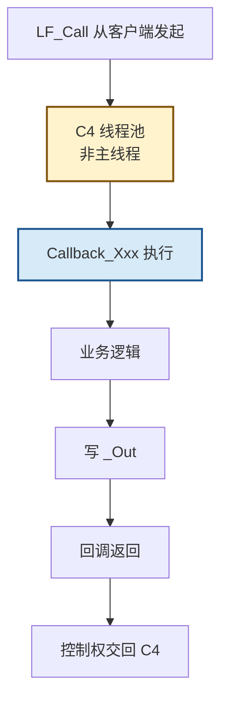

**契约**：
- 回调在 **C4 后台线程池** 执行，**不是主线程**。
- **禁止**：
  - 访问 UI 控件（VCL / LCL / GDI）
  - 调用阻塞 LF 函数：`LF_Call` / `LF_LocalCall` / `LF_Notify` / `LF_PrepareDone` / `LF_Shutdown`
  - 长时间 `Sleep`
  - 再触发一次 `LF_RegisterCall`
- **应该**：
  - 只读 `_In`，写 `_Out`，快速返回
  - 耗时操作交给 `TCompute.RunC_NP` / `TThread.CreateAnonymousThread` / Python `threading.Thread`
  - 需要 UI 时用 `TThread.Queue`（Pascal）/ `asyncio`（Python）

### 7.5 内部调用桩（`internal_call_*`）的命名差异

> **⚠️ 三方命名规则不同——这是有意设计**：

| 语言 | 命名规则 | 举例（源函数 `Foo`） |
|------|----------|---------------------|
| **Pascal** | `internal_call_<MakeApiName(Name)>_<UniqueApiName>`（**两段后缀**） | `internal_call_Foo_Foo` |
| **Python** | `internal_call_<MakePythonIdentifier(Name)>`（**一段后缀**） | `internal_call_foo` |
| **C++** | `internal_call_<MakeApiName(Name)>`（**一段后缀**） | `internal_call_Foo` |

**Pascal 生成的桩**：

```pascal
function internal_call_Foo_Foo(a: Int64; b: string): Int64;
(*
{$IFDEF FPC}
  procedure Do_Sync___();
  begin
    // call type: Result := internal_call_Foo_Foo(a, b);
  end;
{$ELSE FPC}
var temp_: Int64;
{$ENDIF FPC}
*)
begin
  Result := 0;
  // call type: Result := internal_call_Foo_Foo(a, b);
  (*
  {$IFDEF FPC}
    TCompute.Sync(Do_Sync___);
  {$ELSE FPC}
    TCompute.Sync(procedure()
    begin
      // call type: temp_ := internal_call_Foo_Foo(a, b);
    end);
    Result := temp_;
  {$ENDIF FPC}
  *)
end;
```

**Python 生成的桩**：

```python
def internal_call_foo(a: int, b: str) -> int:
    """Wrapper for the original routine 'Foo'.
    TODO: replace this placeholder with the actual implementation.
    """
    if DEBUG_LOG:
        print(f"[internal_call_foo] called")
    # Default return value; replace with actual logic.
    return 0
```

**C++ 生成的桩**：

```cpp
std::int64_t internal_call_Foo(std::int64_t a, const std::string& b)
{
    // TODO: replace this placeholder with the actual implementation.
    return 0;
}
```

**契约（三方共享）**：
- 这是**人类填充真实业务的入口**。
- 填充时**不要**改变函数签名。
- Pascal 侧：`// call type: ...` 注释**必须保留**。
- Pascal 侧：`(* ... TCompute.Sync ... *)` 块是**可选**的"是否在主线程执行"开关。**默认注释掉**。
- Python 侧：`TODO` 注释**保留**。
- C++ 侧：`TODO` 注释**保留**。
- 返回值默认 `0` / `0.0` / `""` 是**占位符**，必须替换。

---

## 第 8 章 工具注册 JSON 契约

### 8.1 `RegisterTool` 发送的 JSON

```json
{
  "name": "<ApiName>",
  "description": "<从注释提取>",
  "target_app": "<MY_APP_NAME>",
  "target_api": "<ApiName>",
  "parameters": {
    "type": "object",
    "properties": {
      "<param_name>": {
        "type": "integer|number|string",
        "description": "<param 描述>"
      }
    },
    "required": ["<param_name>", ...]
  }
}
```

### 8.2 字段约束

| 字段 | 约束 |
|------|------|
| `name` | 必填，工具名（= `ApiName`） |
| `description` | 必填，从注释提取 |
| `target_app` | 必填，**必须**等于 `MY_APP_NAME` |
| `target_api` | 必填，**必须**等于 `name` |
| `parameters` | 必填，JSON Schema |
| `parameters.type` | 必填，**必须**是 `"object"` |
| `parameters.properties` | 必填，每个参数一项 |
| `parameters.properties.<name>.type` | 必填，`"integer"` / `"number"` / `"string"` |
| `parameters.properties.<name>.description` | 可选 |
| `parameters.required` | 必填，**包含所有参数** |

### 8.3 Beacon 的响应契约

**成功**：
```json
{"status": "ok"}
```

**失败**：
```json
{"status": "error", "message": "..."}
```

**契约**：
- Provider 判定成功的条件：`resp.get("status") == "ok"`。
- 若 Beacon 返回 `{"error": "..."}`（无 `status`），视为失败。
- **不要**新增成功判定条件。

### 8.4 完整的注册示例

```json
{
  "name": "add",
  "description": "Add two integers: a + b",
  "target_app": "my_calculator",
  "target_api": "add",
  "parameters": {
    "type": "object",
    "properties": {
      "a": {
        "type": "integer",
        "description": "First operand"
      },
      "b": {
        "type": "integer",
        "description": "Second operand"
      }
    },
    "required": ["a", "b"]
  }
}
```

---

## 第 9 章 应用名与端点契约

### 9.1 应用名派生规则

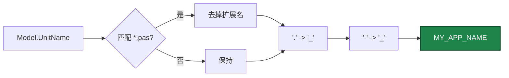

**举例**：

| 源单元名 | `MY_APP_NAME` |
|---------|--------------|
| `calculator.pas` | `calculator` |
| `my.utils.pas` | `my_utils` |
| `foo-bar.pas` | `foo_bar` |
| `MyUnit` | `MyUnit`（大小写保留） |

**契约**：
- **不要手动改 `MY_APP_NAME`**——它是客户端 `LF_Call(appName, ...)` 的 key。
- 两个 provider 使用**同一派生逻辑**——同名会冲突。

### 9.2 固定 Beacon 常量

生成器**硬编码**四个常量：

| 常量 | 值 | 用途 |
|------|-----|------|
| `BEACON_APP` | `'agent_main_app'` | Beacon 应用名 |
| `REGISTER_API` | `'register_agent'` | 注册工具 API |
| `AGENT_LOG_API` | `'agent_log'` | 异步日志 API |
| `IPC_ENDPOINT` | `'ipc:agent'` | IPC 端点 |

**契约**：
- **不要改这四个值**——`mcp_api_tool.py` 也用同样的默认值。
- 若确实需要自定义，改**客户端和服务端两侧**，且 `mcp_api_tool.py` 的 `--endpoint` / `--reg-agent-app` / `--agent-log-api` 参数也要同步。

### 9.3 多 provider 共存冲突

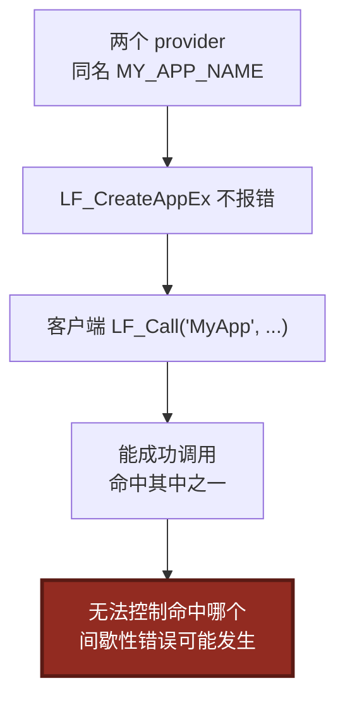

**实际行为**：
- `LF_Call('MyApp', ...)` **能成功调用**——命中其中一个（**先注册的**或**最后注册的**，取决于 LingoFuse 内核负载均衡）。
- **不是"静默失败"**——客户端能拿到结果。
- **无法控制命中哪个**——若两个 provider 的 API 定义不一致，可能**间歇性失败**。

**修复**：保持单元名唯一。

---

## 第 10 章 启动序列契约

### 10.1 `Execute_And_Reg_all()` 的精确流程

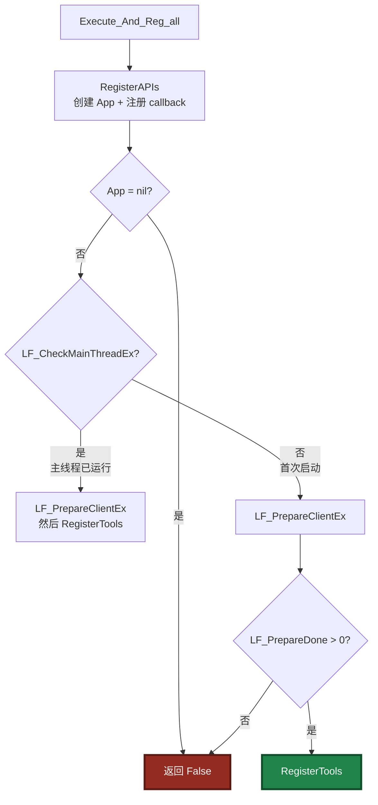

### 10.2 启动流程的精确定义

**Pascal 生成的 `Execute_And_Reg_all`**：

```pascal
function Execute_And_Reg_all: Boolean;
var
  App: TAppHnd___;
begin
  Result := False;
  App := RegisterAPIs();
  if App = nil then
  begin
    if DEBUG_LOG then DoStatus('[Execute_And_Reg_all] RegisterAPIs failed');
    Exit;
  end;
  if LF_CheckMainThreadEx then
  begin
    LF_PrepareClientEx(IPC_ENDPOINT, App);
    Result := RegisterTools();
  end
  else
  begin
    LF_PrepareClientEx(IPC_ENDPOINT, App);
    if LF_PrepareDone() > 0 then
      Result := RegisterTools()
    else
    begin
      if DEBUG_LOG then DoStatus('[Execute_And_Reg_all] LF_PrepareDone failed');
    end;
  end;
end;
```

**Python 生成的 `Execute_And_Reg_all`**：

```python
def Execute_And_Reg_all() -> bool:
    app = RegisterAPIs()
    if app is None:
        if DEBUG_LOG:
            print(f"[Execute_And_Reg_all] RegisterAPIs failed")
        return False

    LF_ResetPrepare()
    LF_PrepareClient(IPC_ENDPOINT.encode("utf-8"), app)
    if LF_PrepareDone() > 0:
        return RegisterTools()
    if DEBUG_LOG:
        print(f"[Execute_And_Reg_all] LF_PrepareDone failed")
    return False
```

### 10.3 启动契约

**必须遵守**：
- **不要**调整步骤顺序。
- **不要**跳过 `LF_ResetPrepare`。
- **不要**用 `LF_Call` 取代 `LF_PrepareClientEx`。
- **`Execute_And_Reg_all` 不幂等**：调用两次可能因 `LF_PrepareDone` 只返回一次 1 而失败。

### 10.4 退出契约

**Python 生成的 `__main__`**：

```python
if __name__ == "__main__":
    print(f"=== {MY_APP_NAME} tool provider ===")
    if not Execute_And_Reg_all():
        print("Startup failed.")
        sys.exit(1)
    print("Ready. Type 'exit' and press Enter to quit.")
    try:
        while True:
            line = input()
            if line.strip().lower() == "exit":
                break
    except (KeyboardInterrupt, EOFError):
        pass
    LF_ExitMainThread()
    LF_Shutdown()
    print("Shutdown complete.")
```

**Pascal 宿主**（provider 是单元，无 `__main__`）：

```pascal
// 宿主程序退出时
LF.ExitMainThread;
LF.Shutdown;
App.Free;
```

**契约（三方共享）**：
- **必须**在进程退出前调用 `LF_ExitMainThread` + `LF_Shutdown`。
- **不要**移除 Python 侧的 `input()` 循环——它保证进程存活，让 C4 后台线程持续处理请求。
- **不要**把 Python 侧改成 `asyncio.run`——provider 只需保持进程不退出。
- **Pascal 侧**：宿主退出顺序 `LF_ExitMainThread` → `LF_FreeApp` → `LF_Shutdown`。

---

## 第 11 章 注释与文档字符串契约

### 11.1 保留型注释（禁止 AI 改写）

| 位置 | 注释 | 理由 |
|------|------|------|
| Pascal `internal_call_*` | `// call type: Result := ...` | 提示填充位置 |
| Pascal `internal_call_*` | `(* ... {$IFDEF FPC} ... *)` 块 | 主线程同步的可选开关 |
| Python `internal_call_*` | `"""Wrapper for the original routine ... TODO: replace ..."""` | 提示填充位置 |
| Python `internal_call_*` | `# Default return value; replace with actual logic.` | 提示占位符 |
| C++ `internal_call_*` | `// TODO: replace this placeholder with the actual implementation.` | 提示填充位置 |
| Pascal callback | `// ---- <Name> (API: <ApiName>) ----` | 定位标记 |
| 文件头 | 整个 docstring | 说明生成器版本和入口 |

### 11.2 禁止 AI 添加的注释

- **解释性注释**：`// 这是一个加法函数` —— 与源注释重复。
- **"改进建议"注释**：`// TODO: 用更快的方法实现` —— 污染源文件。
- **"契约说明"注释**：`// 这个参数必须是 int64` —— 本文档就是契约来源。
- **版本标记注释**：`// v2.0 新增` —— 属于 changelog。
- **类型提示注释**：`# type: ignore` —— 类型已通过形参和 JSON schema 表达。

### 11.3 允许 AI 添加的注释

- **业务逻辑注释**：在 `internal_call_*` 的实现里，解释具体算法。
- **数据来源注释**：如果某个值来自数据库/文件，标注来源。
- **性能注释**：`# 这一步是 O(n log n)`
- **异常路径注释**：`# 如果 x 为 0，走 fallback 分支`

**总原则**：**契约相关不改，业务相关随你**。

### 11.4 文档字符串

**Python**：
- `internal_call_*` 的 docstring **保留**，可以**追加**业务说明。
- `callback_*` 的 docstring **不要动**。

**Pascal**：
- `internal_call_*` 的 `// ---- ... ----` 单行注释可以追加业务说明。
- `RegisterAPIs` / `RegisterTools` / `Execute_And_Reg_all` 的 `{* ... *}` XMLDoc **不要动**。

**C++**：
- `internal_call_*` 的 `// TODO` 注释保留，可以追加业务说明。
- 文件头注释不要动。

---

## 第 12 章 客户端参考实现

### 12.1 Pascal 客户端（调用 Provider）

```pascal
uses
  SysUtils, Classes,
  Z.Core, Z.Json, Z.PascalStrings,
  lingofuse_import, lingofuse_helper;

function CallAdd(const AppName: string; a, b: Int64): Int64;
var
  Req, Res: TDataHnd___;
  jsonBytes: TBytes;
  jo: TZ_JsonObject;
begin
  Result := 0;

  // 1. 创建请求句柄
  Req := LF_CreateDataEx('add');
  if Req = nil then Exit;
  try
    // 2. 构建请求 JSON
    jo := TZ_JsonObject.Create;
    try
      jo.I64['a'] := a;
      jo.I64['b'] := b;
      LF_WriteStringBytes(Req, jo.ToBytes);
    finally
      jo.Free;
    end;

    // 3. 调用远程 API
    Res := LF_CallEx(AppName, Req, 5000);
  finally
    LF_FreeData(Req);
  end;

  if Res = nil then Exit;
  try
    // 4. 读取响应
    jsonBytes := LF_ReadStringBytes(Res);
    if Length(jsonBytes) = 0 then Exit;

    jo := TZ_JsonObject.Create;
    try
      if not jo.Parae(jsonBytes) then Exit;
      if jo.Exists('error') then
      begin
        WriteLn('Error: ', jo.S['error']);
        Exit;
      end;
      if jo.Exists('result') then
        Result := jo.I64['result'];
    finally
      jo.Free;
    end;
  finally
    LF_FreeData(Res);
  end;
end;
```

### 12.2 Python 客户端（调用 Provider）

```python
import ctypes
from lingofuse._lf_native import (
    LF_CreateData, LF_FreeData, LF_Call,
    LF_WriteBuffer, LF_ReadBuffer, LF_GetPos, LF_SetPos,
    LF_GetSize, LF_GetBuffer,
)
from lingofuse.lf_io import (
    write_json, read_json, read_json_or_bytes, cstr,
)


def call_add(app_name: str, a: int, b: int) -> int:
    """调用 Provider 的 add API，返回结果。失败返回 0。"""
    # 1. 创建请求句柄
    req = LF_CreateData(cstr('add'))
    if not req:
        return 0
    try:
        # 2. 构建请求 JSON
        write_json(req, {'a': a, 'b': b})

        # 3. 调用远程 API
        resp = LF_Call(cstr(app_name), req, 5000)
    finally:
        LF_FreeData(req)

    if not resp:
        return 0
    try:
        # 4. 读取响应（容错模式）
        _rewind(resp)
        result = read_json(resp)
        if not isinstance(result, dict):
            return 0
        if 'error' in result:
            print(f"Error: {result['error']}")
            return 0
        return int(result.get('result', 0))
    finally:
        LF_FreeData(resp)


def _rewind(hnd):
    """将 DataHandle 的读取位置重置到 0。"""
    LF_SetPos(hnd, 0)
```

### 12.3 C++ 客户端（调用 Provider）

```cpp
#include "LingoFuse.h"
#include "json.hpp"
using json = nlohmann::json;

static std::string read_string(TDataHnd hnd) {
    const std::int64_t pos  = LF_GetPos(hnd);
    const std::int64_t size = LF_GetSize(hnd);
    if (pos < 0 || pos >= size) return {};
    const auto* base = static_cast<const std::uint8_t*>(LF_GetBuffer(hnd));
    if (!base) return {};
    std::int64_t end = pos;
    while (end < size && base[end] != 0) ++end;
    std::string result(reinterpret_cast<const char*>(base + pos),
                       static_cast<std::size_t>(end - pos));
    LF_SetPos(hnd, end + 1);
    return result;
}

static void write_string(TDataHnd hnd, const std::string& s) {
    if (!s.empty())
        LF_WriteBuffer(hnd, s.data(), static_cast<std::int64_t>(s.size()));
    const char nul = 0;
    LF_WriteBuffer(hnd, &nul, 1);
}

std::int64_t call_add(const std::string& app_name, std::int64_t a, std::int64_t b)
{
    TDataHnd req = LF_CreateData("add");
    if (!req) return 0;

    TDataHnd resp = nullptr;
    try {
        json payload;
        payload["a"] = a;
        payload["b"] = b;
        write_string(req, payload.dump(-1, ' ', false));
        resp = LF_Call(app_name.c_str(), req, 5000);
    } catch (...) { }

    LF_FreeData(req);

    if (!resp) return 0;
    std::int64_t result = 0;
    try {
        const std::string s = read_string(resp);
        if (!s.empty()) {
            json obj = json::parse(s);
            if (obj.contains("error"))
                return 0;
            if (obj.contains("result"))
                result = obj.value("result", static_cast<std::int64_t>(0));
        }
    } catch (...) { }
    LF_FreeData(resp);
    return result;
}
```

### 12.4 客户端错误处理矩阵

| 响应情形 | 检测方式 | 处理 |
|---------|---------|------|
| 空响应（超时） | `LF_GetSize(resp) == 0` | 返回默认值或报错 |
| `{"error": "..."}` | `resp.get('error')` | 记录并返回默认值 |
| `{"result": ...}` | `resp.get('result')` | 返回结果 |
| `{"status": "ok"}` | `resp.get('status') == "ok"` | 过程成功 |
| 非法 JSON | `json.loads` 抛异常 | 记录并返回默认值 |
| `null` 句柄 | `resp is None` | 记录并返回默认值 |

---

## 第 13 章 字节级 wire format 示例

### 13.1 输入示例：`{"a": 5, "b": 7}`

**UTF-8 编码**：
```
7B 22 61 22 3A 20 35 2C 20 22 62 22 3A 20 37 7D
{  "  a  "  :     5  ,     "  b  "  :     7  }
```

**加 NUL 结尾**：
```
7B 22 61 22 3A 20 35 2C 20 22 62 22 3A 20 37 7D 00
```

**DataHandle 缓冲**：
- pos = 0
- size = 17
- 字节：`7B 22 61 22 3A 20 35 2C 20 22 62 22 3A 20 37 7D 00`

**读取流程**：
1. `LF_GetPos(hnd)` → `0`
2. `LF_GetSize(hnd)` → `17`
3. `LF_GetBuffer(hnd)` → 指向缓冲首字节的指针
4. 扫描到 `0x00`（索引 16）
5. `LF_ReadBuffer(hnd, buf, 16)` → 拷贝 16 字节到 buf
6. `LF_SetPos(hnd, 17)` → pos = 17

**结果**：`b'{"a": 5, "b": 7}'`

### 13.2 输入示例：含中文

**JSON 逻辑值**：`{"name": "中文"}`

**UTF-8 编码**：
```
7B 22 6E 61 6D 65 22 3A 20 22 E4 B8 AD E6 96 87 22 7D
{  "  n  a  m  e  "  :     "  中       文        "  }
```

**加 NUL 结尾**：
```
7B 22 6E 61 6D 65 22 3A 20 22 E4 B8 AD E6 96 87 22 7D 00
```

**总长度**：19 字节（含 NUL）

**错误示例（转义形式）**：
```
7B 22 6E 61 6D 65 22 3A 20 22 5C 75 34 45 32 44 5C 75 36 35 38 37 22 7D 00
{  "  n  a  m  e  "  :     "  \  u  4  E  2  D  \  u  6  5  8  7  "  }
```
**后果**：token 消耗从 7 字节（`"中文"`）膨胀到 17 字节（`"\u4E2D\u6587"`）。

### 13.3 输出示例：`{"result": 12}`

**UTF-8 编码 + NUL**：
```
7B 22 72 65 73 75 6C 74 22 3A 20 31 32 7D 00
{  "  r  e  s  u  l  t  "  :     1  2  }  \0
```

**总长度**：15 字节

### 13.4 输出示例：`{"status": "ok"}`

**UTF-8 编码 + NUL**：
```
7B 22 73 74 61 74 75 73 22 3A 20 22 6F 6B 22 7D 00
{  "  s  t  a  t  u  s  "  :     "  o  k  "  }  \0
```

**总长度**：17 字节

### 13.5 输出示例：`{"error": "Invalid JSON"}`

**UTF-8 编码 + NUL**：
```
7B 22 65 72 72 6F 72 22 3A 20 22 49 6E 76 61 6C 69 64 20 4A 53 4F 4E 22 7D 00
```

**总长度**：27 字节

### 13.6 大 payload 示例

**10 KB JSON**：约 10240 字节 + 1 字节 NUL = 10241 字节。

**LingoFuse 的分块策略**：
- 小于 61440 字节（`C_Buffer_Chunk_Size`）：单块传输。
- 大于 61440 字节：分块传输。

**对大 payload 的影响**：
- Provider 侧无感知——`LF_ReadStringBytes` 会一次性读全部。
- 内存占用：payload 大小 + 一份拷贝（在 `LF_ReadStringBytes` 内部）。

### 13.7 跨语言字节对比表

| 场景 | Pascal | Python | C++ |
|------|--------|--------|-----|
| 空 JSON `{}` | `7B 7D 00` | 同 | 同 |
| `{"a":1}` | `7B 22 61 22 3A 31 7D 00` | 同 | 同 |
| `{"a":1,"b":"x"}` | `7B 22 61 22 3A 31 2C 22 62 22 3A 22 78 22 7D 00` | 同 | 同 |
| 中文 `{"k":"中"}` | `7B 22 6B 22 3A 22 E4 B8 AD 22 7D 00` | 同 | 同 |
| Emoji `{"k":"😀"}` | `7B 22 6B 22 3A 22 F0 9F 98 80 22 7D 00` | 同 | 同 |

**关键**：三方必须产生**完全相同**的字节序列（JSON 字段顺序除外）。字段顺序不同不影响语义（JSON 对象无序）。

---

## 第 14 章 反例集

### 14.1 参数改名

```python
# ❌ 错误：把 'a' 改成 'x'
def callback_add(_Trigger, _In, _Out):
    data = json.loads(...)
    x = data.get('a') or 0
```

**后果**：客户端发 `{"a": 5}`，Provider 读 `data.get('x')` 得到 `None` → `0`。

**正确**：
```python
    a = data.get('a') or 0
```

### 14.2 返回字段改名

```pascal
// ❌ 错误：改 'result' 为 'value'
jo.I64['value'] := ret;
```

**正确**：
```pascal
jo.I64['result'] := ret;
```

### 14.3 忘记 cdecl

```pascal
// ❌ 错误
procedure Callback_Add_Add(_Trigger___: Pointer; _In___, _Out___: TDataHnd___);
```

**正确**：
```pascal
procedure Callback_Add_Add(_Trigger___: Pointer; _In___, _Out___: TDataHnd___); cdecl;
```

### 14.4 去掉 NUL 结尾

```python
# ❌ 错误：手写回调时忘了 NUL
LF_WriteBuffer(_Out, json.dumps({"result": ret}).encode("utf-8"), len(...))
# 没有 LF_WriteBuffer(_Out, b"\x00", 1)
```

**后果**：Pascal 侧容错模式能读到全部内容，但多字段 DataHandle 场景下会读到错误内容。

**正确**：用生成器的 `_write_string`，或手动追加 `b"\x00"`。

### 14.5 `ensure_ascii` 未关闭

```python
# ❌ 错误：默认 ensure_ascii=True
_write_string(_Out, json.dumps({"result": "中文"}))
# 实际写入：b'{"result": "\\u4e2d\\u6587"}\x00'
```

**正确**：
```python
_write_string(_Out, json.dumps({"result": "中文"}, ensure_ascii=False).encode("utf-8"))
```

### 14.6 回调中调用阻塞函数

```pascal
// ❌ 错误
procedure Callback_Foo_Foo(...); cdecl;
begin
  Other := LF_CallEx('OtherApp', SomeData, 5000);  // 死锁
end;
```

**正确**：
```pascal
procedure Callback_Foo_Foo(...); cdecl;
begin
  TCompute.RunC_NP(procedure
  begin
    Other := LF_CallEx('OtherApp', SomeData, 5000);
  end);
end;
```

### 14.7 在回调中手动释放 `_In` / `_Out`

```pascal
// ❌ 错误
procedure Callback_Foo_Foo(...); cdecl;
begin
  LF_FreeData(_In___);   // 双击释放
  LF_FreeData(_Out___);  // 
end;
```

**正确**：**永远不要**释放 `_In` / `_Out`。

### 14.8 返回 `bool`

```pascal
// ❌ 错误：用了 bool 作为返回类型
function MyFunc: Boolean;
```

**后果**：整条声明被丢弃。

**正确**：用 `Int64` 返回 0/1。

### 14.9 参数用 `array of string`

```pascal
// ❌ 错误
function MyFunc(items: array of string): Int64;
```

**后果**：整条声明被丢弃。

**正确**：用 JSON 字符串 `string` 传递数组。

### 14.10 改 `MY_APP_NAME`

```pascal
// ❌ 错误：手改了 MY_APP_NAME
MY_APP_NAME : string = 'my_special_name';
```

**后果**：客户端 `LF_Call(appName, ...)` 找不到服务端。

### 14.11 改回调内部形参名

```python
# ❌ 错误
@LFCallFunc
def callback_add(a, b, c):   # 应为 _Trigger, _In, _Out
    ...
```

**后果**：位置参数错位。

### 14.12 删除 `internal_call_*` 占位

```python
# ❌ 错误：直接删掉 internal_call_*
def callback_add(_Trigger, _In, _Out):
    ret = a + b   # 直接内联
```

**后果**：重新生成时会被覆盖。

**正确**：在 `internal_call_*` 内实现。

### 14.13 修改 `cdecl` 为 `stdcall`

```pascal
// ❌ 错误
procedure Callback_Foo_Foo(...); stdcall;
```

**正确**：`cdecl` 是硬约束。

### 14.14 在 Pascal 侧用 `jo.ParseText` 而非 `jo.Parae`

```pascal
// ❌ 错误
jsonBytes := LF_ReadStringBytes(TDataHnd(_In___));
jo.ParseText(TEncoding.UTF8.GetString(jsonBytes));
```

**正确**：
```pascal
jsonBytes := LF_ReadStringBytes(TDataHnd(_In___));
if not jo.Parae(jsonBytes) then ...;
```

### 14.15 Python 侧用 `json.loads(jo.ToBytes)`

```python
# ❌ 错误：绕过生成器的 helper
raw = ...
data = json.loads(raw.decode("utf-8"))
```

**后果**：若 `raw` 末尾有 `\x00`，`json.loads` 报错。

**正确**：用 `_read_string_bytes(_In)`。

### 14.16 双重 JSON 序列化

```python
# ❌ 错误
_write_string(_Out, json.dumps(json.dumps({"result": ret}, ensure_ascii=False), ensure_ascii=False))
```

**后果**：客户端拿到字符串而非对象。

**正确**：
```python
_write_string(_Out, json.dumps({"result": ret}, ensure_ascii=False))
```

### 14.17 在 C++ 中用 `read_json` 后未检查 is_object

```cpp
// ❌ 错误：JSON 可能是数组或标量
json req = read_json(in_hnd);
std::int64_t a = req.value("a", 0);  // 如果 req 是数组，value() 行为未定义
```

**正确**：
```cpp
json req = read_json(in_hnd);
if (!req.is_object())
    req = json::object();
std::int64_t a = req.value("a", static_cast<std::int64_t>(0));
```

### 14.18 忘记释放响应句柄

```pascal
// ❌ 错误：只释放了请求
Req := LF_CreateDataEx('add');
LF_WriteStringBytes(Req, jo.ToBytes);
Res := LF_CallEx(AppName, Req, 5000);
LF_FreeData(Req);
// 忘了 LF_FreeData(Res);
```

**后果**：句柄泄漏，5 分钟后自动回收。

**正确**：
```pascal
try
  // 处理 Res
finally
  LF_FreeData(Res);
end;
```

### 14.19 在回调中写超过 64KB 的 payload

**后果**：LingoFuse 会分块传输，但分块边界可能破坏 NUL 终止符的原子性（**不确定**，需实测）。

**建议**：单次 payload 控制在 64KB 以内；超出时用分块协议。

### 14.20 C++ 中 `extern const bool` 的内部链接问题

```cpp
// ❌ 错误：const bool 默认为内部链接
const bool DEBUG_LOG = false;
```

**正确**：
```cpp
extern const bool DEBUG_LOG = false;
```

---

## 第 15 章 自查清单

### 15.1 修改 `internal_call_*` 后

- [ ] 参数名、参数类型、返回类型**未变**。
- [ ] Pascal 侧：`// call type: ...` 注释**保留**。
- [ ] Python 侧：`TODO` 注释**保留**。
- [ ] C++ 侧：`// TODO` 注释**保留**。
- [ ] 业务逻辑未阻塞（无 `Sleep` / 无同步 `LF_Call`）。
- [ ] 返回值类型与形参一致。

### 15.2 修改 `callback_*` 后

- [ ] `cdecl` / `@LFCallFunc` / `LF_CDECL` **未动**。
- [ ] `_In` / `_Out` **未被释放**。
- [ ] 返回 JSON 字段名是 `result` / `status` / `error` 之一。
- [ ] 异常路径写入了 `error`。
- [ ] 没调用阻塞 LF 函数。
- [ ] **所有 JSON 序列化都带 `ensure_ascii=False`**。

### 15.3 新增函数后

- [ ] 参数类型是 `int64` / `double` / `string` 之一。
- [ ] 返回类型是 `int64` / `double` / `string` 之一。
- [ ] 形参名与客户端 JSON key 一致。
- [ ] 在 Pascal 源注释中写 Doxygen 或 `:` / `=` 风格描述。
- [ ] 涉及 JSON 序列化的地方都带 `ensure_ascii=False`。

### 15.4 修改生成器后

- [ ] `IsSupportedType` 三方严格一致。
- [ ] `PascalTypeToJsonSchemaType` 三方严格一致。
- [ ] `PyStrLit` / `CPPStrLit` 保持 `TP_Char` 迭代。
- [ ] **`PascalStrLit`** 仍**委托**给 `TTextParsing.Translate_Text_To_Pascal_Decl`。
- [ ] **`GetFullDescription`（Pascal 侧）** 仍经 `TPascalStringList.AsText`——已知隐患。
- [ ] **`GetFullDescription`（Python 侧）** 仍逐字符扫描 `TP_String`。
- [ ] `total_count` 在 `RegisterTools()` 中**先赋值再使用**。
- [ ] 所有新增的 `json.dumps` 都带 `ensure_ascii=False`。
- [ ] 回归测试：生成含中文注释和 emoji 的模型。

### 15.5 提交前最终自查

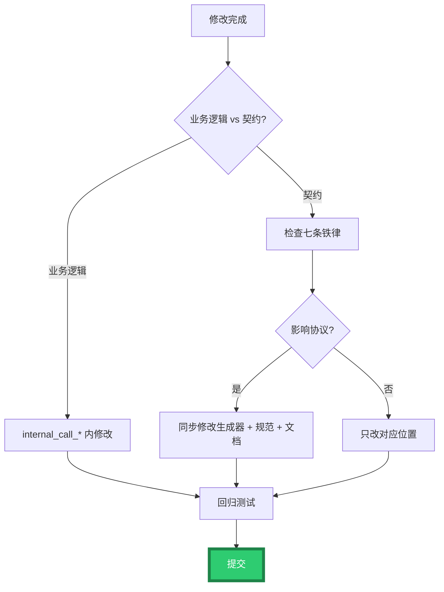

---

## 第 16 章 错误码与错误消息索引

### 16.1 工具注册响应

| 响应 JSON | 含义 | Provider 处理 |
|-----------|------|--------------|
| `{"status": "ok"}` | 注册成功 | `RegisterTool` 返回 True |
| `{"status": "error", "message": "..."}` | 注册失败 | 记录日志，返回 False |
| 空响应 | 网络/超时 | 返回 False |
| `null` 句柄 | 调用失败 | 返回 False |
| 非法 JSON | 解析失败 | 返回 False |

### 16.2 工具调用响应

| 响应 JSON | 含义 | 客户端处理 |
|-----------|------|-----------|
| `{"result": <值>}` | 函数成功 | 读 `result` |
| `{"status": "ok"}` | 过程成功 | 完成 |
| `{"error": "..."}` | 任何错误 | 记录错误 |
| 空响应 | 超时/失败 | 报错 |
| `null` 句柄 | 调用失败 | 报错 |
| 非法 JSON | 解析失败 | 报错 |

### 16.3 错误消息清单

| 错误消息 | 出处 | 说明 |
|----------|------|------|
| `"Empty input"` | 生成器（Pascal/Python） | 空 JSON |
| `"Invalid JSON"` | 生成器（Pascal） | 无效 JSON（**完全等于**） |
| `"Invalid JSON: <具体错误>"` | 生成器（Python） | 无效 JSON（**前缀匹配**） |
| `"Division by zero"` | 业务逻辑 | 除零（示例） |
| `"<异常消息>"` | 业务逻辑 | 任何异常 |

### 16.4 LingoFuse 层错误

| 错误 | 触发条件 | 处理 |
|------|---------|------|
| `LF_PrepareDone returned 0` | 二次调用 | 检查初始化顺序 |
| `LF_PrepareClient returned -1` | 地址重复 | 用 `Overlap_Connection` 或换地址 |
| `Queue ... already occupied` | 端口占用 | 换端点 |
| `LF_BindApp returned 0` | 无空闲客户端 | 检查 `Simultated_Main_Thread_Activated` |
| `no found app("...")` | App 名错误 | 检查 `client_name` |
| `no found api("...")` | API 名错误 | 检查注册名 |

### 16.5 MCP 层错误

| 错误 | 触发条件 | 处理 |
|------|---------|------|
| `unrecognized type json_schema` | schema 嵌套错 | 检查 `response_format` |
| `strict must be bool` | 类型错 | 用 `true` 而非 `"true"` |
| `additionalProperties must be false` | 严格模式约束 | 补全 |
| `tool_calls arguments empty` | SSE 分片未聚合 | 按 `index` 累加 |
| `LF_Call returned null` | 调用失败 | 检查 App/API 名 |

### 16.6 HTTP 桥接错误码

| 错误码 | HTTP | 含义 |
|--------|------|------|
| `-1` | 200 | 远程调用失败 |
| `-2` | 400 | 请求形状错误 |
| `-3` | 200 | API 预检失败 |

---

## 第 17 章 与生成器源码的对应关系

### 17.1 协议契约 ↔ 生成器函数

| 契约项 | Pascal 侧实现 | Python 侧实现 | C++ 侧实现 |
|--------|--------------|---------------|-----------|
| 类型白名单 | `IsSupportedType` | `IsSupportedType` | `IsSupportedType` |
| 类型→Python | — | `PascalTypeToPythonType` | — |
| 类型→JSON Schema | `RegisterToolLines` 内联 | `PascalTypeToJsonSchemaType` | `PascalTypeToJsonSchemaType` |
| 类型→默认值 | `CallbackLines` 内联 | `PascalTypeDefaultValue` | `PascalTypeToDefaultValue` |
| 类型→C++ | — | — | `PascalTypeToCPPType` |
| API 名清洗 | `MakeApiName` | `MakePythonIdentifier` | `MakeApiName` |
| 回调名生成 | `MakeCallbackName` | `CallbackName := 'callback_' + ...` | `MakeCallbackName` |
| 内部桩名 | `MakeInternalCallName` | `InternalCallName := 'internal_call_' + ...` | `MakeInternalCallName` |
| 字符串字面量 | `PascalStrLit`（委托） | `PyStrLit`（自实现） | `CPPStrLit`（自实现） |
| 描述提取 | `GetFullDescription`（SystemString 中转） | `GetFullDescription`（逐字符） | `GetFullDescription`（经 `CleanComment_Local`） |
| 应用名派生 | `GeneratePascalCode` 内联 | `GeneratePythonCode` 内联 | `GenerateCPPCode` 内联 |

### 17.2 生成模块 ↔ 契约部分

| 生成模块 | 对应契约章节 |
|---------|-------------|
| `HeaderLines` | §1（线格式）、§9（应用名） |
| `InterfaceLines` | §9（常量）、§10（入口） |
| `UsesLines` | — |
| `ForwardLines` | §7（回调签名） |
| `Ret2StrLines` | — |
| `InternalCallLines` | §7.5（内部桩） |
| `LoggingLines` | §4（无转义） |
| `CallbackLines` | §1（线格式）、§5（输入）、§6（输出）、§7（签名） |
| `RegisterToolLines` | §8（工具注册） |
| `RegisterAPIsLines` | §10（启动） |
| `ExecuteLines` | §10（启动） |
| `ResultLines` | — |

### 17.3 三语言生成器的差异

| 维度 | Pascal | Python | C++ |
|------|--------|--------|-----|
| 类型白名单 | `Int64`/`Double`/`string` | 同 | 同 |
| JSON Schema 映射 | 同 | 同 | 同 |
| 描述提取 | `TPascalStringList.AsText`（SystemString 中转） | 逐字符扫描 `TP_String` | `CleanComment_Local` |
| 重名工具 | 加数字后缀 | 加数字后缀 | **丢弃** |
| 描述截断 | 无 | 无 | `MAX_DESC_LEN = 200` |
| 回调宏 | `cdecl` | `@LFCallFunc` | `LF_CDECL` |
| 内部桩命名 | `internal_call_<Name>_<ApiName>` | `internal_call_<name>` | `internal_call_<Name>` |
| 字符串字面量 | 委托 `Translate_Text_To_Pascal_Decl` | `PyStrLit` 自实现 | `CPPStrLit` 自实现 |
| 输出文件 | `.pas` | `.py` | `.hpp` + `.cpp` |

---

## 附录 A：不确定清单

> 以下是从源码**无法完全确定**的点。若 AI 需要在这些场景下工作，必须回查源码或询问人类。

1. **`Translate_C_Typ_To_Pascal` 的注释转换细节** — 复杂 C 注释是否稳定。
2. **`DetectSourceLanguage` 的具体评分算法** — 建议手动选语言。
3. **`GetFullDescription` 的截断** — Pascal/Python 无截断，C++ 有 `MAX_DESC_LEN = 200`。
4. **`LFCallFunc` 的确切类型签名** — 参考 `lingofuse._lf_native`。
5. **`total_count` 在 `RegisterTools` 里的 fix 是否完整** — 建议语法检查。
6. **新语言生成器的最小契约** — 参照 §17.1。
7. **GUI 的 `SysTimer` 1ms 是否最优** — 建议改为 10ms。
8. **`MakeApiName` 的字符替换表** — **已确认不完整**（只替换 6 个字符），建议白名单过滤。
9. **`PascalStrLit` 与 `Translate_Text_To_Pascal_Decl` 的关系** — 委托关系。
10. **声明规范与生成器的一致性维护** — 建议 CI 检查。
11. **`GetFullDescription`（Pascal 侧）的 SystemString 中转** — 存在非 ASCII 兼容性隐患。
12. **`code_decl_to_mcp_knowledge_base.md` 与 `MCP_API_Contract.md` 的同步** — 建议人工核对。
13. **单次 payload 超过 64KB 的分块边界是否破坏 NUL 原子性** — 需实测。
14. **`required` 数组包含所有参数的副作用** — 客户端会视为所有参数必填，与"可选参数"语义冲突。
15. **`data.get('x') or 0` 的 falsy 兜底** — 对 `0` / `""` / `False` 有副作用，但对白名单类型无害。

---

## 附录 B：修订历史

### v3.0（2026-09-22）—— 本版

**完整重构**：

1. **第 1-3 章完整重写**：精确定义 wire format 的字节级结构。
2. **新增第 12 章**：可运行的客户端参考实现（Pascal / Python / C++）。
3. **新增第 13 章**：字节级 wire format 示例（hex dump）。
4. **新增第 16 章**：完整的错误码与错误消息索引。
5. **新增第 17 章**：与生成器源码的对应关系（函数级映射）。
6. **章节重组**：从"介绍式"转为"契约式"。
7. **保留 v2.0 的全部修正**（11 处）。
8. **新增三方（C++）覆盖**：v2.0 只有 Pascal/Python 双语言契约，v3.0 加入 C++ 生成器。

**v2.0 修正沿用**：

- §14.4 `PascalStrLit` 自查项修正。
- §14.4 `GetFullDescription` 自查项修正。
- §7.4 Pascal/Python 内部桩命名差异。
- §4.5 `str(obj)` 措辞精确化。
- §5.5 `required` 数组副作用。
- §6.5 Pascal/Python `Invalid JSON` 消息格式区分。
- §7.1 / §7.4 `<Name>` 明确为 `MakeApiName` 清洗后的名字。
- §8.3 "静默失败"改为"命中不确定"。
- §10.2 补充 Pascal 侧宿主退出责任。
- §3.4 补充 `LF_Notify` 句柄释放豁免。
- §17 三级标签（协议契约 / 生成器实现 / 外部依赖 / 已知隐患）。

### v2.0（2026-09-20）

- 修正 11 处问题。

### v1.1（2026-09-20）

- 禁止字符制图。
- 新增第 4 章"JSON 无转义契约"。
- 反例集新增 12.16。

### v1.0（2026-09-20）

- 初版。

---

*文档版本：v3.0（完整重构版）*
*覆盖范围：`pas_mcp_generator_tool.pas` + `py_mcp_generator_tool.pas` + `cpp_mcp_generator_tool.pas` 生成的接口*
*配套文档：`code_decl_to_mcp_knowledge_base.md`、`LingoFuse_Pascal_Complete_Guide.md`、`Z.Json.md`、`Z.Pascal_Func_Tool Knowledge Base.md`、`pascal_code_mcp_rule.md`、`C_code_mcp_rule.md`*
*最后更新：2026-09-22*