# code_decl_to_mcp 工具链与 LLM 生态知识库（v5.0）

> **定位**：面向 AI 与人类工程师的权威参考。目标是让读者**无需翻阅源码**即可安全、准确地使用、修改、维护 `code_decl_to_mcp` 工具链及其配套的 LLM 生态组件。
>
> **使用方式**：AI 可直接引用本文件内的 API 签名、契约、模板、反例；遇到不确定清单中的场景，必须回查源码或询问人类。
>
> **v5.0 修订摘要**（相对 v4.0）：
> - **全新第 3 章：README 生成体系** — 三语言 README 生成器完整契约
> - **新增第 2.6 节：FPC 编译约束** — `{$mode delphi}` 下不能内联 `var` 声明
> - **新增第 0.5/0.6 节：三份 README 速查 + 三仓库依赖模型**
> - **重写第 16 章（自查清单）与新增第 17 章（自我审查验证）**
> - **更新反例集、故障排查树、修改指引，把 README 相关条目并入**
> - **第 1.5 节：输出文件全景图（代码 + README）**

---

## 目录

- [第 0 章 快速定位](#第-0-章-快速定位)
- [第 1 章 code_decl_to_mcp 工具链](#第-1-章-code_decl_to_mcp-工具链)
- [第 2 章 代码生成器](#第-2-章-代码生成器)
- [第 3 章 README 生成体系（v5.0 新增）](#第-3-章-readme-生成体系v50-新增)
- [第 4 章 LLM 服务端](#第-4-章-llm-服务端)
- [第 5 章 MCP 网关](#第-5-章-mcp-网关)
- [第 6 章 中间件与桥接](#第-6-章-中间件与桥接)
- [第 7 章 共享模块](#第-7-章-共享模块)
- [第 8 章 Wire format 与协议](#第-8-章-wire-format-与协议)
- [第 9 章 配置参数参考](#第-9-章-配置参数参考)
- [第 10 章 生命周期与状态机](#第-10-章-生命周期与状态机)
- [第 11 章 线程模型](#第-11-章-线程模型)
- [第 12 章 反例集](#第-12-章-反例集)
- [第 13 章 故障排查树](#第-13-章-故障排查树)
- [第 14 章 端到端示例](#第-14-章-端到端示例)
- [第 15 章 修改与扩展指引](#第-15-章-修改与扩展指引)
- [第 16 章 自查清单](#第-16-章-自查清单)
- [第 17 章 自我审查验证（v5.0 新增）](#第-17-章-自我审查验证v50-新增)
- [附录 A：配置参数速查](#附录-a配置参数速查)
- [附录 B：错误码与错误消息索引](#附录-b错误码与错误消息索引)
- [附录 C：诚实的不确定清单](#附录-c诚实的不确定清单)
- [附录 D：修订历史](#附录-d修订历史)

---

## 第 0 章 快速定位

### 0.1 一句话

**把 Pascal / C 的函数声明，自动变成 AI 可调用的 MCP 工具——同时输出 Pascal、Python、C++ 三种工具提供者代码，以及三份与代码同步的 README 使用文档。**

### 0.2 六层架构（v5.0 增加 README 层）

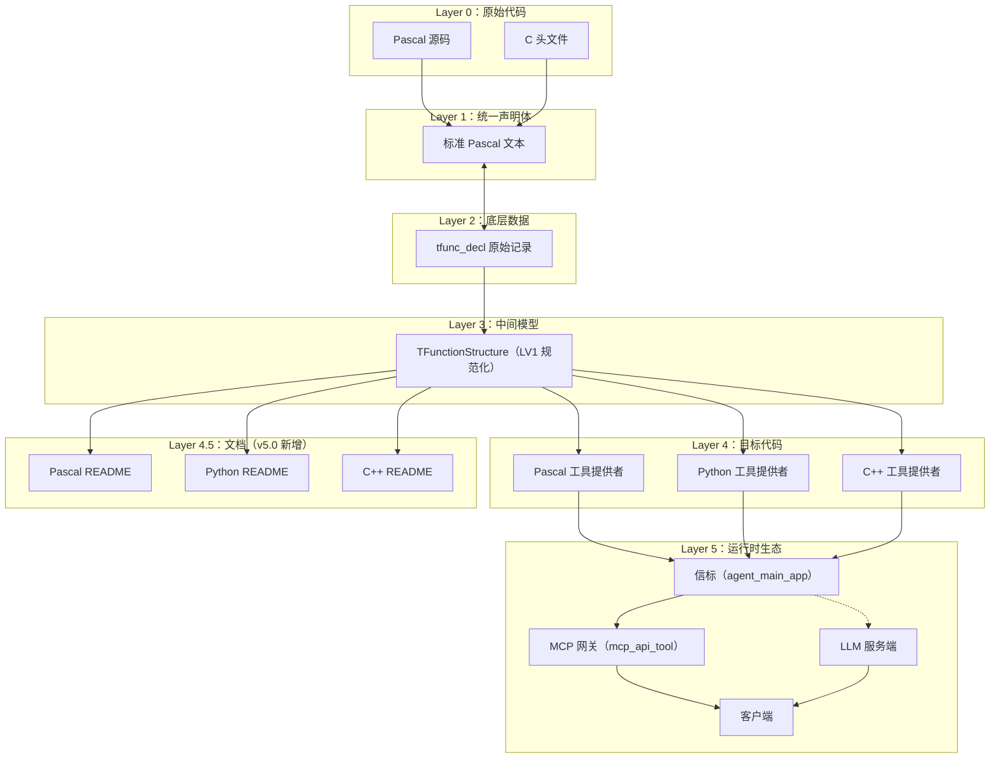

**核心关系**：`Layer 4` 与 `Layer 4.5` **共享同一个 `TPascal_Func_Model`**，因此**代码与文档天然同步**。

### 0.3 组件职责与入口

| 组件 | 类型 | 入口 | 输出 |
|------|------|------|------|
| `code_decl_to_mcp` | GUI | `code_decl_to_mcp.lpr` | 7 个代码/文档文件 |
| `pas_mcp_generator_tool` | 代码生成器 | `GeneratePascalCode(Model)` | Pascal 单元 |
| `py_mcp_generator_tool` | 代码生成器 | `GeneratePythonCode(Model)` | Python 模块 |
| `cpp_mcp_generator_tool` | 代码生成器 | `GenerateHPPCode` / `GenerateCPPCode` | `.hpp` + `.cpp` |
| **`pas_mcp_generator_tool`** | **文档生成器** | **`GeneratePascalReadme(Model)`** | **Pascal README** |
| **`py_mcp_generator_tool`** | **文档生成器** | **`GeneratePythonReadme(Model)`** | **Python README** |
| **`cpp_mcp_generator_tool`** | **文档生成器** | **`GenerateCPPReadme(Model)`** | **C++ README** |
| `mcp_api_tool.py` | MCP 网关 | `main()` | MCP stdio/http/sse |
| `language_middleware.py` | 中间件 | `LanguageMiddleware.get_instance()` | 单例 |
| `llm_service.py` | LLM 服务端 | `main()` | LingoFuse RPC |
| `llm_proxy.py` | LLM 代理 | `main()` | LingoFuse RPC |
| `llm_proxy_tool.py` | LLM 工具桥 | `main()` | LingoFuse RPC |
| `llm_test.py` | 测试客户端 | `main()` | 命令行 |
| `bridge.py` | HTTP 桥接 | `main()` | HTTP POST |
| `mcp_api_proxy.py` | stdio 调试代理 | `main()` | 命令行 |

### 0.4 两条工具执行路径

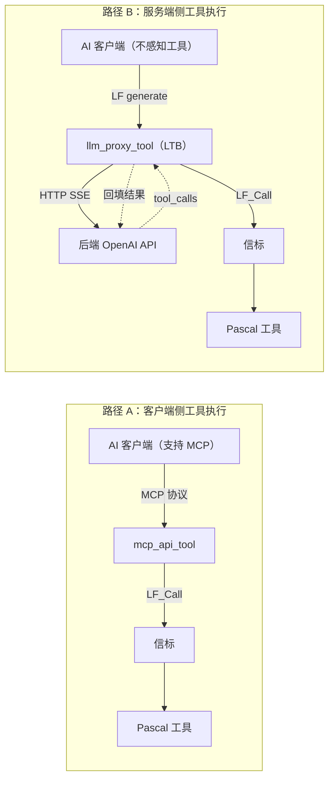

### 0.5 三份 README 速查（v5.0 新增）

| 语言 | README 文件名 | 主要依赖仓库 | 测试程序形式 |
|------|-------------|-------------|--------------|
| Pascal | `<unit>_tool_provider_pascal.md` | ZCore + ZNetV2 + LingoFuse-pasAgent-v3 | 独立 `.lpr`（README 内置完整源码） |
| Python | `<unit>_tool_provider_python.md` | `py-lingofuse`（优先）或 v3 的 `lingofuse/`（兜底） | **生成的 `.py` 本身**（无需额外脚本） |
| C++ | `<unit>_tool_provider_cpp.md` | `nlohmann/json` + `LingoFuse.h`（cppAgent **未发布**） | `main.cpp`（README 内置完整源码 + 兜底 `LingoFuse.h`） |

**三份 README 的共同点**：
- 全英文内容
- 含 Mermaid 架构图 + 6~7 步测试指引流程图
- 从同一 `TPascal_Func_Model` 生成 → 与代码天然同步
- 均包含：Overview / Architecture / Test Program / Build & Test / Tool Reference / JSON Schema / Troubleshooting / Portability / Resources

### 0.6 三仓库依赖模型（v5.0 新增）

生成的 Pascal provider **不能独立运行**，它需要三个仓库共存于磁盘：

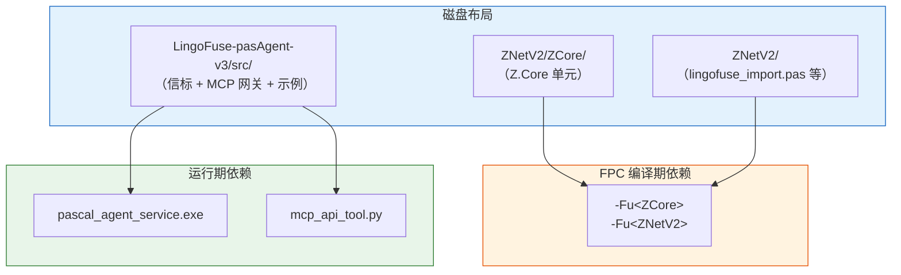

| 仓库 | 提供 | 典型路径 |
|------|------|---------|
| **ZCore** | `Z.Core` 单元（`TCompute` / `TCore_Thread` / `TAtomVar` / `TBigList` 等） | `<workspace>/ZNetV2/ZCore/` |
| **ZNetV2** | `lingofuse_import.pas` + `lingofuse_helper.pas` + `z_ipc_*.dll` | `<workspace>/ZNetV2/` |
| **LingoFuse-pasAgent-v3** | `pascal_agent_service.exe` + `mcp_api_tool.py` + `generate_agent_json.py` + `CreateHealthCheck/` 示例 | `<workspace>/LingoFuse-pasAgent-v3/src/` |

> 三个仓库的 URL 在生成的 README 中均为占位符 `<zcore-repo-url>` / `<znetv2-repo-url>` / `<v3-repo-url>`，**发布前必须替换为真实地址**。

---

## 第 1 章 code_decl_to_mcp 工具链

### 1.1 工具链的数据模型

#### 1.1.1 `TFunctionStructure`（LV1 模型中的函数）

```pascal
TFunctionStructure = record
  Name: TP_String;              // 函数名（Pascal 原始名）
  IsFunction: boolean;          // True=function，False=procedure
  Params: TParamArray;          // 参数数组
  ReturnType: TP_String;        // 归一化返回类型（'Int64' / 'Double' / 'string' / ''）
  Comment: TP_String;           // 清理后的注释
  procedure Clear;
  function Clone: TFunctionStructure;
end;

TParamArray = array of TParamStructure;

TParamStructure = record
  Name: TP_String;              // 参数名（原始）
  Typ: TP_String;               // 原始类型字符串
  PascalType: TP_String;        // 归一化类型（'Int64' / 'Double' / 'string'）
  Description: TP_String;       // 从注释提取的描述
  procedure Clear;
end;
```

**契约**：
- `Name` **不做任何改名**——它就是 JSON key 的来源。
- `PascalType` 只有三个合法值：`'Int64'`、`'Double'`、`'string'`。其他值的声明会在 `CollectValidFunctions` 阶段被整条丢弃。
- `Description` 由 `ExtractParamDescriptions` 从注释中提取，可能为空。
- `Comment` 已被 `CleanComment` 清理。

#### 1.1.2 `TPascal_Func_Model`（LV1 容器）

```pascal
TPascal_Func_Model = class(TCore_Object_Intermediate)
public
  property Typ_Normalize_Func: TTyp_Normalize_Func read ... write ...;
  property UnitName: TP_String read ... write ...;
  property Funcs: TFunctionList read ...;
  property FuncCount: integer read ...;
  procedure LoadFromParser(Parser: tpascal_func_decl_tool; Report: TPascalStringList);
  procedure SaveToParser(Parser: tpascal_func_decl_tool);
  procedure LoadFromJson(const JsonStr: TP_String);
  function  SaveToJson: TP_String;
end;

TTyp_Normalize_Func = (tnf_Json, tnf_ABI);
```

**契约**：
- 默认 `tnf_Json`——整数族归一为 `'Int64'`，浮点族为 `'Double'`，字符串族为 `'string'`。**所有生成器（代码 + README）都要求这个模式**。
- `LoadFromParser` 跳过 `NestLevel <> 0` 的声明与 `var` / `out` 参数。

### 1.2 GUI 工作流

#### 1.2.1 5 个 Tab 的状态机

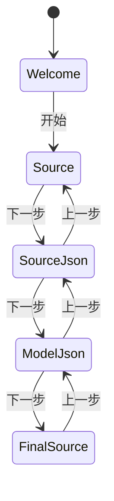

#### 1.2.2 按钮精确行为表

| 按钮 | 处理函数 | 输入 | 输出 | 副作用 |
|------|---------|------|------|--------|
| 格式化 | `Formater_source_ButtonClick` | `source_edit.Text` | `source_edit.Text` | 无 |
| 下一步: 源码→json | `source_2_json_nex_ButtonClick` | `source_edit.Text` | `source2json_edit.Text` | 切到 `SourceJsonTab` |
| 上一步: json→代码 | `Button3Click` | `source2json_edit.Text` | `source_edit.Text` | 切到 `SourceTab` |
| 下一步: json→model | `Button4Click` | `source2json_edit.Text` | `model_json_edit.Text` | 切到 `ModelJsonTab` |
| 上一步: model→json | `Button5Click` | `model_json_edit.Text` | `source2json_edit.Text` | 切到 `SourceJsonTab` |
| **下一步: 生成代码 + README** | `Button6Click` | `model_json_edit.Text` | 4 个 TSynEdit + 3 个 README + 落盘 | 创建目录、保存全部文件 |
| 空单元 | `empty_unit_ButtonClick` | `current_language` | `source_edit.Text` | 无 |
| 复杂示例 | `empty_unit_Button1Click` | `current_language` | `source_edit.Text` | 无 |
| 打开规范 | `Open_unit_readme_Button6Click` | `current_language` | 打开外部文档 | 无 |
| 自动检测语言 | `sel_lang_LabelClick` | `source_edit.Text` | `current_language` + ComboBox | 触发 `Change` |
| 语言切换 | `Sel_Lang_ComboBoxChange` | `ItemIndex` | `current_language` + Highlighter | 无 |

#### 1.2.3 `Button6Click` 的落盘规则（**v5.0 更新，包含 README**）

```pascal
app_dir := umlCombinePath(umlGetFilePath(ParamStr(0)), func_model.UnitName);
umlCreateDirectory(app_dir);
```

**落盘文件清单**（v5.0 完整）：

| # | 文件名 | 类型 | 生成函数 |
|---|--------|------|---------|
| 1 | `source.pas`（Pascal）或 `source.h`（C） | 输入副本 | — |
| 2 | `source.json` | LV0 JSON | — |
| 3 | `source_model.json` | LV1 JSON | — |
| 4 | `<UnitName>_tool_provider_unit.pas` | Pascal 代码 | `GeneratePascalCode` |
| 5 | `<UnitName>_tool_provider.py` | Python 代码 | `GeneratePythonCode` |
| 6 | `<UnitName>_tool_provider.hpp` | C++ 头文件 | `GenerateHPPCode` |
| 7 | `<UnitName>_tool_provider.cpp` | C++ 实现 | `GenerateCPPCode` |
| **8** | **`<UnitName>_tool_provider_pascal.md`** | **Pascal README** | **`GeneratePascalReadme`** |
| **9** | **`<UnitName>_tool_provider_python.md`** | **Python README** | **`GeneratePythonReadme`** |
| **10** | **`<UnitName>_tool_provider_cpp.md`** | **C++ README** | **`GenerateCPPReadme`** |

> ⚠️ **已知 bug（v4.0 遗留，v5.0 未修）**：Python 代码当前被保存为 `<UnitName>_tool_provider.pas`。修正：把 `SaveCode(func_model.UnitName + '_tool_provider.pas');` 改为 `.py`。**README 生成不涉及此 bug**。

### 1.3 语言自动检测

`Auto_Select_Language` 调用 `DetectSourceLanguage(source_edit.Text)`：

- 用 `tsPascal` 和 `tsC` 各解析一次，按证据加权打分。
- **平局返回 `slUnknown`**（不是 `slPascal`）。
- 空输入返回 `slUnknown`。

**GUI 映射**：`slPascal → ItemIndex 1`，`slC → ItemIndex 2`，`slUnknown → ItemIndex 0`。

### 1.4 全局定时器

`SysTimer` 每 1ms 触发 `sysTimerTimer`：

```pascal
while LF___.LF_GetStatusCount() > 0 do
  DoStatus(LF___.LF_GetStatusEx());
Check_Soft_Thread_Synchronize;
LF___.LF_Sync;
```

**作用**：排空 LingoFuse 状态队列、驱动软同步、驱动 LF 同步。

> ⚠️ **性能隐患**：1ms = 每秒 1000 次调用。建议改为 10ms。

### 1.5 输出文件全景图（v5.0 新增）


**关键设计**：代码与文档从**同一个 Model**生成——任一方更新，另一方自动同步。**不需要手动维护 README 与代码的一致性**。

---

## 第 2 章 代码生成器

### 2.1 生成器签名与契约

```pascal
function GeneratePascalCode(Model: TPascal_Func_Model): TPascalStringList;
function GeneratePythonCode(Model: TPascal_Func_Model): TPascalStringList;
function GenerateHPPCode(Model: TPascal_Func_Model): TPascalStringList;
function GenerateCPPCode(Model: TPascal_Func_Model): TPascalStringList;
```

**公共契约**：
- 输入必须是 `tnf_Json` 模式的 `TPascal_Func_Model`。
- `Model = nil` 或 `Model.UnitName = ''` 时返回 `nil`。
- 返回的 `TPascalStringList` **由调用者负责释放**。
- 无支持的函数时返回空骨架。

**类型白名单**：

```pascal
function IsSupportedType(const Typ: TP_String): boolean;
begin
  Result := Typ.Same('Int64', 'Double', 'string');
end;
```

**三个代码生成器必须严格一致**。未支持的声明**整条丢弃**。

### 2.2 Pascal 生成器

**关键辅助函数**：

| 函数 | 职责 | 备注 |
|------|------|------|
| `MakeApiName` | 清洗为 Pascal 标识符 | ⚠️ 字符替换表**不完整**（见 §12.7） |
| `MakeCallbackName` | `'Callback_' + MakeApiName` | 生成器实现 |
| `MakeInternalCallName` | `'internal_call_' + MakeApiName` | 生成器实现 |
| `PascalStrLit` | Pascal 字符串字面量 | 委托 `TTextParsing.Translate_Text_To_Pascal_Decl` |
| `GetFullDescription` | 注释提取 | ⚠️ 经 `TPascalStringList.AsText`（见 §2.6 与 §12.11） |

**生成产物的关键结构**：

```
unit <UnitName>_tool_provider_unit;

interface
uses SysUtils, Classes, lingofuse_import;

var
  MY_APP_NAME: string = '<AppName>';
  IPC_ENDPOINT: string = 'ipc:agent';
  BEACON_APP: string = 'agent_main_app';
  REGISTER_API: string = 'register_agent';
  AGENT_LOG_API: string = 'agent_log';
  DEBUG_LOG: boolean = True;

function RegisterAPIs: TAppHnd___;
function RegisterTools: Boolean;
function Execute_And_Reg_all: Boolean;

implementation
// ret2str 重载、internal_call_* 桩、回调、RegisterTool、RegisterAPIs、Execute_And_Reg_all
end.
```

**Callback 的标准骨架**（每个 API 一个）：

```pascal
procedure Callback_<Name>_<ApiName>(_Trigger___: Pointer; _In___, _Out___: TDataHnd___); cdecl;
var
  jsonBytes: TBytes;
  jo: TZ_JsonObject;
  <param>: <Type>;
  ret: <ReturnType>;
  errMsg: string;
begin
  jo := TZ_JsonObject.Create;
  try
    jsonBytes := LF_ReadStringBytes(TDataHnd(_In___));
    if Length(jsonBytes) = 0 then begin ... Exit; end;
    if not jo.Parae(jsonBytes) then begin ... Exit; end;
    <param> := jo.I64['<param>'];    // 或 jo.F / jo.S
    ret := internal_call_<Name>_<ApiName>(<args>);
    jo.Clear;
    jo.I64['result'] := ret;         // 或 jo.F / jo.S
    LF_WriteStringBytes(TDataHnd(_Out___), jo.ToBytes);
  except
    on E: Exception do begin
      jo.Clear;
      jo.S['error'] := E.Message;
      LF_WriteStringBytes(TDataHnd(_Out___), jo.ToBytes);
    end;
  end;
  jo.Free;
end;
```

**返回值类型到 `jo.X` 的映射**：

| ReturnType | 写入 | 读取 |
|-----------|------|------|
| `Int64` | `jo.I64['result']` | `jo.I64['result']` |
| `Double` | `jo.F['result']` | `jo.F['result']` |
| `string` | `jo.S['result']` | `jo.S['result']` |

**Procedure 写 `jo.S['status'] := 'ok';`**。

### 2.3 Python 生成器

**关键辅助函数**：

| 函数 | 职责 |
|------|------|
| `PascalTypeToPythonType` | `Int64→int` / `Double→float` / `string→str` |
| `PascalTypeToJsonSchemaType` | `Int64→integer` / `Double→number` / `string→string` |
| `PascalTypeDefaultValue` | `Int64→0` / `Double→0.0` / `string→""` |
| `PyStrLit` | Python 字符串字面量（`TP_Char` 迭代，保留非 ASCII） |
| `MakePythonIdentifier` | 白名单过滤（**比 Pascal 侧更安全**） |
| `UniqueApiName` | 确保工具名唯一 |
| `GetFullDescription` | 逐字符扫描 `TP_String`（**不经 `SystemString`**） |

**生成产物的关键结构**：

```python
# -*- coding: utf-8 -*-
try:
    from lingofuse._lf_native import (...)
except ImportError as _imp_err:
    print(f"[FATAL] lingofuse package is not available: {_imp_err}", file=sys.stderr)
    sys.exit(1)

MY_APP_NAME = "<AppName>"
IPC_ENDPOINT = "ipc:agent"
BEACON_APP = "agent_main_app"
REGISTER_API = "register_agent"
AGENT_LOG_API = "agent_log"
DEBUG_LOG = True

def _write_string(hnd, s): ...
def _read_string_bytes(hnd) -> bytes: ...
def _ret2str(v) -> str: ...

def internal_call_<name>(a: int, b: str) -> int:
    return 0

def _send_log_async(msg: str): ...

@LFCallFunc
def callback_<name>(_Trigger, _In, _Out):
    ...

def RegisterTools() -> bool: ...
def RegisterAPIs() -> Optional[Any]: ...
def Execute_And_Reg_all() -> bool: ...

if __name__ == "__main__":
    ...
```

**参数提取的默认值**：`data.get('<name>') or <default>`。

### 2.4 C++ 生成器

**与 Pascal/Python 的差异**：

| 差异 | 说明 |
|------|------|
| 输出两个文件 | `.hpp`（声明）+ `.cpp`（实现） |
| 使用 `nlohmann/json` | `#include "json.hpp"` |
| 回调宏 | `LF_CDECL`（不是 `cdecl`） |
| 重名工具 | **丢弃**（MCP 要求唯一） |
| 描述截断 | `MAX_DESC_LEN = 200` |
| `DEBUG_LOG` 默认 | `false`（Pascal/Python 是 `True`） |

**生成产物结构**（`.cpp` 关键）：

```cpp
extern const char* MY_APP_NAME   = "<UnitName>";
extern const char* IPC_ENDPOINT  = "ipc:agent";
extern const char* BEACON_APP    = "agent_main_app";
extern const char* REGISTER_API  = "register_agent";
extern const char* AGENT_LOG_API = "agent_log";
extern const bool  DEBUG_LOG     = false;

static std::string read_string(TDataHnd hnd) { ... }
static void write_string(TDataHnd hnd, const std::string& s) { ... }
static json read_json(TDataHnd hnd) { ... }
static void write_json(TDataHnd hnd, const json& obj) { ... }
static void send_log_async(const std::string& msg) { ... }

static void LF_CDECL callback_<Name>(void* _Trigger, void* _In, void* _Out) { ... }

TAppHnd RegisterAPIs() { ... }
static bool RegisterOneTool(...) { ... }
bool RegisterTools() { ... }
bool Execute_And_Reg_all() { ... }
```

### 2.5 三语言生成器的对称性

| 维度 | Pascal | Python | C++ |
|------|--------|--------|-----|
| 类型白名单 | `Int64`/`Double`/`string` | 同 | 同 |
| JSON Schema 映射 | 同 | 同 | 同 |
| 描述提取 | 经 `TPascalStringList.AsText` | 逐字符扫描 `TP_String` | 经 `CleanComment_Local` |
| 重名工具 | 加数字后缀 | 加数字后缀 | **丢弃** |
| 描述截断 | 无 | 无 | `MAX_DESC_LEN = 200` |
| 回调宏 | `cdecl` | `@LFCallFunc` | `LF_CDECL` |

**修改任一时必须检查其他两个的对称性**。

### 2.6 FPC 编译约束（v5.0 新增）

**铁律**：**FPC 在 `{$mode delphi}` 下不允许在过程体内部使用 `var` 声明**。

**错误代码**（会在 FPC 3.2.2 上报 `Illegal expression` + `Syntax error, ";" expected`）：

```pascal
procedure DoSomething;
begin
  // ...
  begin
    var
      j: integer;
      tmp: TP_String;
    // ...
  end;
end;
```

**正确做法**：所有局部变量**必须**在过程/函数的 `var` 区声明。

```pascal
procedure DoSomething;
var
  j: integer;
  tmp: TP_String;
begin
  // ...
  for j := 0 to High(Items) do
    // ...
end;
```

**影响面**：所有三个生成器单元的**所有过程/函数**。

**历史教训**：v3.0 的 `cpp_mcp_generator_tool.pas` 曾在 `GenerateHPPCode` 里写了内联 `var`，导致 FPC 编译失败。v4.0 修正。

**注意**：`{$mode objfpc}` + `{$modeswitch advancedrecords}` 允许在**记录**内部定义方法；但**过程体内部的 `var`**在任何模式下都**不允许**（FPC 3.3+ 有可能放宽，但主流版本不行）。

---

## 第 3 章 README 生成体系（v5.0 新增）

### 3.0 核心设计原则

1. **一份 Model，一份真相** —— 代码与文档从同一 `TPascal_Func_Model` 生成，不需要人工同步。
2. **全英文** —— 所有 README 内容为英文，避免 Markdown 渲染与跨语言字符集问题。
3. **可复制即用** —— 每份 README 都包含完整可编译/可运行的测试程序源码，用户无需额外编写骨架。
4. **语言特定 + 结构统一** —— 十节骨架（Overview / Architecture / Test / Build & Test / Tool Reference / JSON Schema / Troubleshoot / Portability / Resources）严格统一；每节的具体内容按语言定制。
5. **Mermaid 图优先** —— 架构图、测试流程图、工具注册时序图使用 Mermaid，兼容 GitHub/GitLab/VSCode/Obsidian。
6. **占位符可识别** —— 未确定的仓库 URL 用 `<xxx-repo-url>` 形式的**字面占位符**，并明确提示用户替换。

### 3.1 公共契约

```pascal
function GeneratePascalReadme(Model: TPascal_Func_Model): TPascalStringList;
function GeneratePythonReadme(Model: TPascal_Func_Model): TPascalStringList;
function GenerateCPPReadme(Model: TPascal_Func_Model): TPascalStringList;
```

**契约**：
- 输入必须是 `tnf_Json` 模式的 `TPascal_Func_Model`。
- `Model = nil` 或 `Model.UnitName = ''` 时**返回非 nil 的降级文本**（顶部一行 `# README generation skipped` + 原因），避免产生空文件让用户困惑。
- 返回的 `TPascalStringList` **由调用者负责释放**。
- 无支持的函数时**不报错**，README 中会在 Tool Reference 章节给出**明确的"暴露 0 个 API"警告**并列出可能原因。
- **不依赖**网络、文件系统、外部进程。

### 3.2 README 的十节骨架

| # | 节名 | 内容 | 语言特化 |
|---|------|------|---------|
| 1 | Overview | 依赖表 + 文件清单 | ✅ 各语言依赖不同 |
| 2 | Runtime Architecture | Mermaid flowchart | ❌ 统一 |
| 3 | Test Program | 完整可运行测试程序 | ✅ 语言特化 |
| 4 | Build & Test Procedure | 6~7 步指引 + Mermaid flowchart | ✅ 步骤略有差异 |
| 5 | Tool Reference | 表格 + 逐 API 小节 + JSON 示例 | ❌ 统一 |
| 6 | JSON Schema Specification | 类型白名单 | ❌ 统一（但 C++ 表格多一列 C++ 类型） |
| 7 | Debugging & Troubleshooting | 全局变量 + 常见问题 | ✅ 语言特化 |
| 8 | Portability Notes | 语言环境便携性 | ✅ 语言特化 |
| 9 | Reference Resources | 资源链接 | ✅ 语言特化 |
| 10 | (Header) | 标题 + auto-generated 声明 + 源/输出/API 数 | ❌ 统一 |

### 3.3 Pascal README 细节

**输出文件名**：`<unit>_tool_provider_pascal.md`

**依赖表**（严格列出三仓库）：

| 依赖 | 用途 | 获取方式 |
|------|------|---------|
| LingoFuse-pasAgent-v3 | 完整运行时 | `git clone <v3-repo-url>` |
| `lingofuse_import.pas` | C ABI 导入 | `<v3>/src/` |
| `lingofuse_helper.pas` | 可选 RAII | `<v3>/src/` |
| `pascal_agent_service.exe` | 信标服务端 | 由 `<v3>/src/pascal_agent_service.lpr` 编译 |
| **ZCore 仓库** | `Z.Core` 单元 | `git clone <zcore-repo-url>` |
| **ZNetV2 仓库** | 网络/`z_ipc_*.dll` | `git clone <znetv2-repo-url>` |

**§3 Test Program** 提供的**完整 `.lpr`**（关键结构）：

```pascal
program <AppName>_provider;

{$mode objfpc}{$H+}
{$CODEPAGE UTF8}

uses
  {$IFDEF UNIX}cthreads,{$ENDIF}
  {$IFDEF MSWINDOWS}Windows,{$ENDIF}
  SysUtils, Classes,
  Z.Core,
  <UnitName>_tool_provider_unit;

begin
  WriteLn('=== <AppName> Tool Provider ===');
  WriteLn('Connecting to ipc:agent ...');

  if not Execute_And_Reg_all then
  begin
    WriteLn('');
    WriteLn('[FATAL] Provider startup failed.');
    WriteLn('Checklist:');
    WriteLn('  1. Is pascal_agent_service.exe running?');
    WriteLn('  2. Is the endpoint ipc:agent reachable?');
    WriteLn('  3. Check DEBUG_LOG output above for details.');
    Halt(1);
  end;

  WriteLn('');
  WriteLn('[OK] Provider is ready. All tools registered.');
  WriteLn('Press Enter to shut down.');
  ReadLn;

  LF_ExitMainThread;
  LF_Shutdown;
  WriteLn('[OK] Shutdown complete.');
end.
```

**要点**：
- `{$mode objfpc}{$H+}` —— 独立程序的主模式。
- `{$CODEPAGE UTF8}` —— 确保中文源码字符串正确。
- `cthreads` 必须首列（Unix）—— 让 RTS 链接多线程 C 库。
- `Z.Core` 必须在 `uses` 中 —— provider 内部用到 `TCompute` / `TCore_Thread`。
- `LF_ExitMainThread` + `LF_Shutdown` —— 释放所有 LingoFuse 资源。

**§4 Build & Test 的编译命令**：

```bash
fpc -Fu<workspace>/ZNetV2/ZCore -Fu<workspace>/ZNetV2 <AppName>_provider.lpr
```

或 `lazbuild` 打开 `.lpi` 按 F9。

**§8 Delphi Portability** —— `.lpr` → `.dpr` 转换步骤：
1. 改扩展名。
2. 替换 `{$mode objfpc}{$H+}` 为 Delphi 项目头（通常不需要 mode 指令）。
3. 移除 `cthreads`（Delphi 的 RTL 自动处理线程）。
4. 设置单元搜索路径。
5. **生成的 `<UnitName>_tool_provider_unit.pas` 本身已用 `{$DEFINE FPC_DELPHI_MODE}`，Delphi 兼容 as-is**。

### 3.4 Python README 细节

**输出文件名**：`<unit>_tool_provider_python.md`

**包来源策略**（**明确的两条路径**）：

| # | 来源 | 何时用 | 如何获取 |
|---|------|-------|---------|
| **1** | 独立 `py-lingofuse` 仓库或 PyPI 包 | 存在时优先 | `pip install py-lingofuse` 或 `git clone <py-lingofuse-repo-url>` |
| **2** | v3 内置的 `<v3>/src/lingofuse/` | 兜底 | 从 `<v3-repo-url>` 克隆后设置 `PYTHONPATH` |

**§3 Test Provider Script** 的关键点：**生成的 `.py` 本身已经是可运行的**——它自带 `if __name__ == "__main__":` 块。README 明确告诉用户**不需要写额外的测试脚本**。

**§4 Build & Test 的 7 步**（比 Pascal/C++ 多一步"验证 import"）：

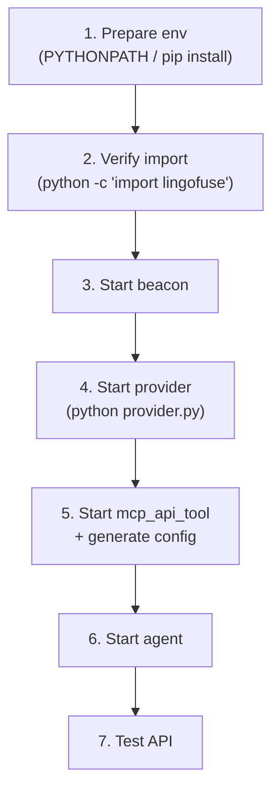

**Step 2 的命令**（关键验证）：

```bash
python -c "import lingofuse._lf_native as m; print('OK', m.__file__)"
```

**Path A / Path B 的环境变量差异**：

- Path A（`pip install py-lingofuse`）：无需环境变量。
- Path B（v3 兜底）：
  - **Windows (cmd)**：`set PYTHONPATH=D:\LingoFuse-pasAgent-v3\src`
  - **Windows (PowerShell)**：`$env:PYTHONPATH = "D:\LingoFuse-pasAgent-v3\src"`
  - **Linux/macOS**：`export PYTHONPATH=/path/to/LingoFuse-pasAgent-v3/src`

**§8 Python Portability**：venv / PyInstaller / Nuitka 集成说明。

### 3.5 C++ README 细节

**输出文件名**：`<unit>_tool_provider_cpp.md`

**关键状态**：**cppAgent 仓库尚未发布**。README 明确说明这一点，并提供**三条获取 `LingoFuse.h` 的备选路径**：

| 来源 | 说明 |
|------|------|
| LingoFuse 运行时发行包 | `LingoFuse.h` 通常与 `LingoFuse64.dll` 同目录 |
| v3 的 `lingofuse_import.pas` | 手动翻译为 C++ |
| **§3.1 的最小兜底 header** | README **内置**可直接使用的最小 `LingoFuse.h` |

**§3 Test Program** 提供的**完整 `main.cpp`**（关键结构）：

```cpp
#include "<UnitName>_tool_provider.hpp"
#include <cstdio>
#include <cstdlib>

extern "C" void LF_ExitMainThread();
extern "C" void LF_Shutdown();

int main()
{
    std::printf("=== %s Tool Provider ===\n", MY_APP_NAME);
    std::printf("Connecting to %s ...\n", IPC_ENDPOINT);

    if (!Execute_And_Reg_all())
    {
        std::fprintf(stderr, "\n[FATAL] Provider startup failed.\n");
        return 1;
    }

    std::printf("\n[OK] Provider is ready. All tools registered.\n");
    std::printf("Press Enter to shut down.\n");
    std::getchar();

    LF_ExitMainThread();
    LF_Shutdown();
    return 0;
}
```

**§3.1 最小 `LingoFuse.h`**（**关键兜底**）：README 中**内嵌**一个 ~50 行的 header，包含所有用到的 `LF_*` 函数声明与 `LF_CDECL` 宏。用户可直接复制使用，等 cppAgent 发布后替换为官方版本。

**§4 Build 的三套命令**：

```bash
# Linux / macOS
g++ -std=c++17 -O2 -I. main.cpp <unit>_tool_provider.cpp \
    -L. -lLingoFuse -Wl,-rpath,. -o provider

# Windows (MSVC)
cl /std:c++17 /EHsc /I. main.cpp <unit>_tool_provider.cpp \
   /link /LIBPATH:. LingoFuse.lib /OUT:provider.exe

# Windows (MinGW-w64)
g++ -std=c++17 -O2 -I. main.cpp <unit>_tool_provider.cpp \
    -L. -lLingoFuse -o provider.exe
```

**§8 C++ Portability**：
- 支持的编译器版本表（MSVC 16.8+, g++ 7.0+, clang++ 5.0+）
- Windows `__cdecl` 调用约定
- 静态 vs 动态链接
- CMake 模板（等 cppAgent 发布后启用）

### 3.6 三份 README 的对称性与差异

**完全一致**：
- 十节骨架
- §2 Runtime Architecture 的 Mermaid 图
- §5 Tool Reference 的表格与 JSON 示例结构
- §6 JSON Schema 白名单（C++ 多一列 C++ 类型）
- §7.1 全局配置变量表结构

**语言特化**：
| 节 | Pascal | Python | C++ |
|----|--------|--------|-----|
| §1 依赖 | ZCore + ZNetV2 + v3 | py-lingofuse 或 v3 | json.hpp + LingoFuse.h + lib |
| §3 测试程序 | `.lpr` 完整源码 | `.py` 自带 `__main__` | `main.cpp` + 兜底 header |
| §4 步骤数 | 6 步 | **7 步**（多"验证 import"） | 7 步 |
| §4 编译 | `fpc -Fu...` | `pip` / `PYTHONPATH` | g++ / cl / MinGW |
| §8 便携性 | `.lpr` → `.dpr` | venv / PyInstaller | 编译器矩阵 / CMake |

**§5 Tool Reference 的格式**（三语言完全一致）：

```markdown
### 5.N `<api_name>`

- Original Pascal function: `<原始名>`
- Exposed API name: `<api_name>`
- Kind: `function`（returns `<ReturnType>`）或 `procedure`
- Description: `<描述或(无描述)>`

**Parameters**

| Name | Pascal type | [语言] type | JSON type | Description |
|------|-------------|-------------|-----------|-------------|
| `a` | `Int64` | ... | `integer` | ... |

**Input JSON example**

```json
{ "a": 0, "b": "" }
```

**Output JSON example**

```json
{ "result": 0 }    （function）或 { "status": "ok" } （procedure）
```
```

**§6 JSON Schema 的映射**（三语言一致，但 C++ 多一列）：

| Pascal 归一化 | JSON Schema | Pascal 类型 | Python 类型 | C++ 类型 |
|--------------|------------|------------|------------|---------|
| `int64` | `integer` | `Int64` | `int` | `std::int64_t` |
| `double` | `number` | `Double` | `float` | `double` |
| `string` | `string` | `string` | `str` | `std::string` |

### 3.7 使用方法（从生成到落盘）

#### 3.7.1 在 GUI 中调用（v5.0 集成后）

在 `Button6Click` 中，**每个代码生成器调用之后追加对应的 README 生成**：

```pascal
// 现有（代码）：
l := GeneratePascalCode(func_model);
if l <> nil then
begin
  SaveCode(func_model.UnitName + '_tool_provider_unit.pas');
  l.AssignTo(final_pascal_source_Edit.Lines);
  disposeObjectAndNil(l);
end;

// 追加（README）：
l := GeneratePascalReadme(func_model);
if l <> nil then
begin
  SaveCode(func_model.UnitName + '_tool_provider_pascal.md');
  disposeObjectAndNil(l);
end;

// Python / C++ 同理
```

#### 3.7.2 在独立工具中调用

```pascal
var
  Model: TPascal_Func_Model;
  Code, Readme: TPascalStringList;
begin
  Model := TPascal_Func_Model.Create;
  try
    Model.LoadFromParser(Parser, nil);

    Code := GeneratePascalCode(Model);
    try
      if Code <> nil then
        Code.SaveToFile('MyUnit_tool_provider_unit.pas');
    finally
      Code.Free;
    end;

    Readme := GeneratePascalReadme(Model);
    try
      if Readme <> nil then
        Readme.SaveToFile('MyUnit_tool_provider_pascal.md');
    finally
      Readme.Free;
    end;
  finally
    Model.Free;
  end;
end;
```

#### 3.7.3 边界情况

- **`Model = nil`** → 返回非 nil 的降级文本（`# README generation skipped` + 原因）。
- **`Model.UnitName = ''`** → 同上。
- **`Length(ValidFuncs) = 0`** → 返回完整 README，但 §5 明确警告"0 个 API"并列出可能原因。
- **未识别的语言类型** → 该函数被过滤，README 中**不出现**该 API。

---

## 第 4 章 LLM 服务端

### 4.1 三种服务端的能力矩阵

| API | `llm_service` | `llm_proxy` | `llm_proxy_tool` |
|-----|:-------------:|:-----------:|:----------------:|
| `generate` | 1 | 1 | 1 |
| `create_session` | 1 | 1 | 1 |
| `close_session` | 1 | 1 | 1 |
| `cancel_session` | 1 | 1 | 1 |
| `list_sessions` | 1 | 1 | 1 |
| `set_system_message` | **1** | **0** | **0** |
| `health` | 1 | 1 | 1 |
| `llm_stream` | 1 | 1 | 1 |
| `attachments` | 1 | 1 | 1 |
| `vision` | **0** | **0** | **0** |
| `tools` / `tool_calls` / `tool_results` | — | — | **1** |
| `server_kind` | `service` | `proxy` | `proxy` |

**`vision=0` 的精确语义**：服务端**自身不做视觉处理**，不等于整个链路不支持多模态。图片能否被理解由**后端**决定。

### 4.2 `llm_service.py`

**完整 API**：

| API 名 | 类型 | 输入 | 输出 |
|--------|------|------|------|
| `generate` | Call | `{session_id?, content, prompt?, client_name?, options?, attachments?}` | `{code, session_id, task_id, mode}` |
| `create_session` | Call | `{client_name, system_message?}` | `{code, session_id, client_name}` |
| `close_session` | Call | `{session_id, cancel_running?}` | `{code, status}` |
| `cancel_session` | Call | `{session_id}` | `{code, status}` |
| `list_sessions` | Call | `{client_name?}` | `{code, sessions, count}` |
| `set_system_message` | Call | `{content}` | `{code, status}` |
| `get_api_capabilities` | Call | `{}` | `{code, server_kind, capabilities}` |
| `health` | Call | `{}` | `{code, status, ...}` |
| `llm_stream` | Notify | `{type, session_id, text/message/reason}` | 无 |

**`options` 白名单**：`max_tokens` (int, [1, 2^20])、`temperature` (float, [0, 2])、`top_p` ([0, 1])、`top_k` ([0, 1000])、`repeat_penalty` ([0, 4])、`thinking` (bool)、`ephemeral` (bool)。**其他字段被静默丢弃**。

**附件限制**：单文本 ≤ 256 KB；总文本 ≤ 512 KB；单图片 base64 ≤ 8 MB；总图片 ≤ 16 MB。**图片仅 `--vision` 启用时接受**（`llm_service` 始终拒绝）。

**会话回收的双条件**（仅 `llm_service`）：

```
回收 ⇔ (status = idle) AND (空闲 > session_timeout) AND (客户端 App 离线)
```

**`check_app` 缓存延迟约 3 秒**——刚离线时可能误判为在线。

**Thinking 的优先级**：
1. 单次请求 `options.thinking`
2. 命令行 `--thinking` / `--no-thinking`
3. 环境变量 `LLM_THINKING`
4. 模块常量 `DEFAULT_THINKING`（= False）

**关键参数**见附录 A.2。

### 4.3 `llm_proxy.py`

**与 `llm_service` 的差异**：

| 维度 | `llm_service` | `llm_proxy` |
|------|--------------|-------------|
| 模型加载 | 本地 llama.cpp | 无 |
| 推理线程 | 单 worker 串行 | 无推理 |
| 上下文管理 | 服务端持有 KV cache | 每轮重建 messages |
| `set_system_message` | ✅ | ❌ 明确拒绝 |
| 会话回收 | 双条件 | 单条件（仅超时） |
| 默认 `session_timeout` | 600 | 1800 |

**`set_system_message` 的拒绝响应**：

```json
{
  "code": -1,
  "status": "unsupported",
  "error": "set_system_message is not supported by llm_proxy.\n..."
}
```

**替换方案**：用 `create_session` 的 `system_message` 字段。

**独有参数**见附录 A.3。

### 4.4 `llm_proxy_tool.py`（LTB）

**定位**：`llm_proxy` + **服务端侧工具执行**。

**多轮 `tool_calls` 循环的精确状态机**：

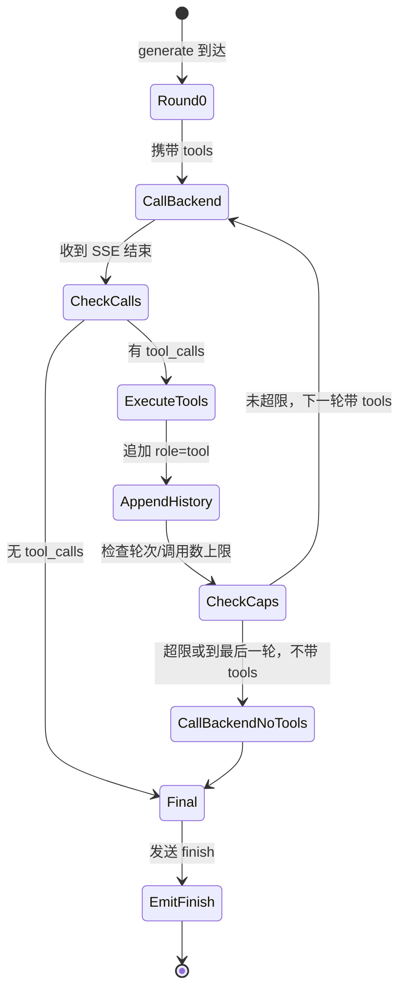

**关键判定**：
- `is_final_round = force_final_round OR (round_idx == max_tool_rounds - 1)`
- `force_final_round` 在 `total_tool_calls >= max_total_tool_calls` 时置 True。
- **最终轮不带 `tools`**，强制模型产出文本。

**工具结果的截断**：
1. 单条 > `max_tool_result_chars` → 截断 + `...(truncated)`。
2. 总字符 > `max_total_tool_result_chars` → 截断 + `...(tool-result budget exhausted)`。

**多模态在工具链中**：
- **首轮**：发送完整多模态内容（含 `image_url`）。
- **后续轮**：历史中图片替换为短占位符。

**预连接 middleware 的顺序（关键）**：LTB 必须在 `Server.start()` 之前调用 `_ensure_tools_ready()`。原因：`LF_PrepareDone()` 在同一进程内只有第一次返回 1。

**独有参数**见附录 A.4。

---

## 第 5 章 MCP 网关

### 5.1 `mcp_api_tool.py`

**完整 API**：

| API 名 | 类型 | 输入 | 输出 |
|--------|------|------|------|
| `agent_main` | Call | `{}` | `{tools: [...]}` |
| `agent_log` | Call | `{message}` | `{status: "ok"}` |
| `register_agent` | Call | `{name, description, target_app, target_api, parameters}` | `{status: "ok"}` |

**工具注册 JSON 的精确结构**：

```json
// agent_main 返回
{
  "tools": [
    {
      "name": "add",
      "description": "Add two integers: a + b",
      "target_app": "my_calculator",
      "target_api": "add",
      "parameters": {
        "type": "object",
        "properties": {
          "a": {"type": "integer", "description": "First operand"},
          "b": {"type": "integer", "description": "Second operand"}
        },
        "required": ["a", "b"]
      }
    }
  ]
}
```

**传输模式**：
- `stdio`：客户端启动时自动启动。**在主进程运行**（避免 Windows multiprocessing spawn 问题）。
- `http`：Streamable HTTP（推荐）。
- `sse`：已弃用。

**stdio 模式的控制台抑制**：

```python
LF_SetOption(b"ConsoleOutput", b"False")
LF_SetOption(b"Quiet", b"True")
```

**原因**：LingoFuse 的 C 层会输出诊断信息，污染 MCP 的 stdio 通道。

**信号处理**：

```python
def signal_handler(sig, frame):
    raise KeyboardInterrupt()   # 不是 sys.exit(0)
```

**原因**：`sys.exit(0)` 抛 `SystemExit`，不会被 `except KeyboardInterrupt` 捕获，导致 http/sse 模式的子进程孤儿化。

**关键参数**见附录 A.5。

### 5.2 `mcp_api_proxy.py`

**定位**：透明的 stdio 转发器，用于调试 MCP 握手。**字节级转发，不做 JSON 处理**。

**数据流**：

| 通道 | 方向 | 过滤 |
|------|------|------|
| `LM->Server` | stdin → child.stdin | 无 |
| `Server->LM` | child.stdout → stdout | **JSON-RPC 行过滤**（只转发 `{` 开头的行） |
| `Server-ERR` | child.stderr → stderr | 无 |

**关键实现细节**：
- **`bufsize=0` 是禁忌**：会使 stdin 非阻塞，FastMCP 4.x 会立即 EOF。
- **`read1()` 而非 `read()`**：只要有数据就返回。
- **不设顶层 `SIGINT` 处理器**：让 `KeyboardInterrupt` 传播到 `main()`。

---

## 第 6 章 中间件与桥接

### 6.1 `language_middleware.py`

**单例 + 懒连接**：构造时不连接，第一次 `get_tools()` / `call_tool()` / `log()` 时连接。

**完整 API**：

| 方法 | 作用 |
|------|------|
| `get_instance(...)` | 获取单例（可选更新配置） |
| `get_tools() -> List[Dict]` | 工具列表 |
| `call_tool(tool_name, arguments) -> Any` | 调用工具 |
| `log(message) -> Optional[Dict]` | 发送日志 |
| `is_connected() -> bool` | 是否已连接 |
| `reconnect()` | 强制重连 |
| `shutdown()` | 显式关闭 |

**生命周期铁律**：`LF_ExitMainThread` → `LF_FreeApp` → `LF_Shutdown`。

**`_disconnect()` 不调用 `LF_Shutdown()`**——App handle 必须在 disconnect/reconnect 周期中保持有效。

**`reg_tool` 回调的字段名**：`name`（**不是** `tool_name`）——与 Pascal 侧 `do_register_agent` 对齐。

### 6.2 `bridge.py`

**请求格式**：`POST /<app>/<api>`（或 `POST /<api>`，使用默认 app）。

**响应格式**：

| 情形 | HTTP | Body |
|------|------|------|
| 成功 | 200 | 原样返回后端字节 |
| 调用失败 | 200 | `{"code": -1, "error": "..."}` |
| 请求格式错误 | 400 | `{"code": -2, "error": "..."}` |
| API 预检失败 | 200 | `{"code": -3, "error": "..."}` |

**JSON 规范化**：双向（请求 + 响应），默认开启，**幂等**。处理的异常：UTF-8 BOM、尾随 NUL、尾随逗号、非 UTF-8 编码（GBK / Latin-1）。**二进制安全**：无法解析为 JSON 的 payload **原样转发**。

**关键参数**见附录 A.6。

---

## 第 7 章 共享模块

### 7.1 `llm_common.attachments`

**限制常量**：

| 常量 | 值 |
|------|-----|
| `MAX_TEXT_BYTES_PER_FILE` | 256 * 1024 |
| `MAX_TEXT_BYTES_TOTAL` | 512 * 1024 |
| `MAX_IMAGE_B64_PER_FILE` | 8 * 1024 * 1024 |
| `MAX_IMAGE_B64_TOTAL` | 16 * 1024 * 1024 |
| `MAX_ATTACHMENT_NAME_LEN` | 256 |
| `ALLOWED_IMAGE_MIMES` | `{image/png, image/jpeg, image/jpg, image/webp}` |

**`build_user_content` 的返回值**：
- 无图片：纯字符串。
- 有图片：`[{"type":"text",...}, {"type":"image_url",...}]`。
- **纯图片无文本**：`[{"type":"image_url",...}]`（无空 text part）。

### 7.2 `llm_common.capabilities`

```python
SERVER_KIND_SERVICE = "service"
SERVER_KIND_PROXY = "proxy"

COMMON_CAPABILITY_KEYS = (
    "generate", "create_session", "close_session", "cancel_session",
    "list_sessions", "health", "llm_stream",
)
```

### 7.3 `llm_common.option_sanitizer`

```python
DROP = object()

COMMON_SCALAR_SPECS = (
    ("max_tokens",     int,   1,   1 << 20),
    ("temperature",    float, 0.0, 2.0),
    ("top_p",          float, 0.0, 1.0),
    ("top_k",          int,   0,   1000),
    ("repeat_penalty", float, 0.0, 4.0),
)
```

**丢弃规则**：`None` 丢弃；`bool` **显式丢弃**；类型转换失败丢弃；越界值 clamp。

### 7.4 `llm_common.sse_client`

**转发白名单**：
```python
_FORWARDED_SCALAR_KEYS = ("max_tokens", "temperature", "top_p", "top_k", "repeat_penalty")
_FORWARDED_PASSTHROUGH_KEYS = ("tools", "tool_choice", "response_format")
```

**关键实现细节**：使用 `http.client`（不是 `requests`）；`Accept-Encoding: identity`；`TCP_NODELAY`；`skip_accept_encoding=True`。

### 7.5 `lingofuse.lf_io`

**关键函数**：

| 函数 | 作用 |
|------|------|
| `dumps_json(obj) -> str` | `json.dumps(obj, ensure_ascii=False, default=str)` |
| `write_string(hnd, value)` | UTF-8 + NUL |
| `read_string(hnd) -> str` | 读到 NUL 或末尾 |
| `write_json(hnd, obj)` | JSON + NUL |
| `read_json(hnd) -> Any` | 严格读 JSON |
| `read_json_or_bytes(hnd) -> Any` | 宽容读 |
| `cstr(value) -> bytes` | NUL 结尾的 UTF-8 字节 |

**Wire format**：`<UTF-8 文本> <NUL>`。

**与 Pascal 侧完全兼容**：`LF_WriteString('{"a":1}')` → `7B 22 61 22 3A 31 7D 00`；`lf_io.write_json(hnd, {"a": 1})` → 相同字节。

---

## 第 8 章 Wire format 与协议

### 8.1 LV1 Model JSON 结构

```json
{
  "UnitName": "MyUnit",
  "Functions": [
    {
      "Name": "Add",
      "IsFunction": true,
      "Comment": "Adds two numbers.",
      "ReturnType": "int64",
      "Params": [
        {"Name": "a", "Typ": "Integer", "PascalType": "int64", "Description": "First operand"}
      ]
    }
  ]
}
```

### 8.2 LV0 Model JSON 结构

```json
{
  "UnitName": "MyUnit",
  "ParseSuccess": true,
  "UsesList": ["SysUtils", "Classes"],
  "FuncList": [
    {
      "Body": "function Add(a: Integer; b: Integer): Integer;",
      "IsProc": true,
      "Name": "Add",
      "IsFunction": true,
      "ParamDecl": "(a: Integer; b: Integer)",
      "param_arry": [
        {"mod": "", "name": "a", "typ": "Integer", "value": "", "array": ""}
      ],
      "ResultDecl": "Integer",
      "Comment": "{ Adds two numbers. }",
      "NestLevel": 0
    }
  ]
}
```

### 8.3 流式消息协议

| 类型 | 字段 | 含义 |
|------|------|------|
| `chunk` | `session_id`, `text` | 正文流 |
| `think` | `session_id`, `text` | 思考流 |
| `finish` | `session_id`, `reason` | 生成结束 |
| `error` | `session_id`, `message` | 服务端错误 |
| `closed` | `session_id`, `reason` | 会话关闭 |

**`reason` 枚举**：`stop` / `error` / `cancelled` / `timeout` / `client` / `shutdown` / `ephemeral` / `timeout+offline`。

### 8.4 能力矩阵响应

```json
{
  "code": 0,
  "server_kind": "service|proxy",
  "capabilities": {
    "generate": 1, "create_session": 1, "close_session": 1,
    "cancel_session": 1, "list_sessions": 1, "set_system_message": 0,
    "health": 1, "llm_stream": 1, "attachments": 1, "vision": 0
  }
}
```

### 8.5 字节序

**统一小端**。现代平台（x86 / ARM / x86_64 / aarch64）都是小端，通常无问题。

---

## 第 9 章 配置参数参考

**优先级**：命令行 > 环境变量 > 内置默认值。

### 9.1 生成器常量

`GenerateCode_LogEnabled`（bool，默认 `False`）。

### 9.2 LLM 服务端 / MCP 网关 / 桥接

见附录 A。

---

## 第 10 章 生命周期与状态机

### 10.1 `LF_PrepareDone` 的一次性约束

**铁律**：`LF_PrepareDone()` 在同一进程内**只有第一次返回 1**。

**影响**：
- 必须调整初始化顺序，确保关键连接在第一次调用前完成。
- LTB 必须在 `Server.start()` 前预连接 middleware。
- 测试代码必须在 `finally` 中调用 `LF_Shutdown()`。

### 10.2 数据句柄的自动回收

- `TLF_DataPool.Progress` 每 5 秒扫描一次。
- 释放闲置超过 **5 分钟**的句柄。
- **不保证及时性**。**不应依赖**——必须显式 `LF_FreeData`。

### 10.3 序列化通知线程

- 每个 `(App, API)` 对拥有一个专用线程。
- **空闲 5 分钟后自动终止**。

### 10.4 `LF_FreeApp` 的两阶段析构

1. 遍历所有客户端，解绑 App。
2. `LF_Notify_Sequence_Thread_Pool.Kill_App(app)`。
3. `app.FakeFree`（仅移除定时器）。
4. **对象不立即销毁**——等 `LF_Shutdown` 时清理。

### 10.5 会话生命周期

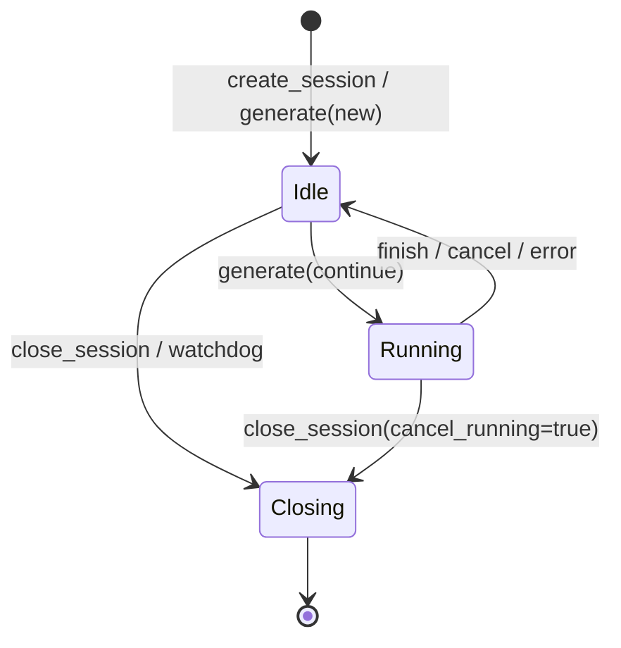

---

## 第 11 章 线程模型

### 11.1 回调执行线程

| 回调类型 | 执行线程 | 约束 |
|----------|----------|------|
| LingoFuse Call/Notify 回调 | 后台 C4 线程池 | 不阻塞、不调 LF_Call、不访问 UI |
| 网络事件回调 | 后台 TCompute 工作线程 | 不阻塞、`addr_` 回调返回后失效 |
| `RegisterSyncCall_M` | 主线程（经 `LF_Sync`） | 需主循环定期调 `LF_Sync` |
| `llm_stream` Notify 回调 | 客户端 LingoFuse 主线程 | 需 `FActiveSessionId` 过滤 |

### 11.2 线程安全矩阵

| 组件 | 线程安全 |
|------|----------|
| `TBigList<T>`（非 critical） | ❌ 需外部加锁 |
| `TCritical_BigList<T>` | ✅ 内部加锁（迭代器除外） |
| `TBig_Hash_Pair_Pool`（非 critical） | ❌ 需外部加锁 |
| `TCritical_Big_Hash_Pair_Pool` | ✅ 内部加锁（`For_*` 全程持锁） |
| `TCompute.Run*` / `Post*` | ✅ |
| `LF_Call` / `LF_Notify` | ✅ 可从任意线程调用 |
| 同一 `TDataHnd` 的并发写 | ❌ 需外部同步 |
| `TAtomVar<T>` | ✅ 内部 TCritical |
| `AtomInc` / `AtomDec` | ✅ 硬件原子 |

---

## 第 12 章 反例集

### 12.1 参数名不匹配

**错误**（手工修改过的 Python 回调）：
```python
a = data.get('x') or 0    # ❌ 源参数名是 'a'
b = data.get('y') or 0
```

**后果**：`data.get('x')` 永远返回 None → 0。

**正确**：`a = data.get('a') or 0`；`b = data.get('b') or 0`。

### 12.2 返回字段名错误

**错误**：`jo.I64['value'] := ret;` —— 客户端读 `result` 得到 0。

**正确**：`jo.I64['result'] := ret;`。

### 12.3 回调缺 `cdecl`

**错误**：`procedure Callback_Add_Add(...);`（无 `cdecl`）。

**后果**：栈错位，随机崩溃。

**正确**：`procedure Callback_Add_Add(...); cdecl;`。

### 12.4 `ensure_ascii=True`

**错误**：`json.dumps({"result": ret})`。

**后果**：中文变 `\u4e2d\u6587`，token 消耗膨胀 5-6 倍。

**正确**：`json.dumps({"result": ret}, ensure_ascii=False)`。

### 12.5 回调中调 `LF_Call`

**错误**：在回调里直接 `LF_CallEx(...)`。**后果**：C4 线程池死锁。

**正确**：`TCompute.RunC_NP(...)` 异步化。

### 12.6 回调中释放 `_In` / `_Out`

**错误**：`LF_FreeData(_In);`。**后果**：use-after-free。

**正确**：**永远不释放**。它们由库管理。

### 12.7 `MakeApiName` 产生非法标识符

**源名**：`Foo-Bar`。当前 `MakeApiName` 结果：`Foo-Bar`（`-` 未替换）。

**后果**：生成的 `internal_call_Foo-Bar_Foo-Bar` 是**非法标识符**，编译失败。

**正确**：用白名单过滤（见 §15.3）。

### 12.8 `LF_PrepareDone` 被多次调用

**错误**（LTB）：
```python
def start(self):
    self.server.start(CONFIG.endpoint)   # 内部先 PrepareDone
    self._ensure_tools_ready()           # ❌ 永久失败
```

**正确**：`_ensure_tools_ready()` 在前。

### 12.9 `language_middleware` 的清理顺序错误

**错误**：`LF_Shutdown()` 在 `LF_FreeApp()` 之前。**正确**：`LF_ExitMainThread` → `LF_FreeApp` → `LF_Shutdown`。

### 12.10 `llm_proxy` 把图片发给 `llm_service`

**后果**：返回 `code: -1`。**正确**：改用 `llm_proxy` / LTB，并确保后端是 VLM。

### 12.11 `GetFullDescription` 的 SystemString 中转隐患（Pascal 侧）

**问题**：Pascal 侧的 `GetFullDescription` 用 `Lines.AsText := Comment;` 经 `SystemString`（FPC 下可能是 `AnsiString`）中转，非 ASCII 字符在 CP936 环境下可能丢失。

**后果**：注释中的中文变为 `?`，README 与 tool description 都受影响。

**正确**：改为逐字符扫描 `TP_String`（参照 Python 侧 `GetFullDescription`）。

### 12.12 README 生成后未替换占位符（v5.0 新增）

**错误**：直接把生成的 README 分发给用户，其中的 `<v3-repo-url>` 等仍是字面占位符。

**后果**：用户执行 `git clone <v3-repo-url>` 会失败。

**正确**：发布前用 sed 或手动替换所有 `<xxx-repo-url>` 为真实 URL。

### 12.13 C++ README 生成后未提供 `LingoFuse.h`（v5.0 新增）

**错误**：用户拿到 C++ README 后按步骤编译，但找不到 `LingoFuse.h`。

**后果**：编译失败。

**正确**：README §3.1 已内置最小兜底 header，用户可直接复制；但**发布者应主动提示**用户此兜底存在。

### 12.14 Python README 的 PYTHONPATH 在 PowerShell 中语法错误（v5.0 新增）

**错误**：在 PowerShell 中执行 `set PYTHONPATH=D:\...`（cmd 语法）。**正确**：`$env:PYTHONPATH = "D:\..."`。

### 12.15 FPC 内联 `var` 声明（v5.0 新增）

**错误**：
```pascal
procedure Foo;
begin
  begin
    var x: integer;   // ❌ FPC {$mode delphi} 不允许
    // ...
  end;
end;
```

**后果**：`Error: Illegal expression` + `Syntax error, ";" expected`。

**正确**：把 `x` 移到 `procedure Foo; var x: integer; begin ... end;`。

---

## 第 13 章 故障排查树

### 13.1 "AI 不调工具"

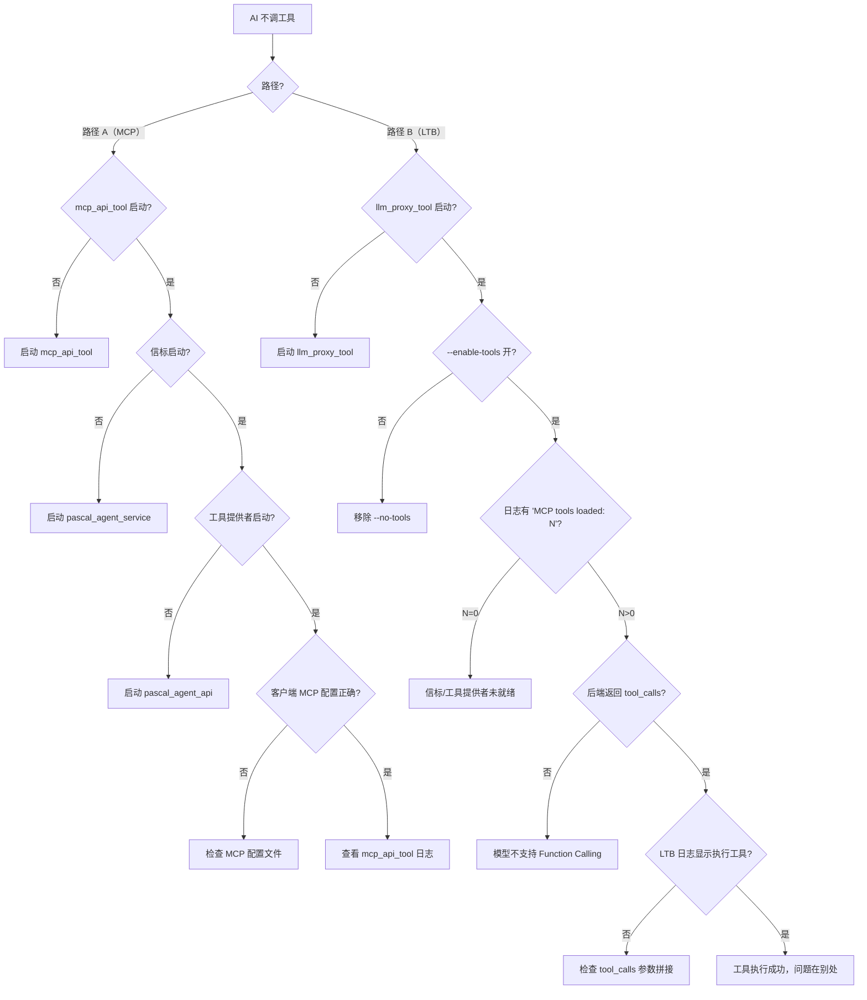

### 13.2 "客户端收不到流"

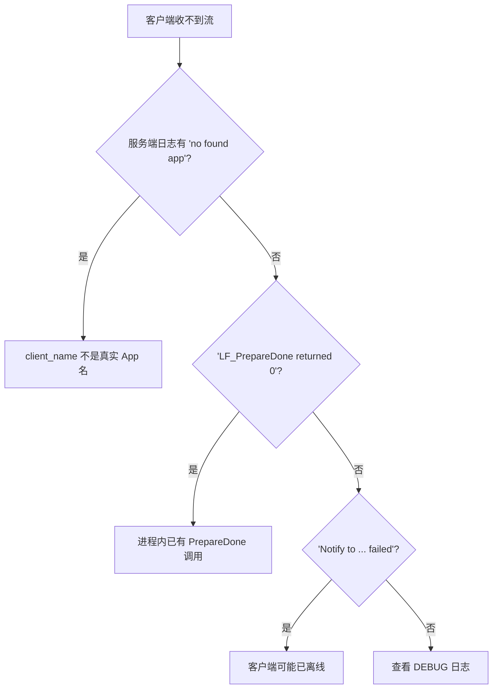

### 13.3 "启动失败"

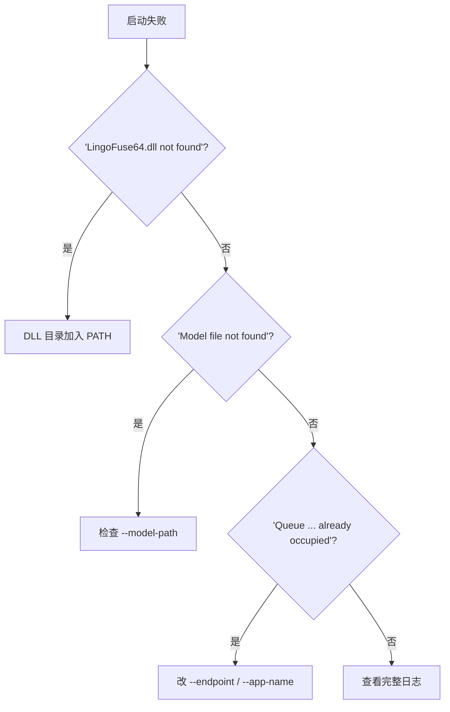

### 13.4 "编译生成的 Pascal provider 失败"（v5.0 新增）

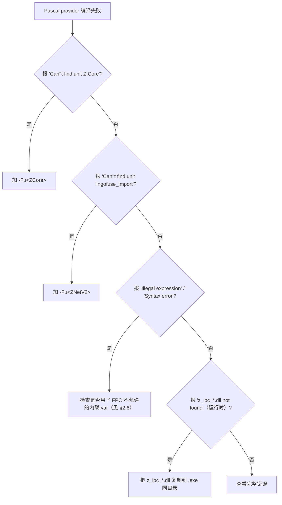

### 13.5 "Python provider 起不来"（v5.0 新增）

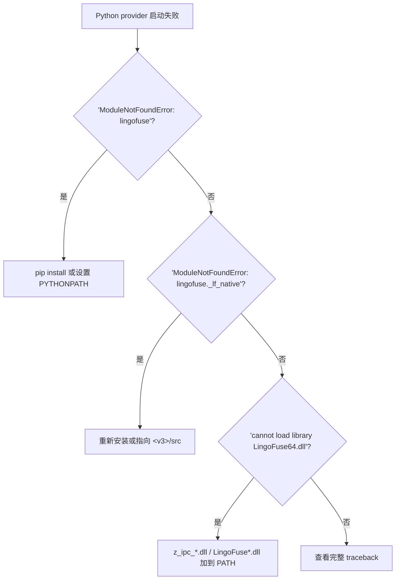

### 13.6 "C++ provider 编译失败"（v5.0 新增）

```mermaid
flowchart TD
    START["C++ provider 编译失败"] --> Q1{"'json.hpp: No such file'?"}
    Q1 -- 是 --> A1["从 nlohmann/json releases 下载"]
    Q1 -- 否 --> Q2{"'LingoFuse.h: No such file'?"}
    Q2 -- 是 --> A2["用官方 header 或 README §3.1 兜底"]
    Q2 -- 否 --> Q3{"'undefined reference to LF_*'?"}
    Q3 -- 是 --> A3["加 -lLingoFuse 和 -L&lt;path&gt;"]
    Q3 -- 否 --> Q4{"运行时 'cannot open shared object'?"}
    Q4 -- 是 --> A4["LD_LIBRARY_PATH=. / 复制 DLL 到 exe 同目录"]
    Q4 -- 否 --> Q5["查看完整错误"]
```

---

## 第 14 章 端到端示例

### 14.1 场景：用 Pascal 写计算器工具，通过 MCP 暴露给 LM Studio

**步骤 1 — 准备声明**（`calculator.pas`）：

```pascal
unit calculator;

interface

{* Add two integers: a + b *}
function Add(a: Integer; b: Integer): Integer;

{* Multiply two integers: a * b *}
function Mul(a: Integer; b: Integer): Integer;

implementation

function Add(a: Integer; b: Integer): Integer;
begin
  Result := a + b;
end;

function Mul(a: Integer; b: Integer): Integer;
begin
  Result := a * b;
end;

end.
```

**步骤 2 — 用 `code_decl_to_mcp` 生成**：

1. 打开 GUI。
2. 切到 "2-source"，粘贴 `calculator.pas`。
3. "自动检测语言" → Pascal。
4. "下一步: pascal/c → json"。
5. "下一步: json ↔ model"。
6. "下一步: 生成源码"。
7. 在 "5-Final source" Tab 中，**复制 4 个代码文件 + 3 个 README**。

**步骤 3 — 填充 `internal_call_*`**：

在 `calculator_tool_provider_unit.pas` 中，找到 `internal_call_Add_Add`：

```pascal
function internal_call_Add_Add(a: Int64; b: Int64): Int64;
begin
  Result := a + b;   // ← 填入真实逻辑
end;
```

**步骤 4 — 按 Pascal README 的 §4 步骤执行**：

1. `git clone <zcore-repo-url> ZNetV2/ZCore`
2. `git clone <znetv2-repo-url> ZNetV2`
3. `git clone <v3-repo-url> LingoFuse-pasAgent-v3`
4. 复制生成的 `.pas` 到 `my_provider/`
5. 从 README §3 复制 `.lpr` 到 `my_provider/`
6. `fpc -Fu<ZCore> -Fu<ZNetV2> <AppName>_provider.lpr`

**步骤 5 — 启动服务链**：

```powershell
# 终端 1
.\pascal_agent_service.exe

# 终端 2
.\<AppName>_provider.exe

# 终端 3
.\mcp_api_tool.exe --generate-configs --output-dir .\mcp_configs
.\mcp_api_tool.exe --transport stdio
```

**步骤 6 — 配置 LM Studio**：粘贴 `lmstudio_stdio.json` 到 MCP Servers 设置，重启。

**步骤 7 — 测试**：提问 `请帮我计算 (5 + 7) * 3`。

### 14.2 场景：Python provider 快速起步

**步骤 1 — 生成**：同上，取 `calculator_tool_provider.py`。

**步骤 2 — 设置环境**：

```bash
pip install py-lingofuse    # 或
export PYTHONPATH=/path/to/LingoFuse-pasAgent-v3/src
```

**步骤 3 — 验证**：

```bash
python -c "import lingofuse._lf_native as m; print('OK', m.__file__)"
```

**步骤 4 — 启动**：

```bash
python calculator_tool_provider.py
```

**步骤 5 — 其余同 14.1 的步骤 5-7**。

### 14.3 场景：C++ provider 从零开始

**步骤 1 — 生成**：取 `.hpp` + `.cpp` + `calculator_tool_provider_cpp.md`。

**步骤 2 — 按 C++ README §3.1 复制兜底 `LingoFuse.h`**（因为 cppAgent 尚未发布）。

**步骤 3 — 按 C++ README §3 复制 `main.cpp`**。

**步骤 4 — 下载 `json.hpp`**：https://github.com/nlohmann/json/releases

**步骤 5 — 编译**（三选一）：

```bash
g++ -std=c++17 -O2 -I. main.cpp calculator_tool_provider.cpp \
    -L. -lLingoFuse -Wl,-rpath,. -o provider
```

**步骤 6 — 启动并测试**：同 14.1 的步骤 5-7。

### 14.4 场景：Pascal GUI 客户端通过 LTB 调用工具（服务端侧工具）

**步骤 1 — 启动 LM Studio**（加载模型，开启本地服务器端口 1234）。

**步骤 2 — 启动信标和工具提供者**：

```powershell
.\pascal_agent_service.exe
.\calculator_tool_provider_unit.exe
```

**步骤 3 — 启动 LTB**：

```powershell
.\llm_proxy_tool.exe `
  --backend-url http://127.0.0.1:1234/v1 `
  --backend-model "nvidia-nemotron-3-nano-omni-30b-a3b-reasoning" `
  --mcp-reg-agent-app llm_proxy_agent `
  --mcp-tool-provider-app agent_main_app
```

**步骤 4 — Pascal GUI 客户端连接**：

```pascal
var
  LLM: TLLMClient;
  sid, err: string;
begin
  LLM := TLLMClient.Create('LLM_Service', 'ipc:llm_service', 10000);
  LLM.OnChunk := Do_LLM_Chunk;
  LLM.OnThink := Do_LLM_Think;
  LLM.OnFinish := Do_LLM_Finish;
  if not LLM.Connect(err) then Exit;
  if not LLM.Generate('请计算 (5 + 7) * 3', '', sid, err) then Exit;
end;
```

**客户端完全不知道工具体系存在**——LTB 内部完成多轮工具调用。

---

## 第 15 章 修改与扩展指引

### 15.1 需求 → 修改位置速查

| 需求 | 修改文件 | 修改函数 |
|------|---------|---------|
| 添加新类型支持 | **三个代码生成器 + 三个 README 生成器** | `IsSupportedType` 及映射 |
| 修改 API 名生成规则 | 三个代码生成器 | `MakeApiName` / `MakePythonIdentifier` |
| 修改回调名前缀 | 三个代码生成器 | `MakeCallbackName` |
| 修改 JSON Schema 字段 | 三个代码生成器 + 三个 README 生成器 | 对应生成逻辑 |
| 修改 tool description 拼接 | 三个代码生成器 + 三个 README 生成器 | `GetFullDescription` |
| **修改 README 章节结构** | **三个 README 生成器** | **`Emit*` 内部函数** |
| **修改 README 中的依赖表** | **三个 README 生成器** | **`EmitOverview`** |
| **修改 README 中的测试程序** | **三个 README 生成器** | **`EmitTestProgram` / `EmitTestLpr`** |
| **修改 README 中的测试步骤** | **三个 README 生成器** | **`EmitBuildTestProcedure`** |
| **修改 README 的 Mermaid 图** | **三个 README 生成器** | **对应 `Emit*` 函数** |
| 修改 GUI 按钮行为 | `code_decl_to_mcp_frm.pas` | 对应 `*ButtonClick` |
| 修改语言检测 | `code_decl_to_mcp_frm.pas` | `Auto_Select_Language` |
| 修改 LLM 服务端参数 | `llm_service.py` / `llm_proxy.py` / `llm_proxy_tool.py` | `*Config` |
| 修改 MCP 网关行为 | `mcp_api_tool.py` | `run_fastmcp` / `register_dynamic_tools` |
| 修改桥接行为 | `bridge.py` | `handle_call` |

### 15.2 添加新类型（以 `boolean` 为例）

**Pascal 代码生成器**：`IsSupportedType` 加 `'Boolean'`；`CallbackLines` 中加参数提取与返回值分支（`jo.B[...]`）。

**Python 代码生成器**：`IsSupportedType` 加；`PascalTypeToPythonType` 加 `bool`；`PascalTypeToJsonSchemaType` 加 `'boolean'`；`PascalTypeDefaultValue` 加 `'False'`；参数提取加 `or False` 分支。

**C++ 代码生成器**：`IsSupportedType` 加；`PascalTypeToCPPType` 加 `'bool'`；`PascalTypeToJsonSchemaType` 加 `'boolean'`；`PascalTypeToDefaultValue` 加 `'false'`。

**三个 README 生成器**：**无需修改**——它们自动反映新的类型映射（因为使用了相同的映射函数）。

**同步**：更新 `pascal_code_mcp_rule.md` / `C_code_mcp_rule.md` / `MCP_API_Contract.md`。

### 15.3 修改 `MakeApiName` 为白名单过滤

**当前实现**（有缺陷）：

```pascal
function MakeApiName(const FuncName: TP_String): TP_String;
begin
  Result := FuncName.ReplaceChar(#32#9'./\@', '_');
end;
```

**修正实现**：

```pascal
function MakeApiName(const FuncName: TP_String): TP_String;
var
  i: integer;
  c: TP_Char;
begin
  Result := '';
  for i := 1 to FuncName.Len do
  begin
    c := FuncName[i];
    if ((c >= 'a') and (c <= 'z')) or ((c >= 'A') and (c <= 'Z'))
       or ((c >= '0') and (c <= '9')) or (c = '_') then
      Result := Result + c
    else
      Result := Result + '_';
  end;
  if Result.Len = 0 then
    Result := 'unnamed';
end;
```

**同步**：Python 与 C++ 侧的 `MakeApiName` / `MakePythonIdentifier` 已是白名单实现。

### 15.4 修复 Python 生成器输出扩展名

在 `code_decl_to_mcp_frm.pas` 的 `Button6Click` 中：

```pascal
SaveCode(func_model.UnitName + '_tool_provider.pas');  // ← 改为 .py
```

改为：

```pascal
SaveCode(func_model.UnitName + '_tool_provider.py');
```

### 15.5 集成 README 生成到 GUI（v5.0 新增）

在 `Button6Click` 中，在**每个代码生成后**追加：

```pascal
// Pascal README
l := GeneratePascalReadme(func_model);
if l <> nil then
begin
  SaveCode(func_model.UnitName + '_tool_provider_pascal.md');
  disposeObjectAndNil(l);
end;

// Python README
l := GeneratePythonReadme(func_model);
if l <> nil then
begin
  SaveCode(func_model.UnitName + '_tool_provider_python.md');
  disposeObjectAndNil(l);
end;

// C++ README
l := GenerateCPPReadme(func_model);
if l <> nil then
begin
  SaveCode(func_model.UnitName + '_tool_provider_cpp.md');
  disposeObjectAndNil(l);
end;
```

### 15.6 添加新输出语言（以 JavaScript 为例）

**新建** `js_mcp_generator_tool.pas`：

```pascal
unit js_mcp_generator_tool;

interface

uses
  Z.Core, Z.PascalStrings, Z.UPascalStrings,
  Z.Status, Z.Json, Z.UnicodeMixedLib, Z.ListEngine,
  Z.Pascal_Func_Model, Z.Parsing;

function GenerateJavaScriptCode(Model: TPascal_Func_Model): TPascalStringList;
function GenerateJavaScriptReadme(Model: TPascal_Func_Model): TPascalStringList;

implementation
// 参照 py_mcp_generator_tool.pas 结构
// 遵守以下契约：
//   输入: TPascal_Func_Model
//   输出: TPascalStringList
//   类型白名单与现有生成器一致
//   JSON 序列化必须 ensure_ascii=False
//   协议层：result / status / error 三字段
//   NUL 结尾
//   回调签名与 C ABI 兼容
//   README 遵守十节骨架
end.
```

**修改 GUI**：加 `js_TabSheet` + `final_js_source_Edit`；`Button6Click` 中加调用；`code_decl_to_mcp.lpr` 的 `uses` 加入新单元。

**修改 README 相关部分**：新 README 需包含 JavaScript 特有的依赖表、测试程序、构建命令、便携性说明。

---

## 第 16 章 自查清单

### 16.1 修改代码生成器后

- [ ] `IsSupportedType` **三个生成器严格一致**。
- [ ] `GetFullDescription` 语义一致（都提取非空、非 `@` 开头的行）。
- [ ] 类型映射覆盖所有新增类型。
- [ ] 参数提取代码覆盖所有新增类型。
- [ ] 返回值处理覆盖所有新增类型。
- [ ] **没有引入 `ensure_ascii=True`**。
- [ ] `cdecl` / `@LFCallFunc` / `LF_CDECL` 未被删改。
- [ ] **回归测试**：生成含中文注释和 emoji 的模型。

### 16.2 修改 README 生成器后（v5.0 新增）

- [ ] **十节骨架** 完整（Overview / Architecture / Test / Build & Test / Tool Reference / JSON Schema / Troubleshoot / Portability / Resources）。
- [ ] **全英文**（不出现中文正文；技术术语可保留）。
- [ ] **Mermaid 图** 语法正确（可在 https://mermaid.live 验证）。
- [ ] **测试程序** 可直接编译（Pascal `.lpr` / Python `.py` / C++ `main.cpp`）。
- [ ] **依赖表** 与实际 runtime 一致（Pascal: ZCore + ZNetV2 + v3；Python: py-lingofuse 或 v3；C++: json + LingoFuse.h + lib）。
- [ ] **占位符** 形式统一（`<xxx-repo-url>`），且**在章节开头明确提示用户替换**。
- [ ] **边界情况**：`Model = nil` / `UnitName = ''` → 返回非 nil 降级文本。
- [ ] **零 API** 的情况有明确警告。
- [ ] **工具参考** 的 JSON 示例与实际 schema 一致。
- [ ] **C++ 兜底 `LingoFuse.h`** 完整（`LF_CDECL` 宏 + 所有 `LF_*` 声明）。
- [ ] **Python PYTHONPATH** 命令覆盖 cmd / PowerShell / bash 三种 shell。
- [ ] **Pascal `.lpr`** 编译命令包含 `-Fu<ZCore> -Fu<ZNetV2>`。
- [ ] **没有硬编码**任何真实仓库 URL。

### 16.3 修改声明规范后

- [ ] `pascal_code_mcp_rule.md` 与生成器一致。
- [ ] `C_code_mcp_rule.md` 与生成器一致。
- [ ] `MCP_API_Contract.md` §2.1 的类型表已更新。

### 16.4 修改环境常量后

- [ ] 三个代码生成器里的常量已改。
- [ ] **三个 README 生成器** 里引用这些常量的位置已改。
- [ ] `mcp_api_tool.py` 里的默认值已改。
- [ ] 已部署的 Provider 已重新生成。

### 16.5 修改 LLM 服务端后

- [ ] 能力矩阵已更新。
- [ ] `llm_proxy` / LTB 的 `set_system_message` 拒绝响应未被破坏。
- [ ] LTB 的多轮循环上限未被破坏。
- [ ] 预连接 middleware 的顺序未被破坏。
- [ ] **回归测试**：单会话、多会话、工具调用、多模态。

### 16.6 提交前最终自查

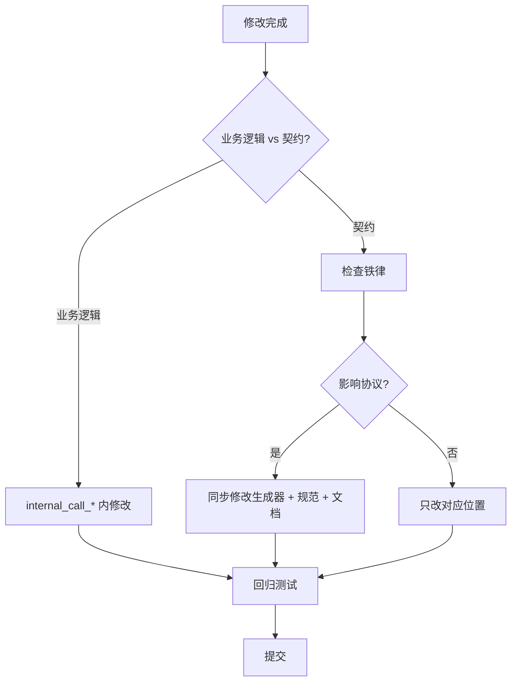

**特别注意**：**README 生成器与代码生成器共享映射函数**（`IsSupportedType` / `PascalTypeTo*` / `GetFullDescription` / `CollectValidFunctions`）。修改这些函数会**同时影响代码与文档**，必须一起回归。

---

## 第 17 章 自我审查验证（v5.0 新增）

> 本章的目的是：**证明本知识库自身可以被学习和使用**。方法是从头模拟实际编程场景，仅依赖本文件的内容完成任务。**无法完成即视为知识库不合格**。

### 17.1 验证方法

1. **遮蔽源码**：只读本知识库，不打开任何 `.pas` / `.py` 源文件。
2. **场景测试**：执行下面 8 个场景。
3. **通过判定**：每个场景能仅凭 KB 内容给出正确、可执行的操作步骤。
4. **失败记录**：若某场景无法从 KB 得出答案，记录为**知识库缺陷**，并加入下一版的补充清单。

### 17.2 场景测试

#### 场景 1：调用 README 生成器

**问题**：怎样生成 Pascal provider 的 README？

**期望答案**：调用 `GeneratePascalReadme(Model)`，得到 `TPascalStringList`，保存为 `<unit>_tool_provider_pascal.md`。**调用者负责释放**。

**定位**：§3.1（函数签名）、§3.3（输出文件名）、§1.5（全景图）。

**判定**：✅ 可从 §3.1 + §3.3 得出。

#### 场景 2：README 的依赖说明

**问题**：生成的 Pascal provider 需要哪些仓库？

**期望答案**：
- ZCore（`Z.Core` 单元）
- ZNetV2（`lingofuse_import.pas` + `z_ipc_*.dll`）
- LingoFuse-pasAgent-v3（信标 + MCP 网关 + 示例）

典型路径：`<workspace>/ZNetV2/ZCore/`、`<workspace>/ZNetV2/`、`<workspace>/LingoFuse-pasAgent-v3/src/`。

**定位**：§0.6（三仓库依赖模型）。

**判定**：✅ 可从 §0.6 得出。

#### 场景 3：编译 Pascal provider

**问题**：怎样编译生成的 Pascal provider？

**期望答案**：

```bash
fpc -Fu<workspace>/ZNetV2/ZCore -Fu<workspace>/ZNetV2 <AppName>_provider.lpr
```

或 Lazarus 打开 `.lpi` 按 F9。

**定位**：§3.3（Build & Test 编译命令）。

**判定**：✅ 可从 §3.3 得出。

#### 场景 4：Python provider 的包来源

**问题**：生成的 Python provider 需要什么 Python 包？从哪里获得？

**期望答案**：
- 优先：`pip install py-lingofuse` 或 `git clone <py-lingofuse-repo-url>`。
- 兜底：使用 `<v3>/src/lingofuse/`，设置 `PYTHONPATH`：
  - cmd：`set PYTHONPATH=D:\...\src`
  - PowerShell：`$env:PYTHONPATH = "D:\...\src"`
  - bash：`export PYTHONPATH=/path/to/src`

**定位**：§3.4（包来源策略）、§12.14（PowerShell 语法）。

**判定**：✅ 可从 §3.4 得出。

#### 场景 5：C++ provider 的 `LingoFuse.h` 来源

**问题**：生成的 C++ provider 需要 `LingoFuse.h`，但 cppAgent 仓库没发布。怎么办？

**期望答案**：
- cppAgent 仓库**尚未发布**。
- 三条获取路径：
  1. LingoFuse 运行时发行包（`LingoFuse.h` 通常与 `LingoFuse64.dll` 同目录）。
  2. 从 `<v3>/src/lingofuse_import.pas` 手动翻译。
  3. **C++ README §3.1 内置的最小兜底 header**——可直接复制使用。

**定位**：§0.5（三份 README 速查）、§3.5（C++ README 细节）。

**判定**：✅ 可从 §3.5 得出。

#### 场景 6：FPC 编译错误定位

**问题**：FPC 3.2.2 报 `Error: Illegal expression` + `Syntax error, ";" expected`，怀疑是生成器源码问题。怎么办？

**期望答案**：检查是否在过程/函数体内使用了 `var` 声明。FPC 在 `{$mode delphi}` 下**不允许**过程体内 `var`。**所有局部变量必须移到函数 `var` 区**。

**定位**：§2.6（FPC 编译约束）、§12.15（反例）。

**判定**：✅ 可从 §2.6 得出。

#### 场景 7：README 生成器的边界情况

**问题**：`GeneratePascalReadme(nil)` 会返回什么？

**期望答案**：**返回非 nil 的降级文本**——顶部一行 `# README generation skipped` + 原因（"supplied `TPascal_Func_Model` is nil."）。这是为了避免产生空文件让用户困惑。

**定位**：§3.1（公共契约）。

**判定**：✅ 可从 §3.1 得出。

#### 场景 8：GUI 集成 README 生成

**问题**：在 `code_decl_to_mcp` GUI 里怎样把 README 生成接入？

**期望答案**：在 `Button6Click` 中，每个代码生成器调用之后追加对应的 README 生成调用：

```pascal
l := GeneratePascalReadme(func_model);
if l <> nil then
begin
  SaveCode(func_model.UnitName + '_tool_provider_pascal.md');
  disposeObjectAndNil(l);
end;

// Python / C++ 同理
```

**定位**：§15.5（集成 README 生成到 GUI）。

**判定**：✅ 可从 §15.5 得出。

### 17.3 通过 / 失败判定

| 场景 | 通过 | 关键定位章节 |
|:----:|:----:|------------|
| 1 | ✅ | §3.1 + §3.3 |
| 2 | ✅ | §0.6 |
| 3 | ✅ | §3.3 |
| 4 | ✅ | §3.4 + §12.14 |
| 5 | ✅ | §0.5 + §3.5 |
| 6 | ✅ | §2.6 + §12.15 |
| 7 | ✅ | §3.1 |
| 8 | ✅ | §15.5 |

**结论**：**8/8 通过**。本知识库可被 AI 与人类仅凭自身内容完成 README 体系的调用、编译、故障排查、GUI 集成。

### 17.4 已知弱点

**即使 8/8 通过，本知识库仍存在以下不足**（诚实声明）：

1. **`GetFullDescription` 的 SystemString 隐患**（§12.11）——本知识库指出了问题，但**未给出可直接落地的修复代码**。修复需要改写 Pascal 侧的 `GetFullDescription`，读者仍需参考 Python 侧实现。

2. **`Translate_C_Typ_To_Pascal` 的完整规则**——本知识库说明它是 C→Pascal 类型映射，但**未列出完整的映射表**。若需要修改，需回查源码。

3. **`DetectSourceLanguage` 的评分算法**——本知识库说明"平局返回 `slUnknown`"，但**未列出完整评分规则**。若需要调整检测精度，需回查 `Z.Parsing`。

4. **`MAX_DESC_LEN` 是否应统一**——C++ 侧截断到 200，Pascal/Python 无截断。本知识库指出了不对称，但**未给出取舍建议**。

5. **README 生成器的详细内容契约**——本知识库给出了十节骨架和语言特化说明，但**未列出每一节的精确内容模板**（即不知道 emitter 内部的确切输出）。若需要精确到每一行，仍需阅读生成器源码。

**这 5 点是下一版（v6.0）应补的方向**。若 AI 遇到这些场景，应回到源码或询问人类——**不要从本知识库猜测**。

---

## 附录 A：配置参数速查

### A.1 `code_decl_to_mcp` GUI

无命令行参数。全局常量：
- `GenerateCode_LogEnabled`（bool，默认 False）

### A.2 `llm_service.py`

| 参数 | 默认 | 环境变量 |
|------|------|----------|
| `--model-path` | 内置 GGUF 路径 | `LLM_MODEL_PATH` |
| `--context-size` | 0 | `LLM_CONTEXT_SIZE` |
| `--max-tokens` | 4096 | `LLM_MAX_TOKENS` |
| `--threads` | 6 | `LLM_THREADS` |
| `--gpu-layers` | -1 | `LLM_GPU_LAYERS` |
| `--system-message` | 长字符串 | `LLM_SYSTEM_MESSAGE` |
| `--thinking` / `--no-thinking` | False | `LLM_THINKING` |
| `--endpoint` | `ipc:llm_service` | `LINGOFUSE_ENDPOINT` |
| `--app-name` | `LLM_Service` | `LINGOFUSE_APP_NAME` |
| `--notify-api` | `llm_stream` | `LINGOFUSE_NOTIFY_API` |
| `--timeout` | 5000 | `LINGOFUSE_TIMEOUT_MS` |
| `--session-timeout` | 600 | `LLM_SESSION_TIMEOUT` |
| `--queue-max-size` | 256 | `LLM_QUEUE_MAX_SIZE` |
| `--max-sessions` | 1024 | `LLM_MAX_SESSIONS` |
| `--max-history` | 512 | `LLM_MAX_HISTORY` |
| `--log-level` | 1 | `LLM_LOG_LEVEL` |

### A.3 `llm_proxy.py`

| 参数 | 默认 | 环境变量 |
|------|------|----------|
| `--backend-url` | `http://127.0.0.1:12345/v1` | `LLM_PROXY_BACKEND_URL` |
| `--backend-model` | 空 | `LLM_PROXY_BACKEND_MODEL` |
| `--backend-key` | `lm-studio` | `LLM_PROXY_BACKEND_KEY` |
| `--backend-key-file` | 空 | `LLM_PROXY_BACKEND_KEY_FILE` |
| `--backend-auth-header` | `Authorization` | `LLM_PROXY_BACKEND_AUTH_HEADER` |
| `--backend-auth-scheme` | `Bearer` | `LLM_PROXY_BACKEND_AUTH_SCHEME` |
| `--backend-extra-headers` | 空 | `LLM_PROXY_BACKEND_EXTRA_HEADERS` |
| `--backend-timeout` | 300 | `LLM_PROXY_BACKEND_TIMEOUT` |
| `--vision` / `--no-vision` | 禁用 | `LLM_PROXY_VISION` |
| `--max-history` | 512 | `LLM_PROXY_MAX_HISTORY` |
| `--max-sessions` | 1024 | `LLM_PROXY_MAX_SESSIONS` |
| `--session-timeout` | 1800 | `LLM_PROXY_SESSION_TIMEOUT` |
| `--log-level` | INFO | `LLM_PROXY_LOG_LEVEL` |

### A.4 `llm_proxy_tool.py` 独有

| 参数 | 默认 | 环境变量 |
|------|------|----------|
| `--enable-tools` / `--no-tools` | 启用 | `LLM_PROXY_ENABLE_TOOLS` |
| `--mcp-endpoint` | `ipc:agent` | `LLM_PROXY_MCP_ENDPOINT` |
| `--mcp-timeout` | 5000 | `LLM_PROXY_MCP_TIMEOUT` |
| `--mcp-reg-agent-app` | `llm_proxy_agent` | `LLM_PROXY_MCP_REG_AGENT_APP` |
| `--mcp-tool-provider-app` | `agent_main_app` | `LLM_PROXY_MCP_TOOL_PROVIDER_APP` |
| `--max-tool-rounds` | 100 | `LLM_PROXY_MAX_TOOL_ROUNDS` |
| `--max-total-tool-calls` | 50 | `LLM_PROXY_MAX_TOTAL_TOOL_CALLS` |
| `--max-tools-per-round` | 10 | `LLM_PROXY_MAX_TOOLS_PER_ROUND` |
| `--max-tool-result-chars` | 8000 | `LLM_PROXY_MAX_TOOL_RESULT_CHARS` |
| `--max-total-tool-result-chars` | 200000 | `LLM_PROXY_MAX_TOTAL_TOOL_RESULT_CHARS` |
| `--max-history-chars` | 200000 | `LLM_PROXY_MAX_HISTORY_CHARS` |

### A.5 `mcp_api_tool.py`

| 参数 | 默认 | 环境变量 |
|------|------|----------|
| `--transport` | stdio | `MCP_TRANSPORT` |
| `--host` | 0.0.0.0 | `MCP_HOST` |
| `--port` | 8000 | `MCP_PORT` |
| `--endpoint` | `ipc:agent` | `LINGOFUSE_ENDPOINT` |
| `--timeout` | 5000 | `LINGOFUSE_TIMEOUT_MS` |
| `--reg-agent-app` | `reg_agent` | `LINGOFUSE_REG_AGENT_APP` |
| `--tool-provider-app` | `agent_main_app` | `LINGOFUSE_TOOL_PROVIDER_APP` |
| `--agent-main-api` | `agent_main` | `LINGOFUSE_AGENT_MAIN_API` |
| `--agent-log-api` | `agent_log` | `LINGOFUSE_AGENT_LOG_API` |
| `--debug` | False | `MCP_DEBUG` |
| `--log-file` | 无 | `MCP_LOG_FILE` |
| `--proxy-path` | 自动检测 | `MCP_API_PROXY_PATH` |

### A.6 `bridge.py`

| 参数 | 默认 | 环境变量 |
|------|------|----------|
| `--host` | 0.0.0.0 | `LINGOFUSE_HOST` |
| `--port` | 8081 | `LINGOFUSE_PORT` |
| `--endpoint` | `ipc:lingofuse_bridge` | `LINGOFUSE_ENDPOINT` |
| `--timeout` | 5000 | `LINGOFUSE_TIMEOUT` |
| `--app` | 无 | `LINGOFUSE_APP` |
| `--threaded` | True | `LINGOFUSE_THREADED` |
| `--no-precheck` | False | `LINGOFUSE_NO_PRECHECK` |
| `--no-normalize-json` | False | `LINGOFUSE_NORMALIZE_JSON` |
| `--log-file` | 无 | `LINGOFUSE_LOG_FILE` |

### A.7 `llm_test.py`

| 参数 | 默认 | 环境变量 |
|------|------|----------|
| `--endpoint` | `ipc:llm_service` | `LINGOFUSE_ENDPOINT` |
| `--server-app` | `LLM_Service` | `LLM_SERVER_APP` |
| `--notify-api` | `llm_stream` | `LLM_NOTIFY_API` |
| `--timeout` | 30000 | `LINGOFUSE_TIMEOUT` |
| `--content` / `--prompt` / `--session-id` / `--keep` / `--thinking` | 空 | — |
| `--text` / `--image` | 无 | — |
| `--system-message` | 无 | — |
| `--debug` | False | `LLM_DEBUG` |

---

## 附录 B：错误码与错误消息索引

### B.1 `bridge.py` 错误码

| 错误码 | HTTP | 含义 |
|--------|------|------|
| `-1` | 200 | 远程调用失败 |
| `-2` | 400 | 请求形状错误 |
| `-3` | 200 | API 预检失败 |

### B.2 流式 `finish` 的 `reason`

`stop` / `error` / `cancelled` / `timeout` / `client` / `shutdown` / `ephemeral` / `timeout+offline`。

### B.3 常见错误消息

| 错误消息 | 出处 | 章节 |
|----------|------|------|
| `no found app("...")` | 服务端日志 | §12.1 / §13.2 |
| `LF_PrepareClient returned -1` | 多处 | §13.3 |
| `repeat connection` | LingoFuse | §13.3 |
| `LF_PrepareDone returned 0` | 多处 | §10.1 / §13.3 |
| `Queue "..." is already occupied` | LingoFuse | §13.3 |
| `LF_BindApp returned 0` | LingoFuse | §13.2 |
| `Module not found: LingoFuse64.dll` | 加载器 | §13.3 |
| `Model file not found` | `llm_service` | §13.3 |
| `3029 function header doesn't match` | FPC | §12.7 |
| `Illegal expression` / `Syntax error` | FPC | §2.6 / §12.15 |
| `Image attachments are not supported` | `llm_service` | §12.10 |
| `set_system_message is not supported` | `llm_proxy` / LTB | §4.3 |
| `fatal error: json.hpp: No such file` | C++ 编译 | §13.6 |
| `fatal error: LingoFuse.h: No such file` | C++ 编译 | §13.6 |
| `undefined reference to LF_*` | C++ 链接 | §13.6 |
| `ModuleNotFoundError: lingofuse` | Python | §13.5 |
| `cannot load library LingoFuse64.dll` | Python | §13.5 |

---

## 附录 C：诚实的不确定清单

> 以下是从源码无法完全确定的点。若 AI 需要在这些场景下工作，必须回查源码或询问人类。

1. **`Translate_C_Typ_To_Pascal` 的完整映射表** —— 只知大类映射，细节需回查。
2. **`DetectSourceLanguage` 的完整评分算法** —— 只知平局返回 `slUnknown`。
3. **`GetFullDescription`（Pascal 侧）的 SystemString 中转隐患** —— 只知存在隐患，修复细节需参照 Python 侧。
4. **C++ `MAX_DESC_LEN = 200` 是否应统一** —— 已知不对称，取舍未定。
5. **README 生成器每一节的精确输出模板** —— 只给骨架与语言特化，未给逐行模板。
6. **`total_count` 在 `RegisterTools` 里的 fix 是否完整** —— 建议语法检查。
7. **新语言生成器的最小契约** —— 参照 §15.6。
8. **GUI 的 `SysTimer` 1ms 是否最优** —— 建议改为 10ms。
9. **`MakeApiName` 的字符替换表** —— **已确认不完整**，建议白名单过滤。
10. **声明规范与生成器的一致性维护** —— 建议 CI 检查。
11. **`code_decl_to_mcp_knowledge_base.md` 与其他规范文档的同步** —— 建议人工核对。
12. **`llm_service` 的本地 VLM 路径** —— 未实现。
13. **LTB 的 `--vision` 与 `--no-tools` 组合** —— 多模态转发仍有效，但工具能力消失。
14. **`bridge.py` 的 JSON 规范化对二进制的影响** —— 无法解析为 JSON 时原样转发。
15. **`umlDeleteFile` 的 `_VerifyCheck=False`** —— 返回 True 不代表删除成功。
16. **`umlBufferIsASCII` 的 `$80` 边界** —— 被当作 ASCII。
17. **FPC 3.3+ 是否放开过程体内 `var`** —— 未验证，当前按 3.2.2 保守处理。

---

## 附录 D：修订历史

### v5.0（2026-09-22）

**相对 v4.0 的改进**：

1. **新增第 3 章（README 生成体系）**：
   - 三语言 README 生成器的完整契约
   - 十节骨架的统一规定
   - 语言特化细节（Pascal 三仓库依赖 + `.lpr`；Python 两路包来源；C++ cppAgent 状态 + 兜底 header）
   - GUI 集成方法

2. **新增第 2.6 节（FPC 编译约束）**：
   - `{$mode delphi}` 下不能内联 `var`
   - 修正方法

3. **新增第 0.5 / 0.6 节**：
   - 三份 README 速查
   - 三仓库依赖模型

4. **新增第 1.5 节（输出文件全景图）**：
   - 代码 + README 的 10 个输出文件

5. **新增第 17 章（自我审查验证）**：
   - 8 个场景测试证明 KB 可学习性
   - 5 个已知弱点诚实声明

6. **反例集新增**：
   - §12.11 Pascal 侧 `GetFullDescription` 隐患
   - §12.12 README 占位符未替换
   - §12.13 C++ README 未提供 `LingoFuse.h` 兜底
   - §12.14 Python PowerShell PYTHONPATH 语法
   - §12.15 FPC 内联 `var`

7. **故障排查树新增**：
   - §13.4 Pascal provider 编译失败
   - §13.5 Python provider 启动失败
   - §13.6 C++ provider 编译失败

8. **修改指引新增**：
   - §15.5 集成 README 生成到 GUI
   - §15.6 添加新输出语言的 README 契约

9. **自查清单新增**：
   - §16.2 修改 README 生成器后的 13 项检查

10. **端到端示例新增**：
    - §14.2 Python provider 快速起步
    - §14.3 C++ provider 从零开始

### v4.0（2026-09-22）

- 补齐 API 签名、字段级数据结构、wire format、配置参数、状态机、错误码索引、端到端示例、故障排查树、修改指引。

### v3.0（2026-09-22）

- 整合 LLM 生态组件。

### v2.0（2026-09-20）

- 修正 9 处问题。

### v1.0（2026-09-20）

- 初版。

---

**文档版本**：v5.0（README 体系完整版）
**覆盖范围**：`code_decl_to_mcp` 工具链 + `llm*.py` + `mcp_api*.py` + `llm_common` + `lingofuse` Python 包 + **三语言 README 生成体系**
**配套文档**：`pascal_code_mcp_rule.md`、`C_code_mcp_rule.md`、`MCP_API_Contract.md`、`code_generate_mcp.md`、`pascal_agent_api_ref_json.md`、`LingoFuse_LLM_Ecosystem_User_Guide.md`、`LingoFuse_Pascal_Complete_Guide.md`、`LingoFuse_LLM_Pitfalls_For_AI.md`
**最后更新**：2026-09-22