# LingoFuse MCP Ecosystem — Knowledge Base

> **Document version**: v7.0 (Full-Ecosystem Edition)
> **Audience**: AI assistants and human engineers who must use, extend, or debug the LingoFuse MCP ecosystem **without reading the source code**.
> **Scope**: The entire ecosystem — the declaration-to-tool generator, the three language providers it emits, the beacon, the MCP gateway, the middleware, the LLM service trio, the HTTP bridge, the Python bindings, and the shared contracts that bind them all together.
> **Diagram convention**: Every flowchart / architecture diagram / decision tree uses **Mermaid**. Large diagrams are split into smaller composable ones so that each can be read independently.
> **Reading tip**: This document is organized as an ecosystem map, not as a tool manual. Read Chapter 1 first to build the mental model; use the later chapters as a reference.

---

## Table of Contents

**Part I — Ecosystem Map**
- [Chapter 1  What This Ecosystem Is](#chapter-1--what-this-ecosystem-is)
- [Chapter 2  The Six Layers](#chapter-2--the-six-layers)
- [Chapter 3  Component and Data-Flow Map](#chapter-3--component-and-data-flow-map)

**Part II — Declaration-to-Tool Pipeline**
- [Chapter 4  Generator Toolchain Overview](#chapter-4--generator-toolchain-overview)
- [Chapter 5  Three Work Modes (GUI / CLI / MCP-API)](#chapter-5--three-work-modes-gui--cli--mcp-api)
- [Chapter 6  Code Generators](#chapter-6--code-generators)
- [Chapter 7  README Generation System](#chapter-7--readme-generation-system)

**Part III — Agent Interface Contract**
- [Chapter 8  The 11 MCP Tools of code_decl_to_mcp](#chapter-8--the-11-mcp-tools-of-code_decl_to_mcp)
- [Chapter 9  Comment Discipline — The Single Most Important Rule](#chapter-9--comment-discipline--the-single-most-important-rule)

**Part IV — Python Agent Ecosystem**
- [Chapter 10  mcp_api_tool.py — The MCP Gateway](#chapter-10--mcp_api_toolpy--the-mcp-gateway)
- [Chapter 11  language_middleware.py — The Middleware](#chapter-11--language_middlewarepy--the-middleware)
- [Chapter 12  The LLM Service Trio](#chapter-12--the-llm-service-trio)
- [Chapter 13  bridge.py and HTTP Interop](#chapter-13--bridgepy-and-http-interop)
- [Chapter 14  Startup Sequence Contract](#chapter-14--startup-sequence-contract)

**Part V — Build and Integration**
- [Chapter 15  Pascal Provider Build](#chapter-15--pascal-provider-build)
- [Chapter 16  Python Provider Build](#chapter-16--python-provider-build)
- [Chapter 17  C++ Provider Build](#chapter-17--c-provider-build)
- [Chapter 18  End-to-End Deployment](#chapter-18--end-to-end-deployment)

**Part VI — Contracts and Reference**
- [Chapter 19  Wire Format and Protocol](#chapter-19--wire-format-and-protocol)
- [Chapter 20  Type System and Mapping](#chapter-20--type-system-and-mapping)
- [Chapter 21  Configuration Reference](#chapter-21--configuration-reference)
- [Chapter 22  Lifecycle and State Machines](#chapter-22--lifecycle-and-state-machines)
- [Chapter 23  Threading Model](#chapter-23--threading-model)
- [Chapter 24  Anti-Patterns](#chapter-24--anti-patterns)
- [Chapter 25  Troubleshooting Trees](#chapter-25--troubleshooting-trees)
- [Chapter 26  Self-Check Checklists](#chapter-26--self-check-checklists)

**Appendices**
- [Appendix A  Error Code and Message Index](#appendix-a--error-code-and-message-index)
- [Appendix B  Honest Uncertainty List](#appendix-b--honest-uncertainty-list)
- [Appendix C  Revision History](#appendix-c--revision-history)

---

# Part I — Ecosystem Map

## Chapter 1  What This Ecosystem Is

### 1.1 One Sentence

**LingoFuse MCP Ecosystem** is an end-to-end toolchain that turns **annotated Pascal or C function declarations** into **AI-callable MCP tools**, and then wires those tools into an agent runtime through a language-neutral RPC mesh.

The ecosystem is not "a code generator". The generator is one component. The ecosystem is the complete pipeline:

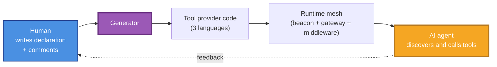

### 1.2 The Two GitHub Repositories

The ecosystem spans **two official repositories**:

| Repository | Status | Role |
|------------|--------|------|
| [`PassByYou888/LingoFuse-pasAgent-v3`](https://github.com/PassByYou888/LingoFuse-pasAgent-v3) | Published | Pascal agent runtime: beacon, MCP gateway, LTB, examples, Python `lingofuse` package, `code_decl_to_mcp` toolchain |
| [`PassByYou888/LingoFuse-cppAgent`](https://github.com/PassByYou888/LingoFuse-cppAgent) | **Not yet published** | Official C++ binding: `LingoFuse.h`, CMake config, sample provider |

**Consequence for users**: The Pascal branch is fully deployable today. The C++ branch relies on a fallback `LingoFuse.h` embedded in generated README files until `cppAgent` is released.

### 1.3 What "Full Ecosystem" Means

A user who only runs `code_decl_to_mcp.exe` has used **10% of the ecosystem**. The remaining 90% is the runtime that makes the generated tools actually reachable by an AI agent. The ecosystem includes:

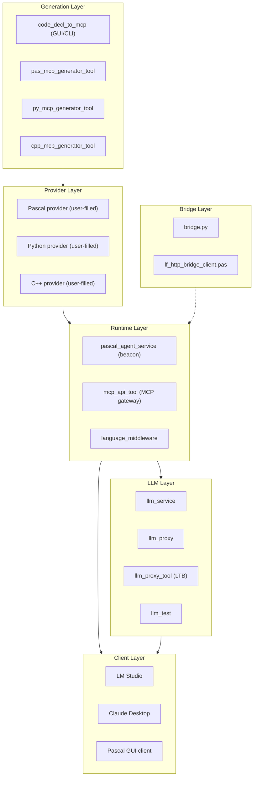

### 1.4 The Core Value Proposition

| Without This Ecosystem | With This Ecosystem |
|------------------------|---------------------|
| Hand-write MCP tool schemas for each language | Auto-generate from one declaration |
| Maintain three provider implementations separately | One source, three providers kept in sync |
| Manual test programs per language | README embeds a runnable test program |
| Agent cannot discover new tools without restart | Dynamic tool registration via beacon |
| Tool descriptions drift from source comments | Descriptions extracted from source comments |

---

## Chapter 2  The Six Layers

The ecosystem is organized into **six layers**. Each layer has a clear responsibility and a clear interface with its neighbors.

### 2.1 Layer Overview

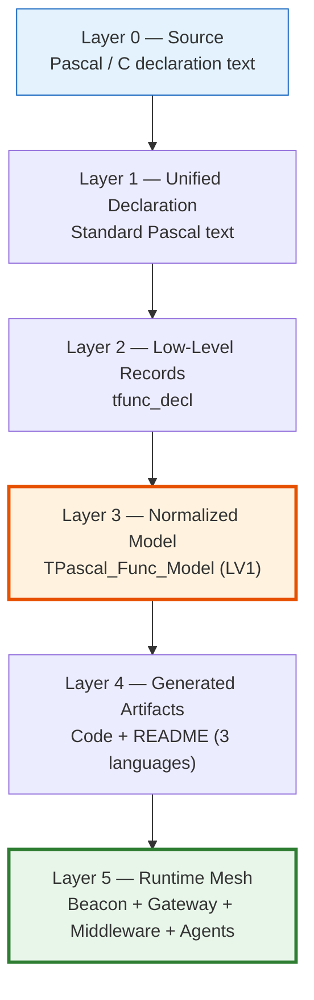

### 2.2 Layer 0 — Source Declaration

The human writes a Pascal unit or C header containing function declarations with comments. **The comments are the single most important part of this layer** (see Chapter 9).

### 2.3 Layer 1 — Unified Declaration

Whatever the source language, the declaration is parsed into a **standard Pascal text representation**. This is what makes the toolchain language-neutral.

### 2.4 Layer 2 — Low-Level Records

The parser produces `tfunc_decl` records: raw function metadata straight from the syntax tree.

### 2.5 Layer 3 — Normalized Model (`TPascal_Func_Model`)

This is the **single source of truth** for the rest of the pipeline:

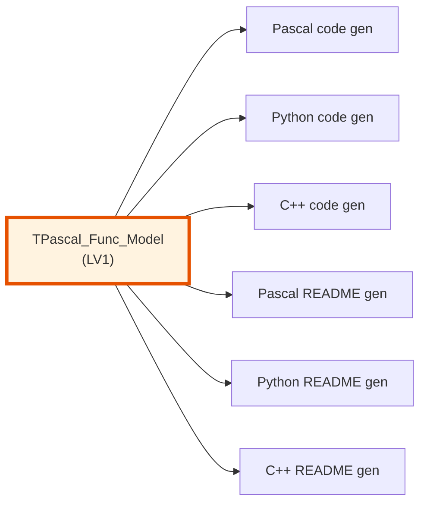

**Key insight**: Because code and documentation are generated from the **same model**, they **cannot drift apart**.

### 2.6 Layer 4 — Generated Artifacts

For each input unit, the generator produces **7 files**:

| # | File | Type |
|:-:|------|------|
| 1 | `<unit>_tool_provider_unit.pas` | Pascal code |
| 2 | `<unit>_tool_provider.py` | Python code |
| 3 | `<unit>_tool_provider.hpp` | C++ header |
| 4 | `<unit>_tool_provider.cpp` | C++ implementation |
| 5 | `<unit>_tool_provider_pascal.md` | Pascal README |
| 6 | `<unit>_tool_provider_python.md` | Python README |
| 7 | `<unit>_tool_provider_cpp.md` | C++ README |

Plus 3 context files: `source.pas`, `source.json` (LV0), `source_model.json` (LV1).

### 2.7 Layer 5 — Runtime Mesh

The runtime mesh is what connects the generated providers to AI clients:

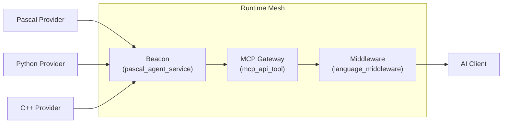

---

## Chapter 3  Component and Data-Flow Map

### 3.1 Component Inventory

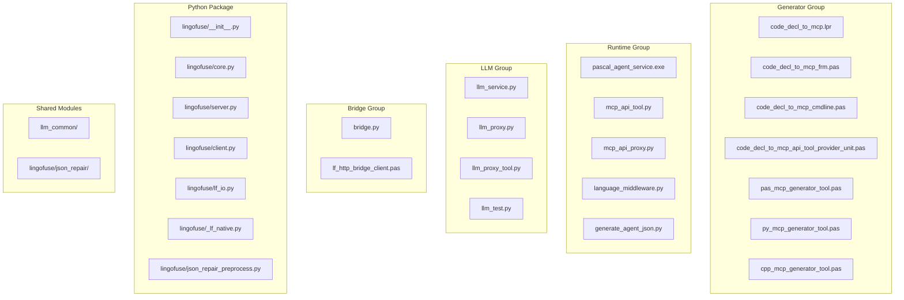

### 3.2 Runtime Data Flow (Path A — MCP)

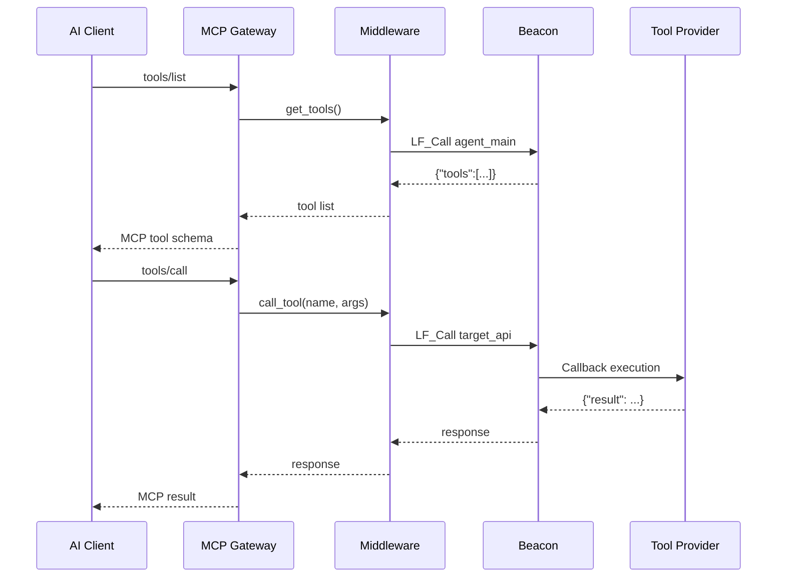

### 3.3 Runtime Data Flow (Path B — LTB)

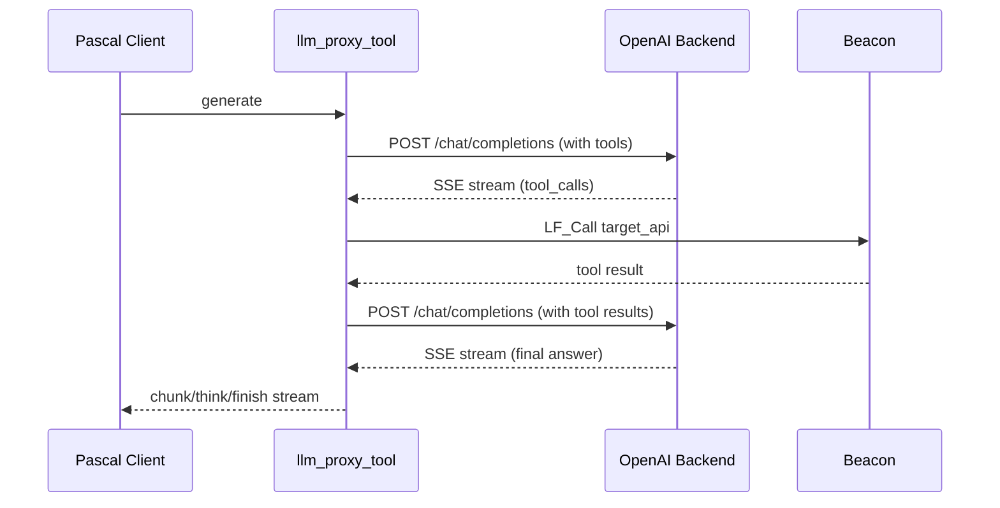

### 3.4 Runtime Data Flow (Path C — HTTP Bridge)

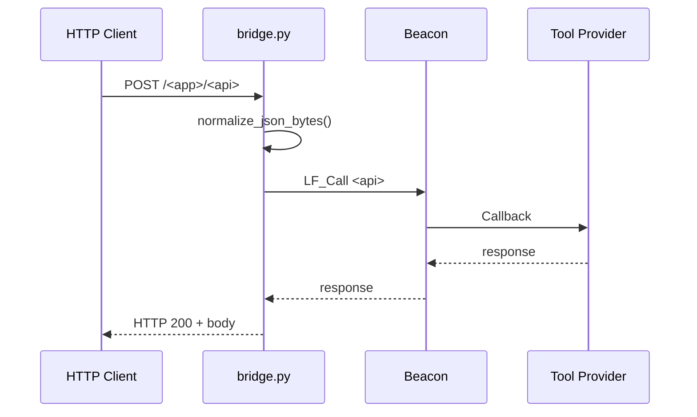

---

# Part II — Declaration-to-Tool Pipeline

## Chapter 4  Generator Toolchain Overview

### 4.1 The Pipeline

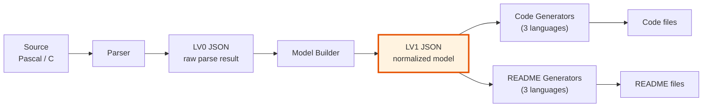

### 4.2 Supported Input Languages

| Language | Extensions | Parser Entry |
|----------|-----------|--------------|
| Pascal | `.pas`, `.pp`, `.p` | `tpascal_func_decl_tool.CreateFrom_Pascal_Code` |
| C | `.h`, `.hpp`, `.hh`, `.c`, `.cpp`, `.cc`, `.cxx` | `tpascal_func_decl_tool.CreateFrom_C_Code` |

### 4.3 Output Target Selection

The target language is determined by **the output file extension**:

| Extension | Target |
|-----------|--------|
| `.pas`, `.pp`, `.p` | Pascal provider |
| `.py` | Python provider |
| `.hpp`, `.hh`, `.h` | C++ header (auto-pairs `.cpp`) |
| `.cpp`, `.cc`, `.cxx`, `.c` | C++ implementation (auto-pairs `.hpp`) |

### 4.4 Type Whitelist

Only three normalized types are supported:

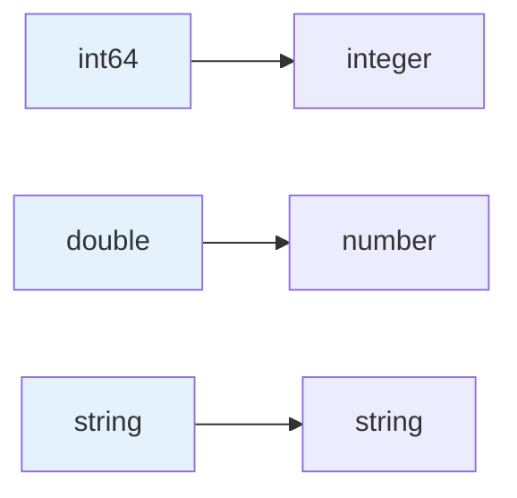

**Every declaration containing an unsupported type is dropped entirely** — not just the offending parameter.

### 4.5 Normalization Table

| Source Pascal Type | Normalized To |
|---------------------|---------------|
| `Integer` / `LongInt` / `Word` / `Byte` / `Cardinal` / `SmallInt` / `ShortInt` / `Int64` / `UInt64` / `LongWord` / `DWord` | `int64` |
| `Single` / `Double` / `Extended` / `Real` | `double` |
| `string` / `AnsiString` / `UnicodeString` / `WideString` / `PChar` / `PAnsiChar` / `PWideChar` / `TP_String` / `TPascalString` / `TUPascalString` | `string` |

### 4.6 Unsupported Type Categories

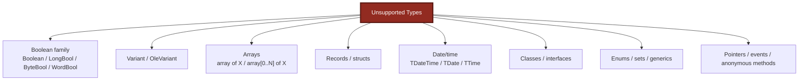

---

## Chapter 5  Three Work Modes (GUI / CLI / MCP-API)

### 5.1 Decision Diagram

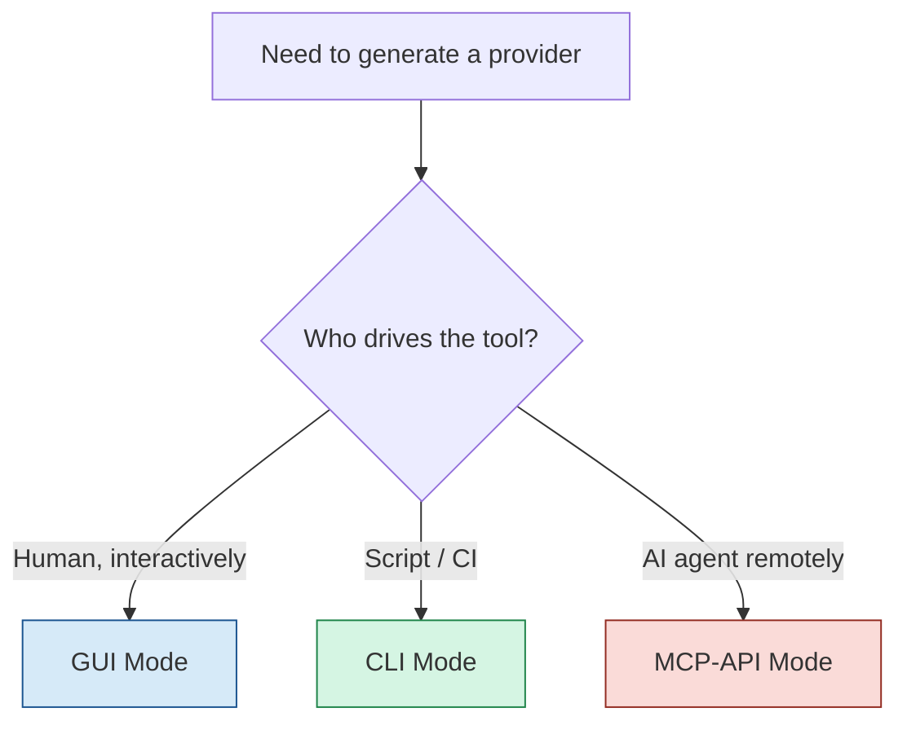

### 5.2 GUI Mode

**Entry**: `code_decl_to_mcp.exe` with no arguments.

**State machine**:

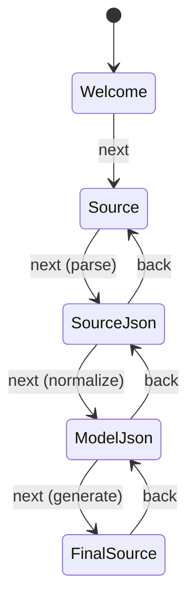

**Five tabs**:

| Tab | Name | Purpose |
|:---:|------|---------|
| 1 | Welcome | Introduction, rule-doc links |
| 2 | Source Code | Paste Pascal / C source |
| 3 | Source ↔ JSON | LV0 JSON (raw parse) |
| 4 | JSON ↔ Model | LV1 model JSON |
| 5 | Final Source | Generated code + README |

**Key buttons**:

| Button | Effect |
|--------|--------|
| Select Language | Auto-detect source language |
| Format | Keep only top-level declarations |
| Empty unit | Insert minimal skeleton |
| Test unit | Insert rich syntax sample |
| Next: Pascal/C → JSON | Parse to LV0 |
| Next: JSON ↔ Model | Normalize to LV1 |
| Next: generate source | Generate all artifacts |

### 5.3 CLI Mode

**Entry**: `code_decl_to_mcp.exe <input> <output>`

**Behavior**:
- Source language detected from input extension
- Target language detected from output extension
- README auto-written next to generated code
- Console subsystem: no GUI created

**Exit codes**:

| Code | Meaning |
|:----:|---------|
| 0 | Success |
| 1 | Missing / invalid arguments |
| 2 | Source parsing failed |
| 3 | Code generation failed |
| 4 | File I/O error |

**Example invocations**:

```bash
# C header → Python provider
code_decl_to_mcp.exe ComplexTestUnit.h calculator_provider.py

# Pascal unit → C++ provider (auto-pairs .hpp + .cpp)
code_decl_to_mcp.exe calculator.pas calculator_provider.hpp

# Pascal unit → Pascal provider
code_decl_to_mcp.exe calculator.pas calculator_provider.pas
```

### 5.4 MCP-API Mode

**Entry**: AI agent drives the 11 MCP tools exposed by `code_decl_to_mcp` itself.

**Prerequisites**:
- `code_decl_to_mcp.exe` GUI is running
- `mcp_api_tool.exe` (or the beacon + gateway chain) is running
- An AI client is connected to the gateway

**Tool sequence** (see Chapter 8 for full details):

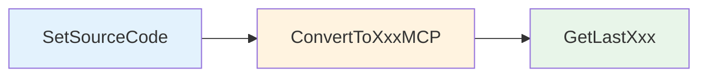

### 5.5 Comparison Table

| Dimension | GUI | CLI | MCP-API |
|-----------|:---:|:---:|:-------:|
| Requires GUI running | Yes | No | **Yes** |
| Requires beacon | Yes | No | Yes |
| Requires MCP gateway | No | No | Yes |
| Suitable for CI | No | **Yes** | No |
| Intermediate steps visible | Yes | No | No |
| Drives all 3 targets | Yes | Yes | Yes |
| Headless | No | Yes | No |

---

## Chapter 6  Code Generators

### 6.1 Generator Signatures

```pascal
function GeneratePascalCode(Model: TPascal_Func_Model): TPascalStringList;
function GeneratePythonCode(Model: TPascal_Func_Model): TPascalStringList;
function GenerateHPPCode(Model: TPascal_Func_Model): TPascalStringList;
function GenerateCPPCode(Model: TPascal_Func_Model): TPascalStringList;
```

**Common contract**:
- Input must be a `TPascal_Func_Model` in `tnf_Json` mode.
- `Model = nil` or `Model.UnitName = ''` → returns `nil`.
- Returned `TPascalStringList` **must be released by the caller**.
- When no supported functions exist, an empty skeleton is returned.

### 6.2 The Three-Generator Symmetry Rule

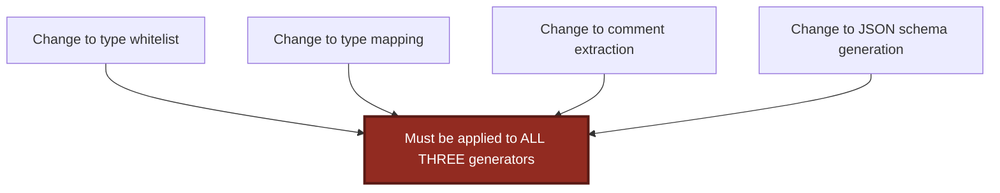

### 6.3 Three-Language Difference Matrix

| Dimension | Pascal | Python | C++ |
|-----------|--------|--------|-----|
| Type whitelist | `Int64`/`Double`/`string` | same | same |
| JSON Schema mapping | same | same | same |
| Description extraction | via `TPascalStringList.AsText` | char-by-char on `TP_String` | via `CleanComment_Local` |
| Duplicate tool names | numeric suffix | numeric suffix | **dropped** |
| Description truncation | none | none | `MAX_DESC_LEN = 200` |
| Callback macro | `cdecl` | `@LFCallFunc` | `LF_CDECL` |
| Internal stub name | `internal_call_<Name>_<ApiName>` | `internal_call_<name>` | `internal_call_<Name>` |
| Output files | `.pas` | `.py` | `.hpp` + `.cpp` |

### 6.4 The `internal_call_*` Stub

Every supported function generates a stub. **This is the only place where a human fills in real business logic.**

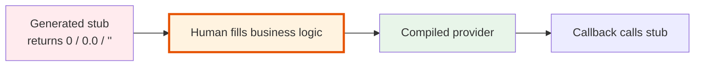

**Contract (all three languages)**:
- Do **not** modify the function signature.
- Keep the `// call type: ...` comment on the Pascal side.
- Keep the `TODO` comment on the Python and C++ sides.
- The default return value is a **placeholder**, not a real answer.

---

## Chapter 7  README Generation System

### 7.1 Design Principles

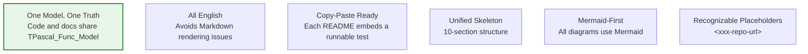

### 7.2 The 10-Section Skeleton

| # | Section | Language-Specific? |
|:-:|---------|:------------------:|
| 1 | Overview | Yes |
| 2 | Runtime Architecture | No |
| 3 | Test Program | Yes |
| 4 | Build & Test Procedure | Yes |
| 5 | Tool Reference | No |
| 6 | JSON Schema Specification | No |
| 7 | Debugging & Troubleshooting | Yes |
| 8 | Portability Notes | Yes |
| 9 | Reference Resources | Yes |
| 10 | (Header) | No |

### 7.3 README Generator Contract

```pascal
function GeneratePascalReadme(Model: TPascal_Func_Model): TPascalStringList;
function GeneratePythonReadme(Model: TPascal_Func_Model): TPascalStringList;
function GenerateCPPReadme(Model: TPascal_Func_Model): TPascalStringList;
```

**Contract**:
- `Model = nil` or `Model.UnitName = ''` → **returns non-nil degraded text** (single line `# README generation skipped` + reason).
- Never raises.
- Does not depend on network, filesystem, or external processes.

### 7.4 Language-Specific Content

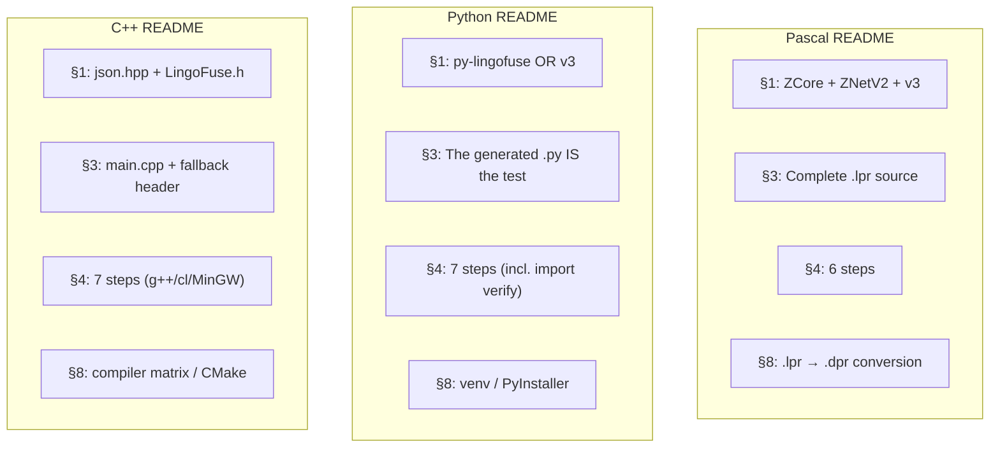

### 7.5 Where the README Is Actually Used

**The README is not optional documentation.** It is the actual deliverable for building the artifacts. The generated `.pas` / `.py` / `.hpp` / `.cpp` are skeletons; the paired `.md` tells the user how to build, test, and deploy each one.

**Rule**: Always generate both code and README. Always read the README first.

---

# Part III — Agent Interface Contract

## Chapter 8  The 11 MCP Tools of code_decl_to_mcp

### 8.1 Why the Generator Exposes MCP Tools

The `code_decl_to_mcp` project itself exposes **11 MCP tools**. This lets an AI agent **drive the entire generation process**, which closes an important loop:

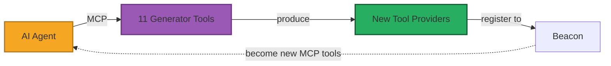

The agent can **generate new tools for itself**.

### 8.2 The Three-Step Shape

```mermaid
flowchart TB
    S1["Step 1: SetSourceCode<br/>Store source + language<br/>⚠️ Does NOT convert<br/>⚠️ Produces no file"]
    S2["Step 2: ConvertToXxxMCP<br/>Pascal / Python / C++<br/>⚠️ Requires Step 1 success"]
    S3["Step 3: GetLastXxx<br/>Pure reader<br/>⚠️ No new conversion<br/>⚠️ No re-call of SetSourceCode"]

    S1 --> S2 --> S3

    style S1 fill:#e3f2fd,stroke:#1565c0,stroke-width:2px
    style S2 fill:#fff3e0,stroke:#e65100,stroke-width:2px
    style S3 fill:#e8f5e9,stroke:#2e7d32,stroke-width:2px
```

### 8.3 The Complete Tool Inventory

| # | Tool | Role | Prerequisite | Output |
|:-:|------|------|-------------|--------|
| 1 | `SetSourceCode` | Step 1 — store | None | `{"status":"ok"}` |
| 2 | `ConvertToPascalMCP` | Step 2 — Pascal | Step 1 success | `{"result":"<path>"}` |
| 3 | `ConvertToPythonMCP` | Step 2 — Python | Step 1 success | `{"result":"<path>"}` |
| 4 | `ConvertToCppMCP` | Step 2 — C++ | Step 1 success | `{"result":"<path>"}` |
| 5 | `GetLastPascalCode` | Step 3 — read Pascal code | Step 2 Pascal success | Full code text |
| 6 | `GetLastPascalReadme` | Step 3 — read Pascal README | Step 2 Pascal success | Full Markdown |
| 7 | `GetLastPythonCode` | Step 3 — read Python code | Step 2 Python success | Full code text |
| 8 | `GetLastPythonReadme` | Step 3 — read Python README | Step 2 Python success | Full Markdown |
| 9 | `GetLastCppHeader` | Step 3 — read C++ header | Step 2 C++ success | Full header text |
| 10 | `GetLastCppImpl` | Step 3 — read C++ impl | Step 2 C++ success | Full impl text |
| 11 | `GetLastCppReadme` | Step 3 — read C++ README | Step 2 C++ success | Full Markdown |

### 8.4 Enforced Constraints

| # | Constraint | Violation Symptom |
|:-:|-----------|-------------------|
| 1 | `Language` accepts only `"pascal"` or `"c"` | AI passes `"python"` and gets confused |
| 2 | Step 1 → Step 2 → Step 3 is mandatory | Skipping Step 1 makes Convert fail |
| 3 | Do not loop `SetSourceCode` + `ConvertToXxx` | AI re-stores source repeatedly |
| 4 | `GetLastXxx` is a pure reader | AI expects a new conversion and stalls |
| 5 | GUI must stay alive | All conversions return `Form not available` |

### 8.5 Return Value Shapes

| Scenario | Response JSON |
|----------|---------------|
| `SetSourceCode` success | `{"status":"ok"}` |
| `SetSourceCode` failure | `{"error":"<message>"}` |
| `ConvertToXxxMCP` success | `{"result":"<absolute path>"}` |
| `ConvertToXxxMCP` failure | `{"error":"<message>"}` |
| `GetLastXxx` success | Full text |
| `GetLastXxx` failure | Empty string |

### 8.6 Recommended Call Sequences

```mermaid
flowchart LR
    subgraph Min["Minimal (Python service)"]
        M1["SetSourceCode"]
        M2["ConvertToPythonMCP"]
        M3["GetLastPythonCode"]
        M4["GetLastPythonReadme"]
        M1 --> M2 --> M3 --> M4
    end

    subgraph Multi["One source, multiple targets"]
        N1["SetSourceCode"]
        N2["ConvertToPascalMCP"]
        N3["ConvertToPythonMCP"]
        N4["ConvertToCppMCP"]
        N5["GetLast*  (all branches)"]
        N1 --> N2 --> N3 --> N4 --> N5
    end

    style Min fill:#e8f5e9
    style Multi fill:#fff3e0
```

### 8.7 MCP Tool Registration JSON (Downstream Tools)

Generated providers register themselves through the `register_agent` API with this JSON shape:

```json
{
  "name": "<ApiName>",
  "description": "<extracted from comments>",
  "target_app": "<MY_APP_NAME>",
  "target_api": "<ApiName>",
  "parameters": {
    "type": "object",
    "properties": {
      "<param_name>": {
        "type": "integer|number|string",
        "description": "<param description>"
      }
    },
    "required": ["<param_name>", "..."]
  }
}
```

**Field constraints**:

| Field | Constraint |
|-------|-----------|
| `name` | Required, tool name |
| `description` | Required, from comments |
| `target_app` | Required, equals `MY_APP_NAME` |
| `target_api` | Required, equals `name` |
| `parameters.type` | Required, must be `"object"` |
| `parameters.required` | Required, includes **every** parameter |

---

## Chapter 9  Comment Discipline — The Single Most Important Rule

### 9.1 Why This Chapter Matters

An AI agent does **not** read your source file. It reads the **`description` string** of each tool. That string is your source comment, **compressed, de-tagged, and possibly truncated** (C++ side truncates at 200 characters).

> **The quality of your comments is the quality of your agent.**

### 9.2 Human vs AI Reading

```mermaid
flowchart TB
    subgraph Human["Human Reading Source"]
        H1["Reads the whole unit"]
        H2["Understands the whole workflow"]
        H3["Sees the next method naturally"]
        H1 --> H2 --> H3
    end

    subgraph AI["AI Agent"]
        A1["Reads only the description string"]
        A2["Sees only this one tool"]
        A3["Has no global picture"]
        A4["Stops after the first successful tool"]
        A1 --> A2 --> A3 --> A4
    end

    style H2 fill:#e1ffe1
    style A3 fill:#ffe1e1
    style A4 fill:#ffe1e1
```

### 9.3 The Real-World Incident

**Tool design**: A three-tool generation pipeline.

| Tool | Purpose |
|------|---------|
| `SetSourceCode(Source, Language)` | Store source and language |
| `ConvertToPythonMCP()` | Perform conversion, return path |
| `GetLastPythonCode()` | Read the generated content |

**Actual agent behavior across three rounds**:

| Round | Agent Behavior | Root Cause |
|:-----:|---------------|------------|
| 1 | Called only `SetSourceCode`, saw `{"status":"ok"}`, stopped | Description did not say "Step 1 of 3" |
| 2 | Called `SetSourceCode` + `ConvertToCppMCP`, but passed `Language='python'` | Parameter name ambiguity |
| 3 | After clarification, completed the three-step call correctly | — |

**Cost**: Three rounds of comment rewriting, each requiring a full regeneration + beacon restart + retest cycle.

### 9.4 The Four Weapons for AI-Friendly Comments

#### Weapon 1 — Every Tool Answers Three Questions

```mermaid
flowchart LR
    Q1["Q1: What is my role<br/>in the workflow?"] --> Q2["Q2: What is my<br/>prerequisite?"]
    Q2 --> Q3["Q3: What is<br/>my output?"]

    style Q1 fill:#e3f2fd
    style Q2 fill:#fff3e0
    style Q3 fill:#e8f5e9
```

#### Weapon 2 — Decision Table

Place it in the **unit header comment**:

```pascal
(*
  WHAT YOU WANT  ->  WHICH TOOLS TO CALL
  --------------------------------------

      Want Python code ?      SetSourceCode -> ConvertToPythonMCP
                                              -> GetLastPythonCode

      Want Python README ?    SetSourceCode -> ConvertToPythonMCP
                                              -> GetLastPythonReadme

      Want Pascal code ?      SetSourceCode -> ConvertToPascalMCP
                                              -> GetLastPascalCode

      Want C++ header ?       SetSourceCode -> ConvertToCppMCP
                                              -> GetLastCppHeader
*)
```

#### Weapon 3 — WRONG/RIGHT Table

```pascal
(*
  COMMON MISTAKES TO AVOID
  ------------------------

      WRONG   SetSourceCode(Source, "python")
              - python is not a source language
      RIGHT   SetSourceCode(Source, "c")
              ConvertToPythonMCP

      WRONG   Stop after SetSourceCode and expect a file
      RIGHT   Always follow SetSourceCode with one ConvertToXxxMCP

      WRONG   Call SetSourceCode again before GetLastPythonReadme
      RIGHT   GetLastPythonReadme reads what ConvertToPythonMCP produced
*)
```

**Why it works**: When the AI is about to try something wrong and sees that exact thing in a `WRONG` block, it avoids it. **This is more direct than positive description.**

#### Weapon 4 — Front-Load the First 200 Characters

| Language | `GetFullDescription` Behavior | Truncation |
|----------|-------------------------------|-----------|
| Pascal | Scans via `TPascalStringList.AsText` | None |
| Python | Char-by-char on `TP_String` | None |
| C++ | `CleanComment_Local` + line scan | **`MAX_DESC_LEN = 200`** |

**Because the C++ side truncates at 200 characters, the first 200 characters must carry the critical information** — especially "workflow role" and "prerequisite".

### 9.5 The 10-Point Agent Description Self-Check

| # | Check | Fix if Failing |
|:-:|-------|---------------|
| 1 | Unit header describes the complete workflow | Add a WORKFLOW OVERVIEW section |
| 2 | Each tool independently answers role / prerequisite / output | Add three role labels |
| 3 | Multi-step workflow: each tool names the next tool | Write the next tool's name into the description |
| 4 | "Intent → tool chain" decision table exists | Add the decision table |
| 5 | "COMMON MISTAKES TO AVOID" table exists | Add the WRONG/RIGHT table |
| 6 | Ambiguous parameters clarified in the first sentence | Disambiguate explicitly |
| 7 | Legal values listed with an example illegal value | Complete the list |
| 8 | First 200 characters cover the critical info | Move the critical info earlier |
| 9 | `RegisterTools`'s `description` > 200 chars when necessary | Override manually or emit from template |
| 10 | Test case covers "let the AI run a full workflow from scratch" | Add the test case |

### 9.6 Reserved Comments (Do Not Modify)

| Location | Comment | Reason |
|----------|---------|--------|
| Pascal `internal_call_*` | `// call type: Result := ...` | Fill-in point |
| Pascal `internal_call_*` | `(* ... {$IFDEF FPC} ... *)` block | Optional main-thread sync |
| Python `internal_call_*` | `"""Wrapper for the original routine ... TODO: replace ..."""` | Fill-in point |
| Python `internal_call_*` | `# Default return value; replace with actual logic.` | Placeholder marker |
| C++ `internal_call_*` | `// TODO: replace this placeholder ...` | Fill-in point |
| Pascal callback | `// ---- <Name> (API: <ApiName>) ----` | Locating marker |
| File header | Entire docstring | Generator version and entry |

### 9.7 The Comment Iron Rule

```mermaid
flowchart TD
    R["Comment Iron Rule"]
    R --> R1["Contract-related: hands off"]
    R --> R2["Business-related: your call"]
    R --> R3["AI reads only the first 200 chars<br/>(C++ hard limit)"]
    R --> R4["Every tool answers three questions<br/>(role / prerequisite / output)"]
    R --> R5["Decision table + WRONG/RIGHT table<br/>(global view)"]

    style R fill:#922B21,stroke:#5A1A14,stroke-width:3px,color:#FFFFFF
    style R3 fill:#B7791F,stroke:#7E5109,stroke-width:3px,color:#FFFFFF
```

---

# Part IV — Python Agent Ecosystem

## Chapter 10  mcp_api_tool.py — The MCP Gateway

### 10.1 Positioning

`mcp_api_tool.py` is the **MCP protocol gateway**. It translates between MCP JSON-RPC (client-facing) and LingoFuse RPC (backend-facing).

```mermaid
flowchart LR
    Client["MCP Client"] -->|JSON-RPC| GW["mcp_api_tool"]
    GW -->|LF_Call| Beacon["Beacon"]
    Beacon -->|LF_Call| Provider["Tool Provider"]

    style GW fill:#FADBD8,stroke:#922B21,stroke-width:3px
```

### 10.2 The Three Core APIs

| API | Type | Input | Output |
|-----|------|-------|--------|
| `agent_main` | Call | `{}` | `{tools: [...]}` |
| `agent_log` | Call | `{message}` | `{status: "ok"}` |
| `register_agent` | Call | `{name, description, target_app, target_api, parameters}` | `{status: "ok"}` |

### 10.3 Transport Modes

```mermaid
flowchart TD
    T["Transport selection"]
    T --> S["stdio<br/>(default)"]
    T --> H["http<br/>(recommended)"]
    T --> E["sse<br/>(deprecated)"]

    S --> S1["Client auto-launches"]
    S --> S2["Runs in MAIN PROCESS<br/>(avoids Windows spawn)"]
    H --> H1["Manual start"]
    H --> H2["Streamable HTTP"]
    E --> E1["Manual start"]
    E --> E2["Legacy SSE"]

    style S fill:#e8f5e9
    style H fill:#e3f2fd
    style E fill:#ffebee
```

### 10.4 stdio Console Suppression

```python
LF_SetOption(b"ConsoleOutput", b"False")
LF_SetOption(b"Quiet", b"True")
```

**Reason**: LingoFuse's C layer emits diagnostic output, which pollutes the MCP stdio channel.

**Critical timing**: This must run before any other LingoFuse API in stdio mode.

### 10.5 Signal Handling

```python
def signal_handler(sig, frame):
    raise KeyboardInterrupt()   # NOT sys.exit(0)
```

**Reason**: `sys.exit(0)` raises `SystemExit`, which is **not** caught by `except KeyboardInterrupt`. This causes http/sse subprocesses to become orphaned.

### 10.6 Dynamic Tool Registration

```mermaid
flowchart TD
    Start["register_dynamic_tools()"] --> Loop["For each tool from middleware"]
    Loop --> Name["Resolve Python identifier"]
    Name --> Params["Build typed signature"]
    Params --> Body["Build body: args dict + call_tool"]
    Body --> Exec["exec() the source"]
    Exec --> Register["mcp.tool(name, description)"]
    Register --> Next{"More tools?"}
    Next -- Yes --> Loop
    Next -- No --> Done["Done"]
```

**Critical** (v2.40 fix): Generated tool functions **must** carry type annotations (`a: int`, `b: str`, ...). Without annotations, FastMCP advertises empty parameter schemas and clients send `{}` for every argument.

### 10.7 Configuration Generation

```bash
python mcp_api_tool.py --generate-configs --output-dir ./mcp_configs
```

Generates per-client JSON config files plus Markdown documentation:

```mermaid
flowchart LR
    Gen["--generate-configs"] --> LM["lmstudio_stdio.json<br/>lmstudio_http.json<br/>lmstudio_sse.json<br/>lmstudio_stdio_proxy.json"]
    Gen --> CL["claude_stdio.json<br/>..."]
    Gen --> CO["continue_stdio.json<br/>..."]
    Gen --> JA["jan_stdio.json<br/>..."]
    Gen --> DS["deepseek_stdio.json<br/>..."]
    Gen --> GE["generic_stdio.json<br/>..."]
    Gen --> MD["*_README.md"]
```

---

## Chapter 11  language_middleware.py — The Middleware

### 11.1 Positioning

`language_middleware.py` bridges the MCP gateway and the backend. It is **language-neutral**: it does not know whether the provider is Pascal, Python, or C++.

### 11.2 Key Design

```mermaid
flowchart TB
    subgraph Key["Key Design Properties"]
        K1["Singleton<br/>One instance per process"]
        K2["Lazy connect<br/>Connect on first use"]
        K3["Thread-safe<br/>Internal lock"]
        K4["Auto-reconnect<br/>Via _ensure_connected()"]
    end

    style Key fill:#e3f2fd,stroke:#1565c0
```

### 11.3 Complete API

| Method | Purpose |
|--------|---------|
| `get_instance(...)` | Get singleton, optionally update config |
| `get_tools() -> List[Dict]` | Tool list |
| `call_tool(tool_name, arguments) -> Any` | Invoke a tool |
| `log(message) -> Optional[Dict]` | Send a log |
| `is_connected() -> bool` | Connection state |
| `reconnect()` | Force reconnect |
| `shutdown()` | Explicit shutdown |

### 11.4 Lifecycle Iron Rule

```mermaid
flowchart LR
    A["LF_ExitMainThread"] --> B["LF_FreeApp"]
    B --> C["LF_Shutdown"]

    style A fill:#e3f2fd
    style B fill:#fff3e0
    style C fill:#e8f5e9
```

**`_disconnect()` must NOT call `LF_Shutdown()`** — the App handle must remain valid across disconnect/reconnect cycles.

### 11.5 The `reg_tool` Callback

The `register_agent` callback reads the field **`name`**, not `tool_name`. This matches the Pascal side's `do_register_agent`.

### 11.6 Response Validation (v7.7)

Two defensive checks in `_fetch_tools_from_backend`:

| Check | Behavior | Rationale |
|-------|----------|-----------|
| N1 | Non-object response → clear cache, soft fail | A backend that returns a non-object no longer raises `AttributeError` |
| N2 | Non-object tool entries → skip with warning | A malformed entry no longer aborts the list |

Both preserve the invariant: **a bad backend cannot abort the connection attempt**.

---

## Chapter 12  The LLM Service Trio

### 12.1 The Three Siblings

```mermaid
flowchart LR
    subgraph Trio["LLM Service Trio"]
        S["llm_service<br/>local inference"]
        P["llm_proxy<br/>pure text passthrough"]
        L["llm_proxy_tool<br/>proxy + server-side tools"]
    end

    style S fill:#e3f2fd,stroke:#1565c0
    style P fill:#fff3e0,stroke:#e65100
    style L fill:#fce4ec,stroke:#c2185b
```

### 12.2 Capability Matrix

| API | `llm_service` | `llm_proxy` | `llm_proxy_tool` |
|-----|:-------------:|:-----------:|:----------------:|
| `generate` | 1 | 1 | 1 |
| `create_session` | 1 | 1 | 1 |
| `close_session` | 1 | 1 | 1 |
| `cancel_session` | 1 | 1 | 1 |
| `list_sessions` | 1 | 1 | 1 |
| `set_system_message` | **1** | **0** | **0** |
| `health` | 1 | 1 | 1 |
| `llm_stream` | 1 | 1 | 1 |
| `attachments` | 1 | 1 | 1 |
| `vision` | **0** | 0/1 | 0/1 |
| `tools` / `tool_calls` / `tool_results` | — | — | **1** |
| `server_kind` | `service` | `proxy` | `proxy` |

**Precise meaning of `vision=0`**: The server itself does not perform visual processing. It does not mean the whole pipeline lacks multimodal support. Image understanding depends on the **backend**.

### 12.3 `llm_service.py` — Local Inference

| Dimension | Value |
|-----------|-------|
| Inference backend | local llama.cpp |
| Inference thread | single serial worker (**required**: llama.cpp is not thread-safe) |
| Context management | server holds KV cache |
| Session reclaim | **dual condition**: status=idle AND idle time > timeout AND client app offline |
| `check_app` cache delay | ~3 seconds |
| Thinking priority | 1) `options.thinking` → 2) `--thinking` → 3) `LLM_THINKING` → 4) `DEFAULT_THINKING` |

**Attachment limits**: text ≤ 256 KB/file, 512 KB total; image base64 ≤ 8 MB/file, 16 MB total. **Images accepted only when `--vision` is enabled** (currently `llm_service` always rejects them).

### 12.4 `llm_proxy.py` — Pure Text Proxy

**Key differences from `llm_service`**:

| Dimension | `llm_service` | `llm_proxy` |
|-----------|---------------|-------------|
| Model loading | local llama.cpp | none |
| Inference | single serial worker | none |
| Context | server holds KV cache | rebuilds messages per round |
| `set_system_message` | ✅ supported | ❌ explicitly rejected |
| Session reclaim | dual condition | single condition (timeout only) |
| Default `session_timeout` | 600 | 1800 |

**`set_system_message` rejection response**:

```json
{
  "code": -1,
  "status": "unsupported",
  "error": "set_system_message is not supported by llm_proxy.\n..."
}
```

### 12.5 `llm_proxy_tool.py` — LTB

**Positioning**: `llm_proxy` + **server-side tool execution**.

**The multi-round loop**:

```mermaid
stateDiagram-v2
    [*] --> Round0: generate arrives
    Round0 --> CallBackend: with tools
    CallBackend --> CheckCalls: SSE finished
    CheckCalls --> Final: no tool_calls
    CheckCalls --> ExecuteTools: has tool_calls
    ExecuteTools --> AppendHistory: append role=tool
    AppendHistory --> CheckCaps: check round/call limits
    CheckCaps --> CallBackend: under limits, next round with tools
    CheckCaps --> CallBackendNoTools: over limit or last round, no tools
    CallBackendNoTools --> Final
    Final --> EmitFinish: send finish
    EmitFinish --> [*]
```

**Key decisions**:
- `is_final_round = force_final_round OR (round_idx == max_tool_rounds - 1)`
- When `total_tool_calls >= max_total_tool_calls`, `force_final_round = True`.
- **The final round does not carry `tools`**, forcing the model to produce text.

**Tool-result truncation**:
1. Single result > `max_tool_result_chars` → truncated + `...(truncated)`.
2. Total characters > `max_total_tool_result_chars` → truncated + `...(tool-result budget exhausted)`.

**Pre-connect middleware ordering (critical)**: LTB must call `_ensure_tools_ready()` **before** `Server.start()`. Reason: `LF_PrepareDone()` returns 1 only once per process.

### 12.6 `llm_test.py` — Interactive Test Client

**Interactive commands**:

| Command | Purpose |
|---------|---------|
| `/new` | Create a new session |
| `/use <session_id>` | Switch current session |
| `/sessions` | List sessions for this client |
| `/close [id]` | Close a session |
| `/cancel` | Cancel the current generation |
| `/sys <message>` | Update global default system message |
| `/health` | Query server health |
| `/capabilities` | Show server capability matrix |
| `/capabilities refresh` | Force re-fetch |
| `/thinking on\|off` | Toggle thinking mode |
| `/help` | Show help |
| `/quit` / `/exit` | Exit |

**One-shot mode**:

```bash
python llm_test.py --content "review this code" --text main.py
python llm_test.py --content "describe this chart" --image a.png
python llm_test.py --text a.py --text b.py --image chart.png
```

---

## Chapter 13  bridge.py and HTTP Interop

### 13.1 Positioning

`bridge.py` is a **bidirectional HTTP ↔ LingoFuse gateway** with canonical JSON normalization.

```mermaid
flowchart LR
    subgraph DirectionA["Direction A — Inbound"]
        HTTP1["HTTP client"] -->|POST /app/api| B1["bridge.py"]
        B1 -->|LF_Call| P1["LingoFuse provider"]
    end

    subgraph DirectionB["Direction B — Outbound"]
        LF1["LingoFuse client"] -->|LF_Call __lf_outbound_post__| B2["bridge.py"]
        B2 -->|HTTP request| HTTP2["Remote HTTP server"]
    end

    subgraph DirectionC["Direction C — Repair"]
        LF2["LingoFuse client"] -->|LF_Call __lf_repair_json__| B3["bridge.py"]
        B3 -->|repaired text| LF2
    end

    style DirectionA fill:#e3f2fd
    style DirectionB fill:#fff3e0
    style DirectionC fill:#e8f5e9
```

### 13.2 Default Names

| Element | Default Value |
|---------|---------------|
| Bridge App name | `__lf_http_bridge__` |
| Outbound POST API | `__lf_outbound_post__` |
| JSON repair API | `__lf_repair_json__` |

**Namespace convention**: The double-underscore prefix/suffix cannot appear in a normal HTTP URL path without encoding, so the bridge's own APIs never collide with business APIs.

### 13.3 Inbound Response Codes

| Code | HTTP | Meaning |
|------|------|---------|
| `-1` | 200 | Remote call failed |
| `-2` | 400 | Request shape error |
| `-3` | 200 | API pre-check failed |

### 13.4 JSON Normalization

The bridge normalizes payloads in both directions. The two-layer repair stack:

```mermaid
flowchart TD
    Start["Raw bytes"] --> Strip["Strip BOM, trailing NULs"]
    Strip --> Decode["Decode UTF-8 → GBK → Latin-1"]
    Decode --> Parse["json.loads()"]
    Parse -- Success --> Canon["Canonicalize via dumps_json"]
    Parse -- Failure --> L1["Layer 1: _try_repair_json<br/>(BOM, trailing comma)"]
    L1 --> L2["Layer 2: repair_json_text<br/>(unified engine)"]
    L2 -- Success --> Canon
    L2 -- Failure --> Pass["Passthrough: return original bytes"]
    Canon --> Done["Return canonical JSON"]
    Pass --> Done

    style Parse fill:#e3f2fd
    style L1 fill:#fff3e0
    style L2 fill:#fce4ec
    style Pass fill:#ffebee
```

### 13.5 `lf_http_bridge_client.pas`

A Pascal client library for the bridge. **Not a program** — it does not prepare services/clients, does not call `LF_PrepareDone`.

**Three usage levels**:

| Level | Function | Purpose |
|-------|----------|---------|
| Highest | `LFHttpPostBody` | Send JSON body, unwrap response body |
| Middle | `LFHttpPost` | Send JSON body, receive full envelope |
| Lowest | `LFHttpCall` | Full control over method, headers, timeout |
| Repair | `LFHttpRepairJson` | JSON repair service |

---

## Chapter 14  Startup Sequence Contract

### 14.1 The Complete Startup Chain

```mermaid
flowchart TD
    S1["Terminal 1: pascal_agent_service.exe"]
    S2["Terminal 2: <AppName>_provider.exe<br/>(or python <AppName>_tool_provider.py)"]
    S3["Terminal 3: mcp_api_tool.exe --transport stdio"]
    S4["Client config: merge lmstudio_stdio.json"]
    S5["Restart AI client"]
    S6["Client shows new tools in tool list"]
    S7["Test: ask AI to call a tool"]

    S1 --> S2 --> S3 --> S4 --> S5 --> S6 --> S7

    style S1 fill:#e8f5e9,stroke:#2e7d32,stroke-width:2px
    style S7 fill:#fce4ec,stroke:#c2185b,stroke-width:2px
```

### 14.2 Why Order Matters

```mermaid
flowchart TD
    Q["Why can't we start in any order?"]
    Q --> A["LF_PrepareDone()<br/>returns 1 only once per process"]
    A --> B["If the beacon starts before the gateway,<br/>the gateway's PrepareDone may return 0"]
    B --> C["LTB therefore pre-connects middleware<br/>BEFORE Server.start()"]

    style A fill:#fff3e0,stroke:#e65100,stroke-width:2px
    style C fill:#e8f5e9,stroke:#2e7d32,stroke-width:2px
```

### 14.3 The 8-Step Startup Checklist

| # | Step | Command / Configuration |
|:-:|------|------------------------|
| 1 | Generate code | GUI / CLI / MCP-API |
| 2 | Read the generated `.md` | Open `<basename>_readme.md` |
| 3 | Build the provider | Follow the `.md` |
| 4 | Fill in `internal_call_*` | Edit the generated unit/module |
| 5 | Register the tool | Automatic via `Execute_And_Reg_all()` |
| 6 | Start the beacon | `pascal_agent_service.exe` |
| 7 | Start the provider | `<provider>.exe` or `python <provider>.py` |
| 8 | Start the agent | Path A: `mcp_api_tool.exe` · Path B: `llm_proxy_tool.exe` |

**Step 9 (not optional)**: **Audit AI descriptions** (see Chapter 9).

---

# Part V — Build and Integration

## Chapter 15  Pascal Provider Build

### 15.1 The Three-Repository Dependency

```mermaid
flowchart TD
    subgraph Required["Required Repositories"]
        R1["ZCore<br/>(Z.Core units)"]
        R2["ZNetV2<br/>(lingofuse_import.pas + z_ipc_*.dll)"]
        R3["LingoFuse-pasAgent-v3<br/>(beacon + MCP gateway + examples)"]
    end

    subgraph Use["Usage"]
        U1["-Fu&lt;ZCore&gt; on compile"]
        U2["-Fu&lt;ZNetV2&gt; on compile"]
        U3["Runtime: pascal_agent_service.exe"]
    end

    R1 --> U1
    R2 --> U2
    R3 --> U3
```

### 15.2 Compile Command

```bash
fpc -Fu<workspace>/ZNetV2/ZCore -Fu<workspace>/ZNetV2 <AppName>_provider.lpr
```

Or open the `.lpi` in Lazarus and press **F9**.

### 15.3 The Embedded Test Program (`.lpr`)

The Pascal README §3 embeds a complete runnable `.lpr`:

```pascal
program <AppName>_provider;

{$mode objfpc}{$H+}
{$CODEPAGE UTF8}

uses
  {$IFDEF UNIX}cthreads,{$ENDIF}
  {$IFDEF MSWINDOWS}Windows,{$ENDIF}
  SysUtils, Classes,
  Z.Core,
  <UnitName>_tool_provider_unit;

begin
  WriteLn('=== <AppName> Tool Provider ===');
  WriteLn('Connecting to ipc:agent ...');

  if not Execute_And_Reg_all then
  begin
    WriteLn('');
    WriteLn('[FATAL] Provider startup failed.');
    WriteLn('Checklist:');
    WriteLn('  1. Is pascal_agent_service.exe running?');
    WriteLn('  2. Is the endpoint ipc:agent reachable?');
    WriteLn('  3. Check DEBUG_LOG output above for details.');
    Halt(1);
  end;

  WriteLn('');
  WriteLn('[OK] Provider is ready. All tools registered.');
  WriteLn('Press Enter to shut down.');
  ReadLn;

  LF_ExitMainThread;
  LF_Shutdown;
  WriteLn('[OK] Shutdown complete.');
end.
```

### 15.4 Key Points

| Point | Reason |
|-------|--------|
| `{$mode objfpc}{$H+}` | Main mode for a standalone program |
| `{$CODEPAGE UTF8}` | Ensures Chinese strings are correct |
| `cthreads` first on Unix | RTS links the multi-threaded C library |
| `Z.Core` in `uses` | Provider internally uses `TCompute` / `TCore_Thread` |
| `LF_ExitMainThread` + `LF_Shutdown` | Release all LingoFuse resources |

### 15.5 Delphi Portability

| Step | Action |
|------|--------|
| 1 | Rename `.lpr` → `.dpr` |
| 2 | Replace `{$mode objfpc}{$H+}` with Delphi project header |
| 3 | Remove `cthreads` (Delphi RTL handles threading automatically) |
| 4 | Set unit search paths |
| 5 | **The generated `<UnitName>_tool_provider_unit.pas` is already Delphi-compatible** |

---

## Chapter 16  Python Provider Build

### 16.1 The Generated File Is the Test Program

The generated `.py` file **already contains** an `if __name__ == "__main__":` block. There is **no separate test script**.

### 16.2 The Two Package Sources

```mermaid
flowchart TD
    Start["How to provide `lingofuse`?"]
    Start --> PathA{"Standalone package<br/>available?"}
    PathA -- Yes --> A["pip install py-lingofuse"]
    PathA -- No --> B["Use v3's src/lingofuse/"]
    B --> B1["set PYTHONPATH=&lt;v3&gt;/src"]
    A --> Run["python &lt;UnitName&gt;_tool_provider.py"]
    B1 --> Run

    style A fill:#e8f5e9
    style B fill:#fff3e0
```

### 16.3 Environment Configuration

**Path A (recommended)**:
```bash
pip install py-lingofuse
python <UnitName>_tool_provider.py
```

**Path B (fallback)**:

| Shell | Command |
|-------|---------|
| Windows cmd | `set PYTHONPATH=D:\LingoFuse-pasAgent-v3\src` |
| Windows PowerShell | `$env:PYTHONPATH = "D:\LingoFuse-pasAgent-v3\src"` |
| Linux / macOS | `export PYTHONPATH=/path/to/LingoFuse-pasAgent-v3/src` |

### 16.4 Verify the Import

```bash
python -c "import lingofuse._lf_native as m; print('OK', m.__file__)"
```

If this fails:
- Path A: re-check `pip show py-lingofuse`
- Path B: re-check `PYTHONPATH`

### 16.5 Environment Variables

| Variable | Required | Purpose |
|----------|:--------:|---------|
| `PYTHONPATH` | Only for Path B | Locate `lingofuse` package |
| `PATH` | Recommended | Locate `z_ipc_*.dll` at process start |

---

## Chapter 17  C++ Provider Build

### 17.1 Current Status

**The `cppAgent` repository has not been released yet.** Generated C++ README files therefore provide **three fallback paths** to obtain `LingoFuse.h`.

```mermaid
flowchart TD
    Start["Need LingoFuse.h"]
    Start --> A["Official cppAgent release"]
    Start --> B["LingoFuse runtime distribution"]
    Start --> C["Translate from lingofuse_import.pas"]
    Start --> D["Use the README §3.1 fallback header"]

    A -.->|not available yet| X["Not published"]
    B --> Use["Usable"]
    C --> Use
    D --> Use

    style D fill:#e8f5e9,stroke:#2e7d32,stroke-width:3px
```

### 17.2 Build Commands

**Linux / macOS**:
```bash
g++ -std=c++17 -O2 -I. main.cpp <unit>_tool_provider.cpp \
    -L. -lLingoFuse -Wl,-rpath,. -o provider
```

**Windows (MSVC)**:
```bat
cl /std:c++17 /EHsc /I. main.cpp <unit>_tool_provider.cpp ^
   /link /LIBPATH:. LingoFuse.lib /OUT:provider.exe
```

**Windows (MinGW-w64)**:
```bat
g++ -std=c++17 -O2 -I. main.cpp <unit>_tool_provider.cpp ^
    -L. -lLingoFuse -o provider.exe
```

### 17.3 The Fallback `LingoFuse.h`

The C++ README §3.1 embeds a minimal ~50-line header that declares only the symbols actually used by the generated provider:

| Symbol Group | Declarations |
|--------------|-------------|
| Handle types | `TDataHnd`, `TAppHnd` |
| Callback types | `LFCallFunc`, `LFNotifyFunc` |
| Data handle ops | `LF_CreateData`, `LF_FreeData`, `LF_GetBuffer`, `LF_WriteBuffer`, `LF_ReadBuffer`, `LF_GetPos`, `LF_SetPos`, `LF_GetSize`, `LF_SetSize` |
| App ops | `LF_CreateApp`, `LF_FreeApp`, `LF_RegisterCall`, `LF_RegisterNotify`, `LF_Unregister` |
| Network | `LF_ResetPrepare`, `LF_PrepareClient`, `LF_PrepareService`, `LF_PrepareDone`, `LF_ExitMainThread`, `LF_Shutdown` |
| RPC | `LF_Call`, `LF_Notify`, `LF_Sequenced_Notify` |
| Options / status | `LF_SetOption`, `LF_GetStatusCount`, `LF_GetStatus`, `LF_PostStatus`, `LF_CheckMainThread`, `LF_CheckApp`, `LF_CheckApi` |

### 17.4 The Embedded Test Program (`main.cpp`)

```cpp
#include "<UnitName>_tool_provider.hpp"
#include <cstdio>
#include <cstdlib>

extern "C" void LF_ExitMainThread();
extern "C" void LF_Shutdown();

int main()
{
    std::printf("=== %s Tool Provider ===\n", MY_APP_NAME);
    std::printf("Connecting to %s ...\n", IPC_ENDPOINT);

    if (!Execute_And_Reg_all())
    {
        std::fprintf(stderr, "\n[FATAL] Provider startup failed.\n");
        return 1;
    }

    std::printf("\n[OK] Provider is ready. All tools registered.\n");
    std::printf("Press Enter to shut down.\n");
    std::getchar();

    LF_ExitMainThread();
    LF_Shutdown();
    return 0;
}
```

### 17.5 Compiler Support Matrix

| Compiler | Minimum Version | Notes |
|----------|----------------|-------|
| MSVC | Visual Studio 2019 (16.8) | `/std:c++17` required |
| g++ | 7.0 | `-std=c++17` required |
| clang++ | 5.0 | `-std=c++17` required |

### 17.6 Future CMake Integration

Once `cppAgent` is released, the expected CMake configuration is:

```cmake
cmake_minimum_required(VERSION 3.15)
project(<app>_provider CXX)

set(CMAKE_CXX_STANDARD 17)
set(CMAKE_CXX_STANDARD_REQUIRED ON)

find_package(LingoFuse REQUIRED)   # provided by cppAgent
find_package(nlohmann_json REQUIRED)

add_executable(<app>_provider
    main.cpp
    <unit>_tool_provider.cpp)

target_link_libraries(<app>_provider
    PRIVATE LingoFuse::LingoFuse nlohmann_json::nlohmann_json)
```

---

## Chapter 18  End-to-End Deployment

### 18.1 Scenario — Calculator Tool via Pascal + MCP

**Step 1 — Write the declaration** (`calculator.pas`):

```pascal
unit calculator;

interface

{*
 * Add two integers: a + b
 *
 * Step 1 of the calculator workflow. The caller passes two integers
 * and receives their sum. This tool is standalone: no prerequisite,
 * no follow-up tool required.
 *
 * @param a  First operand (Int64)
 * @param b  Second operand (Int64)
 * @return   a + b
 *}
function Add(a: Integer; b: Integer): Integer;

{*
 * Multiply two integers: a * b
 *}
function Mul(a: Integer; b: Integer): Integer;

implementation
function Add(a: Integer; b: Integer): Integer;
begin Result := a + b; end;

function Mul(a: Integer; b: Integer): Integer;
begin Result := a * b; end;
end.
```

**Step 2 — Generate**: Run GUI, paste, click through 5 tabs, copy the 7 files.

**Step 3 — Fill in `internal_call_*`**: Find `internal_call_Add_Add` in `calculator_tool_provider_unit.pas`, replace the placeholder body.

**Step 4 — Build the provider**:

```bash
fpc -Fu<ZCore> -Fu<ZNetV2> calculator_provider.lpr
```

**Step 5 — Start the service chain**:

```powershell
# Terminal 1
.\pascal_agent_service.exe

# Terminal 2
.\calculator_provider.exe

# Terminal 3
.\mcp_api_tool.exe --generate-configs --output-dir .\mcp_configs
.\mcp_api_tool.exe --transport stdio
```

**Step 6 — Configure LM Studio**: Merge `lmstudio_stdio.json` into MCP Servers settings, restart.

**Step 7 — Test**: Ask `Please compute (5 + 7) * 3`.

### 18.2 Scenario — Python Provider Quick Start

```mermaid
flowchart LR
    G["Generate"] --> E["Set env"]
    E --> V["Verify import"]
    V --> R["Run provider"]
    R --> S["Same steps 5-7 as above"]

    style G fill:#e3f2fd
    style R fill:#e8f5e9
```

### 18.3 Scenario — C++ Provider from Scratch

```mermaid
flowchart LR
    G["Generate"] --> H["Get LingoFuse.h<br/>(fallback from README)"]
    H --> M["Get main.cpp<br/>(from README)"]
    M --> J["Download json.hpp"]
    J --> C["Compile with g++/cl/MinGW"]
    C --> R["Run provider"]
```

### 18.4 Scenario — AI Agent Drives the Generator

```mermaid
sequenceDiagram
    participant Agent as AI Agent
    participant GW as mcp_api_tool
    participant Gen as code_decl_to_mcp (GUI)

    Agent->>GW: tools/call SetSourceCode
    GW->>Gen: LF_Call SetSourceCode
    Gen-->>GW: {"status":"ok"}
    GW-->>Agent: {"status":"ok"}

    Agent->>GW: tools/call ConvertToPythonMCP
    GW->>Gen: LF_Call ConvertToPythonMCP
    Gen-->>GW: {"result":"<path>"}
    GW-->>Agent: {"result":"<path>"}

    Agent->>GW: tools/call GetLastPythonCode
    GW->>Gen: LF_Call GetLastPythonCode
    Gen-->>GW: <full code>
    GW-->>Agent: <full code>

    Agent->>GW: tools/call GetLastPythonReadme
    GW->>Gen: LF_Call GetLastPythonReadme
    Gen-->>GW: <full README>
    GW-->>Agent: <full README>
```

**Critical**: The agent must start `mcp_api_tool` and the `code_decl_to_mcp` GUI must stay running.

### 18.5 Scenario — Pascal GUI Client via LTB

```powershell
# Start LM Studio (load model, enable local server on port 1234)
# Start beacon and provider
.\pascal_agent_service.exe
.\calculator_tool_provider_unit.exe

# Start LTB
.\llm_proxy_tool.exe `
  --backend-url http://127.0.0.1:1234/v1 `
  --backend-model "nvidia-nemotron-3-nano-omni-30b-a3b-reasoning" `
  --mcp-reg-agent-app llm_proxy_agent `
  --mcp-tool-provider-app agent_main_app
```

The Pascal GUI client connects to `LLM_Service` on `ipc:llm_service` and simply calls `Generate`. **The client has no idea the tool system exists.**

---

# Part VI — Contracts and Reference

## Chapter 19  Wire Format and Protocol

### 19.1 Three-Layer Protocol Stack

```mermaid
flowchart TB
    L4["Layer 4 — MCP JSON-RPC<br/>tools/call / tools/list"]
    L3["Layer 3 — Tool-call JSON<br/>{param_name: value} / {result: value}"]
    L2["Layer 2 — DataHandle byte stream<br/>UTF-8(...) || 0x00"]
    L1["Layer 1 — LingoFuse C4<br/>binary RPC frames"]

    L4 --> L3 --> L2 --> L1
```

### 19.2 DataHandle Byte Format

**Call input** (client → provider): `[UTF-8 JSON bytes] [0x00]`

**Call output** (provider → client): `[UTF-8 JSON bytes] [0x00]`

**Byte-level examples**:

| Logical value | Bytes |
|---------------|-------|
| `{"a": 5, "b": 7}` | `7B 22 61 22 3A 20 35 2C 20 22 62 22 3A 20 37 7D 00` |
| `{"result": 12}` | `7B 22 72 65 73 75 6C 74 22 3A 20 31 32 7D 00` |
| `{"status": "ok"}` | `7B 22 73 74 61 74 75 73 22 3A 20 22 6F 6B 22 7D 00` |
| `{"error": "Invalid JSON"}` | `7B 22 65 72 72 6F 72 22 3A 20 22 49 6E 76 61 6C 69 64 20 4A 53 4F 4E 22 7D 00` |
| `{"name": "中文"}` | `7B 22 6E 61 6D 65 22 3A 20 22 E4 B8 AD E6 96 87 22 7D 00` |

### 19.3 JSON No-Escape Contract

**Iron rule**: Every non-ASCII character must be emitted as **raw UTF-8 bytes**, **never** as a `\uXXXX` sequence.

| Stage | Correct Form |
|-------|--------------|
| Pascal serialization | `jo.ToBytes` |
| Python serialization | `json.dumps(obj, ensure_ascii=False).encode("utf-8")` |
| C++ serialization | `obj.dump(-1, ' ', false, ...)` |
| Transport | Pass UTF-8 bytes directly |

### 19.4 Output JSON Contract

**Three response shapes**:

| Case | Response JSON | Trigger |
|------|---------------|---------|
| Function success | `{"result": <value>}` | `IsFunction=True` and no exception |
| Procedure success | `{"status": "ok"}` | `IsFunction=False` and no exception |
| Any error | `{"error": "<msg>"}` | Empty input / invalid JSON / exception |

### 19.5 Input JSON Contract

**Parameter name = JSON key** (exact match, case-sensitive).

**Forbidden**: case transformation, abbreviation, prefix/suffix, camelCase/snake_case conversion, or any "beautification".

### 19.6 Error Message Formats

| Scenario | Pascal Side | Python Side |
|----------|-------------|-------------|
| Empty input | **exactly** `"Empty input"` | **exactly** `"Empty input"` |
| Invalid JSON | **exactly** `"Invalid JSON"` | prefixed `"Invalid JSON: <error>"` |

**Do not change these messages** — some test scripts string-match them.

---

## Chapter 20  Type System and Mapping

### 20.1 The Only Allowed Trio

| Normalized | Python Type Hint | JSON Schema | JSON Default | C++ Type |
|:----------:|:----------------:|:-----------:|:------------:|:--------:|
| `int64` | `int` | `integer` | `0` | `std::int64_t` |
| `double` | `float` | `number` | `0.0` | `double` |
| `string` | `str` | `string` | `""` | `std::string` (return) / `const std::string&` (parameter) |

### 20.2 Five-Point Consistency

```mermaid
flowchart LR
    P1["Pascal param extraction<br/>jo.I64['x'] / jo.F['x'] / jo.S['x']"]
    P2["Pascal return write<br/>jo.I64['result'] := ret"]
    P3["Python param extraction<br/>data.get('x') or default"]
    P4["Python return write<br/>json.dumps({'result': ret}, ensure_ascii=False)"]
    P5["JSON Schema<br/>type: integer / number / string"]

    style P1 fill:#D6EAF8
    style P2 fill:#D6EAF8
    style P3 fill:#D5F5E3
    style P4 fill:#D5F5E3
    style P5 fill:#FADBD8
```

**If any one is wrong**: the client may see a default value instead of the real return value.

### 20.3 Description Truncation

| Language | Truncation |
|----------|-----------|
| Pascal | None |
| Python | None |
| C++ | **200 characters** (`MAX_DESC_LEN`) |

---

## Chapter 21  Configuration Reference

### 21.1 `code_decl_to_mcp` CLI

| Argument | Description |
|----------|-------------|
| `--help` / `-h` / `-?` / `/?` | Show help |
| `<input> <output>` | Convert file |

**Exit codes**: 0 success, 1 bad args, 2 parse fail, 3 gen fail, 4 I/O error.

### 21.2 `mcp_api_tool.py`

| Argument | Default | Env Var |
|----------|---------|---------|
| `--transport` | `stdio` | `MCP_TRANSPORT` |
| `--host` | `0.0.0.0` | `MCP_HOST` |
| `--port` | `8000` | `MCP_PORT` |
| `--endpoint` | `ipc:agent` | `LINGOFUSE_ENDPOINT` |
| `--timeout` | `5000` | `LINGOFUSE_TIMEOUT_MS` |
| `--reg-agent-app` | `reg_agent` | `LINGOFUSE_REG_AGENT_APP` |
| `--tool-provider-app` | `agent_main_app` | `LINGOFUSE_TOOL_PROVIDER_APP` |
| `--agent-main-api` | `agent_main` | `LINGOFUSE_AGENT_MAIN_API` |
| `--agent-log-api` | `agent_log` | `LINGOFUSE_AGENT_LOG_API` |
| `--debug` | `False` | `MCP_DEBUG` |
| `--log-file` | None | `MCP_LOG_FILE` |
| `--generate-configs` | `False` | — |
| `--output-dir` | `./mcp_configs` | — |
| `--proxy-path` | auto-detect | `MCP_API_PROXY_PATH` |

### 21.3 `llm_service.py`

See Chapter 12.3 and the module docstring.

### 21.4 `llm_proxy.py`

See Chapter 12.4.

### 21.5 `llm_proxy_tool.py` (LTB-specific)

| Argument | Default | Env Var |
|----------|---------|---------|
| `--enable-tools` / `--no-tools` | enabled | `LLM_PROXY_ENABLE_TOOLS` |
| `--mcp-endpoint` | `ipc:agent` | `LLM_PROXY_MCP_ENDPOINT` |
| `--mcp-timeout` | `5000` | `LLM_PROXY_MCP_TIMEOUT` |
| `--mcp-reg-agent-app` | `llm_proxy_agent` | `LLM_PROXY_MCP_REG_AGENT_APP` |
| `--mcp-tool-provider-app` | `agent_main_app` | `LLM_PROXY_MCP_TOOL_PROVIDER_APP` |
| `--max-tool-rounds` | `100` | `LLM_PROXY_MAX_TOOL_ROUNDS` |
| `--max-total-tool-calls` | `50` | `LLM_PROXY_MAX_TOTAL_TOOL_CALLS` |
| `--max-tools-per-round` | `10` | `LLM_PROXY_MAX_TOOLS_PER_ROUND` |
| `--max-tool-result-chars` | `8000` | `LLM_PROXY_MAX_TOOL_RESULT_CHARS` |
| `--max-total-tool-result-chars` | `200000` | `LLM_PROXY_MAX_TOTAL_TOOL_RESULT_CHARS` |

### 21.6 `bridge.py`

| Argument | Default | Env Var |
|----------|---------|---------|
| `--host` | `0.0.0.0` | `LINGOFUSE_HOST` |
| `--port` | `8081` | `LINGOFUSE_PORT` |
| `--endpoint` | `ipc:lingofuse_bridge` | `LINGOFUSE_ENDPOINT` |
| `--timeout` | `5000` | `LINGOFUSE_TIMEOUT` |
| `--app` | None | `LINGOFUSE_APP` |
| `--threaded` | `True` | `LINGOFUSE_THREADED` |
| `--no-precheck` | `False` | `LINGOFUSE_NO_PRECHECK` |
| `--no-normalize-json` | `False` | `LINGOFUSE_NORMALIZE_JSON` |
| `--bridge-app` | `__lf_http_bridge__` | `LINGOFUSE_BRIDGE_APP` |
| `--bridge-api` | `__lf_outbound_post__` | `LINGOFUSE_BRIDGE_API` |
| `--bridge-repair-api` | `__lf_repair_json__` | `LINGOFUSE_BRIDGE_REPAIR_API` |

### 21.7 `llm_test.py`

| Argument | Default | Env Var |
|----------|---------|---------|
| `--endpoint` | `ipc:llm_service` | `LINGOFUSE_ENDPOINT` |
| `--server-app` | `LLM_Service` | `LLM_SERVER_APP` |
| `--notify-api` | `llm_stream` | `LLM_NOTIFY_API` |
| `--timeout` | `30000` | `LINGOFUSE_TIMEOUT` |
| `--content` / `--prompt` / `--session-id` / `--keep` / `--thinking` | — | — |
| `--text` / `--image` | — | — |
| `--system-message` | — | — |
| `--debug` | `False` | `LLM_DEBUG` |

---

## Chapter 22  Lifecycle and State Machines

### 22.1 The One-Shot Constraint of `LF_PrepareDone`

**Iron rule**: `LF_PrepareDone()` **returns 1 only on the first call within a process**.

**Consequences**:
- Startup order must be arranged so that critical connections complete before the first call.
- LTB must pre-connect middleware before `Server.start()`.
- Test code must call `LF_Shutdown()` in a `finally` block.

### 22.2 Automatic Reclamation

| Resource | Reclaim Policy |
|----------|----------------|
| Data handles | Idle > 5 minutes (background scan every 5s) |
| Sequenced notify threads | Idle > 5 minutes |
| Sessions (llm_service) | Dual condition: idle + timeout + client offline |
| Sessions (llm_proxy / LTB) | Single condition: idle + timeout |

**Do not rely on automatic reclamation** — always explicitly free handles.

### 22.3 `LF_FreeApp` Two-Phase Destruction

```mermaid
sequenceDiagram
    participant User as User
    participant App as TLF_App
    participant Pool as Global Pool

    User->>App: LF_FreeApp(app)
    App->>App: 1. Unbind from all clients
    App->>App: 2. Kill sequenced threads
    App->>App: 3. FakeFree (timer only)
    App->>Pool: Remains in LF_App_Pool
    Note over Pool: Object NOT destroyed yet

    User->>App: LF_Shutdown()
    App->>Pool: Clear pool
    Pool->>App: Truly destroy all TLF_App
```

### 22.4 Session Lifecycle

```mermaid
stateDiagram-v2
    [*] --> Idle: create_session / generate(new)
    Idle --> Running: generate(continue)
    Running --> Idle: finish / cancel / error
    Idle --> Closing: close_session / watchdog
    Running --> Closing: close_session(cancel_running=true)
    Closing --> [*]
```

---

## Chapter 23  Threading Model

### 23.1 Callback Execution Threads

| Callback Type | Execution Thread | Constraint |
|---------------|-----------------|-----------|
| LingoFuse Call/Notify | Background C4 thread pool | No blocking; no `LF_Call`; no UI |
| Network event | Background TCompute worker | `addr_` invalid after return |
| `RegisterSyncCall_M` | Main thread (via `LF_Sync`) | Main loop must call `LF_Sync` periodically |
| `llm_stream` Notify | Client LingoFuse main thread | Requires `FActiveSessionId` filter |

### 23.2 Thread-Safety Matrix

| Component | Thread-Safe |
|-----------|:-----------:|
| `TBigList<T>` (non-critical) | ❌ |
| `TCritical_BigList<T>` | ✅ (except iterators) |
| `TBig_Hash_Pair_Pool` (non-critical) | ❌ |
| `TCritical_Big_Hash_Pair_Pool` | ✅ |
| `TCompute.Run*` / `Post*` | ✅ |
| `LF_Call` / `LF_Notify` | ✅ |
| Concurrent writes to same `TDataHnd` | ❌ |
| `TAtomVar<T>` | ✅ |
| `AtomInc` / `AtomDec` | ✅ |

### 23.3 Callback Rules

**Forbidden inside any LingoFuse callback**:
- Blocking LF calls (`LF_Call`, `LF_LocalCall`, `LF_Notify`, `LF_PrepareDone`, `LF_Shutdown`)
- UI access (VCL / LCL / GDI)
- Long `Sleep`
- Triggering another `LF_RegisterCall`

**Recommended**:
- Only read `_In`, write `_Out`, return quickly
- Offload long-running work to `TCompute.RunC_NP` / `TThread.CreateAnonymousThread` / Python `threading.Thread`
- Use `TThread.Queue` when UI is needed

### 23.4 Handle Lifecycle in Callbacks

**Iron rule**: **Never release `_In` / `_Out` inside a callback.** They are managed by the framework.

---

## Chapter 24  Anti-Patterns

### 24.1 Parameter Renaming

```python
# ❌ Wrong: renaming 'a' to 'x'
def callback_add(_Trigger, _In, _Out):
    data = json.loads(...)
    x = data.get('a') or 0
```

**Consequence**: Client sends `{"a": 5}`; provider reads `data.get('x')` → `None` → `0`.

### 24.2 Return Field Renaming

```pascal
// ❌ Wrong: renaming 'result' to 'value'
jo.I64['value'] := ret;
```

### 24.3 Missing `cdecl`

```pascal
// ❌ Wrong
procedure Callback_Add_Add(_Trigger___: Pointer; _In___, _Out___: TDataHnd___);
```

**Consequence**: Stack misalignment, random crashes.

### 24.4 Dropping the NUL Terminator

```python
# ❌ Wrong: forgot the NUL
LF_WriteBuffer(_Out, json.dumps({"result": ret}).encode("utf-8"), len(...))
```

### 24.5 `ensure_ascii` Not Turned Off

```python
# ❌ Wrong
_write_string(_Out, json.dumps({"result": "中文"}))
# Actually writes: b'{"result": "\\u4e2d\\u6587"}\x00'
```

### 24.6 Calling a Blocking Function Inside a Callback

```pascal
// ❌ Wrong
procedure Callback_Foo_Foo(...); cdecl;
begin
  Other := LF_CallEx('OtherApp', SomeData, 5000);  // deadlock
end;
```

### 24.7 Manually Releasing `_In` / `_Out`

```pascal
// ❌ Wrong
procedure Callback_Foo_Foo(...); cdecl;
begin
  LF_FreeData(_In___);   // double free
  LF_FreeData(_Out___);
end;
```

### 24.8 Returning `bool`

```pascal
// ❌ Wrong
function MyFunc: Boolean;
```

**Consequence**: The whole declaration is dropped.

### 24.9 Parameter of Type `array of string`

```pascal
// ❌ Wrong
function MyFunc(items: array of string): Int64;
```

**Consequence**: The whole declaration is dropped.

### 24.10 Changing `MY_APP_NAME`

```pascal
// ❌ Wrong
MY_APP_NAME : string = 'my_special_name';
```

**Consequence**: Client's `LF_Call(appName, ...)` cannot find the server.

### 24.11 Changing the Callback's Formal Parameter Names

```python
# ❌ Wrong
@LFCallFunc
def callback_add(a, b, c):   # should be _Trigger, _In, _Out
    ...
```

### 24.12 Deleting the `internal_call_*` Placeholder

```python
# ❌ Wrong: inline directly
def callback_add(_Trigger, _In, _Out):
    ret = a + b
```

**Consequence**: Overwritten on next generation.

### 24.13 Changing `cdecl` to `stdcall`

```pascal
// ❌ Wrong
procedure Callback_Foo_Foo(...); stdcall;
```

### 24.14 Using `jo.ParseText` Instead of `jo.Parae`

```pascal
// ❌ Wrong
jsonBytes := LF_ReadStringBytes(TDataHnd(_In___));
jo.ParseText(TEncoding.UTF8.GetString(jsonBytes));
```

### 24.15 Using `json.loads(jo.ToBytes)` on the Python Side

```python
# ❌ Wrong: bypassing the generator's helper
raw = ...
data = json.loads(raw.decode("utf-8"))
```

**Consequence**: If `raw` ends with `\x00`, `json.loads` raises.

### 24.16 Double JSON Serialization

```python
# ❌ Wrong
_write_string(_Out, json.dumps(json.dumps({"result": ret}, ensure_ascii=False), ensure_ascii=False))
```

### 24.17 Not Checking `is_object` After `read_json` in C++

```cpp
// ❌ Wrong: JSON may be an array or scalar
json req = read_json(in_hnd);
std::int64_t a = req.value("a", 0);
```

### 24.18 Forgetting to Release the Response Handle

```pascal
// ❌ Wrong
Req := LF_CreateDataEx('add');
LF_WriteStringBytes(Req, jo.ToBytes);
Res := LF_CallEx(AppName, Req, 5000);
LF_FreeData(Req);
// forgot LF_FreeData(Res);
```

### 24.19 Writing Payload > 64 KB Inside a Callback

**Consequence**: LingoFuse chunks the transfer; chunk boundaries may break NUL terminator atomicity (**uncertain** — requires empirical testing).

### 24.20 C++ `extern const bool` Internal Linkage

```cpp
// ❌ Wrong
const bool DEBUG_LOG = false;

// ✅ Right
extern const bool DEBUG_LOG = false;
```

### 24.21 Comment Does Not Describe Workflow Role

**Symptom**: AI calls the first tool and stops.

### 24.22 Ambiguous Parameter Names

**Symptom**: AI passes `Language='python'` to a function expecting a source language.

### 24.23 Looping `SetSourceCode` and `ConvertToXxx`

**Symptom**: AI re-stores source repeatedly.

### 24.24 Not Checking Symmetry After Generator Changes

**Consequence**: Only one language's behavior changes.

### 24.25 FPC Inline `var` Declarations

```pascal
procedure Foo;
begin
  begin
    var x: integer;   // ❌ FPC {$mode delphi} disallows this
  end;
end;
```

**Consequence**: `Error: Illegal expression` + `Syntax error, ";" expected`.

### 24.26 `response_format` + `tools` Combined Without Testing

**Symptom**: Model refuses to call tools when a strict schema is active.

**Fix**: Test both modes separately; use `--no-tools` if needed.

---

## Chapter 25  Troubleshooting Trees

### 25.1 "AI Does Not Call Tools"

```mermaid
flowchart TD
    Start["AI does not call tools"] --> Q1{"Path?"}
    Q1 -- "Path A (MCP)" --> A1{"Gateway started?"}
    A1 -- No --> AX1["Start mcp_api_tool"]
    A1 -- Yes --> A2{"Beacon started?"}
    A2 -- No --> AX2["Start pascal_agent_service"]
    A2 -- Yes --> A3{"Provider started?"}
    A3 -- No --> AX3["Start provider"]
    A3 -- Yes --> A4{"Client config correct?"}
    A4 -- No --> AX4["Check MCP config file"]
    A4 -- Yes --> A5["Check mcp_api_tool logs"]
```

### 25.2 "AI Calls Only the First Tool"

```mermaid
flowchart TD
    Start["AI calls only the first tool"] --> Q1{"Tool description says<br/>'Step 1 of N'?"}
    Q1 -- No --> A1["Add workflow overview<br/>(see Ch 9.4 Weapon 1)"]
    Q1 -- Yes --> Q2{"Does it name the next tool?"}
    Q2 -- No --> A2["Add next tool name<br/>(see Ch 9.4 Weapon 2)"]
    Q2 -- Yes --> Q3{"First 200 chars cover the role?"}
    Q3 -- No --> A3["Move critical info earlier<br/>(see Ch 9.4 Weapon 4)"]
    Q3 -- Yes --> A4["Check for 200-char truncation<br/>in C++ generator"]
```

### 25.3 "AI Passes Wrong Argument Values"

```mermaid
flowchart TD
    Start["AI passes wrong values"] --> Q1{"Parameter name ambiguous?"}
    Q1 -- Yes --> A1["Disambiguate in first sentence<br/>(see Ch 9.4 Weapon 3)"]
    Q1 -- No --> Q2{"Is there a WRONG/RIGHT table?"}
    Q2 -- No --> A2["Add the table<br/>(see Ch 9.4 Weapon 3)"]
    Q2 -- Yes --> Q3{"AI sends empty {}?"}
    Q3 -- Yes --> A3["FastMCP generated empty schema;<br/>check type annotations"]
    Q3 -- No --> A4["Check parameter schema in registered JSON"]
```

### 25.4 "Client Receives No Stream"

```mermaid
flowchart TD
    Start["Client receives no stream"] --> Q1{"Server log: 'no found app'?"}
    Q1 -- Yes --> A1["client_name is not a real App name"]
    Q1 -- No --> Q2{"'LF_PrepareDone returned 0'?"}
    Q2 -- Yes --> A2["A PrepareDone call already exists in the process"]
    Q2 -- No --> Q3{"'Notify to ... failed'?"}
    Q3 -- Yes --> A3["Client may be offline"]
    Q3 -- No --> A4["Check DEBUG log"]
```

### 25.5 "Compile Fails — Pascal"

```mermaid
flowchart TD
    Start["Pascal compile fails"] --> Q1{"'Can''t find unit Z.Core'?"}
    Q1 -- Yes --> A1["Add -Fu<ZCore>"]
    Q1 -- No --> Q2{"'Can''t find unit lingofuse_import'?"}
    Q2 -- Yes --> A2["Add -Fu<ZNetV2>"]
    Q2 -- No --> Q3{"'Illegal expression'?"}
    Q3 -- Yes --> A3["Check inline var (FPC disallows)"]
    Q3 -- No --> A4["Check full error"]
```

### 25.6 "Compile Fails — Python"

```mermaid
flowchart TD
    Start["Python startup fails"] --> Q1{"'ModuleNotFoundError: lingofuse'?"}
    Q1 -- Yes --> A1["pip install or set PYTHONPATH"]
    Q1 -- No --> Q2{"'ModuleNotFoundError: lingofuse._lf_native'?"}
    Q2 -- Yes --> A2["Reinstall or point at <v3>/src"]
    Q2 -- No --> Q3{"'cannot load library'?"}
    Q3 -- Yes --> A3["Add z_ipc_*.dll / LingoFuse*.dll to PATH"]
    Q3 -- No --> A4["Check full traceback"]
```

### 25.7 "Compile Fails — C++"

```mermaid
flowchart TD
    Start["C++ compile fails"] --> Q1{"'json.hpp: No such file'?"}
    Q1 -- Yes --> A1["Download from nlohmann/json releases"]
    Q1 -- No --> Q2{"'LingoFuse.h: No such file'?"}
    Q2 -- Yes --> A2["Use official header or README §3.1 fallback"]
    Q2 -- No --> Q3{"'undefined reference to LF_*'?"}
    Q3 -- Yes --> A3["Add -lLingoFuse and -L<path>"]
    Q3 -- No --> A4["Check full error"]
```

---

## Chapter 26  Self-Check Checklists

### 26.1 After Modifying a Code Generator

- [ ] `IsSupportedType` is **strictly consistent across all three generators**.
- [ ] `GetFullDescription` semantics are consistent.
- [ ] Type mappings cover every newly added type.
- [ ] Parameter extraction code covers every newly added type.
- [ ] Return-value handling covers every newly added type.
- [ ] **No `ensure_ascii=True` has been introduced.**
- [ ] `cdecl` / `@LFCallFunc` / `LF_CDECL` have not been removed or altered.
- [ ] **Regression test**: generate a model with Chinese comments and emoji.

### 26.2 After Modifying a README Generator

- [ ] The **10-section skeleton** is complete.
- [ ] **All English**.
- [ ] **Mermaid diagrams** are syntactically correct.
- [ ] The **test program** compiles as-is.
- [ ] The **dependency table** matches the actual runtime.
- [ ] **Placeholders** use a consistent form and have a replace reminder.
- [ ] **Edge case**: `Model = nil` / `UnitName = ''` → non-nil degraded text.
- [ ] The **zero-API** case has a clear warning.
- [ ] The **tool reference** JSON examples match the actual schema.
- [ ] The **C++ fallback `LingoFuse.h`** is complete.
- [ ] The **Python PYTHONPATH** commands cover cmd / PowerShell / bash.
- [ ] The **Pascal `.lpr`** compile command includes `-Fu<ZCore> -Fu<ZNetV2>`.
- [ ] **No real repository URL is hardcoded**.

### 26.3 After Modifying the Declaration Spec

- [ ] `pascal_code_mcp_rule.md` is consistent with the generator.
- [ ] `C_code_mcp_rule.md` is consistent with the generator.
- [ ] The type table in `MCP_API_Contract.md` §2.1 is updated.

### 26.4 After Modifying Environment Constants

- [ ] Changed in all three code generators.
- [ ] Changed in all three README generators.
- [ ] `mcp_api_tool.py` defaults updated.
- [ ] Deployed providers regenerated.

### 26.5 After Modifying LLM Servers

- [ ] Capability matrix updated.
- [ ] `llm_proxy` / LTB `set_system_message` rejection response intact.
- [ ] LTB multi-round loop limits intact.
- [ ] Pre-connect middleware ordering intact.
- [ ] **Regression test**: single session, multi session, tool calls, multimodal.

### 26.6 After Modifying the Agent Interface

- [ ] Three-step shape (Step 1 → Step 2 → Step 3) intact.
- [ ] `Language` accepts only `"pascal"` or `"c"`.
- [ ] Every tool's description independently answers role / prerequisite / output.
- [ ] Unit header contains decision table + WRONG/RIGHT table.
- [ ] Critical info is in the first 200 characters.
- [ ] Test case covers "let the AI run a full workflow from scratch".

### 26.7 Pre-Commit Flow

```mermaid
flowchart TD
    A["Modification done"] --> B{"Business vs Contract?"}
    B -- Business --> C["Modify inside internal_call_*"]
    B -- Contract --> D["Check the iron rules"]
    D --> E{"Affects the protocol?"}
    E -- Yes --> F["Modify generator + spec + docs together"]
    E -- No --> G["Modify only the corresponding location"]
    C --> H["Regression test"]
    F --> H
    G --> H
    H --> I["Commit"]
```

**Special note**: README generators and code generators **share mapping functions**. Modifying these functions **affects both code and documentation**, so both must be regression-tested together.

---

# Appendices

## Appendix A  Error Code and Message Index

### A.1 `bridge.py` Error Codes

| Code | HTTP | Meaning |
|------|------|---------|
| `-1` | 200 | Remote call failed |
| `-2` | 400 | Request shape error |
| `-3` | 200 | API pre-check failed |

### A.2 Streaming `finish` `reason`

`stop` / `error` / `cancelled` / `timeout` / `client` / `shutdown` / `ephemeral` / `timeout+offline`

### A.3 Common Error Messages

| Error Message | Source | Section |
|---------------|--------|---------|
| `no found app("...")` | Server log | §25.4 |
| `LF_PrepareClient returned -1` | Multiple | §25.5 |
| `repeat connection` | LingoFuse | §25.5 |
| `LF_PrepareDone returned 0` | Multiple | §22.1 / §25.4 |
| `Queue "..." is already occupied` | LingoFuse | §25.5 |
| `LF_BindApp returned 0` | LingoFuse | §25.4 |
| `Module not found: LingoFuse64.dll` | Loader | §25.5 / §25.6 |
| `Model file not found` | `llm_service` | §25.5 |
| `3029 function header doesn't match` | FPC | §24.25 |
| `Illegal expression` / `Syntax error` | FPC | §24.25 |
| `Image attachments are not supported` | `llm_service` | §12.3 |
| `set_system_message is not supported` | `llm_proxy` / LTB | §12.4 |
| `fatal error: json.hpp: No such file` | C++ compile | §25.7 |
| `fatal error: LingoFuse.h: No such file` | C++ compile | §25.7 |
| `undefined reference to LF_*` | C++ link | §25.7 |
| `ModuleNotFoundError: lingofuse` | Python | §25.6 |
| `cannot load library LingoFuse64.dll` | Python | §25.6 |
| `Form not available` | `code_decl_to_mcp` MCP | §8.4 |

---

## Appendix B  Honest Uncertainty List

> The following items **cannot be fully determined from the source**. When AI needs to work on these, it must consult the source or ask a human.

1. **`Translate_C_Typ_To_Pascal` complete mapping table** — only broad categories are known.
2. **`DetectSourceLanguage` complete scoring algorithm** — only "tie returns `slUnknown`" is known.
3. **`GetFullDescription` (Pascal side) SystemString intermediary hazard** — only existence is known; fix details require consulting the Python-side implementation.
4. **Whether C++'s `MAX_DESC_LEN = 200` should be unified** — asymmetry known; trade-off undecided.
5. **Exact output template of each README generator section** — only skeleton and language-specific descriptions given.
6. **Whether the `total_count` fix in `RegisterTools` is complete** — syntax checking recommended.
7. **Minimal contract for a new language generator** — see §17.4.
8. **Whether the GUI's 1 ms `SysTimer` is optimal** — 10 ms recommended.
9. **The character replacement table in `MakeApiName`** — **confirmed incomplete**; whitelist filtering recommended.
10. **Consistency maintenance between the declaration spec and the generators** — CI checking recommended.
11. **Synchronization between this knowledge base and other spec documents** — manual cross-checking recommended.
12. **`llm_service` local VLM path** — not implemented.
13. **LTB's `--vision` + `--no-tools` combination** — multimodal forwarding still works, but tool capability disappears.
14. **`bridge.py` JSON normalization effect on binary payloads** — if a payload cannot be parsed as JSON, it is forwarded as-is.
15. **`umlDeleteFile`'s `_VerifyCheck=False`** — returning True does not mean the delete succeeded.
16. **The `$80` boundary of `umlBufferIsASCII`** — treated as ASCII.
17. **Whether FPC 3.3+ relaxes inline `var` in procedure bodies** — unverified; conservative treatment assumes FPC 3.2.2.
18. **The `cppAgent` repository release date and exact API** — not yet published.

---

## Appendix C  Revision History

### v7.0 (2026-09-25) — This Version

**Full-Ecosystem Reconstruction**:

1. **Reframed the entire document as an ecosystem map**, not a tool manual.
2. **Split the document into six parts** (Ecosystem Map, Pipeline, Agent Interface, Python Ecosystem, Build & Integration, Contracts).
3. **All diagrams split into smaller composable Mermaid figures** so that each can be read independently.
4. **Added Chapter 3 (Component and Data-Flow Map)** with three separate data-flow diagrams for Path A / B / C.
5. **Expanded Chapter 9 (Comment Discipline)** — the single most important rule.
6. **Added Chapter 13 (bridge.py and HTTP Interop)** as a first-class chapter.
7. **Added Chapter 14 (Startup Sequence Contract)** with explicit ordering rationale.
8. **Restructured Part IV (Python Agent Ecosystem)** to be a self-contained reference for the Python side.
9. **All diagrams are Mermaid**; no character-based graphics.
10. **All content in English.**

### v6.0 (2026-09-25)

- Agent-first reconstruction.
- Added 11 MCP tools contract.
- Added Comment Discipline chapter.
- Added Build & Integration chapter.

### v5.0 (2026-09-22)

- README generation system complete.
- 10-section README skeleton.
- FPC compilation constraint.
- Three-repository dependency model.

### v4.0 (2026-09-22)

- Completed API signatures, field-level data structures, wire format, configuration parameters, state machines, error code index, end-to-end examples, troubleshooting trees, and modification guide.

### v3.0 (2026-09-22)

- Integrated LLM ecosystem components.

### v2.0 (2026-09-20)

- Fixed 9 issues.

### v1.0 (2026-09-20)

- Initial version.

---

**Document version**: v7.0 (Full-Ecosystem Edition)
**Coverage**: `code_decl_to_mcp` toolchain + `llm*.py` + `mcp_api*.py` + `llm_common` + `lingofuse` Python package + three-language README generation system + Agent interface + HTTP bridge + Pascal/C++ providers
**Companion documents**: `pascal_code_mcp_rule.md`, `C_code_mcp_rule.md`, `MCP_API_Contract.md`, `code_generate_mcp.md`, `pascal_agent_api_ref_json.md`, `LingoFuse_LLM_Ecosystem_User_Guide.md`, `LingoFuse_Pascal_Complete_Guide.md`, `LingoFuse_LLM_Pitfalls_For_AI.md`
**Repositories**:
- https://github.com/PassByYou888/LingoFuse-pasAgent-v3
- https://github.com/PassByYou888/LingoFuse-cppAgent (**not yet published**)

**Last updated**: 2026-09-25