# code_decl_to_mcp Toolchain and LLM Ecosystem Knowledge Base (v5.0)

> **Purpose**: An authoritative reference for AI and human engineers. The goal is to let readers **safely and accurately use, modify, and maintain** the `code_decl_to_mcp` toolchain and its accompanying LLM ecosystem components **without reading the source code**.
>
> **How to use**: AI may directly cite the API signatures, contracts, templates, and anti-patterns in this document. When a scenario falls under the uncertainty list, you **must** consult the source or ask a human.
>
> **v5.0 revision summary** (relative to v4.0):
> - **Entirely new Chapter 3: The README generation system** — full contract for the three-language README generators
> - **New Section 2.6: FPC compilation constraint** — no inline `var` declarations under `{$mode delphi}`
> - **New Sections 0.5 / 0.6: Three README quick reference + three-repository dependency model**
> - **Rewrote Chapter 16 (Self-Check Checklist) and added Chapter 17 (Self-Audit Verification)**
> - **Updated the anti-pattern set, troubleshooting trees, and modification guide to fold in the README-related items**
> - **New Section 1.5: Output file panorama (code + README)**

---

## Table of Contents

- [Chapter 0  Quick Orientation](#chapter-0-quick-orientation)
- [Chapter 1  The code_decl_to_mcp Toolchain](#chapter-1-the-code_decl_to_mcp-toolchain)
- [Chapter 2  Code Generators](#chapter-2-code-generators)
- [Chapter 3  README Generation System (new in v5.0)](#chapter-3-readme-generation-system-new-in-v50)
- [Chapter 4  LLM Server](#chapter-4-llm-server)
- [Chapter 5  MCP Gateway](#chapter-5-mcp-gateway)
- [Chapter 6  Middleware and Bridging](#chapter-6-middleware-and-bridging)
- [Chapter 7  Shared Modules](#chapter-7-shared-modules)
- [Chapter 8  Wire Format and Protocol](#chapter-8-wire-format-and-protocol)
- [Chapter 9  Configuration Parameter Reference](#chapter-9-configuration-parameter-reference)
- [Chapter 10  Lifecycle and State Machine](#chapter-10-lifecycle-and-state-machine)
- [Chapter 11  Threading Model](#chapter-11-threading-model)
- [Chapter 12  Anti-Patterns](#chapter-12-anti-patterns)
- [Chapter 13  Troubleshooting Trees](#chapter-13-troubleshooting-trees)
- [Chapter 14  End-to-End Examples](#chapter-14-end-to-end-examples)
- [Chapter 15  Modification and Extension Guide](#chapter-15-modification-and-extension-guide)
- [Chapter 16  Self-Check Checklist](#chapter-16-self-check-checklist)
- [Chapter 17  Self-Audit Verification (new in v5.0)](#chapter-17-self-audit-verification-new-in-v50)
- [Appendix A: Configuration Parameter Quick Reference](#appendix-a-configuration-parameter-quick-reference)
- [Appendix B: Error Code and Error Message Index](#appendix-b-error-code-and-error-message-index)
- [Appendix C: Honest Uncertainty List](#appendix-c-honest-uncertainty-list)
- [Appendix D: Revision History](#appendix-d-revision-history)

---

## Chapter 0  Quick Orientation

### 0.1 In One Sentence

**Turn Pascal / C function declarations into AI-callable MCP tools — emitting tool-provider code for Pascal, Python, and C++ simultaneously, along with three README usage documents that stay in sync with the code.**

### 0.2 Six-Layer Architecture (v5.0 adds the README layer)

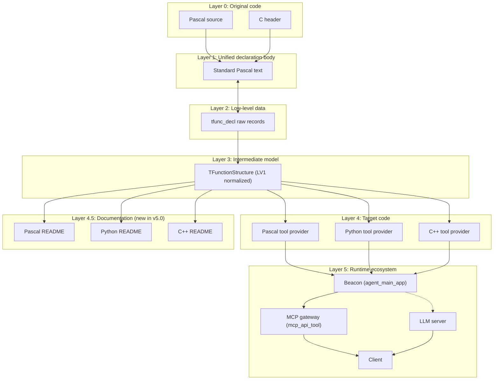

**Core relationship**: `Layer 4` and `Layer 4.5` **share the same `TPascal_Func_Model`**, so **code and documentation are inherently in sync**.

### 0.3 Component Responsibilities and Entry Points

| Component | Type | Entry | Output |
|-----------|------|-------|--------|
| `code_decl_to_mcp` | GUI | `code_decl_to_mcp.lpr` | 7 code/doc files |
| `pas_mcp_generator_tool` | Code generator | `GeneratePascalCode(Model)` | Pascal unit |
| `py_mcp_generator_tool` | Code generator | `GeneratePythonCode(Model)` | Python module |
| `cpp_mcp_generator_tool` | Code generator | `GenerateHPPCode` / `GenerateCPPCode` | `.hpp` + `.cpp` |
| **`pas_mcp_generator_tool`** | **Doc generator** | **`GeneratePascalReadme(Model)`** | **Pascal README** |
| **`py_mcp_generator_tool`** | **Doc generator** | **`GeneratePythonReadme(Model)`** | **Python README** |
| **`cpp_mcp_generator_tool`** | **Doc generator** | **`GenerateCPPReadme(Model)`** | **C++ README** |
| `mcp_api_tool.py` | MCP gateway | `main()` | MCP stdio/http/sse |
| `language_middleware.py` | Middleware | `LanguageMiddleware.get_instance()` | Singleton |
| `llm_service.py` | LLM server | `main()` | LingoFuse RPC |
| `llm_proxy.py` | LLM proxy | `main()` | LingoFuse RPC |
| `llm_proxy_tool.py` | LLM tool bridge | `main()` | LingoFuse RPC |
| `llm_test.py` | Test client | `main()` | CLI |
| `bridge.py` | HTTP bridge | `main()` | HTTP POST |
| `mcp_api_proxy.py` | stdio debug proxy | `main()` | CLI |

### 0.4 Two Tool Execution Paths

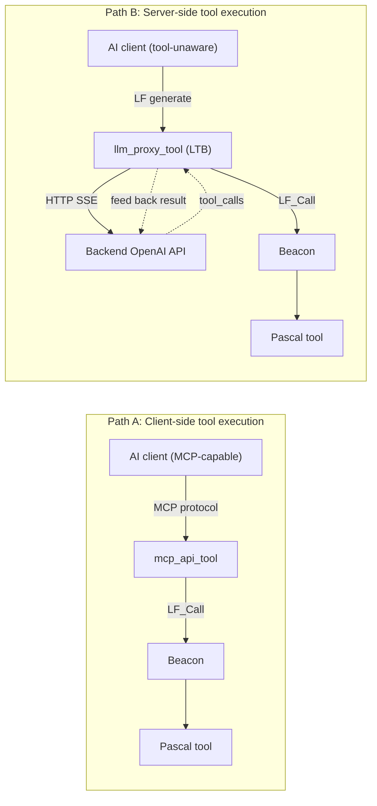

### 0.5 Three READMEs Quick Reference (new in v5.0)

| Language | README filename | Main dependent repositories | Test program form |
|----------|-----------------|-----------------------------|-------------------|
| Pascal | `<unit>_tool_provider_pascal.md` | ZCore + ZNetV2 + LingoFuse-pasAgent-v3 | Standalone `.lpr` (full source embedded in the README) |
| Python | `<unit>_tool_provider_python.md` | `py-lingofuse` (preferred) or v3's `lingofuse/` (fallback) | **The generated `.py` itself** (no extra script needed) |
| C++ | `<unit>_tool_provider_cpp.md` | `nlohmann/json` + `LingoFuse.h` (cppAgent **not yet released**) | `main.cpp` (full source + fallback `LingoFuse.h` embedded in the README) |

**What all three READMEs share**:
- Entirely in English
- Include Mermaid architecture diagrams + 6–7 step test-flow diagrams
- Generated from the same `TPascal_Func_Model` → inherently in sync with the code
- All contain: Overview / Architecture / Test Program / Build & Test / Tool Reference / JSON Schema / Troubleshooting / Portability / Resources

### 0.6 Three-Repository Dependency Model (new in v5.0)

A generated Pascal provider **cannot run on its own**; it requires three repositories to coexist on disk:

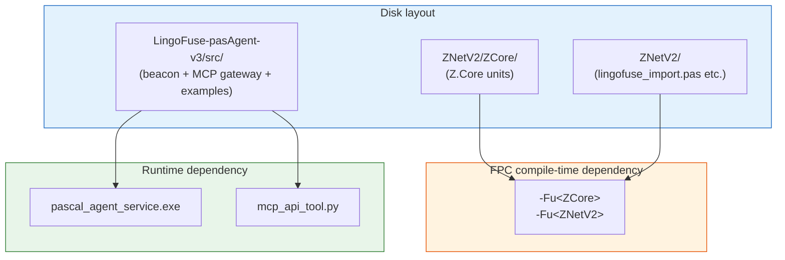

| Repository | Provides | Typical path |
|------------|----------|--------------|
| **ZCore** | `Z.Core` units (`TCompute` / `TCore_Thread` / `TAtomVar` / `TBigList`, etc.) | `<workspace>/ZNetV2/ZCore/` |
| **ZNetV2** | `lingofuse_import.pas` + `lingofuse_helper.pas` + `z_ipc_*.dll` | `<workspace>/ZNetV2/` |
| **LingoFuse-pasAgent-v3** | `pascal_agent_service.exe` + `mcp_api_tool.py` + `generate_agent_json.py` + `CreateHealthCheck/` examples | `<workspace>/LingoFuse-pasAgent-v3/src/` |

> The three repository URLs appear in generated READMEs as placeholders `<zcore-repo-url>` / `<znetv2-repo-url>` / `<v3-repo-url>`, **which must be replaced with real URLs before publishing**.

---

## Chapter 1  The code_decl_to_mcp Toolchain

### 1.1 Toolchain Data Model

#### 1.1.1 `TFunctionStructure` (a function in the LV1 model)

```pascal
TFunctionStructure = record
  Name: TP_String;              // Function name (original Pascal name)
  IsFunction: boolean;          // True=function, False=procedure
  Params: TParamArray;          // Parameter array
  ReturnType: TP_String;        // Normalized return type ('Int64' / 'Double' / 'string' / '')
  Comment: TP_String;           // Cleaned comment
  procedure Clear;
  function Clone: TFunctionStructure;
end;

TParamArray = array of TParamStructure;

TParamStructure = record
  Name: TP_String;              // Parameter name (original)
  Typ: TP_String;               // Original type string
  PascalType: TP_String;        // Normalized type ('Int64' / 'Double' / 'string')
  Description: TP_String;       // Description extracted from comments
  procedure Clear;
end;
```

**Contract**:
- `Name` **is not renamed in any way** — it is the source of the JSON key.
- `PascalType` has only three legal values: `'Int64'`, `'Double'`, `'string'`. Declarations with other values are dropped entirely during the `CollectValidFunctions` phase.
- `Description` is extracted by `ExtractParamDescriptions` from comments; it may be empty.
- `Comment` has already been cleaned by `CleanComment`.

#### 1.1.2 `TPascal_Func_Model` (the LV1 container)

```pascal
TPascal_Func_Model = class(TCore_Object_Intermediate)
public
  property Typ_Normalize_Func: TTyp_Normalize_Func read ... write ...;
  property UnitName: TP_String read ... write ...;
  property Funcs: TFunctionList read ...;
  property FuncCount: integer read ...;
  procedure LoadFromParser(Parser: tpascal_func_decl_tool; Report: TPascalStringList);
  procedure SaveToParser(Parser: tpascal_func_decl_tool);
  procedure LoadFromJson(const JsonStr: TP_String);
  function  SaveToJson: TP_String;
end;

TTyp_Normalize_Func = (tnf_Json, tnf_ABI);
```

**Contract**:
- Defaults to `tnf_Json` — the integer family is normalized to `'Int64'`, the float family to `'Double'`, the string family to `'string'`. **All generators (code + README) require this mode.**
- `LoadFromParser` skips declarations with `NestLevel <> 0` and `var` / `out` parameters.

### 1.2 GUI Workflow

#### 1.2.1 The 5-Tab State Machine

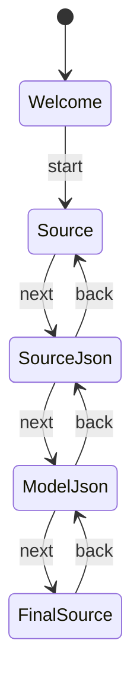

#### 1.2.2 Precise Button Behavior Table

| Button | Handler | Input | Output | Side effect |
|--------|---------|-------|--------|-------------|
| Format | `Formater_source_ButtonClick` | `source_edit.Text` | `source_edit.Text` | none |
| Next: source→json | `source_2_json_nex_ButtonClick` | `source_edit.Text` | `source2json_edit.Text` | switch to `SourceJsonTab` |
| Back: json→source | `Button3Click` | `source2json_edit.Text` | `source_edit.Text` | switch to `SourceTab` |
| Next: json→model | `Button4Click` | `source2json_edit.Text` | `model_json_edit.Text` | switch to `ModelJsonTab` |
| Back: model→json | `Button5Click` | `model_json_edit.Text` | `source2json_edit.Text` | switch to `SourceJsonTab` |
| **Next: generate code + README** | `Button6Click` | `model_json_edit.Text` | 4 TSynEdits + 3 READMEs + disk write | create directory, save all files |
| Empty unit | `empty_unit_ButtonClick` | `current_language` | `source_edit.Text` | none |
| Complex sample | `empty_unit_Button1Click` | `current_language` | `source_edit.Text` | none |
| Open spec | `Open_unit_readme_Button6Click` | `current_language` | opens an external document | none |
| Auto-detect language | `sel_lang_LabelClick` | `source_edit.Text` | `current_language` + ComboBox | triggers `Change` |
| Language switch | `Sel_Lang_ComboBoxChange` | `ItemIndex` | `current_language` + Highlighter | none |

#### 1.2.3 `Button6Click` Disk-Write Rules (**updated in v5.0, includes README**)

```pascal
app_dir := umlCombinePath(umlGetFilePath(ParamStr(0)), func_model.UnitName);
umlCreateDirectory(app_dir);
```

**Disk-write file list** (complete for v5.0):

| # | Filename | Type | Generator |
|---|----------|------|-----------|
| 1 | `source.pas` (Pascal) or `source.h` (C) | input copy | — |
| 2 | `source.json` | LV0 JSON | — |
| 3 | `source_model.json` | LV1 JSON | — |
| 4 | `<UnitName>_tool_provider_unit.pas` | Pascal code | `GeneratePascalCode` |
| 5 | `<UnitName>_tool_provider.py` | Python code | `GeneratePythonCode` |
| 6 | `<UnitName>_tool_provider.hpp` | C++ header | `GenerateHPPCode` |
| 7 | `<UnitName>_tool_provider.cpp` | C++ implementation | `GenerateCPPCode` |
| **8** | **`<UnitName>_tool_provider_pascal.md`** | **Pascal README** | **`GeneratePascalReadme`** |
| **9** | **`<UnitName>_tool_provider_python.md`** | **Python README** | **`GeneratePythonReadme`** |
| **10** | **`<UnitName>_tool_provider_cpp.md`** | **C++ README** | **`GenerateCPPReadme`** |

> ⚠️ **Known bug (left over from v4.0, not fixed in v5.0)**: The Python code is currently saved as `<UnitName>_tool_provider.pas`. Fix: change `SaveCode(func_model.UnitName + '_tool_provider.pas');` to `.py`. **The README generation is unaffected by this bug.**

### 1.3 Automatic Language Detection

`Auto_Select_Language` calls `DetectSourceLanguage(source_edit.Text)`:

- Parses once with `tsPascal` and once with `tsC`, scoring each with weighted evidence.
- **A tie returns `slUnknown`** (not `slPascal`).
- Empty input returns `slUnknown`.

**GUI mapping**: `slPascal → ItemIndex 1`, `slC → ItemIndex 2`, `slUnknown → ItemIndex 0`.

### 1.4 Global Timer

`SysTimer` fires `sysTimerTimer` every 1 ms:

```pascal
while LF___.LF_GetStatusCount() > 0 do
  DoStatus(LF___.LF_GetStatusEx());
Check_Soft_Thread_Synchronize;
LF___.LF_Sync;
```

**Purpose**: drain the LingoFuse status queue, drive soft synchronization, drive LF sync.

> ⚠️ **Performance hazard**: 1 ms = 1000 calls per second. Recommend changing to 10 ms.

### 1.5 Output File Panorama (new in v5.0)

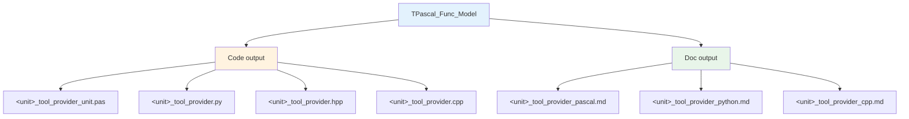

**Key design**: Code and documentation are generated **from the same Model** — updating one automatically updates the other. **There is no need to manually maintain README/code consistency.**

---

## Chapter 2  Code Generators

### 2.1 Generator Signatures and Contracts

```pascal
function GeneratePascalCode(Model: TPascal_Func_Model): TPascalStringList;
function GeneratePythonCode(Model: TPascal_Func_Model): TPascalStringList;
function GenerateHPPCode(Model: TPascal_Func_Model): TPascalStringList;
function GenerateCPPCode(Model: TPascal_Func_Model): TPascalStringList;
```

**Common contract**:
- Input must be a `TPascal_Func_Model` in `tnf_Json` mode.
- `Model = nil` or `Model.UnitName = ''` → returns `nil`.
- The returned `TPascalStringList` **must be released by the caller**.
- When there are no supported functions, an empty skeleton is returned.

**Type whitelist**:

```pascal
function IsSupportedType(const Typ: TP_String): boolean;
begin
  Result := Typ.Same('Int64', 'Double', 'string');
end;
```

**The three code generators must be strictly consistent**. Unsupported declarations are **dropped entirely**.

### 2.2 Pascal Generator

**Key helper functions**:

| Function | Responsibility | Note |
|----------|----------------|------|
| `MakeApiName` | Cleans to a Pascal identifier | ⚠️ Character replacement table is **incomplete** (see §12.7) |
| `MakeCallbackName` | `'Callback_' + MakeApiName` | Generator implementation |
| `MakeInternalCallName` | `'internal_call_' + MakeApiName` | Generator implementation |
| `PascalStrLit` | Pascal string literal | Delegates to `TTextParsing.Translate_Text_To_Pascal_Decl` |
| `GetFullDescription` | Comment extraction | ⚠️ Goes through `TPascalStringList.AsText` (see §2.6 and §12.11) |

**Key structure of the generated output**:

```
unit <UnitName>_tool_provider_unit;

interface
uses SysUtils, Classes, lingofuse_import;

var
  MY_APP_NAME: string = '<AppName>';
  IPC_ENDPOINT: string = 'ipc:agent';
  BEACON_APP: string = 'agent_main_app';
  REGISTER_API: string = 'register_agent';
  AGENT_LOG_API: string = 'agent_log';
  DEBUG_LOG: boolean = True;

function RegisterAPIs: TAppHnd___;
function RegisterTools: Boolean;
function Execute_And_Reg_all: Boolean;

implementation
// ret2str overloads, internal_call_* stubs, callbacks, RegisterTool, RegisterAPIs, Execute_And_Reg_all
end.
```

**Standard callback skeleton** (one per API):

```pascal
procedure Callback_<Name>_<ApiName>(_Trigger___: Pointer; _In___, _Out___: TDataHnd___); cdecl;
var
  jsonBytes: TBytes;
  jo: TZ_JsonObject;
  <param>: <Type>;
  ret: <ReturnType>;
  errMsg: string;
begin
  jo := TZ_JsonObject.Create;
  try
    jsonBytes := LF_ReadStringBytes(TDataHnd(_In___));
    if Length(jsonBytes) = 0 then begin ... Exit; end;
    if not jo.Parae(jsonBytes) then begin ... Exit; end;
    <param> := jo.I64['<param>'];    // or jo.F / jo.S
    ret := internal_call_<Name>_<ApiName>(<args>);
    jo.Clear;
    jo.I64['result'] := ret;         // or jo.F / jo.S
    LF_WriteStringBytes(TDataHnd(_Out___), jo.ToBytes);
  except
    on E: Exception do begin
      jo.Clear;
      jo.S['error'] := E.Message;
      LF_WriteStringBytes(TDataHnd(_Out___), jo.ToBytes);
    end;
  end;
  jo.Free;
end;
```

**Mapping of return type to `jo.X`**:

| ReturnType | Write | Read |
|------------|-------|------|
| `Int64` | `jo.I64['result']` | `jo.I64['result']` |
| `Double` | `jo.F['result']` | `jo.F['result']` |
| `string` | `jo.S['result']` | `jo.S['result']` |

**A procedure writes `jo.S['status'] := 'ok';`**.

### 2.3 Python Generator

**Key helper functions**:

| Function | Responsibility |
|----------|----------------|
| `PascalTypeToPythonType` | `Int64→int` / `Double→float` / `string→str` |
| `PascalTypeToJsonSchemaType` | `Int64→integer` / `Double→number` / `string→string` |
| `PascalTypeDefaultValue` | `Int64→0` / `Double→0.0` / `string→""` |
| `PyStrLit` | Python string literal (iterates `TP_Char`, preserves non-ASCII) |
| `MakePythonIdentifier` | Whitelist filter (**safer than the Pascal side**) |
| `UniqueApiName` | Ensures the tool name is unique |
| `GetFullDescription` | Scans `TP_String` character by character (**does not go through `SystemString`**) |

**Key structure of the generated output**:

```python
# -*- coding: utf-8 -*-
try:
    from lingofuse._lf_native import (...)
except ImportError as _imp_err:
    print(f"[FATAL] lingofuse package is not available: {_imp_err}", file=sys.stderr)
    sys.exit(1)

MY_APP_NAME = "<AppName>"
IPC_ENDPOINT = "ipc:agent"
BEACON_APP = "agent_main_app"
REGISTER_API = "register_agent"
AGENT_LOG_API = "agent_log"
DEBUG_LOG = True

def _write_string(hnd, s): ...
def _read_string_bytes(hnd) -> bytes: ...
def _ret2str(v) -> str: ...

def internal_call_<name>(a: int, b: str) -> int:
    return 0

def _send_log_async(msg: str): ...

@LFCallFunc
def callback_<name>(_Trigger, _In, _Out):
    ...

def RegisterTools() -> bool: ...
def RegisterAPIs() -> Optional[Any]: ...
def Execute_And_Reg_all() -> bool: ...

if __name__ == "__main__":
    ...
```

**Default value for parameter extraction**: `data.get('<name>') or <default>`.

### 2.4 C++ Generator

**Differences from Pascal/Python**:

| Difference | Note |
|------------|------|
| Outputs two files | `.hpp` (declaration) + `.cpp` (implementation) |
| Uses `nlohmann/json` | `#include "json.hpp"` |
| Callback macro | `LF_CDECL` (not `cdecl`) |
| Duplicate tool names | **Dropped** (MCP requires uniqueness) |
| Description truncation | `MAX_DESC_LEN = 200` |
| `DEBUG_LOG` default | `false` (Pascal/Python are `True`) |

**Generated output structure** (`.cpp` key parts):

```cpp
extern const char* MY_APP_NAME   = "<UnitName>";
extern const char* IPC_ENDPOINT  = "ipc:agent";
extern const char* BEACON_APP    = "agent_main_app";
extern const char* REGISTER_API  = "register_agent";
extern const char* AGENT_LOG_API = "agent_log";
extern const bool  DEBUG_LOG     = false;

static std::string read_string(TDataHnd hnd) { ... }
static void write_string(TDataHnd hnd, const std::string& s) { ... }
static json read_json(TDataHnd hnd) { ... }
static void write_json(TDataHnd hnd, const json& obj) { ... }
static void send_log_async(const std::string& msg) { ... }

static void LF_CDECL callback_<Name>(void* _Trigger, void* _In, void* _Out) { ... }

TAppHnd RegisterAPIs() { ... }
static bool RegisterOneTool(...) { ... }
bool RegisterTools() { ... }
bool Execute_And_Reg_all() { ... }
```

### 2.5 Symmetry of the Three-Language Generators

| Dimension | Pascal | Python | C++ |
|-----------|--------|--------|-----|
| Type whitelist | `Int64`/`Double`/`string` | same | same |
| JSON Schema mapping | same | same | same |
| Description extraction | via `TPascalStringList.AsText` | char-by-char scan of `TP_String` | via `CleanComment_Local` |
| Duplicate tool names | numeric suffix added | numeric suffix added | **dropped** |
| Description truncation | none | none | `MAX_DESC_LEN = 200` |
| Callback macro | `cdecl` | `@LFCallFunc` | `LF_CDECL` |

**Modifying any one requires checking the symmetry with the other two.**

### 2.6 FPC Compilation Constraint (new in v5.0)

**Iron rule**: **FPC under `{$mode delphi}` does not allow `var` declarations inside a procedure body.**

**Incorrect code** (raises `Illegal expression` + `Syntax error, ";" expected` on FPC 3.2.2):

```pascal
procedure DoSomething;
begin
  // ...
  begin
    var
      j: integer;
      tmp: TP_String;
    // ...
  end;
end;
```

**Correct approach**: all local variables **must** be declared in the procedure/function's `var` section.

```pascal
procedure DoSomething;
var
  j: integer;
  tmp: TP_String;
begin
  // ...
  for j := 0 to High(Items) do
    // ...
end;
```

**Impact scope**: **every procedure/function** in all three generator units.

**Historical lesson**: `cpp_mcp_generator_tool.pas` in v3.0 had an inline `var` in `GenerateHPPCode`, which caused an FPC compilation failure. Fixed in v4.0.

**Note**: `{$mode objfpc}` + `{$modeswitch advancedrecords}` allows methods to be defined **inside records**; but **inline `var` inside a procedure body** is **not allowed** in any mode (FPC 3.3+ may relax this, but mainstream versions do not).

---

## Chapter 3  README Generation System (new in v5.0)

### 3.0 Core Design Principles

1. **One model, one truth** — code and documentation are generated from the same `TPascal_Func_Model`; no manual synchronization is needed.
2. **All English** — all README content is English, avoiding Markdown rendering and cross-language charset issues.
3. **Copy-paste ready** — every README contains a complete, compilable/runnable test-program source; the user does not need to write any scaffolding.
4. **Language-specific + structurally unified** — the ten-section skeleton (Overview / Architecture / Test / Build & Test / Tool Reference / JSON Schema / Troubleshoot / Portability / Resources) is strictly unified; the content within each section is customized per language.
5. **Mermaid-first** — architecture diagrams, test-flow diagrams, and tool-registration sequence diagrams use Mermaid, compatible with GitHub/GitLab/VSCode/Obsidian.
6. **Recognizable placeholders** — unresolved repository URLs are written as literal placeholders of the form `<xxx-repo-url>`, with an explicit reminder to replace them.

### 3.1 Common Contract

```pascal
function GeneratePascalReadme(Model: TPascal_Func_Model): TPascalStringList;
function GeneratePythonReadme(Model: TPascal_Func_Model): TPascalStringList;
function GenerateCPPReadme(Model: TPascal_Func_Model): TPascalStringList;
```

**Contract**:
- Input must be a `TPascal_Func_Model` in `tnf_Json` mode.
- When `Model = nil` or `Model.UnitName = ''`, **returns non-nil degraded text** (a single top line `# README generation skipped` + reason), to avoid producing an empty file that confuses the user.
- The returned `TPascalStringList` **must be released by the caller**.
- When there are no supported functions, **no error is raised**; the README's Tool Reference section will contain an explicit **"0 APIs exposed"** warning listing possible reasons.
- **Does not depend** on the network, filesystem, or external processes.

### 3.2 The Ten-Section README Skeleton

| # | Section | Content | Language-specific |
|---|---------|---------|-------------------|
| 1 | Overview | Dependency table + file list | ✅ depends on language |
| 2 | Runtime Architecture | Mermaid flowchart | ❌ unified |
| 3 | Test Program | Complete runnable test program | ✅ language-specific |
| 4 | Build & Test Procedure | 6–7 step guide + Mermaid flowchart | ✅ steps slightly differ |
| 5 | Tool Reference | Table + per-API subsection + JSON examples | ❌ unified |
| 6 | JSON Schema Specification | Type whitelist | ❌ unified (but the C++ table has an extra column) |
| 7 | Debugging & Troubleshooting | Global variables + FAQ | ✅ language-specific |
| 8 | Portability Notes | Language environment portability | ✅ language-specific |
| 9 | Reference Resources | Resource links | ✅ language-specific |
| 10 | (Header) | Title + auto-generated declaration + source/output/API counts | ❌ unified |

### 3.3 Pascal README Details

**Output filename**: `<unit>_tool_provider_pascal.md`

**Dependency table** (strictly listing the three repositories):

| Dependency | Purpose | How to get it |
|------------|---------|---------------|
| LingoFuse-pasAgent-v3 | Complete runtime | `git clone <v3-repo-url>` |
| `lingofuse_import.pas` | C ABI import | `<v3>/src/` |
| `lingofuse_helper.pas` | Optional RAII | `<v3>/src/` |
| `pascal_agent_service.exe` | Beacon server | Compiled from `<v3>/src/pascal_agent_service.lpr` |
| **ZCore repository** | `Z.Core` units | `git clone <zcore-repo-url>` |
| **ZNetV2 repository** | Networking / `z_ipc_*.dll` | `git clone <znetv2-repo-url>` |

**§3 Test Program** provides a **complete `.lpr`** (key structure):

```pascal
program <AppName>_provider;

{$mode objfpc}{$H+}
{$CODEPAGE UTF8}

uses
  {$IFDEF UNIX}cthreads,{$ENDIF}
  {$IFDEF MSWINDOWS}Windows,{$ENDIF}
  SysUtils, Classes,
  Z.Core,
  <UnitName>_tool_provider_unit;

begin
  WriteLn('=== <AppName> Tool Provider ===');
  WriteLn('Connecting to ipc:agent ...');

  if not Execute_And_Reg_all then
  begin
    WriteLn('');
    WriteLn('[FATAL] Provider startup failed.');
    WriteLn('Checklist:');
    WriteLn('  1. Is pascal_agent_service.exe running?');
    WriteLn('  2. Is the endpoint ipc:agent reachable?');
    WriteLn('  3. Check DEBUG_LOG output above for details.');
    Halt(1);
  end;

  WriteLn('');
  WriteLn('[OK] Provider is ready. All tools registered.');
  WriteLn('Press Enter to shut down.');
  ReadLn;

  LF_ExitMainThread;
  LF_Shutdown;
  WriteLn('[OK] Shutdown complete.');
end.
```

**Key points**:
- `{$mode objfpc}{$H+}` — the main mode for a standalone program.
- `{$CODEPAGE UTF8}` — ensures Chinese source strings are correct.
- `cthreads` must be first on Unix — so the RTS links the multithreaded C library.
- `Z.Core` must be in `uses` — the provider internally uses `TCompute` / `TCore_Thread`.
- `LF_ExitMainThread` + `LF_Shutdown` — release all LingoFuse resources.

**§4 Build & Test compile command**:

```bash
fpc -Fu<workspace>/ZNetV2/ZCore -Fu<workspace>/ZNetV2 <AppName>_provider.lpr
```

Or open the `.lpi` in Lazarus and press F9.

**§8 Delphi Portability** — `.lpr` → `.dpr` conversion steps:
1. Change the extension.
2. Replace `{$mode objfpc}{$H+}` with the Delphi project header (usually no mode directive is needed).
3. Remove `cthreads` (Delphi's RTL handles threading automatically).
4. Set the unit search path.
5. **The generated `<UnitName>_tool_provider_unit.pas` itself already uses `{$DEFINE FPC_DELPHI_MODE}` and is Delphi-compatible as-is.**

### 3.4 Python README Details

**Output filename**: `<unit>_tool_provider_python.md`

**Package source strategy** (**two explicit paths**):

| # | Source | When to use | How to get it |
|---|--------|-------------|---------------|
| **1** | Independent `py-lingofuse` repository or PyPI package | Preferred when available | `pip install py-lingofuse` or `git clone <py-lingofuse-repo-url>` |
| **2** | v3's built-in `<v3>/src/lingofuse/` | Fallback | Clone from `<v3-repo-url>` then set `PYTHONPATH` |

**§3 Test Provider Script** key point: **the generated `.py` is itself runnable** — it includes its own `if __name__ == "__main__":` block. The README explicitly tells the user **no extra test script is needed**.

**§4 Build & Test in 7 steps** (one more step than Pascal/C++: "verify import"):

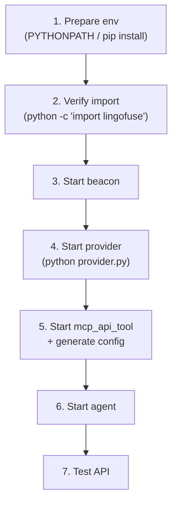

**Step 2 command** (key verification):

```bash
python -c "import lingofuse._lf_native as m; print('OK', m.__file__)"
```

**Environment variable difference between Path A / Path B**:

- Path A (`pip install py-lingofuse`): no environment variable needed.
- Path B (v3 fallback):
  - **Windows (cmd)**: `set PYTHONPATH=D:\LingoFuse-pasAgent-v3\src`
  - **Windows (PowerShell)**: `$env:PYTHONPATH = "D:\LingoFuse-pasAgent-v3\src"`
  - **Linux/macOS**: `export PYTHONPATH=/path/to/LingoFuse-pasAgent-v3/src`

**§8 Python Portability**: venv / PyInstaller / Nuitka integration notes.

### 3.5 C++ README Details

**Output filename**: `<unit>_tool_provider_cpp.md`

**Key status**: **the cppAgent repository has not been released yet**. The README states this explicitly and offers **three alternative paths to obtain `LingoFuse.h`**:

| Source | Note |
|--------|------|
| LingoFuse runtime distribution | `LingoFuse.h` is usually next to `LingoFuse64.dll` |
| v3's `lingofuse_import.pas` | Manually translate to C++ |
| **§3.1 minimal fallback header** | README **embeds** a directly usable minimal `LingoFuse.h` |

**§3 Test Program** provides a **complete `main.cpp`** (key structure):

```cpp
#include "<UnitName>_tool_provider.hpp"
#include <cstdio>
#include <cstdlib>

extern "C" void LF_ExitMainThread();
extern "C" void LF_Shutdown();

int main()
{
    std::printf("=== %s Tool Provider ===\n", MY_APP_NAME);
    std::printf("Connecting to %s ...\n", IPC_ENDPOINT);

    if (!Execute_And_Reg_all())
    {
        std::fprintf(stderr, "\n[FATAL] Provider startup failed.\n");
        return 1;
    }

    std::printf("\n[OK] Provider is ready. All tools registered.\n");
    std::printf("Press Enter to shut down.\n");
    std::getchar();

    LF_ExitMainThread();
    LF_Shutdown();
    return 0;
}
```

**§3.1 minimal `LingoFuse.h`** (**key fallback**): the README **embeds** a ~50-line header containing all the `LF_*` function declarations used and the `LF_CDECL` macro. Users can copy it directly and replace it with the official version once cppAgent is released.

**§4 Build in three command variants**:

```bash
# Linux / macOS
g++ -std=c++17 -O2 -I. main.cpp <unit>_tool_provider.cpp \
    -L. -lLingoFuse -Wl,-rpath,. -o provider

# Windows (MSVC)
cl /std:c++17 /EHsc /I. main.cpp <unit>_tool_provider.cpp \
   /link /LIBPATH:. LingoFuse.lib /OUT:provider.exe

# Windows (MinGW-w64)
g++ -std=c++17 -O2 -I. main.cpp <unit>_tool_provider.cpp \
    -L. -lLingoFuse -o provider.exe
```

**§8 C++ Portability**:
- Supported compiler version table (MSVC 16.8+, g++ 7.0+, clang++ 5.0+)
- Windows `__cdecl` calling convention
- Static vs dynamic linking
- CMake template (to be enabled once cppAgent is released)

### 3.6 Symmetry and Differences Among the Three READMEs

**Fully identical**:
- The ten-section skeleton
- §2 Runtime Architecture Mermaid diagram
- §5 Tool Reference table and JSON example structure
- §6 JSON Schema whitelist (C++ has one extra column)
- §7.1 global configuration variable table structure

**Language-specific**:

| Section | Pascal | Python | C++ |
|---------|--------|--------|-----|
| §1 Dependencies | ZCore + ZNetV2 + v3 | py-lingofuse or v3 | json.hpp + LingoFuse.h + lib |
| §3 Test program | `.lpr` full source | `.py` self-contained `__main__` | `main.cpp` + fallback header |
| §4 Step count | 6 | **7** (extra "verify import") | 7 |
| §4 Build | `fpc -Fu...` | `pip` / `PYTHONPATH` | g++ / cl / MinGW |
| §8 Portability | `.lpr` → `.dpr` | venv / PyInstaller | compiler matrix / CMake |

**§5 Tool Reference format** (identical across all three languages):

```markdown
### 5.N `<api_name>`

- Original Pascal function: `<original name>`
- Exposed API name: `<api_name>`
- Kind: `function` (returns `<ReturnType>`) or `procedure`
- Description: `<description or (no description)>`

**Parameters**

| Name | Pascal type | [language] type | JSON type | Description |
|------|-------------|-----------------|-----------|-------------|
| `a` | `Int64` | ... | `integer` | ... |

**Input JSON example**

```json
{ "a": 0, "b": "" }
```

**Output JSON example**

```json
{ "result": 0 }    (function) or { "status": "ok" } (procedure)
```
```

**§6 JSON Schema mapping** (identical across all three, but C++ has one extra column):

| Pascal normalized | JSON Schema | Pascal type | Python type | C++ type |
|-------------------|-------------|-------------|-------------|----------|
| `int64` | `integer` | `Int64` | `int` | `std::int64_t` |
| `double` | `number` | `Double` | `float` | `double` |
| `string` | `string` | `string` | `str` | `std::string` |

### 3.7 Usage (from generation to disk-write)

#### 3.7.1 Calling in the GUI (after v5.0 integration)

In `Button6Click`, **after each code generator call, append the corresponding README generation**:

```pascal
// Existing (code):
l := GeneratePascalCode(func_model);
if l <> nil then
begin
  SaveCode(func_model.UnitName + '_tool_provider_unit.pas');
  l.AssignTo(final_pascal_source_Edit.Lines);
  disposeObjectAndNil(l);
end;

// Appended (README):
l := GeneratePascalReadme(func_model);
if l <> nil then
begin
  SaveCode(func_model.UnitName + '_tool_provider_pascal.md');
  disposeObjectAndNil(l);
end;

// Python / C++ same pattern
```

#### 3.7.2 Calling in a standalone tool

```pascal
var
  Model: TPascal_Func_Model;
  Code, Readme: TPascalStringList;
begin
  Model := TPascal_Func_Model.Create;
  try
    Model.LoadFromParser(Parser, nil);

    Code := GeneratePascalCode(Model);
    try
      if Code <> nil then
        Code.SaveToFile('MyUnit_tool_provider_unit.pas');
    finally
      Code.Free;
    end;

    Readme := GeneratePascalReadme(Model);
    try
      if Readme <> nil then
        Readme.SaveToFile('MyUnit_tool_provider_pascal.md');
    finally
      Readme.Free;
    end;
  finally
    Model.Free;
  end;
end;
```

#### 3.7.3 Edge cases

- **`Model = nil`** → returns non-nil degraded text (`# README generation skipped` + reason).
- **`Model.UnitName = ''`** → same as above.
- **`Length(ValidFuncs) = 0`** → returns the full README, but §5 explicitly warns of "0 APIs" and lists possible reasons.
- **Unrecognized language type** → that function is filtered out; the README **does not include** that API.

---

## Chapter 4  LLM Server

### 4.1 Capability Matrix of the Three Servers

| API | `llm_service` | `llm_proxy` | `llm_proxy_tool` |
|-----|:-------------:|:-----------:|:----------------:|
| `generate` | 1 | 1 | 1 |
| `create_session` | 1 | 1 | 1 |
| `close_session` | 1 | 1 | 1 |
| `cancel_session` | 1 | 1 | 1 |
| `list_sessions` | 1 | 1 | 1 |
| `set_system_message` | **1** | **0** | **0** |
| `health` | 1 | 1 | 1 |
| `llm_stream` | 1 | 1 | 1 |
| `attachments` | 1 | 1 | 1 |
| `vision` | **0** | **0** | **0** |
| `tools` / `tool_calls` / `tool_results` | — | — | **1** |
| `server_kind` | `service` | `proxy` | `proxy` |

**Precise meaning of `vision=0`**: the server **itself performs no visual processing**; it does not mean the whole pipeline lacks multimodal support. Whether an image can be understood is determined by the **backend**.

### 4.2 `llm_service.py`

**Complete API**:

| API name | Type | Input | Output |
|----------|------|-------|--------|
| `generate` | Call | `{session_id?, content, prompt?, client_name?, options?, attachments?}` | `{code, session_id, task_id, mode}` |
| `create_session` | Call | `{client_name, system_message?}` | `{code, session_id, client_name}` |
| `close_session` | Call | `{session_id, cancel_running?}` | `{code, status}` |
| `cancel_session` | Call | `{session_id}` | `{code, status}` |
| `list_sessions` | Call | `{client_name?}` | `{code, sessions, count}` |
| `set_system_message` | Call | `{content}` | `{code, status}` |
| `get_api_capabilities` | Call | `{}` | `{code, server_kind, capabilities}` |
| `health` | Call | `{}` | `{code, status, ...}` |
| `llm_stream` | Notify | `{type, session_id, text/message/reason}` | none |

**`options` whitelist**: `max_tokens` (int, [1, 2^20]), `temperature` (float, [0, 2]), `top_p` ([0, 1]), `top_k` ([0, 1000]), `repeat_penalty` ([0, 4]), `thinking` (bool), `ephemeral` (bool). **Other fields are silently dropped.**

**Attachment limits**: single text ≤ 256 KB; total text ≤ 512 KB; single image base64 ≤ 8 MB; total images ≤ 16 MB. **Images are accepted only when `--vision` is enabled** (`llm_service` always rejects them).

**Dual condition for session reclamation** (only in `llm_service`):

```
reclaim ⇔ (status = idle) AND (idle time > session_timeout) AND (client app offline)
```

**`check_app` cache delay is about 3 seconds** — a client that just went offline may be incorrectly considered online.

**Thinking priority**:
1. Per-request `options.thinking`
2. Command line `--thinking` / `--no-thinking`
3. Environment variable `LLM_THINKING`
4. Module constant `DEFAULT_THINKING` (= False)

**Key parameters**: see Appendix A.2.

### 4.3 `llm_proxy.py`

**Differences from `llm_service`**:

| Dimension | `llm_service` | `llm_proxy` |
|-----------|---------------|-------------|
| Model loading | Local llama.cpp | none |
| Inference thread | Single serial worker | no inference |
| Context management | Server holds the KV cache | Rebuilds messages every round |
| `set_system_message` | ✅ | ❌ explicitly rejected |
| Session reclamation | dual condition | single condition (timeout only) |
| Default `session_timeout` | 600 | 1800 |

**`set_system_message` rejection response**:

```json
{
  "code": -1,
  "status": "unsupported",
  "error": "set_system_message is not supported by llm_proxy.\n..."
}
```

**Replacement approach**: use the `system_message` field of `create_session`.

**Unique parameters**: see Appendix A.3.

### 4.4 `llm_proxy_tool.py` (LTB)

**Positioning**: `llm_proxy` + **server-side tool execution**.

**Precise state machine of the multi-round `tool_calls` loop**:

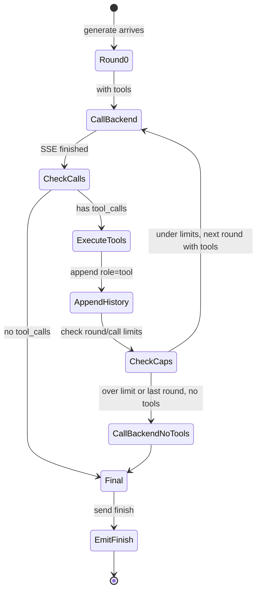

**Key decisions**:
- `is_final_round = force_final_round OR (round_idx == max_tool_rounds - 1)`
- `force_final_round` is set to True when `total_tool_calls >= max_total_tool_calls`.
- **The final round does not carry `tools`**, forcing the model to produce text.

**Tool-result truncation**:
1. Single result > `max_tool_result_chars` → truncated + `...(truncated)`.
2. Total characters > `max_total_tool_result_chars` → truncated + `...(tool-result budget exhausted)`.

**Multimodality in the tool chain**:
- **First round**: sends the full multimodal content (including `image_url`).
- **Subsequent rounds**: images in history are replaced with short placeholders.

**Pre-connect middleware ordering (critical)**: LTB must call `_ensure_tools_ready()` before `Server.start()`. Reason: `LF_PrepareDone()` returns 1 only on the first call in a process.

**Unique parameters**: see Appendix A.4.

---

## Chapter 5  MCP Gateway

### 5.1 `mcp_api_tool.py`

**Complete API**:

| API name | Type | Input | Output |
|----------|------|-------|--------|
| `agent_main` | Call | `{}` | `{tools: [...]}` |
| `agent_log` | Call | `{message}` | `{status: "ok"}` |
| `register_agent` | Call | `{name, description, target_app, target_api, parameters}` | `{status: "ok"}` |

**Precise structure of the tool registration JSON**:

```json
// agent_main returns
{
  "tools": [
    {
      "name": "add",
      "description": "Add two integers: a + b",
      "target_app": "my_calculator",
      "target_api": "add",
      "parameters": {
        "type": "object",
        "properties": {
          "a": {"type": "integer", "description": "First operand"},
          "b": {"type": "integer", "description": "Second operand"}
        },
        "required": ["a", "b"]
      }
    }
  ]
}
```

**Transport modes**:
- `stdio`: started automatically by the client. **Runs in the main process** (to avoid the Windows multiprocessing spawn problem).
- `http`: Streamable HTTP (recommended).
- `sse`: deprecated.

**Console suppression in stdio mode**:

```python
LF_SetOption(b"ConsoleOutput", b"False")
LF_SetOption(b"Quiet", b"True")
```

**Reason**: LingoFuse's C layer emits diagnostic output, which pollutes the MCP stdio channel.

**Signal handling**:

```python
def signal_handler(sig, frame):
    raise KeyboardInterrupt()   # not sys.exit(0)
```

**Reason**: `sys.exit(0)` raises `SystemExit`, which is not caught by `except KeyboardInterrupt`, causing the http/sse child process to become an orphan.

**Key parameters**: see Appendix A.5.

### 5.2 `mcp_api_proxy.py`

**Positioning**: a transparent stdio forwarder for debugging the MCP handshake. **Byte-level forwarding, no JSON processing.**

**Data flow**:

| Channel | Direction | Filter |
|---------|-----------|--------|
| `LM->Server` | stdin → child.stdin | none |
| `Server->LM` | child.stdout → stdout | **JSON-RPC line filter** (only forwards lines starting with `{`) |
| `Server-ERR` | child.stderr → stderr | none |

**Key implementation details**:
- **`bufsize=0` is a trap**: it makes stdin non-blocking, and FastMCP 4.x will immediately EOF.
- **`read1()` instead of `read()`**: returns as soon as any data is available.
- **Do not install a top-level `SIGINT` handler**: let `KeyboardInterrupt` propagate to `main()`.

---

## Chapter 6  Middleware and Bridging

### 6.1 `language_middleware.py`

**Singleton + lazy connection**: does not connect in the constructor; connects on first `get_tools()` / `call_tool()` / `log()`.

**Complete API**:

| Method | Purpose |
|--------|---------|
| `get_instance(...)` | Get the singleton (optionally updating the configuration) |
| `get_tools() -> List[Dict]` | Tool list |
| `call_tool(tool_name, arguments) -> Any` | Call a tool |
| `log(message) -> Optional[Dict]` | Send a log |
| `is_connected() -> bool` | Whether it is connected |
| `reconnect()` | Force a reconnect |
| `shutdown()` | Explicit shutdown |

**Lifecycle iron rule**: `LF_ExitMainThread` → `LF_FreeApp` → `LF_Shutdown`.

**`_disconnect()` does not call `LF_Shutdown()`** — the App handle must remain valid across disconnect/reconnect cycles.

**Field name of the `reg_tool` callback**: `name` (**not** `tool_name`) — aligned with `do_register_agent` on the Pascal side.

### 6.2 `bridge.py`

**Request format**: `POST /<app>/<api>` (or `POST /<api>`, using the default app).

**Response format**:

| Case | HTTP | Body |
|------|------|------|
| Success | 200 | Returns the backend bytes as-is |
| Call failure | 200 | `{"code": -1, "error": "..."}` |
| Request format error | 400 | `{"code": -2, "error": "..."}` |
| API precheck failure | 200 | `{"code": -3, "error": "..."}` |

**JSON normalization**: bidirectional (request + response), enabled by default, **idempotent**. Handles: UTF-8 BOM, trailing NUL, trailing comma, non-UTF-8 encoding (GBK / Latin-1). **Binary-safe**: payloads that cannot be parsed as JSON are **forwarded as-is**.

**Key parameters**: see Appendix A.6.

---

## Chapter 7  Shared Modules

### 7.1 `llm_common.attachments`

**Limit constants**:

| Constant | Value |
|----------|-------|
| `MAX_TEXT_BYTES_PER_FILE` | 256 * 1024 |
| `MAX_TEXT_BYTES_TOTAL` | 512 * 1024 |
| `MAX_IMAGE_B64_PER_FILE` | 8 * 1024 * 1024 |
| `MAX_IMAGE_B64_TOTAL` | 16 * 1024 * 1024 |
| `MAX_ATTACHMENT_NAME_LEN` | 256 |
| `ALLOWED_IMAGE_MIMES` | `{image/png, image/jpeg, image/jpg, image/webp}` |

**Return value of `build_user_content`**:
- No images: a plain string.
- Has images: `[{"type":"text",...}, {"type":"image_url",...}]`.
- **Image-only with no text**: `[{"type":"image_url",...}]` (no empty text part).

### 7.2 `llm_common.capabilities`

```python
SERVER_KIND_SERVICE = "service"
SERVER_KIND_PROXY = "proxy"

COMMON_CAPABILITY_KEYS = (
    "generate", "create_session", "close_session", "cancel_session",
    "list_sessions", "health", "llm_stream",
)
```

### 7.3 `llm_common.option_sanitizer`

```python
DROP = object()

COMMON_SCALAR_SPECS = (
    ("max_tokens",     int,   1,   1 << 20),
    ("temperature",    float, 0.0, 2.0),
    ("top_p",          float, 0.0, 1.0),
    ("top_k",          int,   0,   1000),
    ("repeat_penalty", float, 0.0, 4.0),
)
```

**Drop rules**: `None` → drop; `bool` → **explicitly dropped**; type-conversion failure → drop; out-of-range → clamp.

### 7.4 `llm_common.sse_client`

**Forwarding whitelist**:
```python
_FORWARDED_SCALAR_KEYS = ("max_tokens", "temperature", "top_p", "top_k", "repeat_penalty")
_FORWARDED_PASSTHROUGH_KEYS = ("tools", "tool_choice", "response_format")
```

**Key implementation details**: uses `http.client` (not `requests`); `Accept-Encoding: identity`; `TCP_NODELAY`; `skip_accept_encoding=True`.

### 7.5 `lingofuse.lf_io`

**Key functions**:

| Function | Purpose |
|----------|---------|
| `dumps_json(obj) -> str` | `json.dumps(obj, ensure_ascii=False, default=str)` |
| `write_string(hnd, value)` | UTF-8 + NUL |
| `read_string(hnd) -> str` | Read until NUL or end |
| `write_json(hnd, obj)` | JSON + NUL |
| `read_json(hnd) -> Any` | Strict JSON read |
| `read_json_or_bytes(hnd) -> Any` | Lenient read |
| `cstr(value) -> bytes` | NUL-terminated UTF-8 bytes |

**Wire format**: `<UTF-8 text> <NUL>`.

**Fully compatible with the Pascal side**: `LF_WriteString('{"a":1}')` → `7B 22 61 22 3A 31 7D 00`; `lf_io.write_json(hnd, {"a": 1})` → same bytes.

---

## Chapter 8  Wire Format and Protocol

### 8.1 LV1 Model JSON Structure

```json
{
  "UnitName": "MyUnit",
  "Functions": [
    {
      "Name": "Add",
      "IsFunction": true,
      "Comment": "Adds two numbers.",
      "ReturnType": "int64",
      "Params": [
        {"Name": "a", "Typ": "Integer", "PascalType": "int64", "Description": "First operand"}
      ]
    }
  ]
}
```

### 8.2 LV0 Model JSON Structure

```json
{
  "UnitName": "MyUnit",
  "ParseSuccess": true,
  "UsesList": ["SysUtils", "Classes"],
  "FuncList": [
    {
      "Body": "function Add(a: Integer; b: Integer): Integer;",
      "IsProc": true,
      "Name": "Add",
      "IsFunction": true,
      "ParamDecl": "(a: Integer; b: Integer)",
      "param_arry": [
        {"mod": "", "name": "a", "typ": "Integer", "value": "", "array": ""}
      ],
      "ResultDecl": "Integer",
      "Comment": "{ Adds two numbers. }",
      "NestLevel": 0
    }
  ]
}
```

### 8.3 Streaming Message Protocol

| Type | Fields | Meaning |
|------|--------|---------|
| `chunk` | `session_id`, `text` | Main body stream |
| `think` | `session_id`, `text` | Thinking stream |
| `finish` | `session_id`, `reason` | Generation finished |
| `error` | `session_id`, `message` | Server error |
| `closed` | `session_id`, `reason` | Session closed |

**`reason` enum**: `stop` / `error` / `cancelled` / `timeout` / `client` / `shutdown` / `ephemeral` / `timeout+offline`.

### 8.4 Capability Matrix Response

```json
{
  "code": 0,
  "server_kind": "service|proxy",
  "capabilities": {
    "generate": 1, "create_session": 1, "close_session": 1,
    "cancel_session": 1, "list_sessions": 1, "set_system_message": 0,
    "health": 1, "llm_stream": 1, "attachments": 1, "vision": 0
  }
}
```

### 8.5 Byte Order

**Uniformly little-endian**. Modern platforms (x86 / ARM / x86_64 / aarch64) are all little-endian, so this is usually not an issue.

---

## Chapter 9  Configuration Parameter Reference

**Priority**: command line > environment variable > built-in default.

### 9.1 Generator Constant

`GenerateCode_LogEnabled` (bool, default `False`).

### 9.2 LLM Server / MCP Gateway / Bridge

See Appendix A.

---

## Chapter 10  Lifecycle and State Machine

### 10.1 The One-Shot Constraint of `LF_PrepareDone`

**Iron rule**: `LF_PrepareDone()` **returns 1 only on the first call within a process**.

**Impact**:
- Startup order must be arranged so that critical connections complete before the first call.
- LTB must pre-connect to the middleware before `Server.start()`.
- Test code must call `LF_Shutdown()` in a `finally` block.

### 10.2 Automatic Reclamation of Data Handles

- `TLF_DataPool.Progress` scans every 5 seconds.
- Releases handles idle for more than **5 minutes**.
- **Timeliness is not guaranteed**. **Do not rely on it** — always call `LF_FreeData` explicitly.

### 10.3 Sequenced Notification Threads

- Each `(App, API)` pair owns a dedicated thread.
- **Automatically terminates after 5 minutes of idleness**.

### 10.4 Two-Phase Destruction of `LF_FreeApp`

1. Iterate all clients; unbind the App.
2. `LF_Notify_Sequence_Thread_Pool.Kill_App(app)`.
3. `app.FakeFree` (removes the timer only).
4. **The object is not destroyed immediately** — it is cleaned up during `LF_Shutdown`.

### 10.5 Session Lifecycle

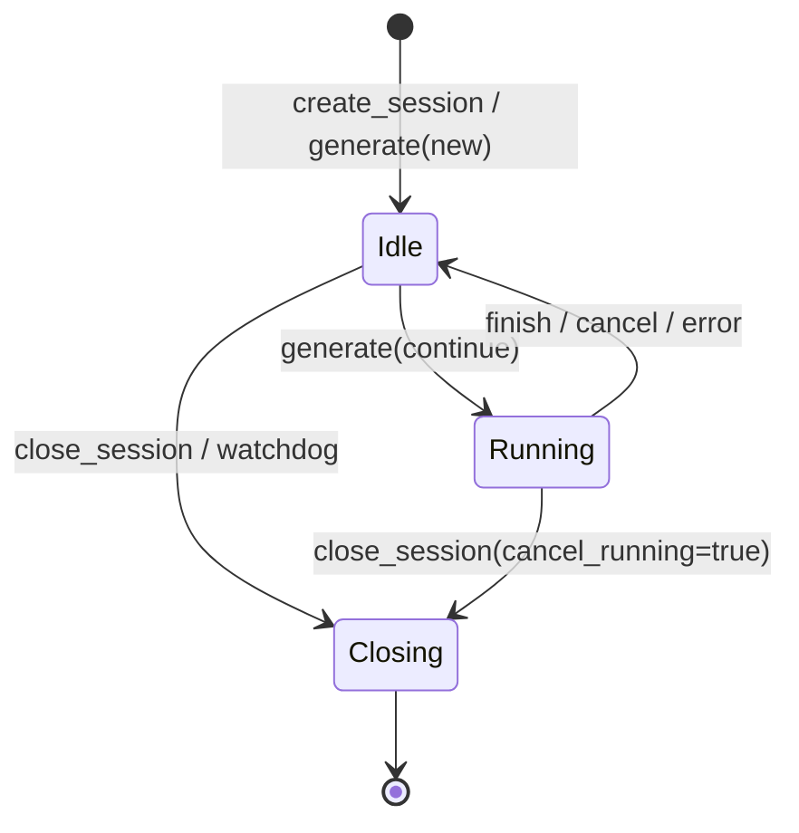

---

## Chapter 11  Threading Model

### 11.1 Callback Execution Threads

| Callback type | Execution thread | Constraint |
|---------------|------------------|------------|
| LingoFuse Call/Notify callback | Background C4 thread pool | Do not block; do not call LF_Call; do not touch the UI |
| Network event callback | Background TCompute worker thread | Do not block; `addr_` is invalid after the callback returns |
| `RegisterSyncCall_M` | Main thread (via `LF_Sync`) | The main loop must call `LF_Sync` periodically |
| `llm_stream` Notify callback | Client LingoFuse main thread | Requires `FActiveSessionId` filtering |

### 11.2 Thread-Safety Matrix

| Component | Thread-safe |
|-----------|-------------|
| `TBigList<T>` (non-critical) | ❌ external lock required |
| `TCritical_BigList<T>` | ✅ internally locked (except iterators) |
| `TBig_Hash_Pair_Pool` (non-critical) | ❌ external lock required |
| `TCritical_Big_Hash_Pair_Pool` | ✅ internally locked (`For_*` holds the lock throughout) |
| `TCompute.Run*` / `Post*` | ✅ |
| `LF_Call` / `LF_Notify` | ✅ callable from any thread |
| Concurrent writes to the same `TDataHnd` | ❌ external synchronization required |
| `TAtomVar<T>` | ✅ internal TCritical |
| `AtomInc` / `AtomDec` | ✅ hardware atomic |

---

## Chapter 12  Anti-Patterns

### 12.1 Parameter Name Mismatch

**Wrong** (a hand-edited Python callback):
```python
a = data.get('x') or 0    # ❌ the source parameter name is 'a'
b = data.get('y') or 0
```

**Consequence**: `data.get('x')` always returns None → 0.

**Correct**: `a = data.get('a') or 0`; `b = data.get('b') or 0`.

### 12.2 Wrong Return Field Name

**Wrong**: `jo.I64['value'] := ret;` — the client reads `result` and gets 0.

**Correct**: `jo.I64['result'] := ret;`.

### 12.3 Callback Missing `cdecl`

**Wrong**: `procedure Callback_Add_Add(...);` (no `cdecl`).

**Consequence**: stack misalignment, random crashes.

**Correct**: `procedure Callback_Add_Add(...); cdecl;`.

### 12.4 `ensure_ascii=True`

**Wrong**: `json.dumps({"result": ret})`.

**Consequence**: Chinese becomes `\u4e2d\u6587`, inflating token consumption by 5–6×.

**Correct**: `json.dumps({"result": ret}, ensure_ascii=False)`.

### 12.5 Calling `LF_Call` Inside a Callback

**Wrong**: directly calling `LF_CallEx(...)` inside a callback. **Consequence**: C4 thread-pool deadlock.

**Correct**: use `TCompute.RunC_NP(...)` to make it asynchronous.

### 12.6 Releasing `_In` / `_Out` Inside a Callback

**Wrong**: `LF_FreeData(_In);`. **Consequence**: use-after-free.

**Correct**: **never release them**. They are managed by the library.

### 12.7 `MakeApiName` Producing an Invalid Identifier

**Source name**: `Foo-Bar`. Current `MakeApiName` result: `Foo-Bar` (the `-` is not replaced).

**Consequence**: the generated `internal_call_Foo-Bar_Foo-Bar` is an **invalid identifier**, causing a compilation failure.

**Correct**: use whitelist filtering (see §15.3).

### 12.8 `LF_PrepareDone` Called Multiple Times

**Wrong** (LTB):
```python
def start(self):
    self.server.start(CONFIG.endpoint)   # calls PrepareDone internally
    self._ensure_tools_ready()           # ❌ permanently fails
```

**Correct**: `_ensure_tools_ready()` first.

### 12.9 Wrong Cleanup Order in `language_middleware`

**Wrong**: `LF_Shutdown()` before `LF_FreeApp()`. **Correct**: `LF_ExitMainThread` → `LF_FreeApp` → `LF_Shutdown`.

### 12.10 `llm_proxy` Sending Images to `llm_service`

**Consequence**: returns `code: -1`. **Correct**: switch to `llm_proxy` / LTB and ensure the backend is a VLM.

### 12.11 The SystemString Intermediary Hazard in `GetFullDescription` (Pascal side)

**Problem**: the Pascal-side `GetFullDescription` uses `Lines.AsText := Comment;`, which goes through `SystemString` (possibly `AnsiString` under FPC). Non-ASCII characters may be lost in a CP936 environment.

**Consequence**: Chinese in comments becomes `?`; both the README and the tool description are affected.

**Correct**: change it to scan `TP_String` character by character (refer to the Python-side `GetFullDescription`).

### 12.12 README Generated but Placeholders Not Replaced (new in v5.0)

**Wrong**: distributing the generated README to users while `<v3-repo-url>` and the like are still literal placeholders.

**Consequence**: `git clone <v3-repo-url>` fails.

**Correct**: before publishing, use `sed` or manually replace all `<xxx-repo-url>` with real URLs.

### 12.13 C++ README Generated but No `LingoFuse.h` Provided (new in v5.0)

**Wrong**: users receive the C++ README and follow the steps, but cannot find `LingoFuse.h`.

**Consequence**: compilation fails.

**Correct**: README §3.1 already embeds a minimal fallback header that users can copy; but **publishers should proactively inform users that this fallback exists**.

### 12.14 PowerShell Syntax Error for Python README's PYTHONPATH (new in v5.0)

**Wrong**: running `set PYTHONPATH=D:\...` (cmd syntax) in PowerShell. **Correct**: `$env:PYTHONPATH = "D:\..."`.

### 12.15 FPC Inline `var` Declarations (new in v5.0)

**Wrong**:
```pascal
procedure Foo;
begin
  begin
    var x: integer;   // ❌ FPC {$mode delphi} disallows this
    // ...
  end;
end;
```

**Consequence**: `Error: Illegal expression` + `Syntax error, ";" expected`.

**Correct**: move `x` to `procedure Foo; var x: integer; begin ... end;`.

---

## Chapter 13  Troubleshooting Trees

### 13.1 "AI does not call tools"

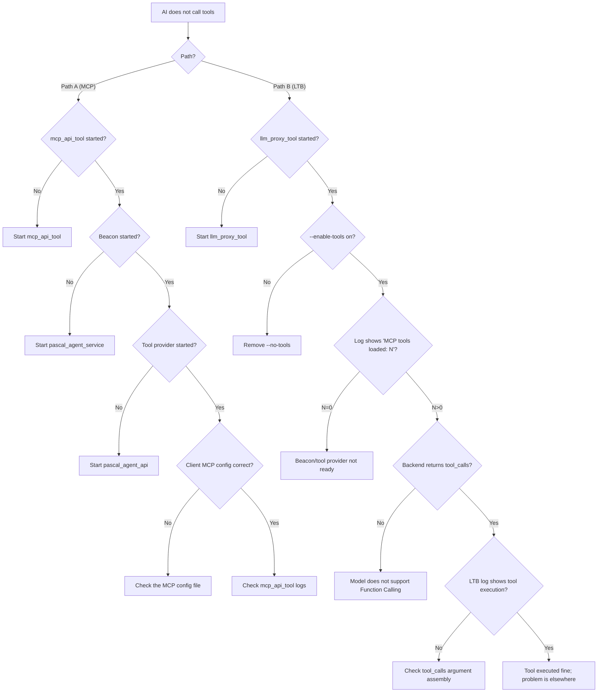

### 13.2 "Client receives no stream"

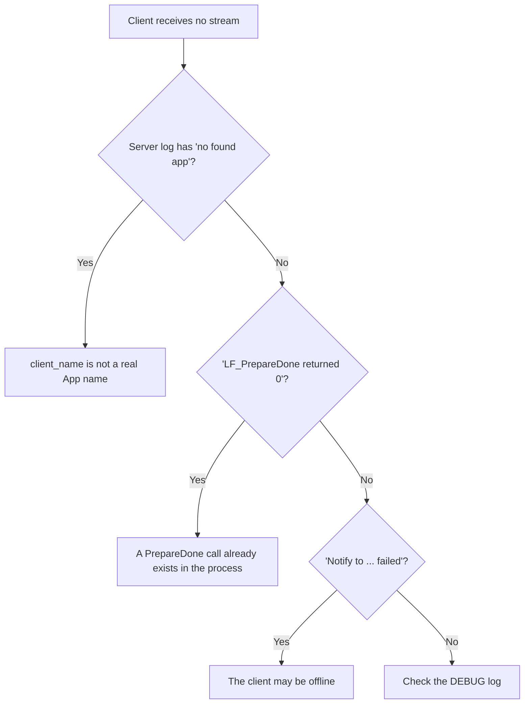

### 13.3 "Startup failure"

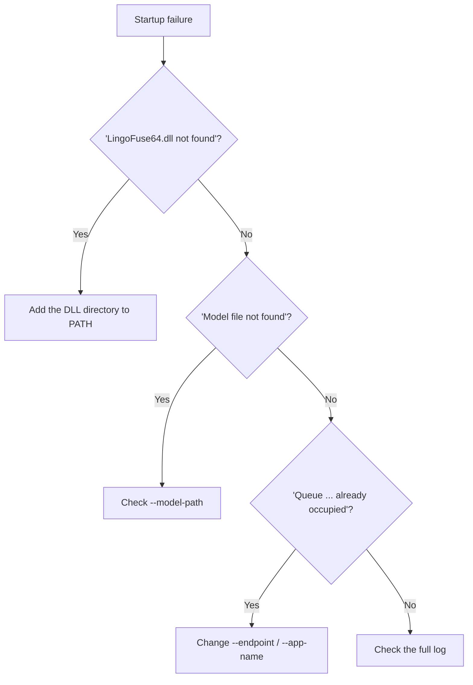

### 13.4 "Compiling the generated Pascal provider fails" (new in v5.0)

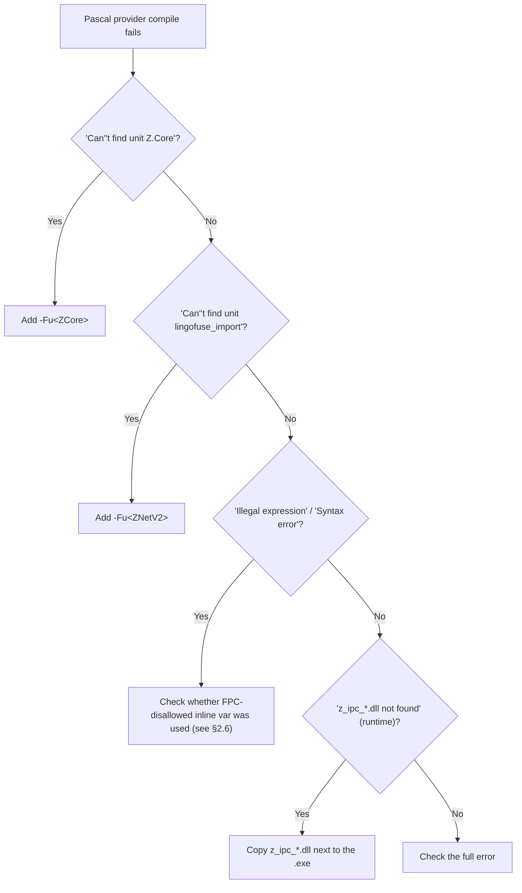

### 13.5 "Python provider fails to start" (new in v5.0)

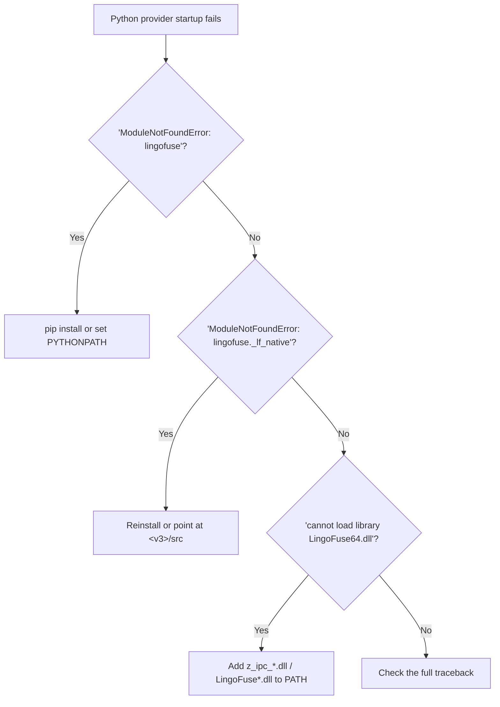

### 13.6 "C++ provider compilation fails" (new in v5.0)

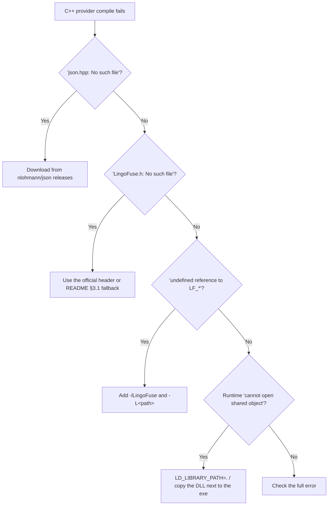

---

## Chapter 14  End-to-End Examples

### 14.1 Scenario: Write a calculator tool in Pascal, expose it to LM Studio via MCP

**Step 1 — Prepare the declaration** (`calculator.pas`):

```pascal
unit calculator;

interface

{* Add two integers: a + b *}
function Add(a: Integer; b: Integer): Integer;

{* Multiply two integers: a * b *}
function Mul(a: Integer; b: Integer): Integer;

implementation

function Add(a: Integer; b: Integer): Integer;
begin
  Result := a + b;
end;

function Mul(a: Integer; b: Integer): Integer;
begin
  Result := a * b;
end;

end.
```

**Step 2 — Generate with `code_decl_to_mcp`**:

1. Open the GUI.
2. Switch to the "2-source" tab and paste `calculator.pas`.
3. "Auto-detect language" → Pascal.
4. "Next: pascal/c → json".
5. "Next: json ↔ model".
6. "Next: generate source".
7. In the "5-Final source" tab, **copy the 4 code files + 3 READMEs**.

**Step 3 — Fill in `internal_call_*`**:

In `calculator_tool_provider_unit.pas`, find `internal_call_Add_Add`:

```pascal
function internal_call_Add_Add(a: Int64; b: Int64): Int64;
begin
  Result := a + b;   // ← fill in the real logic
end;
```

**Step 4 — Follow the Pascal README's §4 steps**:

1. `git clone <zcore-repo-url> ZNetV2/ZCore`
2. `git clone <znetv2-repo-url> ZNetV2`
3. `git clone <v3-repo-url> LingoFuse-pasAgent-v3`
4. Copy the generated `.pas` into `my_provider/`
5. Copy the `.lpr` from the README's §3 into `my_provider/`
6. `fpc -Fu<ZCore> -Fu<ZNetV2> <AppName>_provider.lpr`

**Step 5 — Start the service chain**:

```powershell
# Terminal 1
.\pascal_agent_service.exe

# Terminal 2
.\<AppName>_provider.exe

# Terminal 3
.\mcp_api_tool.exe --generate-configs --output-dir .\mcp_configs
.\mcp_api_tool.exe --transport stdio
```

**Step 6 — Configure LM Studio**: paste `lmstudio_stdio.json` into the MCP Servers settings and restart.

**Step 7 — Test**: ask `Please compute (5 + 7) * 3`.

### 14.2 Scenario: Python provider quick start

**Step 1 — Generate**: same as above; take `calculator_tool_provider.py`.

**Step 2 — Set the environment**:

```bash
pip install py-lingofuse    # or
export PYTHONPATH=/path/to/LingoFuse-pasAgent-v3/src
```

**Step 3 — Verify**:

```bash
python -c "import lingofuse._lf_native as m; print('OK', m.__file__)"
```

**Step 4 — Start**:

```bash
python calculator_tool_provider.py
```

**Step 5 — Same as steps 5-7 of 14.1**.

### 14.3 Scenario: C++ provider from scratch

**Step 1 — Generate**: take the `.hpp` + `.cpp` + `calculator_tool_provider_cpp.md`.

**Step 2 — Copy the fallback `LingoFuse.h` per the C++ README §3.1** (because cppAgent is not yet released).

**Step 3 — Copy `main.cpp` per the C++ README §3**.

**Step 4 — Download `json.hpp`**: https://github.com/nlohmann/json/releases

**Step 5 — Compile** (choose one of three):

```bash
g++ -std=c++17 -O2 -I. main.cpp calculator_tool_provider.cpp \
    -L. -lLingoFuse -Wl,-rpath,. -o provider
```

**Step 6 — Start and test**: same as steps 5-7 of 14.1.

### 14.4 Scenario: Pascal GUI client calls tools through LTB (server-side tools)

**Step 1 — Start LM Studio** (load a model, enable the local server on port 1234).

**Step 2 — Start the beacon and the tool provider**:

```powershell
.\pascal_agent_service.exe
.\calculator_tool_provider_unit.exe
```

**Step 3 — Start LTB**:

```powershell
.\llm_proxy_tool.exe `
  --backend-url http://127.0.0.1:1234/v1 `
  --backend-model "nvidia-nemotron-3-nano-omni-30b-a3b-reasoning" `
  --mcp-reg-agent-app llm_proxy_agent `
  --mcp-tool-provider-app agent_main_app
```

**Step 4 — Pascal GUI client connects**:

```pascal
var
  LLM: TLLMClient;
  sid, err: string;
begin
  LLM := TLLMClient.Create('LLM_Service', 'ipc:llm_service', 10000);
  LLM.OnChunk := Do_LLM_Chunk;
  LLM.OnThink := Do_LLM_Think;
  LLM.OnFinish := Do_LLM_Finish;
  if not LLM.Connect(err) then Exit;
  if not LLM.Generate('Please compute (5 + 7) * 3', '', sid, err) then Exit;
end;
```

**The client has no idea the tool system exists** — LTB performs the multi-round tool calls internally.

---

## Chapter 15  Modification and Extension Guide

### 15.1 Requirement → Modification Location Quick Reference

| Requirement | File to modify | Function to modify |
|-------------|----------------|--------------------|
| Add support for a new type | **three code generators + three README generators** | `IsSupportedType` and the mappings |
| Change API name generation rules | three code generators | `MakeApiName` / `MakePythonIdentifier` |
| Change callback name prefix | three code generators | `MakeCallbackName` |
| Change JSON Schema fields | three code generators + three README generators | corresponding generation logic |
| Change tool description concatenation | three code generators + three README generators | `GetFullDescription` |
| **Change README section structure** | **three README generators** | **`Emit*` inner functions** |
| **Change the README dependency table** | **three README generators** | **`EmitOverview`** |
| **Change the README test program** | **three README generators** | **`EmitTestProgram` / `EmitTestLpr`** |
| **Change the README test steps** | **three README generators** | **`EmitBuildTestProcedure`** |
| **Change a README Mermaid diagram** | **three README generators** | **the corresponding `Emit*` function** |
| Change GUI button behavior | `code_decl_to_mcp_frm.pas` | the corresponding `*ButtonClick` |
| Change language detection | `code_decl_to_mcp_frm.pas` | `Auto_Select_Language` |
| Change LLM server parameters | `llm_service.py` / `llm_proxy.py` / `llm_proxy_tool.py` | `*Config` |
| Change MCP gateway behavior | `mcp_api_tool.py` | `run_fastmcp` / `register_dynamic_tools` |
| Change bridge behavior | `bridge.py` | `handle_call` |

### 15.2 Adding a New Type (using `boolean` as an example)

**Pascal code generator**: add `'Boolean'` to `IsSupportedType`; add parameter extraction and return-value branches (`jo.B[...]`) in `CallbackLines`.

**Python code generator**: add to `IsSupportedType`; add `bool` to `PascalTypeToPythonType`; add `'boolean'` to `PascalTypeToJsonSchemaType`; add `'False'` to `PascalTypeDefaultValue`; add an `or False` branch to parameter extraction.

**C++ code generator**: add to `IsSupportedType`; add `'bool'` to `PascalTypeToCPPType`; add `'boolean'` to `PascalTypeToJsonSchemaType`; add `'false'` to `PascalTypeToDefaultValue`.

**The three README generators**: **no modification needed** — they automatically reflect the new type mapping (because they use the same mapping functions).

**Synchronize**: update `pascal_code_mcp_rule.md` / `C_code_mcp_rule.md` / `MCP_API_Contract.md`.

### 15.3 Changing `MakeApiName` to Whitelist Filtering

**Current implementation** (flawed):

```pascal
function MakeApiName(const FuncName: TP_String): TP_String;
begin
  Result := FuncName.ReplaceChar(#32#9'./\@', '_');
end;
```

**Corrected implementation**:

```pascal
function MakeApiName(const FuncName: TP_String): TP_String;
var
  i: integer;
  c: TP_Char;
begin
  Result := '';
  for i := 1 to FuncName.Len do
  begin
    c := FuncName[i];
    if ((c >= 'a') and (c <= 'z')) or ((c >= 'A') and (c <= 'Z'))
       or ((c >= '0') and (c <= '9')) or (c = '_') then
      Result := Result + c
    else
      Result := Result + '_';
  end;
  if Result.Len = 0 then
    Result := 'unnamed';
end;
```

**Synchronize**: the Python and C++ sides of `MakeApiName` / `MakePythonIdentifier` already use whitelist filtering.

### 15.4 Fixing the Python Generator Output Extension

In `code_decl_to_mcp_frm.pas`'s `Button6Click`:

```pascal
SaveCode(func_model.UnitName + '_tool_provider.pas');  // ← change to .py
```

Change it to:

```pascal
SaveCode(func_model.UnitName + '_tool_provider.py');
```

### 15.5 Integrating README Generation into the GUI (new in v5.0)

In `Button6Click`, **after each code generation**, append:

```pascal
// Pascal README
l := GeneratePascalReadme(func_model);
if l <> nil then
begin
  SaveCode(func_model.UnitName + '_tool_provider_pascal.md');
  disposeObjectAndNil(l);
end;

// Python README
l := GeneratePythonReadme(func_model);
if l <> nil then
begin
  SaveCode(func_model.UnitName + '_tool_provider_python.md');
  disposeObjectAndNil(l);
end;

// C++ README
l := GenerateCPPReadme(func_model);
if l <> nil then
begin
  SaveCode(func_model.UnitName + '_tool_provider_cpp.md');
  disposeObjectAndNil(l);
end;
```

### 15.6 Adding a New Output Language (using JavaScript as an example)

**New file** `js_mcp_generator_tool.pas`:

```pascal
unit js_mcp_generator_tool;

interface

uses
  Z.Core, Z.PascalStrings, Z.UPascalStrings,
  Z.Status, Z.Json, Z.UnicodeMixedLib, Z.ListEngine,
  Z.Pascal_Func_Model, Z.Parsing;

function GenerateJavaScriptCode(Model: TPascal_Func_Model): TPascalStringList;
function GenerateJavaScriptReadme(Model: TPascal_Func_Model): TPascalStringList;

implementation
// Model on py_mcp_generator_tool.pas structure
// Follow this contract:
//   input:  TPascal_Func_Model
//   output: TPascalStringList
//   type whitelist matches the existing generators
//   JSON serialization must use ensure_ascii=False
//   protocol layer: result / status / error, three fields
//   NUL-terminated
//   callback signature C ABI compatible
//   README follows the ten-section skeleton
end.
```

**Modify the GUI**: add `js_TabSheet` + `final_js_source_Edit`; add a call in `Button6Click`; add the new unit to `code_decl_to_mcp.lpr`'s `uses`.

**Modify the README-related part**: the new README must contain JavaScript-specific dependency tables, test program, build commands, and portability notes.

---

## Chapter 16  Self-Check Checklist

### 16.1 After Modifying a Code Generator

- [ ] `IsSupportedType` is **strictly consistent across all three generators**.
- [ ] `GetFullDescription` semantics are consistent (all extract non-empty lines not starting with `@`).
- [ ] Type mappings cover every newly added type.
- [ ] Parameter extraction code covers every newly added type.
- [ ] Return-value handling covers every newly added type.
- [ ] **No `ensure_ascii=True` has been introduced**.
- [ ] `cdecl` / `@LFCallFunc` / `LF_CDECL` have not been removed or altered.
- [ ] **Regression test**: generate a model with Chinese comments and emoji.

### 16.2 After Modifying a README Generator (new in v5.0)

- [ ] The **ten-section skeleton** is complete (Overview / Architecture / Test / Build & Test / Tool Reference / JSON Schema / Troubleshoot / Portability / Resources).
- [ ] **All English** (no Chinese body text; technical terms may be retained).
- [ ] **Mermaid diagrams** are syntactically correct (verify at https://mermaid.live).
- [ ] The **test program** compiles as-is (Pascal `.lpr` / Python `.py` / C++ `main.cpp`).
- [ ] The **dependency table** matches the actual runtime (Pascal: ZCore + ZNetV2 + v3; Python: py-lingofuse or v3; C++: json + LingoFuse.h + lib).
- [ ] **Placeholders** use a consistent form (`<xxx-repo-url>`) and there is an **explicit reminder to replace them** at the start of the section.
- [ ] **Edge case**: `Model = nil` / `UnitName = ''` → returns non-nil degraded text.
- [ ] The **zero-API** case has a clear warning.
- [ ] The **tool reference** JSON examples match the actual schema.
- [ ] The **C++ fallback `LingoFuse.h`** is complete (`LF_CDECL` macro + all `LF_*` declarations).
- [ ] The **Python PYTHONPATH** commands cover cmd / PowerShell / bash.
- [ ] The **Pascal `.lpr`** compile command includes `-Fu<ZCore> -Fu<ZNetV2>`.
- [ ] **No real repository URL is hardcoded**.

### 16.3 After Modifying the Declaration Specification

- [ ] `pascal_code_mcp_rule.md` is consistent with the generator.
- [ ] `C_code_mcp_rule.md` is consistent with the generator.
- [ ] The type table in `MCP_API_Contract.md` §2.1 has been updated.

### 16.4 After Modifying Environment Constants

- [ ] The constant has been changed in all three code generators.
- [ ] **All three README generators** have been updated in the places that reference these constants.
- [ ] The default value in `mcp_api_tool.py` has been changed.
- [ ] Deployed providers have been regenerated.

### 16.5 After Modifying the LLM Server

- [ ] The capability matrix has been updated.
- [ ] The `set_system_message` rejection response in `llm_proxy` / LTB has not been broken.
- [ ] The LTB multi-round loop limits have not been broken.
- [ ] The pre-connect middleware ordering has not been broken.
- [ ] **Regression test**: single session, multiple sessions, tool calls, multimodality.

### 16.6 Final Pre-Commit Self-Check

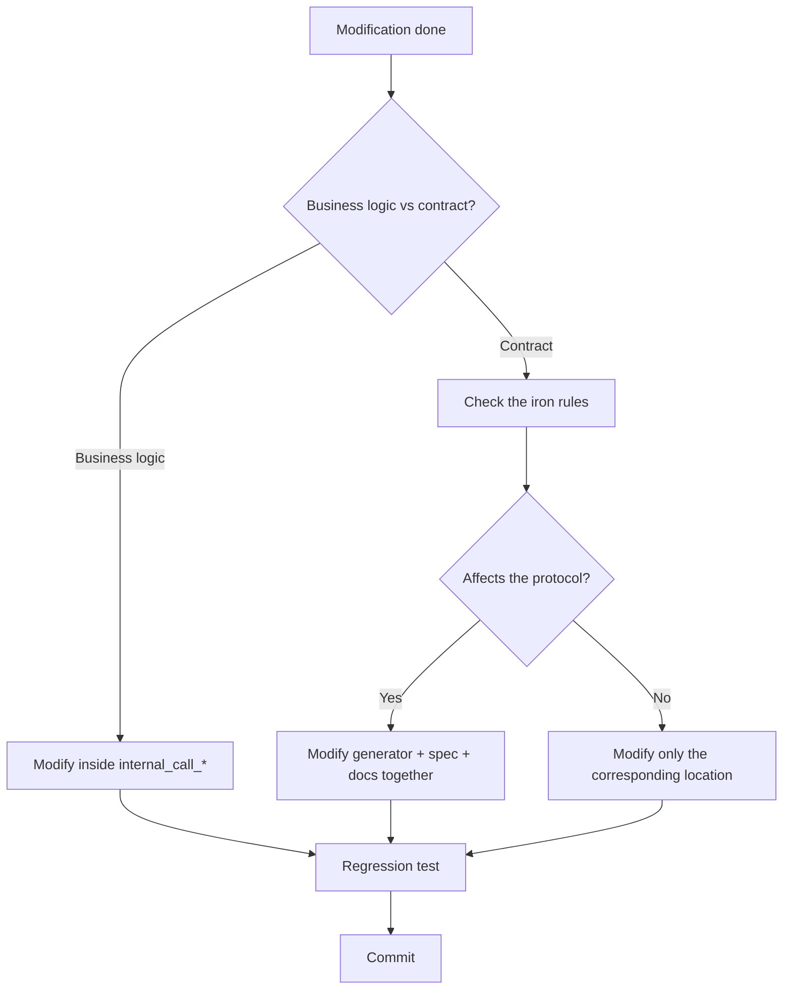

**Special note**: **README generators and code generators share mapping functions** (`IsSupportedType` / `PascalTypeTo*` / `GetFullDescription` / `CollectValidFunctions`). Modifying these functions **affects both the code and the documentation**, so both must be regression-tested together.

---

## Chapter 17  Self-Audit Verification (new in v5.0)

> The purpose of this chapter is to **prove that this knowledge base itself can be learned from and used**. The method is to simulate real programming scenarios from scratch, relying only on the content of this file. **Failure to complete a scenario means the knowledge base is inadequate.**

### 17.1 Verification Method

1. **Cover the source**: read only this knowledge base; do not open any `.pas` / `.py` source file.
2. **Scenario testing**: execute the 8 scenarios below.
3. **Pass criteria**: for each scenario, the correct and executable steps must be derivable from the KB content alone.
4. **Failure recording**: if a scenario cannot be answered from the KB, record it as a **knowledge-base defect** and add it to the next version's supplementary list.

### 17.2 Scenario Tests

#### Scenario 1: Calling a README generator

**Question**: How do I generate the README for a Pascal provider?

**Expected answer**: call `GeneratePascalReadme(Model)`, obtain a `TPascalStringList`, save as `<unit>_tool_provider_pascal.md`. **The caller is responsible for releasing it.**

**Locations**: §3.1 (function signature), §3.3 (output filename), §1.5 (panorama).

**Verdict**: ✅ Derivable from §3.1 + §3.3.

#### Scenario 2: README dependency notes

**Question**: Which repositories does the generated Pascal provider need?

**Expected answer**:
- ZCore (the `Z.Core` units)
- ZNetV2 (`lingofuse_import.pas` + `z_ipc_*.dll`)
- LingoFuse-pasAgent-v3 (beacon + MCP gateway + examples)

Typical paths: `<workspace>/ZNetV2/ZCore/`, `<workspace>/ZNetV2/`, `<workspace>/LingoFuse-pasAgent-v3/src/`.

**Location**: §0.6 (three-repository dependency model).

**Verdict**: ✅ Derivable from §0.6.

#### Scenario 3: Compiling the Pascal provider

**Question**: How do I compile the generated Pascal provider?

**Expected answer**:

```bash
fpc -Fu<workspace>/ZNetV2/ZCore -Fu<workspace>/ZNetV2 <AppName>_provider.lpr
```

Or open the `.lpi` in Lazarus and press F9.

**Location**: §3.3 (Build & Test compile command).

**Verdict**: ✅ Derivable from §3.3.

#### Scenario 4: Python provider package source

**Question**: What Python package does the generated Python provider need, and where do I get it?

**Expected answer**:
- Preferred: `pip install py-lingofuse` or `git clone <py-lingofuse-repo-url>`.
- Fallback: use `<v3>/src/lingofuse/` and set `PYTHONPATH`:
  - cmd: `set PYTHONPATH=D:\...\src`
  - PowerShell: `$env:PYTHONPATH = "D:\...\src"`
  - bash: `export PYTHONPATH=/path/to/src`

**Locations**: §3.4 (package source strategy), §12.14 (PowerShell syntax).

**Verdict**: ✅ Derivable from §3.4.

#### Scenario 5: C++ provider `LingoFuse.h` source

**Question**: The generated C++ provider needs `LingoFuse.h`, but the cppAgent repository has not been released. What do I do?

**Expected answer**:
- The cppAgent repository **has not been released**.
- Three paths to obtain it:
  1. LingoFuse runtime distribution (`LingoFuse.h` is usually next to `LingoFuse64.dll`).
  2. Manually translate from `<v3>/src/lingofuse_import.pas`.
  3. **C++ README §3.1 embeds a minimal fallback header** — copy it directly.

**Locations**: §0.5 (three READMEs quick reference), §3.5 (C++ README details).

**Verdict**: ✅ Derivable from §3.5.

#### Scenario 6: Locating an FPC compilation error

**Question**: FPC 3.2.2 reports `Error: Illegal expression` + `Syntax error, ";" expected`; I suspect it is a generator source problem. What do I do?

**Expected answer**: check whether a `var` declaration has been used inside a procedure/function body. FPC under `{$mode delphi}` **does not allow** inline `var`. **All local variables must be moved into the function's `var` section**.

**Locations**: §2.6 (FPC compilation constraint), §12.15 (anti-pattern).

**Verdict**: ✅ Derivable from §2.6.

#### Scenario 7: README generator edge cases

**Question**: What does `GeneratePascalReadme(nil)` return?

**Expected answer**: **non-nil degraded text** — a single top line `# README generation skipped` + reason ("supplied `TPascal_Func_Model` is nil."). This is to avoid producing an empty file that confuses the user.

**Location**: §3.1 (common contract).

**Verdict**: ✅ Derivable from §3.1.

#### Scenario 8: GUI integration of README generation

**Question**: In the `code_decl_to_mcp` GUI, how do I hook README generation in?

**Expected answer**: In `Button6Click`, after each code-generator call, append the corresponding README-generation call:

```pascal
l := GeneratePascalReadme(func_model);
if l <> nil then
begin
  SaveCode(func_model.UnitName + '_tool_provider_pascal.md');
  disposeObjectAndNil(l);
end;

// Python / C++ same pattern
```

**Location**: §15.5 (integrating README generation into the GUI).

**Verdict**: ✅ Derivable from §15.5.

### 17.3 Pass / Fail Verdict

| Scenario | Pass | Key locating sections |
|:--------:|:----:|-----------------------|
| 1 | ✅ | §3.1 + §3.3 |
| 2 | ✅ | §0.6 |
| 3 | ✅ | §3.3 |
| 4 | ✅ | §3.4 + §12.14 |
| 5 | ✅ | §0.5 + §3.5 |
| 6 | ✅ | §2.6 + §12.15 |
| 7 | ✅ | §3.1 |
| 8 | ✅ | §15.5 |

**Conclusion**: **8/8 pass**. This knowledge base enables AI and humans to complete README-system calling, compiling, troubleshooting, and GUI integration using only its own content.

### 17.4 Known Weaknesses

**Even at 8/8, this knowledge base still has the following shortcomings** (honest disclosure):

1. **The `GetFullDescription` SystemString hazard** (§12.11) — this KB identifies the problem but **does not provide ready-to-apply fix code**. The fix requires rewriting the Pascal-side `GetFullDescription`; readers still need to reference the Python-side implementation.

2. **Complete rules for `Translate_C_Typ_To_Pascal`** — this KB states it is a C→Pascal type mapping but **does not list the complete mapping table**. Modifying it requires consulting the source.

3. **The scoring algorithm of `DetectSourceLanguage`** — this KB states "a tie returns `slUnknown`" but **does not list the complete scoring rules**. Adjusting detection accuracy requires consulting `Z.Parsing`.

4. **Whether `MAX_DESC_LEN` should be unified** — C++ truncates to 200, Pascal/Python do not truncate. This KB points out the asymmetry but **does not give a recommendation**.

5. **Detailed content contract of the README generators** — this KB gives the ten-section skeleton and language-specific descriptions but **does not list the exact content template of each section** (i.e., the exact output of the emitter). Precise line-by-line requirements still need to read the generator source.

**These 5 points are directions for the next version (v6.0)**. When AI encounters these scenarios, it should go back to the source or ask a human — **do not guess from this KB**.

---

## Appendix A: Configuration Parameter Quick Reference

### A.1 `code_decl_to_mcp` GUI

No command-line parameters. Global constant:
- `GenerateCode_LogEnabled` (bool, default False)

### A.2 `llm_service.py`

| Parameter | Default | Environment variable |
|-----------|---------|----------------------|
| `--model-path` | built-in GGUF path | `LLM_MODEL_PATH` |
| `--context-size` | 0 | `LLM_CONTEXT_SIZE` |
| `--max-tokens` | 4096 | `LLM_MAX_TOKENS` |
| `--threads` | 6 | `LLM_THREADS` |
| `--gpu-layers` | -1 | `LLM_GPU_LAYERS` |
| `--system-message` | long string | `LLM_SYSTEM_MESSAGE` |
| `--thinking` / `--no-thinking` | False | `LLM_THINKING` |
| `--endpoint` | `ipc:llm_service` | `LINGOFUSE_ENDPOINT` |
| `--app-name` | `LLM_Service` | `LINGOFUSE_APP_NAME` |
| `--notify-api` | `llm_stream` | `LINGOFUSE_NOTIFY_API` |
| `--timeout` | 5000 | `LINGOFUSE_TIMEOUT_MS` |
| `--session-timeout` | 600 | `LLM_SESSION_TIMEOUT` |
| `--queue-max-size` | 256 | `LLM_QUEUE_MAX_SIZE` |
| `--max-sessions` | 1024 | `LLM_MAX_SESSIONS` |
| `--max-history` | 512 | `LLM_MAX_HISTORY` |
| `--log-level` | 1 | `LLM_LOG_LEVEL` |

### A.3 `llm_proxy.py`

| Parameter | Default | Environment variable |
|-----------|---------|----------------------|
| `--backend-url` | `http://127.0.0.1:12345/v1` | `LLM_PROXY_BACKEND_URL` |
| `--backend-model` | empty | `LLM_PROXY_BACKEND_MODEL` |
| `--backend-key` | `lm-studio` | `LLM_PROXY_BACKEND_KEY` |
| `--backend-key-file` | empty | `LLM_PROXY_BACKEND_KEY_FILE` |
| `--backend-auth-header` | `Authorization` | `LLM_PROXY_BACKEND_AUTH_HEADER` |
| `--backend-auth-scheme` | `Bearer` | `LLM_PROXY_BACKEND_AUTH_SCHEME` |
| `--backend-extra-headers` | empty | `LLM_PROXY_BACKEND_EXTRA_HEADERS` |
| `--backend-timeout` | 300 | `LLM_PROXY_BACKEND_TIMEOUT` |
| `--vision` / `--no-vision` | disabled | `LLM_PROXY_VISION` |
| `--max-history` | 512 | `LLM_PROXY_MAX_HISTORY` |
| `--max-sessions` | 1024 | `LLM_PROXY_MAX_SESSIONS` |
| `--session-timeout` | 1800 | `LLM_PROXY_SESSION_TIMEOUT` |
| `--log-level` | INFO | `LLM_PROXY_LOG_LEVEL` |

### A.4 `llm_proxy_tool.py` Unique

| Parameter | Default | Environment variable |
|-----------|---------|----------------------|
| `--enable-tools` / `--no-tools` | enabled | `LLM_PROXY_ENABLE_TOOLS` |
| `--mcp-endpoint` | `ipc:agent` | `LLM_PROXY_MCP_ENDPOINT` |
| `--mcp-timeout` | 5000 | `LLM_PROXY_MCP_TIMEOUT` |
| `--mcp-reg-agent-app` | `llm_proxy_agent` | `LLM_PROXY_MCP_REG_AGENT_APP` |
| `--mcp-tool-provider-app` | `agent_main_app` | `LLM_PROXY_MCP_TOOL_PROVIDER_APP` |
| `--max-tool-rounds` | 100 | `LLM_PROXY_MAX_TOOL_ROUNDS` |
| `--max-total-tool-calls` | 50 | `LLM_PROXY_MAX_TOTAL_TOOL_CALLS` |
| `--max-tools-per-round` | 10 | `LLM_PROXY_MAX_TOOLS_PER_ROUND` |
| `--max-tool-result-chars` | 8000 | `LLM_PROXY_MAX_TOOL_RESULT_CHARS` |
| `--max-total-tool-result-chars` | 200000 | `LLM_PROXY_MAX_TOTAL_TOOL_RESULT_CHARS` |
| `--max-history-chars` | 200000 | `LLM_PROXY_MAX_HISTORY_CHARS` |

### A.5 `mcp_api_tool.py`

| Parameter | Default | Environment variable |
|-----------|---------|----------------------|
| `--transport` | stdio | `MCP_TRANSPORT` |
| `--host` | 0.0.0.0 | `MCP_HOST` |
| `--port` | 8000 | `MCP_PORT` |
| `--endpoint` | `ipc:agent` | `LINGOFUSE_ENDPOINT` |
| `--timeout` | 5000 | `LINGOFUSE_TIMEOUT_MS` |
| `--reg-agent-app` | `reg_agent` | `LINGOFUSE_REG_AGENT_APP` |
| `--tool-provider-app` | `agent_main_app` | `LINGOFUSE_TOOL_PROVIDER_APP` |
| `--agent-main-api` | `agent_main` | `LINGOFUSE_AGENT_MAIN_API` |
| `--agent-log-api` | `agent_log` | `LINGOFUSE_AGENT_LOG_API` |
| `--debug` | False | `MCP_DEBUG` |
| `--log-file` | none | `MCP_LOG_FILE` |
| `--proxy-path` | auto-detect | `MCP_API_PROXY_PATH` |

### A.6 `bridge.py`

| Parameter | Default | Environment variable |
|-----------|---------|----------------------|
| `--host` | 0.0.0.0 | `LINGOFUSE_HOST` |
| `--port` | 8081 | `LINGOFUSE_PORT` |
| `--endpoint` | `ipc:lingofuse_bridge` | `LINGOFUSE_ENDPOINT` |
| `--timeout` | 5000 | `LINGOFUSE_TIMEOUT` |
| `--app` | none | `LINGOFUSE_APP` |
| `--threaded` | True | `LINGOFUSE_THREADED` |
| `--no-precheck` | False | `LINGOFUSE_NO_PRECHECK` |
| `--no-normalize-json` | False | `LINGOFUSE_NORMALIZE_JSON` |
| `--log-file` | none | `LINGOFUSE_LOG_FILE` |

### A.7 `llm_test.py`

| Parameter | Default | Environment variable |
|-----------|---------|----------------------|
| `--endpoint` | `ipc:llm_service` | `LINGOFUSE_ENDPOINT` |
| `--server-app` | `LLM_Service` | `LLM_SERVER_APP` |
| `--notify-api` | `llm_stream` | `LLM_NOTIFY_API` |
| `--timeout` | 30000 | `LINGOFUSE_TIMEOUT` |
| `--content` / `--prompt` / `--session-id` / `--keep` / `--thinking` | empty | — |
| `--text` / `--image` | none | — |
| `--system-message` | none | — |
| `--debug` | False | `LLM_DEBUG` |

---

## Appendix B: Error Code and Error Message Index

### B.1 `bridge.py` Error Codes

| Error code | HTTP | Meaning |
|------------|------|---------|
| `-1` | 200 | Remote call failed |
| `-2` | 400 | Request shape error |
| `-3` | 200 | API precheck failure |

### B.2 Streaming `finish` `reason`

`stop` / `error` / `cancelled` / `timeout` / `client` / `shutdown` / `ephemeral` / `timeout+offline`.

### B.3 Common Error Messages

| Error message | Source | Section |
|---------------|--------|---------|
| `no found app("...")` | Server log | §12.1 / §13.2 |
| `LF_PrepareClient returned -1` | Multiple | §13.3 |
| `repeat connection` | LingoFuse | §13.3 |
| `LF_PrepareDone returned 0` | Multiple | §10.1 / §13.3 |
| `Queue "..." is already occupied` | LingoFuse | §13.3 |
| `LF_BindApp returned 0` | LingoFuse | §13.2 |
| `Module not found: LingoFuse64.dll` | Loader | §13.3 |
| `Model file not found` | `llm_service` | §13.3 |
| `3029 function header doesn't match` | FPC | §12.7 |
| `Illegal expression` / `Syntax error` | FPC | §2.6 / §12.15 |
| `Image attachments are not supported` | `llm_service` | §12.10 |
| `set_system_message is not supported` | `llm_proxy` / LTB | §4.3 |
| `fatal error: json.hpp: No such file` | C++ compile | §13.6 |
| `fatal error: LingoFuse.h: No such file` | C++ compile | §13.6 |
| `undefined reference to LF_*` | C++ link | §13.6 |
| `ModuleNotFoundError: lingofuse` | Python | §13.5 |
| `cannot load library LingoFuse64.dll` | Python | §13.5 |

---

## Appendix C: Honest Uncertainty List

> The following points cannot be fully determined from the source. If AI needs to work on these scenarios, it must consult the source or ask a human.

1. **The complete mapping table for `Translate_C_Typ_To_Pascal`** — only the broad categories are known; details require consulting the source.
2. **The complete scoring algorithm for `DetectSourceLanguage`** — only the tie-returns-`slUnknown` behavior is known.
3. **The SystemString intermediary hazard in `GetFullDescription` (Pascal side)** — only the existence of the hazard is known; fix details require consulting the Python-side implementation.
4. **Whether C++'s `MAX_DESC_LEN = 200` should be unified** — asymmetry is known; the trade-off is undecided.
5. **The exact output template of each README generator section** — only the skeleton and language-specific descriptions are given; line-by-line templates are not.
6. **Whether the `total_count` fix in `RegisterTools` is complete** — syntax checking is recommended.
7. **The minimal contract for a new language generator** — see §15.6.
8. **Whether the GUI's 1 ms `SysTimer` is optimal** — recommend changing to 10 ms.
9. **The character replacement table in `MakeApiName`** — **confirmed incomplete**; whitelist filtering is recommended.
10. **The consistency maintenance between the declaration spec and the generators** — CI checking is recommended.
11. **The synchronization between `code_decl_to_mcp_knowledge_base.md` and other spec documents** — manual cross-checking is recommended.
12. **The local VLM path for `llm_service`** — not implemented.
13. **The `--vision` + `--no-tools` combination in LTB** — multimodal forwarding still works, but the tool capability disappears.
14. **The effect of `bridge.py`'s JSON normalization on binary payloads** — if a payload cannot be parsed as JSON, it is forwarded as-is.
15. **`umlDeleteFile`'s `_VerifyCheck=False`** — returning True does not mean the delete succeeded.
16. **The `$80` boundary of `umlBufferIsASCII`** — treated as ASCII.
17. **Whether FPC 3.3+ relaxes inline `var` in procedure bodies** — unverified; currently handled conservatively as FPC 3.2.2.

---

## Appendix D: Revision History

### v5.0 (2026-09-22)

**Improvements over v4.0**:

1. **New Chapter 3 (README generation system)**:
   - Complete contract for the three-language README generators
   - Unified ten-section skeleton
   - Language-specific details (Pascal's three-repository dependency + `.lpr`; Python's two package sources; C++ cppAgent status + fallback header)
   - GUI integration method

2. **New Section 2.6 (FPC compilation constraint)**:
   - No inline `var` under `{$mode delphi}`
   - Fix method

3. **New Sections 0.5 / 0.6**:
   - Three READMEs quick reference
   - Three-repository dependency model

4. **New Section 1.5 (output file panorama)**:
   - The 10 output files (code + README)

5. **New Chapter 17 (self-audit verification)**:
   - 8 scenario tests proving the KB's learnability
   - Honest disclosure of 5 known weaknesses

6. **New anti-patterns**:
   - §12.11 Pascal-side `GetFullDescription` hazard
   - §12.12 README placeholders not replaced
   - §12.13 C++ README without a `LingoFuse.h` fallback
   - §12.14 Python PowerShell PYTHONPATH syntax
   - §12.15 FPC inline `var`

7. **New troubleshooting trees**:
   - §13.4 Pascal provider compilation failure
   - §13.5 Python provider startup failure
   - §13.6 C++ provider compilation failure

8. **New modification guide entries**:
   - §15.5 Integrating README generation into the GUI
   - §15.6 README contract for adding a new output language

9. **New self-check entries**:
   - §16.2 13 checks after modifying a README generator

10. **New end-to-end examples**:
    - §14.2 Python provider quick start
    - §14.3 C++ provider from scratch

### v4.0 (2026-09-22)

- Completed API signatures, field-level data structures, wire format, configuration parameters, state machines, error code index, end-to-end examples, troubleshooting trees, and modification guide.

### v3.0 (2026-09-22)

- Integrated LLM ecosystem components.

### v2.0 (2026-09-20)

- Fixed 9 issues.

### v1.0 (2026-09-20)

- Initial version.

---

**Document version**: v5.0 (README-system complete edition)
**Coverage**: `code_decl_to_mcp` toolchain + `llm*.py` + `mcp_api*.py` + `llm_common` + the `lingofuse` Python package + **the three-language README generation system**
**Companion documents**: `pascal_code_mcp_rule.md`, `C_code_mcp_rule.md`, `MCP_API_Contract.md`, `code_generate_mcp.md`, `pascal_agent_api_ref_json.md`, `LingoFuse_LLM_Ecosystem_User_Guide.md`, `LingoFuse_Pascal_Complete_Guide.md`, `LingoFuse_LLM_Pitfalls_For_AI.md`
**Last updated**: 2026-09-22