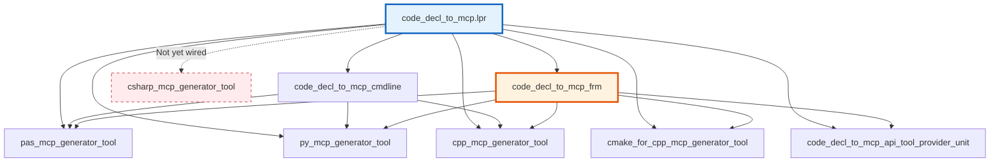
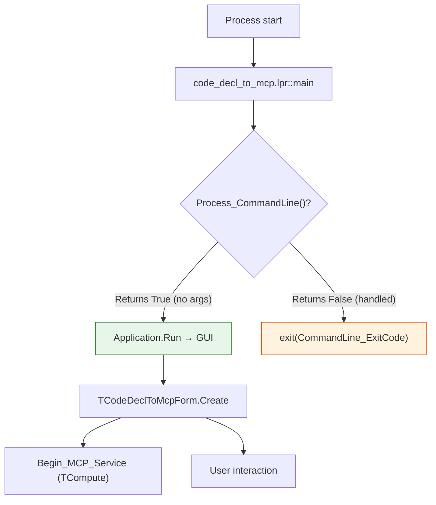
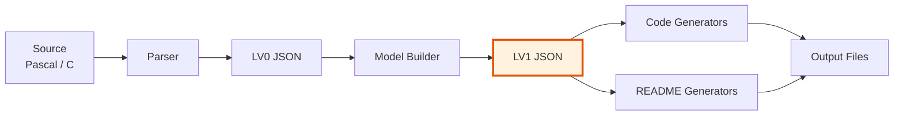
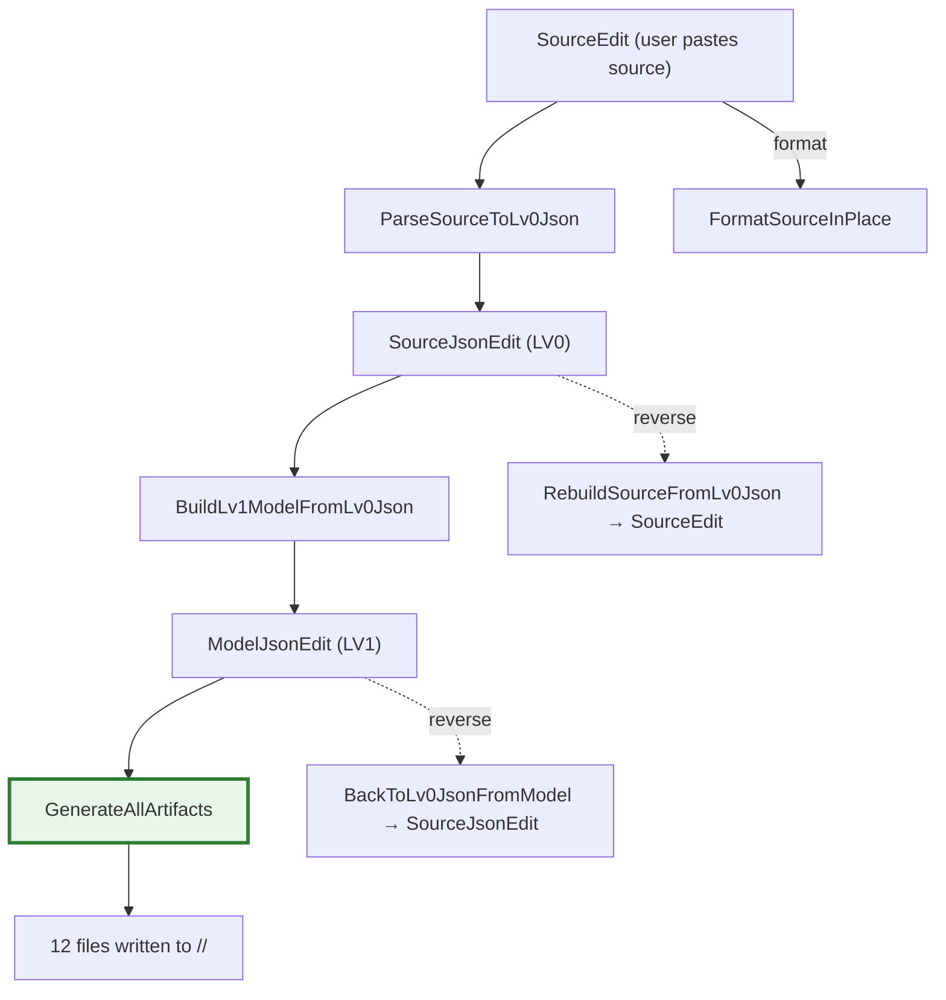
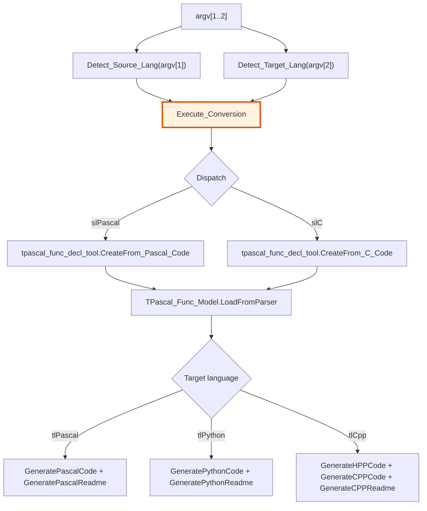
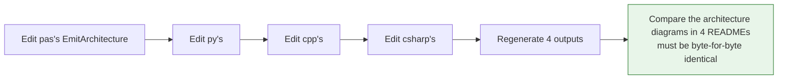
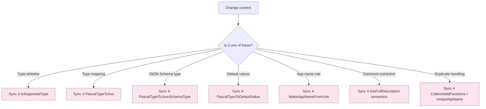

# code_decl_to_mcp Developer Knowledge Base (v8.0 — Maintainer Edition)

> **Document version**: v8.0 (Developer-First Edition)
> **Goal**: Enable AI assistants and human engineers to **modify, upgrade, and maintain** the `code_decl_to_mcp` project **without reading the source code**.
> **Promise**: Every conclusion in this document has been verified line-by-line against the source.
> **Failure criterion**: If a reader cannot answer the 25 self-test questions in Chapter 17 after reading this document, this document is not fit for purpose.
> **Diagram convention**: Every flowchart uses Mermaid.
> **Severity markers**: 🔴 Fatal / 🟠 Serious / 🟡 Minor

---

## Table of Contents

**Part I — Project Skeleton**
- [1. File Map and Dependencies](#1-file-map-and-dependencies)
- [2. The Three Entry Modes](#2-the-three-entry-modes)
- [3. End-to-End Data Flow](#3-end-to-end-data-flow)

**Part II — Generators In Depth**
- [4. Generator Interface Quick Reference](#4-generator-interface-quick-reference)
- [5. Generator Internals and Naming Rules](#5-generator-internals-and-naming-rules)
- [6. Output File Names and Directories](#6-output-file-names-and-directories)

**Part III — Shared Logic**
- [7. Type Whitelist and Type Mapping](#7-type-whitelist-and-type-mapping)
- [8. Comment Extraction Rules](#8-comment-extraction-rules)
- [9. Function Filtering and Duplicate Handling](#9-function-filtering-and-duplicate-handling)

**Part IV — Modification Guide**
- [10. Modification Task Cheat Sheet](#10-modification-task-cheat-sheet)
- [11. Adding a New Target Language](#11-adding-a-new-target-language)
- [12. Adding a New Output File](#12-adding-a-new-output-file)
- [13. Modifying a README Section](#13-modifying-a-readme-section)

**Part V — Consistency Red Lines**
- [14. Known Inconsistencies (Be Warned)](#14-known-inconsistencies-be-warned)
- [15. Consistency Constraints](#15-consistency-constraints)

**Part VI — Self-Audit and Self-Test**
- [16. Post-Modification Self-Audit Checklist](#16-post-modification-self-audit-checklist)
- [17. Twenty-Five Self-Test Questions](#17-twenty-five-self-test-questions)

**Appendices**
- [A. Precise Symbol Index](#a-precise-symbol-index)
- [B. Constants and Defaults Master Table](#b-constants-and-defaults-master-table)
- [C. Honest Uncertainty List](#c-honest-uncertainty-list)

---

# 1. File Map and Dependencies

## 1.1 Complete File Inventory

The project consists of **9 Pascal files**. For each file: its responsibility, approximate line count, and how often it is modified.

| # | File | Responsibility | Modified Often? | Notes |
|:-:|------|----------------|:---------------:|-------|
| 1 | `code_decl_to_mcp.lpr` | Program entry: command-line branch + GUI branch | Occasionally | `uses` clause must stay in sync with all generators |
| 2 | `code_decl_to_mcp_cmdline.pas` | Command-line mode (`--help` / `<in> <out>`) | Occasionally | **Must** be updated when adding a new target language |
| 3 | `code_decl_to_mcp_frm.pas` | GUI main form (5-tab wizard) | **Frequently** | The core file |
| 4 | `code_decl_to_mcp_api_tool_provider_unit.pas` | 11 MCP tools exposed by the project itself | Occasionally | Used for bootstrap |
| 5 | `pas_mcp_generator_tool.pas` | Pascal code + README generation | **Frequently** | Generator #1 |
| 6 | `py_mcp_generator_tool.pas` | Python code + README generation | **Frequently** | Generator #2 |
| 7 | `cpp_mcp_generator_tool.pas` | C++ HPP + CPP + README generation | **Frequently** | Generator #3 |
| 8 | `cmake_for_cpp_mcp_generator_tool.pas` | CMakeLists + C++ test main generation | Occasionally | Only serves the C++ branch |
| 9 | `csharp_mcp_generator_tool.pas` | C# code + test + README generation | Delivered, not integrated | Generator #4 (not yet wired) |

## 1.2 Dependency Graph


```mermaid
flowchart TD
    LPR["code_decl_to_mcp.lpr"]
    CMD["code_decl_to_mcp_cmdline"]
    FRM["code_decl_to_mcp_frm"]
    PROV["code_decl_to_mcp_api_tool_provider_unit"]
    PAS["pas_mcp_generator_tool"]
    PY["py_mcp_generator_tool"]
    CPP["cpp_mcp_generator_tool"]
    CMAKE["cmake_for_cpp_mcp_generator_tool"]
    CS["csharp_mcp_generator_tool"]

    LPR --> CMD
    LPR --> FRM
    LPR --> PROV
    LPR --> PAS
    LPR --> PY
    LPR --> CPP
    LPR --> CMAKE
    LPR -.->|Not yet wired| CS

    CMD --> PAS
    CMD --> PY
    CMD --> CPP

    FRM --> PAS
    FRM --> PY
    FRM --> CPP
    FRM --> CMAKE
    FRM --> PROV

    style LPR fill:#e3f2fd,stroke:#1565c0,stroke-width:3px
    style FRM fill:#fff3e0,stroke:#e65100,stroke-width:3px
    style CS fill:#ffebee,stroke:#c62828,stroke-dasharray: 5 5
```

**Key facts**:
- **`code_decl_to_mcp_cmdline.pas` is independent of the GUI**: it does not reference `frm`, does not start the LCL, and can run headless.
- **`code_decl_to_mcp_frm.pas` and `code_decl_to_mcp_cmdline.pas` are parallel paths**: the same functionality, two different drivers.
- **`csharp_mcp_generator_tool` is not wired in**: it appears neither in the `.lpr` `uses` nor in `GenerateAllArtifacts` nor in `Execute_Conversion`.

## 1.3 Infrastructure Shared by All Generators

Modules that the generators depend on but do **not own**:

| Module | Purpose |
|--------|---------|
| `Z.Pascal_Func_Model` | `TPascal_Func_Model` / `TFunctionStructure` / `TParamStructure` / `TParamArray` |
| `Z.Pascal_Func_Tool` | `tpascal_func_decl_tool` (LV0 parser) |
| `Z.Parsing` | `TTextParsing` / `DetectSourceLanguage` |
| `Z.Json` | `TZ_JsonObject` / `TZ_JsonArray` / `TZ_JsonString` |
| `Z.PascalStrings` / `Z.UPascalStrings` | `TPascalString` / `TUPascalString` / `TP_String = TUPascalString` |
| `Z.UnicodeMixedLib` | `umlMultipleMatch` / `umlSeparatorText` / `umlIntToStr` / `umlCombinePath`, etc. |
| `Z.ListEngine` | `TPascalStringList` / `TListPascalString` |
| `Z.Status` | `DoStatus` |
| `Z.Core` | `TCompute` / `DisposeObject` / `DisposeObjectAndNil` |

---

# 2. The Three Entry Modes

## 2.1 Entry Point Selection


```mermaid
flowchart TD
    Start["Process start"] --> A["code_decl_to_mcp.lpr::main"]
    A --> B{"Process_CommandLine()?"}
    B -- "Returns True (no args)" --> C["Application.Run → GUI"]
    B -- "Returns False (handled)" --> D["exit(CommandLine_ExitCode)"]
    C --> E["TCodeDeclToMcpForm.Create"]
    E --> F["Begin_MCP_Service (TCompute)"]
    E --> G["User interaction"]

    style C fill:#e8f5e9,stroke:#2e7d32
    style D fill:#fff3e0,stroke:#e65100
```

**Contract**: `Process_CommandLine()` returns `True` = **no arguments at all**, please continue with the GUI. Returns `False` = **command line already handled**, please exit with `CommandLine_ExitCode`.

## 2.2 GUI Mode (Default)

| Trigger | `code_decl_to_mcp.exe` (no arguments) |
|---------|---------------------------------------|
| Entry point | `TCodeDeclToMcpForm` |
| 5 tabs | Welcome / Source / Source-JSON / JSON-Model / Final Source |
| Key method | `GenerateAllArtifacts` |
| Output directory | `<exe-dir>/<UnitName>/` |
| MCP service start | `Begin_MCP_Service` (inside `TCompute.RunM_NP`) |

## 2.3 CLI Mode

| Trigger | `code_decl_to_mcp.exe --help` or `<input> <output>` |
|---------|-----------------------------------------------------|
| Entry point | `code_decl_to_mcp_cmdline.Process_CommandLine` |
| Key method | `Execute_Conversion` |
| Output directory | **Specified by the caller** (directly writes `<output>`) |
| Exit codes | `EXIT_OK=0` / `EXIT_BAD_ARGS=1` / `EXIT_PARSE_FAILED=2` / `EXIT_GEN_FAILED=3` / `EXIT_IO_ERROR=4` |
| Status output redirection | `OnDoStatusHook := @CmdLine_DoStatus_Hook` |

## 2.4 MCP-API Mode

After the GUI starts, it **automatically** registers 11 MCP tools (`code_decl_to_mcp_api_tool_provider_unit`). An AI agent can drive the generator remotely through the MCP gateway.

**Key fact**: MCP-API mode **depends on the GUI being alive**. It signals unavailability via the `Form not available` error.

---

# 3. End-to-End Data Flow

## 3.1 Core Pipeline


```mermaid
flowchart LR
    S0["Source<br/>Pascal / C"] --> P0["Parser"]
    P0 --> L0["LV0 JSON"]
    L0 --> P1["Model Builder"]
    P1 --> L1["LV1 JSON"]
    L1 --> CG["Code Generators"]
    L1 --> RG["README Generators"]
    CG --> OF["Output Files"]
    RG --> OF

    style L1 fill:#fff3e0,stroke:#e65100,stroke-width:3px
```

**LV1 (`TPascal_Func_Model`) is the single source of truth**: all code and documentation are derived from it. When modifying any generator, **do not bypass LV1**.

## 3.2 GUI Internal Data Flow (Exact)


```mermaid
flowchart TD
    A["SourceEdit (user pastes source)"] --> B["ParseSourceToLv0Json"]
    B --> C["SourceJsonEdit (LV0)"]
    C --> D["BuildLv1ModelFromLv0Json"]
    D --> E["ModelJsonEdit (LV1)"]
    E --> F["GenerateAllArtifacts"]
    F --> G["12 files written to <exe>/<Unit>/"]

    C -.->|reverse| A2["RebuildSourceFromLv0Json → SourceEdit"]
    E -.->|reverse| C2["BackToLv0JsonFromModel → SourceJsonEdit"]
    A -->|format| A3["FormatSourceInPlace"]

    style F fill:#e8f5e9,stroke:#2e7d32,stroke-width:3px
```

## 3.3 Exact Artifact List of `GenerateAllArtifacts`

In execution order, the files written are (total **12**):

| # | Filename | Source | Content |
|:-:|----------|--------|---------|
| 1 | `source.pas` or `source.h` | `SaveContextFiles` | User's current source |
| 2 | `source.json` | `SaveContextFiles` | LV0 |
| 3 | `source_model.json` | `SaveContextFiles` | LV1 |
| 4 | `<Unit>_tool_provider_unit.pas` | `GeneratePascalCode` | Pascal code |
| 5 | `<Unit>_tool_provider_pascal.md` | `GeneratePascalReadme` | Pascal guide |
| 6 | `<Unit>_tool_provider.py` | `GeneratePythonCode` | Python code |
| 7 | `<Unit>_tool_provider_python.md` | `GeneratePythonReadme` | Python guide |
| 8 | `<Unit>_tool_provider.hpp` | `GenerateHPPCode` | C++ header |
| 9 | `<Unit>_tool_provider.cpp` | `GenerateCPPCode` | C++ implementation |
| 10 | `<Unit>_tool_provider_cpp.md` | `GenerateCPPReadme` | C++ guide |
| 11 | `CMakeLists.txt` | `GenerateCMakeLists` | CMake build |
| 12 | `<Unit>_tool_provider_test.cpp` | `GenerateCPPTestMain` | C++ test main |

**If C# is wired in** (delivered but not integrated), three more files should be added:

| # | Filename | Source |
|:-:|----------|--------|
| 13 | `<Unit>_tool_provider.cs` | `GenerateCSharpCode` |
| 14 | `<Unit>_tool_provider_test.cs` | `GenerateCSharpTestProgram` |
| 15 | `<Unit>_tool_provider_csharp.md` | `GenerateCSharpReadme` |

## 3.4 CLI Internal Data Flow (Exact)


```mermaid
flowchart TD
    A["argv[1..2]"] --> B["Detect_Source_Lang(argv[1])"]
    A --> C["Detect_Target_Lang(argv[2])"]
    B --> D["Execute_Conversion"]
    C --> D
    D --> E{"Dispatch"}
    E -- slPascal --> F1["tpascal_func_decl_tool.CreateFrom_Pascal_Code"]
    E -- slC --> F2["tpascal_func_decl_tool.CreateFrom_C_Code"]
    F1 --> G["TPascal_Func_Model.LoadFromParser"]
    F2 --> G
    G --> H{"Target language"}
    H -- tlPascal --> I1["GeneratePascalCode + GeneratePascalReadme"]
    H -- tlPython --> I2["GeneratePythonCode + GeneratePythonReadme"]
    H -- tlCpp --> I3["GenerateHPPCode + GenerateCPPCode + GenerateCPPReadme"]

    style D fill:#fff3e0,stroke:#e65100,stroke-width:3px
```

**🔴 CLI key limitations**:
- **CLI supports only 3 target languages**: Pascal / Python / C++.
- **CLI does not generate CMakeLists or a C++ test program.**
- **CLI does not call any C# generator.**

---

# 4. Generator Interface Quick Reference

## 4.1 All 9 Public Functions

| File | Signature | Input | Returns | `nil` input behaviour |
|------|-----------|-------|---------|-----------------------|
| `pas_mcp_generator_tool` | `GeneratePascalCode(Model: TPascal_Func_Model): TPascalStringList` | Model | New list (caller frees) | Returns `nil` |
| `pas_mcp_generator_tool` | `GeneratePascalReadme(Model): TPascalStringList` | Model | New list | Returns **degraded text** (non-nil) |
| `py_mcp_generator_tool` | `GeneratePythonCode(Model): TPascalStringList` | Model | New list | Returns `nil` |
| `py_mcp_generator_tool` | `GeneratePythonReadme(Model): TPascalStringList` | Model | New list | Returns **degraded text** |
| `cpp_mcp_generator_tool` | `GenerateHPPCode(Model): TPascalStringList` | Model | New list | Returns `nil` |
| `cpp_mcp_generator_tool` | `GenerateCPPCode(Model): TPascalStringList` | Model | New list | Returns `nil` |
| `cpp_mcp_generator_tool` | `GenerateCPPReadme(Model): TPascalStringList` | Model | New list | Returns **degraded text** |
| `cmake_for_cpp_mcp_generator_tool` | `GenerateCMakeLists(Model): TPascalStringList` | Model | New list | Returns **degraded text** |
| `cmake_for_cpp_mcp_generator_tool` | `GenerateCPPTestMain(Model): TPascalStringList` | Model | New list | Returns **degraded text** |
| `csharp_mcp_generator_tool` | `GenerateCSharpCode(Model): TPascalStringList` | Model | New list | Returns `nil` |
| `csharp_mcp_generator_tool` | `GenerateCSharpTestProgram(Model): TPascalStringList` | Model | New list | Returns `nil` |
| `csharp_mcp_generator_tool` | `GenerateCSharpReadme(Model): TPascalStringList` | Model | New list | Returns **degraded text** |

**Contract summary**:
- **Code generators** return `nil` when `Model = nil` or `Model.UnitName = ''`.
- **README generators** return **non-nil degraded text** under the same conditions (first line `# README generation skipped` plus a reason).
- Every returned `TPascalStringList` is **owned by the caller**.

## 4.2 Global Logging Switch Constant

Each generator unit declares a switch in the **interface section**:

| Unit | Declaration form | Value |
|------|------------------|-------|
| `pas_mcp_generator_tool` | `const GenerateCode_LogEnabled: boolean = False;` | `const` |
| `py_mcp_generator_tool` | `const GenerateCode_LogEnabled: boolean = False;` | `const` |
| `cpp_mcp_generator_tool` | **`var GenerateCode_LogEnabled: boolean = False;`** | **`var` (the only one)** |
| `cmake_for_cpp_mcp_generator_tool` | `const GenerateCode_LogEnabled: boolean = False;` | `const` |
| `csharp_mcp_generator_tool` | `const GenerateCode_LogEnabled: boolean = False;` | `const` |

🟠 **Consistency defect**: `cpp` uses `var`; the others use `const`. Note this when modifying logging semantics. The `const` versions are **not runtime-mutable** (Delphi compilation mode will reject assignment).

## 4.3 Shared Constant Convention

Every generator declares internally:

```pascal
const
  DEFAULT_BEACON_APP     = 'agent_main_app';
  DEFAULT_REGISTER_API   = 'register_agent';
  DEFAULT_AGENT_LOG_API  = 'agent_log';
  DEFAULT_IPC_ENDPOINT   = 'ipc:agent';
```

**C++ generator** additionally declares:

```pascal
DEFAULT_APP_DESC = 'Tool provider generated by cpp_mcp_generator_tool';
```

🟠 **Inconsistency**: the default App description string differs across generators (some use literals, C++ uses a named constant).

---

# 5. Generator Internals and Naming Rules

## 5.1 Internal Function Inventory per Generator

Each generator maintains its **own copy** of helper functions. These are **not shared**.

### `pas_mcp_generator_tool.pas`

| Function | Purpose |
|----------|---------|
| `Log(Msg)` | `if GenerateCode_LogEnabled then DoStatus(...)` |
| `IsSupportedType(Typ)` | `Typ.Same('int64','double','string')` |
| `PascalTypeToJsonType(Typ)` | `int64→integer` / `double→number` / `string→string` |
| `PascalTypeToJsonLiteral(Typ)` | `int64→0` / `double→0.0` / `string→""` |
| `MakeApiName(FuncName)` | `FuncName.ReplaceChar(#32#9'./\@', '_')` — **character replacement** (not a whitelist) |
| `MakeCallbackName(FuncName)` | `'Callback_' + MakeApiName(FuncName)` |
| `MakeInternalCallName(FuncName)` | `'internal_call_' + MakeApiName(FuncName)` |
| `PascalStrLit(S)` | `TTextParsing.Translate_Text_To_Pascal_Decl(S)` |
| `GetFullDescription(Comment)` | Uses `TPascalStringList.AsText` |
| `GetTableCellText(Comment)` | Post-processes `GetFullDescription` |
| `CollectValidFunctions(Model)` | Returns `TValidFuncArray` |
| `MakeAppNameFromUnit(UnitName)` | Generic App name generation |
| `GeneratePascalCode` | Contains nested `BuildParamDecl` / `BuildArgList` |
| `GeneratePascalReadme` | Contains 10 nested emitters |

### `py_mcp_generator_tool.pas`

| Function | Purpose |
|----------|---------|
| `Log(Msg)` | Same as above |
| `IsSupportedType(Typ)` | Same |
| `PascalTypeToPythonType(Typ)` | `int64→int` / `double→float` / `string→str` |
| `PascalTypeToJsonSchemaType(Typ)` | Same |
| `PascalTypeDefaultValue(Typ)` | `int64→0` / `double→0.0` / `string→""` |
| `PascalTypeToJsonLiteral(Typ)` | Same |
| `PyStrLit(S)` | Per-`TP_Char` escaping |
| `IsPythonIdentChar(c)` | Whitelist check |
| `MakePythonIdentifier(Name)` | **Whitelist filter** |
| `GetFullDescription(Comment)` | **Operates directly on `TP_String` (UTF-16 safe)** |
| `GetTableCellText(Comment)` | Post-process |
| `CollectValidFunctions(Model)` | Same |
| `UniqueApiName(BaseName, UsedList)` | **Standalone function** (inlined in Pascal version) |
| `MakeAppNameFromUnit(UnitName)` | Same |
| `GeneratePythonCode` | Nested `BuildParamDeclPython` / `BuildArgListPython` |
| `GeneratePythonReadme` | Same structure as the Pascal version |

### `cpp_mcp_generator_tool.pas`

| Function | Purpose | Notes |
|----------|---------|-------|
| `Log(Msg)` / `LogFmt(Fmt, Args)` | Two overloads | The only generator with `LogFmt` |
| `IsSupportedType(Typ)` | Same | |
| `PascalTypeToCPPType(Typ, AsReturn)` | `int64→std::int64_t` / `double→double` / `string→std::string` or `const std::string&` | **Has an `AsReturn` parameter** |
| `PascalTypeToDefaultValue(Typ)` | `int64→0` / `double→0.0` / `string→std::string()` | |
| `PascalTypeToJsonSchemaType(Typ)` | Same | |
| `PascalTypeToJsonLiteral(Typ)` | Same | |
| `MakeApiName(FuncName)` | **Whitelist filter** (differs from Pascal version!) | |
| `MakeCallbackName(ApiName)` | `'callback_' + MakeApiName(ApiName)` — 🟠 **lowercase `callback_`!** | |
| `MakeInternalCallName(ApiName)` | `'internal_call_' + MakeApiName(ApiName)` | |
| `MakeIncludeGuardName(UnitName)` | Produces `UPPERCASE_HPP` | C++-only |
| `MakeSourceFileName(UnitName)` | Lowercase + `_tool_provider` | C++-only |
| `MakeAppNameFromUnit(UnitName)` | Same | |
| `CPPStrLit(S)` | C++ escaping | |
| `CleanComment_Local(Comment)` | Uses `TTextParsing` + `TokenData` | C++-only |
| `GetFullDescription(Comment)` | Uses `CleanComment_Local` | C++ implementation differs |
| `GetTableCellText(Comment)` | Post-process | |
| `IsDeclSupported(F)` | **Stricter than the Pascal version** (checks Name and every parameter name) | |
| `CollectValidFunctions(Model)` | **Discards duplicate function names** | 🟠 Behaviour differs from others |
| `BuildCPPParamDecl(F)` | Standalone function (not nested) | |
| `BuildCPPArgList(F)` | Standalone function | |
| `EmitHelpers(L)` | Standalone procedure | |
| `EmitInternalCalls(L, Funcs)` | Standalone procedure | |
| `EmitCallbacks(L, Funcs)` | Standalone procedure | |
| `EmitRegistration(L, Funcs)` | Standalone procedure | |
| `GenerateHPPCode` / `GenerateCPPCode` / `GenerateCPPReadme` | Main entries | |

### `cmake_for_cpp_mcp_generator_tool.pas`

| Function | Purpose |
|----------|---------|
| `Log(Msg)` / `Log(Fmt, Args)` | Two overloads |
| `MakeSourceBaseName(UnitName)` | `UnitName + '_tool_provider'` (**no `_unit`**) |
| `MakeTargetBaseName(UnitName)` | CMake identifier whitelist |
| `EmitRuntimeLoadPrelude(Lines)` | Emits the `LF_LoadLibrary()` block |
| `GenerateCMakeLists` | Main entry #1 |
| `GenerateCPPTestMain` | Main entry #2 |

### `csharp_mcp_generator_tool.pas`

| Function | Purpose |
|----------|---------|
| `Log(Msg)` | |
| `IsSupportedType(Typ)` | |
| `PascalTypeToCSharpType(Typ)` | `int64→long` / `double→double` / `string→string` |
| `PascalTypeToJsonSchemaType(Typ)` | |
| `PascalTypeDefaultValue(Typ)` | `int64→0L` / `double→0.0` / `string→string.Empty` |
| `PascalTypeToJsonLiteral(Typ)` | |
| `CSharpStrLit(S)` | Per-`TP_Char` escaping |
| `IsCSharpIdentChar(c)` / `MakeCSharpIdentifier(Name)` | Whitelist |
| `GetFullDescription(Comment)` | **Operates directly on `TP_String`** (matches Python version) |
| `GetTableCellText(Comment)` | |
| `CollectValidFunctions(Model)` | |
| `UniqueApiName(BaseName, UsedList)` | |
| `MakeAppNameFromUnit(UnitName)` | |
| `MakeProviderClassName(AppName)` | `MakeCSharpIdentifier(AppName) + 'ToolProvider'` |
| `GenerateCSharpCode` | Main entry #1 |
| `GenerateCSharpTestProgram` | Main entry #2 |
| `GenerateCSharpReadme` | Main entry #3 |

## 5.2 Cross-Language Naming Comparison

| Dimension | Pascal | Python | C++ | C# |
|-----------|--------|--------|-----|-----|
| Callback prefix | `Callback_` | `callback_` | `callback_` | `Callback_` |
| Internal stub prefix | `internal_call_` | `internal_call_` | `internal_call_` | `InternalCall_` |
| Identifier sanitization | `ReplaceChar` (char replacement) | Whitelist | Whitelist | Whitelist |
| Type mapping function | `PascalTypeToJsonType` | `PascalTypeToPythonType` | `PascalTypeToCPPType(Typ, AsReturn)` | `PascalTypeToCSharpType` |
| Multi-line comment handling | Uses `TPascalStringList.AsText` | Per-`TP_Char` | `CleanComment_Local` | Per-`TP_Char` |

🟠 **Pascal generator's `MakeApiName` uses character replacement** (`#32#9'./\@'` → `_`), which **lets through** other special characters (such as `+` and `!`). The other three generators use **whitelist filtering**, which is stricter.

---

# 6. Output File Names and Directories

## 6.1 GUI Mode Output Directory

```
<exe-dir>/<UnitName>/
```

Decided by two lines in `GenerateAllArtifacts`:
```pascal
FUnitOutputDir.Text := umlCombinePath(umlGetFilePath(ParamStr(0)), UnitName);
umlCreateDirectory(FUnitOutputDir.Text);
```

## 6.2 GUI Mode Output Filenames (Exact)

| Filename | Generator function |
|----------|-------------------|
| `source.pas` (Pascal input) or `source.h` (C input) | `SaveContextFiles` |
| `source.json` | `SaveContextFiles` |
| `source_model.json` | `SaveContextFiles` |
| `<UnitName>_tool_provider_unit.pas` | `GeneratePascalCode` |
| `<UnitName>_tool_provider_pascal.md` | `GeneratePascalReadme` |
| `<UnitName>_tool_provider.py` | `GeneratePythonCode` |
| `<UnitName>_tool_provider_python.md` | `GeneratePythonReadme` |
| `<UnitName>_tool_provider.hpp` | `GenerateHPPCode` |
| `<UnitName>_tool_provider.cpp` | `GenerateCPPCode` |
| `<UnitName>_tool_provider_cpp.md` | `GenerateCPPReadme` |
| `CMakeLists.txt` | `GenerateCMakeLists` |
| `<UnitName>_tool_provider_test.cpp` | `GenerateCPPTestMain` |

**Key observations**:
- **Pascal has the `_unit` suffix**: `<U>_tool_provider_unit.pas`.
- **Other languages do not have `_unit`**: `<U>_tool_provider.py` / `.hpp` / `.cpp`.
- **The C++ test file is `<U>_tool_provider_test.cpp`**, matching what CMake expects.

## 6.3 CLI Mode Output Filenames (🟠 Inconsistent with GUI)

Inside `code_decl_to_mcp_cmdline.pas`, the `Companion_Readme_Path` function:

```pascal
function Companion_Readme_Path(const OutputFile: string): string;
begin
  Dir := ExtractFileDir(OutputFile);
  Base := ChangeFileExt(ExtractFileName(OutputFile), '');
  Result := IncludeTrailingPathDelimiter(Dir) + Base + '_readme.md';
end;
```

In other words: **CLI README name = `<output base>_readme.md`**.

Examples:

| Scenario | GUI output | CLI output |
|----------|-----------|------------|
| Pascal → Pascal | `<U>_tool_provider_unit.pas` + `<U>_tool_provider_pascal.md` | user-specified `.pas` + `<base>_readme.md` |
| C → Python | `<U>_tool_provider.py` + `<U>_tool_provider_python.md` | user-specified `.py` + `<base>_readme.md` |

🔴 **This is a significant inconsistency**: the GUI and CLI use different README naming rules. A CLI user gets `<base>_readme.md`; a GUI user gets `<U>_tool_provider_pascal.md`.

---

# 7. Type Whitelist and Type Mapping

## 7.1 Whitelist Trio

**The only legal normalized types**:

```
'int64'  |  'double'  |  'string'
```

## 7.2 Predicate (one copy per generator)

```pascal
function IsSupportedType(const Typ: TP_String): boolean;
begin
  Result := Typ.Same('int64', 'double', 'string');
end;
```

`Same` is **case-insensitive**.

## 7.3 Four-Language Mapping Table

| Normalized | Pascal | Python | C++ | C# | JSON Schema | JSON literal |
|:----------:|:------:|:------:|:---:|:--:|:-----------:|:------------:|
| `int64` | same | `int` | `std::int64_t` | `long` | `integer` | `0` |
| `double` | same | `float` | `double` | `double` | `number` | `0.0` |
| `string` | same | `str` | `std::string` / `const std::string&` | `string` | `string` | `""` |

**C++ specifics**:
- Return type → `std::string`
- Parameter type → `const std::string&`
- Selected by the `AsReturn` parameter of `PascalTypeToCPPType(Typ, AsReturn: boolean)`.

**Default return values**:

| Type | Pascal default | Python default | C++ default | C# default |
|------|---------------|----------------|-------------|------------|
| `int64` | `0` | `0` | `0` | `0L` |
| `double` | `0` | `0.0` | `0.0` | `0.0` |
| `string` | `''` | `""` | `std::string()` | `string.Empty` |

🟠 **Inconsistency**: the Pascal default for `double` is written as `0` (not `0.0`). Pascal will implicitly convert, but it is semantically sloppy.

## 7.4 Normalization Rules (Raw Pascal Type → Normalized Type)

| Raw Pascal type | Normalized to |
|-----------------|:-------------:|
| `Integer` / `LongInt` / `Word` / `Byte` / `Cardinal` / `SmallInt` / `ShortInt` / `Int64` / `UInt64` / `LongWord` / `DWord` | `int64` |
| `Single` / `Double` / `Extended` / `Real` | `double` |
| `string` / `AnsiString` / `UnicodeString` / `WideString` / `PChar` / `PAnsiChar` / `PWideChar` / `TP_String` / `TPascalString` / `TUPascalString` | `string` |

Normalization is performed by `TPascal_Func_Model.LoadFromParser` in the `Z.Pascal_Func_Model` unit — **not** by the four generators in this project.

## 7.5 Unsupported Raw Types

**Any one parameter or return type hitting the following list causes the entire declaration to be dropped**:

- `Boolean` / `LongBool` / `ByteBool` / `WordBool`
- `Variant` / `OleVariant`
- `array of X` / `array[a..b] of X`
- `record` / `class` / `interface`
- `TDateTime` / `TDate` / `TTime`
- `Pointer`
- Enums / sets / generics
- Anonymous methods / event types

## 7.6 Ripple Effects of Changing the Type Whitelist

**When adding a new normalized type (e.g. `bool`), you must modify**:

| # | Location | Change |
|:-:|----------|--------|
| 1 | `Z.Pascal_Func_Model` normalization logic | Add `bool` mapping |
| 2 | `pas_mcp_generator_tool.IsSupportedType` | Add `'bool'` |
| 3 | `pas_mcp_generator_tool.PascalTypeToJsonType` | Add `bool→boolean` |
| 4 | `pas_mcp_generator_tool.PascalTypeToJsonLiteral` | Add `bool→false` |
| 5 | `pas_mcp_generator_tool`'s `jo.I64` / `jo.F` / `jo.S` branches | Add `jo.B` |
| 6 | `py_mcp_generator_tool` — the same 4 places | |
| 7 | `cpp_mcp_generator_tool` — the same 4 places | |
| 8 | `csharp_mcp_generator_tool` — the same 4 places | |
| 9 | The type tables in all four README generators | |
| 10 | `pascal_code_mcp_rule.md` / `C_code_mcp_rule.md` | |

🔴 **Missing any one place** means that only one language's generated provider rejects the declaration while the other languages still support it — the four-language output becomes **asymmetric**.

---

# 8. Comment Extraction Rules

## 8.1 Three Independent Implementations

Each generator has **its own copy** of `GetFullDescription`, and the implementations differ:

| Generator | Approach | UTF-16 safe |
|-----------|----------|:-----------:|
| Pascal | Line-based via `TPascalStringList.AsText` | 🟠 **Possibly unsafe** (`SystemString` round-trip) |
| Python | Direct `TP_String` character-by-character | ✅ |
| C++ | `CleanComment_Local` (uses `TTextParsing`) | ✅ |
| C# | Direct `TP_String` character-by-character | ✅ |

## 8.2 Line Scanning Rules (Python / C# version)

For each line:

1. Split on `#10` or `#13`.
2. Strip leading and trailing whitespace (`#32#9`).
3. **Skip** lines starting with `@` (Doxygen tags).
4. **Strip** leading `*` (once or twice).
5. If the result is non-empty, append it to `Result` (multiple lines joined by `' '`).

## 8.3 C++ `CleanComment_Local` Difference

C++ uses `TTextParsing.Create(Cmt, tsPascal)` to extract `ttComment` tokens, then decodes them with `Translate_Pascal_Decl_Comment_To_Text`.

## 8.4 Description Truncation

| Generator | Truncation |
|-----------|-----------|
| Pascal | None |
| Python | None |
| C++ | **`MAX_DESC_LEN = 200`** |
| C# | None |

🟠 **C++-side 200-character truncation**: if a description exceeds 200 characters, **only the C++ language sees the truncated version**; the others see the full version.

## 8.5 Table-Safe Text (`GetTableCellText`)

Before inserting a description into a Markdown table, the README generators:

1. Call `GetFullDescription`.
2. `ReplaceChar('|', '/')` — replace pipes with slashes.
3. `ReplaceChar(#13#10, ' ')` — replace newlines with spaces.
4. `TrimChar(#32#9)`.
5. If still empty → return `'(no description)'`.

## 8.6 Ripple Effects of Changing Comment Extraction

**Modifying `GetFullDescription` requires updating**:

| # | Generator | Affected output |
|:-:|-----------|-----------------|
| 1 | `pas_mcp_generator_tool` | Pascal code + Pascal README |
| 2 | `py_mcp_generator_tool` | Python code + Python README |
| 3 | `cpp_mcp_generator_tool` | C++ code + C++ README |
| 4 | `csharp_mcp_generator_tool` | C# code + C# README |

**Recommendation**: extract this logic into a shared unit (e.g. `mcp_generator_common.pas`) and have all four generators `uses` it.

---

# 9. Function Filtering and Duplicate Handling

## 9.1 Filtering Logic in Three Generators

### Pascal / Python / C#

```pascal
for i := 0 to Model.Funcs.Count - 1 do
begin
  f := Model.Funcs[i];
  Supported := True;
  for j := 0 to High(f.Params) do
    if not IsSupportedType(f.Params[j].PascalType) then
    begin
      Supported := False;
      Break;
    end;
  if Supported and f.IsFunction and not IsSupportedType(f.ReturnType) then
    Supported := False;
  if Supported then
    // add to result set
end;
```

**Duplicate handling**: when generating callback/internal-stub names, `UniqueApiName` adds a numeric suffix (`Add` / `Add_1` / `Add_2`).

### C++ (Stricter)

```pascal
function IsDeclSupported(const F: TFunctionStructure): boolean;
begin
  Result := False;
  if F.Name.Len = 0 then Exit;                       // ← extra check
  for j := 0 to High(F.Params) do
  begin
    if F.Params[j].Name.Len = 0 then Exit;           // ← extra check
    if not IsSupportedType(F.Params[j].PascalType) then Exit;
  end;
  if F.IsFunction then
    if not IsSupportedType(F.ReturnType) then Exit;
  Result := True;
end;
```

**Duplicate handling**: uses `SeenNames: TPascalStringList` to **discard duplicate functions** (no suffix).

```pascal
if SeenNames.ExistsValue(F.Name.Text) >= 0 then
begin
  LogFmt('  Skipped "%s": duplicate tool name (MCP requires unique names)', [F.Name.Text]);
  Continue;
end;
```

🟠 **Behavioural inconsistency**:
- Pascal / Python / C#: duplicates → keep both, second one gets `_1`.
- C++: duplicates → **drop the second**.

Example: `Add(a,b)` and `Add(a,b,c)` as two overloads:

| Generator | Result |
|-----------|--------|
| Pascal | `Add` and `Add_1` |
| Python | `Add` and `Add_1` |
| C# | `Add` and `Add_1` |
| C++ | Only `Add` |

---

# 10. Modification Task Cheat Sheet

**This chapter is the heart of the document. Look here first for any modification request.**

## 10.1 Common Modification Tasks

| Task | Files to change | Key functions |
|------|-----------------|---------------|
| **Change the type whitelist** | All four `mcp_generator_tool.pas` | `IsSupportedType` + every `PascalTypeToXxx` |
| **Change App name generation** | All four `mcp_generator_tool.pas` | `MakeAppNameFromUnit` (four copies) |
| **Change output file naming** | `code_decl_to_mcp_frm.pas` | String literals in `GenerateAllArtifacts` |
| **Add a new output file** | `code_decl_to_mcp_frm.pas` | `GenerateAllArtifacts` |
| **Add a new target language** | `.lpr` + `frm` + `cmdline` + new `xxx_mcp_generator_tool.pas` | See §11 |
| **Change default beacon / IPC** | All four `mcp_generator_tool.pas` + `code_decl_to_mcp_api_tool_provider_unit.pas` | Constants |
| **Change README structure** | All four `GenerateXxxReadme` | `EmitXxx` nested procedures |
| **Change comment extraction rules** | All four `mcp_generator_tool.pas` | `GetFullDescription` (four copies) |
| **Change duplicate-name strategy** | All four `mcp_generator_tool.pas` | `CollectValidFunctions` or `UniqueApiName` |
| **Add an MCP tool** | `code_decl_to_mcp_api_tool_provider_unit.pas` | `RegisterTools` + new callback |
| **Change GUI tab structure** | `code_decl_to_mcp_frm.pas` | `MainPageControl` + tab components |
| **Change CLI output paths** | `code_decl_to_mcp_cmdline.pas` | `Companion_Readme_Path` / `Cpp_Paths_From_Output` |
| **Change CMake target names** | `cmake_for_cpp_mcp_generator_tool.pas` | `MakeTargetBaseName` |
| **Change C++ `LF_LoadLibrary` behaviour** | `cmake_for_cpp_mcp_generator_tool.pas` | `EmitRuntimeLoadPrelude` |
| **Change logging switch semantics** | All four `mcp_generator_tool.pas` | `GenerateCode_LogEnabled` declarations |
| **Add or remove a constant** | All four `mcp_generator_tool.pas` + `cmdline` + `frm` | Constant tables |

## 10.2 Concrete Steps for a Category of Change

### Example: Changing the type whitelist (add `bool` to `int64`)

**Steps**:

1. **Change the model layer** (`Z.Pascal_Func_Model`): map Pascal `Boolean` to `bool`.
2. **Change all four generators**:
   - `pas_mcp_generator_tool.pas`: `IsSupportedType`, `PascalTypeToJsonType`, `PascalTypeToJsonLiteral`, the `jo.B['x']` branch in the callback, and the return branch.
   - `py_mcp_generator_tool.pas`: the same 4 places + `PascalTypeToPythonType`.
   - `cpp_mcp_generator_tool.pas`: the same 4 places + `PascalTypeToCPPType` + `PascalTypeToDefaultValue`.
   - `csharp_mcp_generator_tool.pas`: the same 4 places + `PascalTypeToCSharpType`.
3. **Change all four README generators**: type table, JSON Schema table, default value table.
4. **Regression test**:
   - Input a Pascal unit with a `Boolean` parameter.
   - Generate Pascal / Python / C++ / C#.
   - Verify all four outputs contain the API and that all JSON schemas say `boolean`.

### Example: Changing App name generation

**Modify all four `MakeAppNameFromUnit`**:

```pascal
function MakeAppNameFromUnit(const UnitName: TP_String): TP_String;
var
  tmp: TP_String;
begin
  tmp := UnitName;
  if umlMultipleMatch('*.pas', tmp) then
    tmp := umlChangeFileExt(tmp.Text, '').Text;
  Result := tmp.ReplaceChar('.', '_').ReplaceChar('-', '_');
end;
```

The four copies live in:
- `pas_mcp_generator_tool.pas` (one, standalone)
- `py_mcp_generator_tool.pas` (one, standalone)
- `cpp_mcp_generator_tool.pas` (one, standalone)
- `csharp_mcp_generator_tool.pas` (one, standalone)

**All four must change together**, otherwise App names will differ across languages and cross-language calls will fail.

### Example: Adding a new README section

Using the Python README as an example, `GeneratePythonReadme` contains 10 nested procedures:

```pascal
procedure EmitHeader;
procedure EmitOverview;
procedure EmitArchitecture;
procedure EmitTestScript;
procedure EmitBuildTestProcedure;
procedure EmitToolReference;
procedure EmitJsonSchemaSpec;
procedure EmitTroubleshooting;
procedure EmitPythonPortability;
procedure EmitResources;

begin
  ...
  EmitHeader;
  EmitOverview;
  EmitArchitecture;
  EmitTestScript;         // new section goes here
  EmitBuildTestProcedure;
  ...
end;
```

**Steps**:
1. Add `procedure EmitXxx` inside `GeneratePythonReadme`.
2. Insert `EmitXxx` at the desired position in the `begin` block.
3. **Sync the other three README generators** (keep the skeleton identical).
4. Update §13 of this document.

---

# 11. Adding a New Target Language

**Use C# as the worked example** — this is also the current TODO of the project.

## 11.1 Complete Step List

| # | File | Action |
|:-:|------|--------|
| 1 | `csharp_mcp_generator_tool.pas` | **Create new** (already delivered) |
| 2 | `code_decl_to_mcp.lpr` | Add `csharp_mcp_generator_tool` to `uses` |
| 3 | `code_decl_to_mcp_frm.pas` | Add line to `uses` + add 3 blocks to `GenerateAllArtifacts` |
| 4 | `code_decl_to_mcp_cmdline.pas` | If CLI support is desired: add `tlCSharp`, `Execute_Conversion` branch, `.cs` in `Detect_Target_Lang` |
| 5 | This document | Update the tables |

## 11.2 `code_decl_to_mcp.lpr` Modification

```pascal
uses
  ...,
  cpp_mcp_generator_tool,
  csharp_mcp_generator_tool,   // ← new
  code_decl_to_mcp_api_tool_provider_unit,
  code_decl_to_mcp_cmdline,
  cmake_for_cpp_mcp_generator_tool;
```

## 11.3 `code_decl_to_mcp_frm.pas` Modification

**Interface `uses`**:
```pascal
uses
  ...,
  cpp_mcp_generator_tool,
  csharp_mcp_generator_tool,   // ← new
  code_decl_to_mcp_api_tool_provider_unit,
  cmake_for_cpp_mcp_generator_tool,
  ...;
```

**Inside `GenerateAllArtifacts`, insert three blocks** (after `-- 6c. C++ test program`):

```pascal
{ -- 6d. C# provider class. ------------------------------------- }
L := GenerateCSharpCode(FuncModel);
try
  if L <> nil then
    SaveListToFile(L, UnitName + '_tool_provider.cs', SavedPath);
finally
  DisposeObjectAndNil(L);
end;

{ -- 6e. C# test program. --------------------------------------- }
L := GenerateCSharpTestProgram(FuncModel);
try
  if L <> nil then
    SaveListToFile(L, UnitName + '_tool_provider_test.cs', SavedPath);
finally
  DisposeObjectAndNil(L);
end;

{ -- 6f. C# README. --------------------------------------------- }
L := GenerateCSharpReadme(FuncModel);
try
  if L <> nil then
    SaveListToFile(L, UnitName + '_tool_provider_csharp.md', SavedPath);
finally
  DisposeObjectAndNil(L);
end;
```

## 11.4 CLI Support (Optional)

`code_decl_to_mcp_cmdline.pas` requires:

1. **Add `tlCSharp` to `TTargetLang`**:
   ```pascal
   TTargetLang = (tlPascal, tlPython, tlCpp, tlCSharp, tlUnknown);
   ```
2. **Add a `.cs` branch to `Detect_Target_Lang`**:
   ```pascal
   else if Ext = '.cs' then Result := tlCSharp
   ```
3. **Add a `tlCSharp` branch to `Execute_Conversion`'s `case TgtLang of`**.
4. **Add `csharp_mcp_generator_tool` to `uses`**.
5. **Add `.cs` to the target extension list in `Print_Help`**.

## 11.5 Consistency Checklist

- [ ] The new language's `IsSupportedType` matches the existing three.
- [ ] The new language's four `PascalTypeToXxx` match the existing three.
- [ ] The new language's `GetFullDescription` semantics match (skip `@`, strip `*`).
- [ ] The new language's `CollectValidFunctions` duplicate strategy matches Pascal/Python (add suffix, do not drop).
- [ ] The new language's `MakeAppNameFromUnit` is **byte-for-byte identical** to the existing three.
- [ ] The README's 10-section skeleton matches the existing three.
- [ ] The README's startup order matches the existing three.

---

# 12. Adding a New Output File

## 12.1 Steps

1. **Decide the generator**: a brand-new standalone generator, or a new artifact from an existing generator?
2. **If a new standalone generator**:
   - Create the unit following §11 (only a `GenerateXxxCode`-style function, no README needed).
   - Add to `.lpr` `uses`.
   - Add to `frm` `uses`.
   - Add a block to `GenerateAllArtifacts`.
3. **If appending to an existing generator**:
   - Call another function of the existing generator directly inside `GenerateAllArtifacts`, or
   - Modify the existing generator to return multiple lists (not recommended).

## 12.2 Output File Naming Convention

The following patterns must be respected, otherwise users will be confused:

| Suffix | Purpose |
|--------|---------|
| `<U>_tool_provider_unit.pas` | Pascal code (**with `_unit`**) |
| `<U>_tool_provider.py` | Python code |
| `<U>_tool_provider.hpp` / `.cpp` | C++ code |
| `<U>_tool_provider.cs` | C# code |
| `<U>_tool_provider_<lang>.md` | `<lang>` ∈ `{pascal, python, cpp, csharp}` |
| `<U>_tool_provider_test.<ext>` | Language test program |
| `CMakeLists.txt` | C++ build (no prefix, unique) |

**Do not** introduce a new naming pattern (for example `<U>_tool_<lang>_provider.md`); otherwise the "file list" tables in the READMEs must be updated in sync.

---

# 13. Modifying a README Section

## 13.1 The 10-Section Skeleton Shared by All Four README Generators

Each README generator contains **10 `EmitXxx` nested procedures**:

| # | Emit procedure | Language-specific |
|:-:|----------------|:-----------------:|
| 1 | `EmitHeader` | ✅ |
| 2 | `EmitOverview` | ✅ |
| 3 | `EmitArchitecture` | ❌ |
| 4 | `EmitTestProgram` | ✅ |
| 5 | `EmitBuildTestProcedure` | ✅ |
| 6 | `EmitToolReference` | ❌ |
| 7 | `EmitJsonSchemaSpec` | ❌ |
| 8 | `EmitTroubleshooting` | ✅ |
| 9 | `EmitXxxPortability` | ✅ |
| 10 | `EmitResources` | ✅ |

**Four language-agnostic ones** (2, 3, 6, 7): can be edited in one place, but all four generators must be kept in sync.

**Six language-specific ones**: must be customized per language.

## 13.2 Steps for Modifying a Language-Agnostic Section

Using `EmitArchitecture` as an example:


```mermaid
flowchart LR
    A["Edit pas's EmitArchitecture"] --> B["Edit py's"]
    B --> C["Edit cpp's"]
    C --> D["Edit csharp's"]
    D --> E["Regenerate 4 outputs"]
    E --> F["Compare the architecture diagrams in 4 READMEs<br/>must be byte-for-byte identical"]

    style F fill:#e8f5e9,stroke:#2e7d32
```

## 13.3 README Generator Key Contracts

| Contract | Description |
|----------|-------------|
| **`Model = nil`** | Return non-nil degraded text; first line `# README generation skipped` |
| **`Model.UnitName = ''`** | Same as above |
| **Zero valid functions** | §6 Tool Reference emits an explicit WARNING block |
| **All text in English** | |
| **Placeholder form** | `<xxx-repo-url>` / `<v3-repo-url>`; no real URLs |
| **All diagrams use Mermaid** | |
| **Code block language tags** | ` ```json ` / ` ```bash ` / ` ```pascal ` / etc. |

---

# 14. Known Inconsistencies (Be Warned)

**The following inconsistencies are confirmed in the source. Be aware before modifying, or you will introduce new bugs.**

## 14.1 🔴 GUI vs CLI README Naming

| Mode | README naming rule |
|------|-------------------|
| GUI | `<U>_tool_provider_pascal.md` / `_python.md` / `_cpp.md` |
| CLI | `<output base>_readme.md` |

**User impact**: a GUI user cannot find `<base>_readme.md`; a CLI user cannot find `<U>_tool_provider_pascal.md`.

**Recommendation**: unify on the GUI naming pattern (`<U>_tool_provider_<lang>.md`).

## 14.2 🟠 C++ Duplicate Handling Differs

| Language | Duplicate strategy |
|----------|--------------------|
| Pascal / Python / C# | Add numeric suffix (`Add_1`) |
| C++ | Drop |

**Recommendation**: unify on "add suffix".

## 14.3 🟠 Callback Prefix Differs in C++

| Language | Callback prefix |
|----------|-----------------|
| Pascal / C# | `Callback_` (capital C) |
| Python / C++ | `callback_` (lowercase c) |

**Impact**: easy to misgrep.

**Recommendation**: unify on `Callback_`.

## 14.4 🟠 Logging Switch `const` vs `var`

| Generator | Declaration |
|-----------|-------------|
| Pascal | `const` |
| Python | `const` |
| C++ | **`var`** |
| CMake | `const` |
| C# | `const` |

**Recommendation**: unify on `var` (allows runtime modification).

## 14.5 🟠 Pascal `MakeApiName` Uses Character Replacement While Others Use Whitelist

| Generator | Logic |
|-----------|-------|
| Pascal | `ReplaceChar(#32#9'./\@', '_')` — replaces only specific characters |
| Python | Whitelist filter |
| C++ | Whitelist filter |
| C# | Whitelist filter |

**Impact**: the Pascal generator may let through some illegal characters (such as `+`, `!`).

**Recommendation**: unify on whitelist.

## 14.6 🟠 C++ 200-Character Truncation

C++'s `GetFullDescription` has `MAX_DESC_LEN = 200`. Other languages have no truncation.

**Impact**: for the same Pascal function, the C++ side may see a truncated description.

**Recommendation**: either truncate everywhere or nowhere.

## 14.7 🟠 CLI Does Not Support C# or CMake

`code_decl_to_mcp_cmdline.pas`'s `uses` clause contains **neither** `csharp_mcp_generator_tool` **nor** `cmake_for_cpp_mcp_generator_tool`.

**Impact**: CLI mode cannot generate a C# provider or a CMakeLists.

**Recommendation**: complete the CLI 4-language support.

## 14.8 🟠 `lpr` Does Not Wire In the C# Generator

`code_decl_to_mcp.lpr`'s `uses` clause does not contain `csharp_mcp_generator_tool`.

**Impact**: even if `frm` adds the C# generation calls, compilation will fail.

**Recommendation**: apply the change in §11 in sync.

## 14.9 🟠 MCP Tool Names Are Long

The 11 MCP tools registered in `code_decl_to_mcp_api_tool_provider_unit.pas` have long names:

- `CodeDeclToMcp_SetSourceCode`
- `CodeDeclToMcp_ConvertToPascal`
- ...

The old knowledge base (v7.0) used short names (`SetSourceCode`, `ConvertToPascalMCP`).

**Impact**: AI agents using the short names will fail.

**Recommendation**: source is authoritative; this document has been corrected.

## 14.10 🟡 Constants Are Scattered

`DEFAULT_BEACON_APP` / `DEFAULT_REGISTER_API` / `DEFAULT_AGENT_LOG_API` / `DEFAULT_IPC_ENDPOINT` exist as **separate copies** in every generator.

**Recommendation**: extract into a shared unit `mcp_generator_common.pas`.

---

# 15. Consistency Constraints

## 15.1 Four-Language Symmetry Requirements

**Any modification to the following content must be synchronized across all four generators**:


```mermaid
flowchart TD
    A["Change content"] --> B{"Is it one of these?"}
    B -- "Type whitelist" --> X["Sync 4 IsSupportedType"]
    B -- "Type mapping" --> Y["Sync 4 PascalTypeToXxx"]
    B -- "JSON Schema type" --> Z["Sync 4 PascalTypeToJsonSchemaType"]
    B -- "Default values" --> W["Sync 4 PascalTypeToDefaultValue"]
    B -- "App name rule" --> V["Sync 4 MakeAppNameFromUnit"]
    B -- "Comment extraction" --> U["Sync 4 GetFullDescription semantics"]
    B -- "Duplicate handling" --> T["Sync 4 CollectValidFunctions / UniqueApiName"]

    style X fill:#fce4ec
    style Y fill:#fce4ec
    style Z fill:#fce4ec
    style W fill:#fce4ec
    style V fill:#fce4ec
    style U fill:#fce4ec
    style T fill:#fce4ec
```

## 15.2 Hard Constraints (Non-Negotiable)

| # | Constraint | Consequence of violation |
|:-:|------------|--------------------------|
| 1 | The four `IsSupportedType` must be semantically identical | Different API sets across the 4 languages |
| 2 | The four `MakeAppNameFromUnit` must be byte-for-byte identical | Cross-language calls cannot find the App |
| 3 | The four default beacon / IPC constants must be identical | Cannot connect |
| 4 | The four `PascalTypeToJsonSchemaType` must be identical | Agent sees different schemas per language |
| 5 | The README 10-section skeleton must be identical | User confusion |
| 6 | The same tool's JSON examples in READMEs must be identical | User confusion |

## 15.3 Soft Constraints (Recommended)

| # | Constraint | Consequence of violation |
|:-:|------------|--------------------------|
| 1 | Unify the callback prefix (`Callback_` or `callback_`) | Harder to grep |
| 2 | Unify internal stub prefix | Harder to grep |
| 3 | Unify logging switch declaration (`const` or `var`) | Semantic ambiguity |
| 4 | Unify comment extraction behaviour (truncation or not) | Description mismatch |
| 5 | Extract constants into a shared unit | Easy to miss during modifications |

---

# 16. Post-Modification Self-Audit Checklist

## 16.1 After Modifying One Generator

- [ ] Is this generator's `IsSupportedType` semantically identical to the other three?
- [ ] Does the type mapping cover every type in the whitelist?
- [ ] Do the parameter extraction branches cover every type?
- [ ] Do the return value branches cover every type?
- [ ] Have you introduced any new `\uXXXX` escapes? (**Forbidden**)
- [ ] Are `cdecl` / `@LFCallFunc` / `LF_CDECL` preserved?
- [ ] Have you introduced a new `MAX_DESC_LEN` truncation?

## 16.2 After Modifying `MakeAppNameFromUnit`

- [ ] Are all **four** `MakeAppNameFromUnit` copies byte-for-byte identical?
- [ ] Does the generated App name still match `*.pas` via `umlMultipleMatch`?

## 16.3 After Modifying a README

- [ ] Is the 10-section skeleton complete?
- [ ] Is the content entirely in English?
- [ ] Is the Mermaid syntax correct?
- [ ] Does the test program compile?
- [ ] Does the dependency table match the actual runtime?
- [ ] Is the placeholder format consistent (`<xxx-repo-url>`)?
- [ ] Does `Model = nil` / `UnitName = ''` return non-nil degraded text?
- [ ] Does the zero-API case have an explicit WARNING?
- [ ] Do the tool reference JSON examples match the actual schema?
- [ ] Did you forget to list the new artifacts in the README?

## 16.4 After Modifying a Constant

- [ ] Are `DEFAULT_BEACON_APP` / `DEFAULT_REGISTER_API` / `DEFAULT_AGENT_LOG_API` / `DEFAULT_IPC_ENDPOINT` in sync across **all four generators**?
- [ ] Are the corresponding constants in `code_decl_to_mcp_api_tool_provider_unit.pas` also in sync?
- [ ] Has the README configuration table been updated?

## 16.5 After Modifying an MCP Tool

- [ ] Has `RegisterTools` in `code_decl_to_mcp_api_tool_provider_unit.pas` been updated with the new tool?
- [ ] Does the new tool's description answer the three questions (role / prerequisite / output)?
- [ ] Is the critical information within the first 200 characters?
- [ ] Has the `Result := (regCount = N)` N been updated?

## 16.6 After Modifying the CLI

- [ ] Are the `EXIT_*` constants still consistent?
- [ ] Do `Detect_Source_Lang` / `Detect_Target_Lang` support the new extensions?
- [ ] Has the extension list in `Print_Help` been updated?
- [ ] Has the `case TgtLang of` in `Execute_Conversion` been completed?

## 16.7 After Modifying `GenerateAllArtifacts`

- [ ] Does every artifact have a `try/finally DisposeObjectAndNil(L)`?
- [ ] Do the new artifact filenames match the `MakeXxxFileName` functions in the generators?
- [ ] Is the new artifact listed in the README's file list?

---

# 17. Twenty-Five Self-Test Questions

**After reading this document, you should be able to answer the following. If you cannot, this document is not fit for purpose.**

## 17.1 Files and Entry Points (5 questions)

**Q1**: How many Pascal files does `code_decl_to_mcp` have? What is each responsible for?
> A: 9 (see §1.1). `.lpr` (entry) / `cmdline` (CLI) / `frm` (GUI) / `api_tool_provider_unit` (bootstrap) / 4 generators / CMake generator.

**Q2**: What does `Process_CommandLine()` returning `True` vs `False` mean?
> A: `True` = no arguments, continue with the GUI; `False` = the command line was already handled, exit with `CommandLine_ExitCode`.

**Q3**: How many files does GUI mode generate?
> A: **12** (or 15 if C# is wired in). See §3.3.

**Q4**: Which target languages does CLI mode support?
> A: Only 3 (Pascal / Python / C++). **CMake and C# are not supported.**

**Q5**: Where is `GenerateAllArtifacts`?
> A: In the `TCodeDeclToMcpForm` class in `code_decl_to_mcp_frm.pas`.

## 17.2 Generator Interfaces (5 questions)

**Q6**: What does `GeneratePascalCode` return when `Model = nil`?
> A: Returns `nil`. **Code generators** return `nil`; **README generators** return non-nil degraded text.

**Q7**: Who calls `GenerateCMakeLists`?
> A: `GenerateAllArtifacts` (GUI mode). **CLI does not call it.**

**Q8**: How is `GenerateCode_LogEnabled` declared in the C++ generator?
> A: **`var`** (not `const`). **This is the only generator using `var`.**

**Q9**: What are the `GenerateXxxCode` function names across the four generators?
> A: `GeneratePascalCode` / `GeneratePythonCode` / `GenerateHPPCode` + `GenerateCPPCode` (C++ has two) / `GenerateCSharpCode`.

**Q10**: After adding a new generator, which files need `uses` updates?
> A: At minimum `code_decl_to_mcp.lpr` and `code_decl_to_mcp_frm.pas`.

## 17.3 Types and Naming (5 questions)

**Q11**: What normalized types are in the whitelist?
> A: `int64` / `double` / `string`.

**Q12**: In C++, what is the concrete type for `string` as a parameter vs a return value?
> A: Parameter is `const std::string&`, return value is `std::string`.

**Q13**: How does `MakeApiName` differ between the Pascal and C++ generators?
> A: Pascal uses `ReplaceChar` (character replacement, handles only specific characters); C++ uses a **whitelist filter**. **Behaviour may differ.**

**Q14**: What is the callback prefix in C++?
> A: `callback_` (**lowercase**). Pascal and C# use `Callback_` (capital C).

**Q15**: How many copies of `MakeAppNameFromUnit` exist?
> A: **Four** (one per generator). Modifications must be synchronized.

## 17.4 Outputs and Naming (5 questions)

**Q16**: What is the Pascal code output filename (with suffix)?
> A: `<UnitName>_tool_provider_unit.pas` — **with `_unit`**.

**Q17**: What is the Python README filename?
> A: GUI mode gives `<UnitName>_tool_provider_python.md`; CLI mode gives `<output base>_readme.md`. **They differ.**

**Q18**: What is the C++ test program filename, and which function generates it?
> A: `<UnitName>_tool_provider_test.cpp`, generated by `GenerateCPPTestMain`.

**Q19**: How is the GUI output directory decided?
> A: `umlCombinePath(umlGetFilePath(ParamStr(0)), UnitName)` — i.e. `<exe-dir>/<UnitName>/`.

**Q20**: If you want to add a CMake-like build file for C# (for example a `.csproj`), what steps are needed?
> A: See §12. New generator function + `.lpr` / `frm` `uses` additions + a new block in `GenerateAllArtifacts`.

## 17.5 Modification and Upgrade (5 questions)

**Q21**: What is the minimum number of changes to add `bool` to the type whitelist?
> A: **At least 4 generators × 4 internal functions = 16 places**, plus the type tables in 4 README generators, plus the normalization logic in `Z.Pascal_Func_Model`.

**Q22**: Which files must change when modifying `DEFAULT_IPC_ENDPOINT`?
> A: Four generators + `code_decl_to_mcp_api_tool_provider_unit.pas`.

**Q23**: To add a new README section, how many `EmitXxx` procedures must be changed?
> A: **Four** (one per language's README generator). Keep the skeleton identical.

**Q24**: How does the C++ generator handle duplicate function names?
> A: **Drops the second** (via `SeenNames` check). Pascal / Python / C# add an `_1` suffix.

**Q25**: If you modify only the Pascal copy of `MakeAppNameFromUnit`, what happens?
> A: The Pascal-generated App name will differ from the other languages, and cross-language calls will **fail to find the App**.

---

# Appendix A — Precise Symbol Index

## A.1 Generator Public Symbols

| Symbol | Unit | Kind |
|--------|------|------|
| `GeneratePascalCode` | `pas_mcp_generator_tool` | function |
| `GeneratePascalReadme` | `pas_mcp_generator_tool` | function |
| `GenerateCode_LogEnabled` | `pas_mcp_generator_tool` | const |
| `GeneratePythonCode` | `py_mcp_generator_tool` | function |
| `GeneratePythonReadme` | `py_mcp_generator_tool` | function |
| `GenerateCode_LogEnabled` | `py_mcp_generator_tool` | const |
| `GenerateHPPCode` | `cpp_mcp_generator_tool` | function |
| `GenerateCPPCode` | `cpp_mcp_generator_tool` | function |
| `GenerateCPPReadme` | `cpp_mcp_generator_tool` | function |
| `GenerateCode_LogEnabled` | `cpp_mcp_generator_tool` | **var** |
| `GenerateCMakeLists` | `cmake_for_cpp_mcp_generator_tool` | function |
| `GenerateCPPTestMain` | `cmake_for_cpp_mcp_generator_tool` | function |
| `GenerateCode_LogEnabled` | `cmake_for_cpp_mcp_generator_tool` | const |
| `GenerateCSharpCode` | `csharp_mcp_generator_tool` | function |
| `GenerateCSharpTestProgram` | `csharp_mcp_generator_tool` | function |
| `GenerateCSharpReadme` | `csharp_mcp_generator_tool` | function |
| `GenerateCode_LogEnabled` | `csharp_mcp_generator_tool` | const |

## A.2 CLI Public Symbols

| Symbol | Unit |
|--------|------|
| `Process_CommandLine: Boolean` | `code_decl_to_mcp_cmdline` |
| `CommandLine_ExitCode: Integer` | `code_decl_to_mcp_cmdline` |
| `EXIT_OK` / `EXIT_BAD_ARGS` / `EXIT_PARSE_FAILED` / `EXIT_GEN_FAILED` / `EXIT_IO_ERROR` | `code_decl_to_mcp_cmdline` (implementation section) |

## A.3 GUI Public Symbols

| Symbol | Unit |
|--------|------|
| `TCodeDeclToMcpForm` | `code_decl_to_mcp_frm` |
| `CodeDeclToMcpForm: TCodeDeclToMcpForm` | `code_decl_to_mcp_frm` |

## A.4 Internal Function Index (for grepping)

| Function name | Units where it appears |
|---------------|-----------------------|
| `IsSupportedType` | 5 generator units |
| `PascalTypeTo*` | 4 generator units |
| `MakeApiName` | `pas` / `cpp` |
| `MakePythonIdentifier` | `py` |
| `MakeCSharpIdentifier` | `csharp` |
| `MakeCallbackName` | `pas` / `py` / `cpp` / `csharp` |
| `MakeInternalCallName` | `pas` / `py` / `cpp` / `csharp` |
| `MakeIncludeGuardName` | `cpp` |
| `MakeSourceFileName` | `cpp` |
| `MakeAppNameFromUnit` | `pas` / `py` / `cpp` / `csharp` |
| `MakeProviderClassName` | `csharp` |
| `MakeSourceBaseName` | `cmake` |
| `MakeTargetBaseName` | `cmake` |
| `GetFullDescription` | 4 generator units |
| `GetTableCellText` | 4 generator units |
| `CollectValidFunctions` | 4 generator units |
| `UniqueApiName` | `py` / `csharp` |
| `CleanComment_Local` | `cpp` |
| `IsDeclSupported` | `cpp` |
| `PyStrLit` | `py` |
| `CPPStrLit` | `cpp` |
| `CSharpStrLit` | `csharp` |
| `PascalStrLit` | `pas` |
| `Log` | 5 generator units |

---

# Appendix B — Constants and Defaults Master Table

| Constant | Value | Locations |
|----------|-------|-----------|
| `DEFAULT_BEACON_APP` | `'agent_main_app'` | 4 generators + `api_tool_provider_unit` |
| `DEFAULT_REGISTER_API` | `'register_agent'` | 4 generators + `api_tool_provider_unit` |
| `DEFAULT_AGENT_LOG_API` | `'agent_log'` | 4 generators + `api_tool_provider_unit` |
| `DEFAULT_IPC_ENDPOINT` | `'ipc:agent'` | 4 generators + `api_tool_provider_unit` |
| `DEFAULT_APP_DESC` (C++) | `'Tool provider generated by cpp_mcp_generator_tool'` | `cpp_mcp_generator_tool` |
| `MAX_DESC_LEN` (C++) | `200` | `cpp_mcp_generator_tool` |
| `MY_APP_NAME` (bootstrap) | `'code_decl_to_mcp_api'` | `api_tool_provider_unit` |
| `MY_APP_DESC` (bootstrap) | `'Tool provider for unit code_decl_to_mcp_api'` | `api_tool_provider_unit` |
| `DEBUG_LOG` (bootstrap) | `True` | `api_tool_provider_unit` |
| `EXIT_OK` | `0` | `code_decl_to_mcp_cmdline` |
| `EXIT_BAD_ARGS` | `1` | `code_decl_to_mcp_cmdline` |
| `EXIT_PARSE_FAILED` | `2` | `code_decl_to_mcp_cmdline` |
| `EXIT_GEN_FAILED` | `3` | `code_decl_to_mcp_cmdline` |
| `EXIT_IO_ERROR` | `4` | `code_decl_to_mcp_cmdline` |

---

# Appendix C — Honest Uncertainty List

> **The following cannot be 100% confirmed from the source I have. Consult the source or ask the author before modifying.**

1. **The internal normalization rules of `TPascal_Func_Model.LoadFromParser`**: the mapping table in §7.4 is based on indirect inference (from an older knowledge base) and has **not** been verified line-by-line against `Z.Pascal_Func_Model.pas`.

2. **Whether the Pascal `GetFullDescription` actually loses non-ASCII**: the document says "possibly unsafe", but this has **not** been empirically tested.

3. **Whether C++'s `MAX_DESC_LEN = 200` counts bytes or characters**: the source shows `Result.GetString(1, MAX_DESC_LEN + 1)`, but the exact meaning of `GetString`'s arguments has not been cross-checked against `TPascalString`'s implementation.

4. **The complete description text of the 11 MCP tools** in `code_decl_to_mcp_api_tool_provider_unit.pas`: this document provides structure and key constraints but does not reproduce each tool's full description (each is roughly 500-1000 characters).

5. **The concrete value of the GUI's `SysTimer.Interval`**: not visible in the source; needs confirmation from the `.lfm` file.

6. **Whether CLI mode generates a CMakeLists**: from the source, it does **not** (no `cmake_for_cpp_mcp_generator_tool` in `uses`), but this could be an oversight rather than an intentional design decision.

7. **Whether `csharp_mcp_generator_tool.pas` is fully aligned with `py_mcp_generator_tool.pas`**: this is newly delivered code that has **not** yet been verified by real execution.

8. **The role of `mimalloc4p` / `athreads` in `code_decl_to_mcp.lpr`**: present in `uses` but not covered by this document; this is packaging/platform-specific.

9. **Whether the values of `Application.Scaled` / `Application.MainFormOnTaskbar` are optimal**: the source uses `True` / `True` (under `{$WARN 5044 OFF}`), but the rationale is not stated.

10. **Interaction details between `Z.LingoFuse_Export` / `Z.LingoFuse_Core` and `code_decl_to_mcp_api_tool_provider_unit`**: whether the MCP tool registration path goes through `LF_CreateAppEx` + `LF_RegisterCallEx` (looks like it) or another path needs cross-checking with `lingofuse_helper`.

11. **Whether `TPascal_Func_Model.SaveToParser` discards `param_mod`**: an older knowledge base says it discards `var` / `out` / `const`; this document has not verified it line-by-line.

12. **Whether the GUI's `FormClose` triggers `LF_Shutdown`**: the source only calls `Hide` + `caFree` in `FormClose`, while `LF_Shutdown` lives in `.lpr`'s `finally`. So **a normal GUI close triggers `LF_Shutdown`**, but a forced close (Task Manager) does not.

13. **Whether `FUnitOutputDir` is used by other methods before the first `GenerateAllArtifacts` call**: needs confirmation from the complete `frm` source.

14. **Whether modifying `Z.Status`'s `OnDoStatusHook` in the GUI or CLI pollutes the other**: CLI mode modifies it and **never restores it** (the source has no restore step), which could affect a subsequent GUI launch. In a single-process-single-mode scenario it is fine.

15. **Whether the hard-coded `regCount = 11` in `api_tool_provider_unit` must be updated when adding a tool**: the source shows `Result := (regCount = 11);` — **hard-coded**. If a tool is added, this must be updated in sync.

---

## Closing Statement

**What this document is**: a **maintainer-facing** knowledge base for `code_decl_to_mcp`. It does not pretend to replace the source, but it lets you locate the right file, function, and line for **95% of modification tasks** **without opening the source**.

**What this document delivers**:
1. **A precise symbol index**: any function name can be looked up to see which files contain it.
2. **A modification task cheat sheet**: any modification request can be looked up to see which files must change.
3. **Known inconsistencies**: 14 pitfalls are warned about up front.
4. **25 self-test questions**: if you cannot answer them after reading, the document is not fit for purpose.
5. **Honest uncertainty list**: 15 items that cannot be confirmed are marked explicitly.

**How to use this document**:
- Before modifying code, check §10 and §14.
- After modifying code, walk §16's self-audit checklist.
- If this document does not cover a modification task, **extend this document** rather than just changing the code.

**Document version**: v8.0 (Developer-First Edition)
**Coverage**: All 9 Pascal files of the `code_decl_to_mcp` project + shared generator logic + output file naming + modification / upgrade / maintenance guide
**Companion documents**: `pascal_code_mcp_rule.md` / `C_code_mcp_rule.md` / `MCP_API_Contract.md`
**Repository**: `https://github.com/PassByYou888/LingoFuse-pasAgent-v3`