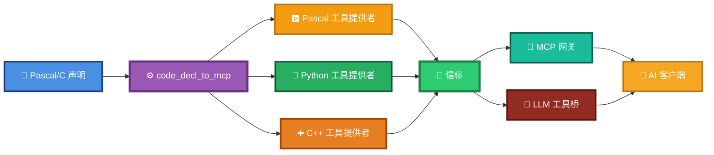
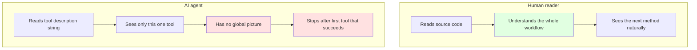

# code_decl_to_mcp 使用手册（V7.0）

> **版本**：V7.0（AI 友好版）
> **最后更新**：2026-09-22
> **适用工具**：`code_decl_to_mcp.exe`（LingoFuse-pasAgent 工具链）
>
> **本版相对 V6.0 的核心变化**：
> - **新增**第 3 章：命令行直转模式（无需 GUI）
> - **新增**第 9 章：⚠️ 给 AI 写工具描述的坑（本版重点，来自真实事故复盘）
> - **新增**第 13 章：本次工作总结（Pascal → 智能体接入全过程）
> - **强化**第 11 章：故障排查新增 5 条 AI 相关条目
> - 所有代码示例按 Console 子系统更新

---

## 0. 这份文档教什么

**把 Pascal/C 的函数声明变成 AI 能调用的工具，并接入智能体，全流程可跑通。**

完整闭环只需 6 步：

```
生成代码 → 建立工程 → 注册工具 → 启动 App → 启动智能体 → 验证接入
```

生成代码有**两条路径**：

| 路径 | 适用场景 | 章节 |
|------|---------|------|
| **GUI** | 交互式使用，看得到中间过程 | §2 |
| **命令行** | 脚本、CI、批量转换 | §3 |

> **📌 关于成熟智能体流程**
>
> 本文档描述的智能体流程已在 **[LingoFuse-pasAgent-v3](https://github.com/PassByYou888/LingoFuse-pasAgent-v3)** 中完整实现并经过验证。如果本文档中提到的工具接口不齐全，请直接到该仓库寻找——那里有**100% 可以闭环的智能体项目**，涵盖信标、工具提供者、MCP 网关、LLM 工具桥、Pascal 客户端 SDK、GUI 演示等全部组件。

---

## 1. 全景图



---

## 2. 第一步（GUI 路径）：生成代码

### 2.1 打开 `code_decl_to_mcp.exe`

### 2.2 粘贴声明

在 **2-source** Tab 中粘贴你的 Pascal 函数声明。示例：

```pascal
unit calculator;

interface

(*
  Computes the sum of two integers.

  a: first addend
  b: second addend

  Return value: this function returns an Integer representing the sum.
*)
function Add(a: Integer; b: Integer): Integer;

(*
  Computes the difference of two integers.

  a: minuend
  b: subtrahend

  Return value: this function returns an Integer representing a - b.
*)
function Sub(a: Integer; b: Integer): Integer;

implementation

function Add(a, b: Integer): Integer;
begin
  Result := a + b;
end;

function Sub(a, b: Integer): Integer;
begin
  Result := a - b;
end;

end.
```

> **注意**：注释写法必须遵守 `pascal_code_mcp_rule.md` 的规范。特别是：
> - 用 `(* ... *)`，不要用 `{ ... }`（避免 `}` 冲突）
> - 参数名必须在**行首**
> - 返回类型必须写在签名里

### 2.3 选择语言

- 点击 `sel_lang_Label` 自动检测，或手动从下拉框选择 `Pascal` / `C`。

### 2.4 走完 5 个 Tab

依次点击：

```
下一步: pascal/c -> json → 下一步: json <-> model → 下一步: 生成源码
```

### 2.5 获取生成的文件

在 **5-Final source** Tab 中：

| 标签页 | 产物 | 保存为 |
|--------|------|--------|
| `pas_TabSheet` | Pascal 工具提供者单元 | `calculator_tool_provider_unit.pas` |
| `Py_TabSheet` | Python 工具提供者模块 | `calculator_tool_provider.py` |
| `Cpp_TabSheet` | C++ 头文件 + 实现 | `calculator_tool_provider.hpp` + `.cpp` |

同时工具会自动落盘到 `<exe目录>/<UnitName>/` 下，包含 `source.pas`、`source.json`、`source_model.json` 和生成的文件。

---

## 3. 第一步（命令行路径）：直转模式

**V7.0 新增**。命令行直转功能**不需要打开 GUI**，直接从文件到文件，适合脚本、CI、批量转换。

### 3.1 查看帮助

```bash
code_decl_to_mcp.exe --help
```

输出：

```
code_decl_to_mcp - MCP tool provider code generator

USAGE
  code_decl_to_mcp                          Launch the GUI.
  code_decl_to_mcp --help                   Show this help text.
  code_decl_to_mcp <input> <output>         Convert on the command line.

SOURCE LANGUAGE (detected from the input file extension)
  .pas .pp .p                   Pascal unit
  .h .hpp .hh .c .cpp .cc .cxx  C header

TARGET LANGUAGE (detected from the output file extension)
  .pas .pp .p                   Pascal MCP tool provider unit
  .py                           Python MCP tool provider module
  .hpp .hh .h                   C++ MCP tool provider header
  .cpp .cc .cxx .c              C++ MCP tool provider implementation

C++ PAIRING
  When the target is C++, two files are written together: the
  header and the implementation. Naming either one causes the
  other to be written next to it under the same base name.

README
  A Markdown user guide is written next to the generated code
  file. Its name is the output base name plus "_readme.md".

EXAMPLES
  code_decl_to_mcp calculator.pas calculator_provider.pas
  code_decl_to_mcp ComplexTestUnit.h calculator_provider.py
  code_decl_to_mcp ComplexTestUnit.h calculator_provider.hpp

EXIT CODES
  0  Conversion succeeded.
  1  Missing or invalid arguments.
  2  Source parsing failed.
  3  Code generation failed.
  4  File I/O error.
```

### 3.2 常用命令

```bash
# C 头文件 → Python 工具提供者
code_decl_to_mcp.exe ComplexTestUnit.h calculator_provider.py

# Pascal 单元 → C++ 工具提供者（自动配对 .hpp + .cpp）
code_decl_to_mcp.exe calculator.pas calculator_provider.hpp

# Pascal 单元 → Pascal 工具提供者
code_decl_to_mcp.exe calculator.pas calculator_provider.pas
```

### 3.3 输出行为

- **C++ 目标自动配对**：命名 `.hpp` 或 `.cpp` 任意一个，两份文件都写出。
- **README 自动跟随**：生成代码旁边总有 `<base>_readme.md`。
- **无参数启动**：直接进入 GUI 模式，行为与 V6.0 一致。
- **有参数启动**：走 Console 子系统，不创建任何 UI。

### 3.4 命令行模式的技术前提

要让命令行功能正常工作，项目编译**必须**满足：

| 要求 | 配置 |
|------|------|
| 编译为 Console 子系统 | `{$apptype console}` 或 Lazarus 项目选项 "Win32 GUI application" **不勾选** |
| 主程序先调用 `Process_CommandLine` | 见下方代码 |
| 无参数时隐藏控制台窗口 | `ShowWindow(GetConsoleWindow, SW_HIDE)` |

**主程序 `code_decl_to_mcp.lpr` 的标准写法**：

```pascal
program code_decl_to_mcp;

{$DEFINE FPC_DELPHI_MODE}
{$I ..\..\..\Z.Define.inc}

{$apptype console}

uses
  mimalloc4p,
  {$IFDEF UNIX} cthreads, {$ENDIF}
  {$IFDEF HASAMIGA} athreads, {$ENDIF}
  Interfaces,
  Forms,
  code_decl_to_mcp_frm,
  pas_mcp_generator_tool,
  py_mcp_generator_tool,
  cpp_mcp_generator_tool,
  code_decl_to_mcp_api_tool_provider_unit,
  code_decl_to_mcp_cmdline;

{$R *.res}

begin
  if not Process_CommandLine then
  begin
    exitCode := CommandLine_ExitCode;
    exit;
  end;
  RequireDerivedFormResource := True;
  Application.Scaled := True;
  {$PUSH}
  {$WARN 5044 OFF}
  Application.MainFormOnTaskbar := True;
  {$POP}
  Application.Initialize;
  Application.CreateForm(TCodeDeclToMcpForm, CodeDeclToMcpForm);
  Application.Run;
end.
```

---

## 4. 第二步：建立工程

### 4.1 Pascal 路线

#### 4.1.1 创建 Lazarus 工程

新建一个 Console Application（或 GUI Application），将生成的 `calculator_tool_provider_unit.pas` 加入工程。

#### 4.1.2 填充业务实现

打开生成的单元，找到每个 `internal_call_*` 桩函数。以 `Add` 为例：

**生成的桩（占位）：**

```pascal
function internal_call_Add_Add(a: Int64; b: Int64): Int64;
begin
  Result := 0;
  // call type: Result := internal_call_Add_Add(a, b);
end;
```

**替换为真实实现：**

```pascal
function internal_call_Add_Add(a: Int64; b: Int64): Int64;
begin
  Result := a + b;
end;
```

对 `Sub` 同理。

#### 4.1.3 在宿主程序中调用

在 `program` 或主窗体中调用 `Execute_And_Reg_all()`：

```pascal
program calculator_provider;

uses
  SysUtils, calculator_tool_provider_unit;

begin
  if not Execute_And_Reg_all() then
  begin
    WriteLn('Startup failed.');
    Halt(1);
  end;
  WriteLn('Calculator provider ready. Press Enter to exit...');
  ReadLn;
  LF.ExitMainThread;
  LF.Shutdown;
end.
```

#### 4.1.4 编译

```bash
lazbuild calculator_provider.lpi
```

> **需要 `LingoFuse64.dll` 和 `z_ipc_64.dll` 在 EXE 同目录或 PATH 中。**

### 4.2 Python 路线

#### 4.2.1 填充业务实现

打开生成的 `.py` 文件，找到每个 `internal_call_*` 函数：

**生成的桩：**

```python
def internal_call_add(a: int, b: int) -> int:
    """Wrapper for the original routine 'Add'.
    TODO: replace this placeholder with the actual implementation.
    """
    if DEBUG_LOG:
        print(f"[internal_call_add] called")
    return 0
```

**替换为真实实现：**

```python
def internal_call_add(a: int, b: int) -> int:
    """计算两个整数的和。"""
    return a + b
```

#### 4.2.2 直接运行

```bash
python calculator_tool_provider.py
```

无需编译，无需 Lazarus，无需 FPC。

---

## 5. 第三步：注册工具

工具注册由 `Execute_And_Reg_all()` 自动完成，该函数依次执行：

1. **`RegisterAPIs()`** — 创建 LingoFuse 应用，把所有函数注册为 Call API。
2. **`LF_PrepareClientEx(IPC_ENDPOINT, App)`** — 连接信标。
3. **`LF_PrepareDone()`** — 等待连接就绪。
4. **`RegisterTools()`** — 把每个 API 注册为工具（携带 JSON Schema）。

**注册的 JSON 格式：**

```json
{
  "name": "add",
  "description": "Computes the sum of two integers. a: first addend b: second addend Return value: this function returns an Integer representing the sum.",
  "target_app": "calculator",
  "target_api": "add",
  "parameters": {
    "type": "object",
    "properties": {
      "a": {"type": "integer", "description": "first addend"},
      "b": {"type": "integer", "description": "second addend"}
    },
    "required": ["a", "b"]
  }
}
```

> **注意**：`description` 字段是 AI 智能体在工具发现阶段唯一能看到的信息。它的质量直接决定了 AI 是否调用你的工具。详见 §9。

---

## 6. 第四步：启动 App

**先启动信标，再启动工具提供者。**

### 6.1 启动信标

```bash
pascal_agent_service.exe
```

看到以下输出即成功：

```
[MAIN] Application "agent_main_app" created.
[MAIN] Registered APIs: agent_log, agent_main, register_agent
[MAIN] Service is running. Type "exit" to quit.
```

### 6.2 启动工具提供者

**Pascal 路线：**

```bash
calculator_provider.exe
```

**Python 路线：**

```bash
python calculator_tool_provider.py
```

看到以下输出即成功：

```
=== calculator tool provider ===
[RegisterAPIs] Application 'calculator' created
[RegisterTools] Starting registration of 2 tools...
[RegisterTool] Registering add -> calculator.add
[RegisterTool] OK: add
[RegisterTool] Registering sub -> calculator.sub
[RegisterTool] OK: sub
[RegisterTools] Registered 2 / 2
Ready. Type 'exit' and press Enter to quit.
```

> **两个工具提供者可以同时运行**——它们注册到同一个信标，注册名不同，互不冲突。

---

## 7. 第五步：启动智能体

智能体有两条路径可选。

### 7.1 路径 A：MCP 网关（客户端支持 MCP）

启动 MCP 网关：

```bash
mcp_api_tool.exe --transport stdio
```

然后在 LM Studio 等 MCP 客户端中配置：

```json
{
  "mcpServers": {
    "pascal-backend": {
      "command": "path/to/mcp_api_tool.exe",
      "args": ["--transport", "stdio"]
    }
  }
}
```

> **MCP 客户端在 `mcp_api_tool` 启动时自动创建，无需手动干预。**

### 7.2 路径 B：LLM 工具桥（客户端不感知工具）

启动 LLM 工具桥：

```bash
llm_proxy_tool.exe --backend-url http://127.0.0.1:1234/v1
```

客户端只需调用 `generate`，LTB 内部自动完成工具调用循环。

> **客户端零改动**——完全不知道工具体系的存在。

---

## 8. 第六步：验证接入

### 8.1 路径 A 验证

在 LM Studio 中提问：

```
请帮我计算 5 + 7
```

AI 会自动调用 `add` 工具并返回结果 `12`。

### 8.2 路径 B 验证

用 `llm_test.py` 或 Pascal 客户端：

```bash
llm_test.exe --content "请帮我计算 5 + 7"
```

AI 返回 `5 + 7 = 12`，工具调用过程对客户端完全透明。

### 8.3 直接调用工具验证

用 `llm_test.exe` 的交互模式：

```bash
llm_test.exe
```

输入：

```
/add a=5 b=7
```

应返回 `{"result": 12}`。

---

## 9. ⚠️ 给 AI 写工具描述的坑（**本版重点**）

> **本章来自真实事故复盘。作者做了一套完整的 RPC 工具，暴露给 AI 智能体。智能体只调用了第一个工具 `SetSourceCode`，就停下来反复问"接下来做什么"。连续三轮修改注释才让它正常工作。本节把这个坑讲清楚，避免后人重蹈覆辙。**
>
> **如果你只读本文档的一章，请读这一章。**

### 9.1 事故经过

**工具设计**：三个工具组成的生成流水线。

| 工具 | 作用 |
|------|------|
| `SetSourceCode(Source, Language)` | 存储源码和语言 |
| `ConvertToPythonMCP()` | 执行转换，返回生成文件路径 |
| `GetLastPythonCode()` | 读取生成内容 |

**预期行为**：智能体依次调用三者。

**实际行为**：

- **第一轮**：智能体只调用 `SetSourceCode`，返回 `{"status":"ok"}` 后停下，说"源码已存储，请告诉我接下来做什么"。
- **第二轮**：修复第一轮后，智能体调用了 `SetSourceCode` + `ConvertToCppMCP`，但**尝试用 `Language='python'` 调用 `SetSourceCode`**，理由是"要生成 Python 就要设置 Python 语言"。
- **第三轮**：修复歧义后，智能体正确完成三步调用。

**事故成本**：三轮反复修改注释，每轮都要重新生成 provider、重启信标、重新测试。

### 9.2 根本原因：人和 AI 读注释的方式完全不同



| 维度 | 人类读源码 | AI 读工具描述 |
|------|-----------|--------------|
| 阅读范围 | 整个单元，所有方法 | **一个工具的描述字符串** |
| 上下文 | 有完整的类型、命名、注释 | **只有工具名 + 描述 + 参数 schema** |
| 理解方式 | 从整体到局部 | **逐个工具独立判断** |
| 决策依据 | "看起来这是一系列操作" | **"这个工具的目的是什么，它完成了吗？"** |

**关键事实**：**智能体在工具发现阶段读到的不是你的源码注释，而是 JSON 里的 `description` 字符串**——它是源码注释经过**压缩、去标签、截断到 200 字符**后的产物。

### 9.3 坑一：注释没写清"我是工作流的第几步"

**错误示例**（真实事故的原始注释）：

```pascal
(*
  Set the source code and the source language for the next conversion.
  ...
*)
function SetSourceCode(Source: string; Language: string): string;
```

**为什么失败**："for the next conversion" 只暗示"后面还有事情"，但**没有说明后面是哪一个工具**，也没有说明"不调用它会发生什么"。

**正确示例**（修复后）：

```pascal
(*
  Set the source code and the source language for the next conversion.

  IMPORTANT: this call ONLY stores the source text and language into the
  generator. It does NOT perform any conversion. After this call succeeds,
  you MUST invoke one of the conversion tools to actually produce code:

      ConvertToPascalMCP   -> generate a Pascal MCP tool provider
      ConvertToPythonMCP   -> generate a Python MCP tool provider
      ConvertToCppMCP      -> generate a C++ MCP tool provider

  A typical workflow is:

      1. SetSourceCode({Source, Language})
      2. ConvertToPythonMCP()
      3. GetLastPythonCode() / GetLastPythonReadme()
*)
function SetSourceCode(Source: string; Language: string): string;
```

**关键改动**：

| 新增内容 | 作用 |
|---------|------|
| `IMPORTANT: ... does NOT perform any conversion` | 明确工具边界，让 AI 知道"我还没完" |
| `you MUST invoke one of the conversion tools` | 直接给出下一步的命令 |
| 完整的三步序列示例 | 让 AI 一眼看到全貌 |

### 9.4 坑二：参数名有歧义，AI 当成相反的语义

**错误示例**：`SetSourceCode(Source, Language)` 的 `Language` 参数。AI 把 `Language` 理解为**目标语言**，尝试传 `Language='python'`。

**正确示例**（修复后）：

```pascal
(*
  ...
  Language: source language identifier. Accepted values are:
            pascal   the source text is a Pascal unit
            c        the source text is a C header

  Do NOT pass a target language such as 'python' or 'cpp'.
  Target language is selected by calling one of the conversion
  tools (ConvertToPythonMCP, ConvertToCppMCP, ...) in Step 2.
  ...
*)
function SetSourceCode(Source: string; Language: string): string;
```

**通用规则**：

1. **参数名带歧义时，在参数描述的第一句就消除歧义**。
2. **给出完整的合法值列表，并明确列出非法值示例**。
3. **指出哪个工具负责"相反语义"**。

### 9.5 坑三：多处歧义会让 AI 跑偏一整轮

**教训**：注释升级是**多层认知**的过程。

| 层级 | 认知 | 对应修复 |
|:----:|------|---------|
| 第一层 | 让 AI 知道"还有下一步" | 加 WORKFLOW OVERVIEW |
| 第二层 | 让 AI 知道"每一步的具体工具名" | 加决策表 |
| 第三层 | 让 AI 知道"哪个参数是源语言、哪个是目标语言" | 加参数歧义消除 + 反例表 |

**每次认知升级都需要重新审视每一处描述**——一处歧义会让 AI 跑偏一整轮。

### 9.6 给 AI 写工具描述的四件武器

#### 武器 1：每个工具都独立回答三个问题


**示例**：

| 工具 | 角色 | 前置条件 | 产出 |
|------|------|---------|------|
| `SetSourceCode` | Step 1 存源码 | 无 | `{"status":"ok"}`，**不产生文件** |
| `ConvertToPythonMCP` | Step 2 Python 分支 | **必须先 SetSourceCode** | `{"result":"<文件路径>"}` |
| `GetLastPythonCode` | Step 3 读取内容 | **必须先 ConvertToPythonMCP** | 生成代码的完整文本 |

#### 武器 2：决策表（让 AI 一眼看到"我要做什么"）

放在**单元头注释**里，AI 读单元文档时能看到全局视图：

```pascal
(*
  WHAT YOU WANT  ->  WHICH TOOLS TO CALL
  --------------------------------------

      Want Python code ?      SetSourceCode -> ConvertToPythonMCP
                                              -> GetLastPythonCode

      Want Python README ?    SetSourceCode -> ConvertToPythonMCP
                                              -> GetLastPythonReadme

      Want Pascal code ?      SetSourceCode -> ConvertToPascalMCP
                                              -> GetLastPascalCode

      Want C++ header ?       SetSourceCode -> ConvertToCppMCP
                                              -> GetLastCppHeader
*)
```

#### 武器 3：反例表（把常见错误方案堵死）

```pascal
(*
  COMMON MISTAKES TO AVOID
  ------------------------

      WRONG   SetSourceCode(Source, "python")
              - python is not a source language
      RIGHT   SetSourceCode(Source, "c")
              ConvertToPythonMCP

      WRONG   Stop after SetSourceCode and expect a file
      RIGHT   Always follow SetSourceCode with one ConvertToXxxMCP

      WRONG   Call SetSourceCode again before GetLastPythonReadme
      RIGHT   GetLastPythonReadme reads what ConvertToPythonMCP produced
*)
```

**为什么有效**：AI 在做决策时，如果看到一个 "WRONG" 示例**恰好匹配它正在考虑的做法**，它会立即规避。**这比正面描述更直接**。

#### 武器 4：把关键信息放前 200 字符

`GetFullDescription(Comment)` 会**截断到 200 字符**。所以：

1. **源码注释的前 200 字符必须覆盖关键信息**——特别是"工作流角色"和"前置条件"。
2. **`RegisterTools` 中的 `description` 字符串可以手工覆盖**——不被 200 字符限制。推荐在 provider 生成后手工调整，或用模板让生成器直接产出长描述。
3. **把工作流决策表写进单元头注释**——这样即使单个工具的描述被截断，AI 读单元文档时也能拿到全局视图。

### 9.7 智能体描述自检清单（10 项）

暴露工具给 AI 前，逐项核对：

| # | 检查项 | 不通过的动作 |
|:-:|--------|--------------|
| 1 | 单元头注释是否写出了完整工作流？ | 补一段 WORKFLOW OVERVIEW |
| 2 | 每个工具描述是否独立回答"角色/前置/产出"三问？ | 补三角色标签 |
| 3 | 多步工作流的每个工具是否都指明了"下一步工具名"？ | 在工具描述里写出下一步的工具名 |
| 4 | 是否有一张"用户意图 → 工具链"决策表？ | 加决策表 |
| 5 | 是否有 "COMMON MISTAKES TO AVOID" 反例表？ | 加反例表 |
| 6 | 参数名有歧义时是否在参数描述第一句消除了歧义？ | 在参数描述里显式说明 |
| 7 | 是否列出了合法值列表 + 非法值示例？ | 补全列表 |
| 8 | 前 200 字符是否覆盖了最关键的信息？ | 把关键信息前移 |
| 9 | `RegisterTools` 中的 `description` 是否比 200 字符更长？（如果必要） | 手工覆盖为长描述 |
| 10 | 测试用例是否包含"让 AI 从零完成一次完整工作流"？ | 补测试用例 |

**如果全部通过**，AI 应该能独立完成整个工作流。

### 9.8 智能体友好型注释模板（单元头）

```pascal
(*
  <UnitName>

  <一段话说明这个单元的作用>

  WORKFLOW OVERVIEW
  -----------------
  <描述这个单元暴露的工具之间存在什么关系，例如"三步工作流">

      Step 1  <ToolA>   <作用>
      Step 2  <ToolB>   <作用>
      Step 3  <ToolC>   <作用>

  WHAT YOU WANT  ->  WHICH TOOLS TO CALL
  --------------------------------------
      Want X ?   <ToolA> -> <ToolB>
      Want Y ?   <ToolA> -> <ToolC>

  COMMON MISTAKES TO AVOID
  ------------------------
      WRONG   <错误方案>
      RIGHT   <正确方案>
*)
unit <UnitName>;

interface

(*
  Step 1 of the workflow. <作用>

  IMPORTANT: this call does NOT <副作用>. After this call succeeds you
  MUST invoke <ToolB> or <ToolC>.

  Prerequisite: None.

  <参数说明>

  Return value: <返回结构>
*)
function <ToolA>(...): string;

(*
  Step 2 of the workflow. <作用>.

  Prerequisite: <ToolA> must have been called successfully in the same
  session. If not, this call returns an error.

  <参数说明>

  Return value: <返回结构>
*)
function <ToolB>: string;

(*
  Step 3 of the workflow. Read the content produced by <ToolB>. This is
  a pure reader: it never triggers a new conversion and never requires
  <ToolA> to be called again.

  Prerequisite: <ToolB> must have been called successfully.

  Return value: <返回结构>
*)
function <ToolC>: string;

implementation
...
```

### 9.9 结语

> **给人类写注释和给 AI 写注释是两种技能。** 人类能读源码、能跳转、能理解上下文；AI 读的是一个**孤立的描述字符串**。**只有把完整的上下文塞进每一条描述，AI 才能正确工作。**
>
> 本次事故的三轮修复分别对应三层认知：
>
> 1. **第一层**：让 AI 知道"还有下一步"。
> 2. **第二层**：让 AI 知道"每一步的具体工具名"。
> 3. **第三层**：让 AI 知道"哪个参数是源语言、哪个是目标语言"，并给出正反例对照。
>
> 每次认知升级都需要**重新审视每一处描述**——一处歧义会让 AI 跑偏一整轮。

---

## 10. 完整操作清单

| 步骤 | 操作 | 命令/配置 |
|:----:|------|-----------|
| 1 | 生成代码（GUI） | `code_decl_to_mcp.exe` → 5 个 Tab |
| 1' | 生成代码（命令行） | `code_decl_to_mcp.exe input.pas output.py` |
| 2 | 建立工程 | Pascal: 创建 Lazarus 工程 + 填充 `internal_call_*`<br>Python: 填充 `internal_call_*` |
| 3 | 注册工具 | 自动完成，由 `Execute_And_Reg_all()` 驱动 |
| 4 | 启动信标 | `pascal_agent_service.exe` |
| 5 | 启动工具提供者 | `calculator_provider.exe` 或 `python calculator_tool_provider.py` |
| 6 | 启动智能体 | 路径 A: `mcp_api_tool.exe`<br>路径 B: `llm_proxy_tool.exe` |
| 7 | 验证 | LM Studio 提问 或 `llm_test.exe --content "5+7"` |
| **8** | **AI 描述审查** | **对照 §9.7 清单逐项核对** |

---

## 11. 故障排查

### 11.1 常规问题

| 现象 | 原因 | 解决 |
|------|------|------|
| `RegisterTool` 报 `Beacon not available` | 信标未启动 | 先启动 `pascal_agent_service.exe` |
| `LF_PrepareDone returned 0` | 二次调用 | 检查初始化顺序，确保只调用一次 |
| AI 不调工具（路径 A） | MCP 配置错误 | 检查 `mcp.json` 的 `command` 和 `args` |
| AI 不调工具（路径 B） | `--enable-tools` 未开 | 移除 `--no-tools` |
| 工具被跳过 | 类型不支持 | 确认参数类型是 `int64` / `double` / `string` |
| Python 报 `UnboundLocalError` | 使用了旧版生成器 | 升级 `code_decl_to_mcp.exe` |
| 中文变 `?` | 使用了旧版生成器 | 升级 `code_decl_to_mcp.exe` |

### 11.2 AI 相关问题（V7.0 新增）

| 现象 | 原因 | 解决 |
|------|------|------|
| **AI 只调用第一个工具就停下** | **工具描述没写清"我是工作流第几步"** | 见 §9.3 |
| **AI 尝试用错误的参数值（如 `Language='python'`）** | **参数名有歧义，注释未消除** | 见 §9.4 |
| **AI 反复调用同一个工具** | **工具描述没写清前置条件** | 见 §9.6 武器 1 |
| **AI 不知道要生成什么，反复问用户** | **缺决策表** | 见 §9.6 武器 2 |
| **AI 明明看到错误提示却继续做错** | **缺反例表** | 见 §9.6 武器 3 |
| **修改注释后 AI 行为没变** | **`RegisterTools` 里的 `description` 是硬编码字符串，不是从注释动态取的** | 重新运行 provider 生成器，或手工修改 `RegisterTools` |
| **`description` 被截断到 200 字符，关键信息丢失** | **`GetFullDescription` 的硬性限制** | 把关键信息前移，或手工覆盖 `RegisterTools` 的 description |

### 11.3 命令行问题（V7.0 新增）

| 现象 | 原因 | 解决 |
|------|------|------|
| **`--help` 后需要敲回车才退出** | **项目编译为 GUI 子系统** | 加 `{$apptype console}`，或 Lazarus 项目选项取消勾选 "Win32 GUI application" |
| **命令行模式下什么都不输出** | **`DoStatus` 走队列，无主循环** | 替换 `OnDoStatusHook` 为直接写 stdout 的钩子 |
| **双击 exe 时闪黑窗** | **Console 子系统启动时分配控制台** | 无参数时调 `ShowWindow(GetConsoleWindow, SW_HIDE)` |
| **`echo $LASTEXITCODE` 拿不到退出码** | **进程异步退出** | Console 子系统下进程同步退出，退出码正常 |

---

## 12. 相关文档

| 文档 | 说明 |
|------|------|
| `pascal_code_mcp_rule.md` | Pascal 声明规范（含 §12 AI 工具描述规范） |
| `C_code_mcp_rule.md` | C 声明规范 |
| `MCP_API_Contract.md` | 接口契约 |
| `code_decl_to_mcp_knowledge_base.md` | 工具链知识库 |
| `LingoFuse_LLM_Ecosystem_User_Guide.md` | 生态总览 |
| `LingoFuse_LLM_Proxy_Tool_CLI_Guide.md` | LTB 命令行手册 |

---

## 13. 附录：本次工作总结（Pascal → 智能体接入全过程）

> **本章记录 2026-09-22 一次完整接入的全过程。包括：做了什么、遇到什么坑、怎么解决、有什么可复用的经验。供后人参考。**

### 13.1 工作目标

把 `code_decl_to_mcp` 的代码生成能力，通过 LingoFuse + MCP 暴露给 AI 智能体，同时提供命令行直转接口。

### 13.2 交付物

| 文件 | 类型 | 说明 |
|------|------|------|
| `code_decl_to_mcp_api.pas` | 声明 | MCP 工具 API 契约（11 个工具） |
| `code_decl_to_mcp_api_tool_provider_unit.pas` | 生成 | 由声明自动生成的 provider |
| `code_decl_to_mcp_cmdline.pas` | 实现 | 命令行前端 |
| `code_decl_to_mcp.lpr` | 主程序 | Console 子系统，支持 GUI/CLI 双模 |
| `pascal_code_mcp_rule.md` v9.0 | 文档 | 声明规范（含 AI 工具描述规范） |
| `code_generate_mcp.md` v7.0 | 文档 | 本手册 |

### 13.3 暴露的 11 个 MCP 工具

| 工具 | 角色 | 前置条件 | 产出 |
|------|------|---------|------|
| `SetSourceCode` | Step 1 | 无 | `{"status":"ok"}` |
| `ConvertToPascalMCP` | Step 2 (Pascal) | SetSourceCode | `{"result":"<路径>"}` |
| `ConvertToPythonMCP` | Step 2 (Python) | SetSourceCode | `{"result":"<路径>"}` |
| `ConvertToCppMCP` | Step 2 (C++) | SetSourceCode | `{"result":"<路径>"}` |
| `GetLastPascalCode` | Step 3 | ConvertToPascalMCP | 代码全文 |
| `GetLastPascalReadme` | Step 3 | ConvertToPascalMCP | README 全文 |
| `GetLastPythonCode` | Step 3 | ConvertToPythonMCP | 代码全文 |
| `GetLastPythonReadme` | Step 3 | ConvertToPythonMCP | README 全文 |
| `GetLastCppHeader` | Step 3 | ConvertToCppMCP | 头文件全文 |
| `GetLastCppImpl` | Step 3 | ConvertToCppMCP | 实现全文 |
| `GetLastCppReadme` | Step 3 | ConvertToCppMCP | README 全文 |

### 13.4 遇到的坑与解决

#### 坑一：AI 只调用 `SetSourceCode` 就停下

**症状**：AI 只调用 `SetSourceCode`，返回 `{"status":"ok"}` 后就停下，说"源码已存储，请告诉我接下来做什么"。

**根因**：`SetSourceCode` 描述太简短——只说"设置源码，供下次转换使用"，没有明确指出：
- 这是一个三步工作流的第一步
- 后续必须调用 `ConvertToXxxMCP`
- 它自己不产生任何输出文件

**修复**：在 `SetSourceCode` 注释里加 `IMPORTANT: does NOT perform any conversion. You MUST invoke one of the conversion tools.`，并给出完整的三步序列示例。

**教训**：**给 AI 的工具描述必须让每个工具"自解释"——单独看它就能理解"我在工作流中的角色、前置条件、产出"。**

#### 坑二：AI 把 `Language` 当成目标语言

**症状**：修复坑一后，AI 开始调用 `ConvertToCppMCP`，但同时尝试用 `Language='python'` 调用 `SetSourceCode`。

**根因**：`SetSourceCode(Source, Language)` 的 `Language` 参数**有歧义**。

**修复**：
1. 参数描述第一句明确："`Language` is the SOURCE language"
2. 列出合法值 `pascal` / `c`，并指出 `python` 不是合法值
3. 加 WHAT YOU WANT 决策表
4. 加 COMMON MISTAKES 反例表

**教训**：**参数名有歧义时，在参数描述第一句就消除歧义，并给出正反例对照。**

#### 坑三：命令行模式 `--help` 需要敲回车

**症状**：`code_decl_to_mcp.exe --help` 在 PowerShell 里输出后，需要按一次回车才返回提示符。

**根因**：项目是 GUI 子系统程序，Windows 启动后立即让父 shell 返回，PowerShell 抢在输出前就打印了下一个提示符。

**修复**：
1. 把项目改成 **Console 子系统**（`{$apptype console}`）
2. 无参数时用 `ShowWindow(GetConsoleWindow, SW_HIDE)` 隐藏黑窗
3. 命令行模式下所有输出走 `WriteLn`

**教训**：**GUI+CLI 双模程序必须编译为 Console 子系统，无参数启动时手动隐藏控制台窗口。**

#### 坑四：`DoStatus` 在命令行模式下不输出

**症状**：把 `WriteLn` 改成 `DoStatus` 后，命令行模式下什么都不输出。

**根因**：`DoStatus` 默认走"入队 + 主线程 CheckDoStatus"路径，需要 LCL 主循环驱动。

**修复**：在 `Process_CommandLine` 里替换 `OnDoStatusHook` 为直接写 stdout 的钩子：

```pascal
OnDoStatusHook := @CmdLine_DoStatus_Hook;
```

**教训**：**`DoStatus` 依赖主循环，命令行模式下必须替换 hook。**

#### 坑五：`internal_call_*` 的线程同步

**症状**：直接调用 `CodeDeclToMcpForm.ParseSourceToLv0Json` 会崩溃。

**根因**：MCP 回调运行在 C4 后台线程，操作 LCL 控件必须在主线程。

**修复**：用 `TCompute.Sync` 把 UI 操作排队到主线程：

```pascal
{$IFDEF FPC}
  procedure Do_Sync___();
  begin
    Result := ...;  // FPC 直接修改外层 Result
  end;
begin
  TCompute.Sync(Do_Sync___);
{$ELSE FPC}
var temp_: string;
begin
  TCompute.Sync(procedure()
  begin
    temp_ := ...;  // Delphi 需要 temp_ 中转
  end);
  Result := temp_;
{$ENDIF FPC}
```

**教训**：**FPC 的嵌套过程能直接访问外层 `Result`，Delphi 的匿名过程不能——需要用 `temp_` 中转。**

### 13.5 可复用的经验

#### 给 AI 写工具描述的通用规则

1. **每个工具独立回答三问**：角色 / 前置 / 产出
2. **多步工作流的每个工具都写出下一步工具名**
3. **加决策表**：用户意图 → 工具链
4. **加反例表**：WRONG / RIGHT 对照
5. **参数名有歧义时第一句消除歧义**
6. **列出合法值和非法值示例**
7. **关键信息前移到前 200 字符**
8. **测试用例覆盖"从零完成一次完整工作流"**

#### GUI+CLI 双模程序的关键配置

1. **`{$apptype console}`** —— 编译为 Console 子系统
2. **无参数时 `ShowWindow(GetConsoleWindow, SW_HIDE)`**
3. **`Process_CommandLine` 返回 `True`/`False` 决定走向**
4. **命令行模式下用 `Flush(Output)` 保证输出完整**

#### MCP 回调的线程安全

1. **回调运行在 C4 后台线程**
2. **UI 操作必须 `TCompute.Sync` 到主线程**
3. **FPC 用嵌套过程，Delphi 用匿名过程 + `temp_`**
4. **回调不释放 `_In` / `_Out`**

### 13.6 一句话总结

> **给 AI 写工具描述，是"把整个工作流压缩成 200 字符"的艺术。每个工具都必须独立回答"我在哪、我之前应该做什么、我之后应该做什么"。一处歧义会让 AI 跑偏一整轮。这是本次工作最大的收获，也是 V7.0 手册 §9 的核心价值。**

---

**文档版本**：V7.0（AI 友好版）
**维护者**：LingoFuse-pasAgent 团队
**反馈**：问题提 Issue，急事加 Q（600585）
