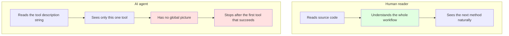
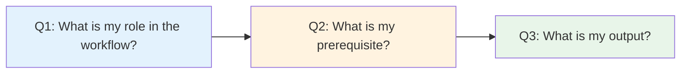

# code_decl_to_mcp User Manual (V8.0)

> **Version**: V8.0 (AI-friendly edition)
> **Last updated**: 2026-09-24
> **Applies to**: `code_decl_to_mcp.exe` (LingoFuse-pasAgent toolchain)
>
> **What's new in V8.0 over V7.0**:
> - **New Chapter 3**: Command-line guide (full CLI reference)
> - **New Chapter 4**: Agent MCP-API guide (how an agent drives the 11 MCP tools)
> - **New Chapter 5**: GUI operation guide (tab-by-tab, control-by-control)
> - **New Chapter 6**: Programmatic interface (embed the generator in your own tools)
> - **New Chapter 7**: ⚠️ Read the generated `.md` files first (the real deliverable: test programs, interface code, **C++ CMake scripts**)
> - **Chapter 10 (was Ch. 9 in V7.0)**: ⚠️ Writing tool descriptions for AI — **THE MOST IMPORTANT CHAPTER**
> - All code examples are updated for the Console subsystem
> - The description authoring rules are tightened: **comments are the key to MCP being called correctly**

---

## 0. What This Document Teaches

**Turn Pascal/C function declarations into AI-callable tools and wire them into an agent — the whole closed loop, end to end.**

The complete loop takes **8 steps**:

```
Generate → Build → Register → Start beacon → Start provider → Start agent → Verify → Audit the AI descriptions
```

Code generation has **three paths**:

| Path | Use case | Chapter |
|------|----------|---------|
| **GUI** | Interactive use, see intermediate steps | §5 |
| **CLI** | Scripts, CI, batch conversion | §3 |
| **MCP-API** | Remote invocation by an AI agent | §4 |

> **📌 About the mature agent workflow**
>
> The agent workflow described in this document is fully implemented and verified in **[LingoFuse-pasAgent-v3](https://github.com/PassByYou888/LingoFuse-pasAgent-v3)**. If any tool interface mentioned here is incomplete, look in that repository — it contains a **100% closed-loop agent project**, covering the beacon, tool providers, MCP gateway, LLM tool bridge, Pascal client SDK, GUI demos, and every other component.

---

## 1. Overview

```mermaid
flowchart LR
    A["📄 Pascal/C declaration"] --> B["⚙️ code_decl_to_mcp"]
    B --> C1["🅿️ Pascal tool provider"]
    B --> C2["🐍 Python tool provider"]
    B --> C3["➕ C++ tool provider"]
    B --> MD["📘 Generated .md companions<br/>(test code, interface code,<br/>CMake scripts)"]
    C1 --> D["📡 Beacon"]
    C2 --> D
    C3 --> D
    D --> E1["🌉 MCP gateway"]
    D --> E2["🔴 LLM tool bridge"]
    E1 --> F["🤖 AI client"]
    E2 --> F

    style A fill:#4A90E2,stroke:#1E3A8A,stroke-width:3px,color:#FFFFFF
    style B fill:#9B59B6,stroke:#6C3483,stroke-width:4px,color:#FFFFFF
    style C1 fill:#F39C12,stroke:#B7791F,stroke-width:3px,color:#FFFFFF
    style C2 fill:#27AE60,stroke:#145A32,stroke-width:3px,color:#FFFFFF
    style C3 fill:#E67E22,stroke:#A04000,stroke-width:3px,color:#FFFFFF
    style MD fill:#1A5490,stroke:#0D2F52,stroke-width:4px,color:#FFFFFF
    style D fill:#2ECC71,stroke:#1E8449,stroke-width:4px,color:#FFFFFF
    style E1 fill:#1ABC9C,stroke:#0E6251,stroke-width:3px,color:#FFFFFF
    style E2 fill:#922B21,stroke:#5A1A14,stroke-width:3px,color:#FFFFFF
    style F fill:#F5A623,stroke:#B7791F,stroke-width:3px,color:#FFFFFF
```



Two things to internalize before going further:

1. **The `.md` companions are the real deliverable for building the artifacts.** The generated `.pas` / `.py` / `.hpp` / `.cpp` are skeletons; the paired `.md` file tells you how to build, test, and deploy each one — including the **C++ CMake script**. See Chapter 7.
2. **Comments are the key to MCP being called correctly.** An AI agent reads your comments (compressed into the tool `description` field) and decides whether to call your tool. If the description is ambiguous, the agent will stall, call the wrong tool, or pass wrong arguments. See Chapter 10.

---

## 2. The 8-Step Workflow

```
Step 1  Generate code            ──── §3 (CLI) / §4 (MCP) / §5 (GUI)
Step 2  Build the provider       ──── §6, using the generated .md
Step 3  Fill in internal_call_*  ──── §6, using the generated .md
Step 4  Register the tool        ──── automatic via Execute_And_Reg_all
Step 5  Start the beacon         ──── pascal_agent_service.exe
Step 6  Start the provider       ──── <your_provider>.exe
Step 7  Start the agent          ──── mcp_api_tool.exe or llm_proxy_tool.exe
Step 8  Audit AI descriptions    ──── §10 — THE MOST IMPORTANT STEP
```

Step 8 is not optional. An agent that calls your tools incorrectly is almost always an agent that was given ambiguous descriptions.

---

## 3. Command-Line Guide

The command-line mode **does not open the GUI**. It goes straight from file to file, suitable for scripts, CI, and batch conversion.

### 3.1 Trigger

- **No arguments** → the GUI launches.
- **At least one argument** → the console subsystem takes over; no UI is created.

### 3.2 Syntax

```bash
code_decl_to_mcp.exe --help
code_decl_to_mcp.exe <input> <output>
```

### 3.3 Help text

```
code_decl_to_mcp - MCP tool provider code generator

USAGE
  code_decl_to_mcp                          Launch the GUI.
  code_decl_to_mcp --help                   Show this help text.
  code_decl_to_mcp <input> <output>         Convert on the command line.

SOURCE LANGUAGE (detected from the input file extension)
  .pas .pp .p                   Pascal unit
  .h .hpp .hh .c .cpp .cc .cxx  C header

TARGET LANGUAGE (detected from the output file extension)
  .pas .pp .p                   Pascal MCP tool provider unit
  .py                           Python MCP tool provider module
  .hpp .hh .h                   C++ MCP tool provider header
  .cpp .cc .cxx .c              C++ MCP tool provider implementation

C++ PAIRING
  When the target is C++, two files are written together: the
  header and the implementation. Naming either one causes the
  other to be written next to it under the same base name.

README
  A Markdown user guide is written next to the generated code
  file. Its name is the output base name plus "_readme.md".

EXAMPLES
  code_decl_to_mcp calculator.pas calculator_provider.pas
  code_decl_to_mcp ComplexTestUnit.h calculator_provider.py
  code_decl_to_mcp ComplexTestUnit.h calculator_provider.hpp

EXIT CODES
  0  Conversion succeeded.
  1  Missing or invalid arguments.
  2  Source parsing failed.
  3  Code generation failed.
  4  File I/O error.
```

### 3.4 Common commands

```bash
# C header → Python tool provider
code_decl_to_mcp.exe ComplexTestUnit.h calculator_provider.py

# Pascal unit → C++ tool provider (auto-pairs .hpp + .cpp)
code_decl_to_mcp.exe calculator.pas calculator_provider.hpp

# Pascal unit → Pascal tool provider
code_decl_to_mcp.exe calculator.pas calculator_provider.pas
```

### 3.5 Output behavior

- **C++ targets auto-pair**: naming either `.hpp` or `.cpp` causes both files to be written.
- **README auto-follows**: `<base>_readme.md` is always written next to the generated code. **This is the file you need for the build/test details.** See Chapter 7.
- **No arguments → GUI**: behavior identical to V6.0.
- **With arguments → Console**: no UI is created.

### 3.6 The technical requirements for CLI mode

For CLI mode to work correctly, the project build **must** satisfy:

| Requirement | Configuration |
|-------------|---------------|
| Build as Console subsystem | `{$apptype console}`, or in Lazarus uncheck the "Win32 GUI application" project option |
| Main program calls `Process_CommandLine` first | See the code below |
| Hide the console window when there are no arguments | `ShowWindow(GetConsoleWindow, SW_HIDE)` |

**Standard `code_decl_to_mcp.lpr`**:

```pascal
program code_decl_to_mcp;

{$DEFINE FPC_DELPHI_MODE}
{$I ..\..\..\Z.Define.inc}

{$apptype console}

uses
  mimalloc4p,
  {$IFDEF UNIX} cthreads, {$ENDIF}
  {$IFDEF HASAMIGA} athreads, {$ENDIF}
  Interfaces,
  Forms,
  code_decl_to_mcp_frm,
  pas_mcp_generator_tool,
  py_mcp_generator_tool,
  cpp_mcp_generator_tool,
  code_decl_to_mcp_api_tool_provider_unit,
  code_decl_to_mcp_cmdline;

{$R *.res}

begin
  if not Process_CommandLine then
  begin
    exitCode := CommandLine_ExitCode;
    exit;
  end;
  RequireDerivedFormResource := True;
  Application.Scaled := True;
  {$PUSH}
  {$WARN 5044 OFF}
  Application.MainFormOnTaskbar := True;
  {$POP}
  Application.Initialize;
  Application.CreateForm(TCodeDeclToMcpForm, CodeDeclToMcpForm);
  Application.Run;
end.
```

### 3.7 CLI output

In CLI mode, all `DoStatus` output goes to stdout via a **custom hook** (the default `DoStatus` path requires the LCL main loop, which does not exist in CLI mode):

```pascal
procedure CmdLine_DoStatus_Hook(Text_: SystemString; const ID: Integer);
begin
  WriteLn(Text_);
end;
```

Typical output:

```
Reading: ComplexTestUnit.h (1234 chars)
Output : calculator_provider.py
Mode   : provider
Unit   : ComplexTestUnit
Funcs  : 28
Saved  : calculator_provider.py
Saved  : calculator_provider_readme.md
Done.
```

On error, a diagnostic is printed and a non-zero exit code is returned.

### 3.8 Exit codes

| Exit code | Meaning |
|:---------:|---------|
| `0` | Conversion succeeded |
| `1` | Missing or invalid arguments |
| `2` | Source parsing failed |
| `3` | Code generation failed |
| `4` | File I/O error |

### 3.9 What CLI mode does **not** do

- **Does not start the beacon.**
- **Does not start the tool provider.**
- **Does not register any tools.**
- **Does not open any network connection.**

The CLI produces artifacts. Wiring them up is done in Chapter 6 (build), Chapter 8 (runtime), and Chapter 4 (agent).

---

## 4. Agent MCP-API Guide

An agent can drive the entire generator through the 11 MCP tools exposed by `code_decl_to_mcp_api_tool_provider_unit.pas`. This section documents those tools and how an agent should sequence them.

### 4.1 Requirements

- The GUI is running (the MCP provider lives inside the GUI's process).
- A beacon service is online (`agent_main_app` by default).
- Both use the same LingoFuse endpoint (`ipc:agent` by default).

### 4.2 The 11 tools

| Tool | Role | Prerequisite | Output |
|------|------|-------------|--------|
| `SetSourceCode` | Step 1 — store source and source language | none | `{"status":"ok"}` |
| `ConvertToPascalMCP` | Step 2 — Pascal branch | `SetSourceCode` must have succeeded | `{"result":"<path>"}` |
| `ConvertToPythonMCP` | Step 2 — Python branch | `SetSourceCode` must have succeeded | `{"result":"<path>"}` |
| `ConvertToCppMCP` | Step 2 — C++ branch | `SetSourceCode` must have succeeded | `{"result":"<path>"}` |
| `GetLastPascalCode` | Step 3 — read Pascal unit | `ConvertToPascalMCP` | full code text |
| `GetLastPascalReadme` | Step 3 — read Pascal README | `ConvertToPascalMCP` | full README text |
| `GetLastPythonCode` | Step 3 — read Python module | `ConvertToPythonMCP` | full code text |
| `GetLastPythonReadme` | Step 3 — read Python README | `ConvertToPythonMCP` | full README text |
| `GetLastCppHeader` | Step 3 — read C++ header | `ConvertToCppMCP` | header text |
| `GetLastCppImpl` | Step 3 — read C++ implementation | `ConvertToCppMCP` | implementation text |
| `GetLastCppReadme` | Step 3 — read C++ README | `ConvertToCppMCP` | README text |

The three-step shape is uniform: **Step 1 stores state; Step 2 produces artifacts; Step 3 reads them.**

### 4.3 Recommended call sequences

**Minimum (Python service, then read the code and README)**:

```
1. SetSourceCode(Source=<the Pascal unit or C header text>, Language="pascal" | "c")
2. ConvertToPythonMCP()
3. GetLastPythonCode()
4. GetLastPythonReadme()    ← ⚠️ read this first for build/run instructions
```

**One source, multiple targets**:

```
1. SetSourceCode(Source=<text>, Language="c")
2. ConvertToPascalMCP()
3. ConvertToPythonMCP()
4. ConvertToCppMCP()
5. GetLastPascalCode()      + GetLastPascalReadme()
6. GetLastPythonCode()      + GetLastPythonReadme()
7. GetLastCppHeader()       + GetLastCppImpl() + GetLastCppReadme()
```

**C++ only, minimal**:

```
1. SetSourceCode(<text>, "pascal")
2. ConvertToCppMCP()
3. GetLastCppHeader()
4. GetLastCppImpl()
5. GetLastCppReadme()       ← ⚠️ this one has the CMake script
```

### 4.4 Return value shapes

`SetSourceCode` success:
```json
{"status":"ok"}
```

`SetSourceCode` failure:
```json
{"error":"<message>"}
```

`ConvertToXxxMCP` success:
```json
{"result":"<absolute path to the generated file>"}
```

`GetLastXxx` on success: the full text of the artifact.
`GetLastXxx` on failure: an empty string.

### 4.5 Agent notes

1. **The order is mandatory**: Step 1 → Step 2 → Step 3.
2. **`Language` accepts only `"pascal"` or `"c"`**. Do **not** pass `"python"`, `"cpp"`, or any other target name. The target language is chosen by *which* Step 2 tool you call, not by a parameter.
3. **Do not alternate `SetSourceCode` and `ConvertToXxx` in a loop**. Store the source once, then fire all the conversions you need.
4. **`GetLastXxx` is a pure reader.** It does not re-run any conversion and does not require re-calling `SetSourceCode`.
5. **The GUI must be alive.** There is no headless MCP mode.
6. **Point agents at the `.md` files.** After a successful `ConvertToXxxMCP`, the paired `GetLastXxxReadme` returns a `.md`. **That `.md` contains the test code, the interface code, and the CMake script for C++.** Chapter 7 covers this in detail.

---

## 5. GUI Operation Guide

### 5.1 Launch

Run `code_decl_to_mcp.exe` with **no arguments**. The GUI opens.

The GUI has 5 top-level tabs, advancing left to right:

```
[1. Welcome] → [2. Source Code] → [3. Source <-> JSON] → [4. JSON <-> Model] → [5. Final Source]
```

Each tab has a row of "previous / next" buttons. A bottom panel shows live `DoStatus` output.

### 5.2 Tab 1 — Welcome

- Shows the tool's purpose, architecture diagram, and the workflow.
- **Pascal rule doc** opens `pascal_code_mcp_rule.md`.
- **C rule doc** opens `C_code_mcp_rule.md`.
- **Next: Enter source code** jumps to Tab 2.

### 5.3 Tab 2 — Source Code

This is where you paste the declaration.

**Top toolbar**:

| Control | Effect |
|---------|--------|
| **Select Language label** | Click to auto-detect the source language. |
| **Language Selector dropdown** | `Auto-detect` / `Pascal` / `C`, manual choice. |
| **Format** | Keep only top-level declarations; rebuild a minimal declaration. |
| **Empty unit** | Insert a minimal skeleton. |
| **Test unit** | Insert a rich syntax sample (great for a first run). |
| **Next: Pascal/C → JSON** | Parse the current source, produce LV0 JSON, jump to Tab 3. |

**Steps**:

1. Paste your Pascal unit or C header.
2. Click **Select Language** to auto-detect, or pick the language manually.
3. Verify the syntax highlighting matches the language.
4. Click **Next: Pascal/C → JSON**.

> **Before you paste, read Chapter 10.** The comments in this text are the ones the AI will see when it decides whether to call your tool. Short, unambiguous, workflow-aware comments are the difference between an agent that works and one that stalls.

### 5.4 Tab 3 — Source ↔ JSON

Shows the **LV0 JSON** (raw parser output).

| Button | Effect |
|--------|--------|
| **Back: rebuild code from JSON** | Reverse-rebuild source from the current JSON, write it back to Tab 2. |
| **Next: JSON ↔ Model** | Normalize LV0 into LV1, jump to Tab 4. |

You may hand-edit the JSON. If the parser misclassified a type, fix it here and click **Next**. The **Back** button verifies the edit still rebuilds a legal source.

### 5.5 Tab 4 — JSON ↔ Model

Shows the **LV1 model JSON** — the sole input to all generators.

| Button | Effect |
|--------|--------|
| **Back: JSON ↔ Model** | Reverse-restore LV1 to LV0, write back to Tab 3. |
| **Next: generate source** | Run all generators, jump to Tab 5. |

At this stage, **any routine with an unsupported type has already been dropped**. Supported families: integer, float, string. Everything else (`Boolean`, `Variant`, arrays, records, classes, interfaces, enums, sets, pointers, `Currency`, `TDateTime`) is silently discarded.

### 5.6 Tab 5 — Final Source

Each sub-tab shows the generated code **and its paired README**.

| Sub-tab | Content |
|---------|---------|
| Pascal | Pascal provider unit + README |
| Python | Python provider module + README |
| C++ | C++ `.hpp` + `.cpp` + README |

All files are written to disk during generation, under `<exe directory>/<UnitName>/`:

```
<UnitName>/source.pas              (or source.h)
<UnitName>/source.json             (LV0)
<UnitName>/source_model.json       (LV1)
<UnitName>/<UnitName>_tool_provider_unit.pas   + _pascal.md
<UnitName>/<UnitName>_tool_provider.py         + _python.md
<UnitName>/<UnitName>_tool_provider.hpp / .cpp + _cpp.md
```

> **Read the `.md` sub-tab first.** The `.md` is where the real build instructions, test programs, and CMake scripts live. Chapter 7.

### 5.7 Log panel

Shows which file was just saved, which routines were dropped during normalization, and any generator errors. Clears itself when it exceeds 5000 lines.

---

## 6. Build and Programmatic Interface

The generated code is a **skeleton**. Your job is to fill in the `internal_call_*` stubs and, if you want to drive the generator from your own program, call the generator functions directly.

### 6.1 Building the Pascal provider

**Step 1** — Create a Lazarus Console or GUI project, add the generated `calculator_tool_provider_unit.pas`.

**Step 2** — Fill in each `internal_call_*` stub. The generator produces:

```pascal
function internal_call_Add_Add(a: Int64; b: Int64): Int64;
begin
  Result := 0;
  // call type: Result := internal_call_Add_Add(a, b);
end;
```

Replace with the real implementation:

```pascal
function internal_call_Add_Add(a: Int64; b: Int64): Int64;
begin
  Result := a + b;
end;
```

**Step 3** — Drive registration from your host program:

```pascal
program calculator_provider;

uses
  SysUtils, calculator_tool_provider_unit;

begin
  if not Execute_And_Reg_all() then
  begin
    WriteLn('Startup failed.');
    Halt(1);
  end;
  WriteLn('Calculator provider ready. Press Enter to exit...');
  ReadLn;
  LF.ExitMainThread;
  LF.Shutdown;
end.
```

**Step 4** — Compile:

```bash
lazbuild calculator_provider.lpi
```

> `LingoFuse64.dll` and `z_ipc_64.dll` must be next to the EXE or on PATH.

### 6.2 Building the Python provider

**Step 1** — Fill in each `internal_call_*` function:

```python
def internal_call_add(a: int, b: int) -> int:
    return a + b
```

**Step 2** — Run:

```bash
python calculator_tool_provider.py
```

No compiler, no Lazarus, no FPC.

### 6.3 Building the C++ provider

**The C++ README contains the CMake script.** Read it. See Chapter 7 for details.

The generated README's §4 has three command variants (g++, cl, MinGW-w64). Pick the one matching your toolchain, and the CMake snippet if you use CMake.

### 6.4 The programmatic interface

If you want to embed the generator in your own tool, call the generator functions directly:

```pascal
function GeneratePascalCode(Model: TPascal_Func_Model): TPascalStringList;
function GeneratePythonCode(Model: TPascal_Func_Model): TPascalStringList;
function GenerateHPPCode(Model: TPascal_Func_Model): TPascalStringList;
function GenerateCPPCode(Model: TPascal_Func_Model): TPascalStringList;

function GeneratePascalReadme(Model: TPascal_Func_Model): TPascalStringList;
function GeneratePythonReadme(Model: TPascal_Func_Model): TPascalStringList;
function GenerateCPPReadme(Model: TPascal_Func_Model): TPascalStringList;
```

Minimum viable embedding:

```pascal
var
  Parser: tpascal_func_decl_tool;
  Model: TPascal_Func_Model;
  Code, Readme: TPascalStringList;
begin
  Parser := tpascal_func_decl_tool.CreateFrom_Pascal_Code(SourceText);
  try
    Model := TPascal_Func_Model.Create;
    try
      Model.Typ_Normalize_Func := tnf_Json;
      Model.LoadFromParser(Parser, nil);

      Code := GeneratePascalCode(Model);
      try
        if Code <> nil then Code.SaveToFile('MyUnit_tool_provider_unit.pas');
      finally
        Code.Free;
      end;

      Readme := GeneratePascalReadme(Model);
      try
        if Readme <> nil then Readme.SaveToFile('MyUnit_tool_provider_pascal.md');
      finally
        Readme.Free;
      end;
    finally
      Model.Free;
    end;
  finally
    Parser.Free;
  end;
end;
```

**Contract summary**:

| Function family | Input | Output | Notes |
|-----------------|-------|--------|-------|
| `GenerateXxxCode` | `TPascal_Func_Model` in `tnf_Json` mode | `TPascalStringList` or `nil` | Caller disposes; `nil` on empty model |
| `GenerateXxxReadme` | same | `TPascalStringList` (never `nil`) | Caller disposes; degraded text on empty model |
| `CreateFrom_*` | source text | parser instance | Caller disposes |
| `LoadFromParser` | parser + optional report | — | Applies the six filters |

> **Always generate both the code and the README.** If you call only `GenerateXxxCode`, you produce a skeleton with no build instructions. **The `.md` is the deliverable.** Chapter 7.

---

## 7. ⚠️ Read the Generated `.md` Files First

Every generated code artifact is paired with a Markdown document. That `.md` is the file you actually need before you build, run, or debug anything.

### 7.1 What the `.md` contains

For each artifact, the paired `.md` contains:

1. **A complete, copy-pasteable test program.**
   - **Pascal**: a full `.lpr` you can compile as-is, plus the exact `fpc -Fu<...>` command line (search paths for `Z.Core`, `lingofuse_import.pas`, and the generated unit).
   - **Python**: the generated `.py` already contains `if __name__ == "__main__":`, so the test program *is* the module. The `.md` tells you which environment variables to set.
   - **C++**: a full `main.cpp`, **a CMake script**, and a raw compiler invocation (g++, cl, MinGW). A minimal fallback `LingoFuse.h` is embedded so you can compile even before the official C++ binding is available.
   - **JavaScript** (when applicable): a self-contained HTML test page.

2. **The full interface reference for that artifact.**
   - Every API the artifact exposes.
   - Its typed signature.
   - The request layout and success response layout on the wire.
   - A call example per API.

3. **The build instructions for that language.**
   - **C++ CMake script** — target name, sources, includes, libraries, C++ standard.
   - **Pascal** — `lazbuild` project steps and `fpc -Fu<...>` command lines.
   - **Python** — `pip install` / `PYTHONPATH` setup for cmd, PowerShell, and bash.

4. **Deployment** — runtime directory expectations, startup order, shutdown order, environment variables.

5. **Troubleshooting** — symptom → cause → fix, tuned to the target language.

### 7.2 Why the `.md` is generated alongside the code

The `.md` and the code are generated from the **same `TPascal_Func_Model` in the same pass**. This guarantees:

- **They never drift apart.** Re-generate after editing the source; both are refreshed.
- **The `.md` always describes the current code.**
- **You can hand the `.md` to another engineer (or to an agent) and they can reproduce your build.**

### 7.3 File naming

Under the GUI: `<exe dir>/<UnitName>/<UnitName>_tool_provider_{pascal,python,cpp}.md`.

Under the CLI: `<output basename>_readme.md`.

Under MCP: the `readme` field returned by `ConvertToXxxMCP`, or the string returned by `GetLastXxxReadme`.

### 7.4 Practical consequence for this guide

This user guide deliberately does **not** reproduce every build command for every language. For any language-specific build, test, or CMake question, **the answer is in the generated `.md`, not here.**

**Whenever you finish generating code, open the `.md` first.**

---

## 8. Complete Operation Checklist

| Step | Operation | Command / configuration |
|:----:|-----------|-------------------------|
| 1 | Generate code (GUI) | `code_decl_to_mcp.exe` → 5 tabs |
| 1' | Generate code (CLI) | `code_decl_to_mcp.exe input.pas output.py` |
| 1" | Generate code (MCP) | `SetSourceCode` → `ConvertToXxxMCP` → `GetLastXxx*` |
| 2 | Read the generated `.md` | Open `<output basename>_readme.md` |
| 3 | Build the provider | Follow the `.md` (CMake for C++, `lazbuild` for Pascal, `pip` for Python) |
| 4 | Fill in `internal_call_*` | Edit the generated unit/module |
| 5 | Register the tool | Automatic, driven by `Execute_And_Reg_all()` |
| 6 | Start the beacon | `pascal_agent_service.exe` |
| 7 | Start the provider | `calculator_provider.exe` or `python calculator_tool_provider.py` |
| 8 | Start the agent | Path A: `mcp_api_tool.exe` · Path B: `llm_proxy_tool.exe` |
| 9 | Verify | LM Studio prompt, or `llm_test.exe --content "5+7"` |
| **10** | **Audit AI descriptions** | **Run the checklist in §10.7** |

---

## 9. Starting the Runtime

### 9.1 Start the beacon

```bash
pascal_agent_service.exe
```

Expected output:

```
[MAIN] Application "agent_main_app" created.
[MAIN] Registered APIs: agent_log, agent_main, register_agent
[MAIN] Service is running. Type "exit" to quit.
```

### 9.2 Start the tool provider

Pascal:
```bash
calculator_provider.exe
```

Python:
```bash
python calculator_tool_provider.py
```

Expected output:

```
=== calculator tool provider ===
[RegisterAPIs] Application 'calculator' created
[RegisterTools] Starting registration of 2 tools...
[RegisterTool] Registering add -> calculator.add
[RegisterTool] OK: add
[RegisterTool] Registering sub -> calculator.sub
[RegisterTool] OK: sub
[RegisterTools] Registered 2 / 2
Ready. Type 'exit' and press Enter to quit.
```

> Two tool providers can run simultaneously — they register to the same beacon with different names and do not conflict.

### 9.3 Start the agent

**Path A — MCP gateway** (client is MCP-capable):

```bash
mcp_api_tool.exe --transport stdio
```

Configure the client:

```json
{
  "mcpServers": {
    "pascal-backend": {
      "command": "path/to/mcp_api_tool.exe",
      "args": ["--transport", "stdio"]
    }
  }
}
```

**Path B — LLM tool bridge** (client is tool-unaware):

```bash
llm_proxy_tool.exe --backend-url http://127.0.0.1:1234/v1
```

The client just calls `generate`; LTB performs the multi-round tool-call loop internally.

### 9.4 Verify

**Path A** — in LM Studio, ask:

```
Please compute 5 + 7
```

The AI should call the `add` tool and return `12`.

**Path B** — via `llm_test.exe`:

```bash
llm_test.exe --content "Please compute 5 + 7"
```

**Direct tool call** — in the interactive `llm_test.exe` shell:

```
/add a=5 b=7
```

Should return `{"result": 12}`.

---

## 10. ⚠️ Writing Tool Descriptions for AI — The Most Important Chapter

> **This chapter is drawn from a real incident postmortem. The author built a complete RPC toolchain, exposed it to an AI agent, and the agent called only the first tool (`SetSourceCode`), then stalled, repeatedly asking "what should I do next?" Three rounds of comment rewriting were needed to make it work. This chapter explains the trap so future builders avoid it.**
>
> **If you read only one chapter of this document, read this one.**

### 10.1 The incident

**Tool design**: a three-tool generation pipeline.

| Tool | Purpose |
|------|---------|
| `SetSourceCode(Source, Language)` | Store the source text and source language |
| `ConvertToPythonMCP()` | Execute the conversion, return the generated file path |
| `GetLastPythonCode()` | Read the generated content |

**Expected behavior**: the agent calls all three in sequence.

**Actual behavior**:

- **Round 1**: the agent called only `SetSourceCode`, saw `{"status":"ok"}`, and stopped, saying "the source is stored, please tell me what to do next."
- **Round 2**: after a fix, the agent called `SetSourceCode` + `ConvertToCppMCP`, but tried to pass `Language='python'` to `SetSourceCode`, reasoning that "to generate Python, I need to set the language to Python."
- **Round 3**: after clarifying the ambiguity, the agent completed the three-step call correctly.

**Cost**: three rounds of comment rewriting, each requiring re-generating the provider, restarting the beacon, and re-testing.

### 10.2 Root cause: humans and AI read comments in completely different ways



| Dimension | Human reading source | AI reading the tool description |
|-----------|---------------------|--------------------------------|
| Scope | the whole unit, all methods | **one tool's description string** |
| Context | full types, names, comments | **tool name + description + parameter schema only** |
| Understanding | top-down, whole to part | **tool-by-tool, independently** |
| Decision basis | "this looks like a sequence of operations" | **"what is this tool's purpose, and did it finish?"** |

**Key fact**: **what the agent reads during the tool-discovery phase is not your source comment — it is the `description` string in the JSON.** It is your source comment after being **compressed, de-tagged, and truncated to 200 characters**.

### 10.3 Trap 1: the comment does not say "which step of the workflow I am"

**Wrong** (from the real incident):

```pascal
(*
  Set the source code and the source language for the next conversion.
  ...
*)
function SetSourceCode(Source: string; Language: string): string;
```

**Why it fails**: "for the next conversion" only *hints* that something else happens; it never says **which** tool comes next, nor what happens if it is not called.

**Correct** (after the fix):

```pascal
(*
  Set the source code and the source language for the next conversion.

  IMPORTANT: this call ONLY stores the source text and language into the
  generator. It does NOT perform any conversion. After this call succeeds,
  you MUST invoke one of the conversion tools to actually produce code:

      ConvertToPascalMCP   -> generate a Pascal MCP tool provider
      ConvertToPythonMCP   -> generate a Python MCP tool provider
      ConvertToCppMCP      -> generate a C++ MCP tool provider

  A typical workflow is:

      1. SetSourceCode({Source, Language})
      2. ConvertToPythonMCP()
      3. GetLastPythonCode() / GetLastPythonReadme()
*)
function SetSourceCode(Source: string; Language: string): string;
```

**Key changes**:

| Added text | Purpose |
|------------|---------|
| `IMPORTANT: ... does NOT perform any conversion` | Draw the tool's boundary; the AI now knows it is not done |
| `you MUST invoke one of the conversion tools` | Name the next step directly |
| A complete three-step sequence example | Give the AI the whole picture at a glance |

### 10.4 Trap 2: the parameter name is ambiguous and the AI reads it backwards

**Wrong**: `SetSourceCode(Source, Language)`. The AI interpreted `Language` as the **target** language and tried `Language='python'`.

**Correct**:

```pascal
(*
  ...
  Language: source language identifier. Accepted values are:
            pascal   the source text is a Pascal unit
            c        the source text is a C header

  Do NOT pass a target language such as 'python' or 'cpp'.
  Target language is selected by calling one of the conversion
  tools (ConvertToPythonMCP, ConvertToCppMCP, ...) in Step 2.
  ...
*)
function SetSourceCode(Source: string; Language: string): string;
```

**General rules**:

1. **When a parameter name is ambiguous, disambiguate it in the first sentence of its description.**
2. **List all legal values, and explicitly list one example of an illegal value.**
3. **Point out which tool is responsible for the "opposite" semantic.**

### 10.5 Trap 3: one ambiguity costs the AI a whole round

**Lesson**: comment upgrades proceed through **multiple layers of cognition**.

| Layer | Cognition | Fix |
|:-----:|-----------|-----|
| 1 | The AI learns "there is a next step" | Add a WORKFLOW OVERVIEW |
| 2 | The AI learns "the specific next tool name" | Add a decision table |
| 3 | The AI learns "which parameter is the source language and which is the target" | Add parameter disambiguation + a WRONG/RIGHT table |

**Every layer requires re-checking every description** — one ambiguity derails a whole round.

### 10.6 Four weapons for writing tool descriptions for AI

#### Weapon 1: every tool independently answers three questions



**Example**:

| Tool | Role | Prerequisite | Output |
|------|------|-------------|--------|
| `SetSourceCode` | Step 1 — store source | none | `{"status":"ok"}`, **no file produced** |
| `ConvertToPythonMCP` | Step 2 — Python branch | **`SetSourceCode` must have succeeded** | `{"result":"<path>"}` |
| `GetLastPythonCode` | Step 3 — read content | **`ConvertToPythonMCP` must have succeeded** | full text of the generated code |

#### Weapon 2: a decision table (so the AI sees "what do I want to do" at a glance)

Put it in the **unit header comment**, where an AI reading the unit documentation will see the global view:

```pascal
(*
  WHAT YOU WANT  ->  WHICH TOOLS TO CALL
  --------------------------------------

      Want Python code ?      SetSourceCode -> ConvertToPythonMCP
                                              -> GetLastPythonCode

      Want Python README ?    SetSourceCode -> ConvertToPythonMCP
                                              -> GetLastPythonReadme

      Want Pascal code ?      SetSourceCode -> ConvertToPascalMCP
                                              -> GetLastPascalCode

      Want C++ header ?       SetSourceCode -> ConvertToCppMCP
                                              -> GetLastCppHeader
*)
```

#### Weapon 3: a WRONG/RIGHT table (closing off the common wrong paths)

```pascal
(*
  COMMON MISTAKES TO AVOID
  ------------------------

      WRONG   SetSourceCode(Source, "python")
              - python is not a source language
      RIGHT   SetSourceCode(Source, "c")
              ConvertToPythonMCP

      WRONG   Stop after SetSourceCode and expect a file
      RIGHT   Always follow SetSourceCode with one ConvertToXxxMCP

      WRONG   Call SetSourceCode again before GetLastPythonReadme
      RIGHT   GetLastPythonReadme reads what ConvertToPythonMCP produced
*)
```

**Why it works**: when the AI is deciding what to do next, and it sees a `WRONG` example that **matches what it was just about to try**, it immediately avoids it. **This is more direct than a positive description.**

#### Weapon 4: put the key information in the first 200 characters

`GetFullDescription(Comment)` **truncates to 200 characters**. Therefore:

1. **The first 200 characters of the source comment must cover the key information** — especially "workflow role" and "prerequisite."
2. **The `description` string in `RegisterTools` can be manually overridden** — it is not subject to the 200-character limit. Recommended: adjust the provider after generation, or use a template so the generator emits a long description directly.
3. **Put the workflow decision table in the unit header comment** — so even if individual tool descriptions get truncated, an AI reading the unit documentation gets the global view.

### 10.7 Agent-description self-check (10 items)

Before exposing tools to AI, run this checklist:

| # | Check | Action if failing |
|:-:|-------|-------------------|
| 1 | Does the unit header comment describe the complete workflow? | Add a WORKFLOW OVERVIEW section |
| 2 | Does each tool description independently answer role / prerequisite / output? | Add the three role labels |
| 3 | For a multi-step workflow, does each tool name the next tool? | Write the next tool's name into the description |
| 4 | Is there a "user intent → tool chain" decision table? | Add the decision table |
| 5 | Is there a "COMMON MISTAKES TO AVOID" table? | Add the WRONG/RIGHT table |
| 6 | Is an ambiguous parameter disambiguated in the first sentence of its description? | Disambiguate explicitly |
| 7 | Are the legal values listed, plus one example of an illegal value? | Complete the list |
| 8 | Do the first 200 characters cover the most critical information? | Move the critical information earlier |
| 9 | Is `RegisterTools`'s `description` longer than 200 characters (when necessary)? | Override it manually or emit it from a template |
| 10 | Does the test case include "let the AI complete a full workflow from scratch"? | Add the test case |

**If everything passes**, the AI should be able to complete the entire workflow on its own.

### 10.8 An agent-friendly comment template (unit header)

```pascal
(*
  <UnitName>

  <One paragraph describing the purpose of this unit.>

  WORKFLOW OVERVIEW
  -----------------
  <Describe how the tools exposed by this unit relate to each other,
   e.g. "a three-step workflow">

      Step 1  <ToolA>   <purpose>
      Step 2  <ToolB>   <purpose>
      Step 3  <ToolC>   <purpose>

  WHAT YOU WANT  ->  WHICH TOOLS TO CALL
  --------------------------------------
      Want X ?   <ToolA> -> <ToolB>
      Want Y ?   <ToolA> -> <ToolC>

  COMMON MISTAKES TO AVOID
  ------------------------
      WRONG   <wrong approach>
      RIGHT   <right approach>
*)
unit <UnitName>;

interface

(*
  Step 1 of the workflow. <purpose>

  IMPORTANT: this call does NOT <side effect>. After this call succeeds you
  MUST invoke <ToolB> or <ToolC>.

  Prerequisite: None.

  <Parameter description>

  Return value: <return shape>
*)
function <ToolA>(...): string;

(*
  Step 2 of the workflow. <purpose>.

  Prerequisite: <ToolA> must have been called successfully in the same
  session. If not, this call returns an error.

  <Parameter description>

  Return value: <return shape>
*)
function <ToolB>: string;

(*
  Step 3 of the workflow. Read the content produced by <ToolB>. This is
  a pure reader: it never triggers a new conversion and never requires
  <ToolA> to be called again.

  Prerequisite: <ToolB> must have been called successfully.

  Return value: <return shape>
*)
function <ToolC>: string;

implementation
...
```

### 10.9 Closing thought

> **Writing comments for humans and writing comments for AI are two different skills.** A human can read the source, jump around, and understand the context; an AI reads **an isolated description string**. **Only by packing the entire context into every description can the AI work correctly.**
>
> The three rounds of fixing in this incident correspond to three layers of cognition:
>
> 1. **Layer 1**: let the AI know "there is a next step."
> 2. **Layer 2**: let the AI know "the specific next tool's name."
> 3. **Layer 3**: let the AI know "which parameter is the source language and which is the target," with WRONG/RIGHT examples.
>
> **Every cognitive upgrade requires re-checking every description** — one ambiguity derails a whole round.
>
> **Comments are the key to MCP being called correctly.** Get them right and the agent works. Get them wrong and no amount of backend plumbing will save you.

---

## 11. Troubleshooting

### 11.1 General issues

| Symptom | Cause | Fix |
|---------|-------|-----|
| `RegisterTool` reports `Beacon not available` | Beacon not running | Start `pascal_agent_service.exe` first |
| `LF_PrepareDone returned 0` | Called twice | Check initialization order; ensure it is called only once |
| AI does not call tools (Path A) | Wrong MCP configuration | Check `mcp.json`'s `command` and `args` |
| AI does not call tools (Path B) | `--enable-tools` not enabled | Remove `--no-tools` |
| Tool is skipped | Unsupported type | Ensure parameters are `int64` / `double` / `string` |
| Python raises `UnboundLocalError` | Old generator version | Upgrade `code_decl_to_mcp.exe` |
| Chinese characters become `?` | Old generator version | Upgrade `code_decl_to_mcp.exe` |

### 11.2 AI-related issues

| Symptom | Cause | Fix |
|---------|-------|-----|
| **AI calls only the first tool then stops** | **Tool description does not say "which step of the workflow I am"** | §10.3 |
| **AI tries a wrong argument value (e.g. `Language='python'`)** | **Ambiguous parameter name; the comment does not disambiguate** | §10.4 |
| **AI repeatedly calls the same tool** | **Tool description does not state the prerequisite** | §10.6, Weapon 1 |
| **AI does not know what to generate and keeps asking the user** | **No decision table** | §10.6, Weapon 2 |
| **AI sees the error but keeps doing the wrong thing** | **No WRONG/RIGHT table** | §10.6, Weapon 3 |
| **Editing comments has no effect on AI behavior** | **`RegisterTools`'s `description` is a hardcoded string, not read live from the comment** | Re-run the provider generator, or hand-edit `RegisterTools` |
| **`description` truncated at 200 characters, key info lost** | **`GetFullDescription` hard limit** | Move the key info earlier, or hand-override `RegisterTools`'s description |

### 11.3 Command-line issues

| Symptom | Cause | Fix |
|---------|-------|-----|
| **`--help` requires pressing Enter to exit** | **Project compiled as GUI subsystem** | Add `{$apptype console}`, or uncheck "Win32 GUI application" in Lazarus project options |
| **No output at all in CLI mode** | **`DoStatus` uses the queue; no main loop is running** | Replace `OnDoStatusHook` with a hook that writes directly to stdout |
| **Black window flashes when double-clicking the exe** | **Console subsystem allocates a console at startup** | Call `ShowWindow(GetConsoleWindow, SW_HIDE)` when there are no arguments |
| **`echo $LASTEXITCODE` returns nothing** | **Process exits asynchronously** | With the Console subsystem the process exits synchronously; exit codes are normal |

---

## 12. Related Documents

| Document | Purpose |
|----------|---------|
| `pascal_code_mcp_rule.md` | Pascal declaration rules (including the AI tool-description rules) |
| `C_code_mcp_rule.md` | C declaration rules |
| `MCP_API_Contract.md` | API contract |
| `code_decl_to_mcp_knowledge_base.md` | Toolchain knowledge base |
| `LingoFuse_LLM_Ecosystem_User_Guide.md` | Ecosystem overview |
| `LingoFuse_LLM_Proxy_Tool_CLI_Guide.md` | LTB command-line manual |

---

## 13. Appendix: Real-World Postmortem (Pascal → Agent Integration, End-to-End)

> **This appendix records one complete integration on 2026-09-22: what was done, what traps were hit, how they were solved, and which lessons are reusable.**

### 13.1 Goal

Expose `code_decl_to_mcp`'s code-generation capability to an AI agent via LingoFuse + MCP, and provide a command-line direct-conversion interface.

### 13.2 Deliverables

| File | Type | Note |
|------|------|------|
| `code_decl_to_mcp_api.pas` | Declaration | MCP tool API contract (11 tools) |
| `code_decl_to_mcp_api_tool_provider_unit.pas` | Generated | Provider auto-generated from the declaration |
| `code_decl_to_mcp_cmdline.pas` | Implementation | Command-line frontend |
| `code_decl_to_mcp.lpr` | Main program | Console subsystem, dual GUI/CLI mode |
| `pascal_code_mcp_rule.md` v9.0 | Document | Declaration rules (including AI tool-description rules) |
| `code_generate_mcp.md` v8.0 | Document | This manual |

### 13.3 The 11 MCP tools exposed

| Tool | Role | Prerequisite | Output |
|------|------|--------------|--------|
| `SetSourceCode` | Step 1 | none | `{"status":"ok"}` |
| `ConvertToPascalMCP` | Step 2 (Pascal) | SetSourceCode | `{"result":"<path>"}` |
| `ConvertToPythonMCP` | Step 2 (Python) | SetSourceCode | `{"result":"<path>"}` |
| `ConvertToCppMCP` | Step 2 (C++) | SetSourceCode | `{"result":"<path>"}` |
| `GetLastPascalCode` | Step 3 | ConvertToPascalMCP | full code |
| `GetLastPascalReadme` | Step 3 | ConvertToPascalMCP | full README |
| `GetLastPythonCode` | Step 3 | ConvertToPythonMCP | full code |
| `GetLastPythonReadme` | Step 3 | ConvertToPythonMCP | full README |
| `GetLastCppHeader` | Step 3 | ConvertToCppMCP | full header |
| `GetLastCppImpl` | Step 3 | ConvertToCppMCP | full implementation |
| `GetLastCppReadme` | Step 3 | ConvertToCppMCP | full README |

### 13.4 Traps hit and how they were solved

#### Trap 1: AI calls only `SetSourceCode` and stops

**Symptom**: the AI called only `SetSourceCode`, saw `{"status":"ok"}`, and stopped, saying "the source is stored, please tell me what to do next."

**Root cause**: `SetSourceCode`'s description was too short — it only said "set the source for the next conversion," never clarifying:
- This is Step 1 of a three-step workflow.
- `ConvertToXxxMCP` must be called next.
- It does not produce any output file on its own.

**Fix**: add to the `SetSourceCode` comment: `IMPORTANT: does NOT perform any conversion. You MUST invoke one of the conversion tools.` and give a complete three-step sequence example.

**Lesson**: **every tool's description must be self-explanatory — read in isolation it must convey "my role in the workflow, my prerequisite, my output."**

#### Trap 2: AI treats `Language` as the target language

**Symptom**: after fixing Trap 1, the AI started calling `ConvertToCppMCP` but also tried to pass `Language='python'` to `SetSourceCode`.

**Root cause**: the `Language` parameter of `SetSourceCode(Source, Language)` is **ambiguous**.

**Fix**:
1. First sentence of the parameter description: "`Language` is the SOURCE language."
2. List legal values `pascal` / `c` and state that `python` is not legal.
3. Add the WHAT YOU WANT decision table.
4. Add the COMMON MISTAKES WRONG/RIGHT table.

**Lesson**: **when a parameter name is ambiguous, disambiguate it in the first sentence and give WRONG/RIGHT examples.**

#### Trap 3: CLI mode `--help` requires pressing Enter

**Symptom**: in PowerShell, `code_decl_to_mcp.exe --help` prints output but the prompt does not return until Enter is pressed.

**Root cause**: the project was a GUI-subsystem program; Windows returned control to the parent shell immediately on startup, and PowerShell printed the next prompt before the output completed.

**Fix**:
1. Switch the project to the **Console subsystem** (`{$apptype console}`).
2. When there are no arguments, use `ShowWindow(GetConsoleWindow, SW_HIDE)` to hide the console.
3. In CLI mode, all output goes through `WriteLn`.

**Lesson**: **a GUI+CLI dual-mode program must be built as a Console subsystem; when launched without arguments, hide the console window manually.**

#### Trap 4: `DoStatus` produces no output in CLI mode

**Symptom**: after switching `WriteLn` to `DoStatus`, CLI mode produced no output at all.

**Root cause**: `DoStatus` defaults to the "enqueue + main-thread CheckDoStatus" path, which requires the LCL main loop.

**Fix**: in `Process_CommandLine`, replace `OnDoStatusHook` with a hook that writes directly to stdout:

```pascal
OnDoStatusHook := @CmdLine_DoStatus_Hook;
```

**Lesson**: **`DoStatus` depends on the main loop; CLI mode must replace the hook.**

#### Trap 5: Thread synchronization in `internal_call_*`

**Symptom**: calling `CodeDeclToMcpForm.ParseSourceToLv0Json` directly crashed.

**Root cause**: MCP callbacks run on the C4 background thread; manipulating LCL controls must happen on the main thread.

**Fix**: use `TCompute.Sync` to queue UI operations onto the main thread:

```pascal
{$IFDEF FPC}
  procedure Do_Sync___();
  begin
    Result := ...;  // FPC can write directly to the outer Result
  end;
begin
  TCompute.Sync(Do_Sync___);
{$ELSE FPC}
var temp_: string;
begin
  TCompute.Sync(procedure()
  begin
    temp_ := ...;  // Delphi needs temp_ as an intermediary
  end);
  Result := temp_;
{$ENDIF FPC}
```

**Lesson**: **FPC's nested procedures can access the outer `Result` directly; Delphi's anonymous procedures cannot — use `temp_` as an intermediary.**

### 13.5 Reusable lessons

#### General rules for writing tool descriptions for AI

1. **Each tool independently answers three questions**: role / prerequisite / output.
2. **In a multi-step workflow, each tool names the next tool.**
3. **Add a decision table**: user intent → tool chain.
4. **Add a WRONG/RIGHT table.**
5. **When a parameter name is ambiguous, disambiguate in the first sentence.**
6. **List legal values and give an example of an illegal value.**
7. **Move key information into the first 200 characters.**
8. **Test cases must cover "complete a full workflow from scratch."**

#### Key configurations for a GUI+CLI dual-mode program

1. **`{$apptype console}`** — build as Console subsystem.
2. **`ShowWindow(GetConsoleWindow, SW_HIDE)`** when there are no arguments.
3. **`Process_CommandLine` returns `True`/`False`** to decide the path.
4. **In CLI mode, use `Flush(Output)`** to ensure output is complete.

#### Thread safety of MCP callbacks

1. **Callbacks run on the C4 background thread.**
2. **UI operations must go through `TCompute.Sync` to the main thread.**
3. **FPC uses a nested procedure; Delphi uses an anonymous procedure + `temp_`.**
4. **Callbacks must not release `_In` / `_Out`.**

### 13.6 One-sentence summary

> **Writing tool descriptions for AI is the art of "compressing the entire workflow into 200 characters." Each tool must independently answer "where am I, what should I have done before, what should I do next." One ambiguity derails a whole round. This is the biggest lesson from this work, and the core value of Chapter 10 in the V8.0 manual.**

---

**Document version**: V8.0 (AI-friendly, complete edition)
**Maintainer**: LingoFuse-pasAgent team
**Feedback**: file an issue; for urgent matters, reach out on Q (600585)